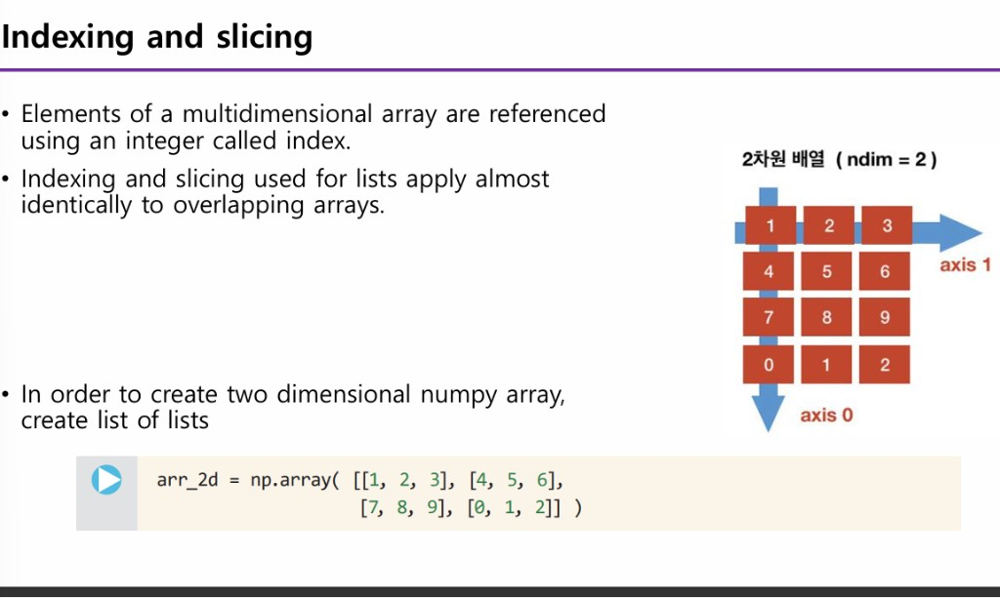

# 2025-03-19 ML 3강: NumPy · 배열과 축

## 강의 현황 (포인터)
- **1강** `20250306.md` — 머신러닝 개요·지도학습·선형회귀·경사하강법 · 데이터사이언스 개요·5단계·니즈·스킬 · 지도학습 예제(선형회귀)·향후 플랜
- **2강** `20250313.md` — 퀴즈 일정(3/19·3/26) · 비지도학습 · 분류·로지스틱 회귀 · 나이브 베이즈(식·용어집·Play·가우시안·구현) · 다변수 선형회귀 · 정규화·교차검증 · 복습·다음 강의
- **3강** 본 문서 `20250319.md` — **파이썬 라이브러리 개괄**(모듈·패키지·라이브러리) · **NumPy**(정의·필요성·동질성) · **타 라이브러리 비교**(Pandas·TensorFlow·OpenCV·scikit-learn) · **1D→2D→3D→n차원** 배열(ndarray·shape·ndim·axis)

## 퀴즈 일정
- **퀴즈 1:** 3/19(목) 수업 20분 전
- **퀴즈 2:** 3/26(목) 수업 20분 전

---

## 목차
1. [2강 복습 및 3강 개요](#1-2강-복습-및-3강-개요)
2. [파이썬 라이브러리란?](#2-파이썬-라이브러리란)
3. [NumPy란? 왜 필요한가?](#3-numpy란-왜-필요한가)
4. [NumPy와 타 라이브러리 비교](#4-numpy와-타-라이브러리-비교)
5. [NumPy 기본: 배열 생성과 용어](#5-numpy-기본-배열-생성과-용어)
6. [1D → 2D → 3D → n차원 배열](#6-1d--2d--3d--n차원-배열)
7. [인사이트 · 소구](#7-인사이트--소구-지금까지의-도출-및-웹그라운딩-보강)
8. [복습 및 다음 강의 플랜](#8-복습-및-다음-강의-플랜)

---

## 1. 2강 복습 및 3강 개요

**2강 요약**
- 비지도 학습(E = x만), 분류·로지스틱 회귀, 나이브 베이즈(베이즈 식·분자만 비교·Play), 다변수 선형회귀 \(\theta^T x\), 정규화·교차검증.

**3강에서 다룰 내용**
- **파이썬 라이브러리** 개념(모듈·패키지·라이브러리) → **NumPy**가 그중 하나임을 위치 짓기.
- **NumPy**: 과학 계산·머신러닝의 기반, 다차원 배열·고속 연산. **타 라이브러리(Pandas, TensorFlow, OpenCV, scikit-learn 등)와의 차이**.
- **1D → 2D → 3D → n차원** 배열까지 확장해 보기.

---

## 2. 파이썬 라이브러리란?

파이썬에서 **라이브러리**를 쓰기 전에, 모듈·패키지·라이브러리 관계를 짚고 넘어가면 NumPy의 위치가 분명해진다.

**모듈(Module)**
- **정의와 문장을 담은 .py 파일**이다. 함수·클래스·변수를 정의하고, 다른 파일에서 `import`로 불러 쓴다.
- 예: 내장 모듈 `math`, `random`, `os`, `datetime` 등.

**패키지(Package)**
- **모듈의 묶음**으로, 디렉터리 계층 구조로 된 모듈 모음이다. `__init__.py`를 갖는 디렉터리가 패키지로 인식된다.
- 여러 모듈을 네임스페이스로 묶어 대규모 코드를 관리할 때 쓴다.

**라이브러리(Library)**
- **여러 모듈·패키지를 묶어, 특정 기능·작업을 수행하는 코드 모음**이다. 재사용으로 개발 시간을 줄이고 품질을 높인다.
- **표준 라이브러리**(파이썬 기본 포함)와 **외부 라이브러리**(pip 등으로 설치)로 나뉜다.
- 예: pandas, numpy, matplotlib, PyTorch, TensorFlow, OpenCV, scikit-learn 등.

**계층:** 라이브러리 ⊃ 패키지 ⊃ 모듈.

> **참고:** [Python 공식 문서 — 모듈](https://docs.python.org/ko/3/tutorial/modules.html), 모듈·패키지·라이브러리 개념 정리 블로그 다수.

---

## 3. NumPy란? 왜 필요한가?

**정의:** NumPy는 **"Python에서 과학 계산을 위한 핵심 패키지"**이다. (NumPy is the fundamental package for scientific computing in Python.) 2005년경 과학 계산용으로 개발된 수치 연산 라이브러리이다.

**제공 기능**
- **다차원 배열 객체(ndarray)** — 벡터·행렬·텐서를 하나의 객체로 다룸.
- **파생 객체** — masked array, matrix 등.
- **배열에 대한 고속 연산(fast operations)** — 수학·논리·형상 변환·정렬·선택·I/O·이산 푸리에 변환·선형대수·통계·난수 시뮬레이션 등. C/Fortran 기반 구현으로 **속도가 빠르다**.

| 구분 | 내용 |
|------|------|
| 수학·논리 | 연산자, 합·곱·평균 등 |
| 형상 조작 | reshape, transpose 등 |
| 선형대수·통계 | 내적, 역행렬, 평균·분산 등 |
| 난수 | `np.random` |

**동질성(homogeneity)**
- NumPy 배열에는 **같은 dtype**만 저장된다. 리스트처럼 `[1, 2.5, "hello"]`처럼 섞을 수 없다.
- 그 결과 메모리 배치가 일정해 **데이터 처리·접근이 효율적**이다.

**리스트 대비**
- **리스트:** 원소별 연산·행렬 곱 등이 없고, 반복문으로 하면 느리다.
- **NumPy:** 동질 타입 + C 등 고속 루틴 → **연산이 풍부하고 속도가 높다**.  
→ "Numpy is preferred to list, because list lacks the operations and the speed is lower."

**왜 필요한가?**
- 머신러닝·데이터 사이언스에서는 데이터가 **숫자 벡터·행렬**로 다뤄진다. NumPy 배열이 그 기본 단위이며, Pandas·scikit-learn·TensorFlow 등 많은 라이브러리가 **내부적으로 NumPy 배열(또는 호환 텐서)을 사용**한다.

---

## 4. NumPy와 타 라이브러리 비교

NumPy는 **기반 레이어**이고, 다른 라이브러리들은 **목적별로 그 위에 쌓인다**. 역할이 다르므로 함께 쓰는 경우가 많다.

| 라이브러리 | 역할 | 데이터 구조·특징 | NumPy와의 관계 |
|------------|------|------------------|----------------|
| **NumPy** | 수치 연산·배열 연산의 기반 | ndarray, **동질 dtype**, 1D~nD | 기준. 다른 라이브러리가 의존 |
| **Pandas** | 테이블형 데이터 분석·전처리 | Series(1D), DataFrame(2D), **열마다 다른 타입 가능** | NumPy 기반. 내부 배열은 ndarray |
| **TensorFlow / PyTorch** | 딥러닝·자동 미분·GPU | 텐서(다차원), GPU 연산, 그래프/동적 그래프 | NumPy와 변환 가능(`.numpy()`, `torch.from_numpy()`) |
| **OpenCV** | 이미지·영상 처리, 컴퓨터 비전 | 이미지 = **NumPy 배열**(높이×너비×채널) | Python 바인딩이 NumPy 배열로 읽기/쓰기. OpenCV 2.2부터 이미지 저장에 NumPy 사용 |
| **scikit-learn** | 전통적 ML(분류·회귀·클러스터링 등) | 입력으로 **NumPy 배열 또는 희소 행렬** | fit/predict에 NumPy 배열 사용. 전처리·평가 지표 제공 |

**요약**
- **NumPy**: “숫자 배열을 빠르게 다룬다.” — 범용 수치 기반.
- **Pandas**: “표 형태 데이터를 다룬다.” — 행/열 레이블, 결측·그룹화·시계열. NumPy 위에 구축.
- **TensorFlow/PyTorch**: “신경망·GPU·자동 미분을 다룬다.” — NumPy와 상호 변환하며 사용.
- **OpenCV**: “이미지/영상을 읽고 가공한다.” — 메모리에서는 NumPy 배열.
- **scikit-learn**: “분류·회귀 등 ML 모델을 학습·평가한다.” — 입력은 주로 NumPy(또는 DataFrame).

실무에서는 **OpenCV로 이미지 읽기·전처리 → NumPy/PyTorch로 텐서 구성 → 모델 학습 → scikit-learn으로 지표 계산**처럼 조합해서 쓴다.

> **참고:** [NumPy vs Pandas (Kanaries)](https://docs.kanaries.net/ko/topics/NumPy/numpy-vs-pandas), [파이썬 빅데이터 분석 주요 라이브러리](https://alecompany.github.io/basicpy/basicPy-4/), OpenCV는 이미지 저장에 NumPy 배열 사용.

---

## 5. NumPy 기본: 배열 생성과 용어

**import**
- `import numpy as np` — 관례적으로 `np`를 별칭으로 쓴다.

**배열 생성**
- `np.array(...)` 로 다차원 배열(**ndarray**)을 만든다. Python 리스트·튜플을 넣으면 된다.

```python
import numpy as np
a = np.array([2, 3, 4])     # ndarray 객체 생성 (1차원)
```

**ndarray의 속성(properties)**  
NumPy의 다차원 배열(ndarray)은 구조와 데이터를 나타내는 **다섯 가지 핵심 속성**을 갖는다.

| 속성 | 의미 |
|------|------|
| **shape** | 배열의 **형상** — 각 차원의 크기를 나타내는 **정수 튜플** (예: 2D면 `(m, n)`) |
| **ndim** | **차원 수** — 배열의 축(axis) 개수, 즉 **랭크(rank)** (예: 1=벡터, 2=행렬) |
| **dtype** | 배열 **원소의 자료형**. ndarray는 모든 원소가 **같은 타입** (예: float64, int32) |
| **itemsize** | **원소 하나당 메모리 크기(바이트)**. 예: int32 → 32비트 = 32/8 = **4 bytes** |
| **size** | 배열 **전체 원소 개수**. shape가 `(m, n)`이면 size = **m × n** |

**속성 접근 예 (슬라이드와 동일)**
```python
a = np.array([2, 3, 4])
a.shape, a.ndim, a.dtype, a.itemsize, a.size
```
**출력:** `((3,), 1, dtype('int64'), 8, 3)`

| 출력값 | 해석 |
|--------|------|
| `shape` → `(3,)` | 축이 하나이고 길이가 3인 1차원 배열 |
| `ndim` → `1` | 1차원(벡터) |
| `dtype` → `dtype('int64')` | 원소가 64비트 정수 |
| `itemsize` → `8` | 원소 하나당 8 bytes (int64 = 64/8) |
| `size` → `3` | 원소 총 3개 |

**기본 용어**

| 용어 | 의미 |
|------|------|
| **요소(element / item)** | 배열 안의 각 값 (2, 3, 4) |
| **인덱스(index)** | 요소를 가리키는 정수, 0부터 시작 |
| **축(axis)** | NumPy에서 **차원**을 부르는 말. 1D는 axis 0만 존재 |
| **shape** | 위 속성 표 참고 — 차원별 크기 튜플 |

**1D 개념도:** `[ 2 | 3 | 4 ]` — axis 0 방향, shape `(3,)`. 리스트와 달리 이 속성들로 **최적화·벡터화 연산**의 기반이 된다.

---

## 6. 1D → 2D → 3D → n차원 배열

NumPy의 **ndarray**는 **같은 타입·같은 크기의 항목**을 담는 **n차원 컨테이너**이다. 차원별 크기는 **shape**(튜플)로 정의된다.

### 1차원 배열 (Vector)
- **축:** axis 0 하나.
- **shape:** `(m,)` — 원소가 m개인 1D.
- 예: `np.array([2, 3, 4])` → shape `(3,)`, ndim=1, size=3.

### 2차원 배열 (Matrix, 행렬)
- **축:** axis 0(행), axis 1(열).
- **shape:** `(m, n)` — m행 n열.
- 예: `np.array([[1,2,3], [4,5,6]])` → shape `(2, 3)`, ndim=2, size=6.

### 3차원 배열 (Tensor)
- **축:** axis 0, 1, 2 (예: 층·행·열 또는 채널·높이·너비).
- **shape:** `(k, m, n)` — 예) 이미지 배치: (배치 크기, 높이, 너비) 또는 (배치, 채널, 높이, 너비)에서 채널까지 포함하면 4D.
- 예: `np.zeros((2, 3, 4))` → shape `(2, 3, 4)`, ndim=3, size=24.

### 4차원 이상 (n차원)
- **축:** axis 0, 1, …, n-1. **n차원 배열은 n개의 축**을 가진다.
- **shape:** `(d₀, d₁, …, dₙ₋₁)` — 각 축의 크기.
- 예: 4D `(2, 3, 4, 5)` → 4개 축, size = 2×3×4×5 = 120.

**ndarray 주요 속성 (1D~n차원 공통)**

| 속성 | 의미 |
|------|------|
| **ndim** | **축(차원)의 개수** — 벡터=1, 행렬=2, 텐서=3 이상 |
| **shape** | **형상** — 각 차원의 크기를 나타내는 **정수 튜플** (예: `(m, n)`) |
| **size** | **전체 원소 개수** — shape가 `(m, n)`이면 size = m × n |
| **dtype** | **원소의 자료형** — 한 배열 안 모든 원소가 동일 (예: float64, int32) |
| **itemsize** | **원소 하나당 바이트 수** — 예: int32 → 4 bytes |

**코드로 확인**
```python
import numpy as np
a1 = np.array([1, 2, 3])                    # 1D, shape (3,),  ndim=1, size=3
a2 = np.array([[1,2,3], [4,5,6]])           # 2D, shape (2,3), ndim=2, size=6
a3 = np.array([[[1,2],[3,4]], [[5,6],[7,8]]])  # 3D, shape (2,2,2), ndim=3, size=8
# 1D: shape, ndim, dtype, itemsize, size (슬라이드와 동일)
print(a1.shape, a1.ndim, a1.dtype, a1.itemsize, a1.size)  # (3,) 1 dtype('int64') 8 3
print(a2.shape, a2.ndim, a2.size)            # (2, 3) 2 6
print(a3.shape, a3.ndim, a3.size)            # (2, 2, 2) 3 8
```

**다차원 축과 형상 (Axes of multi-dimensional arrays and insertion)**  
멀티디멘션(다차원)·멀티레이어를 만들 때 **차원에 따라 축(axis)이 어떻게 잡히는지**를 구분해야 한다. 같은 숫자 2, 3, 5라도 **1차원으로 둘 때**와 **2차원(행벡터/열벡터)으로 둘 때** shape와 축이 달라진다.

**1차원일 때**
- **shape:** `(3,)` — rank 1, 축 하나.
- **축:** **axis 0** 하나만 있으며, 원소가 늘어나는 방향은 **가로**(→).
- **코드:** `np.array([2, 3, 5])` — 대괄호 한 겹.
- **도식:** `[ 2 | 3 | 5 ]` (가로 한 줄), axis 0이 화살표 방향.

**2차원일 때 — 행벡터 (row vector)**
- **shape:** `(1, 3)` — 1행 3열, rank 2.
- **축:** **axis 0** = 세로(행 방향, 길이 1), **axis 1** = 가로(열 방향, 길이 3).
- **코드:** `np.array([[2, 3, 5]])` — 대괄호 두 겹(리스트 안에 리스트 하나).
- **도식:** 가로로 2, 3, 5 한 줄이지만 “행이 1개인 행렬”로 취급. axis 0은 아래로(↓), axis 1은 오른쪽으로(→).

**2차원일 때 — 열벡터 (column vector)**
- **shape:** `(3, 1)` — 3행 1열, rank 2.
- **축:** **axis 0** = 세로(행 방향, 길이 3), **axis 1** = 가로(열 방향, 길이 1).
- **코드:** `np.array([[2], [3], [5]])` — 각 원소가 자기 리스트로 한 행을 이룸.
- **도식:** 2, 3, 5가 **세로로** 쌓인 한 열. axis 0이 아래로(↓), axis 1은 오른쪽(→).

| shape | 의미 | 축 구성 | 코드 예 |
|-------|------|--------|--------|
| `(3,)` | 1차원, 원소 3개 | axis 0만 (가로) | `np.array([2, 3, 5])` |
| `(1, 3)` | 2차원, 1행 3열 | axis 0(행)=1, axis 1(열)=3 | `np.array([[2, 3, 5]])` |
| `(3, 1)` | 2차원, 3행 1열 | axis 0(행)=3, axis 1(열)=1 | `np.array([[2], [3], [5]])` |

**정리**
- **대괄호 중첩 수** = 차원 수. `[ ]` 한 번 → 1D, `[[ ]]` 두 번 → 2D.
- **2차원 이상**에서는 **axis 0 = 행(세로) 방향**, **axis 1 = 열(가로) 방향**으로 통일해서 생각하면 된다. 1D만 axis 0이 “한 줄” 방향.
- `(3,)`와 `(1, 3)`, `(3, 1)`은 원소 개수는 같아도 **shape·rank가 다르다**. 행렬 곱·broadcasting 할 때 shape가 맞아야 하므로 구분이 중요하다.

**3차원·4차원으로 확장할 때**
- **3D:** axis 0(층/배치), axis 1(행), axis 2(열). shape `(k, m, n)`.
- **4D:** axis 0, 1, 2, 3. 예) 이미지 배치: (배치, 채널, 높이, 너비).  
→ 차원이 올라갈수록 **앞쪽 축이 “더 바깥” 구조**(배치·채널 등)를, **뒷쪽 축이 “한 장 안”의 행·열**을 나타내는 식으로 확장된다.

**다차원 배열 생성 함수 (N-dimensional array and broadcasting)**  
NumPy는 **형상만 지정해** 다차원 배열을 쉽게 만드는 함수를 제공한다. (메모리 할당·초기값 설정에 유용.)

| 함수 | 설명 |
|------|------|
| **`np.zeros((n, m))`** | \(n \times m\) 배열, **모든 원소가 0** |
| **`np.ones((n, m))`** | \(n \times m\) 배열, **모든 원소가 1** |
| **`np.full((n, m), x)`** | \(n \times m\) 배열, **모든 원소가 임의의 수 \(x\)** |
| **`np.eye(n)`** | \(n \times n\) **단위행렬(identity matrix)** — 대각성분만 1, 나머지 0 |

- **단위행렬:** 행과 열 크기가 같은 정사각 행렬로, **대각 성분 = 1**, 그 외 = 0. 선형대수에서 \(I\)로 표기.
- shape는 **튜플**로 넘긴다. 3차원이면 `np.zeros((2, 3, 4))`처럼 사용.

```python
np.zeros((2, 3))   # 2×3, 모두 0
np.ones((2, 3))    # 2×3, 모두 1
np.full((2, 3), 7) # 2×3, 모두 7
np.eye(3)          # 3×3 단위행렬 [[1,0,0],[0,1,0],[0,0,1]]
```

> **참고:** 제목에 나오는 **broadcasting**은 shape가 다른 배열끼리 연산할 때의 규칙(자동 확장)을 말한다. 아래 `insert()`에서 스칼라를 넣을 때도 동일한 개념이 적용된다.

**축을 이용한 삽입: `insert()` (Axes of multi-dimensional arrays and insertion)**  
다차원 배열에서 **지정한 축(axis) 방향으로** 원소를 삽입할 때 쓴다. “어디에(인덱스)”와 “어느 방향으로(axis)”를 함께 지정한다.

**정의·인자**
- **첫 번째 인자:** 삽입 대상 **배열 객체**.
- **두 번째 인자:** 삽입할 **위치(인덱스)**.
- **세 번째 인자:** 삽입할 **값**(스칼라 또는 배열).
- **네 번째 인자:** 삽입 **방향**을 정하는 **`axis`**. 생략 시 1D로 flatten된 뒤 삽입한 것과 같다.

**Case ① 1차원 배열**
- 배열 `a = [1, 3, 4]`에서 인덱스 1 자리에 값 2를 넣는다.
- `np.insert(a, 1, 2)` → `array([1, 2, 3, 4])`.
- 1D에서는 축이 하나뿐이므로 “한 줄”에서 위치만 정하면 된다.

**Case ② 2차원 배열 — axis에 따른 삽입 방향**

기준 배열: `b = np.array([[1, 1], [2, 2], [3, 3]])` — shape `(3, 2)` (3행 2열).

| axis | 삽입 방향 | 의미 | 결과 shape |
|------|-----------|------|------------|
| **axis=0** | 행 방향(세로) | “인덱스 1” 위치에 **새 행** 추가 | 행 하나 증가 → `(4, 2)` |
| **axis=1** | 열 방향(가로) | “인덱스 1” 위치에 **새 열** 추가 | 열 하나 증가 → `(3, 3)` |

**axis=0 (행 삽입)**  
- `np.insert(b, 1, 4, axis=0)`  
- 인덱스 1에 **한 행**을 넣는다. 넣는 값이 스칼라 `4` 하나이면, **broadcasting**으로 그 행을 채울 길이만큼 자동 확장된다. → 새 행은 `[4, 4]`.  
- **결과:** `[[1, 1], [4, 4], [2, 2], [3, 3]]`, shape `(4, 2)`.

**axis=1 (열 삽입)**  
- `np.insert(b, 1, 4, axis=1)`  
- 인덱스 1에 **한 열**을 넣는다. 스칼라 `4`는 **broadcasting**으로 열 길이(행 개수 3)만큼 확장된다. → 새 열은 `[4, 4, 4]`.  
- **결과:** `[[1, 4, 1], [2, 4, 2], [3, 4, 3]]`, shape `(3, 3)`.

**2차원 배열에서 브로드캐스팅이 일어나는 원리**

2D에서 `insert(..., axis=...)` 할 때, “한 행” 또는 “한 열”이라는 **한 줄의 데이터**가 새로 생긴다. 그 한 줄을 채우려면 **그 줄의 길이**만큼 값이 있어야 하는데, 스칼라 하나만 주면 NumPy가 **그 길이만큼 같은 값을 복제**해서 채운다. 이게 2D insert에서의 브로드캐스팅 원리다.

| 구분 | 삽입되는 것 | “한 줄”의 길이 = 어떤 축의 크기? | 스칼라 → 채워지는 모양 |
|------|-------------|----------------------------------|--------------------------|
| **axis=0** | **한 행** | 행은 **열 방향**으로 늘어나므로 → **열 개수** = 2 | `4` → `[4, 4]` (열 2개분) |
| **axis=1** | **한 열** | 열은 **행 방향**으로 늘어나므로 → **행 개수** = 3 | `4` → `[4, 4, 4]` (행 3개분) |

**원리 정리**
1. **삽입은 “axis 방향으로 한 칸”이 늘어나는 것**이다. axis=0이면 행이 하나 추가되고, axis=1이면 열이 하나 추가된다.
2. **추가된 그 한 줄(한 행 또는 한 열)은 “axis가 아닌 나머지 축”을 따라 존재한다.**  
   - 새 **행** 한 줄 → 그 줄 안에는 **열(axis=1)** 개수만큼 칸이 있음 → 길이 = `shape[1]` = 2.  
   - 새 **열** 한 줄 → 그 줄 안에는 **행(axis=0)** 개수만큼 칸이 있음 → 길이 = `shape[0]` = 3.
3. **넣는 값이 스칼라 하나**이면, NumPy는 “그 한 줄의 길이”만큼 **같은 값을 복제**해서 채운다.  
   - axis=0: 길이 2 → `[4, 4]`  
   - axis=1: 길이 3 → `[4, 4, 4]`  
   이 복제·확장이 **브로드캐스팅**이다.
4. 일반적으로 **2D shape가 `(행, 열) = (m, n)`**일 때:  
   - **axis=0으로 삽입** → 새 행 1개 → 그 행을 채우는 원소 수 = **n** → 스칼라는 **n번** 복제.  
   - **axis=1으로 삽입** → 새 열 1개 → 그 열을 채우는 원소 수 = **m** → 스칼라는 **m번** 복제.

즉, “**삽입 축을 제외한 나머지 축의 크기**”만큼 스칼라가 반복되어, 한 행/한 열 전체를 같은 값으로 채우는 것이 2차원 insert 시 브로드캐스팅의 원리다.

**연관 개념 그라운딩**

| 개념 | insert()와의 연결 |
|------|-------------------|
| **axis** | 삽입이 “어느 차원을 따라” 일어날지 결정. axis=0 → 행이 늘어남, axis=1 → 열이 늘어남. |
| **broadcasting** | 스칼라 하나를 넣으면, **삽입되는 축을 제외한 나머지 축의 크기**에 맞춰 자동으로 채워진다. 행 한 줄을 넣을 때는 열 개수만큼, 열 하나를 넣을 때는 행 개수만큼. |
| **shape 변화** | 해당 axis 방향으로 크기가 1만큼 증가. (3,2) → axis=0 삽입 시 (4,2), axis=1 삽입 시 (3,3). |

**요약 소구**
- `insert()`는 **위치(인덱스) + 축(axis)** 로 “어디에, 어떤 방향으로” 삽입할지 정한다.
- 2D에서 **axis=0 = 행 삽입**, **axis=1 = 열 삽입**으로, 앞서 정리한 “axis 0=행·axis 1=열”과 일치한다.
- 스칼라를 넣으면 **그 축을 따라 broadcasting**되어, 한 행/한 열 전체가 같은 값으로 채워진다. 배열을 넣으면 해당 shape가 axis 방향과 맞아야 한다.

**축을 이용한 뒤집기: `flip()` (Axes of multi-dimensional arrays and insertion)**  
지정한 **축(axis)을 따라** 배열 원소의 **순서를 거꾸로** 만든다. 이미지 좌우·상하 반전, 시퀀스 역순 등에 쓴다.

**정의**
- **`flip()`:** Reverse the order of elements in an array **along the given axis**.  
  → “주어진 축을 따라” 원소 순서를 뒤집는다.

**기준 배열 (슬라이드와 동일)**  
`c = np.array([[1, 2, 3], [4, 5, 6]])` — shape `(2, 3)` (2행 3열).  
- 0행: `[1, 2, 3]`  
- 1행: `[4, 5, 6]`

**axis=1 (열 방향 뒤집기 — 가로 뒤집기)**  
- **코드:** `np.flip(c, axis=1)`  
- **동작:** **각 행 안에서** 원소 순서가 반대로 바뀐다. 열(가로) 방향으로 뒤집힌다.  
- **결과:**  
  - 0행: `[1,2,3]` → `[3, 2, 1]`  
  - 1행: `[4,5,6]` → `[6, 5, 4]`  
- **출력:** `array([[3, 2, 1], [6, 5, 4]])`. 행의 순서는 그대로, 행 안의 원소만 역순.

**axis=0 (행 방향 뒤집기 — 세로 뒤집기)**  
- **코드:** `np.flip(c, axis=0)`  
- **동작:** **행 자체의 순서**가 반대로 바뀐다. 열(행 안 원소) 순서는 유지된다.  
- **결과:**  
  - 위에 있던 행 `[1, 2, 3]`이 아래로, 아래에 있던 행 `[4, 5, 6]`이 위로.  
- **출력:** `array([[4, 5, 6], [1, 2, 3]])`. 행만 위아래로 뒤집힌다.

| axis | 뒤집기 방향 | 의미 | 결과 예 (c 기준) |
|------|-------------|------|-------------------|
| **axis=1** | 가로(열 방향) | 각 행 **안**의 원소 순서 반전 | `[[3,2,1], [6,5,4]]` |
| **axis=0** | 세로(행 방향) | **행**의 순서 반전, 행 안 순서는 유지 | `[[4,5,6], [1,2,3]]` |

**연관 개념 (insert와의 일관성)**  
- **axis=0** = 행(세로) 방향 → `flip(axis=0)`은 “행 순서”를 뒤집는다(세로 뒤집기).  
- **axis=1** = 열(가로) 방향 → `flip(axis=1)`은 “각 행 안의 열 순서”를 뒤집는다(가로 뒤집기).  
- `insert`에서 axis가 “삽입이 일어나는 방향”이었던 것처럼, `flip`에서 axis는 **“순서를 뒤집는 방향”**이다. shape는 변하지 않는다.

**요약 소구**
- `flip(arr, axis=k)`는 **axis k를 따라** 원소 순서만 반대로 바꾼다. 원본 shape·dtype 유지.
- 2D에서 **axis=1 → 가로 뒤집기**(열 순서 반전), **axis=0 → 세로 뒤집기**(행 순서 반전).
- 이미지 처리(좌우/상하 반전), 시퀀스 역순, 데이터 순서 보정 등에 사용.

**flip()의 내부 동작 — 유저가 보는 “이미지 전환”과 배열이 어떻게 바뀌는지 (실예)**  
유저가 “세로로 뒤집기” 또는 “가로로 뒤집기”를 선택하면, 화면에 보이는 이미지는 위아래 또는 좌우가 뒤바뀐 것처럼 보인다. **내부에서는** 해당 axis를 따라 **인덱스 순서만 반대**로 읽도록 바꾼다. 원소 값 자체는 그대로이고, **어느 (행,열) 위치에 어떤 값이 오는지**만 바뀐다.

**실예: 3×3 “이미지” 배열**  
픽셀처럼 생각할 배열을 하나 두고, flip 전후의 **위치(인덱스) ↔ 값** 대응을 보면 된다.

```python
img = np.array([[11, 12, 13],    # 0행: 위
                [21, 22, 23],    # 1행
                [31, 32, 33]])   # 2행: 아래
# shape (3, 3). 유저가 보는 “이미지”: 위쪽이 11,12,13 / 아래쪽이 31,32,33.
```

- **세로 뒤집기 (axis=0)** — “이미지가 위아래로 뒤집힌다.”  
  - **내부:** 행 순서만 반전. 원래 인덱스 (0,0),(0,1),(0,2)에 있던 값이 **(2,0),(2,1),(2,2) 자리로** 가고, (2,0),(2,1),(2,2)에 있던 값이 **(0,0),(0,1),(0,2)로** 온다.  
  - `np.flip(img, axis=0)` 결과:
  ```text
  [[31, 32, 33],   ← 원래 2행이 0행 자리로
   [21, 22, 23],
   [11, 12, 13]]   ← 원래 0행이 2행 자리로
  ```
  - **정리:** flip 함수는 “axis 방향으로 인덱스 0↔끝, 1↔끝-1, …” 식으로 **읽는 순서만 바꾼다.** 메모리에는 새 배열이 만들어진다(복사). 유저가 보는 “세로 뒤집힌 이미지”는 이 새 배열을 그대로 0행=위, 1행=중간, 2행=아래로 그리면 된다.

- **가로 뒤집기 (axis=1)** — “이미지가 좌우로 뒤집힌다.”  
  - **내부:** 각 행 **안에서** 열 순서만 반전. (0,0)→(0,2), (0,1)→(0,1), (0,2)→(0,0) 등.  
  - `np.flip(img, axis=1)` 결과:
  ```text
  [[13, 12, 11],
   [23, 22, 21],
   [33, 32, 31]]
  ```
  - **정리:** axis=1이면 “열 인덱스”만 0↔2, 1은 그대로. 화면에서는 각 행이 좌우 대칭으로 그려진다.

**결론 (flip 내부)**  
- flip은 **값을 바꾸는 게 아니라**, “**어느 (행,열)에 어떤 값을 넣을지**”를 axis 기준으로 **역순**으로 배치한 **새 배열**을 만든다.  
- 유저가 보는 “버티컬/호리즌탈 전환”은, 이렇게 만든 배열을 **같은 좌표 규칙(0행=위, 0열=왼쪽)** 으로 다시 그리면 얻어진다.

**인덱싱과 슬라이싱 (Indexing and slicing)**  
다차원 배열의 **원소에 접근**하거나 **일부 구간을 잘라낼** 때 쓰는 방식이다. Python 리스트의 인덱싱·슬라이싱과 **거의 동일**하게 적용된다.

**원리**
- 다차원 배열의 각 원소는 **정수 인덱스(index)** 로 참조한다.
- **인덱싱:** 한 개 또는 여러 축의 위치를 지정해 **한 원소** 또는 **하위 배열**을 가져온다.
- **슬라이싱:** `start:stop:step` 형태로 **구간**을 지정해 부분 배열을 만든다. 리스트와 같은 규칙(시작 포함, 끝 미포함 등)을 따른다.
- **2차원 배열**을 만들 때는 **리스트의 리스트(list of lists)** 를 `np.array()`에 넣는다.

**기준 배열 (슬라이드와 동일)**
```python
arr_2d = np.array([[1, 2, 3], [4, 5, 6],
                   [7, 8, 9], [0, 1, 2]])
```
- shape `(4, 3)` — 4행 3열.  
- 0행: `[1, 2, 3]`, 1행: `[4, 5, 6]`, 2행: `[7, 8, 9]`, 3행: `[0, 1, 2]`.

**2차원 배열 구조와 축 (ndim=2)**

아래는 강의 슬라이드에 나온 2차원 배열 도식이다. **axis 0**은 세로(행) 방향, **axis 1**은 가로(열) 방향을 가리킨다.



*그림: 2차원 배열 (ndim=2). axis 0 = 행 방향(↓), axis 1 = 열 방향(→).*

| 축 | 방향 | 의미 |
|----|------|------|
| **axis 0** | 세로(↓) | 행 — 첫 번째 차원 |
| **axis 1** | 가로(→) | 열 — 두 번째 차원 |

**인덱싱 예**
- `arr_2d[0, 0]` → **1** (0행 0열).
- `arr_2d[3, 2]` → **2** (3행 2열).
- `arr_2d[1, 1]` → **5**.  
- 2D에서는 `arr_2d[행인덱스, 열인덱스]` 순서로 쓴다.

**슬라이싱 예**
- `arr_2d[0:2, :]` — **처음 두 행 전체**. 행 0~1, 열 전부. 결과 shape `(2, 3)`.
- `arr_2d[:, 1]` — **두 번째 열 전체**. 행 전부, 열 1만. 결과 shape `(4,)` (1D).
- `arr_2d[1:3, 0:2]` — 행 1~2, 열 0~1 부분. 결과 shape `(2, 2)`.
- `arr_2d[::2, :]` — **짝수 행만** (0, 2행). step=2.

---

**슬라이싱 상세: 지칭 대상 · 문법 명칭 · 근거 · 적용 예시**

**1. 지칭 대상 (무엇을 자르는가)**  
- **대상:** NumPy **ndarray**(다차원 배열). 2차원이면 **행(axis 0)** 과 **열(axis 1)** 두 축이 있다.  
- 슬라이싱은 “해당 축을 따라 **구간**을 정해, 그 **교집합**만 남기는 연산”이다.  
- 따라서 “배열 전체 → 축별로 범위를 제한 → 부분 배열”이 지칭 순서다. 먼저 **어떤 배열**인지, 그다음 **각 축에서 어떤 범위**인지를 지정한다.

**2. 문법 요소의 명칭과 이유**

| 기호 | 명칭 | 의미 | 이유·효과 |
|------|------|------|-----------|
| **`:`** (콜론) | 범위 지정자 | `start:stop` — **start는 포함**, **stop은 미포함**. 구간은 `[start, stop)` | stop을 미포함으로 하면 **구간 길이 = stop − start**로 단순해지고, 여러 구간을 이어 붙일 때 경계가 겹치지 않는다. (Python·NumPy 공통) |
| **`start:`** | 시작만 지정 | “start 인덱스부터 **끝까지**” | stop 생략 = 해당 축의 마지막까지. |
| **`:stop`** | 끝만 지정 | “처음부터 stop **바로 전**까지” | start 생략 = 0으로 간주. |
| **`:`** (단독) | 전 구간 | “해당 축 **전부**” | 행/열 중 하나만 골라 자를 때 나머지 축은 `:`로 “전부” 지정. |
| **`,`** (쉼표) | 축 구분자 | **앞** = axis 0(행), **뒤** = axis 1(열) | 다차원에서 **한 괄호 `[ ]` 안**에 축별 슬라이스를 나열. `[행용, 열용]` 순서. |
| **`::step`** (이중 콜론) | 보폭(step) | `start:stop:step`에서 start·stop 생략 시 **전 구간**에 step 적용 | `::2` = 0, 2, 4, … 처럼 **격자·스트라이드**로 뽑을 때 사용. |

**2-1. 슬라이스 조합 일람 (`:`, `1:`, `:1`, `1:1`, `::2`, `2::`, `:2:` 등)**  
한 축에서 쓸 수 있는 **콜론 조합**을 정리한다. 기준: `start:stop:step` — start 포함, stop 미포함, step만큼 건너뜀. 길이 6인 1D 배열 `a = [0,1,2,3,4,5]`로 예시.

| 문법 | 의미 (start, stop, step) | 예시 `a[...]` (길이 6) | 결과 |
|------|---------------------------|-------------------------|------|
| **`:`** | 전 구간 (0부터 끝까지, step=1) | `a[:]` | `[0,1,2,3,4,5]` |
| **`1:`** | start=1, stop=끝, step=1 | `a[1:]` | `[1,2,3,4,5]` (인덱스 1~5) |
| **`:1`** | start=0, stop=1, step=1 | `a[:1]` | `[0]` (인덱스 0만) |
| **`1:1`** | start=1, stop=1 → **빈 구간** | `a[1:1]` | `[]` |
| **`1:4`** | start=1, stop=4 (4 미포함) | `a[1:4]` | `[1,2,3]` |
| **`::2`** | start=0, stop=끝, **step=2** | `a[::2]` | `[0,2,4]` (0번, 2번, 4번) |
| **`2::`** | start=2, stop=끝, step=1 | `a[2:]` 와 동일 | `[2,3,4,5]` |
| **`:2:`** | start=0, stop=2, step=1 | `a[:2]` 와 동일 | `[0,1]` |
| **`1::2`** | start=1, stop=끝, step=2 | `a[1::2]` | `[1,3,5]` (1번, 3번, 5번) |
| **`:4:2`** | start=0, stop=4, step=2 | `a[:4:2]` | `[0,2]` |
| **`2:5:2`** | start=2, stop=5, step=2 | `a[2:5:2]` | `[2,4]` |
| **`::-1`** | start=끝, stop=시작, step=-1 (**역순**) | `a[::-1]` | `[5,4,3,2,1,0]` |

**읽는 법**
- **콜론 개수:** `:` 하나 = `start:stop`, `::` = step까지 포함 `start:stop:step`.  
- **생략 규칙:** 앞을 비우면 start=0, 뒤를 비우면 stop=끝, step 생략=1.  
- **`1:1`** 은 “1부터 1 미만”이라 원소가 없음. **`2::`** 는 “2부터 끝까지”, **`:2:`** 는 “처음부터 2 미만”이므로 `:2`와 같다.  
- **`::2`** 는 “처음부터 끝까지 2칸씩” → 0, 2, 4, …  
- **`::-1`** 은 step이 음수라 **역순**이 된다.

**3. 근거·조건**

- **start 포함, stop 미포함:** Python 리스트와 동일. 슬라이스 결과의 **원소 개수**가 `max(0, stop − start)`(step=1일 때)로 정해진다.  
- **2D에서 `[행, 열]` 순서:** axis 0이 먼저, axis 1이 나중이므로 `arr[행슬라이스, 열슬라이스]`가 된다.  
- **NumPy와 리스트 차이:** 리스트는 `arr_2d[1:][0:2]`처럼 **차원마다 괄호를 나눠** 쓸 수 있지만, NumPy는 **쉼표로 한 번에** `arr_2d[1:, 0:2]`로 쓴다. 의미는 “1행부터 끝까지” ∩ “0~1열”이다.

**4. 적용 예시 (슬라이드 기준)**

**예 1 — `arr_2d[1:, 0:2]` (넘파이 스타일 슬라이싱)**  
- **대상:** `arr_2d` (4×3).  
- **행:** `1:` → 인덱스 1부터 끝까지 → 1, 2, 3행 (3개).  
- **열:** `0:2` → 인덱스 0 포함, 2 **미포함** → 0, 1열 (2개).  
- **결과:** 3×2 부분 배열.  
  ```text
  [[4, 5],
   [7, 8],
   [0, 1]]
  ```  
- *비교:* `arr_2d[1:][0:2]`는 “먼저 1행~끝으로 자른 뒤, 그 결과에서 0~2행”이라 **행 선택이 달라진다.** NumPy는 `[1:, 0:2]`로 **한 번에** 행·열을 동시에 지정한다.

**예 2 — 4×4 배열 기준 8가지 패턴 (개념 정리)**  

기준: `nd_array` shape `(4, 4)`.

| 코드 | 지칭 대상 | 결과 의미 | shape 예 |
|------|-----------|-----------|----------|
| `nd_array` | 배열 전체 | 괄호 없이 변수만 | (4, 4) |
| `nd_array[0]` | **한 행** | 0행 전체 (axis 0만 인덱싱) | (4,) |
| `nd_array[1:]` | **1행부터 끝까지** | 1, 2, 3행 전체 | (3, 4) |
| `nd_array[1:, 2]` | 1행~끝 **중 2열만** | 행은 슬라이스, 열은 인덱스 → 1D | (3,) |
| `nd_array[1:3, 1:3]` | **부분 행렬** | 행 1~2, 열 1~2 (2×2) | (2, 2) |
| `nd_array[::2, ::2]` | **격자(step)** | 0·2행, 0·2열 교차 (2×2) | (2, 2) |
| `nd_array[::2]` | **짝수 행만** | 0행, 2행 전체 | (2, 4) |
| `nd_array[:, 2]` | **2열 전체** | 모든 행, 2열만 | (4,) |

**5. 맥락별 적용**

- **행/열만 뽑기:** `arr[:, j]`(j열), `arr[i, :]`(i행). 한 축은 인덱스, 나머지는 `:`.
- **부분 행렬(서브리전):** `arr[1:3, 0:2]` — 학습 데이터 구간, 이미지 ROI 등.
- **격자·다운샘플:** `arr[::2, ::2]` — step으로 건너뛰기. 시각화·전처리에서 해상도 줄일 때.
- **마스크·필터와 조합:** 슬라이스로 구간을 정한 뒤 연산·마스킹을 적용하는 패턴이 많다.

**요약 (슬라이싱)**  
- **대상:** ndarray; 축별로 **구간**을 정해 **교집합**만 취한다.  
- **`:`** = 범위( start 포함, stop 미포함 ); **`,`** = 축 구분(행, 열); **`::step`** = 보폭.  
- **근거:** stop 미포함 → 길이·shape 계산이 단순하고, NumPy는 **쉼표로 축을 한꺼번에** 지정한다.  
- **적용:** 행/열만 선택, 부분 행렬, step으로 격자·다운샘플.

**슬라이싱과 확대·축소 / 뷰·복사 / 공차·마스킹**

**확대·축소에 대한 슬라이싱**
- **확대(zoom in):** 보이는 영역을 **좁히는** 것 → **더 작은 구간**만 슬라이스로 선택한다. 예: `img[1:3, 1:3]` (4×4 중 가운데 2×2). 결과 배열의 shape가 작아지고, 화면에 그리면 “확대된 것처럼” 보인다.
- **축소(zoom out) 또는 해상도 낮추기:** **step**으로 건너뛰어 **더 적은 원소**만 사용한다. 예: `img[::2, ::2]` (2칸씩만 취함). 원본보다 작은 shape가 되고, “축소·다운샘플” 효과다.
- 둘 다 **슬라이싱 문법(start:stop:step)** 으로 “어떤 인덱스 구간·간격을 볼지”만 정할 뿐, 별도의 “확대/축소 전용 함수”가 있는 것은 아니다.

**슬라이싱 후 “다시 확대해서 들어가” — 기억 함수가 있나?**  
NumPy에는 **슬라이싱 결과를 저장해 두었다가 자동으로 “원래 전체로 되돌리는” 기억 함수**가 없다.  
- 슬라이싱이 반환하는 것은 **뷰(view)** 또는 **복사(copy)** 이다.  
  - **뷰:** 원본과 **같은 메모리**를 가리키고, 일부 구간만 보이게 한 “창”에 가깝다. 원본 배열을 가리키는 **변수(예: `img`)를 그대로 두면**, `img`로 접근할 때마다 **전체 배열**이 있다. 따라서 “확대”할 때 `zoomed = img[1:3, 1:3]`처럼 변수만 따로 두고, “다시 전체로” 가고 싶으면 **`img`를 다시 쓰면** 된다. **별도 기억 함수 없이**, 원본 참조를 변수에 유지하는 방식으로 “다시 확대해서 들어가는” 효과를 낸다.  
  - **복사:** 슬라이스 결과가 **새 메모리**에 복사되면, 그 결과만 있는 배열이다. “원래 전체”로 되돌리려면 **원본 배열을 참조하는 변수를 지우지 않고** 두었을 때만, 그 변수로 다시 전체에 접근할 수 있다.  
- **정리:** “다시 확대해서 들어가기”는 **슬라이스 전에 원본 배열을 변수에 두고, 그 변수를 계속 쓰는지**에 달려 있다. 슬라이싱 자체가 “기억 함수”를 제공하는 것이 아니라, **원본 참조를 프로그래머가 유지**해야 한다.

**슬라이싱은 “공차” 쪽인가, “마스킹” 쪽인가 — 프로그램 작동**  
- **슬라이싱**은 **인덱스의 범위와 간격(공차)** 을 정하는 방식이다. `start:stop:step`에서 **step**이 곧 “몇 칸씩 건너뛸지”의 **공차**에 해당한다. 연속이면 step=1, 2칸씩이면 step=2. 프로그램 내부에서는 “시작 인덱스, 끝 인덱스, 보폭”으로 **어떤 위치들을 골라서** 하나의 배열(뷰 또는 복사)을 만든다. **조건(참/거짓)** 으로 골라내는 것이 아니다.  
- **마스킹(masking)** 은 보통 **불리언 배열** 또는 **조건식**으로 “해당 위치가 True인 원소만” 고르는 방식이다. 예: `arr[arr > 5]`, `arr[mask]`. 조건을 만족하는 **위치만** 모아서(보통 **복사**로) 새 배열을 만든다. “공차”가 아니라 “**어디가 True인가**”로 동작한다.  
- **비교:**  
  - **슬라이싱** = “**구간·공차**로 위치를 정함” → 뷰 또는 복사.  
  - **마스킹** = “**조건(불리언)** 으로 위치를 정함” → 보통 복사.  
  - 확대·축소처럼 “일부 영역만 보기” 또는 “등간격으로 줄이기”는 **슬라이싱(공차)** 에 가깝고, “값이 5보다 큰 것만” 같은 것은 **마스킹**에 가깝다.

---

**불리언이란? — 논리 인덱싱(Logical indexing)으로 “파이썬답게” 쓰기**  
슬라이싱이 “구간·공차”로 위치를 정한다면, **조건(참/거짓)** 으로 위치를 정하는 것이 **논리 인덱싱**이다. 이때 쓰는 값이 **불리언(Boolean)** 이다.

**불리언(Boolean)이란**  
- **참(True)** 과 **거짓(False)** 두 가지만 가지는 **논리형** 자료다.  
- 비교·조건식의 결과가 불리언이다. 예: `3 > 2` → True, `4 % 2 == 0` → True.  
- NumPy에서는 **같은 shape의 불리언 배열**을 만들어 “어느 위치를 쓸지”를 True/False로 표시한다. 이 배열을 **마스크(mask)** 라고 부른다.

**논리 인덱싱의 정의 (슬라이드)**  
- “NumPy array of **Boolean values** on one axis to specify the **indices you want to access**.”  
- → **한 축(또는 배열 전체와 같은 shape)** 에 불리언 값을 두고, **True인 위치만** 골라 접근하는 방식.

**실예: 4×4 배열에서 짝수만 뽑기 (슬라이드와 동일)**  

1) **원본 배열**
```python
np_array = np.array([[1,2,3,4], [5,6,7,8], [9,10,11,12], [13,14,15,16]])
```

2) **조건 → 불리언 배열(마스크)**  
“2로 나눈 나머지가 0이면 짝수”라는 **조건**을 배열 전체에 적용하면, 원소별로 True/False가 나온다. 이게 **마스크**다.
```python
np_array % 2 == 0
# 결과 (4×4 불리언 배열):
# array([[False,  True, False,  True],
#        [False,  True, False,  True],
#        [False,  True, False,  True],
#        [False,  True, False,  True]])
```
- 짝수(2, 4, 6, 8, …) 위치만 True, 홀수 위치는 False.

3) **마스크로 인덱싱 — 논리 인덱싱**  
`arr[불리언_배열]`을 쓰면, **True인 위치의 원소만** 골라서 **1차원**으로 펼쳐 반환한다.
```python
np_array[np_array % 2 == 0]
# 결과: array([ 2,  4,  6,  8, 10, 12, 14, 16])
```
- 4×4에서 짝수 8개만 골라 **1D 배열**이 된다. (슬라이드 도식: 원본 → 마스크(True/False) → 추출된 1D.)

**NumPy 배열을 “불리언으로 잡아서” 쓰는 패턴**  
- **1단계:** NumPy 배열에 **조건식**을 적용 → `arr > 5`, `arr % 2 == 0`, `(arr >= 0) & (arr <= 10)` 등. 결과는 **같은 shape의 불리언 배열**.  
- **2단계:** 그 불리언 배열을 **인덱스**로 쓴다 → `arr[arr > 5]`. “True인 위치만” 추출된 1D 배열이 나온다.  
- **포바이포(for-by-for)** 즉 반복문으로 일일이 `if` 돌리지 않고, **배열 단위 연산**으로 한 번에 필터링한다. 이게 “NumPy + 논리 인덱싱을 최대한 활용”하는 방식이다.

**파이썬을 파이썬답게 하는 부분**  
- **벡터화:** 조건을 배열 전체에 적용하고, 불리언 배열로 한 번에 인덱싱하면 **C 수준으로 빠른** 연산이 된다.  
- **읽기 쉬운 한 줄:** `arr[arr % 2 == 0]`는 “짝수만 뽑는다”가 그대로 드러난다. 반복문과 if를 여러 줄 쓰는 것보다 **의도가 분명**하다.  
- **재사용:** 마스크를 변수에 두고 `arr[mask]`, `arr[~mask]`(반대), `arr[mask] = 0`(마스킹된 위치만 0으로) 등으로 조합할 수 있다.  
- 그래서 **논리 인덱싱(불리언 마스크)** 는 NumPy·판다스에서 “조건에 맞는 것만 고르기”를 할 때 **가장 파이썬답고** 자주 쓰는 방법이다.

**요약 (불리언·논리 인덱싱)**  
- **불리언** = True/False. 조건식의 결과.  
- **논리 인덱싱** = **같은 shape의 불리언 배열(마스크)** 로 “True인 위치만” 지정해 `arr[mask]`로 추출. 결과는 보통 1D.  
- **NumPy 배열 + 논리 인덱싱** = 조건을 배열 전체에 적용해 마스크를 만들고, 그 마스크로 한 번에 필터링. 반복문 없이 **파이썬답게** 활용하는 대표 패턴.

---

**연관 개념**
- **axis 0·1**은 `insert`, `flip`, `sum(axis=...)` 등에서와 같이 **행(0)·열(1)** 로 통일된다. 인덱싱에서도 `[행, 열]` 순서와 맞는다.
- 슬라이싱은 **뷰(view)** 또는 **복사** depending on 경우가 있으므로, 값을 바꾼 뒤 원본이 바뀌는지 확인하는 습관이 좋다.
- **논리 인덱싱**은 앞서 말한 “마스킹”(조건·불리언으로 위치를 정함)의 구체적인 형태다.

**요약 소구**
- **인덱싱:** `arr[i, j]` — (i행, j열) 한 원소. 0부터 시작.
- **슬라이싱:** `arr[행슬라이스, 열슬라이스]` — `start:stop:step`으로 구간 선택. 리스트와 동일 규칙.
- **논리 인덱싱:** `arr[조건]` 또는 `arr[불리언_배열]` — True인 위치만 추출. 마스킹의 대표 수단.
- 2D 배열 = 리스트의 리스트로 생성; **axis 0 = 행**, **axis 1 = 열**로 인덱싱·슬라이싱과 axis 기반 연산이 일치한다.

**리덕션 (Reduction) — 집계 함수**  
여러 개의 수로 이루어진 배열을 **하나의 수(또는 더 낮은 차원의 배열)로 집계**하는 것을 **리덕션(reduction)** 이라 한다. NumPy의 **집계 함수**는 이 연산을 **벡터화 연산**으로 제공한다.

**정의 (슬라이드)**  
- **Reduction:** “Aggregating an array of numbers into a single number.” (숫자 배열을 하나의 수로 집계하는 것.)  
- “여러 개의 수로 이루어진 배열을 하나의 수로 집계하는 것을 리덕션이라 합니다.”

**대표 집계 함수**  
- **`sum()`** — 합  
- **`mean()`** — 평균  
- **`min()`** — 최솟값  
- **`max()`** — 최댓값  

리덕션 연산은 **벡터화 연산(vectorization)** 이다. 반복문 없이 한 번에 축 방향으로 집계한다.

**axis에 따른 리덕션 (2D 예: 슬라이드 기준)**  
기준 배열 `arr`: 5×5, 1행은 1들, 2행은 2들, … 5행은 5들.

| 호출 | 방향 | 의미 | 결과 shape | 결과 예 (arr 기준) |
|------|------|------|------------|---------------------|
| **`arr.sum(axis=1)`** | **가로(열 방향)** | 각 **행**을 따라 합 → 행마다 하나의 값 | (5,) | `[5, 10, 15, 20, 25]` (1+1+1+1+1=5, 2+2+…=10, …) |
| **`arr.sum(axis=0)`** | **세로(행 방향)** | 각 **열**을 따라 합 → 열마다 하나의 값 | (5,) | `[15, 15, 15, 15, 15]` (1+2+3+4+5=15가 5열) |
| **`arr.sum(axis=(0, 1))`** | **전체** | 모든 축을 따라 합 → **스칼라** | () | **75** (전체 원소 합) |

**해석**
- **axis=1:** “axis 1 방향으로 줄인다” → axis 1(열)이 사라지고, **행(axis 0)만 남는다**. 그래서 **각 행**에 대해 “그 행 안의 열들을 합”한 값이 나온다. 결과는 **세로**로 쌓인 벡터.
- **axis=0:** “axis 0 방향으로 줄인다” → axis 0(행)이 사라지고, **열(axis 1)만 남는다**. **각 열**에 대해 “그 열 안의 행들을 합”한 값. 결과는 **가로**로 나열된 벡터.
- **axis=(0, 1)** (또는 `axis=None`): 모든 축을 축소 → **스칼라** 하나.

**그라운딩 (insert·flip·슬라이싱과의 일관성)**  
- **axis=0** = 행(세로) 방향. 리덕션에서 `axis=0`이면 “**행을 따라**” 묶어서 하나로 만든다 → 열별로 하나씩 나온다.  
- **axis=1** = 열(가로) 방향. `axis=1`이면 “**열을 따라**” 묶어서 하나로 만든다 → 행별로 하나씩 나온다.  
- insert/flip에서 “어느 축을 조작할지”였던 것처럼, 리덕션에서는 “**어느 축을 없앨지(축소할지)**”가 axis로 정해진다.

**다른 집계 함수도 동일한 axis 규칙**  
- `arr.mean(axis=0)` — 열별 평균 (행 축 소멸).  
- `arr.min(axis=1)` — 행별 최솟값 (열 축 소멸).  
- `arr.max(axis=(0,1))` 또는 `arr.max()` — 전체 최댓값 (스칼라).

*강의 슬라이드: 5×5 배열에서 axis=0/axis=1/axis=(0,1)에 따른 sum 결과 도식 — `fig/reduction.png`*

**요약 소구**
- **리덕션** = 배열을 (하나의 수 또는 더 낮은 차원으로) **집계**. sum, mean, min, max 등. **벡터화 연산**.
- **axis=k** 이면 “**k축 방향으로** 원소들을 모아 하나로” → 그 축이 결과에서 **사라진다**. axis=0 → 행 소멸(열별 결과), axis=1 → 열 소멸(행별 결과).
- **axis=(0,1)** 또는 `axis=None` → 전체를 하나의 스칼라로.

**NumPy 배열의 속성·메소드: `flatten()` 과 `.T` (Properties and methods of numpy)**  
배열의 **형상(shape)** 을 바꾸는 대표 수단으로 **평탄화(flatten)** 와 **전치(transpose)** 가 있다. 둘 다 “같은 원소를 다른 배치로” 만드는 것이지만, **차원 수**와 **의미**가 다르다.

---

**1. 메소드 개념**  
NumPy에서 **메소드(method)** 란 **ndarray 객체에 붙어서 호출하는 함수**이다. `arr.flatten()`, `arr.sum(axis=0)` 처럼 **객체.이름(인자)** 형태로 쓴다. “이 배열에 대해 이 연산을 한다”는 의미다. `flatten()` 은 **ndarray의 메소드**이므로, 2차원 이상 배열에 대해 `.flatten()` 을 호출하면 “그 배열을 1차원으로 평탄화한 결과”를 반환한다.

---

**2. `flatten()` — 평탄화**

**정의 (슬라이드 파싱)**  
- “Convert a two- or more-dimensional array to **one-dimensional array**.”  
- **두 차원 이상의 배열을 1차원 배열로 변환**하는 것.  
- 한글: “넘파이 다차원 배열의 **평탄화** 메소드.”

**원리**  
- 다차원 배열의 **모든 원소**를 **한 줄**로 펼친다.  
- **순서:** NumPy 기본 저장 순서는 **행 우선(row-major, C-order)** 이다. 즉 axis 0(행)이 가장 천천히 바뀌고, 맨 마지막 축(열)이 가장 빠르게 바뀐다.  
  - 2D `(3, 2)` 배열이면: [0행0열, 0행1열, 1행0열, 1행1열, 2행0열, 2행1열] 순으로 1차원에 나열된다.  
- 따라서 **flatten()의 원리**는 “기존 메모리 순서(행 우선)를 유지한 채, 차원 정보만 제거해 1차원으로 해석하는 것”이다. (실제 구현은 복사본을 반환하는 경우가 많지만, “어떤 순서로 1차원이 되는가”는 위 규칙이다.)

**예시·증명 (슬라이드와 동일)**  
```python
b = np.array([[1, 1], [2, 2], [3, 3]])   # shape (3, 2)
b.flatten()   # 넘파이 다차원 배열의 평탄화 메소드
# 결과: array([1, 1, 2, 2, 3, 3])
```  
- 0행 [1,1] → 1, 1  
- 1행 [2,2] → 2, 2  
- 2행 [3,3] → 3, 3  
→ **결론:** 2D (3, 2)가 1D 길이 6으로 변했고, **행이 위에서 아래로**, 각 행 안에서는 **열이 왼쪽에서 오른쪽**으로 나열된 순서가 유지된다.

**결론 (flatten)**  
- **flatten()** = 다차원 배열을 **1차원**으로 펼치는 메소드.  
- **원소 순서** = 행 우선(row-major): 같은 행 안에서는 열 인덱스가 0→1→… 순, 그다음 다음 행으로.  
- **결과 shape** = 항상 `(size,)` — 원소 개수만큼의 1D.  
- **용도:** 모델 입력이 1D 벡터일 때, 이미지 픽셀을 한 줄로 넣을 때 등.

---

**3. `.T` — 전치(Transpose)**

**정의 (슬라이드 파싱)**  
- “**Transpose.** Swapping rows and columns in a two-dimensional array.”  
- **전치:** 2차원 배열에서 **행과 열을 바꾼** 배열. 0행이 0열이 되고, 0열이 0행이 된다.

**원리**  
- 2D 배열에서 **axis 0(행)** 과 **axis 1(열)** 의 역할을 **교환**한다.  
- shape `(m, n)` → `(n, m)`. 원소 `[i, j]`는 전치 후 `[j, i]` 위치로 간다.  
- **차원 수는 2로 유지**된다. 1차원으로 펼치지 않는다.

**예시 (슬라이드와 동일)**  
```python
b = np.array([[1, 1], [2, 2], [3, 3]])   # shape (3, 2)
b.T   # Transpose
# 결과:
# array([[1, 2, 3],
#        [1, 2, 3]])
# shape (2, 3)
```  
- 원래 0행 [1,1] → 전치 후 0열이 됨 → [1, 2, 3]이 0열과 1열에 각각.  
- **결론:** (3, 2)가 (2, 3)으로 바뀌었고, 행과 열만 맞바꿨을 뿐 **2차원**이다.

---

**4. flatten() vs .T — 차이와 “같을 수 있는지”**

| 구분 | flatten() | .T (transpose) |
|------|------------|------------------|
| **연산** | 다차원 → **1차원** (평탄화) | 2D에서 **행·열 교환** (전치) |
| **결과 차원** | 항상 **1D** | 2D면 **2D** 유지 (shape만 (n,m)→(m,n)) |
| **원소 순서** | 행 우선으로 한 줄 나열 | [i,j] ↔ [j,i] 위치만 바뀜 |
| **1D 배열** | 이미 1D면 그대로 (또는 복사) | 1D에 대해 `.T` 해도 **모양이 그대로** (1D는 “행벡터”로 해석해도 열벡터로 해석해도 모양이 (n,)으로 같음) |

**같을 수 있는 경우**  
- **결과 배열의 “원소 나열”이 우연히 같아질 수는 있지만**, **의미·shape가 다르다.**  
  - 예: `b.flatten()` → `[1,1,2,2,3,3]` (shape (6,)).  
  - `b.T` → shape (2, 3). `b.T.flatten()` 하면 `[1,2,3,1,2,3]`으로 **순서가 다르다.**  
- **1차원 배열**에 대해 `.T`를 써도 shape는 `(n,)` 그대로다. 1D는 “전치해도 보이는 형태가 같다”고 이해하면 된다. (NumPy에서는 1D 전치가 그대로 (n,)을 반환.)  
- **같은 1차원 나열이 나오게 하려면:** “전치한 뒤 flatten”하면 `b.T.flatten()` → `[1,2,3,1,2,3]`. “flatten만”이면 `b.flatten()` → `[1,1,2,2,3,3]`. **순서가 다르므로** 목적에 맞는 쪽을 골라 쓴다.

**정리**  
- **flatten** = “차원을 없애서 **한 줄**로 만든다.” (행 우선 순서.)  
- **.T** = “**행과 열만 바꾼다.**” (2D 유지.)  
- 둘은 **다른 연산**이다. 같은 배열에 둘 다 적용하면 **flatten은 1D**, **.T는 2D**라서, “같다”고 할 수 있는 것은 1D 배열에 한해 “.T 해도 형태가 (n,)으로 같다”는 정도다.

*슬라이드 하단: `b.reshape(3, 2)` — reshape는 원하는 shape로 재배열할 때 사용. 원소 개수(size)가 같아야 한다.*

**연속값으로 배열 생성: `linspace` (Generating a multidimensional array with continuous values)**  
**정의:** 지정한 구간에서 **지정한 개수만큼 등간격으로 나뉜 값**을 생성한다.

**문법:** `numpy.linspace(start, stop, num=50)`

| 인자 | 의미 |
|------|------|
| **start** | 생성할 데이터의 **시작값** |
| **stop** | 생성할 데이터의 **끝값** (구간에 포함됨) |
| **num=50** | 생성할 **데이터 개수**. 기본값 50 |

**예제 (슬라이드와 동일)**
```python
np.linspace(0, 10, 5)   # 0부터 10까지 5개 등간격 → [0., 2.5, 5., 7.5, 10.]
np.linspace(0, 10, 4)   # 0부터 10까지 4개 등간격 → [0., 3.333..., 6.666..., 10.]
```
- 5개면 구간이 4등분되어 간격 2.5, 4개면 3등분되어 약 3.33.
- 그래프 그리기(x축 구간), 시뮬레이션, 전처리에서 구간 샘플링할 때 자주 쓴다.

**개발 시 파이썬에서 어떻게 쓰이나? (linspace·zeros·ones 등)**  
이런 배열 생성 함수는 **실제 코드**에서 아래처럼 적용된다.

| 용도 | 적용 예 |
|------|--------|
| **시각화(그래프)** | x축 구간을 등간격으로 만들 때 `linspace` 사용. matplotlib 등에 넘겨 y값과 짝을 맞춘다. |
| **머신러닝·전처리** | 특성 범위 샘플링, 결정 경계 그리기, 학습 곡선(loss/accuracy)의 x축, 검증용 구간 생성. |
| **시뮬레이션·수치 계산** | 시간 구간(time steps), 주파수 구간, 파라미터 스윕(여러 θ에 대해 손실 계산) 등. |
| **모델·버퍼 초기화** | 가중치·편향을 0/1로 채울 때 `zeros`, `ones`. 배치용 버퍼를 미리 shape만 잡아 둘 때. |

**예시 (실제 코드에 가까운 형태)**
```python
import numpy as np
import matplotlib.pyplot as plt  # 가정

# 1) 그래프 x축: 0~2π를 100개 구간으로
x = np.linspace(0, 2*np.pi, 100)
y = np.sin(x)
# plt.plot(x, y)  # x, y 모두 길이 100 배열

# 2) 결정 경계 그리기: 2차원 격자 점 생성 후 모델에 넣어 예측
x1 = np.linspace(-2, 2, 50)
x2 = np.linspace(-2, 2, 50)
X1, X2 = np.meshgrid(x1, x2)  # 50×50 격자

# 3) 학습용 버퍼·가중치 초기화
batch_buffer = np.zeros((32, 784))   # 배치 32, 특성 784
weights = np.zeros((784, 10))        # 나중에 실제 값으로 채움
```

정리하면, **linspace**는 “구간을 균등하게 나눈 1차원 배열”이 필요할 때, **zeros/ones**는 “형상만 정해진 배열을 0 또는 1로 채울 때” 개발 중에 그대로 호출해서 쓴다.

**랜덤 넘버 (Random numbers)**  
NumPy의 **`np.random`** 모듈은 주어진 **형상(shape)** 이나 **분포**에 맞춰 난수 배열을 만드는 함수들을 제공한다. **rand, randn, randint, normal, uniform, shuffle**을 정리한다.

**실예: `random.normal()` (슬라이드와 동일)**  
정규분포에서 샘플. `loc`=평균, `scale`=표준편차, `size`=출력 shape.

```python
nums = np.random.normal(loc=165, scale=10, size=(3, 4)).round(2)
# loc=165: 평균(중심), scale=10: 표준편차, size=(3,4): 3×4 배열, .round(2): 소수 둘째 자리
# 예: array([[160.32, 156.77, 164.35, 157.87],
#           [174.06, 172.66, 173.26, 151.76],
#           [147.48, 175.02, 170.45, 183.95]])
```

**함수 요약**

| 함수 | 설명 |
|------|------|
| **`rand(d0, d1, …)`** | shape 지정. 원소는 **[0, 1)** 균등분포. |
| **`randn(d0, d1, …)`** | shape 지정. 원소는 **표준정규분포(평균 0, 표준편차 1)**. |
| **`randint(low, high=None, size=None)`** | **[low, high)** 정수 난수. high 생략 시 [0, low). |
| **`normal(loc=0, scale=1, size=None)`** | **정규분포**. loc=평균, scale=표준편차. |
| **`uniform(low=0, high=1, size=None)`** | **[low, high)** 균등분포. |
| **`shuffle(x)`** | 배열 **x를 제자리**에서 **axis 0**을 따라 뒤섞음. 원본 변경. |

**참고:** randn = 표준정규만. normal은 loc/scale로 일반 정규. shuffle은 in-place이므로 복사본을 섞으려면 복사 후 shuffle 또는 `permutation(x)`(원본 유지, 섞인 복사 반환).

**reshape — shape를 바꿔주는 것 / 배열 결합: concatenate, vstack, hstack**  
배열을 **붙이기** 전에 **형상(shape)** 을 맞추는 데 **reshape**가 쓰이고, 붙일 때는 **concatenate**, **vstack**, **hstack** 세 가지가 핵심이다.

**reshape**  
- **의미:** 배열 **원소는 그대로 두고**, **shape만** 바꾼다. 원소 총 개수(size)가 같아야 하며, 다르면 `ValueError`.  
- **사용:** `arr.reshape(행, 열)` 또는 `np.reshape(arr, (행, 열))`. 1D를 2D로, 2D를 다른 2D로 만들 때. `reshape(-1, n)`이면 나머지 차원을 NumPy가 자동 계산.  
- **그라운딩:** flatten·전치와 달리 “차원 수를 바꿀 수 있다”(1D→2D, 2D→3D 등). 결합(concatenate 등)을 하려면 **맞는 축의 크기가 같아야** 하므로, 먼저 reshape으로 행·열을 맞춘 뒤 결합하는 패턴이 많다.

**슬라이드 기준 초기화 (reshape 사용)**  
```python
a = np.arange(10, 18).reshape(2, 4)   # 10~17, 2행 4열 → [[10,11,12,13],[14,15,16,17]]
b = np.arange(12).reshape(3, 4)        # 0~11, 3행 4열 → [[0,1,2,3],[4,5,6,7],[8,9,10,11]]
c = np.arange(8).reshape(2, 4)         # 0~7,  2행 4열 → [[0,1,2,3],[4,5,6,7]]
d = list(range(4))                     # [0, 1, 2, 3] (리스트, 1×4처럼 쓸 수 있음)
```
- a, b, c는 **열 개수 4**로 맞춰져 있어 **세로로** 붙이기 좋고, a와 c는 **행 개수 2**로 같아 **가로로** 붙이기 좋다.

**H1 세 요소: concatenate, vstack, hstack**

| 함수 | 방향 | 조건 | 슬라이드 예 | 결과 shape |
|------|------|------|--------------|------------|
| **`np.concatenate((a, b), axis=0)`** | **세로(축 방향)** | 붙이는 축을 제외한 나머지 shape가 같아야 함. `axis=0`이 기본이면 **열 수가 같을 때** 세로로 붙인다. | `np.concatenate((a, b))` — a (2×4) + b (3×4) | **(5, 4)** |
| **`np.vstack((a, d))`** | **수직 방향 결합** | 아래로 쌓는다. 리스트 d는 1차원이어도 1행처럼 취급되어 (1, 4)로 해석될 수 있음. | `np.vstack((a, d))` — a (2×4) 위에 d | **(3, 4)** |
| **`np.hstack((a, c))`** | **수평 방향 결합** | 옆으로 붙인다. **행 수가 같을 때**만 가능. | `np.hstack((a, c))` — a (2×4) 옆에 c (2×4) | **(2, 8)** |

- **concatenate:** `axis=0`이면 vstack과 같이 “행 방향으로 이어 붙임”, `axis=1`이면 hstack과 같이 “열 방향으로 이어 붙임”. 일반화된 결합.
- **vstack** = “vertical stack” — 수직 방향(행이 늘어남). `concatenate(..., axis=0)`과 동일한 결과가 나오도록 설계된 편의 함수.
- **hstack** = “horizontal stack” — 수평 방향(열이 늘어남). `concatenate(..., axis=1)`과 같은 역할.

**요약**  
- **reshape** = 원소 수 유지, **shape만** 변경. 결합 전에 행·열을 맞출 때 사용.  
- **concatenate** = 지정한 **axis** 방향으로 배열들을 이어 붙임. axis=0 → 세로, axis=1 → 가로.  
- **vstack** = 세로 결합(행 추가). **hstack** = 가로 결합(열 추가). 둘 다 결합하려는 축을 제외한 shape가 같아야 한다.

**정리**
- **axis**는 `np.sum(axis=0)`처럼 **어느 방향으로 연산할지**를 정할 때 쓰인다.
- **shape**는 모델 입력·배치 크기·이미지 (채널, 높이, 너비) 등을 맞출 때 항상 확인한다.
- 1D=벡터, 2D=행렬, 3D 이상=텐서라고 부르며, **n차원까지 동일한 ndarray**로 확장된다.

> **참고:** [NumPy ndarray 공식 매뉴얼](https://numpy.org/doc/stable/reference/arrays.ndarray.html), [NumPy quickstart](https://numpy.org/doc/stable/user/quickstart.html), N차원 배열 개념 정리 블로그(velog 등).

---

## 7. 인사이트 · 소구 (지금까지의 도출 및 웹그라운딩 보강)

지금까지 나눠 본 내용을 **인사이트**로 묶고, 실무·문서 기준으로 보강한 **소구**를 정리한다.

### 7.1 구조적 인사이트

| 관점 | 인사이트 |
|------|----------|
| **파이썬 생태계** | 모듈 → 패키지 → 라이브러리 계층 안에서 NumPy는 **외부 라이브러리**이자, 과학 계산의 **진입점**이다. |
| **NumPy의 위치** | “숫자 배열” 하나에 집중하고, **동질 dtype + 고속 연산**으로 Pandas·scikit-learn·TensorFlow·OpenCV 등이 그 위에 쌓인다. NumPy의 벡터화·인덱싱·broadcasting은 오늘날 배열 연산의 **사실상 표준**이다. |
| **1D vs 2D vs nD** | 같은 원소라도 **shape가 다르면** rank와 의미가 달라진다. `(3,)` / `(1, 3)` / `(3, 1)` 구분이 행렬 곱·broadcasting·모델 입출력에서 필수다. |
| **축(axis)** | 2D 이상에서는 **axis 0 = 행(세로), axis 1 = 열(가로)** 로 통일해 생각하면 된다. 차원이 올라갈수록 axis는 **shape 튜플의 인덱스와 1:1**이다(예: shape `(3,2,4)` → axis 0,1,2). |
| **배열 생성** | `zeros`/`ones`/`full`은 **형상만 정해진 버퍼·가중치 초기화**, `linspace`는 **등간격 구간 샘플링**(그래프·시뮬레이션·전처리)에 바로 쓴다. |

### 7.2 실무·웹그라운딩에서 나온 주의점

- **axis는 차원에 따라 상대적이다.** 2D에서 axis=0은 행, axis=1은 열이지만, 3D에서는 “어느 축을 따라 연산할지”만 숫자로 지정하는 셈이다. `np.sum(axis=0)` 등에서 **어느 차원이 소멸하는지**를 shape로 확인하는 습관이 중요하다.
- **reshape 시** 원소 총 개수(size)가 같아야 한다. 다르면 `ValueError`. `reshape(-1, n)`처럼 **`-1`**을 쓰면 나머지 차원을 NumPy가 자동으로 채운다.
- **배치 처리**에서는 보통 **(배치 크기, …)** 가 axis 0에 온다. 예: (batch, height, width) 또는 (batch, channels, height, width). 라이브러리마다 채널 위치가 다를 수 있으므로 문서에서 **shape 규약**을 확인하는 것이 좋다.
- **shape 이해**는 머신러닝·선형대수 연산에서 **입출력 차원 불일치 오류**를 줄이는 데 필수다. 새 연산을 쓸 때마다 `.shape`를 찍어 보는 것이 실무에서 권장된다.

### 7.3 NumPy의 생태계 역할 (웹그라운딩)

- NumPy는 2005년 Numeric/Numarray 계보를 이어 **과학 계산용 사실상 표준**이 되었고, N차원 배열·수학 함수·선형대수·푸리에 변환·난수 등을 제공한다.
- **Pandas**는 NumPy 생태계의 데이터 사이언스 라이브러리로, **scikit-learn**은 NumPy·SciPy·matplotlib 위에 분류·회귀·클러스터링·전처리·모델 선택을 제공한다. 시각화(Matplotlib, Seaborn), 통계(statsmodels), GPU·분산·희소 배열 라이브러리와도 함께 쓰인다.
- “거의 모든 과학·엔지니어링 Python 사용자가 NumPy의 연산 능력을 활용한다”는 표현이 공식 소개에 나와 있으며, **기반 레이어**로서의 역할이 강조된다.

> **참고:** [NumPy About](https://numpy.org/about), [NumPy 공식](https://www.numpy.org/), [scikit-learn 문서](https://scikit-learn.org/stable/), [velog N차원 배열](https://velog.io/@jhdai_ly/), [axis·shape 실무 정리](https://lets-hci-la-ai-withme.tistory.com/15), [배열 크기·형상 확인](https://tae-hui.tistory.com/entry/Python-numpy-%EB%B0%B0%EC%97%B4-%ED%81%AC%EA%B8%B0-%ED%98%95%EC%83%81-%ED%99%95%EC%9D%B8shape-ndim-size).

### 7.4 한 줄 요약

- **라이브러리**: 재사용 가능한 코드 묶음; NumPy는 그중 과학 계산의 **기반**.
- **NumPy**: 동질 타입의 **n차원 배열(ndarray)** + **shape/ndim/axis/dtype/itemsize/size**로 구조를 명확히 함 → **빠른 연산**과 **다른 라이브러리와의 호환**.
- **차원·축**: 1D는 axis 0 하나, 2D 이상은 axis 0=행·axis 1=열로 통일; **(3,) vs (1,3) vs (3,1)** 구분이 실전에서 중요.
- **생성·활용**: `zeros`/`ones`/`full`/`eye`/`linspace`로 형상·구간을 잡고, 시각화·ML 전처리·배치·초기화에 그대로 적용.

---

## 8. 복습 및 다음 강의 플랜

### 3강 복습 요약

- **파이썬 라이브러리**: 모듈·패키지·라이브러리 계층; NumPy는 과학 계산의 핵심 패키지.
- **NumPy**: 정의, 동질성, 리스트 대비 장점; **타 라이브러리**(Pandas, TensorFlow, OpenCV, scikit-learn)와의 역할 구분.
- **ndarray**: shape, ndim, dtype, itemsize, size; 1D → 2D(행벡터/열벡터) → 3D·4D·n차원; **축(axis)** 과 **(3,) vs (1,3) vs (3,1)**.
- **배열 생성·조작**: zeros, ones, full, eye, linspace; **축 기준 삽입** `np.insert(..., axis)` — axis=0(행)·axis=1(열)·broadcasting; **축 기준 뒤집기** `np.flip(..., axis)` — axis=0(세로)·axis=1(가로). **인덱싱·슬라이싱** — 2D, axis 0/1, `arr[i,j]`·슬라이스 조합. **리덕션(집계)** — sum, mean, min, max; axis=0(열별)·axis=1(행별)·axis=(0,1)(전체 스칼라); 벡터화 연산. **flatten()** (평탄화)·**.T** (전치); 차이·같을 수 있는 경우(1D). **랜덤** — rand, randn, randint, normal, uniform, shuffle. **reshape**(shape 변경)·**concatenate** (axis로 결합)·**vstack**(세로)·**hstack**(가로). **논리 인덱싱**(불리언 마스크).
- **개발 시**: 그래프·ML·시뮬레이션·버퍼 초기화에의 적용.
- **인사이트·소구**: NumPy의 생태계 기반 역할, axis·shape 실무 주의, reshape·배치 규칙, 웹그라운딩 보강.

### 다음 강의(4강) 예정

- **나이브 베이즈** 우도 모델(멀티노미얼·가우시안), Play/스팸 **손계산** 등 2강 이어서.
- NumPy로 **데이터·확률 벡터**를 다루는 예가 이어질 수 있음.

---

### 3강 최종 정리 (한 번에 보기)

| 대분류 | 내용 요약 |
|--------|-----------|
| **파이썬·NumPy 위치** | 모듈→패키지→라이브러리. NumPy = 과학 계산의 기반 패키지. 동질 dtype, 고속 연산. Pandas·TensorFlow·OpenCV·scikit-learn과 역할 구분. |
| **ndarray·차원** | shape, ndim, dtype, itemsize, size. 1D(벡터)→2D(행렬)→nD(텐서). axis 0=행, axis 1=열. (3,) vs (1,3) vs (3,1) 구분. |
| **배열 생성** | zeros, ones, full, eye — 형상만 지정. linspace — 등간격 구간. arange + **reshape** — shape 변경. random (rand, randn, randint, normal, uniform, shuffle). |
| **배열 조작·결합** | **insert**(위치+axis, broadcasting). **flip**(axis별 뒤집기). **reshape**(shape만 변경). **concatenate** (axis로 결합), **vstack**(세로), **hstack**(가로). |
| **인덱싱·슬라이싱** | `arr[i,j]`. `start:stop:step`, `,`로 축 구분. 슬라이스 조합(: , 1:, ::2 등). 확대·축소, 뷰/복사, 공차 vs 마스킹. |
| **논리 인덱싱** | 불리언(True/False). 조건 → 마스크 → `arr[mask]`. 파이썬답게 조건 필터링. |
| **리덕션** | sum, mean, min, max. axis=0(열별), axis=1(행별), axis=(0,1)(스칼라). 벡터화 연산. |
| **형상 변환** | **flatten**(다차원→1D, 행 우선). **.T**(전치, 행·열 교환). flatten vs .T 차이·1D에서 같을 수 있는 경우. |
| **실무** | axis·shape 확인 습관. reshape 시 size 일치, -1 활용. 배치·채널 규약 확인. |

---

### 나이브 베이즈(스팸 예제) — 베이즈 정리 최종 정리·소구

**목표:** “free”, “money”가 둘 다 들어있는 이메일이 **스팸일 확률** \(P(\text{Spam} \mid \text{free}, \text{money})\)를 **왜** 저 식으로 쓰고 **왜** 그렇게 계산하면 되는지 단계별로 정리한다.

**1. 질문의 명시**  
- **조건(evidence):** 단어 "free", "money" 포함.  
- **구하는 것:** 그 조건 아래 클래스 확률 = **사후확률(posterior)** \(P(\text{Spam} \mid X)\), \(X=(\text{free}, \text{money})\).  
- 베이즈 정리가 다루는 전형적인 형태다.

**2. 베이즈 정리로 식 세우기**  
\[
P(\text{Spam} \mid X) = \frac{P(X \mid \text{Spam})\, P(\text{Spam})}{P(X)}
\]  
- \(P(X \mid \text{Spam})\): 스팸일 때 이런 단어 구성이 나올 **우도(likelihood)**  
- \(P(\text{Spam})\): **사전확률(prior)**  
- \(P(X)\): **분모** — “이런 단어가 나올 전체 확률”.  
이 시점에서는 “질문을 베이즈 형태로 옮긴 것”뿐, 계산은 아직 없다.

**3. 나이브 가정 — 피처 조건부 독립**  
- 원래는 \(P(\text{free}, \text{money} \mid \text{Spam})\)를 **공동분포**로 구해야 하지만, 조합이 너무 많아 불가능에 가깝다.  
- **나이브 베이즈 가정:** 클래스(Spam/Ham)가 주어졌을 때 단어들은 **조건부 독립**.  
\[
P(\text{free}, \text{money} \mid \text{Spam})
= P(\text{free} \mid \text{Spam}) \cdot P(\text{money} \mid \text{Spam})
\]  
- 그래서 **두 단어 확률을 곱으로 쪼갤 수 있다.** Ham도 동일.

**4. 분모 \(P(X)\)가 “두 분자의 합”인 이유**  
- \(P(X) = P(X,\text{Spam}) + P(X,\text{Ham})\).  
- 공동확률을 조건부·사전으로 쓰면  
  \(P(X,\text{Spam}) = P(X \mid \text{Spam}) P(\text{Spam})\),  
  \(P(X,\text{Ham}) = P(X \mid \text{Ham}) P(\text{Ham})\).  
- 따라서  
\[
P(\text{Spam} \mid X)
= \frac{P(X \mid \text{Spam}) P(\text{Spam})}
     {P(X \mid \text{Spam}) P(\text{Spam}) + P(X \mid \text{Ham}) P(\text{Ham})}
\]  
즉 **“스팸 분자 / (스팸 분자 + 햄 분자)”** 구조가 된다.

**5. 숫자 대입 (스팸 예)**  
- 스팸: \(P(\text{Spam})=0.5\), \(P(\text{free}\mid\text{Spam})=0.8\), \(P(\text{money}\mid\text{Spam})=0.6\)  
  → \(P(X\mid\text{Spam})=0.8\times0.6=0.48\), **분자_Spam** \(= 0.48\times0.5=0.24\).  
- 햄: \(P(\text{Ham})=0.5\), \(P(\text{free}\mid\text{Ham})=0.3\), \(P(\text{money}\mid\text{Ham})=0.2\)  
  → \(P(X\mid\text{Ham})=0.3\times0.2=0.06\), **분자_Ham** \(= 0.06\times0.5=0.03\).  
- 분모 \(P(X)=0.24+0.03=0.27\)  
- \(P(\text{Spam}\mid X) = 0.24/0.27 \approx 0.8889\).

**6. 분자만 비교해도 되는 이유**  
- 분류만 할 때는 \(\hat{C} = \arg\max_C P(C \mid X)\).  
- \(P(C\mid X)\)는 분모 \(P(X)\)가 클래스와 무관하게 **같으므로**, 크기 비교에는 **분자만** 보면 된다:  
\[
\hat{C} = \arg\max_C \left[ P(X \mid C) P(C) \right]
\]  
수업에서 강조한 “분자만으로 argmax”가 이 논리다.

**소구 요약**  
- 베이즈 정리로 질문을 식으로 옮기고 → 분모를 “클래스별 공동확률의 합”으로 전개하고 → 나이브 가정으로 우도를 **단어별 조건부 확률의 곱**으로 바꾼 뒤 → 사전확률까지 곱해 분자를 구하고 → 두 분자의 합을 분모로 나누면 사후확률. 분류만 할 때는 **분자만 비교**하면 된다.
