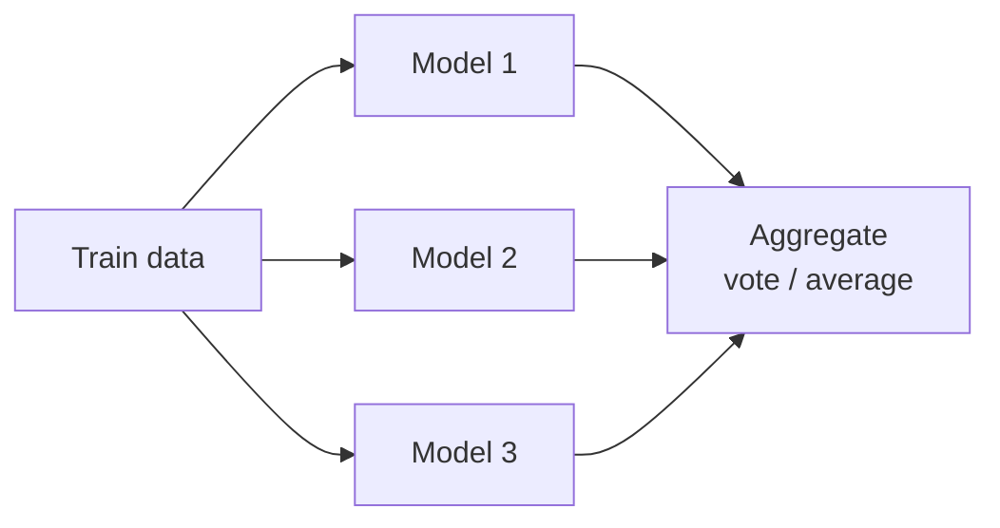
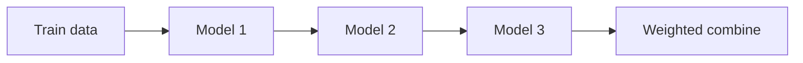

# 2026-04-16 ML 7강: Decision Tree, Random Forest, Boosting

> 제공된 PDF 로데이터를 바탕으로 7주차 강의 초안을 재구성함.  
> 흐름: Decision Tree 기본 원리 -> 분할 기준(Entropy/Gini) -> CART -> Bagging -> Random Forest -> Boosting(AdaBoost/GBM/XGB)

## 강의 현황 (포인터)
- **1강** `20250306.md` - ML 개요, 지도학습, 선형회귀
- **2강** `20250313.md` - 분류 도입, 로지스틱 회귀, 나이브 베이즈
- **3강** `20250319.md` - Python 라이브러리, NumPy
- **4강** `20250326.md` - Pandas, EDA
- **6강** `20260409.md` - Classification (KNN, SVM, Decision Tree)
- **7강** 본 문서 `20260416.md`

---

## 목차
1. [오늘 강의 목표](#1-오늘-강의-목표)
2. [Decision Tree 핵심 개념](#2-decision-tree-핵심-개념)
3. [분할 기준: Entropy, Information Gain, Gini](#3-분할-기준-entropy-information-gain-gini)
4. [CART 알고리즘 요약](#4-cart-알고리즘-요약)
5. [Decision Tree 한계와 과적합](#5-decision-tree-한계와-과적합)
6. [Random Forest와 Ensemble Learning](#6-random-forest와-ensemble-learning)
7. [Bagging vs Boosting](#7-bagging-vs-boosting)
8. [AdaBoost 동작 절차](#8-adaboost-동작-절차)
9. [SVM vs Decision Tree 비교 포인트](#9-svm-vs-decision-tree-비교-포인트)
10. [실습 가이드(초안)](#10-실습-가이드초안)
11. [수업 체크포인트](#11-수업-체크포인트)

보강/질의응답(링크 대신 섹션 번호로 이동):
12. Q&A 정리 (수업 중 질의응답)
13. 외부 Q&A 통합 정리 (7강 맥락 고정)
14. 오늘 진행 권장안
15. Entropy 심화 브리핑
16. Information Gain 심화 브리핑
17. Gini Index 심화 브리핑
18. CART 실전 절차
19. Q&A: 순환참조 아닌가?
20. Q&A: RF의 서로 다른 표본
21. Q&A: 집합 A,B,C,D 케이스
22. Q&A: 하이퍼파라미터 최적해

---

## 1. 오늘 강의 목표

- [ ] 의사결정나무의 구조(루트/중간/리프)와 분할 원리를 설명할 수 있다.
- [ ] Entropy, Information Gain, Gini Index가 분할 기준으로 쓰이는 이유를 이해한다.
- [ ] Decision Tree의 과적합 문제와 Random Forest/Boosting의 개선 아이디어를 연결해 설명한다.

---

## 2. Decision Tree 핵심 개념

### 2.1 정의
- Decision Tree(DT)는 의사결정을 트리 구조로 표현하는 지도학습 모델이다.
- 각 노드에서 하나의 feature 조건을 평가하고, 조건 결과에 따라 가지(branch)를 따라 내려간다.
- 최종 리프(leaf) 노드에서 클래스(분류) 또는 수치값(회귀)을 예측한다.

### 2.2 노드 종류
- **Root node**: 트리 시작점, 데이터를 가장 잘 나누는 변수로 첫 분할 수행
- **Intermediate node**: 추가 분할을 위한 중간 판단 노드
- **Leaf node**: 최종 예측이 결정되는 종단 노드

### 2.3 직관 예시
- 강아지 분류 예시에서 `height`의 임계값 \(v_0\)를 기준으로 진돗개/닥스훈트를 분리할 수 있다.
- 즉 트리의 핵심은 "어떤 속성(attribute)과 어떤 임계값(threshold)으로 나눌 것인가"를 찾는 문제다.

---

## 3. 분할 기준: Entropy, Information Gain, Gini

### 3.1 Entropy (불순도)
- Entropy는 샘플의 불확실성(impurity) 척도다.
- 한 노드에 클래스가 섞여 있을수록 Entropy가 커진다.

\[
H(S) = -\sum_{c \in C} p(c)\log_2 p(c)
\]

해석:
- 한 클래스만 있는 완전 순수 노드 -> Entropy = 0
- 클래스가 균등하게 섞인 노드 -> Entropy 최대

### 3.2 Information Gain (정보이득)
- 어떤 attribute로 분할했을 때 Entropy가 얼마나 감소하는지 측정한다.
- 정보이득이 클수록 "잘 나누는" 분할이다.

\[
IG(S, A)=H(S)-\sum_{v \in Values(A)}\frac{|S_v|}{|S|}H(S_v)
\]

### 3.3 Gini Index
- CART에서 주로 쓰는 불순도 지표이며 Entropy와 유사한 역할을 한다.

\[
Gini(S)=1-\sum_{i=1}^{K}p_i^2
\]

정리:
- DT 분할 기준은 결국 "분할 후 불순도 최소화(또는 정보이득 최대화)"다.

---

## 4. CART 알고리즘 요약

CART(Classification and Regression Tree)는 이진 분할(binary split)을 반복한다.

현재 노드의 샘플 수를 \(m\), 분할 후 좌/우 노드 샘플 수를 \(m_L, m_R\), 좌/우 불순도를 \(G_L, G_R\)라 하면, 분할 비용을 최소화하는 \((A,a)\)를 선택한다.

\[
J(A,a)=\frac{m_L}{m}G_L+\frac{m_R}{m}G_R
\]

- \(A\): 분할에 사용할 attribute
- \(a\): threshold 값
- 목표: \(J(A,a)\) 최소화

---

## 5. Decision Tree 한계와 과적합

- 트리 깊이가 깊어질수록 학습 데이터에 과도하게 맞춰질 수 있다(과적합).
- 얕은 트리는 일반화가 좋을 수 있지만 복잡한 패턴을 놓칠 수 있다(과소적합).
- 핵심은 "최대한 얕은 단계로 잘 분리되는 규칙"을 찾는 것.

실전 제어 파라미터:
- `max_depth`
- `min_samples_split`
- `min_samples_leaf`
- `ccp_alpha` (cost complexity pruning)

---

## 6. Random Forest와 Ensemble Learning

### 6.1 Ensemble Learning 개념
- 여러 약한 학습기(weak learner)를 결합해 강한 학습기(strong learner)를 만드는 방법
- 장점: 정확도 향상, 과적합 완화, 강건성 향상

### 6.2 Random Forest
- 여러 개의 Decision Tree를 학습시켜 예측을 집계한다.
- 각 트리는 서로 다른 bootstrap 표본과(옵션에 따라) 서로 다른 feature 후보 샘플링을 사용해 **별도로 학습**된다.  
  - 여기서 "독립"은 보통 **학습 절차가 트리끼리 순차 업데이트로 엮이지 않는다**는 뜻에 가깝다.  
  - 다만 트리들이 **통계적으로 완전 독립**이라는 뜻은 아니다(같은 원 데이터/같은 알고리즘을 공유).
- 최종 예측:
  - 분류: 다수결(majority vote)
  - 회귀: 평균(average)

Decision Tree 대비:
- 단일 트리: 해석은 쉽지만 과적합 위험 큼
- 랜덤 포레스트: 해석성은 일부 감소하지만 일반화 성능/안정성 향상

### 6.3 DT 확장 관점: 왜 Random Forest인가

단일 Decision Tree는 한 번의 greedy 분할 과정으로 "하나의 규칙 구조"를 만든다.  
데이터/노이즈에 민감해질수록(특히 깊은 트리) **분산(variance)**이 커지고 과적합이 쉬워질 수 있다.

Random Forest의 핵심 아이디어는:
- **서로 조금씩 다른 트리**를 많이 만들고
- 개별 트리의 실수를 **집계(aggregation)**로 상쇄해
- 전체 예측을 더 안정적으로 만드는 것

직관적으로는 슬라이드/도식처럼,
- 왼쪽: 하나의 깊은 트리로 바로 최종 예측
- 오른쪽: 여러 개의 (상대적으로 덜 상관된) 트리 예측을 모아 최종 예측

### 6.4 Ensemble이 "약한 학습기"를 말할 때의 의미

여기서 weak learner는 반드시 "성능이 나쁜 모델"이라는 뜻이 아니라,
- **단독으로는 완벽하지 않지만**
- **서로 다른 실수 패턴을 가진 모델**로 묶이면 전체가 강해질 수 있다는 의미에 가깝다.

Random Forest에서 각 트리는 보통 깊이 제한 없이도 학습될 수 있지만,
Bootstrap + random feature subset 때문에 트리들이 서로 달라지며 diversity가 생긴다.

### 6.5 Random Forest의 랜덤성 2축 (diversity의 원천)

1) **Bootstrap(Bagging)**: 각 트리는 원본 train set을 복원추출한 부트스트랩 샘플로 학습  
2) **Random subspace(특성 부분집합)**: 각 split에서 후보 feature를 전부 보지 않고 일부만 무작위로 고려

이 두 랜덤성이 트리들을 서로 덜 상관되게 만들고,  
그 결과 집계 시 분산 감소 효과가 잘 나온다.

### 6.6 집계(aggregation)를 수식으로 고정

트리 \(b=1,\dots,B\)의 예측을 \(\hat{y}^{(b)}(x)\)라 하면:

- 분류(다수결):
\[
\hat{y}(x)=\arg\max_{c}\sum_{b=1}^{B}\mathbf{1}(\hat{y}^{(b)}(x)=c)
\]

- 회귀(평균):
\[
\hat{y}(x)=\frac{1}{B}\sum_{b=1}^{B}\hat{y}^{(b)}(x)
\]

실무 팁:
- 분류에서도 `predict_proba`가 있으면 클래스 확률을 평균한 뒤 argmax 하는 방식이 쓰이기도 한다(구현/설정에 따라 다름).

### 6.7 장점을 bias-variance 언어로 정리

슬라이드 bullet을 조금 더 정확히 풀면:

- **Accuracy**: 여러 모델의 오차가 상관되지 않게 다양해질수록 평균/투표가 안정적
- **Robustness**: 단일 트리의 특정 분기(데이터 편향)에 덜 민감
- **Flexibility**: 트리 자체가 비선형/상호작용을 잘 포착하고, 앙상블로 안정화

주의:
- "무조건 과적합이 사라진다"는 뜻은 아니다. 데이터/설정에 따라 여전히 과적합 가능
- 해석성은 단일 트리보다 어려워지는 trade-off가 있다

### 6.8 대표 하이퍼파라미터(실습에서 바로 만지는 것)

- `n_estimators`: 트리 개수 \(B\) (보통 클수록 안정적이지만 계산 비용 증가)
- `max_features`: 각 split에서 고려하는 feature 수(랜덤성/상관 강도 조절)
- `min_samples_leaf`, `max_depth` 등: 개별 트리 복잡도 제어
- `random_state`: 재현성

### 6.9 참고(시각적 직관)

- Random Forest 직관 도식: [MLU Explain - Random Forest](https://mlu-explain.github.io/random-forest/)

---

## 7. Bagging vs Boosting

이 섹션은 슬라이드 흐름을 그대로 잇는다: **Bagging(병렬) -> Random Forest(Bagging의 DT 버전) -> Boosting(순차)**.

### 7.0 한 장 요약: 병렬 vs 순차

Bagging(병렬 집계):



Boosting(순차 결합):



- 첫 다이어그램은 **Bagging/RF**의 "여러 모델을 만들고 합친다" 직관
- 둘째 다이어그램은 **Boosting**의 "이전 단계 결과가 다음 단계 학습에 영향을 준다" 직관

### 7.1 Bagging (Bootstrap AGGregatING)

정의(핵심):
- 원 training set에서 **복원추출(bootstrap)**로 여러 학습표본을 만들고
- 각 표본으로 **서로 다른 모델**을 학습한 뒤
- 예측을 **평균(회귀)** 또는 **투표(분류)**로 합친다

왜 통하나:
- 단일 모델(특히 고분산 모델)의 "특정 샘플/특정 분기에 과민한 실수"를
- 서로 다른 부트스트랩 관점에서 **상쇄(averaging)**하려는 발상

bias-variance 직관(강의용):
- Bagging이 특히 잘 먹히는 경우가 많은 축은 **분산(variance) 완화**
- 편향(bias) 자체를 이론적으로 크게 줄인다고 단정하긴 어렵고, 데이터/베이스 모델에 따라 다름

### 7.2 Random Forest = Bagging + Decision Tree + 추가 랜덤성

슬라이드 bullet을 문장으로 연결하면 Random Forest는:

1) 각 트리는 **랜덤하게 뽑힌 학습 표본(bootstrap)**으로 학습  
2) 각 split에서 **모든 feature를 보지 않고 일부 feature만 후보**로 둔다(`max_features`)  
3) 트리 예측을 **평균/다수결**로 합친다

즉 RF는 "Bagging의 아이디어를 DT에 특화"시키고, **feature randomness**로 트리 상관(correlation)을 더 낮추려는 방법이다.  
(상세는 문서 내 **6.5**, bootstrap 직관은 **20**을 같이 보면 한 번에 정리된다)

#### How Random Forest works (슬라이드 문장 정리)

- 각 decision tree는 **서로 다른 bootstrap 표본**으로 학습한다.
- 각 split은 **서로 다른 feature 부분집합**을 후보로 삼을 수 있다.
- 최종 출력은 분류에서는 **majority vote**, 회귀에서는 **평균**이다.

#### Key Differences from a single Decision Tree (슬라이드 bullet 보강)

- **Single vs Ensemble**: 단일 트리는 하나의 규칙 구조로 예측하고, RF는 여러 트리의 집계 예측이다.
- **Overfitting 관점**: 깊은 단일 트리는 분산/과적합에 취약할 수 있고, RF는 집계로 **안정화**되는 경우가 많다(항상은 아님).
- **결정경계(decision boundary) 직관**: 단일 트리의 경계는 축에 평행한 계단형이 강하고, RF는 많은 계단형 경계를 평균/투표해 **더 매끈해 보이는** 경계를 만들 수 있다(데이터/설정에 따라).

주의(시험용 교정):
- "RF가 무조건 단순한 경계"라는 뜻은 아니다. 여전히 비선형 경계를 만들 수 있지만, **단일 트리 한 방**보다 덜 들쭉날쭉한 형태로 나타나는 경우가 많다.

### 7.3 Boosting (순차 앙상블)

정의(핵심):
- 약한 학습기들을 **순차적으로** 학습시키고
- 이전 모델이 틀린 샘플/잔차(residual) 쪽으로 다음 모델이 더 집중하게 만든 뒤
- 최종적으로 **가중 결합**으로 강한 학습기를 만든다

슬라이드 표현과의 정렬:
- Boosting은 "정확도 향상"을 말하지만, 강의에서 자주 강조되는 축은 **편향(bias) 감소** 쪽과의 연결이다(특히 약한 모델을 반복 개선).

대표 계열:
- **AdaBoost**: 가중치를 올려 어려운 샘플에 집중
- **Gradient Boosting**: 손실함수 gradient(잔차 방향)에 맞춰 다음 모델을 추가
- **XGBoost**: Gradient Boosting의 엔지니어링/정규화/효율을 강화한 구현 계열

과적합 메모:
- Boosting은 강하지만, 라운드가 과하면 과적합/노이즈 적합 위험이 있어 **학습 라운드 수, 학습률, 서브샘플, 정규화**가 중요하다.

---

## 8. AdaBoost 동작 절차

AdaBoost는 Boosting 계열 중에서도 "가중치 업데이트"가 특히 직관적인 대표 예시다.

### 8.1 슬라이드 절차를 그대로 옮기면

1. 초기화: 모든 샘플 가중치를 동일하게 둔다.
2. 가중치가 반영된 데이터로 약한 학습기를 학습한다(흔히 decision stump).
3. 학습기의 가중 오류율(weighted error)을 계산한다.
4. 오분류 샘플의 가중치를 키워 다음 라운드에서 더 자주/더 중요하게 다루게 한다.
5. 학습기 자체에도 신뢰도에 따른 가중치 \(\alpha_t\)를 부여한다.
6. 최종 예측은 각 약한 학습기의 출력을 \(\alpha_t\)로 가중해 결합한다.

### 8.2 "최종 모델"을 한 줄로 정확히 말하면

분류에서 흔한 형태는 "가중 **다수결/가중 투표**"다.  
즉 단순 다수결이 아니라, 각 약한 학습기의 **신뢰도 가중치**가 반영된다.

슬라이드의 \(D_1 \rightarrow D_2 \rightarrow D_3\) 그림은 정확히 4번(가중치 업데이트)이 반복되며 분포가 바뀌는 과정을 보여준다.

### 8.3 Boosting 족보로 이어 붙이기 (강의 마무리용)

- **Gradient Boosting**: "틀린 샘플 가중치"보다, 손실 \(L\)을 줄이기 위해 **잔차 방향**으로 모델을 추가하는 관점이 더 중심이다.
- **XGBoost**: Gradient Boosting + 정규화/스파스 처리/효율적 학습 등을 포함한 실무 구현 축

핵심 직관:
- Bagging/RF가 **병렬 다양성 + 평균화**에 강하면,
- Boosting은 **순차적 보정**으로 약한 모델을 강하게 만드는 축이다.

---

## 9. SVM vs Decision Tree 비교 포인트

| 구분 | SVM | Decision Tree |
|---|---|---|
| 경계 방식 | 마진 최대화 초평면 | feature threshold 기반 재귀 분할 |
| 분할 구조 | 전체 feature를 선형결합(또는 커널 공간) | 노드마다 단일 feature 조건 |
| 장점 | 일반화 성능 우수 가능, 고차원 대응 강점 | 해석 쉬움, 규칙 기반 설명 가능 |
| 주의점 | 스케일링/파라미터(C, gamma) 민감 | 깊어지면 과적합 쉬움 |

---

## 10. 실습 가이드(초안)

### 10.1 실습 흐름
1. 데이터 로드 및 train/test 분리 (`stratify=y`, `random_state` 고정)
2. Decision Tree baseline 학습
3. Random Forest 학습
4. AdaBoost 학습
5. 동일 지표로 성능 비교(Accuracy, Precision, Recall, F1, Confusion Matrix)

### 10.2 코드 스니펫
```python
from sklearn.model_selection import train_test_split
from sklearn.tree import DecisionTreeClassifier
from sklearn.ensemble import RandomForestClassifier, AdaBoostClassifier
from sklearn.metrics import classification_report, confusion_matrix

X_train, X_test, y_train, y_test = train_test_split(
    X, y, test_size=0.2, stratify=y, random_state=42
)

dt = DecisionTreeClassifier(max_depth=4, random_state=42)
rf = RandomForestClassifier(n_estimators=200, random_state=42)
ab = AdaBoostClassifier(n_estimators=100, random_state=42)

for name, model in [("DT", dt), ("RF", rf), ("AdaBoost", ab)]:
    model.fit(X_train, y_train)
    pred = model.predict(X_test)
    print(f"\n[{name}]")
    print(confusion_matrix(y_test, pred))
    print(classification_report(y_test, pred))
```

---

## 11. 수업 체크포인트

- Entropy와 Gini는 무엇을 측정하며 왜 분할 기준으로 쓰이는가?
- Information Gain이 최대인 속성을 고르는 이유는 무엇인가?
- 단일 Decision Tree가 Random Forest보다 과적합에 취약한 이유는?
- Bagging과 Boosting의 차이를 학습 순서(병렬/순차) 관점에서 설명할 수 있는가?
- AdaBoost에서 오분류 샘플 가중치를 높이는 것이 성능 개선에 어떻게 기여하는가?

---

## 12. Q&A 정리 (수업 중 질의응답)

### Q1. Node와 Branch는 무엇이 다른가?

- **Node(노드)**: 분기 판단이 일어나는 지점(질문)
- **Branch(브랜치)**: 판단 결과(Yes/No)에 따라 다음 노드로 이동하는 경로

정리:
- 노드 = "무엇을 물어보는가"
- 브랜치 = "답에 따라 어디로 가는가"

### Q2. 노드 분기 기준은 feature인가? 사전에 사람이 다 정해야 하나?

- 분기 기준은 보통 **feature + threshold** 형태다. (예: `height <= v0`)
- 실무에서는 사람이 분기 규칙을 전부 수동으로 정하지 않고, 알고리즘(CART)이 데이터로부터 자동 탐색한다.
- 분류 트리에서는 각 분할에서 `Gini` 또는 `Entropy/Information Gain` 기준으로 최적 분할을 선택한다.

사람이 주로 설정하는 것:
- `max_depth`, `min_samples_split`, `min_samples_leaf`, `ccp_alpha` 같은 복잡도 제어 하이퍼파라미터

핵심:
- "어디를 자를지"는 모델이 찾고,
- "얼마나 복잡하게 자랄지"는 사람이 통제한다.

### Q3. 트리 분기에서 확률변수, 베이즈, 로지스틱 회귀가 들어가나?

- 기본 Decision Tree는 각 노드에서 베이즈 업데이트나 로지스틱 회귀를 수행하지 않는다.
- 분기는 조건식(이진/다진)으로 이루어지고, 샘플은 해당 경로로 내려간다.
- 리프의 확률(`predict_proba`)은 보통 **해당 리프 내 클래스 빈도 비율**이다.
  - 예: 리프에 A 30개, B 20개 -> \(P(A)=0.6, P(B)=0.4\)

즉:
- 확률값은 나오지만, 이는 주로 빈도 기반 추정이며
- 뎁스마다 베이즈적 확률모형이나 로지스틱 회귀식이 내장되는 구조는 아니다.

### Q4. 확률을 누적해 전역 L 함수 최소화(선형회귀식처럼)로 학습하나?

- 일반 DT는 선형회귀/로지스틱회귀처럼 전역 손실을 gradient descent로 직접 최적화하는 방식이 아니다.
- 각 노드에서 불순도 감소가 가장 큰 분할을 고르는 **greedy 재귀 분할** 방식이다.

### Q5. 예: 60:40이면 두 경로를 병렬 수행하고 평균 내는 방식도 가능한가?

- 표준 단일 Decision Tree는 **hard split**이므로 샘플 하나가 동시에 두 경로를 가는 방식이 아니다.
- 60:40은 보통 리프에서의 클래스 비율(확률 해석)이다.

다만 유사 발상은 존재:
- **Random Forest**: 여러 트리를 병렬 학습 후 투표/평균
- **Soft Decision Tree(변형)**: 확률적 분기(연구/특수 목적)

결론:
- "병렬 후 평균"은 단일 DT 기본 메커니즘은 아니지만,
- 앙상블 계열(Random Forest)에서는 핵심 원리로 성립한다.

---

## 13. 외부 Q&A 통합 정리 (7강 맥락 고정)

### 13.1 7강의 위치 (선행-현재-후속)

- 7강은 독립 주제가 아니라, 6강 Classification 흐름 안에 있던 `Decision Tree / Tree Ensemble / 평가 지표` 축을 더 깊게 확장하는 형태다.
- 선행 기반:
  - 1강: T/E/P 관점, 학습 목표와 손실함수 프레임
  - 2강: 분류 문제 정의, 교차검증 관점
  - 6강: DT/SVM/평가지표/앙상블 개요
- 후속 연결:
  - 하이퍼파라미터 탐색
  - pruning
  - ensemble 비교
  - 데이터 특성에 따른 모델 선택

### 13.2 현재 핵심 축

1. **Decision Tree**
   - `if x_j <= t then ... else ...` 형태의 threshold 분할
   - 분할 기준: Gini / Entropy / Information Gain
   - 제어 파라미터: `max_depth`, `min_samples_leaf`, `ccp_alpha`

2. **Random Forest**
   - 다수 트리의 `majority vote`
   - Bagging 계열 대표 모델

3. **Boosting**
   - 순차 학습으로 이전 오류를 다음 모델이 보정
   - AdaBoost / Gradient Boosting / XGBoost 계열로 확장

### 13.3 바로 설명 가능한 핵심 질문 세트

- Entropy와 Gini는 무엇이 다르고, 왜 둘 다 impurity 축인가?
- Information Gain과 CART 비용함수 \(J(A,a)\)는 어떤 공통 구조를 가지는가?
- 트리는 왜 과적합되기 쉽고, `max_depth`/`min_samples_leaf`/`ccp_alpha`는 각각 어떤 실패를 막는가?
- Random Forest는 왜 트리를 더 많이 쓰는데도 일반화가 좋아질 수 있는가?
- Bagging이 분산(variance), Boosting이 편향(bias)과 자주 연결되는 이유는 무엇인가?
- SVM과 DT는 모두 분류기인데 decision boundary 형성 방식이 왜 구조적으로 다른가?

### 13.4 자주 헷갈리는 지점 정리

1. **DT는 확률모형인가 규칙모형인가?**
   - 강의 기준 핵심은 규칙 기반 재귀 분할 구조다.
   - 리프 확률은 주로 클래스 빈도 기반 해석이다.

2. **Entropy/Gini/IG/CART 공식을 따로 외워야 하나?**
   - 공통 목적은 동일: "분할 후 노드가 더 순수해졌는가"를 측정

3. **RF와 AdaBoost는 둘 다 트리 여러 개 쓰는데 왜 다른가?**
   - RF: 병렬 집계(Bagging)
   - AdaBoost: 순차 오류 보정(Boosting)

### 13.5 자료 상태 기반 운영 결론

- 현재 자료 흐름상 7강은 6강의 DT/Ensemble 파트를 중심으로 재구성하는 것이 가장 자연스럽다.
- 연결 고리:
  - 2강의 분류/교차검증
  - 1강의 ML 기본 프레임(T/E/P, 손실함수 관점)

---

## 14. 오늘 진행 권장안

- **권장:** 개념 노드 중심으로 진행 후, 예제를 짧게 붙이는 방식
- 이유:
  1) 지금 7강은 "신규 모델 도입"보다 "기존 분류 축 심화" 성격이 강함
  2) Entropy/Gini/IG/CART/RF/Boosting의 연결 구조를 먼저 잡아야 이후 예제가 덜 헷갈림
  3) 시험/질문 대응에서 개념 연결축이 먼저 서야 응용문제에 강함

권장 수업 순서(짧은 버전):
1. DT 분할 원리(노드-브랜치-임계값)
2. 불순도 축(Entropy/Gini/IG/CART)
3. 과적합과 제어 파라미터
4. RF vs Boosting 대비
5. 마지막에 간단 실습/예제로 고정

---

## 15. Entropy 심화 브리핑 (증명 -> 계산 -> CART -> Gini 비교)

### 15.1 정의: 왜 \(H(S)=-\sum p(c)\log_2 p(c)\) 인가

샘플 \(S\)가 클래스 집합 \(C\)로 분류될 때, 클래스 \(c\)의 비율을 \(p(c)\)라 하면:

\[
H(S) = -\sum_{c\in C} p(c)\log_2 p(c)
\]

핵심 해석:
- \(-\log_2 p(c)\): "드문 사건일수록 정보량이 크다"는 self-information
- \(H(S)\): 각 클래스 사건의 self-information 기댓값(평균 정보량)
- 로그 밑이 2인 이유: 단위를 bit로 해석하기 위해서

#### self-information \(I(p)=-\log p\)가 나오는 직관(요약 증명)

정보량 함수 \(I(p)\)가 아래 성질을 만족한다고 두자.
1. 희귀할수록 정보량이 커야 함 (단조성)
2. 독립 사건 결합 시 정보량은 가산적이어야 함  
   \[
   I(pq)=I(p)+I(q)
   \]

위 함수방정식을 만족하는 연속 함수는 로그형뿐이므로:
\[
I(p)= -k\log p
\]
밑을 2로 잡고 \(k=1\)로 정규화하면 \(I(p)=-\log_2 p\).

즉 entropy는 "사건 정보량의 평균"으로 자연스럽게 도출된다.

### 15.2 엔트로피의 핵심 성질(미분으로 확인)

이진분류에서 \(p=P(+),\,1-p=P(-)\):
\[
H(p)= -p\log_2 p-(1-p)\log_2(1-p)
\]

1차 미분:
\[
H'(p)=\log_2\frac{1-p}{p}
\]
따라서 \(H'(p)=0 \iff p=\frac12\).

2차 미분:
\[
H''(p)=-\frac{1}{\ln 2}\left(\frac1p+\frac1{1-p}\right)<0,\quad 0<p<1
\]
전 구간에서 concave이므로 \(p=0.5\)에서 전역 최대.

결론:
- \(p=0\) 또는 \(1\): \(H=0\) (완전 순수)
- \(p=0.5\): \(H=1\) bit (최대 불확실성)

### 15.3 첨부 이미지 산식 계산 (9:5, 7:7, 14:0)

전체 14개 샘플 가정.

1) \(9+\), \(5-\): \(p_+=9/14,\;p_-=5/14\)
\[
H = -\frac{9}{14}\log_2\frac{9}{14}-\frac{5}{14}\log_2\frac{5}{14}\approx 0.940
\]

2) \(7+\), \(7-\): \(p_+=p_-=1/2\)
\[
H = -\frac12\log_2\frac12-\frac12\log_2\frac12=1
\]

3) \(14+\), \(0-\): \(p_+=1,\;p_-=0\)
\[
H = -1\log_2 1-0\log_2 0 =0
\]
\(0\log 0\)은 극한 \(\lim_{x\to0^+}x\log x=0\)으로 정의한다.

이미지의 "균등 분할일수록 impurity 최대, 단일 클래스일수록 impurity 최소"를 수식으로 확인한 결과다.

### 15.4 Information Gain으로 이어지는 이유

부모 노드 \(S\)를 feature \(A\)로 분할했을 때:
\[
IG(S,A)=H(S)-\sum_{v\in Values(A)}\frac{|S_v|}{|S|}H(S_v)
\]

해석:
- 첫 항: 분할 전 불순도
- 둘째 항: 분할 후 자식 노드 불순도의 가중평균
- 따라서 IG 최대화는 "불순도 감소량 최대화"와 동치

즉 DT 학습은 "분할 후 평균 impurity가 가장 작아지도록" 분기 기준을 고르는 과정이다.

### 15.5 CART 비용함수와의 연계 (공통 골격)

CART의 분할 비용:
\[
J(A,a)=\frac{m_L}{m}I(L)+\frac{m_R}{m}I(R)
\]
- \(I(\cdot)\): 불순도 함수(보통 Gini, 경우에 따라 Entropy 계열도 가능)

공통 구조:
- IG 최대화  
  \[
  \max \left[H(parent)-\text{weighted child impurity}\right]
  \]
- CART 비용 최소화  
  \[
  \min \left[\text{weighted child impurity}\right]
  \]

부모 노드 불순도 \(H(parent)\)는 분할 후보 비교 시 상수이므로, 두 관점은 사실상 같은 최적화 축이다.

### 15.6 Gini와 Entropy: 공통점/차이점

#### 공통점
- 둘 다 노드 impurity 척도
- 순수 노드에서 0, 클래스가 균등할수록 최대
- 트리 분할에서 "자식 impurity 가중평균 최소화"라는 동일 목적에 사용

#### 차이점
1. 수식 형태
   - Entropy: \(-\sum p_k\log_2 p_k\)
   - Gini: \(1-\sum p_k^2\)
2. 계산 비용
   - Entropy는 로그 연산 포함
   - Gini는 제곱합 중심이라 상대적으로 계산이 단순
3. 민감도 형태
   - 둘 다 concave지만 곡률이 달라, 일부 데이터에서 분할 순위가 달라질 수 있음
4. 구현 관례
   - CART 전통 구현은 Gini를 많이 사용
   - 라이브러리에서는 `gini`/`entropy`/`log_loss` 선택 가능

실무 결론:
- 대부분 데이터에서 두 기준의 성능 차이는 크지 않다.
- 기본은 Gini로 시작하고, 과제/리포트에서는 entropy도 교차검증으로 비교해 근거를 남기면 좋다.

### 15.7 브리핑용 한 줄 연결

- Entropy/Gini/IG/CART는 서로 다른 공식처럼 보이지만, 실제로는 모두  
  **"분할 후 노드를 더 순수하게 만드는 방향으로 tree를 성장시키는 동일 목적 함수 계열"**이다.

### 15.8 웹 근거(확인용)

- scikit-learn DecisionTreeClassifier: [criterion 설명](https://scikit-learn.org/stable/modules/generated/sklearn.tree.DecisionTreeClassifier.html)
- scikit-learn Tree user guide: [tree impurity and split quality](https://scikit-learn.org/stable/modules/tree.html)
- ESL(Elements of Statistical Learning): [Tree-based methods 맥락](https://hastie.su.domains/Papers/ESLII.pdf)

---

## 16. Information Gain 심화 브리핑 (정의 -> 도출 -> 증명 -> 예시)

### 16.1 정의

Information Gain(IG)은 속성 \(A\)로 분할했을 때, 분할 전후 엔트로피 감소량이다.

\[
IG(S,A)=H(S)-\sum_{v\in Values(A)}\frac{|S_v|}{|S|}H(S_v)
\]

의미:
- \(H(S)\): 부모 노드의 불확실성(분할 전 impurity)
- \(\sum \frac{|S_v|}{|S|}H(S_v)\): 자식 노드 불확실성의 가중 평균(분할 후 기대 impurity)
- 따라서 IG가 클수록 해당 속성이 분류에 더 유용하다.

### 16.2 정보이론 관점 도출

클래스 변수를 \(Y\), 분할 속성을 \(A\)라 두면:

\[
IG(Y;A)=H(Y)-H(Y|A)
\]

또한 조건부 엔트로피 정의:
\[
H(Y|A)=\sum_{a}P(A=a)\,H(Y|A=a)
\]

표본 비율로 근사하면:
- \(P(A=a)\approx \frac{|S_a|}{|S|}\)
- \(H(Y|A=a)\approx H(S_a)\)

그래서 결정트리 구현식:
\[
IG(S,A)=H(S)-\sum_{a}\frac{|S_a|}{|S|}H(S_a)
\]
가 바로 나온다.

### 16.3 왜 "기대 감소량"인가

분할 후 샘플이 어느 자식 노드로 갈지는 \(A\) 값에 따라 달라진다.  
각 자식 노드로 갈 확률이 \(\frac{|S_a|}{|S|}\)이고, 그 노드의 불확실성이 \(H(S_a)\)이므로, 분할 후 불확실성의 기대값은 가중평균으로 계산된다.

즉:
- 분할 전 불확실성: \(H(S)\)
- 분할 후 기대 불확실성: \(\mathbb{E}[H(\text{child})]\)
- 차이 = 기대 감소량 = Information Gain

### 16.4 IG의 비음수성(증명 핵심)

IG는 상호정보량(mutual information)과 동일:
\[
IG(Y;A)=I(Y;A)
\]

상호정보량은 KL divergence 형태:
\[
I(Y;A)=D_{KL}\!\big(P(Y,A)\,\|\,P(Y)P(A)\big)\ge 0
\]

따라서:
- \(IG \ge 0\) (항상 음수가 아님)
- \(IG=0\): \(A\)가 \(Y\) 정보에 기여하지 못함(독립에 가까움)
- \(IG>0\): \(A\)가 분류 불확실성을 줄여줌

### 16.5 첨부 예시(Play Tennis) 연결 해석

슬라이드 계산 흐름:
1. 전체 엔트로피 \(H(S)\) 계산
2. 각 속성(Outlook, Humidity, Wind, Temperature)에 대해
   - 속성값별 부분집합 엔트로피 계산
   - 가중 평균 엔트로피 계산
3. \(IG=H(S)-H_{after}\) 계산
4. IG가 최대인 속성을 선택 (예시에서는 `Outlook`)

해석:
- `Outlook`의 IG가 가장 크다는 것은 해당 속성으로 분할했을 때 클래스 불확실성이 가장 많이 줄어든다는 뜻이다.
- 그래서 루트 노드에서 가장 먼저 선택되는 후보가 된다.

### 16.6 CART와의 연결 (동일 골격)

CART의 분할 비용함수(불순도 기준 \(I\)):
\[
J(A,a)=\frac{m_L}{m}I(L)+\frac{m_R}{m}I(R)
\]

IG 최대화와의 관계:
- Entropy 기준이라면
  \[
  IG = H(parent)-J
  \]
- 부모 불순도는 후보 비교 시 상수이므로
  - \(IG\) 최대화 \(\Leftrightarrow\) \(J\) 최소화

즉 표현만 다를 뿐, 둘 다 "분할 후 가중 불순도 최소"를 목표로 한다.

### 16.7 Gini와 IG(Entropy) 공통/차이 요약

공통:
- 둘 다 분할 품질을 평가하는 impurity 기반 기준
- 자식 노드의 가중 불순도를 작게 만드는 분할을 선호

차이:
- Entropy/IG: 로그 기반 정보량 관점
- Gini: 제곱합 기반 순도 관점
- 계산량은 일반적으로 Gini가 조금 더 단순

실무 메모:
- 기본은 `gini`로 시작해도 충분한 경우가 많다.
- 리포트/연구에서는 `entropy`도 같이 교차검증해 성능 차이를 확인하면 설명력이 좋아진다.

---

## 17. Gini Index 심화 브리핑 (수식 중심, Entropy 대비)

### 17.1 정의

클래스가 \(K\)개인 노드 \(S\)에서 클래스 \(i\)의 비율을 \(p_i\)라 하면:

\[
Gini(S)=1-\sum_{i=1}^{K}p_i^2
\]

동치형:
\[
Gini(S)=\sum_{i=1}^{K}p_i(1-p_i)
\]

직관:
- \(p_i^2\)는 "같은 클래스가 연속으로 선택될 확률" 축을 반영
- \(\sum p_i^2\)가 클수록 한 클래스에 집중(순수)
- 따라서 \(1-\sum p_i^2\)는 섞임(impurity) 정도를 나타냄

### 17.2 이진분류에서의 형태

이진분류(\(p=P(+)\), \(1-p=P(-)\))에서는:
\[
Gini(p)=1-\big(p^2+(1-p)^2\big)=2p(1-p)
\]

성질:
- \(p=0\) 또는 \(1\): \(Gini=0\) (완전 순수)
- \(p=0.5\): \(Gini=0.5\) (최대 불순도)

즉 엔트로피와 동일하게 "균등 혼합에서 최대, 순수 노드에서 최소" 구조를 가진다.

### 17.3 CART에서의 분할 기준

CART는 분할 후보 \((A,a)\)에 대해 자식 노드의 가중 Gini를 최소화한다:

\[
J_{\text{gini}}(A,a)=\frac{m_L}{m}Gini(L)+\frac{m_R}{m}Gini(R)
\]

- \(m\): 부모 노드 샘플 수
- \(m_L,m_R\): 좌/우 자식 샘플 수

선택 규칙:
\[
(A^\*,a^\*)=\arg\min_{A,a}J_{\text{gini}}(A,a)
\]

Gini gain으로 쓰면:
\[
\Delta Gini = Gini(parent)-J_{\text{gini}}(A,a)
\]
이고, \(\Delta Gini\) 최대화와 \(J_{\text{gini}}\) 최소화는 동치다.

### 17.4 Entropy \(H(S)\)와 무엇이 다른가

Entropy:
\[
H(S)=-\sum_{i=1}^{K}p_i\log_2 p_i
\]

Gini:
\[
Gini(S)=1-\sum_{i=1}^{K}p_i^2
\]

핵심 차이:
1. **함수 형태**
   - Entropy: 로그 기반(정보량 관점)
   - Gini: 제곱합 기반(순도 관점)
2. **스케일**
   - 이진분류 최대값: Entropy는 1, Gini는 0.5  
   - 절대값 스케일이 다르므로 값 자체를 직접 비교하지 않고, "후보 분할 간 상대 비교"로 사용
3. **계산 복잡도**
   - Entropy는 로그 계산 필요
   - Gini는 제곱/덧셈 중심으로 상대적으로 단순
4. **분할 민감도**
   - 둘 다 concave impurity 함수라 대부분 유사한 분할을 선택
   - 경계 케이스에서는 분할 순위가 달라질 수 있음

### 17.5 왜 둘 다 "같은 축"으로 보나

Entropy/IG와 Gini/CART는 식만 다르고 목적이 같다:
- 분할 전보다 분할 후 노드가 더 순수해지게 만드는 것
- 즉, "자식 노드의 가중 불순도 최소화"라는 동일 최적화 프레임

정리 문장:
- **Entropy는 정보량 감소 관점**
- **Gini는 클래스 혼합도 감소 관점**
- 둘 다 Decision Tree에서 "좋은 split"을 찾기 위한 impurity criterion이다.

---

## 18. CART (Gini 기반) 실전 절차: 지니를 어떻게 잡아 쓰는가

### 18.1 문제 설정

현재 노드의 샘플 수를 \(m\), 분할 후 좌/우 자식 노드 샘플 수를 \(m_L, m_R\)라고 하자.  
후보 분할은 \((A,a)\): "feature \(A\)를 threshold \(a\)로 이진 분할"이다.

\[
\text{Left}=\{x \mid x_A \le a\},\quad \text{Right}=\{x \mid x_A > a\}
\]

### 18.2 각 노드의 Gini 계산

노드 \(t\)에서 클래스 \(k\) 비율을 \(p_{k|t}\)라 할 때:
\[
Gini(t)=1-\sum_{k=1}^{K}p_{k|t}^2
\]

따라서 후보 \((A,a)\)에 대해:
\[
G_L=Gini(L),\quad G_R=Gini(R)
\]

### 18.3 분할 비용함수 \(J(A,a)\)

CART는 자식 노드 불순도의 샘플수 가중평균을 비용으로 둔다:
\[
J(A,a)=\frac{m_L}{m}G_L+\frac{m_R}{m}G_R
\]

선택 규칙:
\[
(A^\*,a^\*)=\arg\min_{A,a}J(A,a)
\]

해석:
- \(\frac{m_L}{m},\frac{m_R}{m}\)는 각 자식 노드로 샘플이 갈 확률(경험적 비율)
- 즉 \(J(A,a)\)는 "분할 후 기대 Gini impurity"다.

### 18.4 후보 threshold는 어떻게 만드나

연속형 feature \(A\) 처리:
1. 해당 feature 값들을 정렬
2. 인접한 서로 다른 값 사이 중점(midpoint)을 threshold 후보로 생성
3. 후보마다 \(J(A,a)\) 계산
4. 최소 \(J\)를 주는 \(a\) 선택

범주형 feature \(A\) 처리(이진 분할):
- 가능한 범주 부분집합 분할을 평가하거나, 구현체 규칙에 따라 인코딩 후 분할 후보를 만든다.

### 18.5 왜 "지니 최소"가 좋은 분할인가

- 좋은 분할은 자식 노드가 가능한 한 단일 클래스에 가깝게 정리되는 분할
- 단일 클래스 노드는 \(Gini=0\)이므로, 전체 \(J\)가 작을수록 더 순수한 분할
- 결과적으로 이후 트리 깊이를 덜 늘리고도 분류 성능을 확보할 가능성이 커진다.

### 18.6 간단 수치 예시

부모 노드 \(m=10\), 이진분류.

후보 1:
- Left: 8개 (7+,1-) -> \(G_L=1-(\frac78)^2-(\frac18)^2=0.21875\)
- Right: 2개 (0+,2-) -> \(G_R=0\)
- \[
J_1=\frac{8}{10}\cdot 0.21875+\frac{2}{10}\cdot 0=0.175
\]

후보 2:
- Left: 5개 (3+,2-) -> \(G_L=1-(\frac35)^2-(\frac25)^2=0.48\)
- Right: 5개 (4+,1-) -> \(G_R=0.32\)
- \[
J_2=\frac{5}{10}\cdot 0.48+\frac{5}{10}\cdot 0.32=0.40
\]

\(J_1 < J_2\) 이므로 후보 1이 더 좋은 split.

### 18.7 구현 관점 요약

- CART 분류트리 기본 criterion은 `gini`
- 매 노드마다 "모든 feature x 모든 후보 threshold"를 훑어 \(J\) 최소 split을 선택
- 이후 같은 절차를 재귀 반복
- 정지 조건은 `max_depth`, `min_samples_split`, `min_samples_leaf` 등으로 제어

한 줄 결론:
- CART의 본질은 "지니 불순도의 **가중평균 비용**을 가장 작게 만드는 이진 분할을 반복하는 탐욕적(greedy) 최적화"다.

---

## 19. Q&A: "순환참조 아닌가?" (epoch/batch vs Decision Tree 학습)

### Q. 배치/에폭 사고로 보면, IG/CART가 순환참조처럼 보인다. 트리 구조가 먼저 있어야 \(H(S)\)를 계산하는 것 아닌가?

**아니다.** 여기서는 1강의 선형회귀·경사하강법·epoch/batch 개념과, 6강의 Decision Tree/CART의 학습 메커니즘이 섞여 보이는 전형적인 혼동이다.

### 19.1 두 세계를 분리해서 본다

- **최적화형 모델(선형회귀/로지스틱 등)**
  - 전역 파라미터 \(\theta\)를 두고 손실 \(L(\theta)\)를 줄이기 위해 반복 업데이트
  - 그래서 epoch, iteration, learning rate 같은 언어가 자연스럽다

- **재귀 분할형 모델(Decision Tree/CART)**
  - 보통 "여러 epoch에 걸쳐 같은 파라미터를 조금씩 갱신"하지 않는다
  - 대신 현재 노드에 모인 훈련 샘플의 클래스 분포를 보고, 즉시 최적 split을 고르는 **greedy 재귀 분할**에 가깝다

### 19.2 \(H(S)\)는 "노드 개수"가 아니다

- \(H(S)\)는 **현재 노드 \(S\)에 들어온 샘플들의 클래스 혼합도(불순도)**다.
- 따라서 "전체 노드 수가 나온다"는 해석은 틀리다.

### 19.3 순서는 이렇게 간다 (순환참조가 아닌 이유)

1. **루트 노드**에 train set 전체를 넣는다.
2. 그 노드의 클래스 비율로 \(H(S)\) 또는 \(Gini(S)\)를 계산한다.
3. 모든 후보 feature/threshold에 대해 분할 품질을 계산한다.
   - Entropy 계열: \(IG(S,A)=H(S)-\sum_v\frac{|S_v|}{|S|}H(S_v)\)
   - Gini/CART 계열: \(J(A,a)=\frac{m_L}{m}G_L+\frac{m_R}{m}G_R\) 최소화
4. 최적 split 하나를 선택하면 자식 노드가 생긴다.
5. 각 자식 노드에 대해 2~4를 재귀 반복한다.

즉 **트리 구조가 먼저 있어야 entropy를 구한다**가 아니라,  
**현재 노드의 샘플 집합이 먼저 있고**, 그 집합에서 불순도를 계산해 다음 분기를 정한다.

### 19.4 depth/leaf는 언제 정해지나 (leaf 제약은 배제한다고 가정)

- 사전에 전체 노드를 미리 그리는 것이 아니다.
- 분할을 반복하다가 더 이상 분할이 이득이 없거나(이론적으로는 impurity가 더 이상 줄지 않음), 구현/설정상 정지 조건에 걸리면 leaf가 된다.
- 정지 조건 예: `max_depth`, `min_samples_split`, `min_samples_leaf`, `ccp_alpha` 등

중요:
- leaf/depth는 "epoch를 다 돌고 나서" 생기는 것이 아니라, **분할 과정 중 점진적으로 확정**된다.

### 19.5 한 줄 교정(시험용)

Decision Tree는 배치 단위 epoch 학습으로 트리를 만드는 것이 아니라,  
**현재 노드의 훈련 샘플 분포에서 IG 또는 Gini 비용을 계산해 최적 split을 재귀적으로 선택하면서 트리 구조를 성장**시킨다.

### 19.6 다음 액션(선택)

- **의사코드 10줄 버전**으로 학습 절차를 고정할지
- **회귀/로지스틱/DT를 학습 방식 표**로 분리할지

---

## 20. Q&A: Random Forest의 "서로 다른 표본"과 트리가 달라지는 이유

### Q1. "서로 다른 표본"이면 완전히 다른 데이터셋인가?

**아니다(일반적인 Random Forest 설명 기준).**  
Random Forest에서 각 트리가 쓰는 표본은 보통 **같은 원 training set**에서 **복원추출(bootstrap)**로 다시 뽑아 만든 학습용 표본이다.

예: 원 데이터가 \(D=\{1,2,3,4,5\}\)이면, 길이 5짜리 bootstrap 표본은 예를 들어 다음처럼 나올 수 있다.

- Tree 1: \([1,2,2,4,5]\)
- Tree 2: \([1,1,3,4,5]\)
- Tree 3: \([2,3,3,4,5]\)

중요한 점:
- 표본이 달라도 **문제 정의는 동일**하다. (같은 feature 공간, 같은 label 정의)
- 따라서 최종적으로는 **같은 입력 \(x\)** 에 대해 각 트리가 예측을 내고, 이를 **다수결/평균**으로 집계한다.

근거(앙상블/Bagging 개요): [scikit-learn - Ensemble methods](https://scikit-learn.org/stable/modules/ensemble.html)

### Q2. Gini/Entropy로 split을 정하면 결정적(deterministic) 아닌가? 그럼 왜 트리가 달라지나?

split 규칙 자체(주어진 데이터에 대해 최적 split을 고르는 절차)는 보통 결정적이지만, **입력으로 들어오는 학습 표본이 달라지면** 클래스 비율·후보 threshold의 impurity 값이 달라져 **최적 split이 바뀔 수 있다**.

추가로 Random Forest는 보통 각 split에서 **모든 feature를 보지 않고 일부 feature만 후보**로 둔다(`max_features`).  
그래서 어떤 트리에서는 루트에서 특정 feature가 후보에조차 없어서, 다른 feature가 선택될 수 있다.

정리:
- 트리가 달라지는 직접 이유는 "지니/엔트로피 공식이 랜덤"이라서가 아니라,
  - **bootstrap으로 학습 표본이 달라지고**
  - **feature 후보가 달라지기 때문**

직관:
- Decision Tree는 작은 변화에도 상단 split이 바뀌면 아래로 연쇄적으로 구조가 크게 달라질 수 있는 **high variance** 성향이 있다.
- Random Forest는 이런 불안정성을 **여러 방향으로 드러낸 뒤 집계로 완화**하는 쪽에 가깝다.

### Q3. 학습 표본이 다르면 병렬로 돌려서 비교가 불가능하지 않나?

비교 대상을 두면 혼동이 풀린다.

- **학습 경로(각 트리 내부 split 구조)**: 서로 달라도 된다.
- **예측 대상 \(x\)**: 동일하다.

그래서 각 트리는 서로 다른 bootstrap 표본으로 학습하더라도, 같은 테스트 입력 \(x\)에 대해 예측을 낼 수 있고, 그 예측들을 모아 집계할 수 있다.

### Q4. 집합 \(A,B\) 케이스로 정리하면?

Random Forest의 bootstrap은 보통 아래에 가장 가깝다.

| 경우 | 의미 | RF와의 거리 |
|---|---|---|
| \(B \subset A\) | B만으로 학습 | 단순 부분표본 학습에 가깝고, RF 표준은 **복원추출**이라 항상 이렇게만 되지는 않음 |
| \(A\cap B\neq\emptyset\)이고 합이 원집합을 덮음 | 겹치지만 동일하지 않음 | **가장 RF적** (bootstrap 표본들은 대개 많이 겹치지만 완전 동일하지 않음) |
| \(B \approx A^c\) | 거의 배타적 블록 | RF 표준 설명과는 거리가 있고, 보통은 train/val 분할 실험에 가까움 |

### Q5. 각 DT의 "설명력" 차이가 있나?

여기서 설명력을 두 갈래로 나눠 말하는 게 정확하다.

1) **해석 가능성(interpretability)**  
- 단일 트리: if-then 규칙을 따라가며 설명하기 쉽다.
- Random Forest: 트리가 많아져 **전체를 한 규칙으로 설명**하기는 어렵다.

2) **일반화/안정성(성능 관점)**  
- Random Forest는 여러 트리의 오차를 집계해 **분산을 줄이는 효과**가 자주 나타난다(항상은 아님).

즉, 개별 트리 각각은 설명은 쉬울 수 있지만 서로 구조가 다를 수 있고, 숲 전체는 성능은 좋아질 수 있으나 설명은 어려워지는 trade-off가 흔하다.

### Q6. 한 줄 교정(시험용)

Random Forest는 서로 완전히 다른 데이터셋을 비교하는 것이 아니라, **같은 training set에서 bootstrap으로 만든 겹치는 학습표본들로 여러 트리를 학습**하고, **같은 입력 \(x\)** 에 대한 예측을 **투표/평균**으로 결합해 단일 트리의 불안정성을 줄인다.

### Q7. 확인 질문(스스로 답해보기)

1. bootstrap sample은 원데이터 밖의 새 데이터를 만드는가, 아니면 원데이터에서 복원추출하는가?
2. 트리 구조가 달라지는 직접 이유는 "지니/엔트로피 공식이 랜덤"인가, "입력 표본/feature 후보가 달라져서"인가?
3. Random Forest가 단일 DT보다 좋아지는 이유를 bias 감소로 보는 게 맞을까, variance 감소로 보는 게 더 가까울까?

---

## 21. Q&A: 집합 \(A,B,C,D\)로 생각할 때, RF/DT의 depth·IG 제한·비교 가능성

### 21.1 집합 표기부터 정리(데이터 샘플 관점)

질문의 \(B\cup C\)와 교집합 \(D=B\cap C\)는 "서로 다른 학습 표본"을 논할 때 흔한 형태다.

- \(A\): 원 training pool(모집단에 가까운 관측 집합)
- \(B,C\): \(A\)에서 뽑힌 부분집합(예: bootstrap 표본, fold, 서브샘플)
- \(D=B\cap C\): 두 표본이 공유하는 샘플

중요:
- Random Forest의 bootstrap 표본은 보통 **\(B,C\subseteq A\)이면서 많이 겹치지만 동일하지 않음** 케이스가 대표적이다.

### 21.2 질문 1) depth를 따로 안 두고 "IG만 제한"하면 각 트리 depth는 같나?

먼저 용어 교정:
- 구현체에서 흔히 말하는 건 "IG 상한"이라기보다, split을 멈추게 하는 **impurity 감소량 임계값**에 가깝다.  
  scikit-learn에는 `min_impurity_decrease`가 이 역할을 한다.

그리고 **depth를 별도로 제한하지 않으면**, 각 트리의 최종 깊이는 일반적으로 **같을 필요가 없다**.

이유:
- 각 트리는 bootstrap 표본/feature 후보가 달라 **분할이 일찍 멈추는 지점**이 달라질 수 있다.
- 순수 노드 도달, `min_samples_split`/`min_samples_leaf` 같은 정지 조건, `min_impurity_decrease` 등에 의해 성장이 제한된다.

"설명력"도 자동으로 같지 않다. 여기서는 다시 두 의미로 분리해야 한다.

- **해석 가능성(interpretability)**: 트리 구조(깊이, 리프 수, 평균 경로 길이)가 다르면 설명 난이도도 달라진다.
- **예측 성능(일반화)**: 동일한 검증 프로토콜에서 지표로 비교한다(OOB, CV, hold-out).

"증명"이라기보다 **증거(evidence)**는 보통:
- 동일 test set에서 accuracy/F1/ROC-AUC 등
- 교차검증 평균과 분산
- (가능하면) OOB score, calibration, 불안정성(서로 다른 seed에서 성능 분산)

문서 참고:
- RandomForestClassifier: [sklearn.ensemble.RandomForestClassifier](https://scikit-learn.org/stable/modules/generated/sklearn.ensemble.RandomForestClassifier.html)
- DecisionTreeClassifier stopping 관련 파라미터: [sklearn.tree.DecisionTreeClassifier](https://scikit-learn.org/stable/modules/generated/sklearn.tree.DecisionTreeClassifier.html)

### 21.3 질문 2) 모든 트리에 `max_depth=N`을 주면 "항상 깊이 N"이 되나? 비교 지위는?

`max_depth=N`은 **최대 깊이 상한**이지, 모든 리프가 깊이 \(N\)까지 도달한다는 뜻이 아니다.

조기 정지 이유 예:
- 리프가 순수해져 더 이상 불순도 감소가 없음
- `min_samples_leaf` 등으로 더 이상 split 불가

따라서:
- **예측 비교 자체는 가능**하다. (같은 \(x\)에 대한 클래스 예측을 비교)
- 하지만 "트리 구조 복잡도까지 동일"을 보장하진 않는다.

네가 걱정한 "깊이를 맞추려고 과적합"은 방향이 반대인 경우가 많다.
- 깊이를 **늘리면** 트리가 더 복잡해져 과적합 위험이 커질 수 있다.
- 깊이를 **제한하면** 오히려 단일 트리의 분산/과적합을 줄이는 방향이 될 수 있다(대신 편향은 늘 수 있음).

### 21.4 질문 3) RF에서 통상 depth 제한 + IG 상한을 같이 두나? 또 뭐로 제어하나?

실무/구현에서 흔한 제어축은 보통 아래 조합이다.

- **숲 전체**: `n_estimators`, `max_features`, `bootstrap`, `max_samples`(옵션)
- **개별 트리 복잡도**: `max_depth`, `max_leaf_nodes`, `min_samples_split`, `min_samples_leaf`
- **split 품질 임계**: `min_impurity_decrease`
- **가지치기**: `ccp_alpha` (cost complexity pruning)

여기서 "IG 상한"에 대응하기 쉬운 건 `min_impurity_decrease`다.  
(큰 split만 허용하고 미세한 개선은 버리게 만들어 트리를 얕게/덜 노이즈하게 만든다.)

### 21.5 연구자 관점: 최적 \(N\)이나 IG 상한의 보편값이 있나?

보편적으로 고정된 "정답 상수"는 없다. 데이터/노이즈/클래스 불균형/피처 수에 따라 달라진다.

일반적인 절차:
1. baseline RF(문서 기본값에서 시작)
2. CV 또는 OOB로 `max_depth`, `min_samples_leaf`, `max_features`, `n_estimators` 탐색
3. 운영 제약(지연시간, 해석 필요성) 반영

문서도 하이퍼파라미터는 데이터에 따라 달라지며 검증이 필요하다는 톤을 강조한다:  
[Model selection and evaluation](https://scikit-learn.org/stable/model_selection.html)

### 21.6 LP로 "depth N과 IG 상한"을 결정변수로 두고 최적화 가능?

발상은 이해되지만, 이 강의/실무 프레임에서는 보통 **혼합정수선형계획법(MILP)로 깔끔하게 닫힌 형태**로 쓰기 어렵다.

이유(요약):
- 트리 split 선택은 데이터에 의존하는 이산 구조라, 목적함수가 단순 선형/볼록 문제로 정리되기 어렵다.
- "IG" 자체는 노드별로 정의되며 전역적으로 매끄럽지 않다.

대신 현실적인 대안은:
- Grid/Random Search + CV
- Bayesian optimization(Optuna 등)
- (연구적으로) 구조 제약을 두는 tree learning formulation은 별도 주제

### 21.7 한 줄 결론

Random Forest의 목표는 "각 트리 depth를 동일하게 맞추는 것"이 아니라,  
**서로 덜 상관된 트리들을 만들고 집계로 분산을 줄여 일반화를 개선**하는 쪽에 더 가깝다.

---

## 22. Q&A: RF 하이퍼파라미터는 "반복 비교"인가? 최적해는 있나?

### Q. 결국 하이퍼파라미터는 RF를 반복 돌려 비교하며 \(Q\)를 조정하는 연구 방식인가?

**큰 틀에서는 맞다.** 다만 "감으로만"이 아니라, 보통 아래를 전제로 **체계적인 탐색 루프**로 운영한다.

- 목적함수(검증 점수)를 먼저 고정한다: accuracy가 아니라 recall/F1/ROC-AUC 등 업무 지표일 수 있음
- 후보 \(Q\)를 생성한다: grid/random/bayes 등
- 각 \(Q\)에 대해 CV 또는 OOB로 \(Score(Q)\)를 추정한다
- 최고 점수 \(Q^\*\)를 선택한다
- 마지막에 test는 **한 번만**(누수 방지)

### Q. 각 \(Q\)에 대한 최적해 문제는 없나?

**"문제로서의 최적화"는 있다.** 다만 보통 아래 형태의 **black-box 최적화**에 가깝다.

\[
Q^\*=\arg\max_{Q\in\mathcal{Q}} Score_{CV}(Q)
\]

여기서 \(Score_{CV}(Q)\)는 k-fold CV 평균, 또는 OOB 추정치일 수 있다.

중요한 보정:
- **보편적 universal optimum**(모든 데이터에 통하는 단 하나의 정답 \(Q\))은 현실적으로 기대하기 어렵다.
- 대신 **주어진 데이터셋·선택한 지표·검증 프로토콜·랜덤 시드 정책** 아래의 **경험적 최적해(empirical optimum)**는 존재할 수 있다.

### 왜 LP/닫힌형 해부터 기대하기 어렵나

\(Q\)를 바꾸면 트리 구조, bootstrap 표본, feature 후보가 함께 바뀌어 \(Score_{CV}(Q)\)가
- 비선형
- 불연속/비매끄러움
- 확률적 변동(시드, 샘플링)
- 평가 비용 큼

인 **black-box objective**가 되기 쉽다. 그래서 실무에서는 LP보다 탐색 기반이 일반적이다.

### 실무에서 쓰는 표준 도구(강의/실습 연결)

- 교차검증: [Cross-validation](https://scikit-learn.org/stable/modules/cross_validation.html)
- 그리드/랜덤 탐색: [GridSearchCV](https://scikit-learn.org/stable/modules/generated/sklearn.model_selection.GridSearchCV.html), [RandomizedSearchCV](https://scikit-learn.org/stable/modules/generated/sklearn.model_selection.RandomizedSearchCV.html)
- 앙상블 개요(OOB 등 맥락): [Ensemble methods](https://scikit-learn.org/stable/modules/ensemble.html)

### 한 줄 정리

RF 하이퍼파라미터는 "옵션 나열"이 아니라,  
**검증 점수를 목적함수로 두고 \(Q\)를 탐색하는 최적화 문제**로 보는 게 정확하다.  
다만 그 목적함수는 대개 **분석적으로 풀기 어렵고**, **탐색+검증**으로 근사 최적해를 찾는다.

