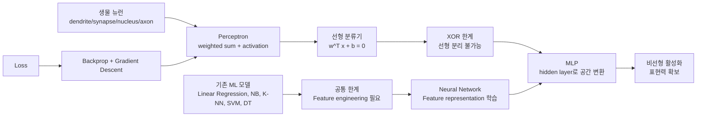
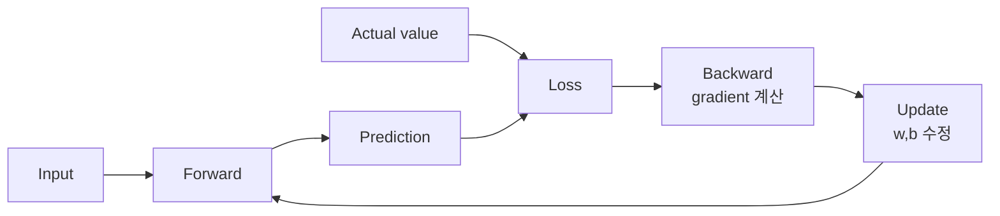
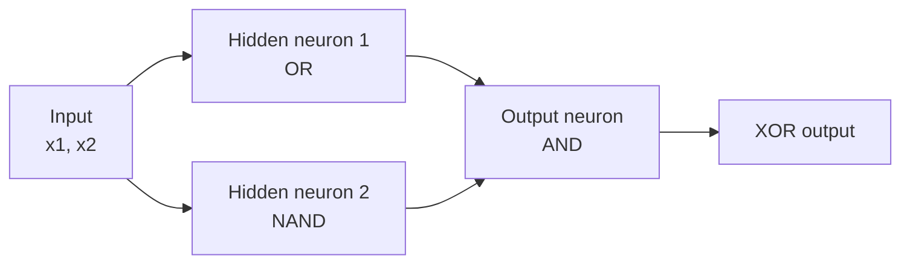
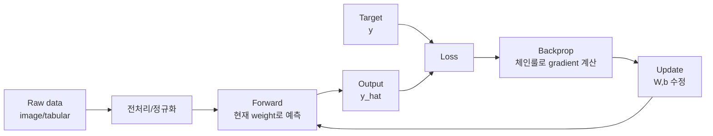

# 2026-04-30 ML 8강: Neural Networks 개요, Perceptron, MLP

> 제공된 PDF 로데이터를 바탕으로 8강 슬라이드 흐름을 강의 노트 형태로 재구성함.  
> 핵심 흐름: 기존 ML의 feature engineering 한계 -> 생물 뉴런의 추상화 -> Perceptron -> DNN/학습 루프 -> XOR 한계 -> MLP와 비선형 활성화.

## 심층 인텔리전스 브리핑

이번 8강은 중간고사 이전의 전통적 ML 모델에서 Deep Learning으로 넘어가는 전환점이다.  
지금까지의 모델은 선형회귀, Naive Bayes, K-NN, SVM, Decision Tree처럼 서로 다른 방식으로 예측했지만, 공통적으로 사람이 좋은 feature를 설계해 주어야 했다. Neural Network의 핵심은 이 부담을 줄이고, 여러 층을 통해 feature representation 자체를 데이터로부터 학습하는 데 있다.

따라서 오늘 수업의 중심 질문은 세 가지다.

1. Perceptron은 기존 선형 분류기와 무엇이 같은가?
2. 왜 단일 Perceptron은 XOR를 풀 수 없는가?
3. MLP는 hidden layer와 비선형 활성화로 어떻게 표현력을 확장하는가?

---

## 강의 현황 (포인터)
- **1강** `20250306.md` - ML 개요, 지도학습, 선형회귀, 경사하강법
- **2강** `20250313.md` - 분류 도입, 로지스틱 회귀, 나이브 베이즈
- **3강** `20250319.md` - Python 라이브러리, NumPy
- **4강** `20250326.md` - Pandas, EDA
- **6강** `20260409.md` - Classification, KNN, SVM, Decision Tree
- **7강** `20260416.md` - Decision Tree, Random Forest, Boosting
- **중간고사** `c293085_RYUJIHWAN_MID_TRANSCRIPT_20260428_021446.md` - Regression, Classification, 종합 분석
- **8강** 본 문서 `20260430.md` - Neural Networks, Perceptron, MLP

---

## 목차
1. [전체 개념 그래프](#1-전체-개념-그래프)
2. [지금까지 모델의 공통 한계: feature engineering](#2-지금까지-모델의-공통-한계-feature-engineering)
3. [생물 뉴런에서 인공 뉴런으로](#3-생물-뉴런에서-인공-뉴런으로)
4. [Perceptron: 인공 뉴런 1개](#4-perceptron-인공-뉴런-1개)
5. [Deep Neural Network: 층을 깊게 쌓는 이유](#5-deep-neural-network-층을-깊게-쌓는-이유)
6. [Neural Network가 바꾼 분야](#6-neural-network가-바꾼-분야)
7. [Neural Network의 핵심 3요소](#7-neural-network의-핵심-3요소)
8. [학습 루프: Forward, Loss, Backward, Update](#8-학습-루프-forward-loss-backward-update)
9. [Perceptron은 선형 분류기다](#9-perceptron은-선형-분류기다)
10. [AND, OR, NAND, XOR와 선형 분리](#10-and-or-nand-xor와-선형-분리)
11. [Perceptron 학습 규칙](#11-perceptron-학습-규칙)
12. [XOR의 한계와 모순 증명](#12-xor의-한계와-모순-증명)
13. [MLP: 뉴런 조합으로 XOR 해결](#13-mlp-뉴런-조합으로-xor-해결)
14. [Notation: 앞으로 사용할 표기법](#14-notation-앞으로-사용할-표기법)
15. [왜 비선형 활성화가 필요한가](#15-왜-비선형-활성화가-필요한가)
16. [수업 체크포인트](#16-수업-체크포인트)
17. [심화 브리지: 선형회귀에서 Perceptron으로](#17-심화-브리지-선형회귀에서-perceptron으로)
18. [Hidden layer는 무엇을 대신하는가](#18-hidden-layer는-무엇을-대신하는가)
19. [순전파, 역전파, 체인룰](#19-순전파-역전파-체인룰)
20. [순전파 기반 탐색과 역전파는 어떻게 다른가](#20-순전파-기반-탐색과-역전파는-어떻게-다른가)
21. [역전파와 탐색은 보완 가능한가](#21-역전파와-탐색은-보완-가능한가)
22. [이미지 전문가 라벨 예시: 왜 신경망을 쓰는가](#22-이미지-전문가-라벨-예시-왜-신경망을-쓰는가)
23. [최종 개념 지도](#23-최종-개념-지도)

---

## 1. 전체 개념 그래프

### 1.1 노드 목록

| 노드 | 핵심 의미 | 오늘 수업에서의 역할 |
|---|---|---|
| N1 기존 ML 모델 | 선형회귀, NB, K-NN, SVM, DT | DL로 넘어가기 전 비교 기준 |
| N2 Feature engineering | 사람이 좋은 feature를 설계 | 기존 ML의 공통 병목 |
| N3 생물 뉴런 | dendrite, synapse, nucleus, axon | 인공 뉴런의 직관적 원형 |
| N4 Perceptron | 가중합 + 활성화 | 인공 뉴런 1개의 수학 모델 |
| N5 선형 분류 | \(w^Tx+b=0\) 초평면 | Perceptron의 표현 한계 |
| N6 DNN | hidden layer를 여러 층 쌓은 모델 | feature를 자동 변환/학습 |
| N7 Loss | 예측과 정답의 차이 | 학습의 목적함수 |
| N8 Backprop + GD | gradient로 가중치 수정 | loss를 줄이는 방법 |
| N9 XOR 문제 | 선형 분리 불가능한 대표 예 | 단일 Perceptron 한계 증명 |
| N10 MLP | Perceptron을 층으로 조합 | XOR를 해결하는 구조 |
| N11 비선형 활성화 | sigmoid, ReLU 등 | 층을 쌓았을 때 표현력을 만드는 조건 |

### 1.2 간선 목록

| 간선 | 관계 | 해석 |
|---|---|---|
| N1 -> N2 | 공통 한계 | 기존 모델은 좋은 feature를 사람이 만들어야 성능이 잘 나온다. |
| N2 -> N6 | 문제 전환 | DNN은 feature extraction까지 학습하려는 방향이다. |
| N3 -> N4 | 추상화 | 생물 뉴런의 입력/합산/발화를 수식으로 단순화한 것이 Perceptron이다. |
| N4 -> N5 | 수학적 성질 | Perceptron 1개는 하나의 초평면으로 분류한다. |
| N5 -> N9 | 한계 발생 | 선형 분리 불가능한 XOR는 단일 Perceptron으로 풀 수 없다. |
| N9 -> N10 | 해결 동기 | 여러 Perceptron을 조합하면 공간을 변환해 XOR를 풀 수 있다. |
| N10 -> N11 | 필요 조건 | 선형층만 쌓으면 다시 선형이므로 비선형 활성화가 필요하다. |
| N7 -> N8 | 학습 원리 | loss를 줄이기 위해 gradient 방향의 반대로 가중치를 이동한다. |
| N8 -> N4 | 파라미터 수정 | \(w, b\)가 update되며 Perceptron/Network가 학습된다. |

### 1.3 수업 흐름 도식



---

## 2. 지금까지 모델의 공통 한계: feature engineering

### 2.1 기존 모델 정리

| 모델 | 핵심 아이디어 | 사람이 해줘야 했던 것 |
|---|---|---|
| 선형회귀 | 특징과 출력의 선형 관계 | 적절한 수치 feature 선택, scaling, 다항 feature 설계 |
| Naive Bayes | 조건부 확률 + 독립 가정 | 조건부 확률을 잘 설명하는 feature 구성 |
| K-NN | 가까운 이웃의 다수결 | 거리 계산이 의미 있도록 feature/scale 조정 |
| SVM | 최대 마진 결정 경계 | 분리 가능한 feature 공간 또는 kernel 선택 |
| Decision Tree | if-else 조건으로 공간 분할 | 분리에 유용한 feature 제공 |

### 2.2 핵심 병목

기존 ML은 모델의 형태가 다르더라도 입력 feature의 품질에 크게 의존한다.  
즉, 성능 향상의 상당 부분이 "모델이 스스로 무엇을 볼지 배우는가"보다 "사람이 어떤 feature를 넣어주는가"에 묶여 있었다.

정리:
- 기존 ML: 사람이 feature 설계 -> 모델이 예측 규칙 학습
- DNN: 데이터로부터 feature 변환까지 함께 학습

### 2.3 노드와 간선

| 노드 | 내용 |
|---|---|
| A1 | 전통적 ML 모델들 |
| A2 | 사람이 만든 feature |
| A3 | 예측기 |
| A4 | Deep Neural Network |

간선:
- A1 -> A2: 모델 성능은 입력 feature 품질에 의존한다.
- A2 -> A3: feature가 좋아야 예측 규칙이 단순해진다.
- A2 -> A4: DNN은 이 feature 변환 과정을 내부 층으로 흡수한다.

---

## 3. 생물 뉴런에서 인공 뉴런으로

### 3.1 생물 뉴런의 기본 동작

생물 뉴런은 많은 입력을 받아 합산하고, 임계값을 넘으면 신호를 출력한다.

1. dendrite가 여러 뉴런의 신호를 입력받는다.
2. synapse의 연결 강도에 따라 입력 신호가 약해지거나 강해진다.
3. nucleus 또는 soma에서 입력 신호가 통합된다.
4. 합산된 신호가 threshold를 넘으면 발화한다.
5. axon을 통해 다음 뉴런으로 출력된다.

강의 포인트:
- 뉴런 하나는 단순하다.
- 복잡한 기능은 많은 뉴런이 적절히 연결되었기 때문에 가능하다.
- 사람 뇌는 약 860억 개 뉴런, 100조 개 이상의 시냅스 연결을 가진다.
- 이 거대한 연결망이 약 20W 수준의 에너지로 작동한다는 점도 중요한 직관이다.

### 3.2 생물 뉴런과 인공 뉴런 매핑

| 생물 뉴런 | 인공 뉴런 |
|---|---|
| dendrite 입력 | \(x_1, x_2, x_3\) |
| synapse 강도 | 가중치 \(w_1, w_2, w_3\) |
| soma/nucleus 합산 | \(\sum_i w_i x_i + b\) |
| threshold 기반 발화 | 활성화 함수 \(\phi(\cdot)\) |
| axon 출력 | 예측값 또는 다음 층 입력 \(y\) |

### 3.3 노드와 간선

| 노드 | 내용 |
|---|---|
| B1 | 여러 입력 신호 |
| B2 | 시냅스 강도 |
| B3 | 합산 |
| B4 | 임계값/활성화 |
| B5 | 출력 |

간선:
- B1 -> B2: 입력은 연결마다 다른 강도로 전달된다.
- B2 -> B3: 가중된 입력들이 합산된다.
- B3 -> B4: 합산값이 발화 여부를 결정한다.
- B4 -> B5: 활성화 결과가 다음 뉴런으로 전달된다.

---

## 4. Perceptron: 인공 뉴런 1개

### 4.1 수학적 정의

Perceptron은 입력을 가중합한 뒤 활성화 함수를 통과시키는 가장 단순한 인공 뉴런이다.

\[
z = w_1x_1 + w_2x_2 + \cdots + w_nx_n + b = w^Tx + b
\]

\[
\hat{y} = \phi(z)
\]

여기서:
- \(x\): 입력 벡터
- \(w\): 가중치 벡터
- \(b\): bias
- \(z\): activation 전의 가중합
- \(\phi\): 활성화 함수
- \(\hat{y}\): 모델의 예측값

### 4.2 구조 해석

Perceptron 하나는 다음 두 단계로 동작한다.

1. 입력 feature에 가중치를 곱해 합산한다.
2. 합산값이 activation function을 통과해 출력이 된다.

즉:

\[
\text{Perceptron} = \text{weighted sum} + \text{activation}
\]

### 4.3 노드와 간선

| 노드 | 내용 |
|---|---|
| C1 | 입력 \(x_1, x_2, ..., x_n\) |
| C2 | 가중치 \(w_1, w_2, ..., w_n\) |
| C3 | bias \(b\) |
| C4 | 가중합 \(z=w^Tx+b\) |
| C5 | 활성화 \(\phi(z)\) |
| C6 | 출력 \(\hat{y}\) |

간선:
- C1 + C2 + C3 -> C4: 입력, 가중치, bias가 하나의 점수 \(z\)를 만든다.
- C4 -> C5: 점수는 활성화 함수를 통과한다.
- C5 -> C6: 활성화 결과가 예측 또는 다음 층 입력이 된다.

---

## 5. Deep Neural Network: 층을 깊게 쌓는 이유

### 5.1 얕은 신경망과 깊은 신경망

얕은 신경망은 보통 hidden layer가 1개인 구조로 설명된다.

\[
\text{input} \rightarrow \text{hidden} \rightarrow \text{output}
\]

Deep Neural Network는 hidden layer를 여러 개 쌓는다.

\[
\text{input} \rightarrow \text{hidden 1} \rightarrow \text{hidden 2} \rightarrow \text{hidden 3} \rightarrow \text{output}
\]

### 5.2 왜 깊게 쌓는가

각 층은 이전 층의 출력을 새로운 feature로 변환한다.  
깊을수록 단순 feature에서 복잡하고 추상적인 feature로 변환될 수 있다.

예:
- 이미지: edge -> texture -> object part -> object
- 언어: token -> phrase pattern -> syntax/meaning -> task output
- 의료 영상: 픽셀 패턴 -> 조직 경계 -> 병변 후보 -> 진단 보조

### 5.3 ML vs DL 관점

| 구분 | 기존 ML | Deep Learning |
|---|---|---|
| Feature | 사람이 설계 | 모델이 층을 통해 학습 |
| 모델 입력 | 정제된 feature 중심 | raw data 또는 덜 가공된 feature 가능 |
| 표현력 | 모델/feature에 제한 | 층과 비선형성으로 복잡한 함수 표현 |
| 해석성 | 비교적 높을 수 있음 | 깊어질수록 낮아질 수 있음 |

### 5.4 노드와 간선

| 노드 | 내용 |
|---|---|
| D1 | 입력 데이터 |
| D2 | 낮은 수준 feature |
| D3 | 중간 수준 feature |
| D4 | 높은 수준 feature |
| D5 | 출력/예측 |

간선:
- D1 -> D2: 첫 층은 원 입력을 단순 패턴으로 변환한다.
- D2 -> D3: 다음 층은 단순 패턴을 조합한다.
- D3 -> D4: 깊은 층은 더 추상적인 representation을 만든다.
- D4 -> D5: 마지막 층은 representation을 예측값으로 변환한다.

---

## 6. Neural Network가 바꾼 분야

| 분야 | 대표 사례 | 연결되는 NN 강점 |
|---|---|---|
| Computer Vision | 자율주행 카메라 인식, X-ray/MRI 진단, 얼굴 인식 | 이미지 feature 자동 추출 |
| Natural Language | ChatGPT, Claude, DeepL, Whisper | 문맥과 의미 representation 학습 |
| Scientific Discovery | AlphaFold, 신약 개발, 재료 설계, 기후 시뮬레이션 | 복잡한 고차원 패턴 학습 |
| Daily Services | 추천, 스팸 필터, 이상탐지, 광고 타겟팅, 신용평가 | 대규모 사용자/행동 데이터 학습 |

### 6.1 역사 흐름

| 시기 | 사건 | 의미 |
|---|---|---|
| 1958 | Rosenblatt Perceptron | 기계가 학습할 수 있다는 초기 기대 |
| 1969 | 1차 AI 겨울 | Minsky의 XOR 비판: 단일 Perceptron 한계 |
| 1986 | Backpropagation 재발견 | 다층 신경망 학습 가능성 부흥 |
| 1990s | 2차 겨울 | SVM 등 고전 ML이 우세 |
| 2012 | AlexNet | ImageNet 압승, DL 시대 개막 |
| 2020+ | Foundation Models | GPT, AlphaFold 등 대규모 모델 시대 |

### 6.2 노드와 간선

| 노드 | 내용 |
|---|---|
| E1 | Perceptron의 등장 |
| E2 | XOR 한계와 침체 |
| E3 | Backpropagation |
| E4 | 대규모 데이터/GPU |
| E5 | 현대 DL 성과 |

간선:
- E1 -> E2: 단일 Perceptron의 표현력 한계가 드러났다.
- E2 -> E3: 다층망을 학습하는 방법이 중요해졌다.
- E3 -> E4: 계산 자원과 데이터가 커지며 학습이 실용화되었다.
- E4 -> E5: 비전, 언어, 과학 분야에서 큰 성과로 이어졌다.

---

## 7. Neural Network의 핵심 3요소

### 7.1 WHAT: 구조 Architecture

Architecture는 "어떤 모양의 함수 공간을 만들 것인가"에 해당한다.

구성 요소:
- 층의 종류: Dense, Convolution, RNN 등
- 층의 개수
- 각 층의 너비
- 활성화 함수

수업 연결:
- Week 9, 10, 12에서 더 다룸

### 7.2 HOW WRONG: 손실 Loss

Loss는 예측이 얼마나 틀렸는지를 하나의 숫자로 표현한다.

예:
- 회귀: MSE
- 분류: Cross-Entropy

학습은 결국 이 loss를 줄이는 과정이다.

### 7.3 HOW TO FIX: 학습 Backprop + GD

가중치를 어느 방향으로 고칠지 계산하는 과정이다.

핵심:
- Backpropagation으로 각 가중치의 gradient를 계산한다.
- Gradient descent로 loss가 줄어드는 방향으로 조금씩 이동한다.
- 이 과정을 수십 번에서 수만 번 반복한다.

### 7.4 노드와 간선

| 노드 | 내용 |
|---|---|
| F1 | Architecture |
| F2 | Prediction |
| F3 | Loss |
| F4 | Gradient |
| F5 | Update |
| F6 | Better prediction |

간선:
- F1 -> F2: 구조가 예측 함수를 정의한다.
- F2 -> F3: 예측과 정답의 차이가 loss가 된다.
- F3 -> F4: loss를 기준으로 gradient를 계산한다.
- F4 -> F5: gradient 반대 방향으로 파라미터를 수정한다.
- F5 -> F6: 수정된 파라미터가 다음 예측을 바꾼다.

---

## 8. 학습 루프: Forward, Loss, Backward, Update

### 8.1 네 단계

1. **Forward**: 입력이 층을 통과해 예측값을 만든다.
2. **Loss**: 예측값과 정답의 거리를 하나의 숫자로 계산한다.
3. **Backward**: 각 가중치가 loss에 얼마나 책임이 있는지 역방향으로 계산한다.
4. **Update**: 책임 크기만큼 가중치를 조금 수정한다.

### 8.2 Gradient descent 관점

목표는 cost function을 최소화하는 것이다.

\[
\theta \leftarrow \theta - \eta \nabla_\theta J(\theta)
\]

여기서:
- \(\theta\): 모델 파라미터 전체
- \(\eta\): learning rate
- \(J(\theta)\): cost/loss function
- \(\nabla_\theta J(\theta)\): loss를 증가시키는 방향

Gradient descent는 loss를 줄이기 위해 gradient의 반대 방향으로 이동한다.

### 8.3 노드와 간선

| 노드 | 내용 |
|---|---|
| G1 | Input |
| G2 | Forward propagation |
| G3 | Predicted value |
| G4 | Actual value |
| G5 | Error/Loss |
| G6 | Backward propagation |
| G7 | Weight update |

간선:
- G1 -> G2 -> G3: 입력이 네트워크를 통과해 예측을 만든다.
- G3 + G4 -> G5: 예측과 실제값 차이가 loss다.
- G5 -> G6: loss를 기준으로 각 파라미터의 책임을 계산한다.
- G6 -> G7: gradient를 사용해 weight와 bias를 수정한다.
- G7 -> G2: 수정된 모델로 다시 forward를 수행한다.



---

## 9. Perceptron은 선형 분류기다

### 9.1 결정 경계

Perceptron의 가중합은 다음과 같다.

\[
z = w^Tx + b
\]

결정 경계는:

\[
w^Tx + b = 0
\]

해석:
- 2D에서는 직선
- 3D에서는 평면
- 고차원에서는 초평면

Step activation을 쓰면:

\[
\hat{y} =
\begin{cases}
+1 & \text{if } z > 0 \\
-1 & \text{if } z \le 0
\end{cases}
\]

따라서 Perceptron 하나는 공간을 하나의 직선/평면/초평면으로 둘로 나누는 모델이다.

### 9.2 기존 모델과 연결

Perceptron은 이름은 "신경망"에 속하지만, 단일 Perceptron의 결정 경계는 선형 모델과 같다.  
즉, 단일 Perceptron은 복잡한 비선형 패턴을 직접 표현하지 못한다.

### 9.3 노드와 간선

| 노드 | 내용 |
|---|---|
| H1 | 입력 공간 |
| H2 | 가중합 \(w^Tx+b\) |
| H3 | 결정 경계 \(w^Tx+b=0\) |
| H4 | 클래스 +1 |
| H5 | 클래스 -1 |

간선:
- H1 -> H2: 각 데이터는 가중합 점수로 변환된다.
- H2 -> H3: 점수 0인 지점이 경계가 된다.
- H3 -> H4/H5: 경계의 어느 쪽에 있는지로 클래스가 정해진다.

---

## 10. AND, OR, NAND, XOR와 선형 분리

### 10.1 논리 연산 진리표

입력은 강의 슬라이드 기준으로 \(-1, +1\) 표현을 사용한다.

| \(x_1\) | \(x_2\) | AND | OR | NAND | XOR |
|---:|---:|---:|---:|---:|---:|
| -1 | -1 | -1 | -1 | +1 | -1 |
| -1 | +1 | -1 | +1 | +1 | +1 |
| +1 | -1 | -1 | +1 | +1 | +1 |
| +1 | +1 | +1 | +1 | -1 | -1 |

### 10.2 선형 분리 가능성

AND, OR, NAND는 단일 직선으로 positive와 negative를 분리할 수 있다.  
반면 XOR는 대각선 방향으로 같은 class가 배치되어 어떤 하나의 직선으로도 분리할 수 없다.

핵심:
- AND/OR/NAND: 단일 Perceptron 가능
- XOR: 단일 Perceptron 불가능

### 10.3 AND Perceptron 손계산

설정:

\[
w=(0.5, 0.5), \quad b=-0.7
\]

\[
z = 0.5x_1 + 0.5x_2 - 0.7
\]

| \(x_1\) | \(x_2\) | \(z\) | \(\hat{y}\) |
|---:|---:|---:|---:|
| -1 | -1 | \(-1.7\) | -1 |
| -1 | +1 | \(-0.7\) | -1 |
| +1 | -1 | \(-0.7\) | -1 |
| +1 | +1 | \(+0.3\) | +1 |

따라서 이 \(w, b\)는 AND 연산을 구현한다.

### 10.4 노드와 간선

| 노드 | 내용 |
|---|---|
| I1 | 논리 연산 데이터 |
| I2 | 선형 분리 가능 연산: AND/OR/NAND |
| I3 | 단일 Perceptron |
| I4 | 선형 분리 불가능 연산: XOR |
| I5 | MLP 필요성 |

간선:
- I1 -> I2: 일부 논리 연산은 직선 하나로 분리된다.
- I2 -> I3: 선형 분리 가능하면 Perceptron으로 구현 가능하다.
- I1 -> I4: XOR는 직선 하나로 나눌 수 없다.
- I4 -> I5: XOR는 hidden layer를 가진 MLP가 필요하다.

---

## 11. Perceptron 학습 규칙

### 11.1 업데이트 식

Perceptron은 틀렸을 때 가중치와 bias를 수정한다.

\[
w \leftarrow w + \eta (t - \hat{y})x
\]

\[
b \leftarrow b + \eta (t - \hat{y})
\]

여기서:
- \(\eta\): learning rate, 얼마나 크게 조정할지
- \(t\): 정답 label
- \(\hat{y}\): 예측 label
- \(t-\hat{y}\): 오차 방향과 크기
- \(x\): 틀린 입력 방향

### 11.2 직관

예측이 맞으면 \(t-\hat{y}=0\)이므로 업데이트가 없다.  
예측이 틀리면 해당 입력 \(x\) 방향을 반영해 결정 경계가 조금 이동한다.

관찰:
- 초기 weight가 랜덤이면 처음에는 틀릴 수 있다.
- 틀릴 때마다 경계선이 조금씩 이동한다.
- 데이터가 선형 분리 가능하면 유한 번의 업데이트 안에 수렴한다.

### 11.3 노드와 간선

| 노드 | 내용 |
|---|---|
| J1 | 현재 \(w,b\) |
| J2 | 예측 \(\hat{y}\) |
| J3 | 정답 \(t\) |
| J4 | 오차 \(t-\hat{y}\) |
| J5 | 업데이트 |
| J6 | 이동한 결정 경계 |

간선:
- J1 -> J2: 현재 파라미터가 예측을 만든다.
- J2 + J3 -> J4: 예측과 정답 차이가 오차다.
- J4 + 입력 \(x\) -> J5: 오차 방향으로 파라미터가 수정된다.
- J5 -> J6: 결정 경계가 이동한다.

---

## 12. XOR의 한계와 모순 증명

### 12.1 문제 상황

XOR 데이터:

| \(x_1\) | \(x_2\) | \(y\) |
|---:|---:|---:|
| -1 | -1 | -1 |
| -1 | +1 | +1 |
| +1 | -1 | +1 |
| +1 | +1 | -1 |

파란점과 빨간점이 대각선으로 갈라져 있으므로 어떤 직선도 두 class를 완전히 분리할 수 없다.

### 12.2 부등식 모순 증명

어떤 \((w_1, w_2, b)\)가 XOR를 올바르게 분류한다고 가정한다.

\[
(-1,-1) \rightarrow -1: \quad -w_1 - w_2 + b \le 0
\]

\[
(-1,1) \rightarrow +1: \quad -w_1 + w_2 + b > 0
\]

\[
(1,-1) \rightarrow +1: \quad w_1 - w_2 + b > 0
\]

\[
(1,1) \rightarrow -1: \quad w_1 + w_2 + b \le 0
\]

두 positive 조건을 더하면:

\[
(-w_1+w_2+b) + (w_1-w_2+b) > 0
\]

\[
2b > 0 \Rightarrow b > 0
\]

두 negative 조건을 더하면:

\[
(-w_1-w_2+b) + (w_1+w_2+b) \le 0
\]

\[
2b \le 0 \Rightarrow b \le 0
\]

동시에 \(b>0\)이고 \(b \le 0\)이어야 하므로 모순이다.  
따라서 XOR를 완벽히 분류하는 단일 Perceptron은 존재하지 않는다.

### 12.3 결론

Perceptron의 한계는 학습이 부족해서가 아니라 모델 표현력 자체의 한계다.  
선형 분리 불가능한 데이터에는 단일 초평면 모델로는 충분하지 않다.

### 12.4 노드와 간선

| 노드 | 내용 |
|---|---|
| K1 | XOR 데이터 |
| K2 | 단일 직선 가정 |
| K3 | positive 조건 합: \(b>0\) |
| K4 | negative 조건 합: \(b \le 0\) |
| K5 | 모순 |
| K6 | 단일 Perceptron 불가능 |

간선:
- K1 -> K2: XOR를 Perceptron으로 풀 수 있다고 가정한다.
- K2 -> K3: positive 샘플 조건이 \(b>0\)을 요구한다.
- K2 -> K4: negative 샘플 조건이 \(b \le 0\)을 요구한다.
- K3 + K4 -> K5: 두 조건은 동시에 참일 수 없다.
- K5 -> K6: 따라서 단일 Perceptron은 XOR를 풀 수 없다.

---

## 13. MLP: 뉴런 조합으로 XOR 해결

### 13.1 XOR를 논리 연산 조합으로 표현

XOR는 다음처럼 AND, OR, NAND 조합으로 만들 수 있다.

\[
x_1 \oplus x_2 = (x_1 \lor x_2) \land \neg(x_1 \land x_2)
\]

또는:

\[
XOR = AND(OR(x_1,x_2), NAND(x_1,x_2))
\]

AND, OR, NAND는 모두 단일 Perceptron으로 구현 가능하다.  
따라서 이들을 계층적으로 쌓으면 XOR도 구현 가능하다.

### 13.2 MLP 구조

Multi-Layer Perceptron은 여러 Perceptron을 층으로 쌓은 구조다.

구성:
- Input layer: 입력을 받는 층
- Hidden layer: 중간 representation을 만드는 층
- Output layer: 최종 예측을 만드는 층

도식:



### 13.3 Hidden layer의 기하학적 의미

Hidden layer는 원래 입력 공간을 새로운 좌표계로 변환한다.  
원래 공간에서는 XOR가 선형 분리 불가능하지만, hidden layer를 통과한 변환 공간에서는 선형 분리가 가능해질 수 있다.

정리:
- 단일 Perceptron: 원래 입력 공간에서 직선 하나를 긋는다.
- MLP: hidden layer가 공간을 변환한 뒤, output layer가 변환된 공간에서 분류한다.

### 13.4 하드코딩된 MLP 예시

강의 슬라이드의 코드 흐름:

```python
from perceptron import MultiLayerPerceptron

# Week 9에서는 가중치를 손으로 설정
mlp = MultiLayerPerceptron.xor_hardcoded()

for x in [[-1, -1], [-1, 1], [1, -1], [1, 1]]:
    pred = mlp.predict(x)
    print(x, "->", pred)
```

기대 출력:

```text
[-1, -1] -> -1
[-1,  1] -> +1
[ 1, -1] -> +1
[ 1,  1] -> -1
```

주의:
- 이 예시는 아직 학습이 아니라 가중치를 손으로 설정한 것이다.
- 다음 단계에서는 Backpropagation으로 이 가중치를 자동으로 찾는 것이 핵심이 된다.

### 13.5 노드와 간선

| 노드 | 내용 |
|---|---|
| L1 | 입력 \(x_1,x_2\) |
| L2 | OR Perceptron |
| L3 | NAND Perceptron |
| L4 | Hidden representation |
| L5 | AND Perceptron |
| L6 | XOR 출력 |

간선:
- L1 -> L2: 입력을 OR 관점의 feature로 바꾼다.
- L1 -> L3: 입력을 NAND 관점의 feature로 바꾼다.
- L2 + L3 -> L4: 두 hidden 출력이 새로운 좌표가 된다.
- L4 -> L5: output layer가 hidden representation을 결합한다.
- L5 -> L6: 최종 XOR 예측이 나온다.

---

## 14. Notation: 앞으로 사용할 표기법

### 14.1 주요 기호

| 기호 | 의미 |
|---|---|
| \(x\) | 입력 벡터 |
| \(W^{(l)}\) | \(l\)번째 층의 weight matrix |
| \(b^{(l)}\) | \(l\)번째 층의 bias vector |
| \(\phi\) | 활성화 함수, 예: sigmoid, ReLU |
| \(\hat{y}\) | 네트워크의 예측값 |

### 14.2 1-hidden-layer MLP

Hidden layer:

\[
h = \phi(W^{(1)}x + b^{(1)})
\]

Output layer:

\[
\hat{y} = \phi(W^{(2)}h + b^{(2)})
\]

해석:
- \(W^{(1)}x+b^{(1)}\): 입력을 hidden layer 점수로 변환
- \(\phi(\cdot)\): 비선형 변환
- \(h\): hidden representation
- \(W^{(2)}h+b^{(2)}\): hidden representation으로 최종 예측 점수 계산

### 14.3 차원 감각

입력 feature가 \(d\)개이고 hidden neuron이 \(m\)개라면:

\[
x \in \mathbb{R}^{d}
\]

\[
W^{(1)} \in \mathbb{R}^{m \times d}, \quad b^{(1)} \in \mathbb{R}^{m}
\]

\[
h \in \mathbb{R}^{m}
\]

출력이 1개라면:

\[
W^{(2)} \in \mathbb{R}^{1 \times m}, \quad b^{(2)} \in \mathbb{R}
\]

### 14.4 노드와 간선

| 노드 | 내용 |
|---|---|
| M1 | 입력 \(x\) |
| M2 | 1층 파라미터 \(W^{(1)}, b^{(1)}\) |
| M3 | hidden activation \(h\) |
| M4 | 2층 파라미터 \(W^{(2)}, b^{(2)}\) |
| M5 | 예측 \(\hat{y}\) |

간선:
- M1 + M2 -> M3: 입력이 hidden representation으로 변환된다.
- M3 + M4 -> M5: hidden representation이 최종 예측으로 변환된다.

---

## 15. 왜 비선형 활성화가 필요한가

### 15.1 질문

활성화 함수 없이 선형결합만 여러 번 반복하면 복잡한 분류를 할 수 있을까?

가정:

\[
h = W^{(1)}x + b^{(1)}
\]

\[
\hat{y} = W^{(2)}h + b^{(2)}
\]

대입하면:

\[
\hat{y} = W^{(2)}(W^{(1)}x + b^{(1)}) + b^{(2)}
\]

\[
\hat{y} = (W^{(2)}W^{(1)})x + (W^{(2)}b^{(1)} + b^{(2)})
\]

이는 다시 하나의 선형식이다.

### 15.2 결론

선형층을 아무리 많이 쌓아도 전체는 하나의 선형 변환으로 합쳐진다.  
따라서 깊은 신경망이 복잡한 함수를 표현하려면 층 사이에 반드시 비선형 활성화 함수가 필요하다.

핵심 문장:

> 깊이는 층의 개수만으로 생기지 않는다. 비선형 변환이 있어야 층을 쌓는 의미가 생긴다.

### 15.3 노드와 간선

| 노드 | 내용 |
|---|---|
| N1 | 선형층 1 |
| N2 | 선형층 2 |
| N3 | 합성된 단일 선형층 |
| N4 | 표현력 부족 |
| N5 | 비선형 활성화 |
| N6 | 복잡한 decision boundary |

간선:
- N1 -> N2: 선형 변환을 여러 번 적용한다.
- N2 -> N3: 선형 변환의 합성은 다시 선형 변환이다.
- N3 -> N4: 단일 선형 모델과 표현력이 같다.
- N4 -> N5: 표현력을 늘리려면 비선형성이 필요하다.
- N5 -> N6: 비선형 활성화가 복잡한 결정 경계를 가능하게 한다.

---

## 16. 수업 체크포인트

### 16.1 오늘 반드시 설명할 수 있어야 하는 것

- [ ] 기존 ML 모델들이 왜 feature engineering에 의존했는지 설명할 수 있다.
- [ ] 생물 뉴런과 Perceptron의 대응 관계를 말할 수 있다.
- [ ] \(z=w^Tx+b\), \(\hat{y}=\phi(z)\)의 의미를 설명할 수 있다.
- [ ] Perceptron의 결정 경계가 왜 선형인지 설명할 수 있다.
- [ ] AND는 Perceptron으로 가능하지만 XOR는 불가능한 이유를 말할 수 있다.
- [ ] XOR 모순 증명에서 \(b>0\)과 \(b \le 0\)이 동시에 나오는 과정을 이해한다.
- [ ] MLP가 hidden layer로 입력 공간을 변환한다는 관점을 설명할 수 있다.
- [ ] 비선형 활성화가 없으면 여러 층을 쌓아도 단일 선형 모델과 같다는 점을 설명할 수 있다.

### 16.2 다음 강의로 이어질 질문

- Backpropagation은 각 weight의 책임을 어떻게 계산하는가?
- Gradient descent의 learning rate가 너무 크거나 작으면 어떤 문제가 생기는가?
- sigmoid, tanh, ReLU는 어떤 차이가 있는가?
- MLP를 손으로 하드코딩하지 않고 데이터로부터 학습시키려면 어떤 loss와 update가 필요한가?

### 16.3 요약 한 문단

오늘 수업은 Neural Network를 "복잡한 마법 모델"로 소개하는 시간이 아니라, 단일 Perceptron이라는 선형 분류기에서 출발해 그 한계를 확인하고, 여러 Perceptron을 층으로 조합한 MLP가 왜 필요한지 이해하는 시간이다. 핵심은 feature를 사람이 직접 설계하던 기존 ML 흐름에서, hidden layer가 feature representation을 학습하는 DL 흐름으로 사고방식이 바뀐다는 점이다.

---

## 17. 심화 브리지: 선형회귀에서 Perceptron으로

### 17.1 선형회귀와 인공 뉴런 1개의 공통 구조

선형회귀는 다음 형태다.

\[
\hat{y}=w_1x_1+w_2x_2+\cdots+w_nx_n+b
\]

Perceptron 또는 인공 뉴런 1개는 다음 형태다.

\[
z=\sum_i w_ix_i+b
\]

\[
\hat{y}=\phi(z)
\]

따라서 선형회귀는 넓게 보면 활성화 함수가 identity인 뉴런 1개짜리 모델처럼 볼 수 있다.

\[
\phi(z)=z
\]

차이는 출력 해석과 손실이다.

| 모델 | 출력 | 대표 손실 | 해석 |
|---|---|---|---|
| Linear Regression | 연속값 \(\hat{y}\) | MSE | 수치 예측 |
| Logistic Regression / Binary neuron | 확률 \(P(y=1|x)\) | Cross-Entropy | 이진 분류 |
| Step Perceptron | \(-1\) 또는 \(+1\) | Perceptron update | 선형 분류 |

### 17.2 잔차와 손실의 위치

선형회귀에서 잔차는 피처별로 생기는 것이 아니라 샘플별로 생긴다.

\[
e_j = y_j-\hat{y}_j
\]

전체 손실은 샘플별 잔차를 모아 만든다.

\[
L=\frac{1}{n}\sum_{j=1}^{n}(y_j-\hat{y}_j)^2
\]

Gradient descent는 이 손실을 줄이도록 \(w,b\)를 수정한다.

\[
w \leftarrow w-\eta\frac{\partial L}{\partial w}
\]

\[
b \leftarrow b-\eta\frac{\partial L}{\partial b}
\]

즉 선형회귀에서도 이미 "예측 -> 손실 -> 파라미터 책임 계산 -> 수정"이라는 기본 학습 루프가 있다. 신경망은 이 루프를 여러 층의 합성함수로 확장한 것이다.

### 17.3 노드와 간선

| 노드 | 내용 |
|---|---|
| P1 | 입력 feature \(x\) |
| P2 | 선형 결합 \(w^Tx+b\) |
| P3 | 예측값 \(\hat{y}\) |
| P4 | 실제값 \(y\) |
| P5 | 손실 \(L(y,\hat{y})\) |
| P6 | \(w,b\) 업데이트 |

간선:
- P1 -> P2: 입력 feature가 가중합으로 변환된다.
- P2 -> P3: 선형회귀에서는 가중합이 그대로 예측값이다.
- P3 + P4 -> P5: 예측과 실제값 차이가 손실이 된다.
- P5 -> P6: 손실의 기울기로 \(w,b\)를 수정한다.
- P6 -> P2: 수정된 파라미터로 다시 예측한다.

---

## 18. Hidden layer는 무엇을 대신하는가

### 18.1 Hidden layer가 대체하지 않는 것

Hidden layer는 EDA, 전처리, 검증, 튜닝을 대신하지 않는다.  
사람은 여전히 다음 일을 해야 한다.

- 문제 정의: 회귀인지 분류인지 정한다.
- 타깃 정의: 무엇을 \(y\)로 볼지 정한다.
- 데이터 정리: 결측치, 이상치, 중복, 누수 여부를 확인한다.
- train/validation/test split을 설계한다.
- 정규화/스케일링/증강 등 전처리를 결정한다.
- 모델 구조, loss, optimizer, learning rate를 정한다.
- overfitting 여부를 validation set으로 확인한다.
- 결과가 현실적으로 타당한지 해석한다.

### 18.2 Hidden layer가 대신하는 것

Hidden layer가 주로 맡는 것은 feature engineering의 일부다.

기존 ML:

\[
\text{사람이 feature 설계} \rightarrow \text{모델 학습}
\]

Neural Network:

\[
\text{입력} \rightarrow \text{hidden representation 학습} \rightarrow \text{예측}
\]

예를 들어 입력이 다음과 같다고 하자.

\[
x=[radius,\ texture,\ area,\ smoothness]
\]

Hidden neuron은 다음처럼 사람이 직접 만들지 않은 조합 feature를 만든다.

\[
h_1=\phi(0.8radius+0.3texture-0.5area+b_1)
\]

\[
h_2=\phi(-0.2radius+1.1texture+0.4smoothness+b_2)
\]

이때 \(h_1,h_2\)는 원래 데이터셋에 있던 컬럼이 아니라 모델 내부에서 학습된 중간 feature다.

### 18.3 왜 hidden인가

Input layer는 사람이 관측한 값이고, output layer는 사람이 정답으로 준 값이다.  
반면 hidden layer의 중간값 \(h\)는 별도의 정답 라벨이 없다.

즉 hidden이라는 말은 "구조가 보이지 않는다"는 뜻이 아니라, **그 중간 표현에 대해 사람이 직접 정답을 주지 않는다**는 뜻이다.

### 18.4 추상적 feature의 의미

추상적 feature는 원래 입력 feature를 여러 번 조합해 만든 상위 수준 표현이다.

이미지 예시:
- 입력: pixel
- hidden 1: edge, 색 변화, 질감
- hidden 2: 곡선, 모서리 조합, 부분 형태
- hidden 3: 얼굴, 병변, 물체 일부 같은 고수준 패턴
- output: 클래스 또는 확률

Tabular 예시:
- 입력: 반지름, 둘레, 면적, 질감
- hidden 1: 크기 관련 조합, 표면 불규칙성 조합
- hidden 2: 악성/양성 판단에 가까운 복합 패턴
- output: 악성일 확률

핵심:

> Hidden layer는 사람이 직접 설계하던 feature 조합을 모델 내부에서 학습 가능한 함수로 만든 것이다.

---

## 19. 순전파, 역전파, 체인룰

### 19.1 순전파: 합성함수를 앞에서부터 계산

신경망은 합성함수다.

\[
x \rightarrow F(x) \rightarrow G(F(x)) \rightarrow Q(G(F(x)))
\]

Layer 표기로 쓰면:

\[
h^{(1)}=\phi(W^{(1)}x+b^{(1)})
\]

\[
h^{(2)}=\phi(W^{(2)}h^{(1)}+b^{(2)})
\]

\[
\hat{y}=W^{(3)}h^{(2)}+b^{(3)}
\]

이렇게 입력에서 출력까지 계산하는 과정이 forward propagation이다.

### 19.2 역전파: 뒤에서부터 책임을 계산

순전파 후에는 loss가 계산된다.

\[
L(y,\hat{y})
\]

역전파는 이 loss를 줄이기 위해 각 층의 파라미터가 어느 방향으로 바뀌어야 하는지 계산한다.

\[
\frac{\partial L}{\partial W^{(3)}},\quad
\frac{\partial L}{\partial W^{(2)}},\quad
\frac{\partial L}{\partial W^{(1)}}
\]

이후 update는 다음처럼 한다.

\[
W^{(l)} \leftarrow W^{(l)}-\eta\frac{\partial L}{\partial W^{(l)}}
\]

### 19.3 체인룰

합성함수:

\[
y=G(F(x))
\]

미분:

\[
\frac{dy}{dx}=G'(F(x))F'(x)
\]

신경망에서 앞쪽 layer의 weight는 loss와 직접 연결되어 있지 않다. 뒤쪽 layer들을 거쳐 간접적으로 연결된다.

\[
\frac{\partial L}{\partial W^{(1)}}=
\frac{\partial L}{\partial \hat{y}}
\cdot
\frac{\partial \hat{y}}{\partial h^{(2)}}
\cdot
\frac{\partial h^{(2)}}{\partial h^{(1)}}
\cdot
\frac{\partial h^{(1)}}{\partial W^{(1)}}
\]

이렇게 뒤에서부터 변화율을 곱해 앞쪽 파라미터의 책임을 계산하는 것이 backpropagation이다.

### 19.4 선형회귀와 역전파의 연결

선형회귀에서도 본질적으로 같은 일을 한다.

\[
\hat{y}=wx+b,\quad L=(y-\hat{y})^2
\]

\[
\frac{\partial L}{\partial w},\quad \frac{\partial L}{\partial b}
\]

를 구해 \(w,b\)를 업데이트한다. 다만 층이 하나라서 체인룰 구조가 짧다.  
신경망은 같은 원리를 여러 층짜리 합성함수에 적용한다.

---

## 20. 순전파 기반 탐색과 역전파는 어떻게 다른가

### 20.1 순전파 자체와 순전파 기반 탐색

순전파 자체는 현재 파라미터로 예측과 loss를 계산하는 것이다.

\[
W \rightarrow Forward \rightarrow Loss
\]

반면 "여러 파라미터 후보를 바꿔가며 순전파로 평가"하는 것은 최적화 방식이다.

\[
W_1 \rightarrow Forward \rightarrow Loss_1
\]

\[
W_2 \rightarrow Forward \rightarrow Loss_2
\]

\[
W_3 \rightarrow Forward \rightarrow Loss_3
\]

이 후보들 중 가장 loss가 낮은 것을 고르는 방식은 brute force, grid search, random search, finite difference 계열의 사고방식에 가깝다.

### 20.2 왜 모든 경우를 순전파로 평가하지 않는가

파라미터는 보통 연속값이다.

\[
w=0.1,\ 0.1001,\ 0.10001,\ ...
\]

가능한 후보가 사실상 무한하고, 파라미터 수도 수천에서 수십억 개까지 늘어난다.  
따라서 모든 파라미터 조합을 순전파로 평가하는 방식은 현실적으로 불가능하다.

### 20.3 역전파의 핵심 효용

역전파는 모든 후보를 실험하지 않는다. 대신 현재 위치에서 묻는다.

> 이 weight를 아주 조금 키우면 loss가 증가하는가, 감소하는가?

즉 각 파라미터에 대해:

\[
\frac{\partial L}{\partial w}
\]

를 계산한다. 이 값이 양수면 줄이고, 음수면 키운다.

\[
w \leftarrow w-\eta\frac{\partial L}{\partial w}
\]

역전파는 순전파 1번과 역전파 1번으로 모든 파라미터의 gradient를 효율적으로 계산한다.

### 20.4 전역탐색과 비교

만약 모든 파라미터 조합을 완벽하게 평가할 수 있다면, 전역탐색이 이론적으로 더 강하다.  
하지만 실제 신경망에서는 그 가정이 성립하지 않는다.

| 방식 | 장점 | 한계 |
|---|---|---|
| 전역탐색 / brute force | 후보 전체에서 최선 선택 가능 | 연속 파라미터와 고차원에서 불가능 |
| 순전파 기반 수치미분 | 직관적, 구현 쉬움 | 파라미터 수만큼 forward 필요 |
| 역전파 | 모든 gradient를 한 번에 계산 | local minimum, saddle point, 초기값 영향 가능 |

---

## 21. 역전파와 탐색은 보완 가능한가

### 21.1 결론

역전파와 탐색은 대립 관계가 아니라 보완 관계다.

보통:

\[
\text{탐색으로 구조/설정 선택}
\rightarrow
\text{역전파로 weight 학습}
\rightarrow
\text{순전파로 validation 평가}
\rightarrow
\text{다시 튜닝}
\]

의 루프를 돈다.

### 21.2 실제 사용 방식

| 방식 | 역할 |
|---|---|
| Hyperparameter search | learning rate, layer 수, neuron 수, dropout, weight decay 탐색 |
| Checkpoint selection | 학습 중 저장된 여러 모델을 validation set으로 평가 |
| Ensemble | 여러 학습 모델의 예측을 결합 |
| Neural Architecture Search | 모델 구조 자체를 탐색 |
| Perturbation / local search | 학습된 weight 주변을 작은 변화로 탐색 |

### 21.3 왜 weight 하나하나를 전역검증하지 않는가

Hidden neuron의 weight는 독립적으로 의미가 고정되어 있지 않다.  
어떤 뉴런과 다른 뉴런이 역할을 바꿔도 같은 함수를 만들 수 있고, 한 layer의 변화가 다음 layer의 weight로 상쇄될 수도 있다.

따라서 좋은 모델은 "특정 weight 하나의 좋은 값"이라기보다 전체 weight 집합이 만드는 함수가 좋다는 뜻이다.

\[
f_\theta(x),\quad \theta=\{W^{(1)},b^{(1)},W^{(2)},b^{(2)},...\}
\]

그래서 검증은 보통 개별 퍼셉트론 단위가 아니라 전체 모델 단위로 한다.

---

## 22. 이미지 전문가 라벨 예시: 왜 신경망을 쓰는가

### 22.1 문제 설정

이미지 데이터가 있고, 전문가가 각 이미지를 정답/비정답으로 분류해 두었다고 하자.

| 이미지 | 전문가 라벨 |
|---|---|
| image_001 | 정답 |
| image_002 | 비정답 |
| image_003 | 정답 |
| image_004 | 비정답 |

목표:

\[
\text{새 이미지} \rightarrow \text{정답일 확률}
\]

출력:

\[
\hat{y}=P(y=1|image)
\]

### 22.2 기존 ML 방식의 어려움

전통적 ML로 접근하려면 사람이 이미지 feature를 직접 설계해야 할 수 있다.

- 색 대비
- 형태
- 비례
- 질감
- 곡률
- 대칭성
- 특정 조형 요소

문제는 전문가도 "보면 알지만 말로 규칙화하기 어려운" 암묵지를 가질 수 있다는 점이다.  
즉 정답/비정답 라벨은 있지만, 그 라벨을 만드는 명시적 feature 식은 알기 어렵다.

### 22.3 신경망 방식

신경망은 이미지를 입력으로 받고 전문가 라벨을 정답으로 사용한다.

\[
x=image,\quad y\in\{0,1\}
\]

학습:

\[
image \rightarrow hidden\ representations \rightarrow \hat{y}
\]

\[
Loss=CrossEntropy(y,\hat{y})
\]

모델은 loss를 줄이는 과정에서 정답 이미지에 반복적으로 나타나는 시각 패턴을 hidden layer에 학습한다.

### 22.4 학습 루프

1. 이미지를 입력한다.
2. hidden layer들이 중간 표현 \(z\)를 만든다.
3. output layer가 정답일 확률 \(\hat{y}\)를 낸다.
4. 전문가 라벨 \(y\)와 비교해 loss를 계산한다.
5. 역전파로 내부 weight의 책임을 계산한다.
6. gradient descent로 weight를 수정한다.
7. 반복한다.

학습 후 새 이미지에는 순전파만 수행한다.

\[
x_{new} \rightarrow f_\theta(x_{new})=\hat{y}
\]

예:

\[
\hat{y}=0.87
\]

이면 threshold가 0.5일 때 정답으로 분류할 수 있다.

### 22.5 신경망이 직접 대체하는 것과 사람이 여전히 해야 하는 것

신경망이 대신하는 것:
- 이미지 feature 조합을 사람이 일일이 설계하는 부담
- 비선형 시각 패턴 발견
- 정답 라벨과 관련 있는 hidden representation 학습

사람이 여전히 해야 하는 것:
- 전문가 라벨의 품질과 일관성 확인
- train/validation/test 분리
- 이미지 전처리와 정규화
- 데이터 증강 설계
- pretrained CNN/ViT 사용 여부 결정
- overfitting 검증
- 모델이 배경, 워터마크, 촬영 조건 같은 가짜 단서를 배우지 않았는지 확인
- 필요 시 Grad-CAM, saliency map, embedding visualization으로 해석

### 22.6 비지도 방식과의 차이

정답 \(a\)와 상관없이 이미지 전체 구조를 보고 싶다면 비지도 방식도 가능하다.

\[
image \rightarrow z
\]

예:
- PCA
- UMAP
- clustering
- KNN on embedding
- autoencoder
- self-supervised learning

하지만 정답/비정답 라벨 \(y\)와 관련 있는 표현을 얻고 싶다면 supervised neural network가 유리하다.

\[
image \rightarrow z \rightarrow \hat{y}
\]

차이:

| 방식 | representation이 정렬되는 기준 |
|---|---|
| 비지도 embedding | 데이터 자체의 유사도, 분산, 군집 구조 |
| 지도학습 NN embedding | 정답 라벨을 잘 맞히는 방향 |

즉 비지도 embedding은 시각적으로 비슷한 이미지를 잘 묶을 수 있지만, 지도학습 embedding은 전문가 라벨을 구분하는 데 필요한 차이를 더 강조하도록 학습된다.

---

## 23. 최종 개념 지도

### 23.1 전체 학습 흐름



### 23.2 사람과 모델의 역할 분담

| 단계 | 기존 ML에서 사람의 역할 | NN에서 사람의 역할 | NN이 학습하는 것 |
|---|---|---|---|
| 입력 정의 | feature를 직접 설계 | 데이터 형식/전처리 결정 | 입력을 hidden feature로 변환 |
| 모델링 | 모델 선택, feature 조합 설계 | 구조, loss, optimizer 선택 | weight와 representation |
| 학습 | \(w,b\) 조정은 알고리즘이 수행 | 학습 설정과 검증 설계 | loss를 줄이는 함수 |
| 검증 | test/validation 평가 | 동일하게 중요 | 직접 수행하지 않음 |
| 해석 | 계수/규칙 해석 | Grad-CAM, SHAP, embedding 분석 등 필요 | 암묵적 패턴 |

### 23.3 핵심 문장

- 선형회귀는 신경망 관점에서 보면 identity activation을 가진 뉴런 1개짜리 모델처럼 볼 수 있다.
- Hidden layer는 EDA와 검증을 대신하지 않는다. 사람이 직접 설계하던 feature 조합을 학습 가능한 내부 표현으로 바꾸는 역할을 한다.
- 순전파는 합성함수를 앞에서부터 계산해 예측값을 만드는 과정이다.
- 역전파는 최종 loss에서 시작해 체인룰로 각 파라미터의 수정 방향을 계산하는 과정이다.
- 순전파 기반 전역탐색은 개념상 가능하지만, 연속 고차원 파라미터 공간에서는 현실적으로 불가능하다.
- 실제 학습에서는 역전파로 weight를 학습하고, validation 순전파 평가로 checkpoint, hyperparameter, architecture를 선택한다.
- 이미지처럼 사람이 feature를 명시하기 어려운 데이터에서 전문가 라벨이 있다면, 신경망은 라벨을 맞히는 방향으로 hidden representation을 학습할 수 있다.

---

## 24. 최종 보강: 오늘 헷갈린 지점 총정리

### 24.1 \(\theta\), \(\phi\), \(f_\theta\) 구분

신경망 표기에서 자주 헷갈리는 세 기호는 다음처럼 구분한다.

| 기호 | 의미 | 학습 여부 |
|---|---|---|
| \(\theta\) | 모델 파라미터 전체, 보통 \(W,b\) | 학습됨 |
| \(\phi\) | 활성화 함수, 예: step, sigmoid, ReLU | 보통 사람이 정하고 고정 |
| \(f_\theta(x)\) | 파라미터 \(\theta\)를 가진 전체 모델 함수 | \(\theta\)가 바뀌며 함수가 바뀜 |

Perceptron 1개는 다음처럼 쓸 수 있다.

\[
f_\theta(x)=\phi(w^Tx+b)
\]

여기서:
- \(\theta=\{w,b\}\)
- \(z=w^Tx+b\)
- \(\hat{y}=\phi(z)\)

즉 \(\theta\)는 활성화함수가 아니라, 활성화함수에 들어갈 값을 만드는 weight와 bias의 묶음이다. 입력마다 활성화함수가 새로 생기는 것이 아니라, 같은 \(\phi\)에 입력마다 다른 \(z\)가 들어간다.

### 24.2 왜 \(w^Tx\)처럼 transpose가 들어가는가

입력과 가중치를 column vector로 두면:

\[
x=
\begin{bmatrix}
x_1\\
x_2\\
x_3
\end{bmatrix},
\quad
w=
\begin{bmatrix}
w_1\\
w_2\\
w_3
\end{bmatrix}
\]

우리가 원하는 weighted sum은:

\[
w_1x_1+w_2x_2+w_3x_3
\]

이를 행렬곱으로 쓰기 위해 \(w\)를 가로로 눕힌다.

\[
w^Tx=
\begin{bmatrix}
w_1 & w_2 & w_3
\end{bmatrix}
\begin{bmatrix}
x_1\\
x_2\\
x_3
\end{bmatrix}
=w_1x_1+w_2x_2+w_3x_3
\]

따라서 transpose는 특별한 학습 기법이 아니라, 내적을 행렬 표기로 쓰기 위한 차원 정렬이다.

여러 뉴런을 한 층에 묶으면:

\[
z=Wx+b
\]

가 된다. 이때 \(W\)의 각 행은 하나의 뉴런이 가진 weight vector다.

### 24.3 Sigmoid는 단순 정규화가 아니다

Sigmoid는 값을 \(0\)과 \(1\) 사이로 보내므로 정규화처럼 보일 수 있다.

\[
\sigma(z)=\frac{1}{1+e^{-z}}
\]

하지만 일반적인 min-max normalization과 역할이 다르다.

| 구분 | 목적 | 위치 |
|---|---|---|
| 정규화 | 입력 데이터 scale 조정 | 전처리 |
| Sigmoid | 확률 해석, 미분 가능성, 비선형성 제공 | 모델 내부/출력층 |

Sigmoid의 핵심 역할:
- 이진분류에서 \(P(y=1|x)\)처럼 해석 가능한 출력을 만든다.
- step function과 달리 미분 가능하므로 gradient descent와 backpropagation에 적합하다.
- 선형결합 뒤에 비선형성을 넣어 단순 선형 모델로 무너지는 것을 막는다.

### 24.4 AND, OR, NAND, XOR는 왜 배우는가

AND, OR, NAND, XOR는 논리회로와 Boolean algebra에서 나온 기본 연산이다. 신경망 수업에서는 논리 연산 자체보다 **단일 Perceptron의 한계**를 보여주기 위해 쓴다.

| 연산 | 의미 | 단일 Perceptron 가능 여부 |
|---|---|---|
| AND | 둘 다 참일 때 참 | 가능 |
| OR | 하나라도 참이면 참 | 가능 |
| NAND | AND의 반대 | 가능 |
| XOR | 둘이 다를 때 참 | 불가능 |

단일 Perceptron은 2차원에서 직선 하나로 class를 나누는 모델이다.

\[
w_1x_1+w_2x_2+b=0
\]

AND, OR, NAND는 직선 하나로 \(-1\)과 \(+1\)을 나눌 수 있다.  
XOR는 대각선으로 class가 섞여 있어 직선 하나로 나눌 수 없다.

따라서 XOR는 단순 논리 문제가 아니라, **선형 분리 불가능한 문제의 최소 반례**다.

### 24.5 MLP가 XOR와 연결되는 이유

XOR는 다음처럼 다른 논리 연산의 조합으로 표현할 수 있다.

\[
XOR = AND(OR(x_1,x_2), NAND(x_1,x_2))
\]

즉 hidden layer에 OR, NAND 역할을 하는 뉴런을 두고, output layer에서 AND를 수행하면 XOR를 만들 수 있다.

\[
(x_1,x_2)
\rightarrow
[OR(x_1,x_2),\ NAND(x_1,x_2)]
\rightarrow
XOR
\]

이것이 MLP의 핵심 직관이다.

> 단일 Perceptron으로 바로 풀 수 없는 문제도, hidden layer가 중간 feature를 만들면 output layer에서 풀 수 있다.

### 24.6 Hidden layer는 차원축을 추가하는가

Hidden layer의 뉴런들은 같은 입력을 보고 서로 다른 중간 feature를 만든다.

\[
h_1=\phi(w_1^Tx+b_1)
\]

\[
h_2=\phi(w_2^Tx+b_2)
\]

\[
h_3=\phi(w_3^Tx+b_3)
\]

따라서 원래 입력이 \((x_1,x_2)\)였더라도 hidden layer를 지나면:

\[
(x_1,x_2)\rightarrow(h_1,h_2,h_3)
\]

처럼 새로운 feature vector가 된다.  
이 관점에서 hidden layer는 새로운 차원축을 만드는 것처럼 볼 수 있다.

단, 단순히 차원을 늘리는 것만으로 충분한 것은 아니다. 비선형 활성화가 들어가야 공간을 접고, 자르고, 재배치하는 효과가 생긴다.

### 24.7 활성화함수 없이 층을 쌓으면 왜 안 되는가

활성화함수 없이 2층을 쌓아 보자.

\[
h=W^{(1)}x+b^{(1)}
\]

\[
\hat{y}=W^{(2)}h+b^{(2)}
\]

대입하면:

\[
\hat{y}=W^{(2)}(W^{(1)}x+b^{(1)})+b^{(2)}
\]

\[
\hat{y}=W^{(2)}W^{(1)}x+W^{(2)}b^{(1)}+b^{(2)}
\]

이를 다음처럼 묶을 수 있다.

\[
W^*=W^{(2)}W^{(1)}
\]

\[
b^*=W^{(2)}b^{(1)}+b^{(2)}
\]

결국:

\[
\hat{y}=W^*x+b^*
\]

즉 여러 선형층은 다시 하나의 선형층으로 합쳐진다.  
3층, 10층, 100층이어도 활성화함수가 없으면 전체는 단일 선형 또는 affine model이다.

결론:

> 깊이는 층 개수만으로 생기지 않는다. 비선형 활성화함수가 있어야 hidden layer가 새로운 표현 공간을 만들 수 있다.

### 24.8 구조는 누가 정하는가

Backpropagation은 주어진 구조 안의 \(W,b\)를 학습한다.  
하지만 hidden layer 수, neuron 수, activation 종류는 기본적으로 모델이 자동으로 정하지 않는다.

이들은 architecture 또는 hyperparameter다.

| 항목 | 누가/어떻게 정하는가 |
|---|---|
| layer 수 | 사람이 문제 성격과 validation 성능을 보고 정함 |
| neuron 수 | underfitting/overfitting을 보며 조정 |
| activation | ReLU, sigmoid, tanh, GELU 등에서 선택 |
| optimizer/loss | 문제 유형에 맞게 선택 |
| 구조 탐색 | Grid search, random search, AutoML, NAS 등 가능 |

판단 기준:
- train 성능도 낮고 validation 성능도 낮으면 underfitting -> 모델 용량 증가 고려
- train 성능은 높고 validation 성능이 낮으면 overfitting -> regularization, dropout, data augmentation, 모델 축소 고려
- 이미지처럼 비정형 데이터는 CNN/ViT 같은 구조를 우선 고려

### 24.9 오늘 대화의 최종 결론

신경망은 "자동으로 모든 것을 알아서 하는 모델"이 아니다.  
사람은 문제 정의, 데이터 설계, 라벨 품질, 전처리, 구조 선택, 검증, 해석을 계속 책임진다.

다만 기존 ML에서 사람이 직접 설계하던 feature 조합의 상당 부분을 hidden layer가 학습 가능한 중간 표현으로 바꾼다.

최종 흐름:

\[
\text{입력 데이터}
\rightarrow
\text{weighted sum}
\rightarrow
\text{activation}
\rightarrow
\text{hidden representation}
\rightarrow
\text{output}
\rightarrow
\text{loss}
\rightarrow
\text{backpropagation}
\rightarrow
\text{parameter update}
\]

이때:
- weighted sum은 선형회귀와 같은 가중합 구조다.
- activation은 비선형성을 주어 깊은 층이 의미를 갖게 한다.
- hidden layer는 중간 feature vector를 만든다.
- backpropagation은 최종 loss에서 시작해 각 파라미터의 책임을 체인룰로 계산한다.
- architecture 자체는 사람이 설계하거나 탐색한다.
