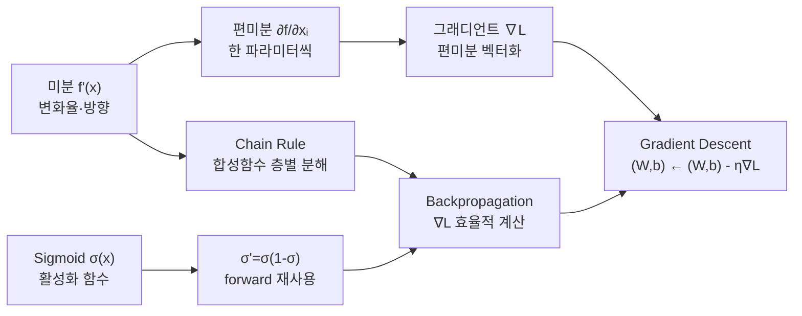
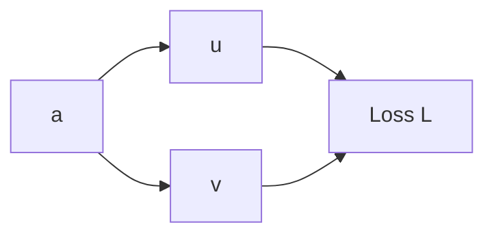
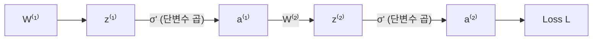
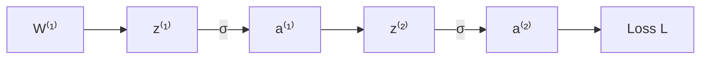

# 2026-05-07 ML 10강: Backpropagation을 위한 수학 도구

> **소스 참조:** `gradient_descent.py` · `week10_examples.ipynb` · 슬라이드 PDF  
> **핵심 흐름:** 미분 → 편미분 → 그래디언트 → Chain Rule → Sigmoid 미분 → Gradient Descent → Backpropagation 연결

---

## 강의 현황 (포인터)

| 강 | 파일 | 주요 주제 |
|----|------|-----------|
| 1강 | `20250306.md` | ML 개요·선형회귀·MSE·경사하강법 |
| 2강 | `20250313.md` | 분류·로지스틱 회귀·나이브 베이즈·정규화·교차검증 |
| 3강 | `20250319.md` | Python 라이브러리·NumPy |
| 4강 | `20250326.md` | Pandas·EDA·타이타닉·상관행렬 |
| 6강 | `20260409.md` | Classification·KNN·SVM·Decision Tree |
| 7강 | `20260416.md` | Decision Tree·Random Forest·Bagging/Boosting |
| 중간고사 | `…MID….md` | Regression·Classification 종합 |
| 8강 | `20260430.md` | Neural Networks·Perceptron·MLP·역전파 개요 |
| **10강** | **본 문서** | **Backpropagation을 위한 수학 도구** |

---

## 목차

1. [강의 개요](#1-강의-개요)
2. [미분 복습](#2-미분-복습)
3. [편미분과 그래디언트](#3-편미분과-그래디언트)
4. [Chain Rule](#4-chain-rule)
5. [Sigmoid 미분](#5-sigmoid-미분)
6. [Gradient Descent](#6-gradient-descent)
7. [신경망/Backprop과의 연결](#7-신경망backprop과의-연결)
8. [정리 및 연습 아이디어](#8-정리-및-연습-아이디어)

---

## 1. 강의 개요

### 1.1 "학습 = 최적화 문제"를 다시 연결하며

슬라이드 첫 장의 메시지를 한 줄로 요약하면 이렇다.

> **신경망 학습 = \(\min_{W,b} L(W,b)\)를 푸는 최적화 문제.  
> 그 도구가 Gradient Descent, 그 재료가 \(\nabla L\), 그것을 계산하는 방법이 Backpropagation.**

이것이 지금 슬라이드에서 말하는 전부다. 아래에서 이 구조를 1강~8강과 이어서 천천히 뜯어본다.

---

### 1.2 1강과의 연결 — 이미 한 번 봤던 구조

1강에서 선형회귀를 배울 때 이런 흐름을 따랐다.

| 단계 | 1강 (선형회귀) |
|------|---------------|
| 모델 | \(h_{m,b}(x) = mx + b\) |
| 손실함수 | \(L(m,b) = \tfrac{1}{n}\sum(y_i - h(x_i))^2\) (MSE) |
| 목표 | \(\min_{m,b}\, L(m,b)\) |
| 도구 | \(m \leftarrow m - \eta\,\tfrac{\partial L}{\partial m},\quad b \leftarrow b - \eta\,\tfrac{\partial L}{\partial b}\) |

파라미터가 딱 2개(\(m, b\))인 2차원 MSE 곡면 위를 경사를 따라 내려갔다.  
슬라이드 그림의 "손실 그릇 위를 빨간 화살표로 내려오는 것"이 바로 그 모습이다.

**10강 슬라이드는 이것을 신경망 버전으로 올린 것이다.**

| 단계 | 10강 (신경망) |
|------|--------------|
| 모델 | \(\hat{y} = f_{W,b}(x)\) (다층 신경망) |
| 손실함수 | \(L(W,b)\) (cross-entropy 등) |
| 목표 | \(\min_{W,b}\, L(W,b)\) |
| 도구 | \((W,b) \leftarrow (W,b) - \eta\,\nabla L(W,b)\) |

구조는 **완전히 동일**하다.  
달라진 것은 파라미터가 2개에서 수십만~수백만 개로 늘었다는 것뿐이다.

---

### 1.3 "오늘의 목표" 문장을 한 줄씩 해석하면

> 오늘의 목표: Gradient Descent에 필요한 수학 도구(\(\nabla L\), chain rule)를 확보한다.

이 문장을 분해하면 세 가지 주장이 담겨 있다.

**① GD는 방향만 알면 된다**

GD 업데이트 식:

\[
(W,b) \leftarrow (W,b) - \eta\,\nabla L(W,b)
\]

필요한 건 "현재 \((W,b)\)에서 손실이 어느 방향으로 얼마나 줄어드는지",  
즉 **그래디언트 \(\nabla L\)** 뿐이다.

**② \(\nabla L\)은 편미분의 벡터다**

\[
\nabla L = \left(\frac{\partial L}{\partial W^{(1)}_{11}},\; \frac{\partial L}{\partial W^{(1)}_{12}},\; \dots,\; \frac{\partial L}{\partial b^{(L)}_k},\; \dots\right)
\]

모든 파라미터에 대한 편미분을 하나의 벡터로 모은 것.  
"편미분을 모두 계산할 수 있다면 \(\nabla L\)은 자동으로 나온다."

**③ 편미분을 계산하려면 Chain Rule이 필요하다**

신경망은 다음처럼 여러 함수가 겹겹이 합성된 구조다.

\[
x \;\xrightarrow{W^{(1)},b^{(1)}}\; z^{(1)} \;\xrightarrow{\sigma}\; a^{(1)} \;\xrightarrow{\cdots}\; \hat{y} \;\xrightarrow{\text{loss}}\; L
\]

손실 \(L\)이 입력층 가까운 가중치 \(W^{(1)}\)에 얼마나 영향을 받는지는  
중간 계층을 모두 거쳐서 미분해야 하므로, **연쇄법칙(Chain Rule)** 없이는 계산이 불가능하다.

따라서 "오늘의 목표"를 제대로 읽으면 이렇다.

> **"1강·2강에서 경험했던 GD를 신경망 수준에서도 쓸 수 있게 하려면, 수십만 개 파라미터 각각에 대한 \(\nabla L\)을 계산해야 한다. 그러려면 편미분, 그래디언트, Chain Rule이라는 수학 도구가 먼저 필요하다. 오늘이 그 도구를 확보하는 날이다."**

---

### 1.4 이전 강의와의 정확한 연결 고리

| 강의 | 당시 배운 것 | 10강에서 일반화되는 방식 |
|------|------------|------------------------|
| **1강** 선형회귀·MSE·GD | \(\partial L/\partial m,\;\partial L/\partial b\) 계산 후 GD 적용 | 파라미터 2개 → 수백만 개; 직접 미분 → Chain Rule로 |
| **2강** sigmoid·cross-entropy | sigmoid 도함수 공식을 "주어진 것"으로 사용 | 오늘 \(\sigma'=\sigma(1-\sigma)\)를 유도함으로써 그 공식의 근거가 채워짐 |
| **8강** Perceptron·MLP | Forward→Loss→Backward→Update 루프를 개념으로 소개 | 오늘 Backward(역전파)의 수학 = 편미분 + Chain Rule임을 확인 |

**핵심 요약 (한 문장 자기 설명)**

> 1강에서는 직선 \(y=mx+b\) 하나를 맞추기 위해 \(m, b\) 2개를 편미분해서 GD를 돌렸는데,  
> 지금 슬라이드의 \(W, b\)는 그 \(m, b\)를 파라미터 수백만 개로 확장한 것이고  
> 업데이트 식 \((W,b) \leftarrow (W,b) - \eta\nabla L\)은 형태가 동일하다.  
> 달라진 건 신경망이 합성함수이기 때문에 \(\nabla L\)을 직접 쓸 수 없고,  
> Chain Rule을 층마다 반복 적용하는 역전파가 그 계산을 대신한다는 것뿐이다.

---

### 1.5 역전파와 이 슬라이드의 관계 — 한 줄 정리

| 개념 | 역할 |
|------|------|
| \(\min_{W,b} L(W,b)\) | 신경망 학습이 푸는 문제 |
| \((W,b) \leftarrow (W,b) - \eta\nabla L\) | 그 문제를 푸는 알고리즘 (Gradient Descent) |
| \(\nabla L\) | GD에 필요한 입력값 |
| **Backpropagation** | \(\nabla L\)을 효율적으로 계산하는 알고리즘 (= 체인룰의 반복 적용) |

오늘 배우는 미분·편미분·그래디언트·Chain Rule은 모두 이 마지막 행을 채우기 위한 수학적 기반이다.

---

### 1.6 오늘 전체 흐름



### 1.7 후속 강의 예고

- **Week 11:** Gradient check — 수치 미분으로 역전파 구현이 맞는지 검증하는 디버깅 기법
- **Week 12:** Vanishing Gradient — Sigmoid 층이 깊어질수록 \(0.25^L\)로 gradient가 소멸하는 문제, ReLU·Batch Normalization으로 해결

---

## 2. 미분 복습

### 2.1 한 줄 정의

> **미분 \(f'(x)\):** 함수 \(f\)가 \(x\)에서 얼마나 빠르게 변하는지를 나타내는 순간 변화율.

이 두 절(§2.2 접선 + §2.3 공식표)이 나오는 이유는 하나다.

> "역전파에서 \(\nabla L\)을 계산하려면 엄청나게 많은 미분을 해야 하는데,  
> 그 미분은 전부 '접선의 기울기' 개념 + 이 표에 있는 기본 공식 + Chain Rule 조합으로 계산된다."

---

### 2.2 접선 기울기 — GD의 "방향/속도계"

#### 수식 정의

\[
f'(a) = \lim_{h \to 0} \frac{f(a+h) - f(a)}{h}
\]

\(a\) 근처에서 아주 작은 \(h\)만큼 \(x\)를 움직였을 때 \(y\)가 얼마나 빠르게 바뀌는지를 재는 것.  
기하적으로는, \((a,\,f(a))\)와 \((a+h,\,f(a+h))\)를 잇는 **할선의 기울기를 \(h \to 0\)으로 보냈을 때**의 극한 = 접선의 기울기.

#### \(f(x) = x^2\)에서 세 점의 접선 기울기

| 점 | \(f'(x) = 2x\) 값 | 의미 | GD 관점 |
|----|-------------------|------|---------|
| \(x = -2\) | \(f'(-2) = -4\) | 오른쪽으로 갈수록 \(y\)가 내려감 (감소) | 파라미터를 **오른쪽**(양의 방향)으로 이동 |
| \(x = 0\) | \(f'(0) = 0\) | 더 이상 내려가지도 올라가지도 않음 | **이동 없음 → 최솟값 후보** |
| \(x = 1.5\) | \(f'(1.5) = 3\) | 오른쪽으로 갈수록 \(y\)가 올라감 (증가) | 파라미터를 **왼쪽**(음의 방향)으로 이동 |

#### 미분의 두 가지 정보 → GD의 두 가지 역할

미분은 **부호 + 크기** 두 가지를 동시에 알려주는데, 이것이 GD 업데이트에 그대로 대응된다.

| 미분 정보 | 의미 | GD에서의 역할 |
|-----------|------|--------------|
| **부호** (+/−) | 증가 방향인가, 감소 방향인가 | **어느 방향으로 갈까?** (왼쪽/오른쪽) |
| **크기** (\|f'(x)\|) | 기울기가 얼마나 가파른가 | **얼마나 크게 한 번에 움직일까?** (\(\eta\)와 곱해짐) |

\[
x_{\text{new}} = x - \eta \cdot \underbrace{f'(x)}_{\text{부호: 방향}\;\;\text{크기: step}}
\]

> **1강 연결:** 1강에서 \((m,b)\)를 업데이트할 때도, \(\partial L/\partial m\)의 부호로 방향을 정하고 크기만큼 이동했다. 스칼라 \(f'(x)\)가 벡터 \(\nabla L\)로 확장되었을 뿐, 원리는 동일하다.

---

### 2.3 미분 기본 공식표 — 역전파를 위한 공구 상자

이 표는 단순한 수학 복습이 아니다.  
**뒤에 나올 Sigmoid·Chain Rule·역전파에서 실제로 꺼내 쓸 레고 블록**들이다.

| 규칙 | 수식 | 예시 | 역전파에서 쓰이는 맥락 |
|------|------|------|----------------------|
| **거듭제곱** | \((x^n)' = nx^{n-1}\) | \((x^3)' = 3x^2\) | MSE \((y-\hat{y})^2\) 미분 시 2가 튀어나오는 이유 |
| **지수** | \((e^x)' = e^x\) | \((e^{2x})' = 2e^{2x}\) | \(e^{-x}\) 미분 시 (chain rule 살짝 포함) |
| **로그** | \((\ln x)' = \tfrac{1}{x}\) | \((\ln x^2)' = \tfrac{2}{x}\) | cross-entropy, log-likelihood 미분의 기본 재료 |
| **곱셈** | \((fg)' = f'g + fg'\) | \((xe^x)' = e^x + xe^x\) | 복잡한 활성화 함수·손실 함수에서 자주 등장 |
| **나눗셈** | \(\left(\tfrac{f}{g}\right)' = \tfrac{f'g - fg'}{g^2}\) | §5 Sigmoid 유도에서 직접 사용 | \(\sigma(x) = \frac{1}{1+e^{-x}}\) 미분 구조와 동일 |

#### 각 공식이 나중에 어디서 다시 나오는지

**거듭제곱 → MSE 미분**

1강에서 MSE \(L = \frac{1}{n}\sum(y_i - \hat{y}_i)^2\)를 \(\hat{y}_i\)로 미분할 때 지수 2가 앞으로 내려온다.

\[
\frac{\partial}{\partial \hat{y}} (y - \hat{y})^2 = 2(y - \hat{y}) \cdot (-1) = -2(y-\hat{y})
\]

거듭제곱 규칙의 직접 적용이다.

**지수 → Sigmoid 분모 미분**

\(\sigma(x)\)를 유도할 때 \((e^{-x})'\)가 필요한데, chain rule과 조합하면:

\[
(e^{-x})' = e^{-x} \cdot (-1) = -e^{-x}
\]

"외부 \(e^u\)의 미분은 \(e^u\), 내부 \(-x\)의 미분은 \(-1\)" — 지수 규칙 + chain rule 조합.

**로그 → Cross-entropy 미분**

2강 cross-entropy \(L = -\sum y_i \ln \hat{y}_i\)를 미분하면:

\[
\frac{\partial L}{\partial \hat{y}_i} = -\frac{y_i}{\hat{y}_i}
\]

로그 공식 \((\ln x)' = 1/x\)의 직접 적용이다.

**나눗셈 → Sigmoid**

\(\sigma(x) = \frac{1}{1+e^{-x}}\)는 \(\frac{f}{g}\) 꼴. 실제 유도에서는 \((1+e^{-x})^{-1}\)로 쓰고 chain rule을 쓰지만, 구조는 나눗셈 법칙과 동일하다.

> **슬라이드 주황 문장 해석:**  
> "곱셈 법칙과 나눗셈 법칙은 Sigmoid 미분 유도에 바로 사용됩니다"  
> → 이 표가 그냥 복습이 아니라, **몇 슬라이드 뒤에 펼쳐질 \(\sigma'(x)\) 유도의 예고편**이다.

#### 이 두 슬라이드의 역할 정리

| 슬라이드 | 역할 |
|----------|------|
| 접선 기울기 그림 | "미분 = GD의 방향·속도계"를 시각적으로 각인 |
| 기본 공식 표 | MSE·cross-entropy·sigmoid·합성함수 미분에 쓸 기본 레고 블록 확보 |

### 2.4 미분 연습 문제

#### 예제

| 문제 | 풀이 핵심 | 답 |
|------|----------|-----|
| \(f(x) = 3x^4 - 2x + 7\) | 항별 거듭제곱 법칙 | \(f'(x) = 12x^3 - 2\) |
| \(f(x) = x\ln x\) | 곱셈 법칙: \(f=x,\,g=\ln x\) | \(f'(x) = \ln x + 1\) |
| \(f(x) = \tfrac{2x+1}{x-3}\) | 나눗셈 법칙 | \(f'(x) = \tfrac{-7}{(x-3)^2}\) |

#### 문제 2 해설 — 헷갈리기 쉬운 포인트

\(f(x) = x \ln x\)에서 \((x)' = 1\)임에 주의.

\[
(x \cdot \ln x)' = 1 \cdot \ln x + x \cdot \frac{1}{x} = \ln x + 1
\]

마지막 항 \(x \cdot \frac{1}{x} = 1\)을 빠뜨리면 틀린다.

#### 문제 3 해설

\[
f'(x) = \frac{2(x-3) - (2x+1) \cdot 1}{(x-3)^2} = \frac{-7}{(x-3)^2}
\]

분자를 전개하면 \(2x - 6 - 2x - 1 = -7\)로 상수가 나온다.  
\(x = 3\)에서는 분모가 0이 되어 정의 불가(점근선).

### 2.5 수치 미분과 접선 시각화 — 수식·코드·그림 3단계 대응

> 이 두 블록(예제 1·2)은 슬라이드와 `week10_examples.ipynb`가 1:1 대응된다.  
> "수식 정의 → 파이썬 구현 → 그림으로 확인" 흐름을 따라가는 것이 핵심이다.

---

#### 예제 1: 수치 미분 — 정의식 → `numerical_derivative` (슬라이드 5–6, Cell 3)

컴퓨터는 극한을 직접 계산할 수 없다. 대신 작은 \(h\)로 **근사**한다.

**순방향 차분 vs 중앙 차분**

| 방식 | 수식 | 오차 차수 | ipynb 사용 여부 |
|------|------|-----------|----------------|
| 순방향 차분 | \(\dfrac{f(a+h)-f(a)}{h}\) | \(O(h)\) | ✗ |
| **중앙 차분** | \(\dfrac{f(a+h)-f(a-h)}{2h}\) | \(O(h^2)\) — 더 정확 | ✓ |

중앙 차분이 더 정확한 이유: \(a\)의 **양쪽**을 모두 보기 때문에 1차 오차항이 소거된다.

**수식 ↔ 코드 대응**

\[
f'(a) \approx \frac{f(a+h) - f(a-h)}{2h}
\]

```python
# week10_examples.ipynb — 예제 1, Cell 3
def numerical_derivative(f, a, h=1e-5):
    """중앙 차분법으로 수치 미분."""
    return (f(a + h) - f(a - h)) / (2 * h)
#           ↑ f(a+h)          ↑ f(a-h)    ↑ 2h
```

- 입력: 함수 `f`, 평가 점 `a`, 작은 간격 `h = 1e-5`
- 출력: 정의식 근사값 \(\approx f'(a)\)

**해석적 미분과 비교**

```python
f                  = lambda x: x**2
f_prime_analytical = lambda x: 2 * x   # 해석적 정답

for x in [-2, -1, 0, 1, 2, 3]:
    numerical  = numerical_derivative(f, x)   # ≈ 수치 미분
    analytical = f_prime_analytical(x)        # = 2x
    # 차이는 ~1e-10 수준 → 거의 일치
```

**관찰해야 할 포인트**

- \(x=-2\): 수치 ≈ \(-4.0\), 해석 \(= -4\) → 일치
- \(x=0\): 수치 ≈ \(0.0\), 해석 \(= 0\) → 일치
- 차이가 \(\sim 10^{-10}\) 수준이므로, 수치 미분이 해석적 결과를 실질적으로 재현

> **Gradient Check와의 연결 (Week 11 예고):**  
> 이 `numerical_derivative`가 나중에 역전파 구현의 검증 도구로 다시 등장한다.  
> 역전파로 구한 \(\nabla L\)과 수치 미분으로 구한 \(\nabla L\)을 비교해서  
> 차이가 \(10^{-5}\) 이하이면 역전파 구현이 올바른 것으로 판정한다.  
> Sigmoid처럼 복잡한 함수를 직접 유도한 다음, 이 함수로 "공식이 맞는지" 바로 확인할 수 있다.

---

#### 예제 2: 접선 시각화 — 접선 수식 → `tangent` 코드 (슬라이드 5, Cell 6)

**접선의 수학 공식 — 점-기울기형**

기울기 \(k\)와 지나는 점 \((x_0, y_0)\)를 알면 직선이 결정된다:

\[
y - y_0 = k(x - x_0) \quad\Rightarrow\quad y = f'(a)\cdot(x - a) + f(a)
\]

> **코드 한 줄 해석:**  
> `tangent = slope * (xs_tan - a) + fa`에서  
> `slope = f'(a)`, `xs_tan - a = (x - a)`, `fa = f(a)` 이므로  
> 수식 \(f'(a)(x-a)+f(a)\)와 **1:1 대응**이다.  
> "기울기와 지나는 점 하나를 알면 직선이 결정된다"는 점-기울기형 방정식의 코드 번역.

**수식 ↔ 코드 대응**

```python
# week10_examples.ipynb — 예제 2, Cell 6
f  = lambda x: x**2
df = lambda x: 2 * x

for a, color in [(-2, 'red'), (0, 'green'), (1.5, 'orange')]:
    slope  = df(a)                          # f'(a)
    fa     = f(a)                           # f(a)
    xs_tan = np.linspace(a - 1, a + 1, 30) # 접선 x 범위
    tangent = slope * (xs_tan - a) + fa     # f'(a)·(x-a) + f(a)
    ax.plot(xs_tan, tangent, '--', color=color, ...)
    ax.plot(a, fa, 'o', color=color, ...)   # 접점 표시
```

| 코드 | 대응 수식 | 의미 |
|------|----------|------|
| `slope = df(a)` | \(f'(a)\) | 접선 기울기 |
| `fa = f(a)` | \(f(a)\) | 접점의 y값 |
| `xs_tan - a` | \(x - a\) | 접점으로부터의 x 거리 |
| `slope * (xs_tan - a) + fa` | \(f'(a)(x-a)+f(a)\) | 접선 y값 |

**그림에서 관찰해야 할 포인트**

| 점 \(a\) | 기울기 `slope` | 접선 방향 | GD 이동 방향 |
|----------|--------------|----------|------------|
| \(-2\) | \(-4\) (음수) | 오른쪽으로 내려감 | 양의 방향(\(+x\))으로 이동 |
| \(0\) | \(0\) (수평) | 평평함 → 최솟값 | 이동 없음 |
| \(1.5\) | \(3\) (양수) | 오른쪽으로 올라감 | 음의 방향(\(-x\))으로 이동 |

> GD 업데이트식 \(x_{\text{new}} = x - \eta f'(x)\)에서, 접선 기울기가 양수이면  
> \(x\)를 줄여야 하고(음의 방향), 음수이면 \(x\)를 늘려야 한다(양의 방향).  
> 지금 그림의 접선이 그 방향 정보를 그대로 시각화하고 있다.

**이 감각이 이어지는 곳**

1D 접선 기울기 → **2D 그래디언트 벡터** → **등고선 + 화살표 그림(예제 4)**  
같은 원리가 차원만 높아진다. §3(편미분·그래디언트)에서 바로 이어진다.

---

**두 예제의 역할 요약**

| 예제 | 함수 | 핵심 연결 |
|------|------|-----------|
| 예제 1 `numerical_derivative` | \(f(x)=x^2\) | 정의식 → 코드 근사 → Gradient Check의 원리 |
| 예제 2 접선 시각화 | \(f(x)=x^2\) + 세 점 | 점-기울기형 접선 → GD 방향 감각 → 2D 그래디언트 확장 |

**연습 과제**

1. `numerical_derivative(lambda x: np.sin(x), a=np.pi/4)`를 실행하고, 해석적 결과 \(\cos(\pi/4) \approx 0.7071\)과 비교하라.
2. 예제 2 코드에서 `a=2.0`을 추가해 네 번째 접선을 그려라. 기울기는 얼마이고, GD라면 어느 방향으로 이동하는가?

---

## 3. 편미분과 그래디언트

> **이 절의 핵심 흐름:**  
> 한 점에서의 기울기(1D 미분) → 한 방향만의 기울기(편미분) → 모든 방향을 한 번에 담은 벡터(그래디언트) → 그 벡터를 따라 내려가는 알고리즘(GD) → 신경망 학습.

---

### 3.1 편미분 — 한 줄 정의

> **편미분 \(\partial f/\partial x_i\):** 다변수 함수에서 \(x_i\)만 움직이고 나머지는 상수로 고정했을 때의 변화율.  
> 즉, **3D 표면을 한 방향으로 슬라이스해서 2D로 떨어뜨린 다음, 1D 미분을 한 것**.

### 3.2 직관 — 3D 표면 위의 "한 방향 기울기"

**비유:** 산의 등고선 지도에서 **동쪽(x 방향)으로만** 걸어갈 때의 경사도.  
그 순간 남북(y 방향)은 완전히 고정(상수)이다.

**3D로 보면:**

\(z = f(x,y)\) 전체는 "언덕/그릇" 모양의 표면이다.

- \(\partial f/\partial x\): y를 고정한 "x-방향 슬라이스" → 2D 곡선 → 그 위 접선 기울기
- \(\partial f/\partial y\): x를 고정한 "y-방향 슬라이스" → 2D 곡선 → 그 위 접선 기울기

이 두 방향의 기울기가 **따로 존재**하는 게 편미분의 핵심이다.

### 3.3 예제: \(f(x, y) = x^2 + 3xy + y^2\)

#### \(x\)로 편미분 — y를 상수로 고정

| 항 | \(\partial/\partial x\) | 이유 |
|----|------------------------|------|
| \(x^2\) | \(2x\) | 거듭제곱 법칙 |
| \(3xy\) | \(3y\) | \(y\)는 상수 → \(3y \cdot (x)' = 3y \cdot 1\) |
| \(y^2\) | \(0\) | \(x\)가 포함되지 않음 |

\[
\frac{\partial f}{\partial x} = 2x + 3y
\]

#### \(y\)로 편미분 — x를 상수로 고정

| 항 | \(\partial/\partial y\) | 이유 |
|----|------------------------|------|
| \(x^2\) | \(0\) | \(y\)가 포함되지 않음 |
| \(3xy\) | \(3x\) | \(x\)는 상수 → \(3x \cdot (y)' = 3x \cdot 1\) |
| \(y^2\) | \(2y\) | 거듭제곱 법칙 |

\[
\frac{\partial f}{\partial y} = 3x + 2y
\]

> **헷갈리기 쉬운 포인트:** \(3xy\)를 \(y\)로 미분하면 왜 \(3x\)인가?  
> \(x\)가 상수 취급이므로 계수처럼 앞으로 나온다: \(3 \cdot x \cdot (y)' = 3x \cdot 1 = 3x\).

---

### 3.4 예제 3: 편미분 시각화 — 3D surface + slice (슬라이드 9–10, Cell 8)

**슬라이드 9–10과 대응. `week10_examples.ipynb` — 예제 3, Cell 8**

```python
f     = lambda x, y: x**2 + 3*x*y + y**2
df_dx = lambda x, y: 2*x + 3*y   # ∂f/∂x
df_dy = lambda x, y: 3*x + 2*y   # ∂f/∂y

a, b = 1.0, 1.0                    # 평가 지점 (1, 1)
slope_x = df_dx(a, b)              # = 5  (x 방향 기울기)
slope_y = df_dy(a, b)              # = 5  (y 방향 기울기)
```

**그림에서 관찰해야 할 포인트**

- **왼쪽 (3D 표면):** 전체 \(z = f(x,y)\) 표면. 안장(saddle)에 가까운 형태.
- **가운데 (y=1 고정 slice):** \(g(x) = f(x,1) = x^2 + 3x + 1\). 이 1D 곡선 위 \(x=1\) 접선의 기울기 = \(df\_dx(1,1) = 5\).
- **오른쪽 (x=1 고정 slice):** \(h(y) = f(1,y) = 1 + 3y + y^2\). 이 1D 곡선 위 \(y=1\) 접선의 기울기 = \(df\_dy(1,1) = 5\).

평가 지점 \((1,1)\)에서 두 편미분이 모두 5라는 것은, x 방향이든 y 방향이든 같은 속도로 함수가 증가한다는 뜻이다.

---

### 3.5 그래디언트 — 두 기울기를 한 번에 담은 벡터

편미분 두 개가 따로 존재하는 것을 **하나의 벡터로 묶으면** 그래디언트가 된다.

\[
\nabla f(x,y) = \left( \frac{\partial f}{\partial x},\; \frac{\partial f}{\partial y} \right)
\]

**벡터(vector)란?** 여러 수를 한 번에 모아 놓은 것 — 여기서는 각 방향의 기울기를 성분으로 가진다.  
수학적으로는 "방향 + 크기"를 동시에 표현하는 화살표.

\(n\)개 변수로 일반화:

\[
\nabla f(\mathbf{x}) = \left( \frac{\partial f}{\partial x_1},\; \frac{\partial f}{\partial x_2},\; \ldots,\; \frac{\partial f}{\partial x_n} \right)
\]

**그래디언트 한 문장 정의:**
> 그래디언트는 다변수 함수의 각 변수에 대한 **편미분**을 성분으로 모아 만든 **벡터**로,  
> 현재 위치에서 함수가 **가장 빨리 증가하는 방향**과 그 증가 속도를 동시에 알려준다.

### 3.6 그래디언트의 핵심 성질 3가지

| 성질 | 내용 | 직관 |
|------|------|------|
| **방향** | \(\nabla f\)는 함수가 가장 빠르게 **증가**하는 방향 | 산에서 가장 가파르게 올라가는 방향 |
| **크기** | \(\|\nabla f\|\)는 그 방향에서의 증가율 | 경사가 얼마나 가파른가 |
| **수직성** | \(\nabla f\)는 등고선(level set)에 항상 수직 | 같은 높이 곡선을 따라 가면 높이가 안 변하므로, 가장 빨리 변하는 방향은 수직 |

**최소화:** 함수를 줄이려면 반대 방향 \(-\nabla f\)로 이동.

\[
\mathbf{x}_{\text{new}} = \mathbf{x} - \eta\,\nabla f(\mathbf{x})
\]

이것이 §6 Gradient Descent의 전부다.

---

### 3.7 예제 4: 그래디언트 벡터장 시각화 (슬라이드 11–12, Cell 10)

**슬라이드 11–12와 대응. `week10_examples.ipynb` — 예제 4, Cell 10**

```python
f      = lambda x, y: x**2 + y**2
grad_f = lambda x, y: np.array([2*x, 2*y])  # ∇f = (2x, 2y)

# 등고선 위에 그래디언트 화살표를 격자 점마다 그림
for x in xs_arr:
    for y in ys_arr:
        g = grad_f(x, y)
        ax.annotate("", xy=(x + g[0]*scale, y + g[1]*scale),
                    xytext=(x, y), arrowprops=dict(arrowstyle="->"))
```

**수식 ↔ 코드 대응**

| 수식 | 코드 |
|------|------|
| \(\nabla f(x,y) = (2x, 2y)\) | `grad_f = lambda x, y: np.array([2*x, 2*y])` |
| 각 점에서 화살표 방향 | `xy=(x + g[0]*scale, y + g[1]*scale)` |

**그래프에서 관찰해야 할 포인트**

- 모든 화살표가 원점에서 **바깥 방향** → 원점이 최솟값 (bowl 형태)
- 화살표가 **등고선(원)에 수직** → 수직성 성질 직접 확인
- 원점에서 멀수록 화살표가 길어짐 → \(\|\nabla f\| = \|(2x, 2y)\| = 2\sqrt{x^2+y^2}\), 거리에 비례
- **GD라면** 이 화살표의 **반대 방향**으로 움직이면 된다

---

### 3.8 미분 → 편미분 → 그래디언트 → GD → 신경망 전체 연결


**차원별 대응**

| 차원 | 파라미터 | 손실 표면 | 업데이트 식 |
|------|----------|----------|------------|
| 1D | \(x\) (스칼라) | \(f(x)\) 곡선 | \(x \leftarrow x - \eta f'(x)\) |
| 2D | \((w_1, w_2)\) | \(L(w_1,w_2)\) 표면 | \(\mathbf{w} \leftarrow \mathbf{w} - \eta\nabla L\) |
| 신경망 | \(\theta=(W^{(1)},b^{(1)},\ldots,W^{(L)},b^{(L)})\) | \(L(\theta)\) 초고차원 표면 | \(\theta \leftarrow \theta - \eta\nabla_\theta L\) |

수식의 형태는 **언제나 동일**하다. 차원만 다를 뿐.

**신경망 파라미터를 벡터로 보면:**

\[
\theta = \underbrace{(W^{(1)},\; b^{(1)},\; \ldots,\; W^{(L)},\; b^{(L)})}_{\text{수천~수백만 차원 벡터}}
\]

학습 = \(\min_\theta L(\theta)\)를 풀기 위해 매 스텝마다:

\[
\theta \leftarrow \theta - \eta\,\nabla_\theta L
\]

여기서 \(\nabla_\theta L\)을 효율적으로 계산하는 것이 **Backpropagation**.

---

### 3.8.1 선형회귀 GD vs 신경망 GD — 같은 알고리즘, 달라진 두 가지

> **핵심:** 두 GD는 다른 알고리즘이 아니다. 업데이트 식 \(\theta \leftarrow \theta - \eta\nabla_\theta L\)은 완전히 동일하다.  
> 달라진 것은 **① 파라미터 차원** + **② 그래디언트 계산 방식** 뿐이다.

---

#### ① 1강 선형회귀 GD 복습 — 이미 다변수 GD였다

1강에서 한 것을 다시 보면:

| 구성 요소 | 1강 선형회귀 |
|----------|------------|
| 모델 | \(\hat{y} = mx + b\) |
| 손실 | \(L(m,b) = \dfrac{1}{n}\sum_i (y_i - (mx_i+b))^2\) |
| 목표 | \(\min_{m,b} L(m,b)\) |
| 업데이트 | \(m \leftarrow m - \eta\,\dfrac{\partial L}{\partial m},\quad b \leftarrow b - \eta\,\dfrac{\partial L}{\partial b}\) |

파라미터를 벡터로 묶으면 \(\theta = (m, b)\)이고, 이미 **다변수 GD**였다:

\[
\theta \leftarrow \theta - \eta\,\nabla_\theta L(\theta)
\]

파라미터 2개짜리 2D 공간 위에 손실 \(L\)을 높이로 그리면 **3D 그릇**이 된다 — 이게 1강 슬라이드에서 본 그림이다.

---

#### ② 10강 GD — 수식은 동일, 차원과 구조만 달라짐

| | 선형회귀 | 로지스틱 회귀 | 신경망 |
|--|---------|-------------|-------|
| 파라미터 \(\theta\) | \((m, b)\) — 2개 | \((w_1,\ldots,w_p,b)\) | \((W^{(1)},b^{(1)},\ldots,W^{(L)},b^{(L)})\) — 수백만 개 |
| 손실 \(L\) | MSE | Cross-entropy | Cross-entropy (합성 구조) |
| 업데이트 식 | \(\theta \leftarrow \theta - \eta\nabla_\theta L\) | **동일** | **동일** |

**추가된 것은 "다변수" 그 자체가 아니라:**

1. \(\theta\)의 **차원**이 수백만으로 커졌다
2. \(L(\theta)\)가 **여러 층을 거치는 합성함수**라서 \(\nabla_\theta L\)을 구하는 데 Chain Rule(역전파)이 필요해졌다

---

#### ③ 왜 슬라이드에 3D 그림이 나오는가 — 피처가 아니라 파라미터

> **흔한 오해:** "피처 \(x, y\)가 2개라서 3D가 나왔다"  
> **정확한 해석:** **파라미터(가중치) \(w_1, w_2\)가 2개라서** 3D 그림이 가능한 것이다.

| 그래프의 축 | 의미 | 학습 중 바뀌는가? |
|-----------|------|-----------------|
| 가로 두 축 \(w_1, w_2\) | **파라미터(가중치)** | ✓ GD가 매 스텝 업데이트 |
| 세로 축(높이) \(L\) | 손실값 | 파라미터에 따라 달라짐 |
| 입력 데이터 \(x\) | 피처 (키·나이 등) | ✗ 학습 중 고정 |

```
파라미터 2개   → L(w₁, w₂)   → 3D 그릇으로 GD 동작 시각화 가능
파라미터 100만 개 → L(θ)    → 시각화 불가, 수식 θ ← θ-η∇L만 동일하게 적용
```

**구체 예시:**

- 1강 선형회귀: 파라미터 2개 \((m,b)\) → 2D 파라미터 공간 → 손실 3D 표면
- ipynb 예제 8: 파라미터 2개 \((w_1, w_2)\) → GD 데모용 3D 그릇 \(f(w_1,w_2)=w_1^2+w_2^2\)

---

#### ④ 선형회귀 GD vs 신경망 GD — 최종 비교표

| 비교 항목 | 1강 선형회귀 | 10강 신경망 |
|----------|------------|-----------|
| **업데이트 식** | \(\theta \leftarrow \theta - \eta\nabla_\theta L\) | **동일** |
| **파라미터 수** | 2개 \((m, b)\) | 수천~수백만 개 |
| **손실 곡면** | Convex — 전역 최솟값 하나 | Non-convex — local min·saddle point 다수 |
| **그래디언트 계산** | 직접 편미분 한 줄로 유도 | Forward pass → **Backprop(Chain Rule)** |
| **편미분 구조** | 선형 → 합성 없음 | 여러 층 합성 → Chain Rule 필수 |
| **초기값 중요도** | 낮음 (convex라 어디서 시작해도 수렴) | 높음 (non-convex라 초기값이 수렴 지점 결정) |

**편미분 계산 복잡도 비교**

*선형회귀* — 한 줄:

\[
\frac{\partial L}{\partial m} = \frac{-2}{n}\sum x_i(y_i - mx_i - b)
\]

*신경망 2층* — Chain Rule 5항 곱:

\[
\frac{\partial L}{\partial W^{(1)}} = \underbrace{\frac{\partial L}{\partial a^{(2)}}}_{\text{①}} \cdot \underbrace{\frac{\partial a^{(2)}}{\partial z^{(2)}}}_{\sigma'} \cdot \underbrace{\frac{\partial z^{(2)}}{\partial a^{(1)}}}_{\text{③}} \cdot \underbrace{\frac{\partial a^{(1)}}{\partial z^{(1)}}}_{\sigma'} \cdot \underbrace{\frac{\partial z^{(1)}}{\partial W^{(1)}}}_{\text{⑤}}
\]

층이 늘어날수록 곱하는 항이 늘어난다. Backprop은 이 항들을 **한 번의 backward pass로 모두 계산**하는 효율적 알고리즘이다.

---

**한 문장 요약:**

> 선형회귀 GD와 신경망 GD는 업데이트 식 \(\theta \leftarrow \theta - \eta\nabla_\theta L\)이라는 알고리즘이 완전히 동일하며,  
> 달라진 것은 **파라미터 차원**이 2개에서 수백만 개로 커진 것과,  
> 손실이 합성 구조가 되면서 **그래디언트 계산 방식**이 직접 편미분에서 Chain Rule(역전파)로 바뀐 것뿐이다.

---

### 3.8.2 왜 신경망 손실이 합성함수인가 — Backprop이 필요한 진짜 이유

> **핵심 질문:** 로스 함수 \(L(\theta)\)가 "레이어별 퍼셉트론별 가중치들의 함수"일 때,  
> 이게 왜 합성함수처럼 보이고, 그래서 왜 Backprop/Chain Rule이 필요한가?

---

#### ① \(L(\theta)\)는 모든 레이어·퍼셉트론 가중치의 함수

**로지스틱 회귀(퍼셉트론 1개):**

\[
\hat{y} = \sigma(w^\top x + b), \quad L(w,b) = \frac{1}{n}\sum_i \ell(\hat{y}_i, y_i)
\]

이미 "θ의 함수"였다. 레이어가 한 층이고 합성이 얕아서 체인룰을 한 번만 쓰면 끝난다.

**신경망 2-2-1 MLP:**

Forward pass 전체:

\[
z^{(1)} = W^{(1)}x + b^{(1)} \;\xrightarrow{\sigma}\; a^{(1)} = \sigma(z^{(1)})
\;\xrightarrow{W^{(2)}}\; z^{(2)} = W^{(2)}a^{(1)} + b^{(2)} \;\xrightarrow{\sigma}\; \hat{y} = \sigma(z^{(2)})
\;\xrightarrow{\ell}\; L
\]

손실 \(L\)은 **모든 레이어의 모든 파라미터에 동시에 의존**한다:

\[
L = L\!\left(W^{(1)}, b^{(1)}, W^{(2)}, b^{(2)}, \ldots\right)
\]

이 전체를 한 벡터로 묶은 것이 \(\theta\)다.

> "로스 함수 자체가 \(\theta\)로 들어간다"는 이해가 맞다.  
> \(\theta\)는 "각 레이어·각 퍼셉트론·각 피처에 가중되는 임의의 변수들을 전부 모은 큰 벡터"다.

---

#### ② "개별 퍼셉트론의 잔차" vs "전체 θ에 대한 로스"

퍼셉트론이 여러 개 있어도, 각 데이터 \(i\)에 대해 흐름은 하나다:

\[
x_i \;\xrightarrow{\theta}\; \hat{y}_i(\theta) \;\xrightarrow{\ell}\; \ell(\hat{y}_i, y_i)
\]

각 퍼셉트론의 weight \(w_{jk}^{(l)}\) (l층, j번째 뉴런, k번째 입력)는:

- 그 뉴런의 출력 \(a_j^{(l)}\)에 직접 영향
- → 다음 레이어 입력 → … → 최종 \(\hat{y}\) → \(L\)까지 **간접 영향이 누적**

따라서 \(L\)을 "개별 퍼셉트론의 잔차"로 쪼개기보다,  
**"모든 퍼셉트론의 weight를 입력으로 받는 하나의 큰 합성함수"** 로 보는 것이 더 자연스럽다.

---

#### ③ 레이어가 쌓이면 왜 합성함수가 되는가

2층 신경망의 forward를 함수 합성으로 쓰면:

\[
g_1(x) = \sigma(W^{(1)}x + b^{(1)}), \quad
g_2(a^{(1)}) = \sigma(W^{(2)}a^{(1)} + b^{(2)})
\]

\[
L = \ell\!\bigl(g_2(g_1(x)),\; y\bigr)
\]

"함수 안에 함수가 들어간 구조" → **정확히 합성함수(composition)**다.

레이어 수 \(n\)으로 일반화:

\[
L = \ell\!\bigl(g_n(\cdots g_2(g_1(x))\cdots),\; y\bigr)
\]

층이 깊어질수록 **합성의 깊이**가 늘어나고,  
초기 층 weight의 영향은 더 긴 경로를 통해 \(L\)에 도달한다.

---

#### ④ 그래서 \(\partial L / \partial W^{(1)}\)은 왜 Chain Rule로만 계산되는가

\(W^{(1)}\)이 \(L\)에 미치는 경로:

\[
W^{(1)} \;\to\; z^{(1)} \;\to\; a^{(1)} \;\to\; z^{(2)} \;\to\; a^{(2)} \;\to\; L
\]

Chain Rule 적용:

\[
\frac{\partial L}{\partial W^{(1)}} =
\underbrace{\frac{\partial L}{\partial a^{(2)}}}_{\text{L→출력층}} \cdot
\underbrace{\frac{\partial a^{(2)}}{\partial z^{(2)}}}_{\sigma'} \cdot
\underbrace{\frac{\partial z^{(2)}}{\partial a^{(1)}}}_{\text{2층 weight}=W^{(2)}} \cdot
\underbrace{\frac{\partial a^{(1)}}{\partial z^{(1)}}}_{\sigma'} \cdot
\underbrace{\frac{\partial z^{(1)}}{\partial W^{(1)}}}_{\text{직접 영향}=x}
\]

| 항 | 의미 |
|----|------|
| 맨 오른쪽 \(\partial z^{(1)}/\partial W^{(1)}\) | **직접 영향** — 해당 weight가 자기 뉴런 입력에 미치는 영향 (= \(x\)) |
| 중간 항들 | **간접 영향** — 그 뉴런 출력이 위 레이어들을 거쳐 \(L\)까지 전달되는 경로 |
| 전체 곱 | 직접 + 간접 경로를 모두 합산한 최종 gradient |

> **레이어가 깊어질수록 "영향 경로"가 길어지고,**  
> 그 경로를 따라 편미분을 곱해 나가야 한다 → 이것이 합성함수 + Chain Rule = Backprop이다.

---

#### ⑤ "퍼셉트론 1개 = 로지스틱 회귀"의 연결

| 구조 | 모델 | 체인룰 깊이 | 비고 |
|------|------|-----------|------|
| 퍼셉트론 1개 | \(\hat{y}=\sigma(w^\top x+b)\) | 1번 | 로지스틱 회귀와 완전 동일 |
| MLP 2층 | \(\sigma \circ \text{선형} \circ \sigma \circ \text{선형}\) | 5항 곱 | 위 수식 |
| MLP \(L\)층 | \(\sigma \circ \cdots \circ \sigma \circ \text{선형}\) | \(2L+1\)항 곱 | 층이 깊어질수록 곱 길어짐 |

딥러닝은 결국 **"로지스틱 회귀(선형+비선형)를 여러 층 합성한 것"** 이다.  
퍼셉트론이 한 개이면 로지스틱 회귀, 여러 층이면 MLP — 구조만 깊어진다.

---

#### ⑥ Backprop이 꼭 필요한 이유 — 한 문장

> 신경망은 입력이 여러 층의 변환을 거쳐 출력이 되는 **합성함수** 구조이기 때문에,  
> 초기 층의 weight가 \(L\)에 미치는 영향은 모든 중간 층을 통해 누적된 **간접적인 영향**이고,  
> 이를 수식으로 쓰면 여러 편미분의 곱(Chain Rule)이 되며,  
> Backprop은 이 곱을 한 번의 역방향 패스로 모든 weight에 대해 동시에 계산하는 알고리즘이다.

---

### 3.9 연습 문제

| 문제 | 답 | 풀이 힌트 |
|------|-----|---------|
| \(f(x,y)=2x^2+xy-y^2\) | \(\nabla f = (4x+y,\; x-2y)\) | \(\partial/\partial x\): \(4x+y\), \(\partial/\partial y\): \(x-2y\) |
| \(f(x,y)=e^{xy}\) | \(\nabla f = (ye^{xy},\; xe^{xy})\) | Chain Rule: 외부 \(e^u\), 내부 \(u=xy\) |
| \(f(x,y,z)=x^2+2y^2+3z^2\) | \(\nabla f = (2x,\; 4y,\; 6z)\) | 각 변수별 거듭제곱 법칙 |

> **1강 연결:** 1강에서 \(\partial \text{MSE}/\partial m\)과 \(\partial \text{MSE}/\partial b\)를 각각 구해 GD를 돌렸다.  
> 그것이 편미분이었고, 오늘의 \(\nabla L = (\partial L/\partial m, \partial L/\partial b)\)로 표현하면 그래디언트 벡터다.  
> 파라미터가 2개에서 수백만 개로 늘어나도 수식은 동일하다.

**강의 중 질문:** \(\nabla f\)가 등고선에 수직인 이유를 **수식 없이 직관으로** 설명할 수 있는가?  
(힌트: 등고선 위에서 움직이면 \(f\)값이 바뀌지 않는다. 그렇다면 \(f\)를 가장 빠르게 바꾸는 방향은 어느 쪽인가?)

---

## 4. Chain Rule

### 4.1 한 줄 정의

> **Chain Rule:** "입력의 작은 변화가 중간 노드들을 거치면서 출력에 어떻게 전파되는지"를 **곱**으로 표현하고, 경로가 여러 개 있으면 그 기여를 **합**으로 더하는 법칙.  
> 신경망의 Backprop은 이 단변수 **곱**과 다변수 **합**을 계산 그래프 전체에 체계적으로 반복하는 과정이다.

---

### 4.2 단변수 Chain Rule — 한 줄짜리 합성함수

#### 수식

\[
y = f(g(x)) \;\Rightarrow\; \frac{dy}{dx} = \underbrace{\frac{dy}{du}}_{\text{외부 미분}} \cdot \underbrace{\frac{du}{dx}}_{\text{내부 미분}}, \quad u = g(x)
\]

#### 직관

\(x\)가 조금 변하면 → \(u\)가 \(\dfrac{du}{dx}\)배 변하고 → 그 \(u\)의 변화가 다시 \(y\)를 \(\dfrac{dy}{du}\)배 변하게 한다.  
**영향이 경로를 따라 곱으로 전달된다.**

#### 예시: \(y = \sin(x^2)\)

| 단계 | 내용 |
|------|------|
| ① 치환 | \(u = x^2\) → \(y = \sin u\) |
| ② 외부 미분 | \(dy/du = \cos u = \cos(x^2)\) |
| ③ 내부 미분 | \(du/dx = 2x\) |
| ④ 곱 | \(dy/dx = \cos(x^2) \cdot 2x = 2x\cos(x^2)\) |

이 수준이 "일반 미적분 단변수 Chain Rule"이며, 신경망의 각 레이어·활성화·손실을 미분할 때 **로컬하게 반복** 사용된다.

---

### 4.3 단변수 Chain Rule 연습

| 문제 | 외부/내부 | 답 | 신경망 연결 |
|------|----------|----|-----------|
| \(y = e^{3x+1}\) | 외부 \(e^u\), 내부 \(3x+1\) | \(3e^{3x+1}\) | 지수 활성화 미분 |
| \(y = (x^2+1)^5\) | 외부 \(u^5\), 내부 \(x^2+1\) | \(10x(x^2+1)^4\) | 다항 활성화 |
| \(y = \ln(\sin x)\) | 외부 \(\ln u\), 내부 \(\sin x\) | \(\cot x\) | log-loss 미분 구조 |

> **헷갈리기 쉬운 포인트:** \(y=(x^2+1)^5\)에서 \(5(x^2+1)^4\)만 쓰면 오답.  
> 내부 미분 \((x^2+1)' = 2x\)를 반드시 곱해야 한다. **"내부 미분을 항상 곱한다"**가 Chain Rule의 핵심.

---

### 4.4 마지막 층 Chain Rule 예시 — Sigmoid + Cross-entropy

신경망 마지막 층에서 자주 나오는 구조:

\[
L = \ell(\sigma(z), y)
\]

\(z\)에 대한 편미분:

\[
\frac{\partial L}{\partial z} = \underbrace{\frac{\partial L}{\partial \sigma}}_{\text{cross-entropy 미분}} \cdot \underbrace{\frac{d\sigma}{dz}}_{\sigma(z)(1-\sigma(z))}
\]

| 항 | 값 | 출처 |
|----|-----|------|
| \(\partial L/\partial \sigma\) | \(-y/\sigma + (1-y)/(1-\sigma)\) | Cross-entropy를 출력으로 미분 |
| \(d\sigma/dz\) | \(\sigma(z)(1-\sigma(z))\) | §5에서 유도할 Sigmoid 도함수 |

**단변수 Chain Rule 한 번이 한 층을 완성**한다.

---

### 4.5 다변수 Chain Rule — 경로의 합

> **핵심 구조 변화:** 경로가 하나 → 여러 개로 분기될 때, 각 경로의 **곱**을 모두 **합산**해야 한다.

#### 수식

\(z = f(g(t), h(t))\)일 때 — \(t\)가 \(g\)와 \(h\) 두 경로로 \(z\)에 영향:

\[
\frac{dz}{dt} = \underbrace{\frac{\partial z}{\partial g}\cdot\frac{dg}{dt}}_{\text{경로 1 기여 (곱)}} + \underbrace{\frac{\partial z}{\partial h}\cdot\frac{dh}{dt}}_{\text{경로 2 기여 (곱)}}
\]

슬라이드 문장 그대로: **"변수가 여러 경로를 거쳐 출력에 영향을 미칠 때 — 각 경로의 기여를 모두 더한다."**

- **곱(product):** 각 경로 내부의 연쇄적 영향
- **합(sum):** 여러 경로의 총합

#### 신경망에 바로 대입 — 한 뉴런의 gradient

중간 노드 \(a\)가 두 경로로 흘러 \(L\)에 영향을 준다고 하자:



\[
\frac{\partial L}{\partial a} =
\underbrace{\frac{\partial L}{\partial u}\cdot\frac{\partial u}{\partial a}}_{\text{경로 a→u→L의 곱}} +
\underbrace{\frac{\partial L}{\partial v}\cdot\frac{\partial v}{\partial a}}_{\text{경로 a→v→L의 곱}}
\]

일반화 (\(a\)가 \(k\)개 경로로 분기):

\[
\frac{\partial L}{\partial a} = \sum_k \frac{\partial L}{\partial u_k} \cdot \frac{\partial u_k}{\partial a}
\]

> **이것이 신경망에서 "gradient가 여러 경로로 합쳐지는 이유"다.**  
> 슬라이드 하단 문장 — "이것이 신경망에서 gradient가 여러 경로로 합쳐지는 이유입니다" — 의 수식 근거가 바로 여기.

#### 왜 한 뉴런의 \(\partial L/\partial a\)가 "여러 경로의 곱들의 합"인가

| 개념 | 역할 |
|------|------|
| **경로(path)** | \(a\)에서 \(L\)까지 통하는 각각의 연결 경로 |
| **곱(product)** | 그 경로 위에서 각 노드의 편미분을 연속으로 곱한 것 → 그 경로를 통한 영향 |
| **합(sum)** | 모든 경로의 기여를 더한 것 → \(a\)가 \(L\)에 미치는 **총 영향** |

실제 신경망에서 은닉층 뉴런 \(a_j^{(l)}\)은 다음 층의 모든 뉴런 \(a_k^{(l+1)}\)에 연결된다.  
따라서 그 뉴런의 gradient는 다음 층 모든 연결 경로의 기여를 합산해야 한다.

---

### 4.6 계산 그래프 관점 — 단변수 곱 + 다변수 합의 조합

신경망 계산 그래프에서:

- **단변수 Chain Rule의 곱** → 한 경로 위에서 노드를 하나씩 타고 가는 것
- **다변수 Chain Rule의 합** → 여러 경로가 한 노드에서 합쳐지는 것



한 경로 위에서의 Chain Rule:

\[
\frac{\partial L}{\partial W^{(1)}} =
\frac{\partial L}{\partial a^{(2)}} \cdot
\frac{\partial a^{(2)}}{\partial z^{(2)}} \cdot
\frac{\partial z^{(2)}}{\partial a^{(1)}} \cdot
\frac{\partial a^{(1)}}{\partial z^{(1)}} \cdot
\frac{\partial z^{(1)}}{\partial W^{(1)}}
\]

5항의 **곱** — 각 항은 단변수 Chain Rule 한 번이다.

**만약 1층 뉴런 \(a^{(1)}\)이 2층 뉴런 두 개로 연결되면?** → 다변수 Chain Rule의 합이 추가:

\[
\frac{\partial L}{\partial a^{(1)}} =
\frac{\partial L}{\partial z_1^{(2)}}\cdot W_{1j}^{(2)} +
\frac{\partial L}{\partial z_2^{(2)}}\cdot W_{2j}^{(2)}
\]

---

### 4.7 Chain Rule 전체 구조 한 문장 요약

> "Chain Rule은 입력의 변화가 중간 노드들을 거치면서 출력에 전파되는 영향을  
> 각 경로 내부에서는 **곱**으로 연결하고, 경로가 여러 개일 때는 각 경로의 기여를 **합**으로 더한다.  
> 신경망의 Backprop은 이 단변수 곱과 다변수 합을 계산 그래프 전체에 역방향으로 반복하는 과정이다."

> **8강 연결:** 8강에서 "역전파는 왼쪽으로 정보를 전달한다"고 했다. 그 수학적 실체가 이 Chain Rule이다.  
> 오른쪽(Loss)에서 시작해 왼쪽(입력층)으로 편미분을 차례로 곱해 나가는 것이 "역"전파의 이름 유래.

**강의 중 질문:** 한 뉴런의 \(\partial L/\partial a\)를 계산할 때 "경로·곱·합" 세 단어를 모두 사용해서 한 문장으로 설명해 보라.

---

## 5. Sigmoid 미분

### 5.1 한 줄 정의

> **\(\sigma'(x) = \sigma(x)\bigl(1-\sigma(x)\bigr)\):**  
> Sigmoid의 도함수는 Sigmoid 자신의 값으로 표현된다 — forward pass 결과를 그대로 재사용할 수 있다.

### 5.2 유도 전 과정

**목표:** \(\sigma(x) = \dfrac{1}{1+e^{-x}}\)를 미분하고, 결과를 \(\sigma(x)\)의 항으로 정리한다.

**전략:** \(\sigma(x) = (1+e^{-x})^{-1}\)으로 쓴 뒤 Chain Rule + 나눗셈 법칙을 적용.

---

#### Step 1: Chain Rule 적용

\[
\sigma(x) = (1+e^{-x})^{-1}
\]

외부함수 \(u^{-1}\), 내부함수 \(u = 1+e^{-x}\):

\[
\sigma'(x) = -1 \cdot (1+e^{-x})^{-2} \cdot \frac{d}{dx}\!\left[1+e^{-x}\right]
\]

---

#### Step 2: 내부 함수 미분

\[
\frac{d}{dx}\!\left[1+e^{-x}\right] = -e^{-x}
\]

대입:

\[
\sigma'(x) = -1 \cdot (1+e^{-x})^{-2} \cdot (-e^{-x}) = \frac{e^{-x}}{(1+e^{-x})^2}
\]

---

#### Step 3: \(\sigma(x)\)의 항으로 정리 — 핵심 트릭

"더하고 빼기" 트릭: \(e^{-x} = (1+e^{-x}) - 1\)

\[
\sigma'(x) = \frac{(1+e^{-x}) - 1}{(1+e^{-x})^2}
= \underbrace{\frac{1}{1+e^{-x}}}_{\sigma(x)} - \underbrace{\left(\frac{1}{1+e^{-x}}\right)^2}_{\sigma(x)^2}
= \sigma(x) - \sigma(x)^2
\]

\[
\boxed{\sigma'(x) = \sigma(x)\bigl(1 - \sigma(x)\bigr)}
\]

### 5.3 두 가지 주목할 점

#### ① Forward 재사용 — backprop 효율성의 핵심

Forward pass에서 이미 \(\sigma(x)\)를 계산했다.  
Backward pass에서 \(\sigma'(x)\)를 구할 때 **추가 계산 없이** 저장된 \(\sigma(x)\)를 곱하면 된다.

\[
\text{저장: } s = \sigma(x) \quad\rightarrow\quad \sigma'(x) = s \cdot (1-s)
\]

#### ② Vanishing Gradient — Week 12 예고편

\(\sigma'(x)\)의 최댓값은 \(x=0\)일 때:

\[
\sigma'(0) = \sigma(0)\cdot\bigl(1-\sigma(0)\bigr) = 0.5 \times 0.5 = 0.25
\]

층이 \(L\)개이면 gradient가 최대 \(0.25^L\)으로 줄어든다.

| 층 수 | 최대 gradient 크기 |
|-------|-------------------|
| 1 | 0.25 |
| 4 | \(\approx 0.0039\) |
| 8 | \(\approx 1.5 \times 10^{-5}\) |

이것이 깊은 네트워크에서 학습이 잘 되지 않는 원인이다.  
**→ Week 12에서 ReLU·Batch Normalization으로 해결책을 다룬다.**

### 5.4 코드로 확인 (예제 5 — `week10_examples.ipynb` Cell 13–14)

**슬라이드 22–24와 대응**

```python
# week10_examples.ipynb — 예제 5, Cell 13
def sigmoid(x):
    return 1.0 / (1.0 + np.exp(-x))

def sigmoid_derivative_analytical(x):
    """유도한 공식: σ'(x) = σ(x)(1-σ(x))"""
    s = sigmoid(x)
    return s * (1 - s)

# 수치 미분과 해석적 결과 비교 → 차이 ~1e-10
```

**수식 ↔ 코드 대응**

\[
\sigma'(x) = \sigma(x)\bigl(1-\sigma(x)\bigr)
\]

- `s = sigmoid(x)` → \(\sigma(x)\)
- `s * (1 - s)` → \(\sigma(x)(1-\sigma(x))\)

**그래프에서 관찰해야 할 포인트**

- \(\sigma(x)\): \(x \to -\infty\)에서 0, \(x \to +\infty\)에서 1로 포화(saturation)
- \(\sigma'(x)\): 종 모양, \(x=0\)에서 최댓값 0.25, \(|x|\)가 커질수록 0에 수렴
- **양 끝에서 gradient가 거의 0** → 포화 구간의 뉴런은 학습이 정지된다

> **2강 연결:** 2강 로지스틱 회귀에서 \(\sigma(\theta^T x)\)를 사용했다.  
> 당시 cross-entropy 손실의 기울기를 "주어진 공식"으로 썼는데, 오늘 \(\sigma'(x)\)를 유도했으므로 그 공식의 수학적 근거가 완전히 채워진 셈이다.

**강의 중 질문:** \(\sigma'(x) = \sigma(x)(1-\sigma(x))\)이 성립한다는 사실이 backprop 구현의 코드 복잡도를 어떻게 줄이는가?

---

## 6. Gradient Descent

### 6.1 한 줄 정의

> **Gradient Descent:** 그래디언트의 반대 방향으로 조금씩 이동해서 함수의 최솟값을 찾는 반복 최적화 알고리즘.

### 6.2 업데이트 규칙

\[
\mathbf{x} \leftarrow \mathbf{x} - \eta \cdot \nabla f(\mathbf{x})
\]

| 기호 | 의미 |
|------|------|
| \(\mathbf{x}\) | 현재 위치 (파라미터 벡터) |
| \(\eta\) (eta) | Learning rate — 한 번에 얼마나 이동할지 |
| \(\nabla f(\mathbf{x})\) | 현재 위치의 gradient (상승 방향) |
| \(-\eta \cdot \nabla f\) | 하강 방향으로의 이동량 |

**루프 구조:** gradient 계산 → 업데이트 → 반복 (수렴 또는 일정 횟수)

### 6.3 1D Gradient Descent — `gradient_descent.py`

#### 코드: `gradient_descent_1d`

```python
# gradient_descent.py — gradient_descent_1d
def gradient_descent_1d(f, df, x0, lr=0.1, n_iters=50, tol=1e-6):
    x = float(x0)
    trajectory = [(x, f(x))]

    for _ in range(n_iters):
        grad   = df(x)          # 현재 위치의 기울기 f'(x)
        x_new  = x - lr * grad  # 업데이트: x_new = x - η·f'(x)
        trajectory.append((x_new, f(x_new)))

        if abs(x_new - x) < tol:   # 수렴 판정
            break
        x = x_new

    return trajectory  # list of (x, f(x))
```

**수식 ↔ 코드 대응**

| 수식 | 코드 |
|------|------|
| \(x_{\text{new}} = x - \eta f'(x)\) | `x_new = x - lr * grad` |
| 수렴 조건 \(\|x_{\text{new}} - x\| < \epsilon\) | `abs(x_new - x) < tol` |
| 경로 \(\{(x_t, f(x_t))\}\) | `trajectory` |

#### 그림: `plot_trajectory_1d`

`gradient_descent.py`의 `plot_trajectory_1d`는 다음을 시각화한다.

- 파란 선: \(f(x)\) 함수 그래프
- 빨간 점-선: GD 이동 경로
- 녹색 삼각형 ▲: 시작점 \(x_0\)
- 검은 별 ★: 최종 도달점

### 6.4 Learning Rate의 영향 (예제 6 — Cell 16)

**슬라이드 25–27과 대응**

```python
# week10_examples.ipynb — 예제 6, Cell 16
f  = lambda x: x**2
df = lambda x: 2 * x

for lr in [0.01, 0.1, 0.5, 1.01]:
    traj = gradient_descent_1d(f, df, x0=5.0, lr=lr, n_iters=30)
    plot_trajectory_1d(f, traj, x_range=(-6, 6), title=f'η = {lr}', ax=ax)
```

| \(\eta\) | 분류 | 현상 |
|----------|------|------|
| 0.001 | 너무 작음 | 30번 반복 후에도 목표 \(x=0\) 미도달 |
| 0.1 | **적절** | 안정적·빠른 수렴 |
| 0.5 | 공격적 | 수렴하지만 진동 |
| 1.01 | 너무 큼 | **발산** — 매 단계마다 \(x\)가 멀어짐 |

> **실전 팁:** 작은 값부터 시작하고, **Loss curve를 항상 관찰**해서 발산 여부를 확인한다.

**발산의 수식 이해:** \(f(x) = x^2\)이면 \(f'(x)=2x\). \(\eta=1.01\)일 때:

\[
x_{\text{new}} = x - 1.01 \cdot 2x = x(1 - 2.02) = -1.02x
\]

매 단계마다 부호가 바뀌면서 절댓값이 커진다.

### 6.5 초기값의 영향 — Non-convex (예제 7 — Cell 19)

**슬라이드 28과 대응**

```python
# week10_examples.ipynb — 예제 7, Cell 19
f  = lambda x: x**2 * np.sin(x)
df = lambda x: 2*x*np.sin(x) + x**2*np.cos(x)

for x0 in [-4.0, 0.5, 4.0]:
    traj = gradient_descent_1d(f, df, x0=x0, lr=0.01, n_iters=200)
```

**알고리즘 흐름**

1. 초기점 \(x_0\) 설정 (세 가지 실험: \(-4,\; 0.5,\; 4\))
2. 200회 반복하며 \(x \leftarrow x - 0.01 \cdot f'(x)\)
3. 각각 다른 local minimum으로 수렴

**그래프에서 관찰해야 할 포인트**

- \(x_0 = -4\): 음의 local min 부근으로 수렴
- \(x_0 = 0.5\): 원점 근방의 얕은 minimum으로 수렴 가능
- \(x_0 = 4.0\): 양의 local min 부근으로 수렴

> **핵심:** Convex 함수(MSE 등)는 global minimum이 유일해 초기값 무관.  
> 신경망 손실함수는 non-convex → **초기화(Xavier, He 등)가 수렴 품질에 크게 영향.**

### 6.6 2D Gradient Descent — 등고선 위의 경로 (예제 8 — Cell 22)

**슬라이드 29와 대응**

#### 코드: `gradient_descent_2d`

```python
# gradient_descent.py — gradient_descent_2d
def gradient_descent_2d(f, grad_f, x0, lr=0.1, n_iters=50, tol=1e-6):
    pos = np.array(x0, dtype=float)
    trajectory = [pos.copy()]

    for _ in range(n_iters):
        grad    = grad_f(pos[0], pos[1])       # ∇f(x, y)
        pos_new = pos - lr * grad              # pos_new = pos - η·∇f
        trajectory.append(pos_new.copy())

        if np.linalg.norm(pos_new - pos) < tol:
            break
        pos = pos_new

    return np.array(trajectory)  # shape: (n_steps, 2)
```

**수식 ↔ 코드 대응**

| 수식 | 코드 |
|------|------|
| \(\mathbf{x}_{\text{new}} = \mathbf{x} - \eta\nabla f\) | `pos_new = pos - lr * grad` |
| \(\|\mathbf{x}_{\text{new}} - \mathbf{x}\| < \epsilon\) | `np.linalg.norm(pos_new - pos) < tol` |

#### 등고선 시각화: `plot_contour_trajectory`

- 원형 \(f_1 = x^2+y^2\): 직선에 가까운 경로, 부드러운 수렴
- 타원형 \(f_2 = x^2+5y^2\): **y 방향에서 진동** (y 방향 곡률이 x보다 5배 큼)

**그래프에서 관찰해야 할 포인트**

- 타원에서는 경사가 급한 축(y)에서 과잉 이동 → 지그재그 진동
- 경사가 완만한 축(x)에서는 너무 작게 이동 → 느린 수렴
- 이 비효율이 **Momentum, Adam 등 고급 optimizer의 발전 동기**

> **1강 연결:** 1강의 선형회귀 GD는 \(J(m,b)\)를 최소화하는 2D GD의 특수 사례였다.  
> **6강 연결:** `sklearn`의 `MLPClassifier`는 내부적으로 backprop + GD (또는 Adam)를 사용한다.  
> **7강 대비:** Decision Tree·Random Forest·Boosting은 GD로 학습하지 않는다.  
> 트리는 **greom 분할 기준**(information gain, Gini 등)으로 파라미터 없이 구조를 결정한다.

**연습 과제:** \(f(x,y) = (x-2)^2 + 3(y+1)^2\)에 대해 `gradient_descent_2d`를 실행하고, 최솟값이 \((2, -1)\)로 수렴하는지 확인하라.

---

## 7. 신경망/Backprop과의 연결

### 7.1 왜 "역"전파(Backpropagation)인가

Chain Rule 계산 순서:

\[
\frac{\partial L}{\partial W} = \frac{\partial L}{\partial a} \cdot \frac{\partial a}{\partial z} \cdot \frac{\partial z}{\partial W}
\]

오른쪽(Loss)에서 왼쪽(입력)으로 편미분을 곱해 나간다.  
출력 → 입력 방향으로 정보가 전파되므로 **"역"전파**라는 이름이 붙었다.

### 7.2 2-2-1 신경망 완전 전개



\[
\frac{\partial L}{\partial W^{(1)}} =
\underbrace{\frac{\partial L}{\partial a^{(2)}}}_{\text{①}} \cdot
\underbrace{\frac{\partial a^{(2)}}{\partial z^{(2)}}}_{\sigma'=\sigma(1-\sigma)} \cdot
\underbrace{\frac{\partial z^{(2)}}{\partial a^{(1)}}}_{\text{③}} \cdot
\underbrace{\frac{\partial a^{(1)}}{\partial z^{(1)}}}_{\sigma'=\sigma(1-\sigma)} \cdot
\underbrace{\frac{\partial z^{(1)}}{\partial W^{(1)}}}_{\text{⑤}}
\]

각 항의 물리적 의미:

| 항 | 의미 |
|----|------|
| ① \(\partial L/\partial a^{(2)}\) | 출력값이 loss에 미치는 영향 (loss 함수에서 계산) |
| ② \(\partial a^{(2)}/\partial z^{(2)}\) | sigmoid 활성화의 미분 = \(\sigma(1-\sigma)\) |
| ③ \(\partial z^{(2)}/\partial a^{(1)}\) | 2층 선형 변환에서의 가중치 \(W^{(2)}\) |
| ④ \(\partial a^{(1)}/\partial z^{(1)}\) | 1층 sigmoid 활성화의 미분 |
| ⑤ \(\partial z^{(1)}/\partial W^{(1)}\) | 1층 선형 변환의 입력 \(x\) |

### 7.3 효율성: 왜 1회 forward + 1회 backward로 충분한가

| 단계 | 내용 | 복잡도 |
|------|------|--------|
| 1회 forward | 모든 \(z, a\) 중간값 계산 후 저장 | \(O(파라미터 수)\) |
| 1회 backward | 저장된 중간값 재사용해 모든 gradient 계산 | \(O(파라미터 수)\) |
| **합계** | | **\(O(파라미터 수)\)** |

만약 각 파라미터마다 forward를 새로 계산했다면:

\[
O(\text{파라미터 수} \times \text{데이터 크기}) \quad \text{— 수백만 배 느림}
\]

### 7.4 오늘 도구들의 역할 요약

| 수학 도구 | Backpropagation에서의 역할 |
|-----------|--------------------------|
| 편미분 | 각 파라미터 \(W_{ij}\)에 대한 \(\partial L/\partial W_{ij}\) 계산 |
| 그래디언트 | 모든 편미분을 하나의 업데이트 벡터로 묶음 |
| Chain Rule | 여러 층을 거친 편미분을 곱셈으로 분해 |
| Sigmoid 미분 | 각 층의 활성화 통과 시 gradient 변화량 제공 |
| Gradient Descent | 계산된 gradient로 파라미터 업데이트 |

---

## 8. 정리 및 연습 아이디어

### 오늘 배운 핵심 3개

- **Chain Rule이 곧 Backprop이다.** 여러 층의 편미분을 곱셈으로 연결하는 것이 역전파의 전부다.
- **Sigmoid 미분 \(\sigma'=\sigma(1-\sigma)\)는 forward 값을 재사용한다.** 이 덕분에 backward pass가 추가 연산 없이 효율적으로 작동한다.
- **Learning rate는 수렴·발산을 결정하는 단일 핵심 하이퍼파라미터다.** 너무 크면 발산, 너무 작으면 무한히 느리다.

### 헷갈리기 쉬운 포인트 2개

- **편미분 vs 전미분:** \(\partial f/\partial x\)는 "다른 변수는 완전히 고정"한 것이고, 전미분 \(df\)는 모든 변수의 변화를 동시에 고려한다. 신경망에서 각 파라미터를 독립적으로 업데이트할 때 편미분을 쓰는 이유다.
- **그래디언트의 방향:** \(\nabla f\)는 **상승** 방향이다. GD는 **\(-\nabla f\)** 방향으로 이동한다. 부호를 혼동하면 gradient ascent가 된다.

### 다음 강에서 이어질 노드 2개

- **Vanishing Gradient (Week 12):** Sigmoid를 여러 층 쌓으면 \(0.25^L\)으로 gradient가 소멸. ReLU·Batch Normalization·Residual Connection으로 해결.
- **Gradient Check (Week 11):** 수치 미분 \(\approx\) 해석적 gradient로 역전파 구현의 정확성을 검증하는 디버깅 기법.

### 전체 개념 대응표

| 개념 | 역할 | 이전 강 연결 |
|------|------|-------------|
| 미분 \(f'(x)\) | 변화율, 접선 기울기 | 1강 MSE 기울기 |
| 편미분 \(\partial f/\partial x_i\) | 한 파라미터씩 독립 계산 | 1강 \(\partial J/\partial m, \partial J/\partial b\) |
| 그래디언트 \(\nabla f\) | 편미분 벡터화 | 1강 GD 일반화 |
| Chain Rule | 합성함수 분해, 역전파 수식 | 8강 Forward→Backward 루프 |
| Sigmoid 미분 \(\sigma(1-\sigma)\) | 활성화 gradient, forward 재사용 | 2강 로지스틱 회귀 |
| Gradient Descent \(\mathbf{x} \leftarrow \mathbf{x}-\eta\nabla f\) | 파라미터 업데이트 | 1강 GD, 6강 MLPClassifier |

**연습 과제 (자습용)**

1. \(f(x) = (x^3 - 2)^4\)를 Chain Rule로 미분하고, \(x=1\)에서 수치 미분과 비교하라.
2. \(f(x,y) = \ln(x^2 + y^2 + 1)\)의 그래디언트를 구하고, `plot_contour_trajectory`로 GD 경로를 시각화하라.
3. Sigmoid 대신 \(\text{tanh}(x) = \frac{e^x - e^{-x}}{e^x + e^{-x}}\)를 미분해 \(1 - \tanh^2(x)\)임을 유도하라. 최댓값은 얼마인가?
