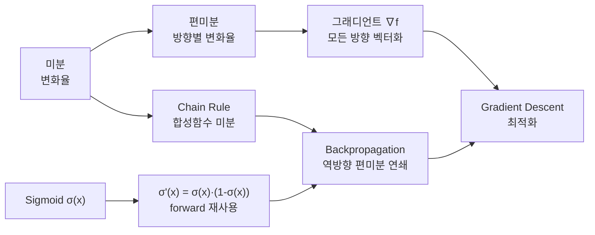

# 2026-05-07 ML 10강: Backpropagation을 위한 수학도구

> 슬라이드 PDF 원문 텍스트를 바탕으로 강의 노트 형태로 재구성함.  
> 핵심 흐름: 미분 복습 → 편미분·그래디언트 → Chain Rule → Sigmoid 미분 → Gradient Descent → 신경망(역전파) 연결.

## 심층 인텔리전스 브리핑

**오늘의 목표:** Gradient Descent에 필요한 수학도구(\(\nabla L\), Chain Rule)를 확보한다.

8강(Perceptron·MLP)에서 학습 루프를 `Forward → Loss → Backward → Update`로 소개했다. 오늘은 그 중 **Backward(역전파)**와 **Update(경사하강)** 가 왜 작동하는지를 수학적으로 해부한다.

핵심 질문 세 가지:

1. 신경망의 손실 \(L\)이 특정 가중치 \(W\)에 의해 얼마나 변하는지를 어떻게 계산하는가?
2. Chain Rule이 여러 층의 편미분을 어떻게 "연쇄"로 이어 붙이는가?
3. Sigmoid 미분이 \(\sigma(x)(1-\sigma(x))\)로 정리될 때, backward pass에서 어떤 효율이 생기는가?

오늘 다루는 도구들은 12강의 Vanishing Gradient, 그 이후의 Adam/Momentum 등 고급 최적화기를 이해하기 위한 수학적 기반이 된다.

---

## 강의 현황 (포인터)

- **1강** `20250306.md` — ML 개요·지도학습·선형회귀·경사하강법
- **2강** `20250313.md` — 비지도학습·분류·나이브 베이즈·다변수 선형회귀·정규화·교차검증
- **3강** `20250319.md` — Python 라이브러리·NumPy
- **4강** `20250326.md` — Pandas·EDA·타이타닉·상관행렬
- **6강** `20260409.md` — Classification·KNN·SVM·Decision Tree
- **7강** `20260416.md` — Decision Tree·Random Forest·Bagging/Boosting
- **중간고사** `c293085_RYUJIHWAN_MID_TRANSCRIPT_20260428_021446.md` — Regression·Classification 종합
- **8강** `20260430.md` — Neural Networks·Perceptron·MLP·역전파 개요
- **10강** 본 문서 `20260507.md` — Backpropagation을 위한 수학도구

---

## 목차

1. [전체 개념 흐름](#1-전체-개념-흐름)
2. [미분 복습: 접선의 기울기](#2-미분-복습-접선의-기울기)
3. [미분 기본 공식](#3-미분-기본-공식)
4. [미분 연습 문제](#4-미분-연습-문제)
5. [미분의 수치적 계산 (코드)](#5-미분의-수치적-계산-코드)
6. [미분에서 신경망 학습까지의 연결](#6-미분에서-신경망-학습까지의-연결)
7. [편미분: 한 변수만의 변화율](#7-편미분-한-변수만의-변화율)
8. [그래디언트: 모든 편미분을 벡터로](#8-그래디언트-모든-편미분을-벡터로)
9. [편미분·그래디언트 연습 문제](#9-편미분그래디언트-연습-문제)
10. [Chain Rule](#10-chain-rule)
11. [단변수 Chain Rule 연습 문제](#11-단변수-chain-rule-연습-문제)
12. [다변수 Chain Rule: 경로의 합](#12-다변수-chain-rule-경로의-합)
13. [계산 그래프와 역전파](#13-계산-그래프와-역전파)
14. [Sigmoid 미분 유도](#14-sigmoid-미분-유도)
15. [Gradient Descent: 원리와 수식](#15-gradient-descent-원리와-수식)
16. [Learning Rate의 영향](#16-learning-rate의-영향)
17. [초기값의 영향과 Local Minimum](#17-초기값의-영향과-local-minimum)
18. [2D Gradient Descent](#18-2d-gradient-descent)
19. [전체 정리: 수식→역할 대응표](#19-전체-정리-수식역할-대응표)

---

## 1. 전체 개념 흐름

오늘 다루는 수학 도구들은 미분에서 시작해 역전파까지 한 방향으로 이어진다.



> **신경망의 손실함수는 수천~수백만 개의 변수 \(W, b\)를 가진다.**  
> 편미분과 그래디언트, 그리고 Chain Rule이 없으면 이 모든 가중치를 효율적으로 업데이트할 방법이 없다.

---

## 2. 미분 복습: 접선의 기울기

미분 \(f'(x)\)는 두 가지 정보를 동시에 담는다.

| 정보 | 의미 | 학습에서의 역할 |
|------|------|----------------|
| **부호** | 함수가 증가 중인지 감소 중인지 | 파라미터를 어느 방향으로 이동할지 |
| **크기** | 얼마나 가파른가 | 얼마나 크게 이동할지 (step size와 곱해짐) |

\[
f'(x) = \lim_{h \to 0} \frac{f(x+h) - f(x)}{h}
\]

---

## 3. 미분 기본 공식

| 규칙 | 수식 | 예시 |
|------|------|------|
| 거듭제곱 | \((x^n)' = n \cdot x^{n-1}\) | \((x^3)' = 3x^2\) |
| 지수 | \((e^x)' = e^x\) | \((e^{2x})' = 2e^{2x}\) (chain rule) |
| 로그 | \((\ln x)' = \dfrac{1}{x}\) | \((\ln(x^2))' = \dfrac{2}{x}\) |
| 곱셈 | \((fg)' = f'g + fg'\) | \((x \cdot e^x)' = e^x + x \cdot e^x\) |
| 나눗셈 | \(\left(\dfrac{f}{g}\right)' = \dfrac{f'g - fg'}{g^2}\) | Sigmoid 미분 유도에 사용 |

> 곱셈·나눗셈 법칙은 §14 Sigmoid 미분 유도에서 바로 사용된다.

---

## 4. 미분 연습 문제

### 문제 1

\[
f(x) = 3x^4 - 2x + 7
\]

**풀이:** 항별로 거듭제곱 법칙 적용.

\[
f'(x) = 12x^3 - 2
\]

---

### 문제 2

\[
f(x) = x \cdot \ln(x)
\]

**풀이:** 곱셈 법칙 \((fg)' = f'g + fg'\). \(f = x,\; g = \ln x\) 로 두면.

\[
f'(x) = 1 \cdot \ln(x) + x \cdot \frac{1}{x} = \ln(x) + 1
\]

---

### 문제 3

\[
f(x) = \frac{2x + 1}{x - 3}
\]

**풀이:** 나눗셈 법칙. \(f = 2x+1,\; g = x-3\).

\[
f'(x) = \frac{2(x-3) - (2x+1) \cdot 1}{(x-3)^2} = \frac{2x - 6 - 2x - 1}{(x-3)^2} = \frac{-7}{(x-3)^2}
\]

---

## 5. 미분의 수치적 계산 (코드)

컴퓨터는 극한을 직접 계산할 수 없으므로, 아주 작은 \(h\)를 사용해 근사한다.

\[
f'(x) \approx \frac{f(x + h) - f(x)}{h}, \quad h = 10^{-5}
\]

```python
# lambda: 한 줄짜리 익명 함수
# def f(x): return x**2  를 한 줄로 표현
f  = lambda x: x**2
df = lambda x: (f(x + 1e-5) - f(x)) / 1e-5  # 수치 미분

# f(x) = x² 의 해석적 미분: f'(x) = 2x
x = 3.0
print(f"수치 미분: {df(x):.6f}")   # ≈ 6.000010
print(f"해석적 미분: {2 * x:.6f}") # = 6.000000
```

> `lambda`는 "한 줄짜리 익명 함수"다. `def f(x): return x**2`를 `f = lambda x: x**2`로 줄인 것.

---

## 6. 미분에서 신경망 학습까지의 연결


신경망의 손실함수 \(L\)은 수천~수백만 개의 변수 \(\mathbf{W}, \mathbf{b}\)를 가진다.  
**편미분과 그래디언트가 필수인 이유**가 여기에 있다.

---

## 7. 편미분: 한 변수만의 변화율

다변수 함수 \(f(x, y)\)에서 **한 변수만 움직이고 나머지는 상수**로 둘 때의 미분.

| 표기 | 의미 |
|------|------|
| \(\dfrac{\partial f}{\partial x}\) | \(y\)를 상수로 두고 \(x\)로 미분 |
| \(\dfrac{\partial f}{\partial y}\) | \(x\)를 상수로 두고 \(y\)로 미분 |

### 예시: \(f(x, y) = x^2 + 3xy + y^2\)

**\(x\)로 편미분** (\(y\)는 상수):

\[
\frac{\partial f}{\partial x} = 2x + 3y
\]

- \(\partial(x^2)/\partial x = 2x\)
- \(\partial(3xy)/\partial x = 3y\) &nbsp;(\(y\)는 상수이므로)
- \(\partial(y^2)/\partial x = 0\)

**\(y\)로 편미분** (\(x\)는 상수):

\[
\frac{\partial f}{\partial y} = 3x + 2y
\]

- \(\partial(x^2)/\partial y = 0\)
- \(\partial(3xy)/\partial y = 3x\)
- \(\partial(y^2)/\partial y = 2y\)

> **직관:** 편미분 = 다른 변수는 고정한 채 "한 방향으로 슬라이스"해서 본 1D 미분.

---

## 8. 그래디언트: 모든 편미분을 벡터로

\(n\)개 변수를 가진 함수 \(f(x_1, x_2, \ldots, x_n)\)의 그래디언트:

\[
\nabla f = \left( \frac{\partial f}{\partial x_1},\; \frac{\partial f}{\partial x_2},\; \ldots,\; \frac{\partial f}{\partial x_n} \right)
\]

### 핵심 성질 3가지

| 성질 | 내용 |
|------|------|
| **방향** | \(\nabla f\)는 함수가 가장 빨리 **증가**하는 방향을 가리킴 |
| **크기** | \(\|\nabla f\|\)는 그 방향에서의 증가율 |
| **수직성** | \(\nabla f\)는 항상 등고선(level set)에 수직 |

### 최소화를 위한 반대 방향

함수를 **감소**시키려면 \(-\nabla f\) 방향으로 이동.  
이것이 **Gradient Descent의 핵심**:

\[
\mathbf{x} \leftarrow \mathbf{x} - \eta \cdot \nabla f(\mathbf{x})
\]

여기서 \(\eta\)(eta)는 **learning rate** — 한 번에 얼마나 이동할지.

---

## 9. 편미분·그래디언트 연습 문제

### 문제 1: \(f(x, y) = 2x^2 + xy - y^2\)

\[
\nabla f = \left( 4x + y,\; x - 2y \right)
\]

- \(\partial f / \partial x = 4x + y\)
- \(\partial f / \partial y = x - 2y\)

---

### 문제 2: \(f(x, y) = e^{xy}\)

\[
\nabla f = \left( y \cdot e^{xy},\; x \cdot e^{xy} \right)
\]

- \(\partial f / \partial x = y \cdot e^{xy}\) &nbsp;(Chain Rule: 외부 \(e^u\), 내부 \(u = xy\))
- \(\partial f / \partial y = x \cdot e^{xy}\)

---

### 문제 3: \(f(x, y, z) = x^2 + 2y^2 + 3z^2\)

\[
\nabla f = \left( 2x,\; 4y,\; 6z \right)
\]

---

### 편미분·그래디언트 정리

| 개념 | 정의 | 방향 |
|------|------|------|
| \(\partial\) 편미분 | 한 변수만 움직였을 때의 변화율. 다른 변수는 상수 취급. | — |
| \(\nabla\) 그래디언트 | 모든 편미분을 모은 벡터. 함수 변화의 "완전한" 정보. | ↑ 가장 가파른 상승 방향, 등고선에 수직 |
| 최소화 방향 | \(-\nabla f\) 방향으로 이동 | ↓ 이것이 Gradient Descent |

---

## 10. Chain Rule

**Backpropagation은 Chain Rule의 반복 적용이다.**

### 합성함수

\(y = f(u)\), \(u = g(x)\)일 때 \(y = f(g(x))\)는 \(x\)의 함수.  
예: \(y = \sin(x^2)\) 에서 \(u = x^2,\; y = \sin(u)\).

### 단변수 Chain Rule

\[
\frac{dy}{dx} = \frac{dy}{du} \cdot \frac{du}{dx}
\]

> **직관:** \(x\) 변화 → \(u\)가 \(\dfrac{du}{dx}\)배 변화 → \(y\)가 추가로 \(\dfrac{dy}{du}\)배 변화 → 곱한다!

### 적용 예시: \(y = \sin(x^2)\)

| 단계 | 내용 |
|------|------|
| ① | \(u = x^2\) 으로 두면 \(y = \sin(u)\) |
| ② | \(\dfrac{dy}{du} = \cos(u) = \cos(x^2)\) |
| ③ | \(\dfrac{du}{dx} = 2x\) |
| ④ | \(\dfrac{dy}{dx} = \cos(x^2) \cdot 2x = 2x\cos(x^2)\) |

---

## 11. 단변수 Chain Rule 연습 문제

### 문제 1: \(y = e^{3x+1}\)

외부함수 \(e^u\), 내부함수 \(u = 3x+1\).

\[
\frac{dy}{dx} = e^{3x+1} \cdot 3 = 3e^{3x+1}
\]

---

### 문제 2: \(y = (x^2 + 1)^5\)

외부함수 \(u^5\), 내부함수 \(u = x^2 + 1\).

\[
\frac{dy}{dx} = 5(x^2+1)^4 \cdot 2x = 10x(x^2+1)^4
\]

---

### 문제 3: \(y = \ln(\sin x)\)

외부함수 \(\ln(u)\), 내부함수 \(u = \sin x\).

\[
\frac{dy}{dx} = \frac{1}{\sin x} \cdot \cos x = \frac{\cos x}{\sin x} = \cot x
\]

---

## 12. 다변수 Chain Rule: 경로의 합

변수가 여러 경로를 거쳐 출력에 영향을 미치는 경우, **각 경로의 기여를 모두 더한다.**

예: \(z = f(x, y)\), \(x = g(t)\), \(y = h(t)\)일 때:

\[
\frac{dz}{dt} = \frac{\partial z}{\partial x} \cdot \frac{dx}{dt} + \frac{\partial z}{\partial y} \cdot \frac{dy}{dt}
\]

> 이것이 신경망에서 **gradient가 여러 경로로 합쳐지는 이유**다.

---

## 13. 계산 그래프와 역전파

### 계산 그래프 = 신경망의 그림

**핵심 통찰:** 신경망의 각 뉴런은 계산 그래프의 **노드**, 각 연결은 편미분의 **경로**.

### 왜 "역"전파(Backpropagation)인가?

Chain Rule 계산 순서:

\[
\frac{\partial L}{\partial W} = \frac{\partial L}{\partial a} \cdot \frac{\partial a}{\partial z} \cdot \frac{\partial z}{\partial W}
\]

오른쪽부터 왼쪽으로 곱해나가면 **출력 → 입력 방향**으로 정보가 전파된다.  
→ 이것이 "역전파"라는 이름의 유래.

### 효율성의 핵심

| 방법 | 비용 |
|------|------|
| 1회 forward pass | 모든 중간값 계산 |
| 1회 backward pass | 모든 편미분 계산 |
| 중간 결과 재사용 | \(O(\text{파라미터 수})\) |

> forward를 매번 다시 했다면 비용이 파라미터 수의 제곱으로 폭발.

### 2-2-1 신경망 예시

가중치 \(W^{(1)}\)이 손실 \(L\)에 미치는 영향을 Chain Rule로 추적:

\[
\text{경로:}\quad W^{(1)} \to z^{(1)} \to a^{(1)} \to z^{(2)} \to a^{(2)} \to L
\]

\[
\frac{\partial L}{\partial W^{(1)}} = \frac{\partial L}{\partial a^{(2)}} \cdot \frac{\partial a^{(2)}}{\partial z^{(2)}} \cdot \frac{\partial z^{(2)}}{\partial a^{(1)}} \cdot \frac{\partial a^{(1)}}{\partial z^{(1)}} \cdot \frac{\partial z^{(1)}}{\partial W^{(1)}}
\]

**5개 항의 곱** — 각 항은 개별적으로 간단하게 계산 가능!

---

## 14. Sigmoid 미분 유도

### 함수 정의

\[
\sigma(x) = \frac{1}{1 + e^{-x}}
\]

**목표:** \(\sigma'(x)\)를 구하고, \(\sigma(x)\)의 항으로 정리한다.

### 유도 전략

1. \(\sigma(x) = (1 + e^{-x})^{-1}\) 로 다시 쓰기
2. Chain Rule 적용: 외부함수 \((\cdot)^{-1}\)의 미분, 내부함수 \((1 + e^{-x})\)의 미분
3. 결과를 \(\sigma(x)\)의 항으로 정리 (핵심 트릭)

---

### Step 1: Chain Rule 적용

\[
\sigma(x) = (1 + e^{-x})^{-1}
\quad\Rightarrow\quad
\sigma'(x) = -1 \cdot (1 + e^{-x})^{-2} \cdot \frac{d}{dx}\!\left[1 + e^{-x}\right]
\]

### Step 2: 내부 미분

\[
\frac{d}{dx}\!\left[1 + e^{-x}\right] = -e^{-x}
\quad\Rightarrow\quad
\sigma'(x) = \frac{e^{-x}}{(1 + e^{-x})^2}
\]

### Step 3: \(\sigma(x)\)의 항으로 정리 (더하고 빼기 트릭)

\[
e^{-x} = (1 + e^{-x}) - 1
\]

\[
\sigma'(x) = \frac{(1 + e^{-x}) - 1}{(1 + e^{-x})^2}
= \frac{1}{1+e^{-x}} - \frac{1}{(1+e^{-x})^2}
= \sigma(x) - \sigma(x)^2
\]

\[
\boxed{\sigma'(x) = \sigma(x) \cdot \bigl(1 - \sigma(x)\bigr)}
\]

---

### 두 가지 주목할 점

| 포인트 | 내용 |
|--------|------|
| ① **forward 재사용** | \(\sigma(x)\)만 알면 \(\sigma'(x)\)를 즉시 계산 가능 → forward pass 결과를 backward에 재사용 (backprop 효율성의 핵심) |
| ② **Vanishing Gradient** | \(\sigma'(x)\)의 최댓값은 \(0.25\) → 여러 층을 지나면 gradient가 급격히 작아짐 → **Week 12에서 Vanishing Gradient로 다룸** |

> \(\sigma'(x)\)가 최대인 지점: \(x = 0\)일 때 \(\sigma(0) = 0.5\), \(\sigma'(0) = 0.5 \times 0.5 = 0.25\).

---

## 15. Gradient Descent: 원리와 수식

### 업데이트 규칙

\[
\mathbf{x} \leftarrow \mathbf{x} - \eta \cdot \nabla f(\mathbf{x})
\]

| 기호 | 의미 |
|------|------|
| \(\mathbf{x}\) | 현재 위치 (파라미터) |
| \(\eta\) | Learning rate — 이동량 |
| \(\nabla f(\mathbf{x})\) | 현재 위치의 gradient |

**루프:** gradient 계산 → 업데이트 → 반복 (수렴할 때까지 또는 일정 횟수)

### `gradient_descent.py` 핵심 코드 흐름

```python
# 현재 위치 x에서의 기울기 f'(x)를 구함
grad = df(x)

# x_new = x - η·f'(x)
x_new = x - lr * grad

# 경로 기록
trajectory.append((x_new, f(x_new)))
```

---

## 16. Learning Rate의 영향

| \(\eta\) 범위 | 분류 | 결과 |
|--------------|------|------|
| \(\eta = 0.001\) | 너무 작음 | 한없이 느림 |
| \(\eta = 0.01 \sim 0.1\) | 적절 | 안정적 수렴 |
| \(\eta = 0.3 \sim 0.5\) | 공격적 | 빠르지만 진동 |
| \(\eta > 1.0\) | 너무 큼 | 발산! |

> **실전 팁:** 작은 값부터 시작해서 학습이 잘 안 되면 점점 늘려본다.  
> **Loss curve를 항상 관찰!**

---

## 17. 초기값의 영향과 Local Minimum

Non-convex 함수에서는 **초기값에 따라 수렴하는 local minimum이 다르다.**

- 같은 함수, 같은 학습률 → 초기값이 다르면 다른 최솟값으로 수렴 가능
- Convex 함수(예: MSE)는 global minimum이 유일 → 초기값 무관
- 신경망의 손실함수는 일반적으로 non-convex → 초기화 전략이 중요 (Xavier, He 초기화 등)

---

## 18. 2D Gradient Descent

타원형 등고선에서는 **급한 방향(y축)으로 진동**하면서 느린 방향(x축)으로 이동하는 현상이 발생한다.

이 비효율이 **Momentum, Adam 등 고급 최적화기**의 개발 동기가 된다.

---

## 19. 전체 정리: 수식→역할 대응표

| 개념 | 역할 |
|------|------|
| **미분** \(f'(x)\) | 각 파라미터에 대한 손실의 변화율 계산 |
| **편미분** \(\partial f / \partial x_i\) | 한 파라미터씩 독립적으로 변화율 구함 |
| **그래디언트** \(\nabla f\) | 모든 파라미터의 편미분을 하나의 벡터로 |
| **Chain Rule** | 여러 층을 거친 손실의 편미분을 곱셈으로 분해 |
| **Sigmoid 미분** \(\sigma(1-\sigma)\) | 활성화 함수 통과 시 gradient의 변화량 (forward 재사용 가능) |
| **Gradient Descent** \(\mathbf{x} \leftarrow \mathbf{x} - \eta\nabla f\) | 편미분으로 파라미터 업데이트 |

> **다음 강의 예고:** Week 12 — Vanishing Gradient 문제, ReLU 등 대안 활성화 함수, Batch Normalization.
