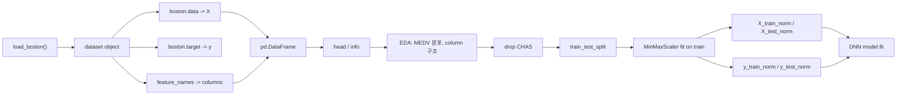

# 2026-05-29 ML 14강: DNN 회귀를 위한 데이터 프로세싱

> **세션 상태:** `ML/week13.pdf` 36페이지 전체를 로데이터로 삼되, 오늘 강의는 특히 Boston Housing 회귀 예제의 **Data preparing → EDA → Data preprocessing** 단계에 무게를 둔다.
> **원자료:** `ML/20260529_raw.md`
> **직전 연결:** 0528 강의록은 Keras DNN 회귀·분류 전체 흐름을 잡았다. 오늘은 그중 모델에 들어가기 전 단계, 즉 `X_train_norm`, `X_test_norm`, `y_train_norm`, `y_test_norm`을 어떻게 만드는지를 강의 중심축으로 삼는다.

---

## 오늘 강의 운영안

오늘은 슬라이드를 처음부터 끝까지 같은 비중으로 읽지 않는다. 핵심 질문 하나를 앞에 둔다.

> **신경망에 넣을 수 있는 \(X\), \(y\)는 어떻게 만들어지는가?**

자료의 전체 절차는 Import packages → Data preparing → Data exploration → Data preprocessing → Modeling → Validation이다. 이 중 오늘의 중심은 2-4단계다. 모델 구조와 분류 예제는 뒤에서 연결만 잡는다.

| 시간 | 파트 | 핵심 질문 | 자료 위치 |
|------|------|-----------|-----------|
| 0-10분 | 오프닝 | DNN 수업에서 왜 데이터 프로세싱을 먼저 보는가? | PDF p.2, p.6 |
| 10-25분 | 데이터 객체 해부 | `boston.data`와 `boston.target`은 각각 무엇인가? | PDF p.3, p.8-p.12 |
| 25-45분 | DataFrame과 EDA | column 이름, `info()`, target 분포를 왜 확인하는가? | PDF p.13-p.15 |
| 45-65분 | 전처리 핵심 | `CHAS` 제거, train/test split, MinMax scaling을 어떤 순서로 하는가? | PDF p.16 |
| 65-80분 | 모델 연결 | 왜 `input_shape=(12,)`, `Dense(1)`, `loss='mse'`가 나오는가? | PDF p.17-p.23 |
| 80-90분 | 브릿지 | MNIST에서는 데이터 프로세싱이 어떻게 달라지는가? | PDF p.24-p.36 |

강의의 한 줄 메시지는 다음과 같다.

```text
데이터 프로세싱은 모델 전의 잡일이 아니라, 원본 dataset object를 모델이 학습 가능한 feature matrix와 target vector로 바꾸는 핵심 과정이다.
```

---

## 개념 그래프 브리핑

오늘 보는 노드는 **DNN Regression - Data preparing → EDA → Data preprocessing**이다.



선행 강의와 연결하면 다음과 같다.

| 선행 노드 | 오늘 쓰이는 방식 |
|-----------|------------------|
| 1강 지도학습 | 입력 \(X\)와 정답 \(y\)를 분리한다 |
| 3강 NumPy | shape `(506, 13)`, `(506,)`, `(506, 1)`을 해석한다 |
| 4강 Pandas/EDA | DataFrame, `head()`, `info()`, histogram으로 데이터 구조를 확인한다 |
| 10-12강 backprop/layer | 최종적으로 정규화된 \(X\), \(y\)가 DNN의 forward/loss/backward/update에 들어간다 |
| 0528 Keras 강의 | `Sequential`, `Dense`, `compile`, `fit`은 이 전처리 결과를 받아 실행된다 |

---

## 목차

1. [왜 데이터 프로세싱을 먼저 보는가](#1-왜-데이터-프로세싱을-먼저-보는가)
2. [Boston Housing 문제 정의](#2-boston-housing-문제-정의)
3. [`load_boston()` 객체 해부](#3-load_boston-객체-해부)
4. [DataFrame으로 바꾸는 이유](#4-dataframe으로-바꾸는-이유)
5. [`info()`와 EDA에서 확인할 것](#5-info와-eda에서-확인할-것)
6. [`CHAS` 제거와 입력 차원 12](#6-chas-제거와-입력-차원-12)
7. [train/test split의 의미](#7-traintest-split의-의미)
8. [MinMax scaling: X와 y를 따로 정규화](#8-minmax-scaling-x와-y를-따로-정규화)
9. [shape 체크: 모델에 들어가는 네 개의 배열](#9-shape-체크-모델에-들어가는-네-개의-배열)
10. [Modeling(training): 함수 구조를 정한다](#10-modelingtraining-함수-구조를-정한다)
11. [`compile`과 `fit`: 학습 기준과 반복 실행](#11-compile과-fit-학습-기준과-반복-실행)
12. [학습 곡선 해석](#12-학습-곡선-해석)
13. [Validation(test): 처음 보는 데이터에서 확인한다](#13-validationtest-처음-보는-데이터에서-확인한다)
14. [원래 단위 MAE와 예측 산점도](#14-원래-단위-mae와-예측-산점도)
15. [MNIST 분류와의 검증 비교](#15-mnist-분류와의-검증-비교)
16. [오늘의 핵심 정리](#16-오늘의-핵심-정리)

---

## 1. 왜 데이터 프로세싱을 먼저 보는가

딥러닝 수업에서 학생들은 보통 `Sequential`, `Dense`, `fit` 같은 모델 코드에 먼저 시선을 둔다. 하지만 모델은 원본 데이터를 그대로 이해하지 못한다. 모델이 받는 것은 의미가 정리된 숫자 배열이다.

오늘 수업의 핵심은 아래 변환이다.

```text
raw dataset object
-> feature matrix X
-> target vector y
-> EDA로 구조 확인
-> feature filtering
-> train/test split
-> scaling
-> model-ready tensors
```

즉, 데이터 프로세싱은 "예쁘게 정리하는 단계"가 아니다. 모델이 학습할 수 있는 입력 행렬과 정답 벡터를 정확한 shape, dtype, scale로 만드는 단계다.

원자료의 NN modeling 절차도 이 순서를 분명히 제시한다.

| 단계 | 오늘의 초점 |
|------|-------------|
| Import packages | 어떤 도구가 어느 단계에 쓰이는지 구분 |
| Data preparing | `X`, `y` 분리 |
| Data exploration | 구조, 결측, dtype, target 분포 확인 |
| Data preprocessing | split, scaling, shape 조정 |
| Modeling | 전처리 결과를 DNN에 연결 |
| Validation | 정규화된 예측을 다시 해석 가능한 단위로 확인 |

---

## 2. Boston Housing 문제 정의

Boston Housing 예제는 여러 입력 feature를 이용해 주택 가격을 예측하는 지도학습 회귀 문제다.

| 항목 | 내용 |
|------|------|
| 문제 유형 | supervised learning + regression |
| 입력 \(X\) | 주택 가격에 영향을 주는 변수들 |
| 타깃 \(y\) | MEDV, 주택 가격 |
| 데이터 규모 | 506 samples, 13 variables |
| 강의 설정 | `CHAS`를 제외해 최종 입력 feature 12개 사용 |

지도학습은 항상 \(X\)와 \(y\)의 분리에서 출발한다.

\[
X =
\begin{bmatrix}
x_{11} & x_{12} & \cdots & x_{1p} \\
x_{21} & x_{22} & \cdots & x_{2p} \\
\vdots & \vdots & \ddots & \vdots \\
x_{n1} & x_{n2} & \cdots & x_{np}
\end{bmatrix},
\quad
y =
\begin{bmatrix}
y_1 \\
y_2 \\
\vdots \\
y_n
\end{bmatrix}
\]

Boston Housing에서는 처음에 대략 다음과 같이 생각하면 된다.

| 객체 | shape | 의미 |
|------|-------|------|
| `boston.data` | `(506, 13)` | 입력 feature 후보 |
| `boston.target` | `(506,)` | 실제 주택 가격 |
| `boston.feature_names` | `(13,)` | feature column 이름 |

수업 멘트는 이렇게 잡는다.

> "`data`는 문제지고, `target`은 정답지입니다. 모델은 문제지를 보고 정답지를 맞히도록 학습합니다."

---

## 3. `load_boston()` 객체 해부

첫 번째 코드는 데이터셋 객체를 가져오는 단계다.

```python
from sklearn.datasets import load_boston

boston = load_boston()
print(boston)
```

여기서 `boston`은 바로 DataFrame이 아니다. sklearn dataset object이며, 그 안에 입력 배열, 정답 배열, feature 이름, 설명이 들어 있다.

| 속성 | 의미 | 오늘 강의에서의 역할 |
|------|------|----------------------|
| `boston.data` | 입력 변수들의 숫자 배열 | \(X\), feature matrix |
| `boston.target` | 예측해야 할 주택 가격 | \(y\), target vector |
| `boston.feature_names` | feature 이름 | DataFrame column 이름 |
| `boston.DESCR` | 데이터 설명 | 변수 의미 확인 |

이 단계에서 학생들에게 확인시킬 질문은 세 개다.

1. `boston.data`는 \(X\)인가, \(y\)인가?
2. `boston.target`은 \(X\)인가, \(y\)인가?
3. 왜 feature 이름 없이 숫자 배열만 보면 분석이 어려운가?

---

## 4. DataFrame으로 바꾸는 이유

다음 단계는 숫자 배열에 column 의미를 붙이는 것이다.

```python
import pandas as pd

X = pd.DataFrame(boston.data, columns=boston.feature_names)
print(X.head())
```

`boston.data`는 원래 숫자 행렬이다. 숫자 행렬만 보면 각 열이 범죄율인지, 방 개수인지, 세금인지 알 수 없다. 그래서 `columns=boston.feature_names`로 열 이름을 붙인다.

| 변환 전 | 변환 후 |
|---------|---------|
| NumPy array | Pandas DataFrame |
| 숫자만 있음 | column 이름이 있음 |
| 사람이 의미를 읽기 어려움 | EDA와 column 단위 점검 가능 |

예를 들어 한 행이 아래처럼 보이면 의미를 알기 어렵다.

```text
[0.00632, 18.0, 2.31, 0.0, 0.538, ...]
```

DataFrame으로 바꾸면 이 값들이 `CRIM`, `ZN`, `INDUS`, `CHAS`, `NOX`, `RM` 같은 변수에 대응한다는 것을 알 수 있다. 이것이 이후 EDA와 feature 판단의 출발점이다.

---

## 5. `info()`와 EDA에서 확인할 것

구조 확인은 `info()`로 시작한다.

```python
print(X.info())
```

`info()`에서 볼 것은 세 가지다.

| 확인 대상 | 왜 중요한가 |
|-----------|-------------|
| row 수 | sample 개수가 기대와 맞는가 |
| non-null count | 결측치가 있는가 |
| dtype | 모델에 넣을 수 있는 숫자형인가 |

DNN은 숫자 tensor를 입력으로 받는다. 문자열이나 object dtype이 섞여 있으면 그대로 넣을 수 없다. 결측치가 있으면 imputation, 제거, 별도 encoding 같은 처리가 필요하다. 원자료는 결측치 처리를 깊게 다루지 않고 "missing value is omitted" 흐름으로 넘어간다. 이 예제에서는 구조 점검 후 바로 scaling으로 간다.

### 5.1 target 분포 확인

EDA에서는 target인 MEDV의 분포도 확인한다.

```python
import seaborn as sns
import matplotlib.pyplot as plt

sns.histplot(y)
plt.show()
```

target 분포를 보는 이유는 모델이 예측해야 할 값의 범위와 몰림을 이해하기 위해서다.

| 확인 질문 | 의미 |
|-----------|------|
| 값이 특정 구간에 몰려 있는가? | 모델이 평균 근처 예측에 치우칠 수 있음 |
| 극단값이 있는가? | MSE가 큰 오차에 민감하게 반응 |
| target scale이 큰가? | y scaling을 고려할 이유가 커짐 |

---

## 6. `CHAS` 제거와 입력 차원 12

처음 `boston.data`에는 13개 feature가 있다. 그런데 모델의 첫 번째 layer에서는 `input_shape=(12,)`를 사용한다. 이 차이는 `CHAS`를 제거했기 때문이다.

```python
X = X.drop(["CHAS"], axis=1)
```

`CHAS`는 Charles River 인접 여부를 나타내는 0/1 binary indicator다. 자료에서는 이 변수를 discrete numerical data로 보고 제외한다. 교육용 흐름에서는 연속형 수치 feature를 중심으로 MinMax scaling하고 DNN 회귀에 넣는 구조를 단순하게 보여주려는 목적이 크다.

| 단계 | feature 수 |
|------|------------|
| 원본 `boston.data` | 13 |
| `CHAS` 제거 후 `X` | 12 |
| 모델 입력층 | `input_shape=(12,)` |

이 지점은 반드시 짚어야 한다. `input_shape=(12,)`는 아무 숫자나 쓴 것이 아니라, 전처리 이후 feature matrix의 column 수와 맞춘 것이다.

수업 확인 질문:

> "처음에는 13개 변수였는데 왜 모델 입력은 12개일까요?"

정답 방향:

> "`CHAS`를 제거했기 때문에 최종 입력 feature가 12개가 되었고, 그래서 첫 Dense layer의 `input_shape`가 `(12,)`가 된다."

---

## 7. train/test split의 의미

전처리에서 가장 중요한 순서 중 하나는 split이다.

```python
from sklearn.model_selection import train_test_split

X_train, X_test, y_train, y_test = train_test_split(
    X,
    y,
    test_size=0.3,
)
```

train/test split은 전체 데이터를 학습용과 검증용으로 나누는 단계다.

| 데이터 | 역할 |
|--------|------|
| `X_train`, `y_train` | 모델이 파라미터를 학습하는 데이터 |
| `X_test`, `y_test` | 학습하지 않은 데이터에서 성능을 확인하는 데이터 |

이 단계가 필요한 이유는 일반화 성능을 보기 위해서다. 모델이 학습 데이터만 잘 맞히는지, 처음 보는 데이터에도 잘 작동하는지를 구분해야 한다.

중요한 원칙은 다음이다.

```text
split 먼저, scaling은 그 다음.
```

전체 데이터를 먼저 scaling한 뒤 split하면 test data의 최소·최대 정보가 전처리 과정에 섞인다. 이것은 data leakage다. test set은 미래에 처음 보는 데이터 역할을 해야 하므로, scaling 기준도 train data에서만 학습해야 한다.

---

## 8. MinMax scaling: X와 y를 따로 정규화

### 8.1 X scaling

입력 feature들은 단위와 범위가 다르다.

| feature | 의미 | scale 감각 |
|---------|------|------------|
| `RM` | 평균 방 수 | 3-9 근처 |
| `TAX` | 세금 | 수백 단위 |
| `PTRATIO` | 학생/교사 비율 | 10-20대 |
| `LSTAT` | 저소득층 비율 | 0-40대 |
| `CRIM` | 범죄율 | 작은 값부터 큰 값까지 |

신경망의 첫 번째 Dense layer는 다음 연산을 한다.

\[
z = XW + b
\]

feature scale이 제각각이면 큰 단위의 변수가 초기 gradient에 더 강하게 영향을 줄 수 있다. 모델이 중요한 변수를 보는 것이 아니라, 숫자 크기가 큰 변수에 끌릴 위험이 생긴다. 그래서 입력 feature를 0-1 범위로 맞춘다.

```python
from sklearn.preprocessing import MinMaxScaler

scalerX = MinMaxScaler()
scalerX.fit(X_train)

X_train_norm = scalerX.transform(X_train)
X_test_norm = scalerX.transform(X_test)
```

MinMax scaling의 기본 수식은 다음과 같다.

\[
x_{scaled} = \frac{x - x_{min}}{x_{max} - x_{min}}
\]

여기서 \(x_{min}\), \(x_{max}\)는 train data 기준으로 구한다.

| 코드 | 의미 |
|------|------|
| `scalerX.fit(X_train)` | train feature의 column별 min/max를 학습 |
| `scalerX.transform(X_train)` | train feature를 0-1 범위로 변환 |
| `scalerX.transform(X_test)` | 같은 기준으로 test feature 변환 |

### 8.2 y scaling

이 예제에서는 입력 \(X\)뿐 아니라 target \(y\)도 scaling한다.

```python
scalerY = MinMaxScaler()
scalerY.fit(y_train)

y_train_norm = scalerY.transform(y_train)
y_test_norm = scalerY.transform(y_test)
```

학생들이 자주 묻는 질문은 이것이다.

> "입력은 scaling하는 게 이해되는데, 정답 \(y\)도 왜 scaling하나요?"

답은 세 가지다.

| 이유 | 설명 |
|------|------|
| 출력값 scale 안정화 | 모델이 처음부터 큰 집값 단위를 맞히지 않고 0-1 범위의 target을 예측 |
| MSE 안정화 | MSE는 제곱 오차라 target scale이 크면 loss도 크게 튈 수 있음 |
| 해석 분리 | 학습은 normalized scale에서 하고, 최종 해석은 inverse transform 후 원래 단위로 수행 |

회귀 출력층은 activation이 없는 `Dense(1)`이다. 따라서 모델은 정규화된 target 값을 예측하고, 나중에 원래 단위로 되돌릴 수 있다.

```python
y_pred_norm = model.predict(X_test_norm)
y_pred = scalerY.inverse_transform(y_pred_norm)
```

### 8.3 왜 scaler를 X와 y에 따로 두는가

`X`와 `y`는 서로 다른 공간의 값이다.

| 대상 | shape | scaler가 저장하는 것 |
|------|-------|----------------------|
| `X` | `(n_samples, 12)` | 12개 feature 각각의 min/max |
| `y` | `(n_samples, 1)` | target MEDV의 min/max |

따라서 scaler도 따로 둔다.

```python
scalerX = MinMaxScaler()
scalerY = MinMaxScaler()
```

`scalerX`는 `CRIM`, `ZN`, `INDUS`, ..., `LSTAT` 각각의 min/max를 저장하고, `scalerY`는 MEDV 하나의 min/max를 저장한다. 하나의 scaler로 둘을 섞으면 기준이 무너진다.

---

## 9. shape 체크: 모델에 들어가는 네 개의 배열

전처리에서 shape를 놓치면 뒤의 Keras 코드가 갑자기 외워야 할 문법처럼 보인다. 오늘은 shape를 계속 따라간다.

처음 데이터는 다음과 같다.

| 단계 | shape |
|------|-------|
| `boston.data` | `(506, 13)` |
| `boston.target` | `(506,)` 또는 `(506, 1)` |
| `CHAS` 제거 후 `X` | `(506, 12)` |

`MinMaxScaler`는 보통 2D 입력을 기대한다. 그래서 target도 안정적으로 처리하려면 2D 형태로 만든다.

```python
y = boston.target.reshape(-1, 1)
```

또는 DataFrame으로 만든다.

```python
y = pd.DataFrame(boston.target, columns=["MEDV"])
```

split 이후에는 대략 다음과 같이 된다.

| 배열 | shape 예시 | 의미 |
|------|------------|------|
| `X_train` | `(354, 12)` | 학습용 입력 |
| `X_test` | `(152, 12)` | 테스트용 입력 |
| `y_train` | `(354, 1)` | 학습용 정답 |
| `y_test` | `(152, 1)` | 테스트용 정답 |

scaling은 값의 범위를 바꾸지만 shape는 바꾸지 않는다.

| 배열 | 모델에서의 역할 |
|------|----------------|
| `X_train_norm` | `model.fit`에 들어가는 학습 입력 |
| `y_train_norm` | `model.fit`에 들어가는 학습 정답 |
| `X_test_norm` | validation/test 입력 |
| `y_test_norm` | validation/test 정답 |

이 네 개가 만들어지면 모델링으로 넘어갈 준비가 끝난다.

---

## 10. Modeling(training): 함수 구조를 정한다

이제 **모델링(training) 노드**로 넘어간다. 여기서는 더 이상 데이터를 모델에 넣을 수 있게 만드는 단계가 아니라, 어떤 함수 구조를 만들고, 그 함수가 어떤 기준으로 학습하며, 학습 결과를 어떻게 모니터링할 것인가를 정한다.

현재 노드는 다음 흐름이다.

```text
Sequential -> Dense layers -> model.summary
-> compile -> fit -> history plotting
```

선행 노드에서 이미 다음 네 개가 만들어져 있다.

```text
X_train_norm, X_test_norm, y_train_norm, y_test_norm
```

한 줄로 정리하면 다음과 같다.

```text
DNN 모델링은 층 구조를 정의하고, loss와 optimizer를 붙인 뒤,
train data로 파라미터를 업데이트하면서 validation data로 일반화 성능을 감시하는 과정이다.
```

### 10.1 전체 모델링 흐름

슬라이드의 모델링 코드는 크게 다섯 덩어리다.

| 단계 | 코드 | 의미 |
|------|------|------|
| 1. 모델 구조 정의 | `Sequential`, `Dense` | 입력에서 출력까지의 함수 구조 |
| 2. 모델 구조 확인 | `model.summary()` | shape와 parameter 수 확인 |
| 3. 학습 방식 정의 | `model.compile(...)` | optimizer, loss, metric 지정 |
| 4. 실제 학습 | `model.fit(...)` | forward/backward/update 반복 |
| 5. 학습 결과 모니터링 | `results.history[...]` | loss, val_loss, mae, val_mae 추적 |

12강의 직접 구현 구조와 연결하면 다음과 같다.

| 12강 직접 구현 | 이번 Keras 코드 | 의미 |
|----------------|-----------------|------|
| `Network()` | `Sequential()` | 층을 담는 모델 컨테이너 |
| `Dense.forward()` | `Dense(...)` | \(XW+b\) 선형변환 |
| `ReLU()` | `activation="relu"` | 비선형 활성화 |
| `MSELoss` | `loss="mse"` | 회귀 손실 |
| `update(lr)` | `optimizer="adam"` | 파라미터 갱신 규칙 |
| 직접 train loop | `model.fit()` | forward/backward/update 반복 |

Keras는 새로운 원리가 아니라, 직접 구현했던 학습 루프의 고수준 포장이다.

### 10.2 `Sequential()` — 순차 모델

```python
from keras.models import Sequential
from keras.layers import Dense

model = Sequential()
```

`Sequential`은 layer를 앞에서 뒤로 순서대로 쌓는 Keras 모델 컨테이너다.

```text
입력 -> 1번째 Dense -> 2번째 Dense -> 3번째 Dense -> 출력 Dense -> 예측값
```

수식적으로는 함수 합성이다.

\[
\hat{y}=f_4(f_3(f_2(f_1(x))))
\]

각 \(f_l\)은 하나의 layer다. 지금 Boston Housing 회귀는 입력 하나에서 출력 하나로 가는 단순 구조이므로 Sequential이 적합하다.

### 10.3 첫 번째 Dense layer

```python
model.add(Dense(60, activation="relu", input_shape=(12,)))
```

첫 번째 Dense layer는 12개 입력 feature를 받아 60개의 hidden representation으로 바꾸는 층이다. 여기서 `input_shape=(12,)`가 나온 이유는 전처리에서 `CHAS`를 제거했기 때문이다.

```text
CRIM, ZN, INDUS, NOX, RM, AGE, DIS, RAD, TAX, PTRATIO, B, LSTAT
```

sample 하나는 12차원 벡터다.

\[
x_i \in \mathbb{R}^{12}
\]

`Dense(60)`은 뉴런이 60개 있다는 뜻이다. 각 뉴런은 12개 입력 전체를 보고 자기만의 weighted sum을 만든다.

\[
z_1=w_{1,1}x_1+w_{1,2}x_2+\cdots+w_{1,12}x_{12}+b_1
\]

이런 뉴런이 60개 있으므로 첫 번째 Dense layer의 출력은 60차원이다.

```text
입력: (batch_size, 12)
출력: (batch_size, 60)
```

`model.summary()`에서 batch size는 아직 고정되지 않았으므로 `None`으로 표시된다.

```text
(None, 60)
```

여기서 `None`은 모르는 값이 아니라, batch dimension을 유연하게 둔 것이다.

### 10.4 ReLU는 왜 들어가는가

```python
activation="relu"
```

ReLU는 음수 신호는 0으로 막고, 양수 신호는 그대로 통과시키는 activation function이다.

\[
\operatorname{ReLU}(z)=\max(0,z)
\]

Dense layer만 여러 개 쌓으면 결국 선형변환의 반복이다.

\[
W_3(W_2(W_1x)) = W'x
\]

activation이 없으면 아무리 층을 많이 쌓아도 하나의 큰 선형모델과 다르지 않다. ReLU를 중간에 넣어야 Boston Housing처럼 집값과 feature 사이의 비선형 관계를 표현할 수 있다.

### 10.5 두 번째, 세 번째 hidden layer

```python
model.add(Dense(60, activation="relu"))
model.add(Dense(30, activation="relu"))
```

첫 번째 Dense가 12개 입력 feature를 60개 hidden feature로 바꿨다면, 두 번째 Dense는 그 60개 hidden feature를 다시 60개 representation으로 바꾼다. 세 번째 Dense는 60차원을 30차원으로 줄인다.

```text
Dense 1: 12 -> 60
Dense 2: 60 -> 60
Dense 3: 60 -> 30
```

\[
h_1=\operatorname{ReLU}(XW_1+b_1)
\]

\[
h_2=\operatorname{ReLU}(h_1W_2+b_2)
\]

\[
h_3=\operatorname{ReLU}(h_2W_3+b_3)
\]

hidden layer는 feature engineering을 모델 내부로 넣은 것이다. 첫 번째 층은 원래 feature들을 조합하고, 두 번째 층은 그 조합을 다시 조합하며, 세 번째 층은 최종 집값 예측에 가까운 압축 표현을 만든다.

### 10.6 마지막 출력층 `Dense(1)`

```python
model.add(Dense(1))
```

회귀 문제의 출력층은 연속값 하나를 예측하기 때문에 뉴런 1개를 둔다. 마지막 층에는 activation이 없다.

```python
Dense(1)
```

이지, 아래가 아니다.

```python
Dense(1, activation="relu")
Dense(1, activation="sigmoid")
```

지금 예측해야 하는 것은 class probability가 아니라 집값이라는 연속값이다. 수식으로는 다음과 같다.

\[
\hat{y}=h_3W_4+b_4
\]

마지막은 linear output이다. sigmoid를 붙이면 출력이 0-1로 강제된다. 물론 \(y\)를 MinMax scaling했으니 0-1 범위이기는 하지만, 회귀 출력층은 일반적으로 activation 없이 값을 직접 내는 구조로 설명하는 것이 정석이다.

### 10.7 전체 구조를 shape로 추적하기

```text
입력 X_train_norm: (batch_size, 12)

Dense(60, relu)
-> (batch_size, 60)

Dense(60, relu)
-> (batch_size, 60)

Dense(30, relu)
-> (batch_size, 30)

Dense(1)
-> (batch_size, 1)
```

뒤에서 `batch_size=32`가 지정되지만, `model.summary()`에서는 batch dimension을 `None`으로 둔다.

### 10.8 `model.summary()`의 parameter 수 계산

`model.summary()`를 볼 때 parameter 수를 계산해보면 Dense layer의 구조가 보인다.

| layer | 계산 | parameter 수 |
|-------|------|--------------|
| `Dense(60, input_shape=(12,))` | \(12 \times 60 + 60\) | 780 |
| `Dense(60)` | \(60 \times 60 + 60\) | 3660 |
| `Dense(30)` | \(60 \times 30 + 30\) | 1830 |
| `Dense(1)` | \(30 \times 1 + 1\) | 31 |
| 합계 |  | 6301 |

첫 번째 layer를 예로 들면 입력 feature 12개, 출력 뉴런 60개이므로 weight는 \(12 \times 60 = 720\)개다. bias는 뉴런마다 1개씩 있으므로 60개다. 그래서 \(720+60=780\)이다.

DNN 학습이란 이 6,301개의 weight와 bias를 MSE가 줄어드는 방향으로 반복 업데이트하는 과정이다.

---

## 11. `compile`과 `fit`: 학습 기준과 반복 실행

### 11.1 `compile()` — 학습 규칙을 붙이는 단계

```python
model.compile(
    optimizer="adam",
    loss="mse",
    metrics=["mae"],
)
```

`compile`은 모델 구조에 학습 방법을 붙이는 단계다.

| 항목 | 코드 | 의미 |
|------|------|------|
| optimizer | `"adam"` | weight를 어떻게 움직일지 |
| loss | `"mse"` | 무엇을 최소화할지 |
| metric | `"mae"` | 학습 중 무엇을 관찰할지 |

MSE는 회귀 문제에서 예측값과 실제값의 차이를 제곱해서 평균낸다.

\[
\operatorname{MSE}=\frac{1}{n}\sum_{i=1}^{n}(y_i-\hat{y}_i)^2
\]

MAE는 평균 절대오차다.

\[
\operatorname{MAE}=\frac{1}{n}\sum_{i=1}^{n}|y_i-\hat{y}_i|
\]

MSE는 큰 오차를 더 강하게 벌하므로 학습 목적에 적합하고, MAE는 평균적으로 얼마나 틀렸는지 읽기 쉬워서 metric으로 둔다.

### 11.2 `fit()` — 실제 학습

```python
results = model.fit(
    X_train_norm,
    y_train_norm,
    validation_data=(X_test_norm, y_test_norm),
    epochs=200,
    batch_size=32,
)
```

`fit`은 train data를 이용해 모델 파라미터를 반복적으로 업데이트하는 학습 함수다.

| 인자 | 의미 |
|------|------|
| `X_train_norm`, `y_train_norm` | 학습 데이터 |
| `validation_data=(X_test_norm, y_test_norm)` | 학습 중 성능을 확인할 데이터 |
| `epochs=200` | 전체 train set을 200번 반복 |
| `batch_size=32` | 한 번 gradient update할 때 32개 sample 사용 |

epoch는 전체 train data를 한 번 모두 학습에 사용한 단위다. batch size는 한 번의 gradient update에 사용할 sample 개수다. train sample이 약 354개이고 batch size가 32라면 한 epoch 안에서 대략 12번 정도 update step이 생긴다.

### 11.3 `results`는 무엇인가

`results = model.fit(...)`에서 `results`는 학습된 모델 자체가 아니라 학습 과정의 기록, 즉 History 객체다.

| key | 의미 |
|-----|------|
| `loss` | train data에서의 MSE |
| `val_loss` | validation/test data에서의 MSE |
| `mae` | train data에서의 MAE |
| `val_mae` | validation/test data에서의 MAE |

이 값들을 이용해 학습 곡선을 그린다.

---

## 12. 학습 곡선 해석

### 12.1 loss curve

```python
plt.plot(results.history["loss"])
plt.plot(results.history["val_loss"])
plt.title("loss")
plt.xlabel("epoch")
plt.ylabel("loss")
plt.legend(["train", "test"], loc="upper right")
plt.show()
```

loss curve는 epoch가 진행되면서 train loss와 validation loss가 어떻게 변하는지 보여주는 학습 진단 그래프다.

| 패턴 | 해석 |
|------|------|
| train loss와 validation loss가 함께 감소 | 정상 학습 가능성 |
| train loss는 감소하지만 validation loss가 증가 | overfitting 의심 |
| 둘 다 높고 잘 안 내려감 | underfitting, scaling, learning rate, 구조 문제 |
| train과 validation 차이가 작고 둘 다 낮음 | 좋은 일반화 가능성 |
| train은 매우 낮고 validation은 상대적으로 높음 | train data에 과적합 가능 |

초기에는 모델이 아직 못 맞히므로 loss가 크다. 학습이 진행되면 weight가 업데이트되면서 loss가 감소한다. 후반에 더 이상 큰 개선이 없으면 수렴 또는 plateau로 볼 수 있다.

### 12.2 MAE curve

```python
plt.plot(results.history["mae"])
plt.plot(results.history["val_mae"])
plt.title("MAE")
plt.xlabel("epoch")
plt.ylabel("MAE")
plt.legend(["train", "test"], loc="upper right")
plt.show()
```

자료의 그래프 제목이나 y축에 accuracy가 보이더라도, 회귀에서 MAE는 accuracy가 아니다. MAE는 오차이므로 낮을수록 좋다. 분류 accuracy는 높을수록 좋고, 회귀 MAE는 낮을수록 좋다.

후반에 train MAE가 validation MAE보다 낮은 것은 일반적이다. 모델은 train data로 직접 학습했기 때문이다. 다만 차이가 너무 커지면 overfitting을 의심해야 한다.

### 12.3 `test`라는 표현의 주의점

슬라이드에서는 `validation_data=(X_test_norm, y_test_norm)`를 넣고 그래프 legend에 `test`라고 표시한다. 강의 예제에서는 test set을 validation처럼 쓰고 있다.

실무적으로는 더 엄밀히 나누는 것이 좋다.

```text
train set: weight 학습
validation set: epoch, hyperparameter 조정
test set: 최종 1회 평가
```

수업에서는 슬라이드대로 이해하되, 실무 감각으로는 진짜 test는 마지막에 남겨둔다는 점을 기억한다.

### 12.4 이 모델이 실제로 학습하는 것

모델은 다음 함수다.

\[
\hat{y}=f_\theta(X)
\]

파라미터는 각 층의 weight와 bias다.

\[
\theta = \{W_1,b_1,W_2,b_2,W_3,b_3,W_4,b_4\}
\]

loss는 MSE다.

\[
L(\theta)=\frac{1}{n}\sum_{i=1}^{n}(y_i-f_\theta(x_i))^2
\]

Adam optimizer는 이 loss가 줄어드는 방향으로 6,301개의 parameter를 업데이트한다.

---

## 13. Validation(test): 처음 보는 데이터에서 확인한다

이제 **Validation(test) 노드**다. 여기서는 모델을 더 학습시키는 것이 아니라, 학습이 끝난 모델이 처음 보는 데이터에서 얼마나 잘 예측하는지 확인한다.

한 줄로 정리하면 다음과 같다.

```text
Validation은 모델이 train data를 잘 외웠는가가 아니라,
새로운 test data에서도 예측값이 실제값에 가까운가를 확인하는 단계다.
```

### 13.1 test data에 대한 예측

```python
y_pred = model.predict(X_test_norm).flatten()
```

`model.predict()`는 학습이 끝난 모델에 test input을 넣어 예측값 \(\hat{y}\)를 생성한다. 입력은 정규화된 test feature matrix인 `X_test_norm`이다.

```text
X_test_norm: (test_sample_count, 12)
model.predict(X_test_norm): (test_sample_count, 1)
```

`flatten()`은 `(test_sample_count, 1)` 형태를 `(test_sample_count,)` 형태의 1D vector로 펴준다. 산점도나 후속 계산에서 다루기 편하게 만들기 위한 작업이다.

### 13.2 `y_pred`는 원래 집값이 아니다

모델은 원래 `y_train`이 아니라 `y_train_norm`으로 학습했다. 따라서 `model.predict(X_test_norm)`의 결과는 원래 집값 단위가 아니라 0-1로 scaling된 target 예측값이다.

예를 들어 모델 출력이 `0.42`라고 해도 집값 0.42라는 뜻이 아니다. train target의 min-max 범위 안에서 42% 정도 위치라는 뜻이다. 그래서 원래 단위로 되돌리는 과정이 필요하다.

### 13.3 `inverse_transform()` — 원래 단위로 복원

```python
y_pred_inverse = scalerY.inverse_transform(y_pred.reshape(-1, 1))
print(y_pred_inverse[0:10])
```

`inverse_transform()`은 MinMax scaling된 값을 원래 target 단위로 되돌리는 함수다.

\[
y_{\text{norm}}=\frac{y-y_{\min}}{y_{\max}-y_{\min}}
\]

\[
y=y_{\text{norm}}(y_{\max}-y_{\min})+y_{\min}
\]

`reshape(-1, 1)`은 1D 예측 벡터를 scaler가 기대하는 2D column vector로 바꾸는 작업이다.

| 형태 | shape | 의미 |
|------|-------|------|
| `y_pred` after flatten | `(n,)` | 1D vector |
| `y_pred.reshape(-1, 1)` | `(n, 1)` | 2D column vector |
| `inverse_transform` 입력 | `(n, 1)` | scaler가 기대하는 형태 |

---

## 14. 원래 단위 MAE와 예측 산점도

### 14.1 원래 단위 MAE 계산

```python
print("MAE: %.2f" % mean_absolute_error(y_test, y_pred_inverse))
```

MAE는 실제값과 예측값의 절대 차이를 평균낸 회귀 평가 지표다.

\[
\operatorname{MAE}=\frac{1}{n}\sum_{i=1}^{n}|y_i-\hat{y}_i|
\]

여기서 비교하는 값은 원래 단위의 실제 집값 `y_test`와 원래 단위로 되돌린 예측 집값 `y_pred_inverse`다. 따라서 `MAE: 2.51`은 test set에서 모델의 예측이 평균적으로 실제 MEDV 값과 약 2.51만큼 차이난다는 뜻이다.

학습 중에 본 `val_mae`와 최종 MAE는 단위가 다를 수 있다.

| 지표 | 비교 대상 | 의미 |
|------|-----------|------|
| `val_mae` | `y_test_norm` vs `y_pred` | 0-1 정규화 scale에서의 평균 절대오차 |
| 최종 MAE | `y_test` vs `y_pred_inverse` | 원래 MEDV 단위에서의 평균 절대오차 |

그래서 실무 보고서에는 원래 단위로 복원한 최종 MAE가 더 해석하기 좋다.

### 14.2 실제값 대비 예측값 산점도

```python
plt.figure(figsize=(7, 7))
plt.scatter(y_test_norm, y_pred, c="r")
plt.xlabel("True Values")
plt.ylabel("Predictions")
plt.axis("equal")
plt.xlim(0, 1)
plt.ylim(0, 1)
plt.plot([0, 1], [0, 1])
plt.show()
```

실제값-예측값 산점도는 모델 예측이 정답에 얼마나 가까운지 시각적으로 확인하는 회귀 검증 그래프다. 여기서는 둘 다 normalized scale이다.

| 요소 | 의미 |
|------|------|
| x축 `y_test_norm` | 실제 정답의 정규화 값 |
| y축 `y_pred` | 모델 예측의 정규화 값 |
| 대각선 \( \hat{y}=y \) | 완벽한 예측선 |

해석은 다음과 같다.

| 점의 위치 | 의미 |
|-----------|------|
| 대각선 근처 | 예측값과 실제값이 가까움 |
| 대각선 위쪽 | `Prediction > True Value`, 과대예측 |
| 대각선 아래쪽 | `Prediction < True Value`, 과소예측 |
| 특정 구간에서 퍼짐이 큼 | 그 구간의 예측이 불안정 |

`plt.axis("equal")`은 x축과 y축의 단위 비율을 같게 만들어 대각선 기준의 오차 해석을 왜곡하지 않게 한다.

### 14.3 validation 노드의 개념 그래프

```text
X_test_norm
  -> model.predict()
  -> y_pred  (normalized prediction)
  -> flatten()
  -> scatter plot with y_test_norm
  -> reshape(-1, 1)
  -> scalerY.inverse_transform()
  -> y_pred_inverse  (original MEDV scale)
  -> mean_absolute_error(y_test, y_pred_inverse)
  -> MAE = 2.51
```

핵심은 두 갈래다.

```text
1. normalized scale에서 시각화: y_test_norm vs y_pred
2. original scale에서 수치 평가: y_test vs y_pred_inverse
```

---

## 15. MNIST 분류와의 검증 비교

오늘의 중심은 Boston Housing 회귀지만, PDF 후반의 MNIST 분류도 검증 관점에서 연결해둔다.

| 항목 | Boston Housing 회귀 | MNIST 분류 |
|------|---------------------|------------|
| 원본 데이터 | tabular numeric features | 28x28 grayscale image |
| 입력 \(X\) | `(n_samples, 12)` | `(n_samples, 28, 28)` |
| 타깃 \(y\) | 연속값 MEDV | 정수 label 0-9 |
| 핵심 전처리 | `CHAS` 제거, split, MinMax scaling | pixel normalization, Flatten |
| 출력층 | `Dense(1)` | `Dense(10, softmax)` |
| loss | MSE | sparse categorical cross entropy |
| metric | MAE | accuracy |
| 검증 질문 | 예측값이 실제값과 평균적으로 얼마나 차이 나는가? | 예측 class가 실제 class와 얼마나 자주 일치하는가? |
| 대표 시각화 | prediction scatter | sample prediction, confusion matrix |

MNIST에서는 픽셀값을 0-255에서 0-1로 바꾼다.

```python
X_train = X_train / 255.0
X_test = X_test / 255.0
```

그리고 28x28 이미지를 Dense layer에 넣기 위해 1차원으로 펼친다.

```python
model = Sequential()
model.add(Flatten(input_shape=(28, 28)))
model.add(Dense(256, activation="relu"))
model.add(Dense(10, activation="softmax"))
```

\[
28 \times 28 = 784
\]

이 비교로 오늘 수업을 닫으면 좋다.

> "회귀든 분류든 모델링 전에는 반드시 데이터의 shape와 scale을 모델이 이해할 수 있게 바꿔야 합니다. Boston Housing에서는 table feature를 12개 정규화 입력으로 만들고, MNIST에서는 28x28 이미지를 784개 normalized pixel vector로 바꿉니다."

---

## 16. 오늘의 핵심 정리

### 16.1 데이터 프로세싱 핵심 5개

1. `data`와 `target`을 구분한다.
   `boston.data`는 \(X\), `boston.target`은 \(y\)다.

2. NumPy 배열을 DataFrame으로 바꿔 column 의미를 붙인다.
   column 이름이 있어야 EDA와 feature 판단이 가능하다.

3. `info()`와 EDA로 구조를 확인한다.
   sample 수, 결측, dtype, target 분포를 본다.

4. 문제 설계에 맞게 feature를 조정한다.
   이 강의에서는 `CHAS`를 제거해 입력 feature를 12개로 만든다.

5. split 후 train 기준으로 scaling한다.
   scaler는 train data에만 `fit`하고, test data에는 `transform`만 한다.

### 16.2 Modeling(training) 핵심 5개

1. `Sequential`은 학습 알고리즘이 아니라 layer를 순서대로 담는 모델 구조다.
2. `Dense(60, activation="relu", input_shape=(12,))`는 12개 입력 feature를 60개 hidden representation으로 바꾼다.
3. hidden layer에는 ReLU를 넣어 비선형 관계를 표현한다.
4. 회귀 출력층은 연속값 하나를 내므로 `Dense(1)`이고 activation이 없다.
5. `compile`에서는 Adam, MSE, MAE를 지정하고, `fit`에서는 train data로 학습하면서 validation 성능을 모니터링한다.

### 16.3 Validation(test) 핵심 5개

1. `model.predict(X_test_norm)`의 출력은 원래 집값이 아니라 normalized prediction이다.
2. `inverse_transform()` 전에는 `reshape(-1, 1)`로 2D column vector를 만들어야 한다.
3. 최종 MAE는 원래 MEDV 단위로 복원한 뒤 해석하는 것이 좋다.
4. 실제값-예측값 산점도에서 대각선은 완벽한 예측선이다.
5. 회귀 validation은 오차 크기를 보고, 분류 validation은 class 일치 여부를 본다.

### 16.4 오늘 학생들이 말할 수 있어야 하는 문장

> "Boston Housing 데이터는 `data`와 `target`으로 나뉘며, `data`는 feature matrix \(X\), `target`은 집값 \(y\)이다. 먼저 `boston.data`를 feature name과 함께 DataFrame으로 만들어 각 column의 의미를 확인한다. `info()`로 결측치와 dtype을 확인하고, EDA에서는 target인 MEDV의 분포를 본다. 강의에서는 이산형 변수인 `CHAS`를 제거하여 입력 feature를 12개로 만들고, 이후 train/test split을 먼저 수행한다. 그다음 MinMaxScaler를 train data에만 fit하고 train/test 모두 transform한다. \(X\)와 \(y\)는 서로 다른 공간이므로 scaler를 따로 두며, \(y\)도 0-1로 정규화해 DNN 회귀 학습을 안정화한다. 최종적으로 모델은 `X_train_norm`, `y_train_norm`으로 학습하고 `X_test_norm`, `y_test_norm`으로 검증한다."

> "모델링 단계에서는 전처리된 12개 feature를 입력으로 받는 Sequential DNN 회귀 모델을 만든다. 첫 번째 Dense layer는 `input_shape=(12,)`를 통해 12차원 입력을 받고, 60개 ReLU 뉴런으로 변환한다. 이후 60개, 30개의 hidden layer를 거쳐 마지막 `Dense(1)`에서 집값 하나를 출력한다. 회귀 문제이므로 출력층에는 activation을 두지 않는다. `compile` 단계에서는 Adam optimizer, MSE loss, MAE metric을 설정한다. `fit`에서는 `X_train_norm`, `y_train_norm`으로 200 epoch 동안 학습하고, `X_test_norm`, `y_test_norm`으로 validation loss와 validation MAE를 모니터링한다."

> "Validation 단계에서는 `model.predict(X_test_norm)`으로 normalized prediction을 만들고, `scalerY.inverse_transform()`으로 원래 MEDV 단위로 되돌린다. 최종 MAE는 원래 단위의 실제값과 예측값을 비교해 계산한다. 산점도에서는 normalized actual value와 normalized prediction을 비교하고, 대각선에 가까울수록 예측이 잘 된 것이다."

### 16.5 확인 질문

1. `boston.data`와 `boston.target`은 각각 \(X\), \(y\) 중 무엇인가?
2. `CHAS` 제거 후 `input_shape=(12,)`가 되는 이유는 무엇인가?
3. MinMaxScaler를 전체 데이터에 fit하지 않고 train data에만 fit해야 하는 이유는 무엇인가?
4. \(X\)용 scaler와 \(y\)용 scaler를 따로 두는 이유는 무엇인가?
5. `y`를 scaling한 뒤 최종 MAE를 해석할 때 왜 inverse transform이 필요한가?
6. 첫 Dense layer의 parameter 수가 780인 이유를 계산할 수 있는가?
7. 회귀 출력층이 `Dense(1)`이고 activation이 없는 이유는 무엇인가?
8. `results.history["val_loss"]`가 epoch 후반에 계속 올라가면 어떤 현상을 의심해야 하는가?
9. 산점도에서 점이 대각선 위에 있으면 과대예측인가, 과소예측인가?
10. 회귀 validation과 MNIST classification validation의 가장 큰 차이는 무엇인가?

이 질문들에 답할 수 있으면, 오늘 강의의 데이터 프로세싱, 모델링, validation 노드는 잡힌 것이다.
