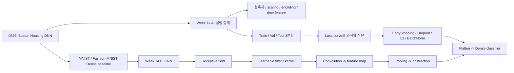

# 2026-06-04 ML 15강: 실험 설계, 과적합 대응, CNN 입문

> **세션 상태:** `ML/week14_NN실험Tips.pdf`, `ML/wk_14_cnn (1).pdf`, `ML/week14_lecture_keras_torch_results.ipynb`, `ML/cnn_fMNIST.ipynb`를 로데이터로 삼아, Week 14 자료와 보충 실습 파일을 하나의 0604 강의 흐름으로 통합한다.
> **원자료:** `ML/20260604_raw.md`
> **직전 연결:** 0529 강의는 Boston Housing 회귀에서 `X_train_norm`, `X_test_norm`, `y_train_norm`, `y_test_norm`을 만드는 과정을 중심으로 봤다. 오늘은 그 절차를 일반 실험 규칙으로 확장하고, 이미지 데이터에서는 왜 Dense MLP 대신 CNN 구조가 필요한지 설명한다.

---

## 오늘 강의 운영안

오늘의 핵심 질문은 두 개다.

```text
1. 신경망 실험에서 train 성능이 좋아졌다는 말만으로 충분한가?
2. 이미지 데이터는 왜 flatten 후 Dense로만 처리하면 한계가 생기는가?
```

첫 번째 PDF와 `week14_lecture_keras_torch_results.ipynb`는 실험 운영 규칙을 잡는다. 결측치, 정규화, 범주형 인코딩, 시간 변수, train/validation/test 3분할을 표준 전처리 절차로 정리하고, loss curve로 과적합을 진단한 뒤 Dropout, L2, Early Stopping, Batch Normalization을 어떻게 적용할지 다룬다.

두 번째 PDF와 `cnn_fMNIST.ipynb`는 CNN으로 넘어간다. 직전 MNIST/Fashion-MNIST 분류 흐름에서는 이미지를 `Flatten`해서 Dense network에 넣었다. 오늘은 그 방식이 공간 구조를 잃는다는 점을 출발점으로 삼아 receptive field, filter/kernel, convolution, feature map, padding, stride, pooling, flatten, fully connected classifier까지 연결하고, Fashion-MNIST에서 Dense baseline과 CNN의 실제 test accuracy를 비교한다.

| 시간 | 파트 | 핵심 질문 | 자료 위치 |
|------|------|-----------|-----------|
| 0-10분 | 직전 복습 | 0529의 scaling과 validation은 왜 부족했는가? | 0529 강의록, Tips p.2-p.8 |
| 10-25분 | 전처리 표준화 | 결측치, 수치형, 범주형, 시간 변수는 어떻게 모델 입력이 되는가? | Tips p.3-p.8 |
| 25-40분 | 3분할과 leakage | 왜 test는 마지막 한 번만 써야 하는가? | Tips p.7-p.8 |
| 40-55분 | 과적합 진단 | train loss와 val loss의 간격은 무엇을 말하는가? | Tips p.9-p.12 |
| 55-70분 | 정규화 도구 | Dropout, L2, Early Stopping, BatchNorm은 언제 쓰는가? | Tips p.13-p.22, Keras/Torch notebook |
| 70-85분 | CNN 개념과 실습 | filter가 학습되는 feature extractor라는 말은 무슨 뜻인가? | CNN p.4-p.22, `cnn_fMNIST.ipynb` |
| 85-90분 | 모델사 연결 | AlexNet, VGG, ResNet은 무엇을 해결하려 했는가? | CNN p.27-p.35 |

한 줄 메시지는 다음과 같다.

```text
좋은 딥러닝 모델은 큰 네트워크가 아니라, 데이터 분할과 전처리가 누수 없이 설계되고 val/test에서 일반화가 확인된 네트워크다.
```

---

## 개념 그래프 브리핑

오늘 강의는 두 축이 만난다.



선행 강의와 연결하면 다음과 같다.

| 선행 노드 | 오늘 쓰이는 방식 |
|-----------|------------------|
| 3강 NumPy | shape, channel, tensor 차원 해석 |
| 4강 Pandas/EDA | 결측치 탐지, feature engineering, 시간 변수 분해 |
| 10-12강 Backprop/Layer | Dropout, BatchNorm, Conv layer도 forward/backward 계약 안에 들어가는 layer |
| 0528 Keras | `Sequential`, `Dense`, `compile`, `fit`, `history` 해석 |
| 0529 DNN 회귀 | scaling, validation, MAE 비교를 더 엄격한 실험 설계로 확장 |

---

## 목차

1. [직전 강의에서 오늘 강의로 넘어가는 이유](#1-직전-강의에서-오늘-강의로-넘어가는-이유)
2. [전처리 표준 1: 결측치 처리와 leakage](#2-전처리-표준-1-결측치-처리와-leakage)
3. [전처리 표준 2: 수치형 정규화](#3-전처리-표준-2-수치형-정규화)
4. [전처리 표준 3: 범주형 인코딩](#4-전처리-표준-3-범주형-인코딩)
5. [전처리 표준 4: 시간 변수 처리](#5-전처리-표준-4-시간-변수-처리)
6. [Train / Validation / Test 3분할](#6-train--validation--test-3분할)
7. [과적합, 과소적합, 좋은 적합](#7-과적합-과소적합-좋은-적합)
8. [Loss curve로 진단하기](#8-loss-curve로-진단하기)
9. [일부러 과적합을 만들어보는 실험 습관](#9-일부러-과적합을-만들어보는-실험-습관)
10. [정규화 도구 1: Dropout](#10-정규화-도구-1-dropout)
11. [정규화 도구 2: L2 Regularization](#11-정규화-도구-2-l2-regularization)
12. [정규화 도구 3: Early Stopping](#12-정규화-도구-3-early-stopping)
13. [정규화 도구 4: Batch Normalization](#13-정규화-도구-4-batch-normalization)
14. [종합 실습: baseline vs regularized](#14-종합-실습-baseline-vs-regularized)
15. [왜 이미지에는 CNN이 필요한가](#15-왜-이미지에는-cnn이-필요한가)
16. [Receptive field와 filter](#16-receptive-field와-filter)
17. [Convolution layer의 구성 요소](#17-convolution-layer의-구성-요소)
18. [다중 channel과 다중 kernel](#18-다중-channel과-다중-kernel)
19. [Padding, stride, pooling](#19-padding-stride-pooling)
20. [CNN에서 classifier까지: Conv -> Pool -> Flatten -> Dense](#20-cnn에서-classifier까지-conv--pool--flatten--dense)
21. [Fashion-MNIST 보충 실습: Dense baseline vs CNN](#21-fashion-mnist-보충-실습-dense-baseline-vs-cnn)
22. [ImageNet과 CNN 모델 계보](#22-imagenet과-cnn-모델-계보)
23. [오늘의 핵심 정리](#23-오늘의-핵심-정리)

---

## 1. 직전 강의에서 오늘 강의로 넘어가는 이유

0529 강의에서는 Boston Housing 회귀 문제를 중심으로 원본 dataset object를 모델이 학습 가능한 배열로 바꿨다. `DataFrame`을 만들고, `CHAS`를 제거하고, train/test를 나누고, MinMax scaling을 적용했다. 그 다음 `Sequential` 모델을 만들어 `fit`, `history`, `predict`, `inverse_transform`, MAE, scatter plot으로 검증했다.

그런데 여기에는 아직 두 가지 빈틈이 있다.

| 빈틈 | 왜 문제가 되는가 | 오늘의 보완 |
|------|------------------|-------------|
| test를 검증처럼 반복 사용 | test 성능을 보며 모델을 고치면 test 정보가 새어 들어간다 | train/val/test 3분할 |
| train 성능 중심 사고 | train loss는 낮지만 새 데이터에서 망가질 수 있다 | loss curve와 regularization |

딥러닝 실험은 "모델을 크게 만들면 해결된다"가 아니다. 모델이 데이터를 외우기 쉬운 구조일수록 실험 설계가 더 중요해진다. 그래서 오늘의 전반부는 모델 코드보다 실험 운영 규칙에 무게를 둔다.

후반부는 이미지 데이터로 넘어간다. 0528-0529에서 MNIST는 Dense network 예제로 등장했다. 하지만 이미지는 단순한 숫자 벡터가 아니라 위치 구조가 있는 2D grid다. `Flatten`은 구현은 쉽지만, 픽셀의 이웃 관계를 지운다. CNN은 이 이웃 관계를 이용해 local pattern을 학습하는 구조다.

---

## 2. 전처리 표준 1: 결측치 처리와 leakage

결측치는 먼저 탐지한다.

```python
print(df.isnull().sum())
```

결측치 처리 방법은 데이터 타입과 결측 비율에 따라 달라진다.

| 방법 | 주 사용 상황 | 주의점 |
|------|--------------|--------|
| `dropna()` | 결측 비율이 작고 행 제거가 손실을 크게 만들지 않을 때 | 데이터 수가 작으면 위험 |
| `fillna(mean)` | 수치형, 대체로 대칭적인 분포 | 평균이 이상치에 민감 |
| `fillna(median)` | 수치형, 치우친 분포 | 평균보다 robust |
| `fillna("Unknown")` | 범주형 | 결측 자체가 의미 있는 범주가 될 수 있음 |

가장 중요한 원칙은 data leakage 방지다.

```text
대체값의 기준은 train 데이터에서만 계산한다.
val/test 데이터는 train에서 계산한 기준으로만 transform한다.
```

예를 들어 전체 데이터 평균으로 결측치를 채우면 test set의 통계가 train 단계에 들어간다. 겉보기에는 사소해 보이지만, 이것은 미래 정보를 미리 본 것과 같다. 실험 결과가 실제보다 좋아지고, 배포 후 성능은 떨어진다.

---

## 3. 전처리 표준 2: 수치형 정규화

신경망은 입력값 scale에 민감하다. 한 feature는 `[1, 2, 3, 4]` 범위인데 다른 feature는 `[100, 200, 300, 400]`이면, 큰 값을 가진 feature가 gradient와 activation에 더 큰 영향을 줄 수 있다. 이것이 학습 불안정을 만든다.

대표적인 scaling은 두 가지다.

| 방법 | 변환 결과 | 쓰기 좋은 상황 |
|------|-----------|----------------|
| MinMaxScaler | `[0, 1]` 범위 | 이미지 pixel, 명확한 상하한이 있는 값 |
| StandardScaler | 평균 0, 표준편차 1 | 일반적인 tabular 수치형 feature |

0529 Boston Housing에서는 MinMax scaling을 썼다. 오늘 자료는 더 일반적인 표준으로 StandardScaler를 제시한다.

```python
from sklearn.preprocessing import StandardScaler

scaler = StandardScaler()
X_train_scaled = scaler.fit_transform(X_train)
X_val_scaled = scaler.transform(X_val)
X_test_scaled = scaler.transform(X_test)
```

여기서 `fit`은 train에만 한다. `val`과 `test`는 `transform`만 한다. 이 패턴은 결측치 대체와 동일하다.

```text
train: 기준을 배운다 + 변환한다
val/test: train에서 배운 기준으로만 변환한다
```

---

## 4. 전처리 표준 3: 범주형 인코딩

범주형 feature는 숫자처럼 보이게 바꿔야 한다. 다만 순서가 없는 범주와 순서가 있는 범주를 구분해야 한다.

### 4.1 One-Hot Encoding

순서가 없는 범주에는 one-hot encoding을 쓴다. 예를 들어 `color = red, blue`는 크고 작음의 관계가 없다.

```python
pd.get_dummies(df, columns=["color"])
```

결과는 대략 다음처럼 된다.

| color_red | color_blue |
|-----------|------------|
| 1 | 0 |
| 0 | 1 |

one-hot은 column 수가 늘어나지만, 범주 사이에 가짜 순서를 만들지 않는 가장 안전한 방식이다.

### 4.2 Ordinal Encoding

순서가 있는 범주에는 ordinal encoding을 쓸 수 있다. 예를 들어 옷 사이즈는 `S < M < L < XL` 관계가 있다.

```python
size_map = {"S": 0, "M": 1, "L": 2, "XL": 3}
df["size"] = df["size"].map(size_map)
```

주의할 점은 모델이 숫자 간격까지 의미 있다고 받아들일 수 있다는 것이다. 순서만 있고 간격 의미가 약하면 one-hot이 더 나을 때도 있다.

---

## 5. 전처리 표준 4: 시간 변수 처리

시간은 그대로 모델에 넣기 어렵다. `datetime`을 feature로 분해해야 한다.

```python
df["date"] = pd.to_datetime(df["date"])
df["year"] = df["date"].dt.year
df["month"] = df["date"].dt.month
df["day"] = df["date"].dt.day
df["hour"] = df["date"].dt.hour
df["dayofweek"] = df["date"].dt.dayofweek
df["is_weekend"] = (df["dayofweek"] >= 5).astype(int)
```

시간 feature에서 중요한 것은 순환성이다. 예를 들어 23시 다음은 0시다. 숫자로만 보면 23과 0은 멀지만, 실제 시간에서는 이웃이다. 더 정교한 표현이 필요하면 sin/cos 변환을 쓴다.

\[
hour_{\sin} = \sin\left(2\pi \frac{hour}{24}\right),
\quad
hour_{\cos} = \cos\left(2\pi \frac{hour}{24}\right)
\]

이렇게 하면 23시와 0시가 원 위에서 가까운 위치로 표현된다.

---

## 6. Train / Validation / Test 3분할

0529 강의에서는 train/test split을 중심으로 설명했다. 오늘부터는 3분할이 표준이다.

| 분할 | 역할 | 사용 시점 |
|------|------|-----------|
| Train | 가중치 학습 | 매 epoch |
| Validation | 하이퍼파라미터 결정, 과적합 진단 | 실험 반복 중 |
| Test | 마지막 최종 평가 | 모델 선택이 끝난 뒤 단 한 번 |

2분할만 쓰면 test set을 보며 모델 구조, epoch, dropout rate, layer 수를 계속 바꾸게 된다. 그러면 test가 사실상 validation이 되고, 최종 평가용 데이터가 사라진다.

```python
from sklearn.model_selection import train_test_split

X_temp, X_test, y_temp, y_test = train_test_split(
    X, y, test_size=0.2, random_state=42
)

X_train, X_val, y_train, y_val = train_test_split(
    X_temp, y_temp, test_size=0.2, random_state=42
)
```

이 설정은 전체 데이터 기준으로 대략 다음 비율이 된다.

```text
train: 64%
validation: 16%
test: 20%
```

Keras에서는 validation data를 `fit`에 직접 넣는다.

```python
history = model.fit(
    X_train,
    y_train,
    validation_data=(X_val, y_val),
    epochs=100,
    batch_size=32,
)
```

---

## 7. 과적합, 과소적합, 좋은 적합

모델 성능은 train loss 하나로 판단하지 않는다.

| 상태 | Train Loss | Val Loss | 진단 | 처방 |
|------|------------|----------|------|------|
| Underfit | 높음 | 높음 | 모델이 패턴을 못 배움 | 모델 키우기, feature 개선, 더 학습 |
| Good fit | 낮음 | 낮음 | train과 val 모두 잘 맞음 | 유지 |
| Overfit | 매우 낮음 | 높음 | train만 외움 | 정규화, 모델 축소, data augmentation |

핵심은 train과 validation의 관계다. train loss가 낮아지는 것은 필요조건이지 충분조건이 아니다. validation loss도 함께 낮아져야 새 데이터에 일반화된다고 말할 수 있다.

---

## 8. Loss curve로 진단하기

`history.history`에는 epoch별 loss와 validation loss가 들어 있다.

```python
import matplotlib.pyplot as plt

plt.plot(history.history["loss"], label="train")
plt.plot(history.history["val_loss"], label="val")
plt.legend()
plt.show()
```

과적합의 전형적인 시그널은 다음과 같다.

```text
train loss는 계속 감소한다.
val loss는 어느 시점부터 상승한다.
train-val gap이 벌어진다.
```

그 지점부터 모델은 일반 패턴보다 train sample의 세부사항을 외우기 시작했다고 해석한다. 오늘 자료의 핵심 문장도 이것이다.

```text
Train loss는 떨어지는데 Val loss가 오르면 과적합이다.
```

---

## 9. 일부러 과적합을 만들어보는 실험 습관

새 데이터를 만나면 작은 모델부터 시작하는 것도 좋지만, 반대로 일부러 과적합을 만들어 보는 것도 유용하다.

```python
X_train_small = X_train[:1000]
y_train_small = y_train[:1000]

model = keras.Sequential([
    keras.layers.Dense(256, activation="relu", input_shape=(n,)),
    keras.layers.Dense(256, activation="relu"),
    keras.layers.Dense(256, activation="relu"),
    keras.layers.Dense(128, activation="relu"),
    keras.layers.Dense(1),
])

model.compile(optimizer="adam", loss="mse", metrics=["mae"])
history = model.fit(
    X_train_small,
    y_train_small,
    validation_data=(X_val, y_val),
    epochs=100,
    batch_size=32,
)
```

이 실험의 목적은 좋은 모델을 바로 만드는 것이 아니다. 데이터와 모델이 최소한 train set을 외울 정도의 표현력을 갖는지 확인하는 것이다.

| 결과 | 해석 |
|------|------|
| 작은 train set도 못 외움 | 모델, loss, target, preprocessing, label에 문제가 있을 수 있음 |
| train은 잘 외우지만 val이 나쁨 | 정상적인 과적합 상황, 이제 정규화로 줄여야 함 |
| train과 val이 모두 좋음 | 현재 구조가 꽤 적절할 수 있음 |

---

## 10. 정규화 도구 1: Dropout

Dropout은 학습 중 일부 뉴런의 출력을 무작위로 0으로 만든다.

```python
from keras.layers import Dense, Dropout

model = keras.Sequential([
    Dense(128, activation="relu", input_shape=(n,)),
    Dropout(0.3),
    Dense(128, activation="relu"),
    Dropout(0.3),
    Dense(64, activation="relu"),
    Dropout(0.3),
    Dense(1),
])
```

`Dropout(0.3)`은 학습 step마다 대략 30%의 뉴런을 끈다는 뜻이다. 이 방식은 특정 뉴런 조합에 지나치게 의존하는 공의존(co-adaptation)을 줄인다.

| 구분 | 동작 |
|------|------|
| Training | 일부 뉴런을 끄고 forward/backward에서 제외 |
| Inference | 모든 뉴런을 사용하되 학습 중 비활성 비율을 고려해 보정 |

일반적인 rate는 0.2-0.5 정도다. 출력층 직전이나 출력층 자체에는 무리하게 넣지 않는다.

---

## 11. 정규화 도구 2: L2 Regularization

L2 regularization은 loss에 가중치 크기 페널티를 더한다.

\[
L = MSE + \lambda \sum_i w_i^2
\]

가중치가 커질수록 페널티가 커지므로, 모델은 작은 가중치로 더 부드러운 함수를 학습하려 한다. 결과적으로 train data의 세부 noise를 과하게 따라가는 경향이 줄어든다.

```python
from keras.regularizers import l2

reg = l2(0.01)

model = keras.Sequential([
    Dense(128, activation="relu", kernel_regularizer=reg, input_shape=(n,)),
    Dense(128, activation="relu", kernel_regularizer=reg),
    Dense(64, activation="relu", kernel_regularizer=reg),
    Dense(1),
])
```

L1과 L2의 차이는 다음처럼 정리한다.

| 방법 | 페널티 | 효과 |
|------|--------|------|
| L1, Lasso | \(\sum_i |w_i|\) | 일부 가중치를 정확히 0으로 만들 수 있음 |
| L2, Ridge | \(\sum_i w_i^2\) | 전체 가중치를 작고 안정적으로 유지 |

신경망에서는 보통 L2를 먼저 생각한다.

---

## 12. 정규화 도구 3: Early Stopping

Early Stopping은 가장 실용적인 정규화 도구다. epoch를 크게 잡아도 validation loss가 더 이상 좋아지지 않으면 멈춘다.

```python
from keras.callbacks import EarlyStopping

es = EarlyStopping(
    monitor="val_loss",
    patience=10,
    restore_best_weights=True,
)

history = model.fit(
    X_train,
    y_train,
    validation_data=(X_val, y_val),
    epochs=200,
    callbacks=[es],
)
```

여기서 중요한 옵션은 두 개다.

| 옵션 | 의미 |
|------|------|
| `patience=10` | validation loss 개선이 없어도 10 epoch는 기다림 |
| `restore_best_weights=True` | 마지막 epoch가 아니라 가장 좋았던 epoch의 weight로 복원 |

Early Stopping은 하이퍼파라미터가 적고 다른 정규화 기법과 조합하기 쉽다. 그래서 오늘 자료도 "항상 먼저 적용"하라고 정리한다.

---

## 13. 정규화 도구 4: Batch Normalization

Batch Normalization은 각 층의 입력을 미니배치 단위로 정규화한다. 입력 feature scaling이 모델 바깥의 정규화라면, BatchNorm은 모델 내부 activation의 scale을 안정화하는 장치다.

권장 순서는 다음과 같다.

```text
Dense -> BatchNormalization -> Activation
```

Keras에서는 activation을 Dense 안에 바로 넣지 않고 분리한다.

```python
from keras.layers import Dense, BatchNormalization, Activation

model = keras.Sequential([
    Dense(128, input_shape=(n,)),
    BatchNormalization(),
    Activation("relu"),
    Dense(128),
    BatchNormalization(),
    Activation("relu"),
    Dense(1),
])
```

BatchNorm의 효과는 다음과 같다.

| 효과 | 설명 |
|------|------|
| 학습 안정성 증가 | layer 입력 분포가 덜 흔들림 |
| 더 큰 learning rate 가능 | gradient update가 덜 불안정 |
| 약한 regularization | mini-batch noise가 약간의 일반화 효과를 줌 |
| 초기값 민감도 감소 | activation scale이 안정됨 |

Dropout과 BatchNorm을 동시에 쓸 때는 주의가 필요하다. 둘이 서로 간섭할 수 있으므로 보통은 하나만으로 충분한지 먼저 확인한다. 함께 쓴다면 `BN -> Activation -> Dropout` 순서로 둔다.

---

## 14. 종합 실습: baseline vs regularized

자료의 종합 실습은 UCI Appliances Energy Prediction 회귀 문제를 예로 든다. 샘플은 약 19,735개, feature는 실내외 기상 및 시간 관련 변수, target은 appliance energy 사용량이다. 보충 노트북 `week14_lecture_keras_torch_results.ipynb`는 이 흐름을 Keras 3의 torch backend로 실제 실행한 파일이다.

실행 환경은 다음처럼 고정했다.

```python
import os
os.environ["KERAS_BACKEND"] = "torch"

import numpy as np
import pandas as pd
import keras

np.random.seed(42)
keras.utils.set_random_seed(42)
```

노트북 출력 기준 환경은 다음과 같다.

| 항목 | 값 |
|------|----|
| Keras | 3.13.2 |
| Backend | torch |
| pandas | 2.2.2 |

### 14.1 데이터 준비

```python
df = pd.read_csv(url)
df["date"] = pd.to_datetime(df["date"])

df["hour"] = df["date"].dt.hour
df["dayofweek"] = df["date"].dt.dayofweek
df["month"] = df["date"].dt.month

X = df[feature_cols].values
y = np.log1p(df["Appliances"].values)
```

target에 `log1p`를 쓰는 이유는 energy 사용량처럼 긴 꼬리(long-tail)를 가진 값의 scale을 완화하기 위해서다. 실제 노트북에서는 다음 11개 feature를 사용했다.

```python
feature_cols = [
    "T1", "RH_1", "T2", "RH_2", "T_out", "RH_out",
    "Windspeed", "Visibility", "hour", "dayofweek", "month",
]
```

실행 결과는 다음과 같다.

| 항목 | 값 |
|------|----|
| `X` shape | `(19735, 11)` |
| `y` shape | `(19735,)` |
| 결측치 | 0개 |
| log 변환 후 `y` min/max/mean/std | 2.40 / 6.99 / 4.32 / 0.65 |

### 14.2 3분할과 scaling

```python
X_temp, X_test, y_temp, y_test = train_test_split(
    X, y, test_size=0.2, random_state=42
)
X_train, X_val, y_train, y_val = train_test_split(
    X_temp, y_temp, test_size=0.2, random_state=42
)

scaler = StandardScaler()
X_train = scaler.fit_transform(X_train)
X_val = scaler.transform(X_val)
X_test = scaler.transform(X_test)
```

노트북 실행 결과 분할 shape는 다음과 같다.

| split | shape |
|-------|-------|
| Train | `(12630, 11)` |
| Val | `(3158, 11)` |
| Test | `(3947, 11)` |

### 14.3 Baseline

```python
baseline = keras.Sequential([
    Dense(128, activation="relu", input_shape=(n,)),
    Dense(128, activation="relu"),
    Dense(64, activation="relu"),
    Dense(1),
])

baseline.compile(optimizer="adam", loss="mse", metrics=["mae"])
baseline.fit(
    X_train,
    y_train,
    validation_data=(X_val, y_val),
    epochs=100,
    batch_size=32,
)
```

보충 노트북에서 baseline의 최종 validation loss는 `0.1584`였다.

### 14.4 Regularized model

```python
regularized = keras.Sequential([
    Dense(128, kernel_regularizer=l2(0.001), input_shape=(n,)),
    BatchNormalization(),
    Activation("relu"),
    Dropout(0.3),
    Dense(128, kernel_regularizer=l2(0.001)),
    BatchNormalization(),
    Activation("relu"),
    Dropout(0.3),
    Dense(1),
])

es = EarlyStopping(patience=15, restore_best_weights=True)
regularized.compile(optimizer="adam", loss="mse", metrics=["mae"])
regularized.fit(
    X_train,
    y_train,
    validation_data=(X_val, y_val),
    epochs=200,
    batch_size=32,
    callbacks=[es],
)
```

보충 노트북에서 regularized model은 100 epoch를 모두 학습했고, 최종 validation loss는 `0.2579`였다. 즉 EarlyStopping이 중간에 멈추지 않았다.

### 14.5 실제 결과 해석

PDF는 일반적인 기대를 "정규화 모델이 train 성능을 약간 희생하고 val/test 성능을 개선한다"로 제시한다. 하지만 보충 노트북의 실제 실행 결과는 더 좋은 수업 포인트를 준다.

| 모델 | Test Loss | Test MAE |
|------|-----------|----------|
| Baseline | 0.1599 | 0.2680 |
| Regularized | 0.2649 | 0.3316 |

계산된 개선율은 `-23.7%`였다. 즉 이 실행에서는 regularized model이 baseline보다 나빴다.

이 결과는 실패가 아니라 중요한 실험 해석이다.

| 관찰 | 해석 |
|------|------|
| regularized val/test가 더 나쁨 | L2, BatchNorm, Dropout을 한꺼번에 넣어 과정규화되었을 가능성 |
| EarlyStopping이 100 epoch까지 멈추지 않음 | regularized model의 validation loss가 계속 완만히 움직였거나 patience 조건을 만족하지 않았음 |
| baseline test MAE가 더 좋음 | 현재 데이터/feature/model 크기에서는 baseline 복잡도가 이미 적절했을 수 있음 |

따라서 오늘의 결론은 "정규화는 무조건 성능을 올린다"가 아니다.

```text
정규화는 처방이다.
과적합 증상이 있을 때, 필요한 강도로, 하나씩 추가하며 loss curve로 확인한다.
```

실무 적용 순서는 다음처럼 잡는다.

```text
1. baseline을 먼저 만든다.
2. train/val curve를 본다.
3. 과적합이면 EarlyStopping부터 넣는다.
4. 여전히 gap이 크면 Dropout 또는 L2를 하나씩 추가한다.
5. 학습이 불안정하면 BatchNorm을 검토한다.
6. 여러 기법을 동시에 넣고 좋아질 것이라고 가정하지 않는다.
```

---

## 15. 왜 이미지에는 CNN이 필요한가

MNIST나 Fashion-MNIST 이미지는 28x28 pixel grid다. Dense MLP에 넣으려면 보통 `Flatten`해서 784차원 벡터로 만든다.

```text
28 x 28 image -> Flatten -> 784-dimensional vector -> Dense network
```

이 방식은 작동은 하지만, 이미지의 공간 구조를 지운다. 바로 옆 pixel끼리 가까운 관계라는 정보가 사라지고, 모든 pixel이 독립 feature처럼 취급된다.

CNN은 이 문제를 다르게 본다.

```text
이미지는 local pattern의 조합이다.
작은 filter로 edge, line, texture를 찾고,
깊은 layer로 shape, object part, object를 만든다.
```

즉 CNN은 feature extraction을 Dense layer에 전부 맡기지 않는다. convolution layer가 먼저 local feature map을 만들고, 그 결과를 classifier가 사용한다.

---

## 16. Receptive field와 filter

Receptive field는 하나의 뉴런 또는 하나의 activation이 영향을 받는 입력 영역이다. 시각 피질에서 어떤 뉴런은 수평선에 반응하고, 어떤 뉴런은 수직선에 반응한다. 더 큰 receptive field는 이런 낮은 수준의 반응을 조합해 더 복잡한 패턴에 반응한다.

이미지 인식의 계층 구조는 다음처럼 생각할 수 있다.

```text
pixels -> edges/lines -> shapes/parts -> object
```

예를 들어 자동차를 본다면, 낮은 layer는 edge와 line을 보고, 중간 layer는 wheel, grill, window 같은 부분을 보고, 높은 layer는 car라는 object를 본다.

전통적인 컴퓨터 비전에서는 SIFT 같은 handcrafted feature가 있었다. SIFT는 scale, rotation, illumination 변화에 강한 keypoint를 사람이 설계한 규칙으로 추출한다. CNN은 이 방향을 바꾼다.

| 방식 | feature를 누가 정하는가? | 특징 |
|------|--------------------------|------|
| SIFT 등 전통 방법 | 사람이 설계 | 해석 가능하지만 task마다 설계 필요 |
| CNN | 데이터에서 학습 | filter weight가 backprop으로 최적화됨 |

CNN의 filter는 작은 행렬이다. edge detection, blur, sharpening 같은 고정 필터와 비슷하게 작동하지만, 핵심 차이는 filter 값이 학습된다는 점이다.

---

## 17. Convolution layer의 구성 요소

Convolution layer는 다음 요소로 설명한다.

| 요소 | 의미 |
|------|------|
| Filter / Kernel | 입력 위를 움직이는 작은 학습 가능 행렬 |
| Stride | filter가 한 번에 이동하는 pixel 수 |
| Padding | 출력 공간 크기를 조절하기 위해 가장자리에 추가하는 값 |
| Feature map | filter를 적용해 얻은 출력 map |
| Activation | convolution 결과에 적용하는 비선형 함수, 보통 ReLU |

한 위치에서 convolution은 단순하게 말하면 다음 계산이다.

\[
z_{i,j} = \sum_{u=1}^{k}\sum_{v=1}^{k} X_{i+u, j+v}K_{u,v} + b
\]

여기서 \(K\)는 kernel, \(b\)는 bias다. filter를 이미지 전체 위치에 sliding하면서 같은 계산을 반복하면 feature map이 나온다.

이 방식의 장점은 weight sharing이다. 같은 filter가 이미지의 여러 위치에 적용된다. 따라서 같은 edge나 texture가 왼쪽 위에 있든 오른쪽 아래에 있든 같은 filter가 반응할 수 있다.

---

## 18. 다중 channel과 다중 kernel

흑백 이미지는 channel이 1개지만, RGB 이미지는 channel이 3개다. convolution filter는 입력 channel 수와 같은 depth를 가진다.

```text
RGB input: H x W x 3
3x3 filter: 3 x 3 x 3
한 위치의 출력값: 3개 channel의 곱셈-합을 모두 더한 scalar
```

한 filter는 하나의 2D feature map을 만든다. filter가 32개라면 feature map도 32개가 나온다.

```text
input image
-> 32 kernels
-> 32 feature maps
```

Keras에서 이것은 보통 다음처럼 쓴다.

```python
keras.layers.Conv2D(
    filters=32,
    kernel_size=(3, 3),
    activation="relu",
    padding="same",
)
```

여기서 `filters=32`는 output channel 수를 뜻한다. 즉 "32개의 다른 feature detector를 학습한다"는 의미다.

---

## 19. Padding, stride, pooling

### 19.1 Padding

padding은 입력 가장자리에 값을 추가해 출력 크기를 조절한다. `padding="same"`을 쓰면 stride가 1일 때 입력과 출력의 height/width가 같게 유지된다. padding이 없으면 convolution을 거치며 feature map 크기가 줄어든다.

### 19.2 Stride

stride는 filter가 이동하는 간격이다. stride가 1이면 한 pixel씩 움직이고, stride가 2이면 두 pixel씩 움직인다. stride가 커질수록 출력 feature map은 작아진다.

### 19.3 Pooling

pooling은 일정 영역의 값을 하나로 요약한다.

| pooling | 계산 | 효과 |
|---------|------|------|
| Max pooling | 영역 안의 최대값 선택 | 강한 feature가 있는지 보존 |
| Average pooling | 영역 평균 | 전체적인 반응 평균화 |

Max pooling은 위치 변화에 대한 민감도를 줄인다. edge가 한두 pixel 움직여도 같은 pooling 영역 안에 있으면 비슷한 출력이 나온다.

---

## 20. CNN에서 classifier까지: Conv -> Pool -> Flatten -> Dense

CNN은 feature extractor와 classifier로 나눠 볼 수 있다.

```text
Input image
-> Conv + ReLU
-> Pooling
-> Conv + ReLU
-> Pooling
-> Flatten
-> Dense classifier
-> Output class
```

Fashion-MNIST 예제라면 입력 shape는 다음과 같다.

```text
number of instances, rows, columns, channels
```

즉 Keras 입력은 보통 `(28, 28, 1)` 형태다.

```python
model = keras.Sequential([
    keras.layers.Conv2D(32, (3, 3), activation="relu", input_shape=(28, 28, 1)),
    keras.layers.MaxPooling2D((2, 2)),
    keras.layers.Conv2D(64, (3, 3), activation="relu"),
    keras.layers.MaxPooling2D((2, 2)),
    keras.layers.Flatten(),
    keras.layers.Dense(128, activation="relu"),
    keras.layers.Dense(10, activation="softmax"),
])

model.compile(
    optimizer="adam",
    loss="sparse_categorical_crossentropy",
    metrics=["accuracy"],
)
```

0528의 Dense MNIST와 비교하면 마지막 classifier는 거의 비슷하다. 달라진 것은 앞부분이다. Dense MNIST는 `Flatten -> Dense`로 바로 갔지만, CNN은 `Conv -> Pool`을 통해 이미지의 local feature를 먼저 추출한다.

---

## 21. Fashion-MNIST 보충 실습: Dense baseline vs CNN

`cnn_fMNIST.ipynb`는 PDF의 CNN 개념을 Fashion-MNIST 실습으로 확인한다. 전체 흐름은 다음과 같다.

```text
Fashion-MNIST load
-> label 확인
-> Dense baseline 학습
-> CNN 입력 shape로 변환
-> Conv2D/MaxPooling2D CNN 학습
-> test accuracy와 예측값 비교
```

### 21.1 Label 확인

처음 네 개 train label은 다음과 같았다.

```text
[9 0 0 3]
```

label 이름으로 바꾸면 다음과 같다.

| label | class |
|-------|-------|
| 9 | Ankle_boot |
| 0 | T-shirt |
| 0 | T-shirt |
| 3 | Dress |

Fashion-MNIST class 목록은 다음과 같다.

```python
mnist_lbl = [
    "T-shirt", "Trouser", "Pullover", "Dress", "Coat",
    "Sandal", "Shirt", "Sneaker", "Bag", "Ankle_boot",
]
```

### 21.2 Dense baseline

Dense baseline은 이미지를 바로 flatten한다.

```python
model = keras.Sequential([
    keras.layers.Flatten(input_shape=(28, 28)),
    keras.layers.Dense(256, activation="relu"),
    keras.layers.Dense(128, activation="relu"),
    keras.layers.Dense(100, activation="relu"),
    keras.layers.Dense(10, activation="softmax"),
])
```

모델 요약은 다음과 같다.

| Layer | Output shape | Params |
|-------|--------------|--------|
| Flatten | `(None, 784)` | 0 |
| Dense 256 | `(None, 256)` | 200,960 |
| Dense 128 | `(None, 128)` | 32,896 |
| Dense 100 | `(None, 100)` | 12,900 |
| Dense 10 | `(None, 10)` | 1,010 |
| Total | | 247,766 |

10 epoch 학습 후 test 결과는 다음과 같았다.

| 지표 | 값 |
|------|----|
| Test loss | 0.3386 |
| Test accuracy | 0.8866 |

### 21.3 CNN 입력 변환

CNN은 channel 차원이 필요하다.

```python
train_images = train_images[:, :, :, np.newaxis]
test_images = test_images[:, :, :, np.newaxis]
train_images, test_images = train_images / 255, test_images / 255
```

shape 관점에서는 다음 변환이다.

```text
(60000, 28, 28) -> (60000, 28, 28, 1)
(10000, 28, 28) -> (10000, 28, 28, 1)
```

### 21.4 CNN model

보충 노트북의 CNN 구조는 다음과 같다.

```python
model = keras.models.Sequential([
    keras.layers.Conv2D(
        input_shape=(28, 28, 1),
        kernel_size=(3, 3),
        padding="same",
        filters=32,
    ),
    keras.layers.MaxPooling2D((2, 2), strides=2),
    keras.layers.Conv2D(kernel_size=(3, 3), padding="same", filters=64),
    keras.layers.MaxPooling2D((2, 2), strides=2),
    keras.layers.Conv2D(kernel_size=(3, 3), padding="same", filters=32),
    keras.layers.Flatten(),
    keras.layers.Dense(128, activation="relu"),
    keras.layers.Dense(32, activation="relu"),
    keras.layers.Dense(10, activation="softmax"),
])
```

요약하면 다음 구조다.

| Layer | Output shape | Params |
|-------|--------------|--------|
| Conv2D 32 | `(None, 28, 28, 32)` | 320 |
| MaxPooling2D | `(None, 14, 14, 32)` | 0 |
| Conv2D 64 | `(None, 14, 14, 64)` | 18,496 |
| MaxPooling2D | `(None, 7, 7, 64)` | 0 |
| Conv2D 32 | `(None, 7, 7, 32)` | 18,464 |
| Flatten | `(None, 1568)` | 0 |
| Dense 128 | `(None, 128)` | 200,832 |
| Dense 32 | `(None, 32)` | 4,128 |
| Dense 10 | `(None, 10)` | 330 |
| Total | | 242,570 |

흥미로운 점은 CNN의 전체 parameter 수가 Dense baseline보다 약간 작다는 것이다.

| 모델 | Params | Test accuracy |
|------|--------|---------------|
| Dense baseline | 247,766 | 0.8866 |
| CNN | 242,570 | 0.9040 |

CNN은 parameter를 더 많이 써서 이긴 것이 아니다. 이미지의 local structure를 convolution filter로 먼저 처리했기 때문에 더 효율적으로 feature를 뽑았다.

### 21.5 예측값 비교

CNN이 test image 25개에 대해 낸 예측과 실제값은 다음과 같았다.

```text
예측값 = [9 2 1 1 6 1 4 6 5 7 4 5 8 3 4 1 2 4 8 0 2 5 7 5 1]
실제값 = [9 2 1 1 6 1 4 6 5 7 4 5 7 3 4 1 2 4 8 0 2 5 7 9 1]
```

틀린 지점은 13번째와 24번째다.

| 위치 | 예측 | 실제 | 해석 |
|------|------|------|------|
| 13번째 | Bag | Sneaker | 가방과 신발의 local texture/shape가 헷갈린 사례 |
| 24번째 | Sandal | Ankle_boot | 신발 계열 내부 혼동 |

이 사례는 accuracy 하나만 보는 대신, 어떤 class끼리 혼동하는지까지 봐야 한다는 점을 보여준다.

---

## 22. ImageNet과 CNN 모델 계보

ImageNet은 대규모 이미지 인식 연구를 밀어 올린 대표 dataset이다. 자료에서는 train 1,281,167장, validation 50,000장, test 100,000장, 1000 object class를 언급한다. ImageNet Large Scale Visual Recognition Challenge는 CNN 구조 발전의 기준점이 되었다.

대표 모델 계보는 다음처럼 잡는다.

| 모델 | 핵심 아이디어 | 오늘 강의와의 연결 |
|------|---------------|--------------------|
| AlexNet | ReLU, Dropout, data augmentation, 깊은 CNN의 성공 | 과적합 대응 도구가 실제 이미지 모델에서 중요 |
| VGG | 3x3 convolution을 깊게 쌓음 | 작은 kernel stacking으로 큰 receptive field 효과 |
| ResNet | residual connection | 깊어질수록 학습이 어려운 문제 해결 |
| Inception | 여러 kernel path를 모듈로 결합 | 계산 효율성과 성능 균형 |
| DenseNet | layer 간 dense connection | feature 재사용 |
| EfficientNet | depth/width/resolution 균형 scaling | 모델 크기 조절 전략 |

AlexNet의 Dropout은 오늘 전반부 정규화 도구와 직접 연결된다. VGG의 3x3 stacking은 convolution의 receptive field 개념과 연결된다. ResNet은 오늘 자세히 전개하지 않지만, 깊은 네트워크에서 gradient 흐름을 보존하려는 시도라는 점에서 10-12강 backprop 흐름과 연결된다.

---

## 23. 오늘의 핵심 정리

오늘 강의는 실험 운영과 CNN 입문을 하나로 묶는다.

| 주제 | 핵심 |
|------|------|
| 결측치 처리 | train 기준으로 대체값을 계산해야 leakage를 막는다 |
| scaling | train에 `fit`, val/test에는 `transform`만 적용한다 |
| 범주형 인코딩 | 순서가 없으면 one-hot, 순서가 있으면 ordinal을 검토한다 |
| 시간 변수 | datetime을 hour, dayofweek, month 등으로 분해한다 |
| 3분할 | train은 학습, val은 튜닝, test는 최종 평가다 |
| 과적합 진단 | train loss 감소와 val loss 상승이 함께 보이면 과적합이다 |
| Early Stopping | 가장 먼저 적용할 실용적 정규화 도구다 |
| Dropout/L2/BatchNorm | 과적합과 학습 불안정에 대응하는 toolkit이다 |
| CNN | 이미지의 local structure를 filter와 feature map으로 학습한다 |
| Pooling | feature map을 요약해 위치 민감도와 계산량을 줄인다 |
| Energy 보충 실습 | 정규화 4종을 한꺼번에 넣은 모델이 baseline보다 나쁠 수 있음을 확인했다 |
| Fashion-MNIST 보충 실습 | Dense baseline 0.8866, CNN 0.9040으로 CNN의 공간 feature 추출 효과를 확인했다 |

마지막으로 0529 강의와 오늘 강의를 한 문장으로 연결한다.

```text
0529는 모델에 넣을 데이터를 만드는 법을 배웠고,
0604는 그 실험이 새 데이터에서도 믿을 수 있게 유지되는 법과
이미지처럼 공간 구조가 있는 데이터에서 어떤 layer를 써야 하는지 배운다.
```
