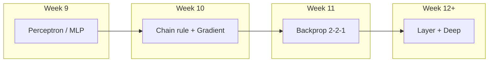

# 2026-05-14 ML 11강: Backpropagation (2-2-1에서 Week 12까지 연결)

> **소스 참조:** 교재 슬라이드(수정판) · `mlp_scratch.py` · `week11_examples.ipynb` · `forward_pass.html` · `backward_pass.html` · `mlp_reference.html` · `notebook_walkthrough.html` ([§15](#15-인터랙티브-html-보조-자료))
> **코스 위치:** **Week 9** Perceptron→MLP → **Week 10** chain rule·gradient → **Week 11(본 강)** backprop **구체화** → **Week 12+** layer abstraction·vectorized deep network.

---

## 개념 그래프 브리핑 (10초 맵)

| 구분 | 노드(개념) | 이 강에서 쓰는 연결 예 |
|------|------------|-------------------------|
| **선행** | Perceptron, **MLP**, XOR 표현력 | Week 9에서 “왜 층이 필요한가” → 오늘은 **같은 2-2-1**에 backprop을 얹어 XOR을 **자동 학습** |
| **선행** | **chain rule**, **sigmoid derivative**, **gradient** / GD | Week 10 공구상자 → 오늘은 그걸 **한 네트워크**에 연속 적용 |
| **현재(핵심)** | **Backpropagation** | 출력→입력 방향으로 \(\partial L/\partial W\) 전파; **δ(error local gradient)** 로 패턴 압축 |
| **후속** | **vectorized backprop**, **layer abstraction**, **deep network** | Week 12에서 `Layer`·임의 깊이로 **오늘 식의 그대로 일반화** |



**한 줄:** 오늘은 “미분 규칙(10주)”을 “**파라미터별 기여도 계산 알고리즘(11주)**”으로 바꾸고, 내일은 그 알고리즘을 “**층 모듈(12주)**”로 포장한다.

---

## 심층 브리핑

8강의 **Forward → Loss → Backward → Update** 루프는 개념만으로는 \(\partial L/\partial W\) 가 **어떤 순서로** 쌓이는지 보이지 않는다. 10강은 **연쇄법칙·그래디언트·시그모이드 미분**으로 “한 변수씩 펼치기”를 연습했다. **11강(오늘)**은 그 도구를 **가장 작은 MLP(2-2-1)** 에 얹어, **짧은 체인(출력층)** 과 **긴 체인(은닉층)** 을 대비하고, 같은 패턴이 **δ × (입력 쪽 값)** 으로 접힘을 체득한다. 구현은 `mlp_scratch.py` 로 **수식↔코드↔shape** 를 고정하고, **gradient check** 로 “내가 유도한 식이 코드에 맞는지”를 검증한다. **Week 12**에서는 같은 식을 **층(`Layer`) 추상화**와 **임의 깊이**로 확장한다 — 원리는 변하지 않고 **반복·스택**만 늘어난다.

---

## 강의 현황 (포인터)

| 강 | 파일 | 주요 주제 |
|----|------|-----------|
| 8강 | `20260430.md` | NN·Perceptron·MLP·학습 루프 개요 |
| 10강 | `20260507.md` | Chain rule·gradient·sigmoid 미분 |
| **11강** | **본 문서** | **Backprop·δ·shape·`mlp_scratch`·검증·XOR·HTML(§15)** |
| 12강(예정) | — | **Layer abstraction**, vectorized backprop, deeper net |

---

## 목차

1. [주차 맥락과 코스 연결](#1-주차-맥락과-코스-연결)
2. [2-2-1 네트워크 구조와 표기](#2-2-1-네트워크-구조와-표기)
3. [Forward pass](#3-forward-pass)
4. [공통 숫자·출력 오차·δ의 자리](#4-공통-숫자출력-오차δ의-자리)
5. [출력층: 짧은 체인](#5-출력층-짧은-체인)
6. [은닉층: 긴 체인과 δ⁽¹⁾](#6-은닉층-긴-체인과-δ1)
7. [은닉층 6개 편미분 표](#7-은닉층-6개-편미분-표)
8. [Forward vs Backward·9개 총정리](#8-forward-vs-backward9개-총정리)
9. [일반 패턴과 Week 12로의 다리](#9-일반-패턴과-week-12로의-다리)
10. [`mlp_scratch.py` 구현 해설](#10-mlp_scratchpy-구현-해설)
11. [`train`·gradient check](#11-traingradient-check)
12. [XOR 자동 학습](#12-xor-자동-학습)
13. [강의 실행: `week11_examples.ipynb`](#13-강의-실행-week11_examplesipynb)
14. [부록: 스니펫·손계산 표](#14-부록-스니펫손계산-표)
15. [인터랙티브 HTML](#15-인터랙티브-html-보조-자료)
16. [오늘의 핵심·헷갈림·다음 강의](#16-오늘의-핵심헷갈림다음-강의)
17. [편집 변경 요약](#17-편집-변경-요약)

---

## 1. 주차 맥락과 코스 연결

| 항목 | 내용 |
|------|------|
| **한 줄 정의** | Week 11은 “**chain rule을 파라미터 그래디언트 알고리즘(backprop)**으로 구현하는 주차”다. |
| **왜 필요한가** | Week 9~10은 **도구**였다. 실제 NN 학습은 **수만~수억 개** \(W\) 에 대해 같은 규칙을 **한 번의 backward**로 묶어야 한다. |
| **입력 → 출력** | 선행 개념(MLP·chain rule·GD) → **오늘: 2-2-1에서 완전 전개** → **출력: Week 12에서 층 단위 일반화** |
| **핵심 수식** | \(\delta^{(l)} = (W^{(l+1)})^\top \delta^{(l+1)} \odot \sigma'(z^{(l)})\) (오늘은 \(l=1\) 만 손으로) |
| **코드 대응** | `mlp_scratch.MLP.backward` 가 위 구조의 **스칼라·벡터 버전** |
| **흔한 오해** | “backprop은 미분 공식 외우기”가 아니라 “**forward에서 쌓인 의존 관계를 역순으로 체인룰 적용**”이다. |

| 주차 | 내용 |
|------|------|
| 9 | Perceptron → MLP |
| 10 | Chain rule → Gradient |
| **11** | **Backpropagation (오늘)** |
| **12+** | **Layer / vectorized / deep** |

> **Checkpoint:** Week 10에서 배운 **gradient**는 “어느 방향으로 \(W\)를 움직이면 \(L\)이 가장 빨리 변하는가”였다. Week 11은 그 방향 벡터 \(\nabla L\) 의 **각 성분을 어떻게 한 번에 계산할지**다.

---

## 2. 2-2-1 네트워크 구조와 표기

| 항목 | 내용 |
|------|------|
| **한 줄 정의** | 입력 2 → 은닉 2(sigmoid) → 출력 1(선형), **파라미터 9개**·**편미분 9개**. |
| **왜 필요한가** | “작은 예제”가 아니라 **전체 알고리즘이 들어간 최소 완결 예** — 이후 모든 층이 같은 패턴의 반복이다. |
| **입력 → 출력** | \(\mathbf{x}\in\mathbb{R}^2\) → \(\hat{y}=a^{(2)}\in\mathbb{R}\) → 스칼라 손실 \(L\) |
| **핵심 수식** | \(\mathbf{z}^{(1)}=W^{(1)}\mathbf{x}+\mathbf{b}^{(1)}\), \(\mathbf{a}^{(1)}=\sigma(\mathbf{z}^{(1)})\), \(z^{(2)}=\mathbf{W}^{(2)}\mathbf{a}^{(1)}+b^{(2)}\), \(a^{(2)}=z^{(2)}\) |
| **코드·shape** | `W1.shape == (2,2)`, `b1 (2,)`, `W2 (1,2)`, `b2 (1,)`, `x (2,)` |
| **흔한 오해** | \(W^{(1)}_{ij}\) 의 **행=은닉 뉴런 \(i\)**, **열=입력 \(j\)** — `W1[i,j]` 와 슬라이드 위첨자를 맞출 것. |

| 기호 | 의미 | shape |
|------|------|-------|
| \(x\) | 입력 | `(2,)` |
| \(W^{(1)}, b^{(1)}\) | 은닉 | `(2,2)`, `(2,)` |
| \(W^{(2)}, b^{(2)}\) | 출력 | `(1,2)`, `(1,)` |
| \(L\) | \(\tfrac{1}{2}(y-a^{(2)})^2\) (단일 샘플) | 스칼라 |

배치: \(\bar{L}=\frac{1}{N}\sum_n L_n\).

---

## 3. Forward pass

| 항목 | 내용 |
|------|------|
| **한 줄 정의** | 데이터를 오른쪽으로 밀어 **예측 \(\hat{y}\)** 과 **손실 \(L\)** 까지 만든다. |
| **왜 필요한가** | backward는 **forward가 남긴 중간값(cache)** 에 의존한다. |
| **입력 → 출력** | \(\mathbf{x}\) → `cache`: `z1, a1, z2, a2` |
| **핵심 수식** | 위 §2와 동일 |
| **코드·shape** | `z1 = self.W1 @ x + self.b1`  `# (2,)`<br>`a1 = sigmoid(z1)`  `# (2,)`<br>`z2 = self.W2 @ a1 + self.b2`  `# (1,)`<br>`a2 = z2`  `# (1,)` |
| **흔한 오해** | 출력층에 \(\sigma\) 를 또 쓰지 않는다 — **회귀 헤드**라 \(a^{(2)}=z^{(2)}\). |

\[
\mathbf{z}^{(1)} = W^{(1)}\mathbf{x}+\mathbf{b}^{(1)},\quad
\mathbf{a}^{(1)}=\sigma(\mathbf{z}^{(1)}),\quad
z^{(2)} = \mathbf{W}^{(2)}\mathbf{a}^{(1)}+b^{(2)},\quad
a^{(2)}=z^{(2)},\quad
L=\tfrac{1}{2}(y-a^{(2)})^2.
\]

> **Checkpoint:** forward가 끝나면 **어떤 텐서들이** backward의 “입력”이 되는가? → `x, a1, a2` (및 암묵적으로 `W2` for `.T`).

---

## 4. 공통 숫자·출력 오차·δ의 자리

| 항목 | 내용 |
|------|------|
| **한 줄 정의** | **한 번 계산한 숫자**를 끝까지 재사용해 길을 잃지 않는다. |
| **왜 필요한가** | 은닉층 체인이 길어서, **공통 인자**를 먼저 묶으면 실수가 줄어든다. |
| **입력 → 출력** | 고정 \(W,x,y\) → 표의 “공통값” → 이후 §5~7 전부 |
| **핵심 수식** | \(\delta^{(2)} \equiv \dfrac{\partial L}{\partial a^{(2)}} = a^{(2)}-y\) (반쪽 MSE) |
| **코드·shape** | `dL_da2 = a2 - y`  `# (1,) == δ^(2) 벡터` |
| **흔한 오해** | “\(\delta\)” 표기가 층마다 다르게 쓰인다 — 본 문서는 **\(\delta^{(2)}=\partial L/\partial a^{(2)}\)**, **\(\delta^{(1)}=\partial L/\partial z^{(1)}\)** (원소별)로 HTML·슬라이드와 맞춘다. |

### 4.1 공통 값 테이블 (슬라이드·노트북 고정 예)

**조건:** \(x=[1,1]\), \(y=0\), \(W^{(1)}=\begin{bmatrix}0.1&0.2\\0.3&0.4\end{bmatrix}\), \(W^{(2)}=[0.5,0.6]\), 바이어스 0.

| 단계 | 기호 | 값(근사) |
|------|------|-----------|
| Forward | \(\mathbf{z}^{(1)}\) | \([0.3,\,0.7]\) |
| Forward | \(\mathbf{a}^{(1)}\) | \([0.5744,\,0.6682]\) |
| Forward | \(a^{(2)}\) | \(0.6881\) |
| Forward | \(L\) | \(0.2368\) |
| **오차(출발)** | \(\delta^{(2)}=a^{(2)}-y\) | **\(0.6881\)** |
| Hidden | \(\partial L/\partial \mathbf{a}^{(1)}=(W^{(2)})^\top\delta^{(2)}\) | \([0.3441,\,0.4129]\) |
| Hidden | \(\boldsymbol{\delta}^{(1)}=\dfrac{\partial L}{\partial \mathbf{a}^{(1)}}\odot \mathbf{a}^{(1)}\odot(1-\mathbf{a}^{(1)})\) | \([0.0841,\,0.0915]\) |

### 4.2 δ 미니 박스 — “에러 신호”란 무엇인가

| | **출력층 \(\delta^{(2)}\)** | **은닉층 \(\boldsymbol{\delta}^{(1)}\)** |
|--|------------------------------|----------------------------------------|
| **정의** | \(\partial L/\partial a^{(2)}\) (스칼라 손실·선형 출력) | \(\partial L/\partial \mathbf{z}^{(1)}\) (벡터) |
| **값(예)** | \(a^{(2)}-y\) | \((W^{(2)})^\top\delta^{(2)} \odot \sigma'(\mathbf{z}^{(1)})\) |
| **역할** | “예측이 정답보다 얼마나 벗어났는가” → 뒤로 전달할 **스칼라 신호** | 각 은닉 뉴런이 손실에 **얼마나 민감한지(z 기준)** |
| **forward와 대비** | \(W^{(2)}\) 가 \(\mathbf{a}^{(1)}\) 을 **가중합**해 \(a^{(2)}\) 로 보냄 | **같은 가중치**가 \(\delta^{(2)}\) 를 \(\mathbf{a}^{(1)}\) 방향으로 **역전달**(transpose) |

**직관:** \(\delta\) 는 “**손실이 이 활성화(또는 pre-activation)를 1만큼 키우면 얼마나 변하는가**”의 민감도다. 가중치 미분은 거의 항상 **\(\delta \times\) (그 앞단에서 forward에 들어왔던 값)** 형태로 끝난다.

> **Checkpoint:** 왜 출발점이 \(a^{(2)}-y\) 인가? → \(L=\tfrac{1}{2}(y-a^{(2)})^2\) 를 \(a^{(2)}\) 로 미분하면 **\(-(y-a^{(2)})\cdot(-1)\)** 가 아니라 **\(a^{(2)}-y\)** (반쪽 MSE의 미분 결과).

---

## 5. 출력층: 짧은 체인

| 항목 | 내용 |
|------|------|
| **한 줄 정의** | 출력층 파라미터는 \(L\) 까지 **경로가 짧아** 체인룰이 1~2단계로 끝난다. |
| **왜 필요한가** | “쉬운 쪽”부터 패턴 **(오차)×(입력)** 을 익히면 은닉층이 같은 패턴임을 빨리 본다. |
| **입력 → 출력** | \(\delta^{(2)}\), \(\mathbf{a}^{(1)}\) → \(\partial L/\partial W^{(2)}_{i}\), \(\partial L/\partial b^{(2)}\) |
| **핵심 수식** | \(\partial L/\partial W^{(2)}_i=\delta^{(2)}\,a^{(1)}_i\), \(\partial L/\partial b^{(2)}=\delta^{(2)}\) |
| **코드·shape** | `dW2 = np.outer(dL_da2, a1)`  `# (1,2) = outer((1,),(2,))`<br>`db2 = dL_da2`  `# (1,)` |
| **흔한 오해** | `np.outer` 와 `@` 혼동 — **outer는 모든 쌍 곱으로 행렬 생성**, 여기서는 \(\delta^{(2)}(\mathbf{a}^{(1)})^\top\) |

### 5.1 짧은 체인 시각화 (단계 번호)

```
[출력층 가중치 W^(2)_i]
        │
   (1)  │  ∂z^(2)/∂W^(2)_i = a^(1)_i
        ▼
      z^(2) ──(2)── ∂a^(2)/∂z^(2) = 1  ──►  a^(2) ──(3)── ∂L/∂a^(2) = δ^(2) ──► L
```

| 편미분 | 수식 | 공통값 사용 | 수치 |
|--------|------|-------------|------|
| \(\partial L/\partial W^{(2)}_0\) | \(\delta^{(2)} a^{(1)}_0\) | \(0.6881\times0.5744\) | \(\approx 0.3953\) |
| \(\partial L/\partial W^{(2)}_1\) | \(\delta^{(2)} a^{(1)}_1\) | \(0.6881\times0.6682\) | \(\approx 0.4598\) |
| \(\partial L/\partial b^{(2)}\) | \(\delta^{(2)}\) | 동일 | \(0.6881\) |

> **Checkpoint:** 바이어스 그래디언트가 **\(\delta^{(2)}\) 그 자체**인 이유? → \(z^{(2)}=\cdots+b^{(2)}\) 에서 \(\partial z^{(2)}/\partial b^{(2)}=1\) 이므로 체인에 **곱해지는 게 1뿐**.

---

## 6. 은닉층: 긴 체인과 δ⁽¹⁾

| 항목 | 내용 |
|------|------|
| **한 줄 정의** | 은닉 가중치는 \(L\) 까지 **경로가 길고**, 중간에 **시그모이드 미분** 한 겹이 더 있다. |
| **왜 필요한가** | “왜 backprop이 어렵다고 하는가”의 정답이 **여기** — 같은 chain rule이지만 **곱해지는 인자 수**가 늘어난다. |
| **입력 → 출력** | \(\delta^{(2)}\), \(W^{(2)}\), \(\mathbf{a}^{(1)}\), \(\mathbf{x}\) → \(\boldsymbol{\delta}^{(1)}\), \(\partial W^{(1)}\), \(\partial b^{(1)}\) |
| **핵심 수식** | \(\dfrac{\partial L}{\partial \mathbf{a}^{(1)}}=(W^{(2)})^\top\delta^{(2)}\), \(\boldsymbol{\delta}^{(1)}=\dfrac{\partial L}{\partial \mathbf{a}^{(1)}}\odot\mathbf{a}^{(1)}\odot(1-\mathbf{a}^{(1)})\), \(\dfrac{\partial L}{\partial W^{(1)}}=\boldsymbol{\delta}^{(1)}\mathbf{x}^\top\) |
| **코드·shape** | `dL_da1 = self.W2.T @ dL_da2`  `# (2,) = (2,1)@(1,)`<br>`delta1 = dL_da1 * a1 * (1.0 - a1)`  `# (2,) Hadamard`<br>`dW1 = np.outer(delta1, x)`  `# (2,2)` |
| **흔한 오해** | **`*`(Hadamard)** 와 **`@`(matmul)** 를 바꾸면 shape이 터지거나 수학이 달라진다. |

### 6.1 긴 체인 시각화 (예: \(W^{(1)}_{00}\))

```
W^(1)_00
   │ (1) ∂z^(1)_0/∂W^(1)_00 = x_0
   ▼
 z^(1)_0 ─(2)─ σ ─► a^(1)_0 ─(3)─ ∂z^(2)/∂a^(1)_0 = W^(2)_0 ─► z^(2) ─(4)─► a^(2) ─(5)─► L
                    ↑______________________σ'(z^(1)_0)______________________↑
                              (단계 ②~③ 사이에서 곱해짐)
```

- **(1)** \(\partial z^{(1)}_0/\partial W^{(1)}_{00}=x_0\)
- **(2)(3)** \(\sigma'\) 통과 → \(\delta^{(1)}_0\) 의 일부
- **(3)(4)(5)** 출력까지 → \(\delta^{(2)}\) 와 \(W^{(2)}_0\) 로 역전달

### 6.2 \(\partial L/\partial a^{(1)}_0\) — transpose의 의미

\[
\frac{\partial L}{\partial a^{(1)}_0} = \delta^{(2)}\, W^{(2)}_0.
\]

**직관:** forward에서 \(W^{(2)}_0\) 가 \(a^{(1)}_0\) 을 \(a^{(2)}\) 로 **실어 보냈다면**, backward에서는 **같은 계수**가 \(\delta^{(2)}\) 를 \(a^{(1)}_0\) 쪽으로 **실어 내린다** — backprop **어원**.

### 6.3 시그모이드 통과 → \(\delta^{(1)}_0\)

\[
\delta^{(1)}_0 = \frac{\partial L}{\partial z^{(1)}_0}
= \frac{\partial L}{\partial a^{(1)}_0}\,\sigma'(z^{(1)}_0),\quad
\sigma'(z)=a(1-a).
\]

**코드·shape:** `delta1 = dL_da1 * sigmoid_prime_from_output(a1)`  `# (2,)` — **\(z^{(1)}\) 을 다시 쓰지 않아도** 된다(캐시의 \(a^{(1)}\) 만).

> **Checkpoint:** 왜 \(\sigma'\) 를 **\(a\)** 로만 써도 되는가? → \(\sigma'(z)=\sigma(z)(1-\sigma(z))\) 이고 forward에 이미 \(\sigma(z)=a\) 가 있으므로 **수치·메모리 모두 유리**.

---

## 7. 은닉층 6개 편미분 표

공통: \(\delta^{(1)}_0\approx 0.0841\), \(\delta^{(1)}_1\approx 0.0915\), \(x_0=x_1=1\).

| 그래디언트 | 식 | 수치 |
|------------|-----|------|
| \(\partial L/\partial W^{(1)}_{00}\) | \(\delta^{(1)}_0 x_0\) | \(0.0841\) |
| \(\partial L/\partial W^{(1)}_{01}\) | \(\delta^{(1)}_0 x_1\) | \(0.0841\) |
| \(\partial L/\partial W^{(1)}_{10}\) | \(\delta^{(1)}_1 x_0\) | \(0.0915\) |
| \(\partial L/\partial W^{(1)}_{11}\) | \(\delta^{(1)}_1 x_1\) | \(0.0915\) |
| \(\partial L/\partial b^{(1)}_0\) | \(\delta^{(1)}_0\) | \(0.0841\) |
| \(\partial L/\partial b^{(1)}_1\) | \(\delta^{(1)}_1\) | \(0.0915\) |

---

## 8. Forward vs Backward·9개 총정리

| 항목 | 내용 |
|------|------|
| **한 줄 정의** | Forward는 **데이터→예측**, Backward는 **오차→파라미터 기여도**. |
| **왜 필요한가** | 학습 업데이트 \(\theta\leftarrow\theta-\eta\nabla L\) 에 **\(\nabla L\)** 9성분이 필요하다. |
| **입력 → 출력** | `cache`, `y` → `grads` |
| **핵심 수식** | §5~7 전체 |
| **코드** | `grads = mlp.backward(cache, y)` |
| **흔한 오해** | “9번 미분”이 아니라 **행렬·벡터 연산으로 한 번에** 9개를 채운다. |

**9개 =** 출력층 3 + 은닉 6. §14 표와 수치 대조.

---

## 9. 일반 패턴과 Week 12로의 다리

| 항목 | 내용 |
|------|------|
| **한 줄 정의** | 임의 층 \(l\) 에 대해 **같은 네 줄 알고리즘**이 반복된다. |
| **왜 필요한가** | 오늘 손으로 한 것을 **코드 한 블록(`Layer`)** 으로 복붙하기 위함. |
| **입력 → 출력** | \(\delta^{(l+1)}\), \(W^{(l+1)}\), \(a^{(l)}\) → \(\delta^{(l)}\), \(\partial W^{(l)}\), \(\partial b^{(l)}\) |
| **핵심 수식** | \(\delta^{(l)} = (W^{(l+1)})^\top \delta^{(l+1)} \odot \sigma'(z^{(l)})\), \(\partial W^{(l)}=\delta^{(l)}(a^{(l-1)})^\top\), \(\partial b^{(l)}=\delta^{(l)}\) |
| **코드** | Week 12: `layer.backward(d_upstream)` 형태로 **동일 식**을 캡슐화 |
| **흔한 오해** | “층이 늘면 식이 달라진다” → **아니오**, **같은 식의 인덱스만 \(l\)** 가 바뀐다. |

> **Checkpoint:** Week 12에서 **“벡터화(vectorized)”** 란? → 샘플 \(N\) 개를 열로 쌓아 `X` `(d,N)` 등으로 **같은 식을 행렬 한 번**에 적용하는 것(오늘은 \(N=1\)).

---

## 10. `mlp_scratch.py` 구현 해설

| 항목 | 내용 |
|------|------|
| **한 줄 정의** | 수식 한 줄 = 코드 한 줄이 되도록 **행렬 API** 로 고정한 참 구현. |
| **왜 필요한가** | 디버깅·Week 12 일반화의 **기준선(baseline)**. |
| **입력 → 출력** | `x`, `cache`, `y`, `(X,Y)` 등 |
| **핵심** | `forward_with_cache` → `backward` → `train` |
| **코드** | `ML/mlp_scratch.py` |
| **흔한 오해** | `a2` 가 `(1,)` 일 때 `float(a2)` 로 손실 만들면 실패 → **`np.sum`** 으로 스칼라화(§13.8). |

### 10.1 `forward_with_cache(self, x)`

| | 내용 |
|--|------|
| **(a) 입력** | `x`: `(n_input,)` |
| **(b) 출력** | `dict` — 키 `"x","z1","a1","z2","a2"` |
| **(c) 수식 대응** | §3 표와 1:1 |
| **(d) shape 흐름** | `x (2,)` → `z1 (2,)` → `a1 (2,)` → `z2 (1,)` → `a2 (1,)` |
| **(e) 자주 나는 실수** | `x` 를 `(1,2)` 로 넣고 `W1@x` shape 착각 — **일관되게 열벡터 `(d,)`** 로 통일할 것. |

### 10.2 `backward(self, cache, y)`

| | 내용 |
|--|------|
| **(a) 입력** | `cache`(forward 결과), `y`: 보통 `(1,)` |
| **(b) 출력** | `grads["dW1","db1","dW2","db2"]` |
| **(c) 수식** | §5~7 |
| **(d) shape** | `dL_da2 (1,)`, `dW2 (1,2)`, `dL_da1 (2,)`, `delta1 (2,)`, `dW1 (2,2)` |
| **(e) 실수** | `W2 @ dL_da2` 처럼 transpose 방향 반대, 또는 `delta1` 에서 `*` 대신 `@` 사용. |

```python
def backward(self, cache, y):
    x, a1, a2 = cache["x"], cache["a1"], cache["a2"]
    dL_da2 = a2 - y                    # (1,)  == δ^(2)
    dW2 = np.outer(dL_da2, a1)       # (1,2)
    db2 = dL_da2                     # (1,)
    dL_da1 = self.W2.T @ dL_da2      # (2,)
    delta1 = dL_da1 * sigmoid_prime_from_output(a1)  # (2,) == δ^(1)
    dW1 = np.outer(delta1, x)        # (2,2)
    db1 = delta1                     # (2,)
    return {"dW1": dW1, "db1": db1, "dW2": dW2, "db2": db2}
```

### 10.3 `train(self, X, Y, epochs, lr, ...)`

| | 내용 |
|--|------|
| **(a) 입력** | `X` `(N,n_in)`, `Y` `(N,n_out)` |
| **(b) 출력** | 보통 `history["loss"]` (구현에 따름) |
| **(c) 수식** | \(\theta \leftarrow \theta - \eta \frac{1}{N}\sum_n \nabla_\theta L_n\) |
| **(d) shape** | 누적 `total_dW1` 은 `W1` 과 동형 → 마지막에 `/N` |
| **(e) 실수** | 누적 후 **`/N` 빼먹기** → 스텝이 배치 크기에 비례해 과대해짐. |

### 10.4 `gradient_check(mlp, x, y, epsilon=...)`

| | 내용 |
|--|------|
| **(a) 입력** | 학습 중인 `mlp`, 단일 `x,y` |
| **(b) 출력** | **최대 상대 오차** 스칼라 |
| **(c) 수식** | 각 성분에 대해 \((L(w+\varepsilon)-L(w-\varepsilon))/(2\varepsilon)\) vs `backward` |
| **(d) shape** | 모든 파라미터 **평탄화 순회** — 구현체마다 루프 구조는 같고 대상 텐서만 늘어남 |
| **(e) 실수** | \(\varepsilon\) 너무 작으면 **부동소수점 오류**로 상대오차 악화 — `1e-5`~`1e-7` 대가 일반적. |

---

## 11. `train`·gradient check

| 항목 | 내용 |
|------|------|
| **한 줄 정의** | **분석 backprop**이 맞는지 **미분의 정의(수치미분)** 로 독립 검증한다. |
| **왜 필요한가** | 연구·실무에서 **새 loss·새 층**을 넣을 때 가장 먼저 돌리는 **마지막 안전장치**다. “내가 유도한 식 = 내가 짠 `backward`”인지 **코드 수준에서 증명**한다. |
| **입력 → 출력** | `(mlp,x,y)` → `max_rel_err` |
| **핵심** | 상대 오차 \(\dfrac{|n-a|}{\max(|n|,|a|,\epsilon_{\text{tiny}})}\) |
| **코드** | `max_rel_err = gradient_check(mlp, x, y)` |
| **흔한 오해** | “수치미분이 정답”은 아니지만, **분석과 다르면 구현/유도 둘 중 하나는 틀림**이 확실하다. |

### 11.1 상대 오차 기준(권장)

| `max_rel_err` | 판정 | 조치 |
|---------------|------|------|
| **\< 1e-7** | 통과(이상) | 구현 신뢰 |
| **1e-7 ~ 1e-5** | 경계 | dtype·ε·스케일 점검 |
| **\> 1e-5** | 실패에 가깝다 | `backward` 부호·transpose·`*`/`@` 부터 역추적 |

노트북 예: \(\sim 10^{-11}\) ~ \(10^{-14}\) 도 자주 나온다(환경 의존).

---

## 12. XOR 자동 학습

| 항목 | 내용 |
|------|------|
| **한 줄 정의** | Week 9 **손가중치** XOR → Week 11 **같은 구조**에 backprop+GD로 **자동**. |
| **왜 필요한가** | “표현력(MLP)”과 “학습(backprop)”이 **분리**된다는 메시지. |
| **입력 → 출력** | `X_xor`, `Y_xor` → 학습된 `mlp_xor` |
| **핵심** | `train` 반복으로 비선형 경계 학습 |
| **코드** | `week11_examples.ipynb` 셀 17~18, `mlp_xor.train(...)` |
| **흔한 오해** | 수렴이 안 되면 **lr·epoch·seed** — 구조는 맞아도 초기값에 민감할 수 있다. |

---

## 13. 강의 실행: `week11_examples.ipynb`

**[강의자 노트]** — **90분 안배(권장):** 도입·그래프 10분 → 셀3 Forward 15분 → 셀5 출력 15분 → **셀8 은닉 25분(핵심)** → 셀10 assert 10분 → 셀12~14 검증 10분 → 셀17~18 XOR·그림 10분. 데모 순서: **슬라이드 수식 한 줄 → 노트북 한 줄 → shape 확인**.

**[학생 관점 해설]** — 각 셀은 “슬라이드에서 손으로 쓴 한 줄”과 “`numpy` 한 줄”이 **같은지** 확인하는 과정이다. 막히면 **shape 프린트**가 최우선.

- **준비:** `from mlp_scratch import MLP, sigmoid, gradient_check` · `ML/.venv`
- **셀 3:** 고정 가중치 forward — §4 표와 대조
- **셀 5:** `dL_da2`, `np.outer` — §5
- **셀 8:** `W2.T`, `*`, `np.outer(delta1, x)` — §6
- **셀 10:** `np.allclose` — “단계별 = `backward`” 증명
- **셀 12~14:** `gradient_check` + 원소별 수치미분 — 손실은 **`np.sum`** 으로 스칼라화(벡터 `a2`)
- **셀 17~18:** XOR 학습·loss(log)·decision boundary

`verification_example()` 스모크:

```bash
cd /home/sieg/projects-wsl/hongikUniv.-26_1/ML
. .venv/bin/activate
python -c "from mlp_scratch import verification_example; verification_example()"
```

---

## 14. 부록: 스니펫·손계산 표

`backward` 전체는 §10.2와 동일. **원소별 수치미분**(교육용 스크립트)은 §13 셀 14·`mlp_scratch.gradient_check`(전 파라미터 순회)와 함께 쓰면 “분석 vs 정의” 검증이 완결된다.

| 편미분 | 근사 | 코드 |
|--------|------|------|
| \(\partial W^{(2)}_0\) | 0.3953 | `dW2[0,0]` |
| \(\partial W^{(2)}_1\) | 0.4598 | `dW2[0,1]` |
| \(\partial b^{(2)}\) | 0.6881 | `db2[0]` |
| \(\partial W^{(1)}_{00}\) | 0.0841 | `dW1[0,0]` |
| \(\partial W^{(1)}_{10}\) | 0.0915 | `dW1[1,0]` |

---

## 15. 인터랙티브 HTML 보조 자료

`ML/` 의 네 HTML은 **슬라이더+KaTeX** 로 같은 2-2-1을 시각화한다.

| 파일 | 역할 |
|------|------|
| `forward_pass.html` | 순전파·시그모이드 **표 스냅**(교육용) + 연속 \(\sigma\) — 기본값은 노트북과 동일 |
| `backward_pass.html` | PART A/B **7단계**·요약 표·검증 문구(슬라이드 26 일치) |
| `mlp_reference.html` | 파일 트리·`cache`/`grads`·`train` 3단계·GD에서 **빼는 이유** |
| `notebook_walkthrough.html` | **셀 번호**·`np.outer`/`.T`/`*` vs `@`·기대 출력 |

**주의:** `forward_pass.html` / `backward_pass.html` 은 `nearestTableZ` 로 \(z^{(1)}\) 을 **표에 가깝게 스냅**한 뒤 \(\sigma\) 를 적용한다. **검증·과제는 항상 `mlp_scratch`/노트북**을 기준으로 한다.

**시그모이드 표(원문 숫자):** \(z\in\{-1,-0.7,-0.5,-0.3,0,0.3,0.5,0.7,1\}\) 에 대한 \(e^{-z},1+e^{-z},\sigma(z)\) 행(전체는 기존 HTML과 동일).

**`backward_pass.html` `renderAll` 핵심 JS:**

```javascript
const delta2 = a2 - y;
const dW2_0 = delta2 * a10, dW2_1 = delta2 * a11;
const dLda1_0 = w20 * delta2, dLda1_1 = w21 * delta2;
const sigprime_0 = a10 * (1 - a10), sigprime_1 = a11 * (1 - a11);
const delta1_0 = dLda1_0 * sigprime_0, delta1_1 = dLda1_1 * sigprime_1;
const dW1_00 = delta1_0 * x0, dW1_01 = delta1_0 * x1, dW1_10 = delta1_1 * x0, dW1_11 = delta1_1 * x1;
```

**`mlp_reference.html` 파일 트리:** `sigmoid`, `sigmoid_prime_from_output`, `class MLP` (`__init__`,`forward`,`forward_with_cache`,`backward`,`train`,`predict`), `verification_example`, `gradient_check`, `train_xor`.

**`notebook_walkthrough.html`:** 셀 3·5·8·10·12·14·17~18 ↔ 슬라이드 구간 표기; `numerical_partial` 은 리포 노트북에서 **`np.sum` 손실**로 수정됨.

---

## 16. 오늘의 핵심·헷갈림·다음 강의

### 핵심 3개

1. **Backprop = chain rule의 역방향 구현** — 짧은 체인(출력) vs 긴 체인(은닉)을 **같은 δ 패턴**으로 통일한다.
2. **수식 ↔ 코드 ↔ shape** — `outer`, `.T`, `*` 를 한 번에 맞추면 Week 12로 그대로 이어진다.
3. **gradient check** — 유도한 식과 `backward` 가 **정의(수치미분)** 수준에서 일치하는지 확인하는 **마지막 안전장치**다.

### 아직 헷갈리기 쉬운 포인트 3개

1. **`@` vs `*`** — 행렬곱 vs Hadamard; **δ 계산**에서 바꾸면 전부 틀어진다.
2. **`W2` vs `W2.T`** — forward 방향과 backward **역전달** 방향이 반대라 transpose가 붙는다.
3. **바이어스 그래디언트 = δ** — “입력 1”이 암묵적으로 곱해지기 때문이다.

### 다음 강의로 넘어가는 연결 2개

1. **Layer abstraction (Week 12):** 오늘의 `delta1 = f(W2.T, dL_da2, a1)` 을 **`layer.backward(d_upstream)`** 한 줄로 캡슐화하고, 층을 **스택**한다.
2. **Deeper / vectorized network:** \(\delta^{(l)}\) 재귀와 \(\partial W^{(l)}=\delta^{(l)}(a^{(l-1)})^\top\) 가 **깊이·배치 차원만 늘어난 동일 코드**가 된다.

---

## 17. 편집 변경 요약

- **개념 그래프 브리핑·Mermaid**를 문서 최상단에 추가했다 — **10초 안에 코스 위치**(Week 9→10→11→12)가 보이게 하기 위해.
- **§1~§11 각 절에 “6요소 카드”**(한 줄 정의·필요성·입출력·수식·코드/shape·오해)를 넣었다 — **강의자가 절마다 같은 틀로 설명**할 수 있게.
- **§4 공통 숫자 테이블**으로 forward→오차→\(\partial L/\partial a^{(1)}\)→\(\delta^{(1)}\) 을 **한 블록에 묶었다** — 학생이 중간값을 **반복 재사용**하도록.
- **δ 미니 박스**에서 \(\delta^{(2)}\) vs \(\boldsymbol{\delta}^{(1)}\) 정의·역할·forward/backward 대비를 **표로 승격**했다 — “에러 신호” 직관을 **정의와 연결**하기 위해.
- **짧은/긴 체인**을 **화살표 박스+단계 번호**로 재구성했다 — chain rule 경로를 **시각적으로** 따라가게.
- **수식↔코드↔shape** 를 §5~6·§10에 **한 줄 주석 형태**로 병기했다 — `outer`/`@`/transpose 혼동을 **사전에 차단**하기 위해.
- **Checkpoint 인용 블록**을 절마다 삽입했다 — **강의 중 질문·복습 질문**을 고정하기 위해.
- **§10을 “구현 해설 모드”**로 확장해 `forward_with_cache`·`backward`·`train`·`gradient_check` 각각에 **(a)~(e)** 를 달았다 — 코드 파트를 **수업 가능한 해설서**로.
- **§11에서 gradient check의 교육적 의미**를 “마지막 안전장치”로 명시하고 **상대 오차 기준 표**를 추가했다 — 단순 “비교한다”를 넘어 **왜 하는지**를.
- **§13에 [강의자 노트]/[학생 관점]** 태그로 **시간 배분·데모 순서**와 **학습자 읽기**를 분리했다 — **강의 운영 가시성** 확보.
- **§16**으로 **핵심 3·헷갈림 3·Week 12 연결 2**를 신설했다 — 수업 말미 **압축 복습·다음 주 예고**를 문서에 고정하기 위해.
- **§15 HTML**은 핵심만 유지하되 **스냅 주의·JS 핵심·파일 트리**를 남겼다 — 정보 손실 없이 **본문 길이를 강의 밀도에 맞게** 조정하기 위해.
- **목차·소스 한 줄·심층 브리핑**을 Week 12 **layer abstraction** 문장으로 **재정렬**했다 — “독립 절”이 아니라 **코스 연결 문서**가 되게.
- **제목·§1**에 Week 9·10·12를 **명시적으로 걸었다** — 11강만 읽어도 “어디서 와서 어디로 간다”가 보이게.
- **§12 XOR**를 Week 9 손설계와 **대비**해 한 줄에 묶었다 — 표현력 vs 학습 알고리즘 분리 메시지 유지.
- **§17 본 섹션**을 요구사항대로 두어 **편집 의도를 메타적으로 남겼다** — 이후 개정 시 무엇을 지키면 되는지 추적 가능하게.

---

본 문서는 동일 주제(2026-05-14 ML 11강 Backpropagation)에 대한 **구조 재설계판**이다. 세부 수치·HTML 전체 표는 `forward_pass.html` 등 원본과 §14를 함께 본다.
