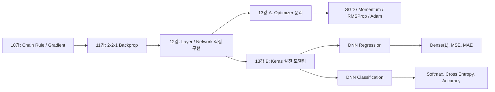

# 2026-05-28 ML 13강: Deep Neural Networks, Keras, and Optimizers

> **세션 상태:** 13강 전체 자료를 하나의 강의 흐름으로 통합한 최종 강의록.
> **직전 연결:** 12강에서 직접 구현한 `Layer`, `Dense`, `ReLU`, `SoftmaxCE`, `Network` 구조를 오늘은 두 방향으로 확장한다. 첫째, optimizer를 별도 객체로 분리해 SGD, Momentum, RMSProp, Adam을 비교한다. 둘째, Keras의 `Sequential`, `Dense`, `compile`, `fit`, `evaluate` 흐름으로 실제 회귀·분류 모델을 만든다.

---

## 개념 그래프 브리핑

13강의 핵심은 "직접 구현한 신경망"을 "실전 딥러닝 모델링"으로 연결하는 것이다. 12강에서는 각 층이 `forward`, `backward`, `update`를 모두 책임졌다. 오늘은 이 구조를 한 단계 더 나눈다. `Layer`는 순전파·역전파와 gradient 계산을 책임지고, `Optimizer`는 파라미터를 어떤 규칙으로 움직일지 책임진다. 이 분리가 있어야 SGD에서 Momentum, RMSProp, Adam으로 자연스럽게 확장된다.

동시에 오늘은 Keras로 실제 문제를 푼다. 회귀 문제에서는 주택 가격 같은 연속값을 예측하므로 출력층은 activation이 없는 `Dense(1)`이고, 손실은 MSE, 지표는 MAE가 된다. 분류 문제에서는 손글씨 숫자를 10개 클래스 중 하나로 예측하므로 마지막 층은 `Dense(10, activation='softmax')`이고, 손실은 sparse categorical cross entropy, 지표는 accuracy가 된다.

12강과 13강의 연결점은 단순히 "직접 구현에서 라이브러리 사용으로 넘어간다"가 아니다. 더 정확히는 **신경망을 구성하는 책임 단위를 어디까지 분리할 것인가**의 문제다. 12강은 chain rule을 layer 단위로 분리했다. `Dense`는 자기 파라미터의 gradient를 계산하고, `ReLU`는 자기 local gradient만 적용하며, `Network`는 이 층들을 순서대로 연결했다. 13강은 그다음 단계로, 파라미터를 **어떻게 움직일지**까지 layer에서 떼어낸다. 이때부터 optimizer는 독립된 설계 대상이 된다.

이 연결을 이해하면 Keras도 갑자기 등장한 문법이 아니다. Keras의 `Sequential`은 12강의 `Network`와 같은 컨테이너이고, Keras의 `Dense`는 12강의 `Dense`와 같은 선형변환 layer이며, Keras의 `compile`은 "loss와 optimizer를 붙이는 단계"다. 12강에서 내부 부품을 직접 만들었다면, 13강은 그 부품들이 실제 프레임워크에서 어떤 이름과 절차로 제공되는지 확인하는 강의다.



---

## 강의 현황

| 강 | 핵심 주제 | 오늘과의 연결 |
|----|-----------|---------------|
| 10강 | 미분·편미분·그래디언트·Chain Rule | backprop과 optimizer가 쓰는 수학 도구 |
| 11강 | 2-2-1 MLP Backprop | 작은 네트워크에서 gradient 계산을 손으로 확인 |
| 12강 | Layer abstraction·vectorized backprop | 임의 깊이 네트워크를 직접 구현 |
| **13강** | **DNN 회귀·분류·optimizer** | **직접 구현 구조를 Keras와 optimizer 설계로 확장** |

---

## 이전 강의와 본 강의의 연결

### 연결 1: 11강의 backprop은 12강에서 layer가 되었고, 13강에서 framework가 된다

11강에서는 2-2-1 MLP의 가중치 9개를 대상으로 \(\partial L/\partial W\)를 직접 따라갔다. 그때 중요한 패턴은 아래였다.

\[
\delta^{(l)} = (W^{(l+1)})^\top \delta^{(l+1)} \odot f'(z^{(l)})
\]

\[
\frac{\partial L}{\partial W^{(l)}} = (\delta^{(l)})^\top a^{(l-1)}
\]

12강은 이 패턴을 `Dense.backward`, `ReLU.backward`, `SoftmaxCE.backward` 같은 메서드로 나누었다. 즉, 수식을 외우는 대신 각 객체가 자기 몫의 local gradient를 계산하게 했다. 13강에서는 같은 구조를 Keras가 대신 실행한다. `model.fit` 한 줄 안에는 11강에서 손으로 계산한 chain rule과 12강에서 직접 구현한 layer loop가 모두 들어 있다.

| 흐름 | 관점 | 핵심 질문 |
|------|------|-----------|
| 11강 | 수식 전개 | 각 파라미터의 gradient는 어떻게 생기는가? |
| 12강 | 코드 구조 | gradient 계산을 layer 단위로 어떻게 나누는가? |
| 13강 | 모델링 설계 | 문제 유형에 맞게 layer, loss, metric, optimizer를 어떻게 고르는가? |

### 연결 2: 12강의 `update(lr)`는 13강의 optimizer로 분리된다

12강에서 `Dense.update(lr)`는 매우 단순했다.

```python
self.W -= lr * self.dW
self.b -= lr * self.db
```

이 코드는 "gradient 반대 방향으로 조금 움직인다"는 기본 원리를 잘 보여준다. 하지만 여기에는 한계가 있다. 실제 딥러닝 학습에서는 같은 gradient라도 상황에 따라 다르게 움직여야 한다. 골짜기 지형에서는 한 방향으로 진동이 심하고, 다른 방향으로는 너무 느리게 움직인다. local minimum 근처에서는 이전 이동 방향의 관성이 도움이 될 수 있다. gradient 크기가 feature나 layer마다 크게 다르면 차원별 step 조절이 필요하다.

그래서 13강에서는 아래 질문으로 넘어간다.

| 12강 질문 | 13강 질문 |
|-----------|-----------|
| gradient를 어떻게 계산하는가? | 계산된 gradient로 어떻게 움직이는가? |
| layer가 자기 파라미터를 어떻게 update하는가? | optimizer가 모든 파라미터를 어떤 규칙으로 update하는가? |
| SGD 한 가지 update면 충분한가? | Momentum, RMSProp, Adam은 왜 필요한가? |

이 관점 전환이 중요하다. 12강이 **미분 계산의 구조화**라면, 13강 optimizer 파트는 **학습 동역학의 구조화**다.

### 연결 3: 12강의 MNIST 직접 구현은 13강의 Keras MNIST로 이어진다

12강 후반에는 직접 만든 `Network`, `Dense`, `ReLU`, `SoftmaxCE`로 Iris나 MNIST 같은 분류 문제를 처리했다. 핵심은 파라미터 수가 커져도 학습 루프가 변하지 않는다는 점이었다.

```text
Data -> Network.forward -> Loss.forward
     -> Loss.backward -> Network.backward -> Network.update
```

13강에서 Keras를 쓰면 이 구조가 아래처럼 압축된다.

```text
Data -> model.fit(...)
```

하지만 내부 개념은 사라지지 않는다. `Flatten`은 28x28 이미지를 784차원 벡터로 바꾸는 입력 형태 조정이고, `Dense(256, relu)`는 12강의 `Dense + ReLU` 조합이며, `Dense(10, softmax)`는 다중분류 출력층이다. `sparse_categorical_crossentropy`는 정수 label을 쓰는 cross entropy다. 즉, 13강의 Keras MNIST는 12강의 직접 구현 MNIST를 실전 API로 옮긴 것이다.

### 연결 4: 회귀와 분류는 같은 DNN이지만 마지막 설계가 다르다

12강까지는 네트워크 구조와 backprop 자체가 중심이었다. 13강은 여기서 한 단계 더 실전적으로 묻는다. **같은 DNN이라도 문제 유형이 바뀌면 마지막 층, loss, metric은 어떻게 바뀌는가?**

| 문제 유형 | 출력의 의미 | 마지막 층 | loss | metric |
|-----------|-------------|-----------|------|--------|
| 회귀 | 연속값 하나 | activation 없는 `Dense(1)` | MSE | MAE |
| 다중분류 | 클래스 확률분포 | `Dense(K, softmax)` | Cross Entropy | Accuracy |

이 표가 본 강의의 중심이다. 깊은 신경망이라는 큰 틀은 같지만, 출력값을 무엇으로 해석할지에 따라 마지막 설계가 달라진다.

---

## 목차

1. [Deep Neural Network의 의미](#1-deep-neural-network의-의미)
2. [12강 코드에서 13강 코드로: 책임 분리](#2-12강-코드에서-13강-코드로-책임-분리)
3. [Optimizer가 필요한 이유](#3-optimizer가-필요한-이유)
4. [SGD, Momentum, RMSProp, Adam](#4-sgd-momentum-rmsprop-adam)
5. [Keras 모델링의 공통 절차](#5-keras-모델링의-공통-절차)
6. [DNN 회귀: 주택 가격 예측](#6-dnn-회귀-주택-가격-예측)
7. [회귀 모델 구조와 손실 함수](#7-회귀-모델-구조와-손실-함수)
8. [DNN 분류: 손글씨 숫자 인식](#8-dnn-분류-손글씨-숫자-인식)
9. [Softmax와 Cross Entropy](#9-softmax와-cross-entropy)
10. [학습 곡선, 검증, 과적합](#10-학습-곡선-검증-과적합)
11. [오늘의 핵심 정리](#11-오늘의-핵심-정리)

---

## 1. Deep Neural Network의 의미

딥러닝에서 "deep"은 신경망의 **층 깊이**를 뜻한다. 입력층과 출력층을 포함해 여러 층이 쌓이면, 단순 선형 모델보다 복잡한 비선형 관계를 표현할 수 있다.

| 구분 | 의미 |
|------|------|
| Neural Network | 입력과 출력을 층 구조로 연결한 모델 |
| Deep Neural Network | hidden layer가 여러 개 있는 신경망 |
| Machine Learning | 사람이 feature engineering을 많이 담당하는 경우가 많음 |
| Deep Learning | feature extraction의 상당 부분을 모델이 학습 |

딥러닝은 feature extraction을 자동화하고 큰 데이터셋과 비정형 데이터에 강하다. 하지만 층을 많이 쌓는다고 항상 좋은 모델이 되는 것은 아니다. 데이터 크기, 입력 scale, optimizer, epoch, validation 성능, overfitting을 함께 봐야 한다.

---

## 2. 12강 코드에서 13강 코드로: 책임 분리

12강의 직접 구현 구조는 Keras의 `Sequential`과 같은 사고방식이었다.

```python
net = Network()
net.add(Dense(784, 128))
net.add(ReLU())
net.add(Dense(128, 10))
loss_fn = SoftmaxCE()
```

여기서 `Network`는 층을 순서대로 저장하고, forward는 앞에서 뒤로, backward는 뒤에서 앞으로 실행한다.

| 구성 | 역할 |
|------|------|
| `Layer` | 모든 층의 공통 인터페이스 |
| `Dense` | \(Z = XW^\top + b\), 파라미터와 gradient 보유 |
| `ReLU`, `Sigmoid` | 파라미터 없는 activation |
| `SoftmaxCE` | softmax와 cross entropy를 결합한 분류 손실 |
| `Network` | 층을 순서대로 쌓고 forward/backward를 실행 |

12강 구조에서는 각 layer가 `update(lr)`까지 직접 갖고 있었다.

```python
class Dense(Layer):
    def update(self, lr):
        self.W -= lr * self.dW
        self.b -= lr * self.db
```

이 구조는 기본 SGD에는 충분하다. 하지만 Momentum처럼 이전 step의 velocity를 기억하거나, RMSProp처럼 gradient 제곱 평균을 저장하거나, Adam처럼 1차·2차 모멘트를 모두 저장하려면 문제가 생긴다. 그 상태를 `Dense` 안에 넣으면 층의 정의와 갱신 규칙이 섞인다.

13강의 개선은 책임 분리다.

| 책임 | 12강 | 13강 |
|------|------|------|
| forward/backward | Layer | Layer |
| gradient 보관 | Layer | Layer |
| 파라미터 갱신 | Layer의 `update` | Optimizer의 `step` |
| optimizer 교체 | layer 코드를 바꿔야 함 | optimizer 객체만 바꿈 |

새 구조에서 layer는 자기 파라미터와 gradient를 알려주기만 한다.

```python
def params_and_grads(self):
    return [(self.W, self.dW), (self.b, self.db)]
```

optimizer는 모든 layer를 순회하며 파라미터를 갱신한다.

```python
class Optimizer:
    def step(self, net):
        for layer in net.layers:
            for param, grad in layer.params_and_grads():
                self._update(param, grad)
```

이제 학습 루프의 핵심은 아래처럼 바뀐다.

```python
pred = net.forward(X_batch)
loss = loss_fn.forward(pred, Y_batch)
grad = loss_fn.backward()
net.backward(grad)
optimizer.step(net)
```

이 한 줄 차이, 즉 `net.update(lr)`에서 `optimizer.step(net)`으로의 이동이 13강 optimizer 수업의 중심이다.

여기서 중요한 것은 코드가 더 복잡해졌다는 점이 아니라, 복잡성이 제자리를 찾았다는 점이다. `Dense` 안에 Momentum의 velocity, RMSProp의 squared gradient, Adam의 \(m,v,t\) 상태를 모두 넣으면 `Dense`는 더 이상 "선형변환 layer"가 아니다. 선형변환도 하고, gradient도 계산하고, optimizer 상태도 관리하는 비대한 객체가 된다. 반대로 `Dense`가 `params_and_grads`만 제공하면, layer는 수학적 변환과 gradient 계산에 집중하고 optimizer는 갱신 규칙에 집중한다.

이 분리는 실제 프레임워크의 설계와도 맞다. Keras에서 `model.compile(optimizer='adam', loss='mse')`라고 쓸 수 있는 이유는 모델 구조와 optimizer가 분리되어 있기 때문이다. 같은 모델에 `adam`을 붙일 수도 있고, `sgd`를 붙일 수도 있다. 13강의 직접 구현 optimizer 실습은 바로 이 framework 설계를 작은 코드로 재현하는 과정이다.

| 설계 수준 | 직접 구현에서의 표현 | Keras에서의 표현 |
|-----------|----------------------|------------------|
| 모델 구조 | `Network.add(Dense(...))` | `Sequential([...])` 또는 `model.add(...)` |
| 층의 계산 | `layer.forward`, `layer.backward` | 각 Keras layer 내부 구현 |
| 손실 함수 | `MSELoss`, `SoftmaxCE` | `loss='mse'`, `loss='sparse_categorical_crossentropy'` |
| optimizer | `SGD`, `Momentum`, `RMSProp`, `Adam` 객체 | `optimizer='adam'` 등 |
| 학습 루프 | 직접 `fit` 함수 | `model.fit(...)` |

따라서 13강의 두 갈래, 즉 optimizer 직접 구현과 Keras 모델링은 서로 다른 내용이 아니다. 하나는 내부 설계 원리를 보는 파트이고, 다른 하나는 같은 원리가 라이브러리에서 어떻게 쓰이는지 보는 파트다.

---

## 3. Optimizer가 필요한 이유

Gradient descent의 기본 아이디어는 단순하다.

\[
\theta \leftarrow \theta - \eta \nabla L
\]

여기서 \(\eta\)는 learning rate다. 너무 작으면 안정적이지만 느리고, 너무 크면 빠르지만 진동하거나 발산할 수 있다. 실제 신경망의 손실 표면은 방향마다 곡률이 다르다. 어떤 방향은 매우 가파르고, 어떤 방향은 평탄하다. 이때 하나의 learning rate만 쓰면 딜레마가 생긴다.

| 상황 | 큰 learning rate | 작은 learning rate |
|------|------------------|--------------------|
| 가파른 방향 | overshoot, 진동 | 안정적 |
| 평탄한 방향 | 빠르게 이동 | 너무 느림 |

또 다른 문제는 local minimum과 saddle point다. 출발점에 따라 얕은 골짜기에 갇히거나, 평평한 구간에서 진행이 느려질 수 있다. 그래서 optimizer는 단순히 "gradient를 빼는 함수"가 아니라, **어떤 방향으로 얼마나 움직일지 조절하는 전략**이다.

---

## 4. SGD, Momentum, RMSProp, Adam

### 4.1 SGD

SGD는 mini-batch에서 계산한 gradient로 파라미터를 갱신한다.

\[
\theta \leftarrow \theta - \eta g
\]

| 장점 | 단점 |
|------|------|
| 단순하고 메모리를 적게 사용 | learning rate에 민감 |
| mini-batch noise가 local minimum 탈출에 도움 가능 | 골짜기 지형에서 진동 |
| 구현과 해석이 쉬움 | 평탄한 방향으로 느리게 수렴 |

### 4.2 Momentum

Momentum은 이전 갱신 방향을 velocity로 저장한다.

\[
v \leftarrow \mu v - \eta g
\]

\[
\theta \leftarrow \theta + v
\]

직관은 관성이다. 지그재그로 흔들리는 방향은 서로 상쇄되고, 꾸준히 내려가는 방향은 누적된다. 그래서 골짜기 지형에서 진동을 줄이고 더 빠르게 진행할 수 있다.

```python
self.v[key] = self.mu * self.v[key] - self.lr * grad
param += self.v[key]
```

### 4.3 RMSProp

RMSProp은 gradient 제곱의 이동평균을 저장해 차원별 step 크기를 다르게 만든다.

\[
s \leftarrow \rho s + (1-\rho)g^2
\]

\[
\theta \leftarrow \theta - \eta \frac{g}{\sqrt{s}+\epsilon}
\]

자주 큰 gradient가 나오는 방향은 \(s\)가 커져 step이 작아진다. gradient가 작게 나오는 방향은 상대적으로 step이 커진다. 그래서 가파른 방향과 평탄한 방향이 섞인 손실 표면에서 SGD보다 안정적이다.

```python
self.s[key] = self.rho * self.s[key] + (1 - self.rho) * (grad ** 2)
param -= self.lr * grad / (np.sqrt(self.s[key]) + self.eps)
```

### 4.4 Adam

Adam은 Momentum과 RMSProp을 결합한다. \(m\)은 gradient의 이동평균, \(v\)는 gradient 제곱의 이동평균이다.

\[
m \leftarrow \beta_1 m + (1-\beta_1)g
\]

\[
v \leftarrow \beta_2 v + (1-\beta_2)g^2
\]

\[
\hat{m}=\frac{m}{1-\beta_1^t},\quad \hat{v}=\frac{v}{1-\beta_2^t}
\]

\[
\theta \leftarrow \theta - \eta \frac{\hat{m}}{\sqrt{\hat{v}}+\epsilon}
\]

Adam은 방향 누적과 차원별 step 조절을 동시에 사용한다. 그래서 첫 실험에서 기본 선택지로 자주 쓰인다. 단, 항상 최종 일반화 성능이 최고라는 뜻은 아니다. 더 좋은 성능을 짜내야 하는 상황에서는 SGD+Momentum과 learning rate scheduling도 비교한다.

### 4.5 Optimizer 비교 요약

| Optimizer | 핵심 아이디어 | 강점 | 약점 |
|-----------|---------------|------|------|
| SGD | \(\theta-\eta g\) | 단순, 메모리 적음 | 진동, 느림, learning rate 민감 |
| Momentum | velocity 누적 | 진동 감소, 골짜기 통과 | momentum과 lr 튜닝 필요 |
| RMSProp | gradient 제곱 평균으로 차원별 조절 | 가파른/평탄한 방향 자동 보정 | momentum 효과 없음 |
| Adam | Momentum + RMSProp | 안정적, lr에 비교적 둔감 | 상태 메모리 증가, 항상 최종 최선은 아님 |

---

## 5. Keras 모델링의 공통 절차

Keras는 직접 구현한 `Network`를 더 높은 수준에서 제공한다. 핵심 흐름은 세 단계다.

```python
model = keras.Sequential([...])
model.compile(optimizer='adam', loss='...', metrics=['...'])
history = model.fit(X_train, y_train, validation_data=(X_val, y_val), epochs=...)
```

| 코드 | 질문 | 답 |
|------|------|----|
| `Sequential` / `add` | 모델 구조는 무엇인가? | 층 수, 뉴런 수, activation |
| `compile` | 어떻게 학습할 것인가? | optimizer, loss, metric |
| `fit` | 어떤 데이터로 반복 학습할 것인가? | epoch, batch size, validation |
| `evaluate` | 학습에 쓰지 않은 데이터에서 어떤가? | test loss, test metric |

전체 모델링 절차는 아래처럼 정리된다.

| 단계 | 역할 |
|------|------|
| Import | 필요한 패키지 불러오기 |
| Data preparing | 입력 \(X\)와 타깃 \(y\) 구성 |
| EDA | shape, histogram, correlation, sample image 확인 |
| Preprocessing | train/test split, scaling, normalization |
| Modeling | model 구조 정의, compile, fit |
| Validation/Test | 학습 곡선, metric, 예측값 비교 |

Keras는 원리를 숨기는 도구가 아니다. 직접 구현했던 `forward → loss → backward → update` 루프를 안정적인 API로 감싼 것이다.

---

## 6. DNN 회귀: 주택 가격 예측

첫 번째 실전 문제는 여러 입력 변수로 주택 가격을 예측하는 회귀다. 데이터는 506개 샘플과 13개 변수를 갖고, 실습에서는 이산적인 성격이 강한 변수를 제외해 12개 feature를 입력으로 사용한다.

> **주의:** 이 데이터셋은 윤리적 이슈가 알려져 있어 실제 의사결정이나 production 모델에는 권장되지 않는다. 여기서는 DNN 회귀 모델링 절차를 설명하기 위한 교육용 예제로만 사용한다.

| 구분 | 내용 |
|------|------|
| 입력 | 주택 가격에 영향을 줄 수 있는 여러 feature |
| 출력 | 주택 가격 |
| 문제 유형 | 회귀 |
| 출력층 | `Dense(1)` |
| 출력 activation | 없음 |

회귀에서 마지막 activation을 두지 않는 이유는 예측값이 확률이 아니기 때문이다. `sigmoid`는 0과 1 사이로 값을 제한하고, `softmax`는 여러 클래스 확률의 합을 1로 만든다. 집값 같은 연속값 예측에는 맞지 않는다.

EDA에서는 타깃값 histogram과 feature 간 correlation heatmap을 확인한다. 신경망은 복잡한 비선형성을 학습할 수 있지만, 입력 분포와 scale을 확인하지 않으면 loss curve를 해석하기 어렵다.

---

## 7. 회귀 모델 구조와 손실 함수

회귀 모델은 세 개의 hidden layer와 하나의 출력층으로 구성된다.

```python
model = Sequential()
model.add(Dense(60, activation='relu', input_shape=(12,)))
model.add(Dense(60, activation='relu'))
model.add(Dense(30, activation='relu'))
model.add(Dense(1))
```

| 층 | 역할 | 출력 크기 |
|----|------|-----------|
| 첫 번째 Dense | 12개 feature를 60차원 표현으로 변환 | 60 |
| 두 번째 Dense | 비선형 표현 추가 학습 | 60 |
| 세 번째 Dense | 더 압축된 hidden representation | 30 |
| 출력 Dense | 연속값 하나 예측 | 1 |

hidden layer의 activation은 ReLU다.

\[
\operatorname{ReLU}(x)=\max(0,x)
\]

ReLU는 양수 영역에서 gradient를 그대로 통과시키므로 sigmoid보다 깊은 네트워크에서 학습이 안정적이다.

회귀 모델은 MSE를 loss로, MAE를 metric으로 사용한다.

```python
model.compile(
    optimizer='adam',
    loss='mse',
    metrics=['mae']
)
```

\[
\mathrm{MSE}=\frac{1}{n}\sum_{i=1}^{n}(y_i-\hat{y}_i)^2
\]

\[
\mathrm{MAE}=\frac{1}{n}\sum_{i=1}^{n}|y_i-\hat{y}_i|
\]

MSE는 큰 오차를 강하게 벌하기 때문에 학습 목적함수로 적합하다. MAE는 실제 단위에서 평균적으로 얼마나 틀렸는지 해석하기 쉬워 성능 지표로 적합하다.

전처리에서는 입력과 타깃을 모두 MinMax scaling한다. 중요한 점은 scaler를 training data에만 `fit`하고, test data에는 `transform`만 한다는 것이다. test data 정보를 preprocessing 단계에서 학습에 섞으면 data leakage가 된다.

학습 후에는 `loss`와 `val_loss`, `mae`와 `val_mae`를 함께 본다.

| 관찰 | 의미 |
|------|------|
| train loss와 validation loss가 함께 감소 | 학습이 안정적으로 진행 |
| train loss만 감소하고 validation loss 증가 | overfitting 가능성 |
| 둘 다 거의 감소하지 않음 | 모델 구조, learning rate, scaling 점검 |

---

## 8. DNN 분류: 손글씨 숫자 인식

두 번째 실전 문제는 28x28 grayscale 손글씨 이미지를 0부터 9까지의 숫자로 분류하는 것이다.

| 항목 | 내용 |
|------|------|
| 입력 | 28x28 grayscale image |
| 픽셀 범위 | 0-255 |
| 클래스 수 | 10 |
| 문제 유형 | 다중분류 |
| 출력 | 클래스별 확률분포 |

이미지 한 장은 원래 2차원 행렬이다. Dense layer에 넣기 위해 먼저 1차원 벡터로 펼친다.

\[
28 \times 28 = 784
\]

분류 모델은 아래 구조다.

```python
model = keras.Sequential([
    keras.layers.Flatten(input_shape=(28, 28)),
    keras.layers.Dense(256, activation='relu'),
    keras.layers.Dense(10, activation='softmax')
])
```

| 층 | 역할 | 출력 |
|----|------|------|
| `Flatten` | 28x28 이미지를 길이 784 벡터로 변환 | 784 |
| `Dense(256, relu)` | 이미지 feature를 hidden representation으로 변환 | 256 |
| `Dense(10, softmax)` | 10개 클래스 확률 출력 | 10 |

픽셀값은 0-255에서 0-1로 정규화한다.

```python
train_images, test_images = train_images / 255, test_images / 255
```

정규화는 gradient update를 안정화한다. 입력 scale이 너무 크면 학습 초기에 loss와 gradient가 불안정해질 수 있다.

---

## 9. Softmax와 Cross Entropy

다중분류의 마지막 층은 클래스 수만큼 logit을 낸다. softmax는 이 logit을 확률분포로 바꾼다.

\[
\operatorname{softmax}(z_i)=\frac{e^{z_i}}{\sum_{j=1}^{K}e^{z_j}}
\]

| 값 | 의미 |
|----|------|
| \(K\) | 클래스 수 |
| \(z_i\) | 클래스 \(i\)의 logit |
| softmax output | 클래스별 예측 확률 |

Cross entropy는 정답 분포 \(p\)와 예측 분포 \(q\)의 차이를 loss로 측정한다.

\[
H(p,q)=-\sum_i p_i \log q_i
\]

정답이 one-hot이면 실제로는 정답 클래스의 예측 확률만 본다. 정답 클래스 확률이 높으면 loss가 작고, 낮으면 loss가 크다.

Keras에서 label이 one-hot 벡터가 아니라 정수 class label이면 `sparse_categorical_crossentropy`를 쓴다.

```python
model.compile(
    optimizer='adam',
    loss='sparse_categorical_crossentropy',
    metrics=['accuracy']
)
```

| 손실 함수 | label 형태 |
|-----------|------------|
| `categorical_crossentropy` | one-hot label |
| `sparse_categorical_crossentropy` | 정수 class label |

학습에서는 training data 일부를 validation set으로 분리하고, train loss/accuracy와 validation loss/accuracy를 함께 기록한다.

---

## 10. 학습 곡선, 검증, 과적합

딥러닝 모델은 training 성능만 보면 안 된다. 중요한 것은 학습에 쓰지 않은 데이터에서도 성능이 유지되는가다.

| 패턴 | 해석 |
|------|------|
| train/validation loss가 함께 감소 | 일반화 가능성이 좋음 |
| train loss 감소, validation loss 증가 | overfitting 가능성 |
| train accuracy 상승, validation accuracy 정체 | train data에 과적합 |
| loss가 거의 줄지 않음 | learning rate, optimizer, scaling, 모델 구조 점검 |

성능 개선 방법은 여러 가지가 있다.

| 방법 | 기대 효과 | 주의 |
|------|-----------|------|
| hidden layer 증가 | 더 복잡한 함수 표현 | overfitting, 학습 시간 증가 |
| epoch 증가 | 충분한 반복 학습 | 너무 많으면 validation 성능 악화 |
| training data 증가 | 일반화 성능 개선 | 데이터 품질도 중요 |
| hyperparameter tuning | batch size, learning rate, layer width 조정 | validation 기준 비교 필요 |
| optimizer 변경 | 수렴 속도와 안정성 개선 | 최종 성능은 별도 검증 필요 |

optimizer 비교 실험에서는 같은 데이터, 같은 초기 가중치, 같은 epoch 수로 비교해야 공정하다. 쉬운 데이터셋에서는 최종 정확도가 비슷해도 loss curve를 보면 수렴 속도 차이가 드러난다.

---

## 11. 오늘의 핵심 정리

### 11.1 직접 구현에서 프레임워크로

| 직접 구현 개념 | Keras 대응 | 의미 |
|----------------|------------|------|
| `Network` | `Sequential` | 층을 순서대로 쌓는 컨테이너 |
| `Dense.forward` | `Dense(...)` | 선형변환 |
| `ReLU` | `activation='relu'` | hidden layer 비선형성 |
| `SoftmaxCE` | softmax + cross entropy loss | 다중분류 학습 |
| 직접 학습 루프 | `fit` | forward/loss/backward/update 반복 |
| 직접 평가 | `evaluate` | test loss와 metric 계산 |

### 11.2 회귀와 분류의 설계 차이

| 구분 | 회귀 DNN | 분류 DNN |
|------|----------|----------|
| 예측 대상 | 연속값 | 클래스 |
| 출력층 | activation 없는 `Dense(1)` | `Dense(K, softmax)` |
| 대표 loss | MSE | Cross entropy |
| 대표 metric | MAE | Accuracy |
| 전처리 | feature/target scaling | pixel normalization, flatten |

### 11.3 Optimizer의 의미

| Optimizer | 한 줄 요약 |
|-----------|------------|
| SGD | gradient 반대 방향으로 이동 |
| Momentum | 이전 이동 방향을 누적해 진동을 줄임 |
| RMSProp | 차원별 gradient 크기에 따라 step을 조절 |
| Adam | Momentum과 RMSProp을 결합 |

13강의 결론은 세 가지다.

1. 딥러닝 모델링은 **문제 유형**에서 출발한다. 회귀인지 분류인지에 따라 출력층, loss, metric이 달라진다.
2. Keras는 새로운 원리가 아니라, 12강에서 직접 구현한 `Layer → forward → loss → backward → update` 구조의 고수준 API다.
3. optimizer는 단순한 옵션이 아니라 학습 궤적을 바꾸는 핵심 설계 요소다. 같은 모델과 같은 데이터라도 SGD, Momentum, RMSProp, Adam은 수렴 속도와 안정성이 다르다.

### 11.4 다음 강의로 넘어가는 질문

13강까지 오면 신경망 학습의 기본 골격은 갖춰졌다.

```text
모델 구조 선택 -> loss 선택 -> optimizer 선택 -> fit -> validation 해석
```

다음으로 자연스럽게 생기는 질문은 다음과 같다.

| 질문 | 왜 중요한가 |
|------|-------------|
| hidden layer를 얼마나 깊게/넓게 잡을 것인가? | 표현력과 overfitting 사이의 균형 |
| learning rate를 어떻게 조정할 것인가? | optimizer 성능은 learning rate와 함께 결정됨 |
| validation loss가 오르면 무엇을 바꿀 것인가? | dropout, regularization, early stopping, data augmentation으로 연결 |
| Dense만으로 이미지 분류가 충분한가? | CNN으로 넘어가는 동기 |
| 직접 구현에서는 backward를 손으로 썼는데 프레임워크는 어떻게 처리하는가? | autograd와 computation graph로 연결 |

즉, 13강은 끝점이 아니라 전환점이다. 10-12강에서 "신경망은 어떻게 학습되는가"를 내부에서 봤다면, 13강은 "그 원리를 가지고 실제 문제를 어떻게 설계하고 검증하는가"로 넘어간다. 이 전환을 이해해야 이후 CNN, regularization, advanced optimizer, hyperparameter tuning이 단순한 기능 목록이 아니라 같은 학습 구조 위의 확장으로 보인다.
