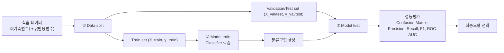

# 2026-04-09 ML 6강: Classification (Iris, KNN, SVM, Decision Tree)

> 제공된 PDF 전체 텍스트를 기준으로 6강 슬라이드 흐름을 강의 노트 형태로 재구성함.

## 심층 인텔리전스 브리핑

이번 6강의 목표는 "모델 이름 소개"가 아니라, **분류 파이프라인 전체를 의사결정 관점에서 운용할 수 있게 만드는 것**이다.
핵심은 EDA/전처리/분할/학습/평가/최종선택을 하나의 시스템으로 묶고, 각 단계에서 발생하는 오류를 다음 단계에서 어떻게 제어하는지 연결하는 데 있다.
학생이 최종적으로 가져가야 할 역량은 세 가지다: (1) 데이터-모델-지표의 인과적 연결 이해, (2) 모델별 과적합 패턴 식별, (3) 운영 제약(FP/FN 비용) 기반 임계값/모형 선택.
따라서 본 강의록은 섹션마다 동일한 프레임(개념 -> 수식 -> 추론 -> 과적합 신호 -> 실전 규칙)으로 재정렬해, "외우는 강의"가 아닌 "판단하는 강의"로 설계한다.

## 강의 현황 (포인터)
- **1강** `20250306.md` - ML 개요, 지도학습, 선형회귀, 경사하강법
- **2강** `20250313.md` - 분류 도입, 로지스틱 회귀, 나이브 베이즈
- **3강** `20250319.md` - Python 라이브러리, NumPy
- **4강** `20250326.md` - Pandas, EDA
- **6강** 본 문서 `20260409.md` - Classification 심화

---

## 목차
- [심층 인텔리전스 브리핑](#심층-인텔리전스-브리핑)
0. [요청 반영: 분류 모델링 전체 흐름](#0-요청-반영-분류-모델링-전체-흐름)
1. [데이터 기반 분석 유형과 Classification 위치](#1-데이터-기반-분석-유형과-classification-위치)
2. [Iris 데이터셋으로 보는 분류 기본 구조](#2-iris-데이터셋으로-보는-분류-기본-구조)
3. [분류 학습 절차: Data split -> Train -> Test](#3-분류-학습-절차-data-split---train---test)
4. [K-NN 분류](#4-k-nn-분류)
5. [분류 성능 평가](#5-분류-성능-평가)
6. [Support Vector Machine (SVM)](#6-support-vector-machine-svm)
7. [Decision Tree](#7-decision-tree)
8. [Decision Tree에서 Ensemble로](#8-decision-tree에서-ensemble로)
9. [하이퍼파라미터 탐색과 교차검증](#9-하이퍼파라미터-탐색과-교차검증)
10. [수업 운영안과 체크포인트](#10-수업-운영안과-체크포인트)
11. [웹 그라운딩 적용](#11-웹-그라운딩-적용)
12. [최종모형 선택 프로토콜](#12-최종모형-선택-프로토콜)

---

## 0. 요청 반영: 분류 모델링 전체 흐름

요청하신 학습 순서를 표준 파이프라인으로 정리:

1. 데이터 파악(문제 정의, 클래스 정의)
2. EDA(분포, 결측, 이상치, 상관/관계 확인)
3. 전처리(결측치 처리, 인코딩, 스케일링)
4. 학습데이터 구성
5. 훈련/검증(필요 시 테스트) 데이터 분리
6. 분류기(classifier) 학습
7. 성능평가(정확도 + Precision/Recall/F1/ROC-AUC)
8. 최종모형 선택(오류비용/운영목표 기준)

핵심 개념:
- **예측변수(독립변수, feature, \(X\))**: 모델 입력 변수
- **반응변수(종속변수, target, \(y\))**: 클래스 라벨(범주형)
- **지도학습(supervised learning)**: 입력 \(X\)와 정답 \(y\)가 함께 주어진 데이터로 학습
- **분류기(classifier)**: 범주형 반응변수를 예측하는 모델

실무 규칙:
- 분할 시 `stratify=y`를 우선 고려(클래스 비율 보존)
- 전처리 `fit`은 train에서만 수행하고 validation/test에는 `transform`만 적용

---

## 0-1. 이미지 슬라이드 전사 도식화 (Iris Classification Flow)

슬라이드 핵심 문구 전사:
- 1) Data split
- 2) Model train
- 3) Model test
- 입력: 예측변수(꽃받침/꽃잎 길이, 너비)
- 출력: 반응변수(품종 종류, 범주형 클래스)

도식(강의용):

Iris 예시 매핑:
- \(X\): `sepal_length`, `sepal_width`, `petal_length`, `petal_width`
- \(y\): `species` (`setosa`, `versicolor`, `virginica`)

---

## 1. 데이터 기반 분석 유형과 Classification 위치

| 유형 | 설명 | 예시 |
|---|---|---|
| Classification | 미리 정의된 출력 클래스로 데이터를 분류 | 프로모션 반응 고객 분류 |
| Prediction (Regression) | 수치값 예측 | GDP 변화 기반 내년 매출 예측 |
| Association | 대규모 데이터 내 연관 관계 탐색 | 함께 구매되는 상품 탐색 |
| Clustering | 유사 특성 객체를 군집화 | 고객 세그먼트 도출 |

핵심:
- 분류는 "값 자체를 예측"하는 회귀와 달리 "범주(label)"를 예측한다.
- 지도학습의 대표 과제로, 정답 레이블이 있는 데이터를 사용한다.

심층 정리:
- 분류 문제는 단순히 "정답 맞히기"가 아니라, 의사결정 시스템에서 오탐(FP)/미탐(FN) 비용을 최소화하는 최적화 문제다.
- 실무에서는 모델 성능을 점수 하나로 끝내지 않고, 임계값 변화에 따른 운영지표(정밀도/재현율/알람량)를 함께 본다.
- 따라서 "어떤 분류기를 쓸지"보다 먼저 "무엇을 positive로 볼지, 어떤 오류를 더 나쁘게 볼지"를 정의해야 한다.

---

## 2. Iris 데이터셋으로 보는 분류 기본 구조

Iris 데이터:
- 3개 클래스, 각 50개 샘플
  - `Iris setosa`
  - `Iris versicolor`
  - `Iris virginica`
- 입력 변수(독립변수):
  1) sepal length
  2) sepal width
  3) petal length
  4) petal width
- 출력(종속변수): iris species (class)

분류 모델 관점:
\[
f(\text{sepal length}, \text{sepal width}, \text{petal length}, \text{petal width})
\rightarrow \text{iris species}
\]

추론 포인트:
- Iris는 다중분류(3-class) 기본 예제로, 선형 경계/비선형 경계를 비교하기 좋다.
- `petal` 관련 변수는 클래스 분리력이 큰 편이고, `sepal` 변수는 겹침이 상대적으로 크다.
- 같은 데이터라도 분할 랜덤시드, 스케일링, 모델별 inductive bias에 따라 혼동행렬 패턴이 달라진다.

---

## 3. 분류 학습 절차: Data split -> Train -> Test

슬라이드 핵심 절차:
1. Data split
2. Model train
3. Model test

권장 분할:
- Train / Validation / Test 분리
- 또는 학습 데이터 내 k-fold cross-validation 수행 후 최종 test 평가

주의:
- 전체 데이터로 전처리 fit 후 split하면 데이터 누수 위험
- split 이후 학습 세트 기준으로만 전처리 fit

심층 운영 규칙:
- 분류에서는 클래스 비율 보존을 위해 `stratify=y`를 기본값처럼 취급한다.
- 표준 절차:
  1) `X_train, X_test, y_train, y_test = train_test_split(..., stratify=y)`
  2) train 내부에서 교차검증으로 하이퍼파라미터 선택
  3) 고정된 test는 마지막 1회만 사용
- 데이터가 작을수록 단일 hold-out보다 stratified k-fold 평균 성능이 더 안정적이다.

---

## 4. K-NN 분류

### 4.1 개념
- K-Nearest Neighbors는 가장 단순한 지도학습 분류기 중 하나
- 새 샘플과 기존 샘플의 유사도(거리)를 기준으로 클래스 결정
- 학습 단계는 사실상 "데이터 저장", 예측 시점에 계산이 집중되는 lazy learner
- K-NN 알고리즘은 학습 단계에서 데이터셋을 저장해 두고, 새로운 데이터가 들어오면 가장 유사한 카테고리로 분류한다.

심층 해석:
- KNN은 "모형 파라미터를 크게 학습하는 방식"이 아니라 "학습 데이터를 기준점으로 저장해 두는 방식"이다.
- 따라서 train 단계는 가볍고, inference 단계에서 모든 거리 계산이 일어나므로 실시간 서비스에서는 latency를 반드시 점검해야 한다.
- KNN의 본질은 "결정경계 학습"이 아니라 "국소 이웃(local neighborhood)에서의 다수결"이다.

### 4.2 알고리즘 단계
1. 이웃 수 \(K\) 선택
2. 거리(주로 Euclidean) 계산
3. 가장 가까운 \(K\)개 이웃 선택
4. 클래스별 이웃 수 집계
5. 최다 득표 클래스로 예측

유사성 정의:
- K-NN에서 "유사성"은 일반적으로 좌표평면에서의 유클리디언 거리(Euclidean distance) 기준으로 정의한다.
- 거리가 가까울수록 더 유사한 데이터로 판단하며, 그 유사도를 바탕으로 최종 클래스를 결정한다.

거리 수식:
\[
d(\mathbf{x},\mathbf{x}_i)=\sqrt{\sum_{j=1}^{p}(x_j-x_{ij})^2}
\]

추론 포인트:
- 거리 기반 모델은 특성 스케일에 직접 영향받는다.
- 예를 들어 `height` 범위가 `ratio`보다 훨씬 크면, 모델은 사실상 `height`만 보고 이웃을 정할 수 있다.
- 그래서 KNN에서는 전처리(표준화/정규화)가 모델 성능의 일부다.

### 4.2-1. 가중치 기반 투표(Weighted KNN)

기본 KNN:
- 모든 이웃 동일 가중치(Uniform voting)

가중치 KNN:
- 가까운 이웃일수록 큰 가중치(예: \(w_i=\frac{1}{d_i+\epsilon}\))
- 클래스 점수:
\[
S(c)=\sum_{i \in \mathcal{N}_K(\mathbf{x})}w_i\cdot \mathbf{1}(y_i=c)
\]
- 최종 예측:
\[
\hat{y}=\arg\max_{c}S(c)
\]

해석:
- 같은 \(K\)라도, 경계 근처 샘플에서 uniform과 distance 가중치의 예측이 달라질 수 있다.
- 노이즈가 많은 데이터에서는 distance voting이 더 안정적일 때가 많다.

### 4.3 짝수 K 이슈
- K는 사람이 설정하는 하이퍼파라미터다.
- 이진분류에서는 보통 홀수 K를 선호한다.
- 이유: \(K=3,5,\dots\)처럼 홀수면 K개 최근접 이웃의 다수결에서 과반 클래스가 자연스럽게 결정되기 쉽다.
- \(K\)가 짝수면 동률 가능
- 가중치 거리 기반 투표(가까운 이웃에 더 큰 가중치)로 해소 가능
- 예: \[
w_1 + w_2 > w_3 + w_4
\]
  이면, 가중치 합이 더 큰 쪽(예: Class B)으로 분류한다.

동률이 생기는 이유와 해소:
- 짝수 K(예: 4, 6)에서는 클래스 표 수가 2:2처럼 같아질 수 있어 단순 다수결이 막힌다.
- 이때는 "개수" 대신 "거리(길이) 정보"를 추가해 결정한다.
- 즉, 각 클래스 이웃까지의 거리 합(또는 거리 역수 가중치 합)을 비교해 더 가까운 쪽 클래스를 선택한다.

실전 규칙:
- 이진 분류에서는 동률 회피를 위해 홀수 \(K\)를 우선 사용
- 다중 클래스에서는 동률이 여전히 가능하므로 거리 가중치를 같이 고려

### 4.3-1. K 값이 만드는 과소/과적합 패턴

- \(K\)가 너무 작음(예: 1, 3):
  - 학습 데이터의 국소 노이즈까지 따라감
  - 결정경계가 매우 들쭉날쭉 -> 고분산(과적합) 경향
- \(K\)가 너무 큼:
  - 지역적 구조를 무시하고 전체 다수 클래스 쪽으로 쏠림
  - 결정경계가 지나치게 매끈 -> 고편향(과소적합) 경향

따라서:
- \(K\)는 "작을수록 좋다/클수록 좋다"가 아니라 bias-variance trade-off 문제
- 검증셋 또는 cross-validation으로 선택해야 한다.

### 4.3-2. KNN 적합성/부적합성

적합한 경우:
- 특성 공간에서 "가까운 샘플끼리 같은 라벨"이라는 가정이 비교적 성립
- 데이터 크기가 중간 규모, 특징 차원이 지나치게 높지 않음
- 설명이 직관적이어야 하는 베이스라인 모델이 필요

주의가 필요한 경우:
- 고차원 데이터(차원의 저주): 모든 점의 거리가 비슷해져 이웃 개념이 약해짐
- 범주형 변수 처리 미흡: 거리 정의 자체가 부자연스러워짐
- 대규모 데이터: 예측 시 거리 계산 비용이 커져 응답속도 저하

### 4.3-3. 전처리 체크리스트 (KNN 필수)

1. 수치형 스케일링: `StandardScaler` 또는 `MinMaxScaler`
2. 범주형 인코딩: One-hot 등 적절한 변환
3. 이상치 점검: 거리 왜곡 여부 확인
4. 클래스 불균형: 단순 accuracy가 아닌 Precision/Recall/F1 확인
5. 하이퍼파라미터:
   - `n_neighbors`
   - `weights` (`uniform` vs `distance`)
   - `metric` (`minkowski`, `euclidean`, `manhattan`)

### 4.4 수업 예시
- Dachshund vs Jindo 분류
  - 특징: 몸길이(length), 몸높이(height)
  - 유사도 기반 분류를 직관적으로 시각화하기 좋음
- Iris 분류 실습
  - `n_neighbors=3` 등으로 간단 베이스라인 구성
  - confusion matrix로 결과 확인

강의용 추론 질문:
- "왜 같은 데이터인데 스케일링 전/후 KNN 성능이 크게 달라지는가?"
- "동일한 \(K\)에서 uniform과 distance 가중치의 오분류 패턴은 어떻게 다른가?"
- "validation에서 가장 좋은 \(K\)가 test에서도 항상 최선인가?"

### 4.5 왜 이렇게 되는가: 논리 연쇄(연역용)

KNN 의사결정은 아래 순서로 논리적으로 연결된다.

1. **문제 정의**
- 분류 목표는 입력 \(x\)에 대해 클래스 \(y\)를 예측하는 것
- 전제: "가까운 샘플은 같은 라벨일 가능성이 높다"(local smoothness 가정)

2. **거리 정의**
- 유사성을 수학적으로 정의해야 다수결이 가능해진다.
- 유클리디언 거리:
\[
d(\mathbf{x},\mathbf{x}_i)=\sqrt{\sum_{j=1}^{p}(x_j-x_{ij})^2}
\]
- 결론: 거리 정의가 곧 "무엇을 유사하다고 볼지"의 정책이다.

3. **K 선택**
- K가 작으면 국소 패턴에 민감(분산 증가), K가 크면 평균화 강함(편향 증가)
- 즉, K는 단순 숫자가 아니라 bias-variance를 직접 조절하는 노브다.

4. **투표 규칙**
- 홀수 K(이진분류)는 동률 회피에 유리
- 짝수 K 또는 다중분류 동률은 거리 가중치(혹은 거리합 비교)로 해소

5. **운영 결정**
- Accuracy가 같아도 FP/FN 비용이 다르면 최선 K/weights가 달라진다.
- 따라서 KNN의 "최적"은 통계 점수 + 운영비용의 동시 최적화다.

### 4.6 방법론 관점: 연구 근거와 해석

1) **이론적 정당성(고전)**
- Cover & Hart(1967): 최근접 이웃 규칙은 충분한 데이터에서 베이즈 최적오차 대비 상한이 존재하며, 단순한 규칙임에도 강한 기준선이 될 수 있음을 보였다.
- 강의 해석: "KNN이 단순해 보여도 baseline으로 가치가 있다"는 근거.

2) **고차원 한계(차원의 저주)**
- Beyer et al.(1999): 차원이 증가하면 최근접/최원거리 간 대비가 줄어 nearest neighbor의 의미가 약해질 수 있음을 보였다.
- 강의 해석: 피처가 많아질수록 KNN 성능이 자연히 좋아지는 것이 아니라, 오히려 거리 정보가 무뎌질 수 있다.

3) **K와 편향-분산**
- 통계학습 관점(ESL): K를 키우면 분산이 줄고 편향이 증가하는 전형적 trade-off가 나타난다.
- 강의 해석: "K=3이 좋다" 같은 고정값 암기가 아니라, 데이터 구조에 맞는 탐색이 필요.

### 4.7 도메인 적합성: 어디서 잘/안 맞는가

잘 맞는 도메인:
- 표 형태 수치 데이터에서 지역적 유사성이 강한 문제
- 설명 가능한 baseline이 필요한 초기 실험 단계
- 클래스 경계가 국소적으로 복잡하지만 데이터 규모가 중간 이하인 경우

주의 도메인:
- 고차원 희소 벡터(텍스트, 원-핫 고차원)에서 거리 대비가 약해질 수 있음
- 실시간 대규모 서빙(예측마다 거리 계산 비용 큼)
- 변수 스케일이 크게 다른 계측 도메인(스케일링 누락 시 의사결정 왜곡)

실전 방법론:
1. 스케일링/인코딩 포함 파이프라인 먼저 고정
2. `n_neighbors`와 `weights`를 CV로 탐색
3. 성능은 Accuracy 단독이 아니라 Precision/Recall/F1 함께 비교
4. 최종 선택은 운영 제약(허용 FP, 최소 Recall) 기준으로 임계값/모델 확정

### 4.8 교수자용 브리핑 스크립트(짧은 버전)

- "KNN은 학습으로 식을 찾는 모델이 아니라, 데이터 자체를 기억해 두었다가 주변 이웃의 다수결로 판단하는 모델입니다."
- "그래서 핵심은 두 가지입니다. 첫째, 유사성을 어떻게 정의할 것인가(거리). 둘째, 몇 명의 이웃 의견을 들을 것인가(K)."
- "K를 줄이면 노이즈까지 따라가 과적합, K를 늘리면 경계가 지나치게 매끈해 과소적합이 생깁니다. 결국 CV로 균형점을 찾습니다."
- "이진분류에서 홀수 K를 쓰는 이유는 동률을 피하기 위해서고, 짝수 K나 다중분류에서는 거리 가중치로 동률을 해소합니다."
- "마지막으로, 가장 높은 정확도 모델이 아니라 운영비용(FP/FN)을 가장 잘 만족하는 모델이 최종모형입니다."

---

## 5. 분류 성능 평가

### 5.1 혼동행렬의 네 요소
- TP (True Positive)
- TN (True Negative)
- FP (False Positive)
- FN (False Negative)

먼저 용어를 정확히 고정:
- **Positive / Negative**는 "맞았는지"가 아니라 **예측한 클래스 방향**(또는 실제 클래스 방향)을 뜻한다.
- **True / False**는 그 예측이 **실제값과 일치했는지 여부**를 뜻한다.

즉, 4칸은 다음처럼 해석한다.
- **TP**: Positive라고 예측했고 실제도 Positive (맞은 양성)
- **TN**: Negative라고 예측했고 실제도 Negative (맞은 음성)
- **FP**: Positive라고 예측했지만 실제는 Negative (양성 오탐)
- **FN**: Negative라고 예측했지만 실제는 Positive (양성 미탐)

레고 비유(홀수/짝수 bumps):
- 예: "odd면 Positive, even이면 Negative"로 규칙을 정했다고 하자.
- 모델이 odd라고 분류했는데 실제 odd면 TP.
- 모델이 odd라고 분류했는데 실제 even이면 FP.
- 모델이 even이라고 분류했는데 실제 odd면 FN.
- 모델이 even이라고 분류했는데 실제 even이면 TN.

왜 4칸으로 보나?
- 정확도 하나는 "전체 정답률"만 보여서, 어떤 오류(FP/FN)를 얼마나 냈는지 숨긴다.
- 현업에서는 FP와 FN의 비용이 다르므로, 오류 유형을 분리해 봐야 의사결정을 할 수 있다.

### 5.1-1. 왜 혼동행렬이 가장 중요한가 (고정 원칙)

핵심 선언:
- 지도학습 분류에서 결과를 "정답/오답 한 줄"로만 보면 모델의 성향을 놓친다.
- **혼동행렬(confusion matrix) 하나만 있어도** 모델의 경향성과 주요 지표를 모두 복원할 수 있다.

혼동행렬에서 바로 읽히는 것:
1. **오류 방향성**
   - FP가 많은지, FN이 많은지로 모델의 보수/공격 성향 파악
2. **클래스 편향**
   - 특정 클래스를 과도하게 양성/음성으로 예측하는지 확인
3. **운영 리스크**
   - 놓침(FN) 리스크 vs 헛경보(FP) 리스크를 분리 계산

혼동행렬에서 계산되는 지표(전부 파생):
\[
Accuracy=\frac{TP+TN}{TP+TN+FP+FN}
\]
\[
Precision=\frac{TP}{TP+FP},\quad Recall(=Sensitivity)=\frac{TP}{TP+FN}
\]
\[
Specificity=\frac{TN}{TN+FP},\quad
F1=\frac{2TP}{2TP+FP+FN}
\]

즉, Accuracy/F1/민감도/특이도는 따로 존재하는 값이 아니라,
모두 혼동행렬 4칸에서 나온다.

실전 규칙:
- 모델 평가 시작은 항상 "confusion matrix 먼저"로 고정한다.
- 그다음 지표를 계산해 해석한다.
- 지표가 좋아도 FP/FN 패턴이 도메인 위험과 맞지 않으면 모델을 교체하거나 threshold를 조정한다.

### 5.2 기본 지표
\[
\text{Accuracy}=\frac{TP+TN}{TP+FP+FN+TN}
\]
\[
\text{Sensitivity(Recall)}=\frac{TP}{TP+FN}
\]
\[
\text{Specificity}=\frac{TN}{TN+FP}
\]
\[
\text{Precision}=\frac{TP}{TP+FP}
\]
\[
F1 = 2\cdot\frac{\text{Precision}\cdot\text{Recall}}{\text{Precision}+\text{Recall}}
\]

### 5.2-1. 이미지 전사 기반 계산 예시 (Lego A~F)

슬라이드의 상황을 수치로 전사하면(실제 Positive 4개, 실제 Negative 6개 기준):

| 모델 | TP | TN | Accuracy | Sensitivity(Recall) | Specificity |
|---|---:|---:|---:|---:|---:|
| A | 4 | 6 | 100% | 100% | 100% |
| B | 4 | 0 | 40% | 100% | 0% |
| C | 0 | 6 | 60% | 0% | 100% |
| D | 2 | 6 | 80% | 50% | 100% |
| E | 4 | 4 | 80% | 100% | 66.6% |
| F | 2 | 4 | 60% | 50% | 66.6% |

핵심 해석:
- A와 E는 둘 다 Accuracy가 높아 보이지만, Specificity는 A=100%, E=66.6%로 다르다.
- B는 Sensitivity가 100%인데 Specificity가 0%다.
  -> Positive는 다 잡지만, Negative를 전부 Positive로 오탐하는 모델.
- C는 그 반대다. Specificity 100%지만 Sensitivity 0%.
  -> Negative는 잘 맞추지만 Positive를 전혀 못 잡는다.

즉, Accuracy만 보면 B(40%)와 C(60%), F(60%) 정도 차이만 보이지만,
실제로는 "어떤 오류를 내는 모델인지"가 완전히 다르다.

### 5.2-2. Specificity가 100%가 되는 구조

정의:
\[
\text{Specificity}=\frac{TN}{TN+FP}
\]

의미:
- "실제로 Negative인 샘플 중, 모델이 Negative로 맞춘 비율"
- 그래서 **FP가 0이면 Specificity는 100%**가 된다.

이미지 표에 바로 적용:
- 모델 D: \(TN=6\), \(FP=0\) -> \(\frac{6}{6+0}=1.0\) -> **100%**
- 모델 E: \(TN=4\), \(FP=2\) -> \(\frac{4}{4+2}=0.666...\) -> **66.6%**
- 모델 B: \(TN=0\), \(FP=6\) -> \(\frac{0}{0+6}=0\) -> **0%**

실무 번역:
- Specificity가 높다 = 불필요한 양성 판정(FP, 오탐)을 잘 줄인다.
- 따라서 오탐 비용이 큰 업무(수작업 검수, 과금 알림, 불필요 차단)에서 중요한 지표다.

정확도(Accuracy)를 "피악(파악)하는 방법":
- 1) 먼저 혼동행렬에서 \(TP, TN, FP, FN\)을 구한다.
- 2) 정확도 계산:
\[
Accuracy=\frac{TP+TN}{TP+TN+FP+FN}
\]
- 3) 정확도가 높아도 FP/FN 중 어떤 쪽이 큰지 반드시 같이 본다.

예시:
- 데이터 100개, 실제 Positive 10개/Negative 90개
- 모델이 전부 Negative로 예측하면 \(TN=90, FN=10, TP=0, FP=0\)
- Accuracy는 90%지만, Positive를 하나도 못 찾으므로 실무적으로 실패일 수 있다.

다중분류 확장:
- `micro` 평균: 전체 TP/FP/FN 총합 기준(빈도 높은 클래스 영향 큼)
- `macro` 평균: 클래스별 점수 단순 평균(소수 클래스 중요할 때 유리)
- `weighted` 평균: 클래스 support 가중 평균(불균형 데이터에서 자주 사용)

지표 선택 추론:
- Accuracy가 높은데 Recall이 낮다면 "대부분 negative로 찍는 모델"일 가능성이 있다.
- Precision이 낮으면 운영 비용(불필요 알람/수작업)이 급증한다.
- F1은 Precision/Recall 균형을 보지만, 업무별 비용함수와 완전히 같지는 않다.

### 5.3 해석 포인트 (슬라이드 사례 반영)
- 공항 보안: 위험 물체를 놓치면 치명적 -> 높은 Sensitivity(Recall) 우선
- 일반 소비 상황: 불필요 구매를 줄이는 게 중요 -> 높은 Specificity/Precision 우선

전문가 관점 체크리스트:
- FN 비용이 큰 도메인(의료 스크리닝, 보안 탐지): Recall 우선
- FP 비용이 큰 도메인(과도한 알림, 수작업 검수): Precision 우선
- 클래스 불균형이 큰 문제: Accuracy 단독 해석 금지, Precision/Recall/F1/PR-AUC 병행

### 5.3-1. 왜 중요한가: Application별 지표 우선순위

핵심 원리:
- 성능지표는 "모델 성적표"가 아니라 "업무 리스크 관리 도구"다.
- 그래서 Accuracy는 기본 지표이고, 실제 의사결정에서는 Sensitivity/Specificity가 **동급 위상**으로 다뤄진다.
- 이유: 같은 Accuracy여도 FP/FN 분해가 다르면 현업 피해가 완전히 달라진다.

사례 1) 공항 보안 스크리닝 (Sensitivity 우선)
- 목표: 위험 물체를 놓치지 않는 것(FN 최소화)
- 해석:
  - FP(정상 물체를 위험으로 판단)는 불편/추가검사 비용
  - FN(위험 물체를 정상으로 판단)은 치명적 사고 위험
- 결론: FP가 좀 늘어도 Recall(Sensitivity)을 높게 유지해야 한다.

사례 2) 쇼핑/구매 의사결정 (Specificity 우선)
- 목표: 불필요 구매를 줄이는 것(FP 최소화)
- 해석:
  - FP(사지 말아야 할 것을 사는 판단) = 직접 비용 손실
  - FN(사야 할 것을 못 삼) = 기회손실이지만 즉시 현금유출은 아님
- 결론: Specificity(또는 Precision)를 높여 오탐을 줄이는 전략이 합리적이다.

사례 3) 지진 감지 비유 (민감한 사람 A vs 보수적 사람 B)
- 사람 A(고민감): 작은 진동도 거의 다 감지
  - 장점: "A가 못 느꼈다"면 실제 지진이 아닐 가능성이 큼 (높은 Sensitivity 관점)
  - 단점: 오탐(FP) 가능성 증가
- 사람 B(고특이): 강한 진동만 지진으로 판단
  - 장점: "B가 느꼈다"면 실제 지진일 가능성이 큼 (높은 Specificity 관점)
  - 단점: 미탐(FN) 증가 가능

정리:
- 민감도(Sensitivity)는 "놓치지 않기" 능력,
- 특이도(Specificity)는 "헛경보 줄이기" 능력이다.
- 어떤 지표를 우선할지는 도메인 비용구조가 결정한다.

### 5.3-2. Accuracy와 같은 위상으로 디벨롭하는 방법

강의/실무 공통 프로토콜:
1. Positive 클래스와 업무 목표를 먼저 고정한다.
2. FP/FN 각각의 비용을 서술형으로 적는다(수치화 가능하면 더 좋다).
3. Accuracy, Sensitivity, Specificity를 동시에 계산한다.
4. "목표 최소 기준"을 둔다.
   - 예: Recall >= 0.95 또는 Specificity >= 0.90
5. 최소 기준 통과 모델 중 Accuracy/F1/AUC로 2차 선택한다.

한 줄 결론:
- 정확도는 출발점이고, 최종 선택은 민감도/특이도까지 포함한 **업무 적합성 최적화**다.

### 5.3-3. 분류 평가 고정 결론 (항상 포함)

- 이진분류는 어플리케이션마다 FP/FN 비용 구조가 다르므로, `Accuracy` 하나로 통일 평가하면 맹점이 생기고 리스크가 커진다.
- 따라서 `Accuracy`를 기본 지표로 보되, 반드시 `Sensitivity(Recall)`, `Specificity`, `Precision`, `F1`을 함께 보고 최종모형을 선택한다.
- 최종 기준은 "정답률 최대"가 아니라 "업무 손실 최소(FP/FN 비용 최소)"다.

### 5.3-4. LEGO 문제로 보는 Precision/Recall 디벨롭

문제 설정:
- Positive 클래스: "윗돌기(top bump)가 1개인 블록"
- 목표: 1개 돌기 블록만 왼쪽으로 보내기

정의:
\[
\text{Precision}=\frac{TP}{TP+FP}
\]
\[
\text{Recall}=\frac{TP}{TP+FN}
\]

직관:
- **Precision**: "왼쪽으로 보낸 것 중 진짜 1-bump 비율"
  (양성이라고 판단한 것의 정확도)
- **Recall**: "실제 1-bump 중 왼쪽으로 제대로 보낸 비율"
  (양성을 얼마나 놓치지 않았는가)

민감도/특이도와의 관계:
- Recall은 Sensitivity와 **동일한 지표**다.
  \(\text{Sensitivity}=\frac{TP}{TP+FN}=\text{Recall}\)
- Specificity는 다른 축이다.
  \[
  \text{Specificity}=\frac{TN}{TN+FP}
  \]
  즉, "실제 음성(1-bump가 아닌 블록)을 음성으로 잘 걸러낸 비율"을 본다.

무엇이 다른가(핵심 구분):
- Precision은 **예측 양성 집합의 순도**를 본다 (TP+FP 기준)
- Recall/Sensitivity는 **실제 양성 회수율**을 본다 (TP+FN 기준)
- Specificity는 **실제 음성 배제율**을 본다 (TN+FP 기준)

왜 중요한가:
- 같은 모델이라도 임계값을 낮추면:
  - Recall은 올라가고(덜 놓침),
  - Precision은 내려갈 수 있다(오탐 증가).
- 따라서 "양성을 많이 잡는 것"과 "잡은 양성의 신뢰도"는 다른 목표다.

LEGO 문제에서의 운영 해석:
- 불순물(1-bump 아님)이 왼쪽으로 섞이면 큰 문제라면 -> Precision 우선
- 1-bump를 놓치면 공정 실패라면 -> Recall 우선
- 둘 다 중요하면 -> F1, 그리고 운영 기준(허용 오탐률/미탐률)으로 임계값 결정

한 줄 결론:
- Recall(=Sensitivity)은 "놓치지 않기", Precision은 "헛집지 않기", Specificity는 "불필요 양성 차단"이다.

### 5.3-5. 이미지 전사: F1-score와 심층 해석

이미지 전사:
\[
F1 = 2 \cdot \frac{\text{Precision}\cdot\text{Recall}}{\text{Precision}+\text{Recall}}
\]

#### 왜 F1이 나오는가 (핵심 이유)

- Precision만 높아도(오탐은 적지만 놓침 많음) 모델이 실무에서 실패할 수 있다.
- Recall만 높아도(놓침은 적지만 오탐 많음) 운영비용이 폭증할 수 있다.
- F1은 둘 중 하나가 낮으면 전체 점수를 크게 깎는 **균형 지표**로 설계됐다.
- 즉, "둘 다 일정 수준 이상이어야 한다"는 요구를 한 숫자로 표현한다.

#### 유도식(간단 증명)

정의:
\[
P=\frac{TP}{TP+FP},\quad R=\frac{TP}{TP+FN}
\]
\[
F1=\frac{2PR}{P+R}
\]

대입:
\[
F1
=\frac{2\cdot \frac{TP}{TP+FP}\cdot \frac{TP}{TP+FN}}
{\frac{TP}{TP+FP}+\frac{TP}{TP+FN}}
\]

정리:
\[
F1=\frac{2TP}{2TP+FP+FN}
\]

해석:
- TP는 분자에 2배로 기여하고, FP/FN은 분모에서 패널티로 작동한다.
- TN은 식에 직접 들어가지 않는다.
  -> F1은 "양성 클래스 성능"을 집중적으로 보려는 지표임을 의미한다.

#### 조화평균을 쓰는 이유

- 산술평균 \((P+R)/2\)는 한쪽이 매우 낮아도 덜 민감할 수 있다.
- 조화평균은 작은 값에 더 민감해서, Precision 또는 Recall 중 하나가 낮으면 F1이 크게 떨어진다.
- 그래서 "균형 잡힌 양성 탐지"가 필요한 문제에서 유용하다.

#### 불균형 데이터에서 어떻게 쓰나

- 클래스 불균형에서는 Accuracy가 높아도 소수 Positive를 놓칠 수 있다.
- F1은 TP/FP/FN 중심이라 소수 양성 탐지 성능을 더 잘 반영한다.
- 특히 "positive 클래스가 중요"한 업무(질병 탐지, 이상 탐지, 사기 탐지)에서 기본 지표로 자주 사용된다.

주의:
- F1도 만능은 아니다. FP와 FN의 비용이 크게 비대칭이면 F1 하나로 결정하면 안 된다.
- 이 경우 비용 구조를 반영해 Precision 우선/Recall 우선 또는 임계값 제약을 추가한다.

#### 어떤 경우에 효과를 보이는가

효과적인 경우:
- Positive 클래스가 희소(불균형)하고, Precision/Recall 균형이 중요할 때
- 모델 비교 시 Accuracy가 왜곡을 주는 상황
- 임계값 튜닝 과정에서 "균형점"을 찾고 싶을 때

덜 적합한 경우:
- True Negative를 매우 중요하게 보는 문제(예: 대규모 음성 필터링)
  -> Specificity, NPV 등 보완 지표 병행 필요
- FP와 FN의 비용 차이가 극단적인 문제
  -> F\(_\beta\) (예: Recall 강조 F2, Precision 강조 F0.5) 고려

#### 실전 적용 규칙

1. Accuracy + Precision + Recall + F1을 기본 세트로 같이 본다.
2. 불균형 데이터에서는 F1(또는 PR-AUC)을 우선 확인한다.
3. 최종 선택은 반드시 도메인 비용(FP/FN)과 임계값 정책까지 포함해 결정한다.

### 5.4 ROC-AUC
- ROC: TPR(Recall) vs FPR
  - \(TPR=\frac{TP}{TP+FN}\)
  - \(FPR=\frac{FP}{FP+TN}\)
- AUC: ROC 곡선 아래 면적
- threshold 전 범위에서 분류기의 전반적 판별력을 평가

보완:
- 클래스 불균형이 심한 경우 ROC-AUC만으로는 낙관적으로 보일 수 있어 PR-AUC도 병행한다.
- 최종 임계값은 AUC 최고점이 아니라, 운영 제약(허용 FP 수, 최소 Recall 조건)으로 결정한다.

### 5.4-1. 이미지 전사: Threshold가 바뀌면 결과가 왜 달라지나

핵심 상황:
- 분류기는 클래스 라벨(0/1)만 내는 것이 아니라, 보통 **양성일 확률 점수** \(s(x)\in[0,1]\)를 함께 낸다.
- 이때 threshold \(\tau\)를 정해
\[
\hat{y}=
\begin{cases}
1,& s(x)\ge \tau\\
0,& s(x)<\tau
\end{cases}
\]
로 라벨을 만든다.

직관:
- \(\tau=0.5\)는 가장 흔한 기본값일 뿐, 최적값이 아니다.
- \(\tau\downarrow\): 양성으로 더 많이 분류 -> Recall 증가 경향, FP도 증가 가능
- \(\tau\uparrow\): 양성 판정이 보수적 -> FP 감소 경향, FN 증가 가능

즉, 사진처럼 threshold를 어디에 두느냐에 따라 confusion matrix가 바뀌고,
Precision/Recall/Specificity/F1도 함께 바뀐다.

### 5.4-2. AUROC의 의미 (Area Under ROC)

ROC 곡선:
- x축: \(FPR=\frac{FP}{FP+TN}\)
- y축: \(TPR=\frac{TP}{TP+FN}=\text{Recall}\)
- threshold를 1에서 0으로 내리면서 생기는 점들을 이은 곡선

AUC:
\[
\mathrm{AUC}=\int_0^1 TPR(FPR)\,d(FPR)
\]
- (0,0)에서 (1,1)까지 ROC 아래 2차원 면적
- 값 해석:
  - 1에 가까울수록 분리력 좋음
  - 0.5 부근이면 무작위와 유사

운영 해석:
- AUC는 "특정 threshold 1개"가 아니라 "모든 threshold"에 대한 종합 성능이다.
- 그래서 threshold가 아직 확정되지 않은 초기 모델 비교에 강하다.

### 5.4-3. F1과 ROC-AUC의 역할 차이

- **F1**: 특정 threshold에서 Precision-Recall 균형을 보는 지표
- **ROC-AUC**: threshold 전체 구간의 분리력을 보는 지표

실무에서 같이 쓰는 이유:
1. 모델 후보 비교 1차: ROC-AUC(또는 PR-AUC)로 전반 성능 확인
2. 운영 배치 2차: 선택 모델에서 threshold를 조정하며 F1/Recall/Specificity 목표 충족

즉, "F1만 보면 안 되는 경우"에 ROC-AUC를 쓰는 것이고,
반대로 ROC-AUC만으로 운영 임계값을 결정할 수도 없다.

### 5.4-4. 그래프가 선형(직선 구간)처럼 보이는 이유

ROC는 이론적으로 매끄러운 함수가 아니라, 실제 데이터에서는 보통 **계단형 점들의 집합**이다.

선형처럼 보이는 이유:
- threshold를 점수 순으로 움직이면 TP/FP가 이산적으로 변해 점들이 생성됨
- 시각화 도구가 점과 점을 선분으로 연결하므로 직선 구간이 나타남
- 따라서 "선형 구간"은 모델이 선형이라는 뜻이 아니라 **표현 방식(보간)**의 결과다

요약:
- ROC의 직선 구간은 시각화 연결선일 뿐, 본질은 threshold별 confusion matrix 변화 궤적이다.

### 5.4-5. 적용 프로토콜 (강의용)

1. 확률 점수 출력 모델로 예측값 \(s(x)\) 확보
2. 여러 threshold에서 \(TP,FP,TN,FN\) 재계산
3. ROC 곡선과 AUC로 분리력 확인
4. 도메인 제약(예: Recall >= 0.9, FPR <= 0.1)에 맞는 threshold 선택
5. 선택된 threshold에서 F1/Precision/Specificity를 최종 보고

---

## 6. Support Vector Machine (SVM)

### 6.0 이미지 전사: 마진·두 개의 평행 초평면·서포트 벡터

슬라이드 도식 요지:
- 2차원 특징공간 \((X_1, X_2)\)에 두 클래스(원/마름모 등)가 있다.
- **결정 초평면**: 두 클래스를 가르는 **실선** \(w^Tx+b=0\).
- **마진 경계(평행한 초평면 두 개)**: 결정면과 평행한 **점선 두 개**가 마진의 양 끝. 한쪽은 한 클래스에 가장 가까운 학습점들을 지나고, 다른 쪽은 반대 클래스 쪽에 가장 가까운 점들을 지난다.
- **서포트 벡터**: 그 마진 경계 위(또는 그에 해당하는 위치)에 놓인 학습 샘플. **이 점들이 결정면을 실질적으로 고정**한다.

강의 한 줄:
- SVM은 "선을 긋되, 그 선 주변에 가능한 한 **넓은 마진**을 남기는" 분류기다.

### 6.1 개념 정의: 여러 변수를 하나의 판별 점수로

입력 \(x\in\mathbb{R}^p\)에 대해 **선형 판별 함수**:
\[
f(x)=w^Tx+b=\sum_{j=1}^{p}w_jx_j+b
\]
- \(w_j\): 변수 \(x_j\)가 경계에 미치는 기여(가중치).
- \(b\): 절편.

이진분류(부호 규칙, 라벨 \(y\in\{+1,-1\}\)):
\[
\hat{y}=\mathrm{sign}(f(x))
\]

**여러 변수를 하나로 잡는다**의 의미:
- 특성을 하나씩 threshold로 자르는 것이 아니라, **모든 특성을 선형결합한 단일 실수 \(f(x)\)** 로 압축한 뒤, 그 부호(또는 임계값)로 클래스를 정한다.
- 2차원에서는 \(w^Tx+b=0\)이 직선, 고차원에서는 **초평면(hyperplane)**.

### 6.2 이론: 최대 마진과 두 평행면(하드 마진)

선형 분리 가능할 때 목표는 마진 최대화. 마진 폭은 \(\frac{2}{\|w\|}\)에 해당하므로 동치 문제:
\[
\min_{w,b}\ \frac{1}{2}\|w\|^2
\quad\text{s.t.}\quad
y_i(w^Tx_i+b)\ge 1,\ \forall i
\]

제약 의미:
- 양성(\(y_i=+1\)): \(w^Tx_i+b\ge 1\)
- 음성(\(y_i=-1\)): \(w^Tx_i+b\le -1\)

등호가 붙는 점들이 전형적으로 **서포트 벡터**가 된다. 슬라이드의 "위·아래 점선"이 바로 \(w^Tx+b=\pm 1\)에 해당하는 마진 경계(스케일 정규화 후)로 이해하면 된다.

### 6.3 증명 스케치(라그랑주·쌍대)

라그랑주:
\[
L=\frac{1}{2}\|w\|^2-\sum_i \alpha_i\bigl(y_i(w^Tx_i+b)-1\bigr),\quad \alpha_i\ge 0
\]

KKT로부터:
- \(w=\sum_i \alpha_i y_i x_i\) — **\(\alpha_i>0\)인 점만** \(w\)에 기여(서포트 벡터).
- 결정함수: \(f(x)=\sum_i \alpha_i y_i x_i^Tx+b\).

효용:
- 전체 학습점이 아니라 **소수의 서포트 벡터**만으로 예측이 가능해, 이론적으로도 "경계를 정하는 핵심 증거"가 명확하다.

### 6.4 소프트 마진과 \(C\)

완전 분리가 어려울 때 슬랙 \(\xi_i\ge 0\):
\[
\min_{w,b,\xi}\ \frac{1}{2}\|w\|^2 + C\sum_i \xi_i
\quad\text{s.t.}\quad
y_i(w^Tx_i+b)\ge 1-\xi_i
\]

- \(C\) 크면: 오차/마진 침범에 강한 페널티 → **좁은 마진**, train 밀착(과적합 위험).
- \(C\) 작으면: 넓은 마진 선호 → 일반화에 유리할 수 있음.

### 6.5 커널(비선형)

\(\phi(x)\)로 올려 선형분리: \(K(x,x')=\phi(x)^T\phi(x')\).

RBF:
\[
K(x,y)=\exp(-\gamma\|x-y\|^2)
\]
- \(\gamma\) 크면 국소적·복잡한 경계, 작으면 매끈한 경계.

### 6.6 성능·실전 변수

| 요소 | 역할 |
|------|------|
| 스케일링 | \(w^Tx\)는 단위에 민감 → `StandardScaler` + `Pipeline` 권장 |
| \(C\) | 마진 vs 오차 |
| kernel / \(\gamma\) | 비선형 복잡도 |
| 불균형 | `class_weight`, threshold/PR 곡선 |

과적합: \(C\uparrow,\gamma\uparrow\) 시 경계 복잡화. 실전은 로그 그리드 + CV.

웹 그라운딩:
- [scikit-learn - Support Vector Machines](https://scikit-learn.org/stable/modules/svm.html)
- [SVM margins 예제](https://scikit-learn.org/stable/auto_examples/svm/plot_svm_margin.html)
- [Separating hyperplane 예제](https://scikit-learn.org/stable/auto_examples/svm/plot_separating_hyperplane.html)

---

## 7. Decision Tree (의사결정나무)

### 7.0 이미지 전사: Iris 트리 — threshold 중심

슬라이드 트리 전사 요지:
- **루트**: `petal length (cm) <= 2.45` — Gini 0.667, samples 150, value `[50, 50, 50]`.
- **True(왼쪽)**: Gini 0, samples 50, 한 클래스만 → 완전 분리 리프.
- **False(오른쪽)**: `petal width (cm) <= 1.75` 등으로 이어짐.
- 하위에서 `petal length <= 4.95`, `<= 4.85` 등 **한 변수씩 임계값**으로 재분할.
- 일부 리프는 value에 여러 클래스가 남음 → 완전 순도 아님, **오분류·혼동행렬**에 기여.

강의 한 줄:
- 트리는 **if \(x_j \le t\)** 형태의 **threshold**를 노드마다 반복해 공간을 쪼갠다.

### 7.1 구조
- Root / Internal: 조건(특성 \(j\) + 임계값 \(t\))
- Leaf: 클래스 예측(다수결 또는 분포)

### 7.2 분할 원리: threshold 탐색

각 노드에서 후보:
\[
\text{if } x_j \le t \text{ then 왼쪽 else 오른쪽}
\]
- 연속형 \(x_j\): 정렬 후 인접 값 사이의 \(t\)를 스캔해 최적 분할 탐색.
- 목표: 자식 노드의 **가중 불순도 합** 최소화.

### 7.3 불순도·정보이득 (이론)

\[
H(S)=-\sum_c p(c)\log_2 p(c),\quad
Gini(S)=1-\sum_c p(c)^2
\]

정보이득(엔트로피 기준 예):
\[
IG(S,A)=H(S)-\sum_v\frac{|S_v|}{|S|}H(S_v)
\]

scikit-learn `DecisionTreeClassifier`는 `criterion='gini'` 또는 `'entropy'`로 이진 분할 품질을 정의한다.

### 7.4 SVM과의 대비 (초목표 정리)

| | SVM (선형) | Decision Tree |
|---|------------|----------------|
| 한 번의 결정 | \(f(x)=w^Tx+b\) — **모든 변수 동시 선형결합** | 노드마다 **단일 변수** \(x_j \le t\) |
| 경계 | 하나의 초평면 | **축에 평행**한 계단형(orthogonal) 경계 |
| 해석 | \(w_j\)로 기여도 | if-then 규칙 |
| 핵심 파라미터 | \(C\), kernel, \(\gamma\) | `max_depth`, `min_samples_leaf`, `ccp_alpha` 등 |

### 7.5 과적합·성능

- 깊이 증가 → train 정확도↑ 가능, test 악화(고분산).
- `max_depth`, `min_samples_leaf`, `min_samples_split`, `ccp_alpha`로 제한.
- 스케일링은 필수는 아니나, **규칙 해석·단위**에는 여전히 주의.

웹 그라운딩:
- [scikit-learn - Decision Trees](https://scikit-learn.org/stable/modules/tree.html)
- [DecisionTreeClassifier](https://scikit-learn.org/stable/modules/generated/sklearn.tree.DecisionTreeClassifier.html)

### 7.6 한 문장 요약

- **SVM**: \(p\)개 변수를 \(w^Tx+b\) **하나의 점수**로 합쳐 **최대 마진 초평면**으로 이진(또는 다중) 분리.
- **Decision Tree**: 매 단계 **한 변수의 threshold**로 영역을 나누는 **재귀적 규칙** 모델.

---

## 8. Decision Tree에서 Ensemble로

### 8.1 Random Forest
- 다수의 트리를 서로 다른 샘플/특징 부분집합으로 학습
- 분류 시 다수결(majority vote)로 최종 예측
- 단일 트리 대비 과적합 감소, 일반화 성능 개선

### 8.2 Bagging vs Boosting
- Bagging:
  - 병렬적 학습
  - 샘플링(복원추출)으로 다양한 학습기 생성
  - 대표: Random Forest
- Boosting:
  - 순차적 학습
  - 이전 모델의 오분류 샘플에 가중치 부여
  - 대표: AdaBoost, Gradient Boosting, XGBoost

### 8.3 AdaBoost 절차 요약
1. 초기 가중치 동일 부여
2. 약한 학습기 학습
3. 오분류 샘플 가중치 증가
4. 반복 후 가중 결합으로 최종 예측

심층 비교:
- Bagging(Random Forest): 분산 감소에 강함, 안정적 baseline으로 적합
- Boosting(AdaBoost/GBM/XGBoost): 편향 감소에 강함, 튜닝 난이도는 더 높음
- 선택 기준:
  - 데이터 노이즈 큼/해석 중간 수준: RF 선호
  - 최고 성능 추구/튜닝 가능: Boosting 계열 검토

---

## 8-1. 나이브베이즈 복습 기반: 분류모형 공통점/차이점

### 공통점 (Naive Bayes, kNN, SVM, DT, NN)
- 모두 지도학습 분류기이며 입력 \(X\), 반응변수 \(y\)(범주형)로 학습
- train/validation/test 분리와 교차검증이 필수
- 단일 지표(accuracy)보다 confusion matrix + Precision/Recall/F1/ROC-AUC 병행이 안전
- 하이퍼파라미터 선택에 따라 과소적합/과적합이 바뀜

### 핵심 차이 비교

| 모델 | 학습 아이디어 | 강점 | 약점/리스크 | 과적합 양상 | 주 제어 파라미터 |
|---|---|---|---|---|---|
| Naive Bayes | \(P(y)\prod_i P(x_i\mid y)\), 조건부 독립 가정 | 매우 빠름, 적은 데이터에서도 강함, 텍스트에 강점 | 독립 가정 위반 시 성능 제한, 확률 보정 약함 | 상대적으로 과적합 위험 낮음, 가정 미스매치가 더 문제 | 분포 선택(Gaussian/Multinomial), 스무딩 |
| kNN | 거리 기반 최근접 이웃 투표 | 직관적, 비선형 경계 가능 | 스케일 민감, 예측 시 계산량 큼 | \(k\) 너무 작으면 노이즈 추종(과적합) | `n_neighbors`, `weights`, 거리 metric |
| SVM | margin 최대화 경계(선형/커널) | 고차원/복잡 경계 대응, 일반화 우수 가능 | 스케일 민감, 파라미터 튜닝 필요 | 큰 \(C\), 큰 \(\gamma\)(RBF)에서 과적합 위험 | `C`, `gamma`, `kernel` |
| Decision Tree | 특성/임계값 재귀 분할 | 해석 용이, 전처리 부담 낮음 | 깊어지면 쉽게 과적합 | 깊은 트리, 잎 샘플 적을수록 과적합 | `max_depth`, `min_samples_leaf`, `ccp_alpha` |
| Neural Net (MLP) | 다층 비선형 함수 근사 | 복잡 패턴 학습 | 데이터/튜닝 의존 큼, 해석 어려움 | 파라미터 과다 시 과적합 잦음 | `alpha`, `early_stopping`, 네트워크 구조 |

적합성 요약:
- 선형에 가까운 경계 + 빠른 베이스라인: Naive Bayes, 선형 SVM
- 국소 패턴/직관적 기준선: kNN
- 규칙 설명이 필요한 업무: Decision Tree(또는 얕은 트리)
- 복잡한 비선형 패턴/충분한 데이터: MLP

Naive Bayes 복습 포인트(2강 연결):
- 핵심 가정: 클래스가 주어졌을 때 특성 간 조건부 독립
- 장점: 학습/추론 모두 빠르고, 작은 데이터에서도 baseline 성능 확보가 쉬움
- 한계: 독립 가정이 강하게 깨지는 데이터에서 성능 정체
- 실전 팁: 확률 자체 보정(calibration) 없이 `predict_proba`를 신뢰하는 것은 주의

---

## 8-2. k-means 관련 정리 (오해 방지)

- `k-means`는 **분류(classification)가 아니라 비지도학습 군집화(clustering)** 기법
- 즉, 정답 라벨 \(y\) 없이 유사한 샘플을 그룹화한다
- 강의에서 "k민즈"가 "kNN" 의미였다면 분류 파트에 포함, 정말 `k-means`라면 비교 대상으로만 다루는 것이 정확함

---

## 9. 하이퍼파라미터 탐색과 교차검증

### 9.1 Grid Search
- 미리 정의한 후보 조합 전체 탐색
- 예: \(C=[0.1,1,10,100]\), \(\gamma=[0.001,0.01,0.1,1]\)

### 9.2 Random Search
- 정의된 범위에서 무작위 조합 샘플링
- 넓은 탐색 공간에서 시간 효율적

### 9.3 k-Fold Cross Validation
1. 데이터를 \(k\)개 fold로 분할
2. 매 반복마다 \(k-1\)개 학습, 1개 검증
3. \(k\)회 반복 후 평균 성능으로 모델 비교

실전 탐색 전략:
1. Baseline(기본 파라미터) 먼저 기록
2. 민감 파라미터만 좁게 탐색(예: KNN의 `k`, SVM의 `C`,`gamma`, DT의 `max_depth`)
3. coarse-to-fine 방식으로 탐색 범위 단계적 축소
4. 최종 선택 후 test는 1회만 평가

모델별 최소 튜닝 세트:
- KNN: `n_neighbors`, `weights`, `metric`
- SVM(RBF): `C`, `gamma`
- DT: `max_depth`, `min_samples_leaf`, `ccp_alpha`
- MLP: `hidden_layer_sizes`, `alpha`, `early_stopping`

---

## 11. 웹 그라운딩 적용

아래 레퍼런스를 기준으로 본 문서의 흐름과 개념을 정합화했다.

- EDA 개념: [IBM - What is Exploratory Data Analysis?](https://www.ibm.com/topics/exploratory-data-analysis)
- 데이터 분할: [scikit-learn - train_test_split](https://scikit-learn.org/stable/modules/generated/sklearn.model_selection.train_test_split.html)
- 모델 평가 가이드: [scikit-learn - Model evaluation](https://scikit-learn.org/stable/modules/model_evaluation.html)
- 혼동행렬 정의: [scikit-learn - confusion_matrix](https://scikit-learn.org/stable/modules/generated/sklearn.metrics.confusion_matrix)
- 분류 지표 요약: [scikit-learn - classification_report](https://scikit-learn.org/stable/modules/generated/sklearn.metrics.classification_report.html)
- F1 점수: [scikit-learn - f1_score](https://scikit-learn.org/stable/modules/generated/sklearn.metrics.f1_score.html)
- ROC-AUC: [scikit-learn - roc_auc_score](https://scikit-learn.org/stable/modules/generated/sklearn.metrics.roc_auc_score.html)
- 정확도/정밀도/재현율 해설: [Google ML Crash Course - Accuracy, precision, recall](https://developers.google.com/machine-learning/crash-course/classification/accuracy-precision-recall)
- 임계값과 precision-recall trade-off: [Google ML Crash Course - Thresholding](https://developers.google.com/machine-learning/crash-course/classification/thresholding)
- 나이브베이즈: [scikit-learn - Naive Bayes](https://scikit-learn.org/stable/modules/naive_bayes.html)
- kNN: [scikit-learn - Nearest Neighbors](https://scikit-learn.org/stable/modules/neighbors.html)
- SVM 개요·마진·서포트벡터: [scikit-learn - Support Vector Machines](https://scikit-learn.org/stable/modules/svm.html)
- SVM 마진 시각화: [scikit-learn - plot_svm_margin](https://scikit-learn.org/stable/auto_examples/svm/plot_svm_margin.html)
- SVM 파라미터(C/gamma): [scikit-learn - RBF SVM parameters](https://scikit-learn.org/stable/auto_examples/svm/plot_rbf_parameters.html)
- Decision Tree 과적합 제어: [scikit-learn - Decision Trees](https://scikit-learn.org/stable/modules/tree.html)
- 가지치기: [scikit-learn - Cost complexity pruning](https://scikit-learn.org/stable/auto_examples/tree/plot_cost_complexity_pruning.html)
- 신경망 분류기: [scikit-learn - MLPClassifier](https://scikit-learn.org/stable/modules/generated/sklearn.neural_network.MLPClassifier.html)

적용 포인트:
- Accuracy 단독이 아니라 Precision/Recall/F1/ROC-AUC 병행
- 최종모형은 "정답률 최대"보다 "오류 비용(FP/FN) 최소화" 기준으로 결정
- SVM/트리/앙상블 비교 시 cross-validation 평균 성능으로 선택

---

## 11-1. 실제 실습 노트북 기반 보완 (`dt-lecture.ipynb`)

본 섹션은 이론이 아니라, 실제 수행한 노트북 흐름을 강의 진행 순서로 재구성한 것이다.

### 실습에서 실제 사용한 모델 흐름
1. **Iris 데이터 로드 및 기본 확인**
   - `load_iris()`
   - DataFrame 생성 후 클래스 분포/값 확인
2. **KNN 분류 실습**
   - 함수 `iris_knn(X, y, k, newdata)` 작성
   - `train_test_split` 후 `KNeighborsClassifier(n_neighbors=k)` 학습
   - train/test 정확도와 미지 데이터 예측 확인
   - confusion matrix 시각화(`seaborn heatmap`)
3. **SVM(LinearSVC) 실습**
   - 입력 변수 일부(`petal length`, `petal width`) 선택
   - `StandardScaler` 적용 후 `LinearSVC(C=1, loss='hinge')` 학습
   - 정확도와 confusion matrix 확인
4. **Decision Tree 실습**
   - `criterion='gini'`와 `criterion='entropy'` 모델 각각 학습
   - `max_depth=5`, `min_samples_leaf=3` 사용
   - `classification_report`로 클래스별 성능 비교
5. **Ensemble 실습**
   - Random Forest: `n_estimators=10`, `max_depth=5`
   - AdaBoost: `DecisionTreeClassifier(max_depth=5)` 기반, `n_estimators=10`
   - 정확도/리포트 비교

### 강의 연결 포인트(실습 -> 개념)
- KNN: "거리 기반 다수결"이 코드에서 `n_neighbors`와 `predict`로 구현됨
- SVM: margin 기반 분리가 `LinearSVC`로 구현되며, 스케일링 필요성이 실습에서 확인됨
- Decision Tree: `gini` vs `entropy`는 분할 기준 선택의 실전 예
- Ensemble: 단일 트리의 분산 문제를 RF/AdaBoost로 완화하는 구조 확인

### 실습 기반 개선 포인트(중요)

1) **데이터 누수 방지**
- 노트북 일부 셀에서 스케일러 `fit`이 분할 전 전체 데이터에 적용됨
- 권장: `train_test_split` 먼저, 그 다음 `scaler.fit(X_train)` -> `transform(X_train/X_test)`

2) **재현성 확보**
- 일부 `train_test_split`에 `random_state`가 고정되지 않음
- 권장: `random_state=42` 등 고정하여 실습/평가 일관성 확보

3) **클래스 비율 보존**
- 분류 문제는 `stratify=y`를 기본으로 적용하는 것이 안정적

4) **성능 비교 공정성**
- 모델별 같은 분할, 같은 전처리 조건, 같은 지표 세트로 비교해야 의미가 있음

### 강의에서 바로 쓸 수 있는 실습 멘트
- "지금 코드는 모델별 정확도 숫자만 보는 실습이 아니라, 전처리/분할/평가 설정이 결과를 어떻게 바꾸는지 검증하는 실험입니다."
- "같은 Iris 데이터라도 split seed, scaler 적용 순서, 모델 하이퍼파라미터가 달라지면 혼동행렬이 달라집니다."
- "그래서 최종모형은 최고 점수 1개를 고르는 것이 아니라, 재현 가능하고 운영 기준에 맞는 설정을 고르는 과정입니다."

---

## 10. 수업 운영안과 체크포인트

### 10.1 75분 운영안
| 시간 | 구성 | 핵심 |
|---:|---|---|
| 0-10분 | 분류 문제 정의 + Iris | 입력/출력 구조 이해 |
| 10-25분 | KNN 원리 + 개 예시 | 거리 기반 분류 직관 |
| 25-40분 | 혼동행렬 + 지표 | Accuracy 한계와 대안 |
| 40-60분 | SVM(선형/비선형, C, 감마) | margin과 일반화 |
| 60-70분 | Decision Tree + Random Forest | 분할 기준과 앙상블 |
| 70-75분 | 정리 + 퀴즈 | 지표/모델 선택 근거 |

### 10.2 체크포인트
1. Accuracy가 높아도 모델이 실패하는 실제 상황을 설명하라.
2. 공항 보안 문제에서 왜 Recall(민감도)이 중요한가?
3. SVM에서 \(C\)와 \(\gamma\)를 동시에 크게 하면 어떤 위험이 생기는가?
4. Decision Tree와 Random Forest의 일반화 성능 차이를 설명하라.

### 10.3 다음 강의 연결
- 실습 확장:
  - `Pipeline(StandardScaler + SVC)` 구성
  - `GridSearchCV`로 \(C,\gamma,\text{kernel}\) 튜닝
  - DT vs RF vs SVM 성능 비교 리포트 작성

---

## 12. 최종모형 선택 프로토콜

강의 마무리에서 학생이 실제로 수행해야 하는 선택 절차를 고정 규칙으로 정리한다.

1. **문제 정의 잠금**
- Positive 클래스 정의를 문장으로 확정한다.
- FP/FN 중 어느 오류가 더 비싼지 도메인 비용으로 합의한다.

2. **데이터 파이프라인 잠금**
- 전처리 누수 여부 확인: `fit(train)` / `transform(val,test)` 준수
- 분할 재현성 확보: `random_state`와 `stratify` 고정

3. **모델 후보군 비교**
- 최소 후보: Naive Bayes, KNN, SVM, Decision Tree, Random Forest(필요 시 MLP)
- 동일한 CV 프로토콜에서 동일 지표 세트로 비교

4. **지표 기반 1차 필터**
- Recall 최소 기준 또는 Precision 최소 기준 같은 "탈락 기준"을 먼저 적용
- 그다음 F1, ROC-AUC/PR-AUC로 상위 후보 압축

5. **임계값 조정 기반 2차 필터**
- 최고 점수 모델 1개가 아니라, 운영 가능한 임계값 구간을 가진 모델을 우선
- "하루 허용 FP 개수" 같은 운영 제약을 만족하는지 검증

6. **일반화/안정성 검증**
- fold 간 분산이 과도하게 크면 불안정 모델로 판단
- 데이터 드리프트 가능 구간(계절/집단별)에서 성능 저하 확인

7. **최종모형 결정 문장화**
- 최종 선택 이유를 "성능 + 비용 + 운영성" 3축으로 3문장 이내 서술
- 예: "Recall 제약(>=0.90)을 만족한 후보 중 FP가 가장 낮고, 임계값 0.42~0.48 범위에서 성능 변동이 작아 운영 안정성이 높다."

교수자 코멘트:
- 학생 보고서의 질은 "모델이 무엇인가"보다 "왜 이 모델을 이 임계값으로 골랐는가"에서 갈린다.
- 이 프로토콜을 매 실습에 반복하면, 모델링 결과가 재현 가능한 의사결정 문서가 된다.
