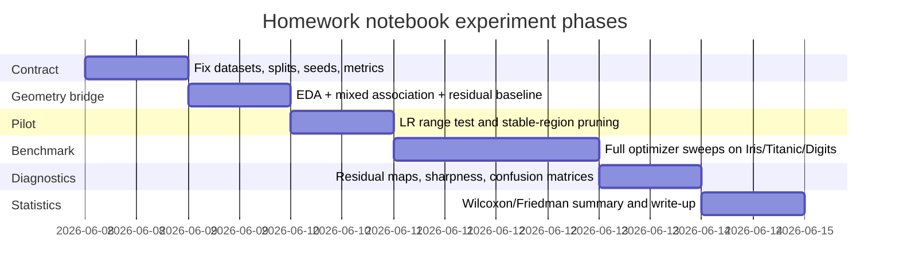

# EDA와 잔차 진단을 연결한 옵티마이저 비교 연구계획

## Executive summary

이 최종 과제 노트북의 가장 좋은 설계는 **“데이터 기하를 먼저 고정하고, 그 다음에만 optimizer를 비교하는 방식”**이다. 당신이 업로드한 scratch code는 `Layer`와 `Optimizer`의 책임을 분리하고, `optimizer.step(net)`이 각 layer의 `params_and_grads()`를 순회하며 파라미터를 갱신하는 구조이므로, **같은 모델·같은 gradient·같은 split 아래 update rule만 바꾸는** 공정 비교에 매우 적합하다. 또한 companion lecture note도 V01에서 데이터/출력/손실/지표를 고정하고, V04에서 optimizer state를 설명한 뒤, V05에서 optimizer comparison 본체로 들어가도록 설계되어 있다. 즉, 이 과제는 원래부터 “optimizer 비교 전에 무엇을 고정해야 하는가”를 핵심 원리로 삼고 있다. fileciteturn0file0 fileciteturn0file1

핵심 연구가설은 네 가지다. 첫째, **Adam과 RMSProp는 초기 수렴 속도와 learning-rate robustness에서 유리**할 가능성이 높다. Adam은 first/second moment의 adaptive estimate와 bias correction을 사용하며, noisy or sparse gradient에 강하다고 제안되었다. RMSProp은 최근 squared gradient의 이동평균으로 좌표별 step scale을 조정한다. 둘째, **SGD와 Momentum은 충분히 tuning되었을 때 validation/test generalization에서 불리하지 않거나 오히려 더 좋을 수 있다**. adaptive method가 training performance는 더 좋아도 generalization은 더 나쁠 수 있다는 실증 연구가 존재한다. 셋째, **feature scaling과 PCA가 optimizer 차이를 크게 바꿀 수 있다**. StandardScaler는 train set에서 mean/std를 구해 later data에 적용하며, Hinton 강의노트는 zero-mean/unit-variance scaling과 PCA decorrelation이 steepest descent의 geometry를 바꾼다고 설명한다. 넷째, **잔차가 class/group별로 패턴을 보이면 optimizer superiority가 아니라 model/data misspecification일 수 있다**. 이전에 본 Iris residual-by-species, Titanic group structure 같은 현상은 바로 그 신호다. citeturn31academia0turn41view2turn13academia1turn37view0turn30view3turn26view2turn16academia1

따라서 추천하는 notebook 구조는 두 갈래다. **Bridge 실험**에서는 당신이 이미 수행한 EDA→correlation→regression→residual diagnostics를 Iris 보조 회귀 태스크와 classification residual analogue로 다시 사용하여 “optimizer가 어떤 geometry 위에서 움직이는가”를 보여준다. **Main benchmark 실험**에서는 Iris species, Titanic-style binary classification, MNIST small(권장: `load_digits`)에서 SGD, Momentum, RMSProp, Adam을 같은 split·같은 init·같은 architecture 아래 비교한다. 모든 비교는 `train/val/test`를 분리하고, `stratify`와 `random_state`를 고정하며, preprocessing은 train에만 fit해야 한다. PyTorch는 cross-release/platform reproducibility를 보장하지 않으므로 deterministic setting과 seed logging을 반드시 남겨야 한다. fileciteturn0file1 citeturn36view0turn36view2turn37view2turn24view0turn24view1

실무적으로는 **“단일 best run”이 아니라 “반복된 작은 실험들의 분포”**를 보여주는 것이 이 보고서의 설득력 포인트다. 본 과제 수준에서는 pilot 3 seeds → confirmatory 10 seeds(최소 5) 구조가 가장 현실적이다. primary benchmark에서는 optimizer 핵심 행동만 보기 위해 weight decay, warm restart, clipping을 기본적으로 끄고, secondary ablation에서만 켠다. optimizer 선택은 “최종 test accuracy 한 줄”이 아니라 **초기 수렴 속도, seed-to-seed 안정성, LR sensitivity, generalization gap, 잔차 패턴, confusion matrix, sharpness probe**를 함께 보고 결정해야 한다. 이 원칙은 training/validation curves로 underfit/overfit clue를 읽고, LR·momentum·weight decay의 균형을 따지라는 Leslie Smith의 guideline, large-batch/sharp minima 논의, adaptive optimizer generalization caution과 잘 맞는다. citeturn33view0turn16academia1turn13academia1turn32academia0

## 연구 질문과 가설

이 과제의 연구 질문은 “어떤 optimizer가 최고인가?”가 아니라, 더 엄밀하게는 **“어떤 데이터 기하와 모델 조건에서 어떤 optimizer가 어떤 trade-off를 보이는가?”**여야 한다. Adam 논문은 adaptive moment estimate가 빠르고 구현이 간단하며 큰/비정상적/stochastic objective에 적합하다고 주장하지만, 후속 연구는 adaptive method가 training loss를 더 잘 낮추더라도 generalization에서 SGD 계열보다 열등할 수 있음을 보였다. 또한 Hinton 강의노트는 scaling, decorrelation, momentum이 사실상 loss surface geometry 자체를 바꾸는 처방임을 보여준다. 그러므로 optimizer 비교는 반드시 preprocessing·feature geometry·hidden group structure와 함께 읽어야 한다. citeturn31academia0turn13academia1turn30view2turn30view3turn37view0

아래 표는 최종 notebook에서 그대로 사용할 수 있는 **연구 질문–가설–반증 기준**이다. 표의 수치는 “사실 주장”이라기보다 이 과제를 위한 제안된 experimental contract다.

| 연구 질문 | 가설 | 1차 관측치 | 반증 신호 |
|---|---|---|---|
| 초기 수렴 속도는 누가 빠른가 | Adam ≈ RMSProp > Momentum > SGD | epoch-to-target, AULC(area under val-loss curve) | tuned SGD/Momentum이 같은 epoch budget에서 동일하거나 더 빠름 |
| 안정성과 LR robustness는 누가 높은가 | Adam/RMSProp의 stable LR 구간이 더 넓다 | non-divergent run 비율, LR robustness index | SGD/Momentum이 scaling 후 비슷한 robustness 보임 |
| 일반화는 누가 좋은가 | tuned SGD/Momentum이 val/test macro-F1에서 adaptive와 비슷하거나 더 좋을 수 있다 | test macro-F1, NLL, generalization gap | Adam이 train뿐 아니라 val/test에서도 일관 우세 |
| scaling/PCA는 차이를 줄이는가 | scaling/PCA 후 optimizer ranking 차이가 줄어든다 | raw vs scaled vs PCA 성능 차이 | ranking이 preprocessing과 무관하게 고정 |
| hidden group structure가 ranking을 바꾸는가 | group feature를 넣으면 optimizer 차이보다 model misspecification 차이가 더 크다 | residual-by-group, confusion matrix by class | group 변수 추가 전후에도 optimizer 차이만 유지 |
| batch size 상호작용은 있는가 | 큰 batch는 더 sharp한 해로 가고 generalization이 약해질 수 있다 | sharpness probe, gap, test F1 | batch가 커져도 gap/ sharpness가 악화되지 않음 |

이 가설들을 검정할 때 중요한 점은, **optimizer ranking을 하나의 scalar로 끝내지 말고 서로 다른 성질의 지표를 나눠서 보아야 한다는 것**이다. 예를 들어 convergence speed는 `best_epoch`, `epoch_to_95%`, `AULC`로 보고, generalization은 `best-val-selected test macro-F1`, `test NLL`, `generalization gap`으로 보고, stability는 `seed std`, `divergence rate`, `gradient norm volatility`로 봐야 한다. 이 구조를 취하면 “Adam이 빠르지만 test는 SGDM이 낫다”, “RMSProp은 LR에 둔감하지만 class-2 residual이 크다” 같은 진짜 유용한 결론을 뽑을 수 있다. citeturn31academia0turn13academia1turn16academia1turn33view0

## 실험 설계

이 notebook은 **두 개의 트랙**으로 설계하는 것이 가장 grounded하다. 첫 번째는 **geometry bridge**다. 여기서는 이미 수행한 Iris correlation→simple regression→residual diagnostics를 optimizer-aware하게 재활용한다. 즉, `petal length -> petal width` 단순 회귀나 작은 MLP 회귀를 두고 각 optimizer가 residual pattern을 얼마나 빨리 줄이는지, residual-vs-fitted와 PC residual map이 어떻게 달라지는지를 본다. 두 번째는 **main classification benchmark**다. 여기서 Iris(3-class), Titanic-style(2-class), MNIST small(권장: `load_digits`)를 같은 scratch MLP 계열로 학습시켜 최종 비교를 수행한다. 이 구조는 당신의 lecture notebook이 V01의 data/metric contract와 V01-advanced-C의 residual diagnostics를 V05 optimizer comparison으로 연결하는 방식과 정확히 맞닿는다. fileciteturn0file1

공식 dataset facts를 먼저 고정하면 다음과 같다. Iris는 150 samples, 4 features, 3 classes의 매우 쉬운 multiclass classification dataset이고, `load_digits`는 1797 samples, 64-dimensional flattened 8×8 digit image, 10 classes다. 선택적으로 true MNIST를 쓰면 TFDS 기준 train 60,000 / test 10,000, image shape 28×28×1, 10 classes다. 따라서 scratch numpy benchmark에서는 repeated sweeps 비용을 고려해 **`load_digits`를 “MNIST small”의 기본값으로 채택**하는 것이 가장 합리적이고, true MNIST subset은 appendix가 적절하다. citeturn39view0turn38view0turn11view0turn11view1

다음 표는 이 과제에 권장하는 dataset/model 설계다. 이 표는 공식 dataset facts와 당신의 scratch optimizer scaffold를 바탕으로 한 **제안 실험안**이다. scratch code의 핵심은 `Dense`–`ReLU`–`Dense` 조합과 `SoftmaxCE`, 그리고 optimizer 교체가 한 줄로 가능한 구조라는 점이다. fileciteturn0file0

| 트랙 | 데이터셋 | 목적 | 제안 모델 | 손실/출력 | 핵심 지표 |
|---|---|---|---|---|---|
| Bridge | Iris simple regression | optimizer가 residual pattern을 어떻게 줄이는지 시각화 | `Dense(1,1)` 또는 `Dense(1,8)->ReLU->Dense(8,1)` | MSE | train/val MSE, RMSE, R², residual plots |
| Main | Iris species | 쉬운 tabular multiclass baseline | `Dense(4,8)->ReLU->Dense(8,3)` | SoftmaxCE | train/val loss, acc, macro-F1, per-class F1 |
| Main | Titanic-style | mixed-type binary classification | `Dense(p,16)->ReLU->Dense(16,2)` | SoftmaxCE | loss, acc, macro-F1, confusion matrix |
| Main | Digits (`load_digits`) | image-like flattened multiclass small benchmark | `Dense(64,128)->ReLU->Dense(128,64)->ReLU->Dense(64,10)` | SoftmaxCE | loss, acc, macro-F1, per-class F1 |
| Appendix | True MNIST subset | external validity check | `Dense(784,128)->ReLU->Dense(128,64)->ReLU->Dense(64,10)` | SoftmaxCE | same as Digits |

split과 seed는 이 연구의 가장 중요한 통제 변수다. `train_test_split`은 `random_state`로 reproducible split을 만들고, `stratify`가 주어지면 class label 기준 stratified split을 수행한다. Iris/Titanic처럼 sample 수가 작은 데이터에서는 split variance가 optimizer variance보다 커질 수 있으므로, **동일 seed에서 모든 optimizer가 동일 split을 공유**해야 한다. 권장 split은 Iris/Titanic 60/20/20, Digits 70/15/15다. true MNIST를 appendix로 쓸 경우 공식 train/test를 유지하고 train에서 validation만 분리하면 된다. 제안 반복 수는 pilot 3 seeds, confirmatory 10 seeds(최소 5)다. 여기서 `split_seed`와 `init_seed`를 분리해 기록하면 split effects와 initialization effects를 나눠서 읽을 수 있다. citeturn36view0turn36view2turn24view1

preprocessing은 **train-only fitting**이 절대 원칙이다. StandardScaler는 training set의 mean/std를 feature별로 계산해 later data에 transform하고, PCA는 centered-but-not-scaled data를 SVD로 낮은 차원에 투영한다. 따라서 PCA ablation을 설계할 때는 보통 `StandardScaler -> PCA` 순서를 사용해야 한다. Hinton 강의노트도 zero-mean/unit-variance scaling과 PCA decorrelation이 error surface를 더 circular하게 만들어 steepest descent를 돕는다고 설명한다. 이 사실은 optimizer comparison에 직접 중요하다. 만약 raw→scaled 또는 scaled→PCA에서 optimizer ranking이 바뀐다면, 그 결론은 “optimizer 자체의 우열”이 아니라 **optimization geometry와의 상호작용**이다. citeturn37view0turn37view2turn26view2turn26view3turn30view3

metrics는 최소한 네 층위로 저장해야 한다. **epoch-level**에서는 train/val loss, accuracy, macro-F1, per-class F1, gradient norm, parameter norm, update norm, effective step size를 저장한다. **checkpoint-level**에서는 confusion matrix, per-class residual boxplot, PC residual map, sharpness probe를 저장한다. **run-level**에서는 best epoch, final test metrics, divergence 여부, total training time을 저장한다. **dataset-level**에서는 optimizer rank table, statistical test 결과, robustness heatmap을 저장한다. `f1_score`는 multiclass에서 `average='macro'`일 때 각 label의 F1을 계산한 뒤 unweighted mean을 취하므로, class-wise behavior를 보고 싶은 이 과제에 적합하다. confusion matrix는 행이 true class, 열이 predicted class인 count matrix다. citeturn35view1turn35view2turn40view0turn40view1

## 옵티마이저별 프로토콜

당신의 scratch code와 lecture note를 기준으로 보면, 비교 대상 네 optimizer는 저장 state가 뚜렷하게 다르다. SGD는 현재 gradient만 사용하고, Momentum은 velocity를, RMSProp은 squared-gradient EMA를, Adam은 first/second moment와 bias correction을 사용한다. 이 구분은 단순 구현 차이가 아니라 **“같은 gradient를 어떻게 재해석하는가”**의 차이다. scratch code는 SGD/Momentum/RMSProp/Adam을 직접 구현해두었고, lecture note도 V04를 같은 요점으로 설명한다. RMSProp의 역사적 공식은 Hinton의 lecture slides에, Adam의 공식은 Kingma–Ba 원 논문과 공식 optimizer docs에 정리되어 있다. fileciteturn0file0 fileciteturn0file1 citeturn30view0turn30view2turn31academia0turn41view3

중요한 실무 포인트는 **“scratch default와 framework default가 다르다”**는 점이다. 당신의 scratch code 기본값은 대략 SGD=0.01, Momentum(lr=0.01, μ=0.9), RMSProp(lr=0.001, ρ=0.9), Adam(lr=0.001, β1=0.9, β2=0.999)인데, PyTorch 공식 defaults는 SGD(lr=0.001, momentum=0), RMSprop(lr=0.01, alpha=0.99), Adam(lr=0.001, betas=(0.9,0.999))이다. 그러므로 결과 보고서에서 **“default”라는 단어는 반드시 구현 문맥을 명시**해야 한다. scratch code와 library code를 뒤섞으면 optimizer 비교가 아니라 implementation convention 비교가 된다. 또한 PyTorch docs는 SGD momentum/Nesterov의 update form이 다른 framework와 조금 다를 수 있고, RMSprop은 epsilon 위치가 TensorFlow와 다를 수 있다고 명시한다. fileciteturn0file0 citeturn41view0turn41view1turn41view2turn41view3

추천하는 search protocol은 **3단계**다. 먼저 **pilot LR range stage**에서 seed 1개, 10~15 epochs, coarse LR sweep으로 run을 짧게 돌려 non-divergent interval을 찾는다. Leslie Smith의 CLR 논문은 learning rate가 가장 중요한 hyperparameter이며, 짧은 range test로 reasonable bounds를 찾을 수 있다고 설명한다. 두 번째 단계는 **coarse grid search**다. 여기서 optimizer별 고유 hyperparameter를 함께 훑는다. 세 번째 단계는 **confirmatory repeated runs**다. coarse stage에서 나온 상위 2~3개 설정만 10 seeds로 늘려 진짜 비교를 한다. 이렇게 해야 “튜닝 노력의 공정성”과 “compute budget”을 동시에 맞출 수 있다. citeturn21academia1turn33view0

아래 표는 과제용 **권장 hyperparameter grid**다. 이는 원 논문/공식 docs가 보여주는 기본 구조를 바탕으로 한 **제안된 homework search grid**이며, 실제 값 자체는 당신의 compute budget과 dataset scale에 맞춘 실험 설계안이다. 공식 docs의 default를 그대로 쓰라는 뜻이 아니다. citeturn41view0turn41view2turn41view3turn31academia0

| Optimizer | 권장 coarse LR grid | 추가 grid | primary schedule | secondary schedule / note |
|---|---|---|---|---|
| SGD | {1e-3, 3e-3, 1e-2, 3e-2, 1e-1} | 없음 | fixed LR | cosine decay or SGDR appendix |
| Momentum | {1e-3, 3e-3, 1e-2, 3e-2, 1e-1} | μ ∈ {0.8, 0.9, 0.95} | fixed LR + optional momentum warmup | warmup μ: 0.5→0.9 가능 |
| RMSProp | {1e-4, 3e-4, 1e-3, 3e-3, 1e-2} | ρ/alpha ∈ {0.9, 0.99}, eps=1e-8 | fixed LR | cosine decay optional, momentum off in primary |
| Adam | {1e-4, 3e-4, 1e-3, 3e-3} | β1 ∈ {0.9, 0.95}, β2 ∈ {0.99, 0.999}, eps=1e-8 | fixed LR | cosine decay optional, AMSGrad appendix |

Momentum에 대해서는 Hinton 노트가 특히 유용하다. 초반에는 gradient가 커서 작은 momentum(예: 0.5)이 안전하고, weights가 ravine에 갇히면 0.9 또는 0.99로 부드럽게 올리는 전략이 가능하다고 제안한다. 이 과제에서는 **primary benchmark에서는 고정 μ**, **secondary ablation에서만 momentum warmup**을 쓰는 것이 좋다. 왜냐하면 schedule 자체가 optimizer effect를 가릴 수 있기 때문이다. RMSProp에 대해서는 Hinton slides가 standard momentum 결합은 “더 연구가 필요”하다고 언급하므로, primary benchmark에서는 **pure RMSProp**을 쓰고, momentum-RMSProp 조합은 appendix로 미루는 편이 공정하다. citeturn30view2turn30view0

schedule에 대해서는 원칙이 분명해야 한다. **primary benchmark는 fixed LR 또는 동일 family의 단순 cosine decay만 사용**하라. SGDR warm restarts나 one-cycle/CLR는 성능 향상에는 유용하지만, schedule 자체가 강한 regularizer이기 때문에 optimizer core behavior를 흐릴 수 있다. 따라서 본문에서 optimizer 순수 비교를 하려면 “schedule off” 또는 “모든 optimizer에 동일한 간단한 decay”가 맞다. warm restart는 SGD/Momentum appendix에서만 쓰고, 그때는 SGDR을 별도 실험으로 분리하라. citeturn13academia0turn21academia1turn21academia0

weight decay와 L2는 특히 주의가 필요하다. Loshchilov–Hutter는 **standard SGD에서는 L2와 weight decay가 learning rate rescaling을 제외하면 동등하지만, adaptive optimizer에서는 그렇지 않다**고 보였고, 이것이 AdamW/decoupled weight decay 논의의 출발점이다. 따라서 **primary optimizer comparison에서는 weight decay를 0으로 두고**, regularization은 secondary ablation에서만 다루는 것이 가장 깔끔하다. 만약 regularization을 본문에 넣고 싶다면, 모든 optimizer에 동일하게 explicit loss penalty(L2)를 더하는 버전과 AdamW appendix를 분리하라. 이 분리를 하지 않으면 “optimizer 효과”와 “regularization semantics 효과”가 섞인다. citeturn32academia0

gradient clipping은 shallow MLP에서는 기본 꺼짐이 맞지만, 실험 프로토콜상 **안전장치로는 반드시 구현**하는 것이 좋다. Pascanu 등은 exploding gradient에 대해 gradient norm clipping을 제안했고, PyTorch docs는 `clip_grad_norm_`가 모든 parameter gradient를 하나의 vector처럼 본 total norm을 계산해 in-place로 clip한다고 설명한다. 본 과제에서는 primary benchmark에서는 `clip=off`, secondary instability ablation에서만 `max_norm ∈ {1, 5, 10}`을 시험하고, **clipping invocation rate**를 로그로 남기면 된다. 만약 특정 optimizer가 clipping 없이는 불안정하고 clipping 후 안정화된다면, 그 사실 자체가 “stability profile”의 일부다. citeturn13academia2turn41view4

마지막으로 Adam은 여전히 실무 표준이지만, 이론과 실무의 간극을 노트에 적어 두는 것이 좋다. Adam 논문은 little memory, computational efficiency, sparse/noisy gradient suitability를 장점으로 제시하지만, Reddi 등은 Adam류 adaptive method가 특정 convex 예제에서 수렴 문제를 보일 수 있으며 long-term memory variant(AMSGrad)가 이 문제를 완화한다고 논의했다. 이 과제에서는 Adam 본체를 main four에 넣고, **AMSGrad는 divergence case가 실제로 나타날 때만 appendix**로 넣는 것이 적절하다. citeturn31academia0turn28academia2

## EDA와 잔차 진단 프로토콜

이 과제의 차별점은 optimizer benchmark가 EDA와 잔차 진단 위에 세워져야 한다는 점이다. 당신이 이미 본 mixed association dashboard는 연속형-연속형, 범주형-범주형, 연속형-범주형 관계를 서로 다른 척도로 읽어야 한다는 점을 보여주었고, regression residual gallery는 높은 상관이 있어도 species/group별 잔차 패턴이 남을 수 있음을 보여주었다. 따라서 optimizer 비교도 “곡선만 보고 끝”내면 안 되고, **optimizer가 줄이지 못한 구조가 입력 공간·PC space·class/group residual에 남는지**를 확인해야 한다. fileciteturn0file1

실험 전 진단은 세 가지로 정리할 수 있다. 첫째, **feature geometry 진단**이다. numeric-only 데이터에서는 Pearson/Spearman/Kendall과 PCA explained variance를, mixed-type 데이터에서는 Cramér’s V, eta-squared, point-biserial을 본다. 둘째, **scaling/PCA ablation 설계**다. StandardScaler는 feature별로 center/scale statistics를 train set에서 저장하고 later data에 적용하므로, raw vs scaled 두 버전을 비교할 수 있다. PCA는 centered-but-not-scaled SVD이므로, scaling 이후 PCA를 붙인 버전을 별도 조건으로 둔다. 셋째, **group structure 진단**이다. Titanic-style에서는 sex/pclass/embarked류의 범주형 구조가 confusion이나 residual에 남는지 확인해야 한다. 이 세 진단을 통해 “optimizer 차이”를 보기 전에 “loss surface를 바꾸는 데이터 구조”를 먼저 적어 둘 수 있다. citeturn37view0turn26view2turn26view3turn30view3

학습 중 진단은 이전 regression residual workflow를 그대로 가져오되, classification에 맞게 약간 변형하면 된다. regression bridge에서는 전통적인 `residual = y - ŷ`를 쓰고, **residual vs fitted**, **residual histogram**, **residual by group/class**, **PC residual map**을 epoch checkpoint마다 저장한다. classification main benchmark에서는 두 종류의 residual을 저장하길 권한다. 하나는 **per-sample cross-entropy residual** `r_i = -log p_true,i`이고, 다른 하나는 **margin residual** `m_i = logit_true - max_{j≠y_i} logit_j`다. 이때 fitted axis는 `p_true` 또는 `max softmax prob`로 둘 수 있다. 이렇게 하면 “loss는 잘 줄지만 hard class residual이 남는 optimizer”, “전체 accuracy는 비슷하지만 margin calibration이 다른 optimizer”를 드러낼 수 있다. 이 부분은 기존 residual grammar를 classification으로 번역한 제안이다. fileciteturn0file1

학습 후 진단은 최소한 다음 여섯 그래프를 포함해야 한다. **learning curves**(train/val loss, accuracy, macro-F1), **gradient/update/parameter norm curves**, **confusion matrix**, **per-class residual boxplots**, **PC residual map**, **LR sensitivity heatmap**이다. 여기에 하나를 더 추가하면 훨씬 연구다운 그림이 되는데, 그것이 **sharpness probe**다. Keskar 등은 large-batch가 sharp minima로 가며 generalization이 나빠질 수 있다고 주장했고, SAM은 local neighborhood loss까지 고려하는 sharpness-aware objective를 제안했다. 이 과제에서는 SAM을 구현할 필요는 없지만, 학습이 끝난 가중치 \(w\) 근방에서 작은 perturbation \(w+\epsilon u\)를 주었을 때 train/val loss가 얼마나 빠르게 증가하는지를 재는 **간단한 local sharpness estimate**를 넣을 수 있다. 예를 들어 \(u\)를 normalized random direction 10개로 두고 \(\epsilon \in \{10^{-4}, 5\times10^{-4}, 10^{-3}\}\|w\|\)에서 평균/최대 \(\Delta L\)를 저장하면 좋다. citeturn16academia1turn16academia0

다음 표는 이 과제에서 꼭 저장할 diagnostic figure template이다. 이 표는 제안 템플릿이며, figure 이름까지 미리 정해두면 write-up이 훨씬 쉬워진다.

| 그림 파일명 예시 | 내용 | 저장 시점 | 해석 포인트 |
|---|---|---|---|
| `learning_curves_{dataset}_{model}.png` | train/val loss, acc, macro-F1 | every run | 속도 vs generalization gap |
| `norm_dynamics_{dataset}_{model}.png` | grad/update/param norm | every run | 폭주, 죽은 step, steady state |
| `residual_vs_fitted_{dataset}_{optimizer}.png` | regression residual or CE residual | checkpoints | misspecification / calibration |
| `pc_residual_map_{dataset}_{optimizer}.png` | PC1/PC2 위 잔차 색칠 | checkpoints | subgroup/region별 systematic error |
| `residual_by_class_{dataset}_{optimizer}.png` | class별 residual boxplot | last/best epoch | hard class 집중 여부 |
| `confusion_{dataset}_{optimizer}.png` | confusion matrix | best val epoch, test | 어떤 class를 어떻게 틀리는가 |
| `lr_batch_heatmap_{dataset}.png` | LR × batch score heatmap | grid summary | robustness volume |
| `sharpness_probe_{dataset}_{optimizer}.png` | perturbation vs Δloss | last epoch | flat/sharp neighborhood |

이 diagnostics를 해석하는 기준도 미리 적어 두는 것이 좋다. **Pearson과 Spearman이 많이 다르면** monotonic but nonlinear relation을 의심하고, optimizer를 바꾸기 전에 model nonlinearity나 feature transform을 먼저 생각한다. **group residual이 남으면** optimizer가 아니라 feature set/interaction 설계 문제다. **confusion matrix는 비슷하지만 per-class residual boxplot이 다르면** class-wise difficulty handling이 다르다는 뜻이다. **train loss만 빠르고 sharpness probe가 나쁘다면** 빠른 optimizer이지 꼭 좋은 optimizer는 아니다. 이 해석 프레임이 있어야 그림이 단순 장식이 아니라 연구 결과가 된다. citeturn40view0turn35view2turn16academia1turn16academia0

## 분석 계획과 실무 선택 규칙

분석의 핵심은 **optimizer effect를 model/data effect에서 분리하는 것**이다. 이를 위해서는 네 가지 controlled experiment가 반드시 필요하다. 첫째, **preprocessing ablation**: raw vs StandardScaler vs StandardScaler+PCA. 둘째, **group information ablation**: Titanic에서 sex/pclass 같은 group feature를 넣기 전후, Iris에서 petal feature를 빼거나 PCA만 주는 조건 전후. 셋째, **noise ablation**: feature noise(작은 Gaussian)와 label noise(예: 5%)를 넣어 optimizer robustness를 본다. 넷째, **batch size ablation**: \(\{8,16,32,64,128\}\) 등으로 batch를 바꾸며 convergence/generalization/sharpness를 본다. 만약 optimizer ranking이 이 ablation들에서 크게 흔들리면, 결론은 “optimizer 우열”이 아니라 “optimizer–data geometry interaction”이 된다. citeturn37view0turn26view2turn30view3turn16academia1

통계 비교는 classical+practical 두 층으로 나누는 것이 좋다. **동일 dataset 내, 동일 split seed의 paired comparison**에는 Wilcoxon signed-rank test를 쓴다. 이는 Demšar가 multiple classifier comparison에 대해 추천한 nonparametric protocol과 일치한다. 예를 들어 final test macro-F1, final test NLL, epoch-to-target, AULC에 대해 optimizer pairwise Wilcoxon을 수행할 수 있다. **여러 dataset/task에 걸친 전체 ranking**에는 Friedman test + post-hoc procedure를 사용하고, 가능하면 critical difference diagram까지 그린다. 다만 NHST에만 의존하지 말고, 반드시 함께 **median difference**, **win/tie/loss count**, **seed std**, **divergence rate**를 표에 남겨야 한다. citeturn19view0turn18academia2

이때 가장 중요한 의사결정 규칙은 **“best test”가 아니라 “best validation-selected test”**를 쓰는 것이다. 각 run에서 epoch마다 validation metric을 기록하고, 선택 기준은 `minimum val loss` 또는 `maximum val macro-F1` 중 하나로 고정한다. test set은 그 선택된 checkpoint에 대해 **한 번만** 평가한다. 만약 optimizer마다 test best epoch를 따로 고르면, 이미 optimizer 비교가 아니라 test-set tuning이 된다. 이 원칙은 lecture note의 fixed split/fair comparison 철학과도 일치한다. fileciteturn0file1

실무 선택 규칙은 다음처럼 정리하면 보고서 결론이 단단해진다. **초기 수렴이 중요하고 tuning 시간이 짧다면 Adam**을 우선 고려하되, **같은 compute budget에서 tuned Momentum/SGD가 더 낮은 val/test gap과 더 나은 macro-F1을 보이면 그쪽을 선택**한다. **optimizer ranking이 scaling/PCA 조건에서 뒤집히면 preprocessing을 먼저 고친다.** **group residual이 남으면 feature/model redesign이 optimizer 교체보다 우선**이다. **large batch에서 sharpness probe와 gap이 나빠지면 optimizer를 바꾸기보다 batch를 줄이거나 schedule을 수정**한다. 마지막으로 **한 optimizer가 오직 한 LR에서만 이기고, stable region이 매우 좁다면 실제 실무 선택에서는 불리하다**. Smith가 LR, momentum, weight decay 균형을 강조한 이유도 여기에 있다. citeturn33view0turn13academia1turn16academia1turn32academia0

아래 표는 최종 보고서의 summary table template이다. 이 표는 각 optimizer에 “속도·안정성·일반화·민감도”를 한 화면에 놓기 위한 제안 포맷이다.

| Optimizer | best val macro-F1 mean±std | final test macro-F1 mean±std | epoch-to-target median | divergence rate | LR robustness index | sharpness Δloss mean | 권장 상황 |
|---|---|---|---|---|---|---|---|
| SGD |  |  |  |  |  |  | tuning 여유, 해석성, flatter solution 선호 |
| Momentum |  |  |  |  |  |  | SGD보다 빠른 속도와 비교적 좋은 generalization |
| RMSProp |  |  |  |  |  |  | LR 둔감성, noisy gradient, 빠른 실험 |
| Adam |  |  |  |  |  |  | 빠른 초기 수렴, baseline 구축, sparse/noisy setting |

## 재현 가능한 노트북 구조와 저장 산출물

당신의 companion materials를 기준으로 하면, final notebook은 크게 **Data contract → Geometry bridge → Optimizer benchmark → Diagnostics → Statistical summary**의 흐름을 가져야 한다. 특히 lecture note가 V01에서 data/model/metric contract를 먼저 고정하고, V04에서 optimizer state를 시각화하며, V05에서 본 비교를 수행하라고 설계했다는 점을 그대로 살리면 좋다. 다시 말해, 이 notebook은 “optimizer 네 개를 그냥 돌려보는” 모음집이 아니라, **왜 그 비교가 공정한지 증명하는 문서**여야 한다. fileciteturn0file1

권장 섹션 구성은 다음과 같다. `00_setup_reproducibility`, `01_dataset_cards_and_splits`, `02_eda_mixed_association`, `03_correlation_regression_residual_bridge`, `04_scratch_model_and_optimizer_formulas`, `05_pilot_lr_range_test`, `06_full_optimizer_benchmark`, `07_diagnostics_dashboard`, `08_statistical_comparison`, `09_conclusion_and_practical_rule` 정도가 가장 균형이 좋다. scratch code를 그대로 쓴다면 `Dense`, `ReLU`, `SoftmaxCE`, `Optimizer.step(net)`를 먼저 재사용하고, logging만 추가하는 방식이 가장 안전하다. fileciteturn0file0 fileciteturn0file1



reproducibility는 “seed를 적었다”에서 끝나지 않는다. PyTorch는 동일 seed라도 release/platform/CPU-vs-GPU에 따라 완전 재현을 보장하지 않으며, deterministic algorithms 설정은 더 느릴 수 있다고 명시한다. 따라서 notebook front matter에 **package versions**, **device**, **seed policy**, **deterministic flag**, **cudnn benchmark flag**, **split seed**, **init seed**, **batch sampler seed**를 함께 저장해야 한다. NumPy도 legacy global seed보다 dedicated generator 사용을 권장하지만, scratch 과제에서는 최소한 `np.random.seed`와 split/init seed logging은 필수다. citeturn24view0turn24view1turn22view1

아래 표는 **반드시 저장할 파일**을 정리한 것이다. 이것이 있어야 재실행 없이도 보고서를 다시 그릴 수 있다.

| 파일 | 내용 | 저장 주기 | 필수 여부 |
|---|---|---|---|
| `artifacts/configs/{run_id}.json` | dataset, model, optimizer, hyperparams, seeds, versions | run 시작 | 필수 |
| `artifacts/csv/epoch_metrics_{run_id}.csv` | epoch별 loss/acc/F1/grad_norm/update_norm/param_norm/lr | every epoch | 필수 |
| `artifacts/csv/final_metrics_{run_id}.csv` | best epoch, val/test score, time, divergence | run 종료 | 필수 |
| `artifacts/csv/class_metrics_{run_id}.csv` | per-class precision/recall/F1/support | best epoch, test | 필수 |
| `artifacts/csv/confusion_{run_id}.csv` | confusion matrix raw/normalized | best epoch, test | 필수 |
| `artifacts/csv/residuals_{run_id}_ep{e}.csv` | sample id, true, pred, p_true, CE residual, margin, PC coords | checkpoint epochs | 권장 |
| `artifacts/csv/sharpness_{run_id}.csv` | epsilon, direction id, Δtrain_loss, Δval_loss | final/best epoch | 권장 |
| `artifacts/figures/*.png` | all summary plots | plot 생성 시 | 필수 |
| `artifacts/summary/optimizer_rank_table.csv` | aggregated mean/std/rank/stat tests | dataset 요약 후 | 필수 |
| `artifacts/tensorboard/*` | scalars, hparams | PyTorch 사용 시 | 선택 |

다음은 scratch code에 최소한으로 추가할 logging skeleton 예시다. 핵심은 **각 epoch마다 optimizer dynamics를 수치화**하는 것이다. 이 코드는 개념 예시이며, 실제 구현에서는 `params_and_grads()`와 parameter snapshot을 써서 `grad_norm`, `param_norm`, `update_norm`을 계산하면 된다. 이 구조는 당신의 scratch code 책임 분리에 바로 붙일 수 있다. fileciteturn0file0

```python
def collect_norms(net, prev_params=None):
    grads_sq, params_sq, updates_sq = 0.0, 0.0, 0.0
    current = []
    for layer in net.layers:
        for param, grad in layer.params_and_grads():
            current.append(param.copy())
            grads_sq += float((grad ** 2).sum())
            params_sq += float((param ** 2).sum())
    if prev_params is not None:
        for p_now, p_prev in zip(current, prev_params):
            updates_sq += float(((p_now - p_prev) ** 2).sum())
    return {
        "grad_norm": grads_sq ** 0.5,
        "param_norm": params_sq ** 0.5,
        "update_norm": updates_sq ** 0.5 if prev_params is not None else 0.0,
        "params_snapshot": current,
    }

def effective_step_size(update_norm, grad_norm, eps=1e-12):
    return update_norm / (grad_norm + eps)
```

classification residual logging도 미리 정형화해 두는 편이 좋다. 아래처럼 `p_true`와 `ce_residual`을 저장하면, residual-vs-fitted plot과 per-class residual boxplot을 같은 코드로 반복 생성할 수 있다.

```python
def classification_residual_table(logits, y_onehot, pc_coords=None):
    probs = softmax(logits)
    y_idx = y_onehot.argmax(axis=1)
    p_true = probs[np.arange(len(y_idx)), y_idx]
    ce_resid = -np.log(np.clip(p_true, 1e-12, 1.0))
    pred = probs.argmax(axis=1)
    margin = logits[np.arange(len(y_idx)), y_idx] - np.max(
        np.where(np.eye(logits.shape[1])[y_idx] == 1, -np.inf, logits), axis=1
    )
    return {
        "y_true": y_idx,
        "y_pred": pred,
        "p_true": p_true,
        "ce_residual": ce_resid,
        "margin": margin,
        # optional: PC1, PC2
    }
```

CSV를 기본 저장 포맷으로 두고, TensorBoard는 PyTorch implementation을 병행할 때만 선택적으로 붙이는 것이 좋다. scratch numpy notebook에서는 CSV + Matplotlib가 가장 투명하고 재현 가능하다. 그리고 final write-up에는 **표 세 개**가 꼭 들어가야 한다. 첫째, dataset/model 설계표. 둘째, hyperparameter grid 비교표. 셋째, optimizer summary rank table. 이 세 표가 있으면 그림이 많아도 전체 구조가 무너지지 않는다. fileciteturn0file0

## 한계와 후속 질문

이 계획의 첫 번째 한계는 **표본 규모와 task 난이도**다. Iris는 공식 문서가 말하듯 very easy multiclass dataset이므로 optimizer 차이가 너무 빨리 포화될 수 있다. 반대로 Titanic-style과 Iris는 표본이 작아 seed/split variance가 크다. 따라서 작은 tabular dataset에서 얻은 ranking을 일반 심층학습으로 과대해석하면 안 된다. Digits는 반복 실험에는 적합하지만 true MNIST의 28×28 규모와는 다르므로, 외적 타당성은 appendix에서 따로 확인하는 것이 좋다. citeturn39view0turn38view0turn11view0

두 번째 한계는 **implementation convention confound**다. scratch code와 PyTorch는 기본 하이퍼파라미터와 update convention이 다를 수 있고, RMSprop의 epsilon 위치나 SGD momentum 구현도 framework마다 차이가 난다. 또한 PyTorch 자체도 완전 재현성을 보장하지 않는다. 즉, “optimizer 이름”이 같아도 실질적으로는 다른 알고리즘일 수 있다. 이 문제를 피하려면 보고서에 **구현 출처와 정확한 update rule**을 반드시 적어야 한다. fileciteturn0file0 citeturn41view1turn41view2turn24view0

세 번째 한계는 **optimizer와 regularization의 경계**다. especially Adam류에서는 L2와 weight decay가 동등하지 않으므로, regularization을 본문에 섞어 넣으면 optimizer 비교가 흐려진다. 또한 adaptive optimizer generalization debate는 여전히 문맥 의존적이고, 최근 연구들은 Adam/SGDM separability와 convergence에 대해 더 세분된 조건을 논의한다. 즉, 이 homework notebook의 결론은 **“작은 MLP·작은 dataset·이 설정”에 대한 실증 결론**이지, 범용 법칙이 아니다. citeturn32academia0turn13academia1turn28academia0turn28academia2

후속 질문은 명확하다. 첫째, **AdamW를 본문에 포함하면 ranking이 어떻게 달라지는가**. 둘째, **calibration(ECE/Brier)까지 넣으면 optimizer 차이가 더 선명해지는가**. 셋째, **BatchNorm/Dropout/더 넓은 hidden width가 ranking을 바꾸는가**. 넷째, **Digits 대신 true MNIST subset, 나아가 CNN으로 가면 결과가 유지되는가**. 다섯째, **sharpness probe와 residual map 사이에 일관된 상관이 있는가**. 이 다섯 질문은 본 과제를 넘어서 다음 실험 프로젝트로 자연스럽게 이어진다. citeturn32academia0turn16academia0turn16academia1turn11view0