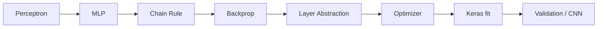

# ML_W13_PREP_VISUAL_LECTURE

이 노트북은 Week13 optimizer 과제를 풀기 직전의 companion notebook이다. 제출용 답안 노트북이 아니라, `X/y -> forward -> loss -> backward -> optimizer.step(net)` 흐름을 스스로 설명하기 위한 시각화 강의 노트북이다.

반복 기준:

```text
X_batch
→ net.forward(X_batch)
→ loss_fn.forward(logits, y_batch)
→ loss_fn.backward()
→ net.backward(dloss)
→ optimizer.step(net)
```

```text
Optimizer는 X/y를 보지 않는다.
Optimizer는 layer가 들고 있는 param과 grad만 읽고 parameter를 update한다.
```

---

### 전체 디벨롭 실행 계획

| 섹션 | 역할 | 실행 산출 |
|---|---|---|
| V00 | 전체 개념 지도와 책임 분리 흐름을 고정 | Mermaid course map, 책임 분리 flow, 단계별 입력/출력 표, EDA/DataCard 시각화 문법 |
| V01 | optimizer 비교 전에 데이터/출력/손실/지표 기준을 압축 | Iris/XOR/Image DatasetCard, concrete EDA cards, Pearson/Spearman/Kendall heatmap, scaling/leakage contrast |
| V01.1 | DatasetCard visual decision board | 카드형 설계 지도, DatasetCard vs detail 차이, XOR truth table/hidden feature map |
| V01.2 | split-before-fit deep dive | Iris scaler 통계량, 좌표 이동, PCA fit-scope, first-batch gradient 비교 |
| Appendix | V01 본문에서 뺀 데이터 인벤토리 보조 예시 | Titanic/missing/categorical/datetime mini EDA |
| V02 | GD와 XOR 비선형성 직관 | 1D/2D GD path, XOR truth-table EDA, linear failure audit, sklearn MLPClassifier visualization only |
| V03 | scratch Dense convention과 SoftmaxCE gradient shape 검증 | shape table, heatmap, assert cell, role table |
| V03.5 | Dense width와 ReLU gate 심화 | parameter count, ReLU derivative, active/dead unit ratio |
| V04 | optimizer state 직관과 `optimizer.step(net)` 책임 확인 | V04-A 2D vector simulation, V04-B dummy net update audit |
| V04.5 | bootstrap 안정성 진단 | width x optimizer metric distribution, ReLU gate distribution |
| V05 | Iris optimizer comparison 본체 | train/val curves, final test metrics, final test confusion matrix |
| V05.5 | gradient flow audit | layer별 grad/update/active/dead ratio |
| V05.6 | ablation lab | scaling/ReLU/width/init/lr failure 비교 |
| V05.7 | Dense2 output ReLU placement | Dense2 뒤 ReLU 유무별 loss/accuracy curve, score clipping ratio |
| V06 | 이미지 tensor와 CNN bridge를 Week15로 연결 | sample grid, label distribution, flatten diagram, pixel histogram, CNN pipeline |
| V07 | proper MLP representation bridge | Dense+ReLU block 반복, layer-wise PCA before/after |
| V08 | failure gallery | symptom -> evidence -> cause -> action -> answer sentence |
| Final Audit | 시각화를 판단판과 답안 문장으로 압축 | trace board, learning dynamics board, architecture bridge board |
| Final | 시험 답안 프레임으로 압축 | rubric + 검증 섹션 매핑표 |

---

```python
# 공통 import 셀.
# 이 노트북은 외부 다운로드 없이 실행되는 것을 목표로 하므로,
# 기본 실행 의존성은 표준 라이브러리 + NumPy/Pandas/Matplotlib/scikit-learn으로 제한한다.
# [코드 해설 | import json/gzip/struct/Path]
# json은 dataset_inventory_for_ML_W13_PREP.json을 읽어 DatasetCard와 registry 표를 만들 때 쓰인다.
# gzip/struct는 Fashion-MNIST IDX gzip cache를 직접 읽는 V06 image bridge에서 필요하다.
# Path는 notebook을 repo root에서 열었는지 final 폴더에서 열었는지와 무관하게 후보 경로를 조합하기 위한 객체다.
# 이 블록은 모델 학습이 아니라 이후 V들이 외부 다운로드 없이 실행되도록 파일/경로/바이너리 읽기 도구를 준비한다.
import json
import gzip
import struct
from pathlib import Path

# 배열 계산, 표 처리, 시각화를 담당하는 기본 스택이다.
# [코드 해설 | NumPy/Pandas/Matplotlib]
# NumPy는 X, W, logits, gradient 같은 수치 배열의 shape를 직접 다루는 주 도구다.
# Pandas는 DatasetCard, audit table, metric summary처럼 학생이 읽어야 하는 중간 산출물을 표로 만든다.
# Matplotlib은 각 V의 질문을 plot으로 검증한다. 여기서는 시각화가 장식이 아니라 실험 결과를 읽는 도구다.
import numpy as np
import pandas as pd
import matplotlib.pyplot as plt
# [라이브러리 언어 비교 | ndarray / DataFrame / Figure / Tensor]
# NumPy ndarray는 같은 dtype의 숫자 격자다. shape, axis, broadcasting, @ matrix multiplication이 핵심 문법이다.
# Pandas DataFrame은 column 이름과 dtype을 가진 표다. EDA, groupby, value_counts, display에 강하다.
# Matplotlib은 ndarray/DataFrame을 받아 Figure와 Axes 위에 선, 막대, heatmap을 그린다.
# TensorFlow/Keras의 Tensor도 shape를 갖지만, 자동미분/graph 실행과 연결될 수 있다는 점이 ndarray와 다르다.
# 이 notebook은 기본 실행을 NumPy scratch code로 유지하고, Keras는 Dense/fit 관점 비교 대상으로 설명한다.

# Iris/digits는 로컬 내장 데이터셋이므로 네트워크가 필요 없다.
# train_test_split은 train/validation/test 분리를 엄격히 만들기 위해 사용한다.
# [코드 해설 | sklearn import 묶음]
# load_iris는 V01/V05의 tabular multiclass optimizer 비교 본체다.
# load_digits는 Fashion-MNIST cache가 없을 때 V06 image tensor -> flatten bridge를 유지하는 fallback이다.
# train_test_split, scaler, metric, PCA는 각각 split 공정성, preprocessing, 평가, representation projection을 담당한다.
# 즉 이 import 줄들은 '모델을 잘 돌리기 위한 편의'가 아니라 각 V의 실험 원칙을 코드로 실행하기 위한 도구 선택이다.
from sklearn.datasets import load_iris, load_digits
from sklearn.model_selection import train_test_split
from sklearn.preprocessing import StandardScaler, MinMaxScaler
from sklearn.metrics import accuracy_score, f1_score, confusion_matrix, classification_report, silhouette_score
from sklearn.decomposition import PCA

# V02의 XOR decision region은 비선형 경계 시각화 전용이다.
# Week13 optimizer 비교 본체는 V04~V05 scratch Network에서 수행한다.
from sklearn.neural_network import MLPClassifier
# [라이브러리 언어 비교 | scikit-learn API vs Keras API vs scratch loop]
# scikit-learn 객체는 대개 fit(X, y), predict(X), predict_proba(X), transform(X) 같은 estimator API를 따른다.
# Keras는 model.compile(...), model.fit(...), model.predict(...)처럼 neural-network training loop를 high-level로 감싼다.
# 이 notebook의 scratch Network는 둘보다 낮은 수준으로 forward/backward/optimizer.step을 직접 보여준다.

# 모든 난수 실험의 기준 seed.
# optimizer 비교에서 seed가 바뀌면 update rule 차이가 아니라 초기값 차이를 비교하게 된다.
# [실험 원칙 | seed 고정]
# optimizer 비교에서 seed가 고정되지 않으면 SGD/Momentum/RMSProp/Adam 차이와 초기 weight 우연이 섞인다.
# SEED는 split, initialization, mini-batch order, PCA random_state까지 반복해서 들어가므로 공정 비교의 기준점이다.
SEED = 42
np.random.seed(SEED)

# 모든 그래프의 기본 크기를 고정해 notebook layout을 안정화한다.
plt.rcParams["figure.figsize"] = (8, 5)

# seaborn은 있으면 보조 시각화에 쓸 수 있지만, 없어도 notebook이 실패하면 안 된다.
# [주의 | optional dependency]
# seaborn은 있으면 EDA를 더 보기 좋게 할 수 있지만 기본 실행을 좌우하면 안 된다.
# 그래서 import 성공 여부를 HAS_SEABORN에 저장하고, 실패해도 이후 V가 Matplotlib 중심으로 계속 실행되게 한다.
try:
    import seaborn as sns
    HAS_SEABORN = True
except Exception:
    HAS_SEABORN = False
```

---

```python
# Core math helpers.
# 목적: V02/V04/V05가 서로의 실행 순서에 덜 의존하도록 공통 수학 함수를 앞쪽에 둔다.
# [코드 해설 | softmax]
# 이 함수는 V03 SoftmaxCE와 V05 Iris multiclass prediction의 공통 확률 변환이다.
# logits shape는 보통 (B,K)이고, 출력도 (B,K)이지만 각 행의 합이 1이 된다.
# 뒤쪽 delta=(probs-y_onehot)/B는 이 softmax 결과를 전제로 한다.
def softmax(logits):
    # row-wise softmax with numerical stability.
    # [코드 해설 | numerical stability]
    # logits.max(axis=1, keepdims=True)는 sample별 최대 logit을 (B,1) shape로 만든다.
    # 같은 행의 모든 logit에서 같은 값을 빼도 softmax 확률은 변하지 않는다.
    # 대신 가장 큰 값이 0이 되어 np.exp가 overflow될 위험이 줄어든다.
    # [언어/메소드 설명 | axis와 keepdims]
    # axis=1은 2D 배열에서 column/class 방향으로 연산한다는 뜻이다.
    # keepdims=True를 빼면 결과 shape가 (B,)가 되어 (B,K) logits에서 빼기 어렵다.
    # (B,K) - (B,1)은 NumPy broadcasting으로 각 행마다 같은 최대값을 빼는 표현이다.
    z = logits - logits.max(axis=1, keepdims=True)
    # [코드 해설 | exp]
    # exp는 logit 차이를 양수 scale로 바꾸며 큰 점수의 상대적 우위를 강조한다.
    # z의 최댓값이 0이므로 exp_z의 최대값은 1 근처라 계산이 안정적이다.
    exp_z = np.exp(z)
    # [코드 해설 | row-wise normalization]
    # exp_z.sum(axis=1, keepdims=True)는 각 sample 행의 exp 합을 (B,1)로 만든다.
    # 각 원소를 행별 합으로 나누면 행마다 합이 1인 probability distribution이 된다.
    # [라이브러리 언어 비교 | NumPy softmax vs Keras loss]
    # Keras에서는 tf.keras.layers.Softmax 또는 sparse_categorical_crossentropy 내부에서 이 계산을 감싼다.
    # 여기서는 NumPy로 직접 써서 softmax가 어떤 axis에서 정규화되는지 노출한다.
    return exp_z / exp_z.sum(axis=1, keepdims=True)

# [코드 해설 | one_hot]
# 정수 label y를 class별 정답 벡터로 바꾼다.
# SoftmaxCE에서 probs와 같은 shape로 맞춰 빼기 위해 필요하다.
# V03의 delta heatmap과 V04/V05 loss_fn.backward가 이 표현을 사용한다.
def one_hot(y, num_classes):
    # SoftmaxCE 설명과 assert에 쓰는 간단한 one-hot helper.
    # [언어/메소드 설명 | np.eye(...)[y]]
    # np.eye(num_classes)는 K x K identity matrix다.
    # y가 배열이면 각 label 값을 row index로 사용해 여러 one-hot row를 한 번에 뽑는다.
    # [라이브러리 언어 비교 | one-hot target vs sparse label]
    # Keras에서 sparse_categorical_crossentropy를 쓰면 y를 integer label 그대로 둘 수 있다.
    # categorical_crossentropy를 쓰면 보통 one-hot target이 필요하다.
    # 이 notebook은 SoftmaxCE gradient를 설명하기 위해 one-hot을 명시적으로 만든다.
    return np.eye(num_classes)[y]

# [코드 해설 | quad_loss / quad_grad]
# 이 2D quadratic surface는 V02의 plain GD path와 V04 optimizer trajectory가 공유하는 실험판이다.
# w0 방향은 완만하고 w1 방향은 가파르므로, 같은 gradient라도 optimizer별 update rule 차이가 눈에 잘 드러난다.
def quad_loss(w):
    # V02와 V04가 공유하는 2D quadratic surface.
    # w[0] 방향은 완만하고, w[1] 방향은 가파르다.
    return 0.1 * w[0]**2 + 2.0 * w[1]**2

def quad_grad(w):
    # quad_loss의 analytic gradient.
    # [코드 해설 | analytic gradient]
    # L=0.1*w0^2 + 2.0*w1^2 이므로 dL/dw0=0.2*w0, dL/dw1=4.0*w1이다.
    # gradient descent는 이 gradient 자체가 아니라 그 반대 방향으로 update한다.
    return np.array([0.2 * w[0], 4.0 * w[1]])

# [코드 해설 | make_quad_grid]
# contour plot은 W1, W2 좌표 격자와 각 점의 loss 값 Z가 필요하다.
# 이 helper를 쓰면 V02와 V04가 서로의 전역 변수 Z를 우연히 덮어쓰는 문제를 피할 수 있다.
def make_quad_grid(xlim=(-6, 6), ylim=(-3, 3), n=160):
    # V02/V04 contour plot용 grid를 매번 독립적으로 만든다.
    # 이렇게 하면 V04만 다시 실행해도 V02의 전역 변수에 의존하지 않는다.
    x1 = np.linspace(*xlim, n)
    x2 = np.linspace(*ylim, n)
    # [언어/메소드 설명 | np.meshgrid]
    # x1, x2는 각각 1D 좌표축이다.
    # meshgrid는 이 둘을 2D 좌표 행렬 W1, W2로 펼쳐 contour가 요구하는 grid shape를 만든다.
    W1, W2 = np.meshgrid(x1, x2)
    Z = 0.1 * W1**2 + 2.0 * W2**2
    # [언어/메소드 설명 | vectorized 연산]
    # W1, W2는 (n,n) 배열이므로 W1**2, W2**2도 같은 shape로 한 번에 계산된다.
    # Python for-loop 없이 배열 전체에 수식을 적용하는 방식을 NumPy vectorization이라고 부른다.
    return W1, W2, Z

# [코드 해설 | scale_image_pixels]
# V06 image bridge에서 Fashion-MNIST와 sklearn_digits fallback은 pixel 범위가 다르다.
# 같은 Dense MLP input으로 비교하려면 0~255는 /255, 0~16 digits는 /16으로 맞춰야 한다.
# 이 함수는 image dataset이 바뀌어도 scaling decision을 한 곳에서 설명하게 만든다.
def scale_image_pixels(images, dataset_name):
    # Fashion-MNIST는 uint8 0~255, sklearn_digits fallback은 0~16 범위다.
    # dataset별 scaling 기준을 분리하지 않으면 digits fallback이 지나치게 작아진다.
    # [코드 해설 | astype(float)]
    # pixel array가 uint8 같은 정수 타입이면 scaling 후 소수점 값을 정확히 다루기 어렵다.
    # float으로 바꿔야 /255.0 또는 /16.0 결과가 0~1 실수 범위로 유지된다.
    # [라이브러리 언어 비교 | image tensor dtype]
    # NumPy에서는 dtype이 배열의 숫자 표현 방식을 결정한다.
    # TensorFlow/Keras도 image tensor를 float32로 cast한 뒤 /255.0 normalization을 하는 패턴이 흔하다.
    # 이 helper는 Keras preprocessing을 쓰지 않고 같은 원리를 NumPy로 노출한다.
    images = images.astype(float)
    # [주의 | digits fallback scaling]
    # sklearn_digits는 pixel 값 범위가 0~16이다.
    # 이를 255로 나누면 입력이 0~0.06 정도로 너무 작아져 Fashion-MNIST와 scale이 맞지 않는다.
    if "digits" in dataset_name:
        return images / 16.0, "pixel scaling: /16.0 for sklearn_digits fallback"
    if images.max() > 1:
        return images / 255.0, "pixel scaling: /255.0"
    return images, "pixel scaling: already normalized"
```

---

```python
# Advanced visualization extension loader.
# 목적: 고급 시각화 셀을 notebook 본문에 선택 삽입하되,
# 기존 V00~V06의 핵심 helper와 optimizer loop를 중복 정의하지 않기 위함이다.
# 이 모듈은 3D surface, 평면도/정면도/측면도, PCA, 미분 tangent,
# Dense backward heatmap, optimizer state dashboard, image PCA bridge를 제공한다.
import importlib.util

# [코드 해설 | ADV_VIS_REQUIRED]
# 이 리스트는 뒤쪽 advanced 셀들이 호출할 '필수 시각화 메소드 계약'이다.
# 예를 들어 V01은 PCA/association/residual helper를, V04는 optimizer trajectory helper를, V06은 image PCA bridge helper를 요구한다.
# 단순히 모듈을 import하는 데서 끝나지 않고 필요한 함수 이름까지 검사하는 이유는 중간 셀에서 조용히 빠지는 그래프를 막기 위해서다.
ADV_VIS_REQUIRED = [
    "plot_iris_pca_multiview",
    "plot_mixed_association_dashboard",
    "chi_square_pair_test",
    "plot_categorical_100pct_stacked",
    "plot_continuous_by_category_gallery",
    "plot_covariance_to_correlation_demo",
    "plot_simple_regression_residual_diagnostics",
    "plot_pc_regression_residual_diagnostics",
    "plot_quadratic_multiview",
    "plot_optimizer_multiview",
    "plot_image_pca_and_patch_bridge",
]


# [메소드 설명 | find_advanced_visualization_pack]
# Jupyter의 현재 작업 디렉터리는 사용자가 노트북을 어디서 열었는지에 따라 달라진다.
# 이 함수는 cwd와 모든 parent를 따라가며 visualization_cells.py와 ML/code_split/final/visualization_cells.py를 모두 찾는다.
# 즉 V01-advanced 이후 코드가 '현재 위치'가 아니라 '파일 존재'를 기준으로 helper pack을 찾게 만든다.
def find_advanced_visualization_pack():
    """Find visualization_cells.py from repo root or notebook folder.

    Jupyter의 현재 작업 디렉터리는 노트북을 어디서 열었는지에 따라 달라질 수 있다.
    따라서 repo root 기준 경로와 `ML/code_split/final` 폴더 기준 경로를 모두 검색한다.
    """
    cwd = Path.cwd().resolve()
    candidates = []
    for base in [cwd, *cwd.parents]:
        candidates.extend([
            base / "visualization_cells.py",
            base / "ML/code_split/final/visualization_cells.py",
        ])

    seen = set()
    unique_candidates = []
    for candidate in candidates:
        resolved = candidate.resolve()
        if resolved not in seen:
            unique_candidates.append(resolved)
            seen.add(resolved)

# [코드 해설 | 후보 경로 순회]
# candidates에는 중복 경로가 생길 수 있으므로 unique_candidates로 한 번 정리한 뒤 실제 존재 여부를 확인한다.
# 먼저 발견된 파일을 사용한다는 것은 advanced 시각화의 source path가 하나로 고정된다는 뜻이다.
    for candidate in unique_candidates:
        if candidate.exists():
            return candidate, unique_candidates
    return None, unique_candidates


ADV_VIS_PATH, ADV_VIS_SEARCHED = find_advanced_visualization_pack()
# [주의 | helper pack 누락]
# advanced plot은 선택 장식이 아니라 V01/V04/V06 심화 질문의 근거다.
# 따라서 파일이 없으면 뒤쪽에서 애매한 NameError를 내는 대신 이 셀에서 검색 경로와 함께 즉시 실패시킨다.
if ADV_VIS_PATH is None:
    searched = "\n".join(f"- {path}" for path in ADV_VIS_SEARCHED[:12])
    raise FileNotFoundError(
        "Advanced visualization pack is required but was not found. "
        "Expected visualization_cells.py in the notebook folder or ML/code_split/final.\n"
        f"Searched paths:\n{searched}"
    )

spec = importlib.util.spec_from_file_location("ml_w13_advanced_visualization_cells", ADV_VIS_PATH)
if spec is None or spec.loader is None:
    raise ImportError(f"Cannot import advanced visualization pack from {ADV_VIS_PATH}")
adv_vis = importlib.util.module_from_spec(spec)
spec.loader.exec_module(adv_vis)
# [코드 해설 | 메소드 존재 검사]
# spec.loader.exec_module은 파일을 로드할 뿐, 파일 안에 필요한 함수가 모두 있다는 보장은 하지 않는다.
# 이 줄은 ADV_VIS_REQUIRED의 각 이름이 실제 adv_vis module attribute로 있는지 확인한다.
missing_adv_vis = [name for name in ADV_VIS_REQUIRED if not hasattr(adv_vis, name)]
if missing_adv_vis:
    raise AttributeError(f"Advanced visualization pack is missing required helpers: {missing_adv_vis}")
print("Advanced visualization pack loaded:", ADV_VIS_PATH)
```

---

```python
# 강의 코드 파일이 존재하는지 확인한다.
# 실제 실행 기본값은 아래 scratch fallback class다.
# 이유: 강의 파일은 notebook마다 class 이름이나 전역 상태가 달라질 수 있기 때문이다.
# [코드 해설 | COURSE_SOURCE_CANDIDATES]
# 이 후보들은 Week12/Week13 원본 scratch neural-network 코드다.
# 하지만 이 노트북은 원본을 직접 import하지 않고, 존재 여부만 출력한다.
# 이유는 원본 파일마다 class 이름, W shape convention, 전역 변수가 다를 수 있어 실행 안정성을 해칠 수 있기 때문이다.
COURSE_SOURCE_CANDIDATES = [
    Path("ML/code_split/0526_neural_network_v2.py"),
    Path("ML/code_split/0519_neural_network.py"),
]

# [메소드 설명 | try_load_course_source]
# 함수 이름은 load지만 실제로 import하지 않는다.
# path.exists()만 확인해 '참고 가능한 강의 원본이 있다'는 provenance를 남기고, 실행 로직은 아래 scratch fallback class가 담당한다.
def try_load_course_source(path_candidates=COURSE_SOURCE_CANDIDATES):
    # import를 강제하지 않고, 후보 파일 경로만 확인한다.
    # 이 셀의 목적은 “강의 코드가 있으면 참고 가능하다”는 provenance를 남기는 것이다.
    for p in path_candidates:
        if p.exists():
            return p
    return None

course_source_path = try_load_course_source()
print("Course neural-network source candidate:", course_source_path)
# [연결 | V03/V04로 이어지는 convention]
# 여기서 출력하는 Dense W shape는 뒤쪽 V03 assert와 V04 Dense class의 기준이다.
# Keras Dense kernel처럼 (Din,Dout)가 아니라, 강의 scratch 구현의 (Dout,Din)을 계속 사용한다.
print("Fallback classes in this notebook keep Dense W shape = (Dout, Din).")
```

---

```python
# dataset inventory는 있으면 dataset registry 표에 사용하고,
# 없으면 notebook 내부 fallback registry로 계속 실행한다.
# [코드 해설 | inventory 후보 경로]
# 이 리스트는 같은 JSON을 repo root, notebook 현재 폴더, /mnt/data, final 폴더에서 찾는다.
# 노트북을 어디서 실행하든 dataset registry가 가능하면 같은 source of truth를 사용하게 하려는 장치다.
# 찾지 못해도 이후 fallback registry가 있으므로 Run All 자체는 실패하지 않는다.
INVENTORY_PATH_CANDIDATES = [
    Path("ML/code_split/dataset_inventory_for_ML_W13_PREP.json"),
    Path("dataset_inventory_for_ML_W13_PREP.json"),
    Path("/mnt/data/dataset_inventory_for_ML_W13_PREP.json"),
    Path("ML/code_split/final/dataset_inventory_for_ML_W13_PREP.json"),
]

# [메소드 설명 | load_inventory]
# 후보 경로를 순서대로 보면서 첫 번째로 존재하는 JSON을 읽는다.
# return 값은 (inventory dict, path) 쌍이다. path까지 반환하는 이유는 학생이 어떤 파일이 실제로 쓰였는지 확인하게 하기 위해서다.
def load_inventory(path_candidates=INVENTORY_PATH_CANDIDATES):
    # 후보 경로를 순서대로 확인한다.
    # 첫 번째로 발견되는 JSON만 registry source of truth로 사용한다.
    for p in path_candidates:
        if p.exists():
            with open(p, "r", encoding="utf-8") as f:
                return json.load(f), p
    # inventory가 없어도 notebook 실행은 실패하지 않는다.
    return None, None

# [코드 해설 | dataset role 분류]
# 이 함수는 데이터셋을 성능 목적이 아니라 강의 역할 기준으로 나눈다.
# primary: Week13 본문 실험에 직접 들어가는 Iris/XOR/Fashion-MNIST.
# secondary: V01 전처리와 EDA 보조 예시.
# avoid_or_defer: 외부 다운로드, legacy, source missing 등 기본 실행에 넣으면 안정성을 해칠 수 있는 후보다.
def classify_dataset_role(dataset_id):
    # Week13 본문에서 반드시 쓰는 데이터셋.
    primary = {"sklearn_iris", "toy_logic_gates_xor", "keras_fashion_mnist"}
    # V01 또는 Appendix에서 전처리/EDA 예시로 쓰는 데이터셋.
    secondary = {
        "seaborn_titanic",
        "toy_missing_values_week14",
        "toy_scaling_week14",
        "toy_categorical_encoding_week14",
        "toy_datetime_features_week14",
    }
    if dataset_id in primary:
        return "primary"
    if dataset_id in secondary:
        return "secondary"
    # Boston/UCI/uncached MNIST 등은 기본 실행 경로에서 제외한다.
    return "avoid_or_defer"

# [메소드 설명 | inventory_table]
# inventory JSON은 nested dict/list 구조라 학생이 바로 읽기 어렵다.
# 이 함수는 role, dataset_id, availability, shape, task_type, best_fit column으로 평탄화해 DatasetCard 이전의 전체 지도 역할을 한다.
def inventory_table(inventory):
    # inventory가 없을 때도 핵심 DatasetCard를 만들 수 있도록 최소 registry를 제공한다.
    if inventory is None:
# [주의 | inventory가 없을 때의 최소 registry]
# inventory 파일이 없다고 notebook이 멈추면 안 된다.
# 그래서 최소 primary 3종을 하드코딩한다. 이 fallback은 '데이터 전체 목록'이 아니라 Week13 흐름 유지용 최소 카드다.
        return pd.DataFrame(
            [
                ["primary", "sklearn_iris", "sklearn_builtin_available", "(150, 4)", "multiclass", "Week13 optimizer comparison"],
                ["primary", "toy_logic_gates_xor", "embedded", "(4, 2)", "binary nonlinear toy", "XOR/MLP bridge"],
                ["primary", "keras_fashion_mnist", "local_or_digits_fallback", "(N, H, W)", "image multiclass", "Flatten/CNN bridge"],
            ],
            columns=["role", "dataset_id", "availability", "shape", "task_type", "best_fit"],
        )

    # 실제 inventory가 있으면 dataset_id별 metadata를 표준 컬럼으로 평탄화한다.
    rows = []
# [코드 해설 | JSON row 평탄화]
# 각 ds dict에서 dataset_id와 dataset_profile을 꺼내 표준 column으로 바꾼다.
# shape는 ds['shape']가 있으면 쓰고, 없으면 profile 안의 shape/shapes 후보를 본다.
# best_fit도 JSON마다 이름이 다를 수 있어 best_fit 또는 recommended_use를 순서대로 사용한다.
# [언어/자료구조 설명 | JSON dict/list -> Pandas DataFrame]
# JSON은 Python으로 읽으면 dict와 list가 중첩된 구조가 된다.
# Pandas DataFrame은 이 중첩 구조를 학생이 볼 수 있는 column 기반 표로 바꾸는 역할을 한다.
# 즉 JSON은 source metadata, DataFrame은 강의용 display representation이다.
    for ds in inventory.get("datasets", []):
        dataset_id = ds.get("dataset_id", "")
        prof = ds.get("dataset_profile") or {}
        rows.append(
            {
                "role": classify_dataset_role(dataset_id),
                "dataset_id": dataset_id,
                "availability": ds.get("availability", ""),
                "shape": ds.get("shape") or prof.get("shape") or prof.get("shapes") or "",
                "task_type": ds.get("task_type", ""),
                "best_fit": ds.get("best_fit") or ds.get("recommended_use") or "",
            }
        )

    # primary -> secondary -> avoid_or_defer 순서로 정렬해 강의 우선순위를 드러낸다.
# [그래프 해석 아님 | 표 정렬의 의미]
# 정렬 순서는 알파벳이 아니라 강의 우선순위다.
# 학생은 표 맨 위 primary를 보고 본문 실험 대상을 먼저 확인하고, appendix 후보는 뒤쪽에서 본다.
    order = {"primary": 0, "secondary": 1, "avoid_or_defer": 2}
    return pd.DataFrame(rows).sort_values(
        ["role", "dataset_id"],
        key=lambda s: s.map(order).fillna(s) if s.name == "role" else s,
    )

inventory, inventory_path = load_inventory()
print("Inventory path:", inventory_path)
dataset_registry = inventory_table(inventory)
display(dataset_registry)
```

---

```python
# [메소드 설명 | dataset_from_inventory_profile]
# inventory에는 전체 원본 데이터가 아니라 head_10 같은 작은 preview가 들어 있을 수 있다.
# 이 함수는 그 preview row를 DataFrame으로 바꿔, 외부 다운로드 없이 Titanic-style EDA 같은 구조를 재현한다.
# prefer='head_10'은 '수업에서 구조를 보여줄 만큼만' 쓰겠다는 의미다.
def dataset_from_inventory_profile(inventory, dataset_id, prefer="head_10"):
    # inventory JSON 안에 head_10 같은 작은 profile row가 있으면 DataFrame으로 변환한다.
    # 이 경로는 외부 다운로드 없이 Titanic 같은 dataset preview를 재현하기 위한 것이다.
    if inventory is None:
        return None
    for ds in inventory.get("datasets", []):
        if ds.get("dataset_id") == dataset_id:
            prof = ds.get("dataset_profile") or {}
            rows = prof.get(prefer)
            if rows:
                # [라이브러리 언어 비교 | list-of-dict to DataFrame]
                # rows가 [{'col': value, ...}, ...] 형태이면 pd.DataFrame(rows)가 column 이름을 자동으로 만든다.
                # 이 변환 덕분에 JSON preview를 head(), dtypes, isna(), value_counts 같은 Pandas EDA 메소드와 연결할 수 있다.
                return pd.DataFrame(rows)
    return None

# [코드 해설 | fallback_titanic]
# seaborn.load_dataset('titanic')을 호출하면 외부 다운로드/캐시 상태에 의존할 수 있다.
# 그래서 survived, pclass, sex, age, fare, embarked만 가진 작은 표를 직접 만든다.
# 이 표는 실제 성능 실험용이 아니라 결측치, categorical dtype, binary target을 설명하는 V01 보조 예시다.
def fallback_titanic():
    # seaborn/titanic 다운로드를 하지 않기 위한 embedded mini table.
    # 결측치, categorical dtype, binary target을 보여주기에 충분한 크기만 둔다.
    return pd.DataFrame(
        {
            "survived": [0, 1, 1, 0, 1, 0, 0, 1, 0, 1],
            "pclass": [3, 1, 2, 3, 1, 2, 3, 1, 2, 3],
            "sex": ["male", "female", "female", "male", "female", "male", "male", "female", "male", "female"],
            "age": [22, 38, 26, np.nan, 35, 54, 2, 27, np.nan, 14],
            "fare": [7.25, 71.28, 7.93, 8.05, 53.1, 51.86, 21.08, 11.13, 13.0, 30.07],
            "embarked": ["S", "C", "S", "S", np.nan, "S", "S", "Q", "S", "C"],
        }
    )

# [메소드 설명 | read_idx_images]
# Fashion-MNIST IDX image 파일은 gzip 압축 + binary header 구조다.
# struct.unpack('>IIII')는 magic, item count, row count, col count를 big-endian integer로 읽는다.
# max_items로 일부만 읽는 이유는 image bridge가 구조 설명용이지 대규모 학습용이 아니기 때문이다.
def read_idx_images(path, max_items=200):
    # Fashion-MNIST IDX gzip image file reader.
    # header: magic, item count, row count, column count.
    # max_items로 잘라 notebook 실행 시간을 제한한다.
    with gzip.open(path, "rb") as f:
        magic, n, rows, cols = struct.unpack(">IIII", f.read(16))
        count = min(n, max_items)
        # [언어/메소드 설명 | np.frombuffer]
        # frombuffer는 binary byte stream을 ndarray처럼 해석한다.
        # dtype=np.uint8은 Fashion-MNIST pixel이 0~255 정수 byte임을 뜻한다.
        # reshape 전에는 1D vector이고, reshape 뒤에야 (count, rows, cols) image tensor가 된다.
        data = np.frombuffer(f.read(count * rows * cols), dtype=np.uint8)
    return data.reshape(count, rows, cols)

# [메소드 설명 | read_idx_labels]
# label IDX 파일은 image 파일보다 header가 짧다: magic과 item count 뒤에 label byte가 이어진다.
# image와 같은 max_items를 써야 images[i]와 labels[i]가 같은 sample을 가리킨다.
def read_idx_labels(path, max_items=200):
    # Fashion-MNIST IDX gzip label file reader.
    # header: magic, item count. 뒤쪽 byte가 label id다.
    with gzip.open(path, "rb") as f:
        magic, n = struct.unpack(">II", f.read(8))
        count = min(n, max_items)
        data = np.frombuffer(f.read(count), dtype=np.uint8)
    return data

# [코드 해설 | Fashion-MNIST -> digits fallback]
# 기본 목표는 Fashion-MNIST image tensor를 쓰는 것이지만, cache가 없으면 sklearn_digits로 대체한다.
# 두 dataset의 class 의미는 다르지만 'image tensor를 flatten해 Dense에 넣는다'는 V06 질문은 유지된다.
# search_dirs는 local Keras cache, code_split, /mnt/data, cwd를 순서대로 확인한다.
def load_fashion_mnist_or_digits(max_items=200):
    # 기본 경로에서는 네트워크 다운로드를 절대 요구하지 않는다.
    # 로컬 IDX gzip cache가 있으면 Fashion-MNIST를 쓰고, 없으면 sklearn_digits로 대체한다.
    search_dirs = [
        Path.home() / ".keras" / "datasets",
        Path.home() / ".keras" / "datasets" / "fashion-mnist",
        Path("ML/code_split"),
        Path("/mnt/data"),
        Path.cwd(),
    ]
    image_name = "train-images-idx3-ubyte.gz"
    label_name = "train-labels-idx1-ubyte.gz"
    for d in search_dirs:
        img = d / image_name
        lab = d / label_name
        if img.exists() and lab.exists():
            X_img = read_idx_images(img, max_items=max_items)
            y_img = read_idx_labels(lab, max_items=max_items)
            return {
                "name": "keras_fashion_mnist",
                "images": X_img,
                "labels": y_img,
                "class_names": ["T-shirt/top", "Trouser", "Pullover", "Dress", "Coat", "Sandal", "Shirt", "Sneaker", "Bag", "Ankle boot"],
                "source": str(d),
            }

    # fallback은 8x8 digit image다.
    # Fashion-MNIST와 class 의미는 다르지만 image tensor -> flatten -> classifier bridge는 유지된다.
    digits = load_digits()
    # [라이브러리 언어 비교 | sklearn_digits image structure]
    # load_digits().images는 NumPy ndarray이며 shape가 (N,8,8)이다.
    # Keras Fashion-MNIST의 (N,28,28)보다 작지만, image tensor -> flatten -> Dense classifier 설명에는 충분하다.
    # 단 pixel 범위가 0~16이라 scale_image_pixels에서 /16.0으로 따로 정규화한다.
    return {
        "name": "sklearn_digits_fallback",
        "images": digits.images[:max_items],
        "labels": digits.target[:max_items],
        "class_names": [str(i) for i in range(10)],
        "source": "sklearn.datasets.load_digits fallback",
    }

# [메소드 설명 | get_dataset]
# 뒤쪽 모든 V는 파일 경로나 fallback 세부사항을 알 필요 없이 dataset_id만 요청한다.
# 이 함수가 notebook-safe local/embedded object를 반환하므로 V01/V02/V05/V06은 학습 질문에 집중할 수 있다.
def get_dataset(dataset_id, inventory=None):
    # 모든 dataset은 notebook-safe local/embedded object를 반환한다.
    # default path에서 외부 다운로드가 필요한 dataset은 여기서 만들지 않는다.
# [분기 해설 | sklearn_iris]
# Iris는 V05 optimizer comparison의 본체다.
# 반환값은 X numeric matrix, y integer label, iris metadata 세 가지다.
# metadata가 필요한 이유는 target_names와 feature_names를 그래프 label에 쓰기 위해서다.
    if dataset_id == "sklearn_iris":
        iris = load_iris()
        return iris.data.astype(float), iris.target.astype(int), iris
# [분기 해설 | toy_logic_gates_xor]
# XOR는 sample 4개짜리 toy지만, 선형 분리 불가능성과 MLP 필요성을 가장 짧게 보여준다.
# DataFrame으로 반환해 V01 DatasetCard와 V02 scatter에서 column 이름 x0/x1/y를 바로 쓸 수 있게 한다.
    if dataset_id == "toy_logic_gates_xor":
        return pd.DataFrame({"x0": [0, 0, 1, 1], "x1": [0, 1, 0, 1], "y": [0, 1, 1, 0]})
    if dataset_id == "seaborn_titanic":
        prof = dataset_from_inventory_profile(inventory, "seaborn_titanic")
        return prof if prof is not None else fallback_titanic()
    if dataset_id == "toy_missing_values_week14":
        prof = dataset_from_inventory_profile(inventory, dataset_id)
        return prof if prof is not None else pd.DataFrame({"feature_a": [1, 2, np.nan, 4, 5], "feature_b": [10, np.nan, 30, 40, 50], "target": [0, 1, 0, 1, 1]})
    if dataset_id == "toy_scaling_week14":
        prof = dataset_from_inventory_profile(inventory, dataset_id)
        return prof if prof is not None else pd.DataFrame({"small_scale": [1, 2, 3, 4], "large_scale": [100, 500, 900, 1300]})
    if dataset_id == "toy_categorical_encoding_week14":
        prof = dataset_from_inventory_profile(inventory, dataset_id)
        return prof if prof is not None else pd.DataFrame({"color": ["red", "blue", "green", "red"], "label": [1, 0, 1, 0]})
    if dataset_id == "toy_datetime_features_week14":
        prof = dataset_from_inventory_profile(inventory, dataset_id)
        if prof is not None:
            return prof
        dates = pd.to_datetime(["2026-05-01 09:00", "2026-05-02 13:30", "2026-05-03 21:00", "2026-05-04 08:10", "2026-05-05 18:20"])
        return pd.DataFrame({"timestamp": dates, "value": [10, 13, 9, 15, 11]})
# [분기 해설 | keras_fashion_mnist]
# 이름은 keras_fashion_mnist지만 실제 반환은 local Fashion-MNIST 또는 sklearn_digits fallback bundle이다.
# bundle에는 images, labels, class_names, source가 있어 V06에서 shape와 provenance를 함께 설명할 수 있다.
    if dataset_id == "keras_fashion_mnist":
        return load_fashion_mnist_or_digits()
    raise ValueError(f"unknown dataset_id: {dataset_id}")

print("Dataset factory ready. 외부 다운로드는 기본 경로에서 사용하지 않는다.")
```

---

## Research → Theory → Math → Visualization Index

이 표는 노트북 전체가 어떤 연구/이론/수학/평가/프레임워크 축에서 설계되었는지 압축한다. 세부 논문 survey가 목적은 아니며, Week13 optimizer companion notebook에서 어떤 근거가 어느 구현으로 연결되는지 보여주는 인덱스다.

| 축 | 내용 | 노트북 구현 |
|---|---|---|
| 논문 | Bootstrap, Momentum/Adam/AdaGrad/AdamW 및 adaptive optimizer generalization 논의 | V04-pre, V04.5 Research Bridge |
| 이론 | stochastic gradient-based optimization, Dense representation, ReLU gate, chain rule, vectorized backprop | V02, V03, V03.5, V04 |
| 수학 | `Z=XW^T+b`, `ReLU=max(0,z)`, `θ ← θ - ηg`, velocity, squared-gradient EMA, first/second moments | V03.5, V04 optimizer classes |
| 통계/평가 | bootstrap resampling, train/validation/test, leakage, accuracy, macro-F1, confusion matrix | V01, V04.5, V05 |
| 프레임워크 | Jupyter, NumPy, Pandas, Matplotlib, scikit-learn | import/helper cells |
| 교수법 | worked example → guided visualization → checkpoint → answer scaffold | V00~Final |
| 체크포인트 | X/y, output/loss/metric, dW/db/dX, optimizer state, validation, CNN bridge | Final rubric |
| 시각화 | contour, heatmap, class distribution, confusion matrix, image grid | V02~V06 |
| 실행 코드 | local/fallback dataset factory, scratch Network, optimizer classes | code cells |

핵심 문장:
Optimizer는 gradient를 만드는 알고리즘이 아니라, 이미 계산된 gradient를 어떻게 parameter update로 바꿀지 정하는 update rule이다.

---

## Web-grounded Source Map

이 표는 각 설계 결정이 어떤 공식 문서 또는 원 논문 근거에 기대는지 보여준다. 링크는 구현을 외부 다운로드에 의존하게 만들기 위한 것이 아니라, notebook cell 설계의 provenance를 남기기 위한 source anchor다.

| 설계 결정 | 근거 문서/논문 | 노트북 반영 위치 |
|---|---|---|
| Markdown + Code cell 교차 구조 | [Jupyter nbformat](https://nbformat.readthedocs.io/en/latest/format_description.html)은 notebook을 `metadata`, `nbformat`, `nbformat_minor`, `cells`를 가진 JSON 구조로 두고 Markdown cell과 Code cell을 기본 타입으로 둔다. | 전체 셀 구조 |
| `.md` canonical source + `.ipynb` 실행본 | [Jupytext](https://jupytext.org/)는 notebook을 `.py` 또는 `.md` text file로 저장해 IDE 편집, version control, AI refactoring에 유리하게 만든다. | 산출물 정책 |
| split-before-fit | [scikit-learn common pitfalls](https://scikit-learn.org/stable/common_pitfalls.html)는 preprocessing 전에 train/test split을 먼저 하고 test data에 `fit`/`fit_transform`을 쓰지 말라고 한다. | V01, V05 |
| StandardScaler train-only 기준 | [StandardScaler](https://scikit-learn.org/stable/modules/generated/sklearn.preprocessing.StandardScaler.html)는 training samples의 mean/std를 저장해 later data에 `transform`한다고 설명한다. | V01, V05 |
| stratified split | [train_test_split](https://scikit-learn.org/stable/modules/generated/sklearn.model_selection.train_test_split.html)은 `stratify`가 주어지면 class label 기준 stratified split을 수행한다고 설명한다. | V01, V05 |
| Iris DatasetCard | [load_iris](https://scikit-learn.org/stable/modules/generated/sklearn.datasets.load_iris.html)는 150 samples, 4 features, 3 classes의 multiclass classification dataset이다. | V01, V05 |
| Fashion-MNIST bridge | [TensorFlow Datasets Fashion-MNIST](https://www.tensorflow.org/datasets/catalog/fashion_mnist)는 60,000 train + 10,000 test examples, 28x28 grayscale image, 10 classes로 설명된다. | V06 |
| digits fallback | [load_digits](https://scikit-learn.org/stable/modules/generated/sklearn.datasets.load_digits.html)는 8x8 image, pixel value 0..16, 10 classes의 built-in dataset이다. | V06 fallback |
| macro-F1 | [scikit-learn metrics](https://scikit-learn.org/stable/modules/model_evaluation.html#precision-recall-f-measure-metrics)는 F-score를 precision/recall 기반으로 두고 multiclass에서 `average` option으로 확장한다. | V05 metric |
| confusion matrix | [confusion_matrix](https://scikit-learn.org/stable/modules/generated/sklearn.metrics.confusion_matrix.html)는 `C[i,j]`를 true class `i`, predicted class `j` count로 정의한다. | V05 final evaluation |
| Matplotlib 중심 | [Matplotlib](https://matplotlib.org/stable/)은 static, animated, interactive visualization을 만드는 Python library다. | V02~V06 plots |
| Seaborn optional | [Seaborn](https://seaborn.pydata.org/)은 Matplotlib 기반 high-level statistical visualization library다. | Appendix/optional plots |
| ipywidgets optional | [ipywidgets interact](https://ipywidgets.readthedocs.io/en/stable/examples/Using%20Interact.html)는 함수 인자로 UI controls를 자동 생성해 interactive exploration을 지원한다. | optional extension |
| Adam | [Adam paper](https://arxiv.org/abs/1412.6980)는 stochastic objective를 위한 first-order gradient-based optimization이며 lower-order moments의 adaptive estimates를 쓴다. | V04-pre, V04 |
| AdaGrad | [AdaGrad paper](https://jmlr.org/papers/v12/duchi11a.html)는 이전 gradient/data geometry를 반영해 더 informative gradient-based learning을 수행한다. | V04-pre |
| AdamW/generalization caution | adaptive method가 항상 더 나은 generalization을 보장한다고 단정하지 않고, decoupled weight decay 논의는 optimizer 선택 caution으로 둔다. | V04-pre, V05, Final |
| Dense operation/width | [Keras Dense](https://keras.io/api/layers/core_layers/dense/)는 `activation(dot(input, kernel)+bias)`를 계산하며 `units`가 output space의 차원이라고 설명한다. | V03.5, V07 |
| ReLU gate | [Keras ReLU activation](https://keras.io/2/api/layers/activations/)은 기본 ReLU가 `max(x,0)`이라고 설명한다. | V03.5, V07 |
| LeakyReLU caution | [TensorFlow LeakyReLU](https://www.tensorflow.org/api_docs/python/tf/keras/layers/LeakyReLU)는 inactive unit에도 small gradient를 허용한다고 설명한다. | V03.5 note |
| Bootstrap stability | [scikit-learn resample](https://scikit-learn.org/stable/modules/generated/sklearn.utils.resample.html)은 기본 strategy가 bootstrapping procedure의 한 step이라고 설명한다. Efron 1979 bootstrap 논문은 resampling 기반 변동성 추정의 고전적 출발점이다. | V04.5 |
| Representation quality | [scikit-learn silhouette_score](https://scikit-learn.org/stable/modules/generated/sklearn.metrics.silhouette_score.html)는 intra-cluster distance와 nearest-cluster distance 기반 mean Silhouette Coefficient를 계산한다. | V07-C |
| Classification error report | [classification_report](https://scikit-learn.org/stable/modules/generated/sklearn.metrics.classification_report.html)는 precision, recall, f1-score, support를 보여주는 text report를 만든다. | V05 selected report |
| Final visual audit | 시각화의 목적은 추가 plot이 아니라 판단 근거를 한 장으로 압축해 answer sentence를 만들게 하는 것이다. | Final Visual Audit Board |

---

### Notebook-as-learning-interface 근거

이 노트북은 단순 `.py` 스크립트가 아니라 Markdown 설명과 Code 실행을 교차시키는 학습 인터페이스다. Jupyter nbformat은 notebook을 top-level dictionary로 정의하고, 그 안에 `metadata`, `nbformat`, `nbformat_minor`, `cells`가 들어간다고 설명한다. 또한 Markdown cell은 body text, Code cell은 kernel 언어의 source code와 output을 담는다. 따라서 본 노트북은 “개념 설명 → 수식 → 실행 코드 → 시각화 → 해석 질문”을 하나의 cell sequence로 설계한다.

버전 관리와 agent refactoring을 위해 canonical source는 `.md` 또는 `py:percent` 형태로 둘 수 있다. Jupytext는 notebook을 `.py` 또는 `.md` 텍스트 파일로 저장해 IDE 편집과 clean diff에 유리하게 만든다. 따라서 최종 산출은 `ML_W13_PREP_VISUAL_LECTURE.ipynb` + `ML_W13_PREP_VISUAL_LECTURE.md` pair를 권장한다.

### Notebook artifact gate

- [ ] `.ipynb`는 `nbformat.validate()`를 통과한다.
- [ ] `.md` 또는 `.py:percent` paired source를 생성한다.
- [ ] source file은 output 없이 diff 가능한 상태로 유지한다.
- [ ] `.ipynb`는 실행 결과 확인용, `.md`/`.py`는 agent refactor용 canonical source로 둔다.

---

## Visualization Method Matrix v2

시각화는 “예쁘게 보여주기”보다, 각 개념의 오해를 줄이는 증거로 사용한다. 기본 실행 경로는 Python-only이며, Matplotlib을 중심으로 둔다.

| 개념 | 시각화 | 기본/선택 | 라이브러리 | 이유 |
|---|---|---|---|---|
| GD trajectory | 1D loss path, 2D contour path | 필수 | Matplotlib | precise line/contour control |
| XOR 비선형성 | scatter + decision region | 필수 | Matplotlib + scikit-learn | decision boundary 직관 |
| Dense backward | heatmap + shape diagram | 필수 | Matplotlib | shape/axis 고정 |
| Dense width/ReLU gate | parameter count line, ReLU derivative, active/dead unit ratio | 필수 | Matplotlib | representation capacity와 gradient gate 연결 |
| SoftmaxCE `p-y` | probability/delta heatmap | 필수 | Matplotlib | class별 gradient 방향 |
| Optimizer state | contour trajectory + update norm | 필수 | Matplotlib | update dynamics |
| Bootstrap stability | width x optimizer boxplot, mean±std errorbar | 필수 | Matplotlib + scikit-learn | data perturbation 민감도 확인 |
| Iris metric | train/val curves + confusion matrix | 필수 | Matplotlib/scikit-learn | loss vs metric 분리 |
| Image tensor | sample grid + flatten/CNN diagram | 필수 | Matplotlib | spatial structure bridge |
| Final audit board | trace board, learning dynamics board, architecture board | 필수 | Matplotlib + tables | 그래프를 시험 답안 문장으로 압축 |
| EDA appendix | count/missing/categorical | 선택 | Seaborn optional | statistical plots |
| LR slider | interactive lr path | 선택 | ipywidgets | local teaching demo only |
| Concept graph | dependency map | 선택 | Mermaid/NetworkX | graph structure |

기본 실행 경로에서는 Matplotlib만으로 모든 필수 그래프가 생성되어야 한다. Seaborn/ipywidgets/NetworkX는 없어도 실패하지 않는 optional path다.

---

## V00. 전체 지도와 역할 분리

이 노트북은 제출용 답안 노트북이 아니라 companion notebook이다. 목표는 optimizer 구현법 자체보다, 같은 gradient를 서로 다른 optimizer가 어떻게 다르게 해석하는지 이해하는 것이다.

V00은 두 개의 지도만 사용한다.

1. 개념 지도: Perceptron/MLP/Backprop/Optimizer/CNN bridge가 어디에 놓이는지 보여준다.
2. 책임 분리 지도: `X_batch`, `y_batch`, `logits`, `dW/db`, `optimizer.step(net)`이 어떤 순서로 연결되는지 보여준다.

Optimizer는 X/y를 보지 않는다. Optimizer는 layer가 들고 있는 param과 grad만 읽고 parameter를 update한다.

---

### V00 디벨롭 플랜

- 시각화 목적: course-level 개념 지도와 execution-level 책임 흐름을 분리해 보여준다.
- 사용할 데이터: 없음. 구조만 다룬다.
- 필요한 전처리: 없음.
- 코드 셀 설계: 책임 분리 flow diagram과 단계별 입력/출력 표.
- 그래프 해석 포인트: `X/y`는 loss 계산까지 필요하지만, optimizer는 `W,b,dW,db`만 본다.
- 학생이 자주 하는 오해: optimizer가 loss나 y를 직접 보고 gradient를 계산한다고 생각한다.
- 체크포인트 질문: `optimizer.step(net)` 직전에 layer 안에 무엇이 준비되어 있어야 하는가?

---



이 지도에서 Optimizer는 Backprop 이후에 온다. 즉, gradient를 만드는 단계가 아니라 만들어진 gradient를 사용해 parameter를 이동시키는 단계다.

---

```python
# V00 책임 분리 지도.
# scatter map 대신 실제 실행 순서가 드러나는 flow diagram을 그린다.
# [코드 해설 | flow_nodes]
# 각 tuple은 (표시할 label, x좌표, y좌표)다.
# X_batch와 y_batch는 data node, logits/loss/dlogits/dW/db/dX는 중간 산출물, Optimizer.step은 update operation이다.
# V00의 핵심은 이 node들이 한 화면에 있을 때도 책임이 다르다는 점을 눈으로 분리하는 것이다.
flow_nodes = [
    ("X_batch", 0.0, 1.0),
    ("Network.forward", 1.4, 1.0),
    ("logits", 2.8, 1.0),
    ("y_batch", 2.8, 0.0),
    ("Loss.forward", 4.2, 0.5),
    ("scalar loss", 5.6, 0.5),
    ("Loss.backward", 7.0, 0.5),
    ("dlogits", 8.4, 0.5),
    ("Network.backward", 10.0, 0.5),
    ("dW, db, dX\nin layers", 11.7, 0.5),
    ("Optimizer.step(net)", 13.5, 0.5),
    ("updated W,b", 15.0, 0.5),
]

# [언어/라이브러리 설명 | fig, ax]
# Matplotlib에서 fig는 전체 canvas, ax는 실제로 text/arrow를 배치하는 좌표 평면이다.
# 여기서는 scatter가 아니라 ax.text와 annotate를 이용해 직접 flow chart를 만든다.
# [라이브러리 언어 비교 | Matplotlib Axes API]
# ax.text, ax.annotate, ax.set_xlim처럼 Axes 객체의 메소드를 호출해 plot 요소를 누적한다.
# Pandas의 df.plot(...)도 내부적으로 Matplotlib Axes에 그리지만, 여기서는 Axes API를 직접 사용한다.
fig, ax = plt.subplots(figsize=(15, 3.5))
# [코드 해설 | node 색상 분기]
# 이 loop는 각 node의 의미에 따라 색을 다르게 칠한다.
# X/y는 데이터라 파란색 계열, Optimizer는 update 담당이라 노란색, gradient/updated parameter는 초록색 계열이다.
# 색상 자체보다 중요한 것은 optimizer가 forward/loss node와 분리되어 있다는 점이다.
for label, x, y in flow_nodes:
    # X/y는 데이터, forward/backward/optimizer는 연산 단계, grad/param은 중간 산출물로 색을 구분한다.
    if label in {"X_batch", "y_batch"}:
        color = "#dceefb"
    elif "Optimizer" in label:
        color = "#f1ce63"
    elif "dW" in label or "dlogits" in label or "updated" in label:
        color = "#c7e9c0"
    else:
        color = "#f3f3f3"
    ax.text(x, y, label, ha="center", va="center", fontsize=9, bbox=dict(boxstyle="round,pad=0.35", facecolor=color, edgecolor="#333333"))

# [메소드 설명 | arrow]
# a, b는 flow_nodes의 index다.
# node label을 다시 문자열로 찾지 않고 index로 연결하면 전체 흐름 순서를 명시적으로 관리할 수 있다.
# xytext와 xy는 각 node 중심에서 조금 떨어뜨려 arrow가 box 안으로 파고들지 않게 조정한다.
def arrow(a, b):
    # node index로 arrow를 연결해 흐름을 명시한다.
    x1, y1 = flow_nodes[a][1], flow_nodes[a][2]
    x2, y2 = flow_nodes[b][1], flow_nodes[b][2]
    ax.annotate("", xy=(x2 - 0.45, y2), xytext=(x1 + 0.45, y1), arrowprops=dict(arrowstyle="->", lw=1.8))

for a, b in [(0, 1), (1, 2), (2, 4), (3, 4), (4, 5), (5, 6), (6, 7), (7, 8), (8, 9), (9, 10), (10, 11)]:
    arrow(a, b)

ax.set_xlim(-0.7, 15.8)
ax.set_ylim(-0.5, 1.55)
ax.set_axis_off()
ax.set_title("Responsibility flow: X/y create loss and gradients, optimizer updates only params")
plt.show()

# [코드 해설 | responsibility_table]
# flow diagram은 직관을 주고, 이 표는 같은 내용을 '단계-입력-출력-다음 단계'로 언어화한다.
# Network.backward의 출력 dW/db/dX가 Optimizer.step의 입력으로 이어지는 부분이 V03/V04의 연결점이다.
responsibility_table = pd.DataFrame(
    [
        ["Network.forward", "X_batch", "logits", "loss"],
        ["Loss.forward", "logits, y_batch", "scalar loss", "backward start"],
        ["Loss.backward", "cached probs/y", "dlogits", "network backward"],
        ["Network.backward", "dlogits, caches", "dW, db, dX", "optimizer"],
        ["Optimizer.step", "W,b,dW,db", "updated W,b", "next forward"],
    ],
    columns=["단계", "입력", "출력", "다음 단계"],
)
display(responsibility_table)
```

---

### V00-advanced. Visualization route map

```python
# V00-advanced: final advanced visualization route map.
# 이 표는 고급 시각화가 장식이 아니라 각 오해를 줄이는 증거임을 먼저 고정한다.
# [코드 해설 | visual_route_map]
# 각 행은 advanced 시각화가 어떤 section에 속하고, 어떤 오해를 줄이기 위한지 기록한다.
# 이 표는 '많이 그린다'가 아니라 '각 그래프가 무엇을 설명해야 하는가'를 강제하는 checklist다.
# 예: V04 optimizer dynamics는 same gradient/different update rule 오해를 줄이고, V06 image bridge는 Dense MLP와 CNN 구조 차이를 줄인다.
visual_route_map = pd.DataFrame(
    [
        ["V01", "EDA/PCA", "missing/dtype/PCA 2D/3D", "X/y, preprocessing, metric 선택"],
        ["V01", "mixed association", "Pearson/Spearman/Kendall, chi-square/Cramer's V, eta-squared", "변수 타입별 관계 지표와 검정 선택"],
        ["V01", "regression residual", "scatter+line, residual vs fitted, PC residual", "상관에서 모델 검수로 연결"],
        ["V02", "미분과 loss geometry", "tangent, finite difference, 3D/top/front/side", "gradient 방향과 learning rate"],
        ["V03", "backward derivative", "dW/db/dX heatmap, ReLU mask, SoftmaxCE delta", "parameter gradient vs propagated gradient"],
        ["V03.5", "Dense/ReLU theory lab", "width vs parameter count, active/dead ratio", "representation capacity와 gradient gate"],
        ["V04", "optimizer dynamics", "3D trajectory, contour, state norm dashboard", "same gradient, different update rule"],
        ["V04.5", "bootstrap stability", "metric boxplot, ReLU gate boxplot, mean±std", "data perturbation 민감도"],
        ["V05", "Iris decision-space audit", "PCA train-fit, val/test transform, test correctness overlay", "validation 선택과 final report 분리"],
        ["V05.5", "gradient flow audit", "grad norm, update/param ratio, active/dead ratio", "학습 실패 원인 진단"],
        ["V05.6", "ablation lab", "no scaling/no ReLU/width/init/lr comparison", "성능 원인 분해"],
        ["V06", "image tensor bridge", "flattened image PCA, local patch/CNN bridge", "Dense MLP vs CNN structure"],
        ["V07", "proper MLP bridge", "layer-wise representation PCA before/after", "Dense+ReLU block 반복"],
        ["V08", "failure gallery", "symptom/evidence/cause/action/answer cards", "진단을 답안 문장으로 변환"],
        ["Final", "visual audit board", "single-batch trace, dynamics, architecture, answer sentence", "시각화의 답안화"],
    ],
    columns=["section", "advanced focus", "main views", "misunderstanding reduced"],
)
display(visual_route_map)
```

### V00.1. EDA/DataCard visualization style benchmark

이 셀은 V01 이후의 DataCard와 EDA plot이 어떤 문법으로 읽혀야 하는지 먼저 고정한다. 핵심은 “예쁜 그래프”가 아니라, **DataCard → EDA detail → correlation/association map → modeling action**으로 이어지는 의사결정 흐름이다.

- `DatasetCard`: 데이터셋의 X/y, task, output, loss, metric, role을 한 줄 계약으로 고정한다.
- `EDA detail`: class balance, feature scatter, missing/dtype, shape 같은 실제 증거를 붙인다.
- `Correlation/association heatmap`: 변수 관계를 수치와 색으로 압축하되, Pearson 하나로 모든 관계를 설명하지 않는다.
- `Decision/action board`: 그래프를 보고 split, scaling, architecture, metric 선택을 어떻게 바꿀지 적는다.

```python
# V00.1: EDA/DataCard visualization style benchmark.
# 목적: V01~V02에서 반복해서 쓸 시각화 문법을 먼저 고정한다.
# 사용자가 지적한 핵심은 "표만 있고 실제 학습 연결이 약하다"는 점이다.
# 따라서 이 셀은 각 그래프가 어떤 질문에 답하고, 다음 코드/모델링 행동으로 어떻게 이어지는지 보여준다.

from matplotlib.patches import Rectangle, FancyArrowPatch

# [코드 해설 | eda_visual_grammar]
# 각 행은 하나의 plot type이 아니라 하나의 의사결정 역할이다.
# DatasetCard는 전체 계약, EDA detail은 근거, heatmap은 변수 관계, action board는 다음 실험 선택을 담당한다.
# Pandas DataFrame으로 만드는 이유는 column label을 통해 "무엇을 보고 무엇을 결정하는가"를 명시하기 위해서다.
eda_visual_grammar = pd.DataFrame(
    [
        [
            "DatasetCard",
            "compact table / card row",
            "이 데이터로 어떤 문제를 풀 것인가?",
            "X shape, y type, task, output, loss, metric",
            "모델 출력층과 손실 함수를 확정",
            "#4e79a7",
        ],
        [
            "EDA detail",
            "bar/scatter/table",
            "이 데이터가 그 실험에 적합한가?",
            "class count, feature scatter, split ratio, missing/dtype",
            "stratify, scaling, metric 보강 여부 결정",
            "#59a14f",
        ],
        [
            "Correlation heatmap",
            "annotated heatmap",
            "feature들이 어떤 관계로 움직이는가?",
            "Pearson, Spearman, Kendall, pair ranking",
            "feature redundancy, PCA, residual 진단 후보 결정",
            "#f28e2b",
        ],
        [
            "Decision/action board",
            "관찰/원인/제한/결론 table",
            "그래프가 다음 실험을 어떻게 바꾸는가?",
            "observed evidence + caution",
            "V05 optimizer 비교 조건과 Part 5 답안 문장으로 연결",
            "#e15759",
        ],
    ],
    columns=["component", "visual form", "core question", "evidence", "next modeling action", "color"],
)
display(eda_visual_grammar.drop(columns="color"))

# [시각화 해설 | style pipeline]
# 아래 그림은 실제 데이터 plot이 아니라 "읽는 순서"를 고정하는 meta-visual이다.
# V01에서는 이 순서를 Iris/XOR/Image에 적용하고, V02에서는 XOR에 대해 더 좁게 적용한다.
fig, ax = plt.subplots(figsize=(15, 3.6))
ax.axis("off")
ax.set_xlim(0, 4)
ax.set_ylim(0, 1)

for i, row in eda_visual_grammar.iterrows():
    x = i * 1.0 + 0.05
    color = row["color"]
    ax.add_patch(Rectangle((x, 0.24), 0.82, 0.52, facecolor="#f9fafb", edgecolor=color, linewidth=2.2))
    ax.text(x + 0.41, 0.61, row["component"], ha="center", va="center", fontsize=10, fontweight="bold", color=color)
    ax.text(x + 0.41, 0.43, row["visual form"], ha="center", va="center", fontsize=8)
    ax.text(x + 0.41, 0.30, "-> " + row["next modeling action"].split(",")[0], ha="center", va="center", fontsize=7.5)
    if i < len(eda_visual_grammar) - 1:
        ax.add_patch(FancyArrowPatch((x + 0.84, 0.50), (x + 0.98, 0.50), arrowstyle="->", mutation_scale=14, color="#374151"))

ax.set_title("EDA visualization grammar: contract -> evidence -> relationship -> modeling action", fontsize=12, fontweight="bold")
plt.tight_layout()
plt.show()

# [답안 연결 | visual grammar checklist]
# 이 표는 이후 그래프를 해석할 때 빠뜨리지 말아야 할 문장 구조다.
# 관찰만 쓰면 감상문이고, 원인/제한/결론까지 써야 optimizer 실험 설계 답안이 된다.
eda_answer_template = pd.DataFrame(
    [
        ["관찰", "그래프/표에서 실제로 보이는 패턴을 쓴다", "Iris class count는 50/50/50이고 petal pair에서 class separation이 보인다."],
        ["원인", "데이터 구조나 모델/손실 관점의 이유를 붙인다", "y가 3-class이므로 Dense(3)+SoftmaxCE가 자연스럽다."],
        ["제한", "샘플 수, split, leakage, metric 한계를 적는다", "Iris는 작고 쉬워 accuracy가 포화될 수 있다."],
        ["결론", "다음 실험 행동으로 연결한다", "stratified split과 macro-F1/confusion matrix를 함께 둔다."],
    ],
    columns=["answer step", "what to write", "example sentence"],
)
display(eda_answer_template)
```

---

그래프 해석 질문:

- `optimizer.step(net)`이 실행되기 전에 반드시 만들어져 있어야 하는 것은 무엇인가?
- optimizer가 `X_batch`와 `y_batch`를 직접 보지 않아도 parameter를 바꿀 수 있는 이유는 무엇인가?

답안 scaffold:

```text
관찰:
원인:
제한:
결론:
```

체크포인트: 나는 optimizer가 gradient를 계산하는 것이 아니라, 계산된 gradient로 parameter를 움직이는 주체임을 설명할 수 있다.

---

## Lecture Node Mapping

이 표는 노트북 섹션을 강의 RAG/개념 노드 수준으로 연결한다. 실제 `node_id` 명명은 강의 인벤토리와 완전히 같지 않을 수 있으므로, 여기서는 agent-facing mapping key로 사용한다.

| Notebook section | 강의 노드 | 핵심 개념 | 체크포인트 |
|---|---|---|---|
| V00 | `n_ML8.forward_loss_backward_update`, `n_ML13.section_02` | forward/loss/backward/update, optimizer 책임 분리 | optimizer는 X/y를 보는가 |
| V01 | `n_ML14.dataframe`, `n_ML15.leakage`, `n_ML15.section_03` | X/y, scaling, leakage | split-before-fit 설명 |
| V02 | `n_ML10.gradient_descent`, `n_ML8.xor`, `n_ML8.mlp_xor` | GD, XOR, MLP 필요성 | lr와 XOR 설명 |
| V03 | `n_ML12.vectorized_backprop_batch_dimension_matrix`, `n_ML12.layer_abstraction_activation` | Dense backward, dW/db/dX | shape assert 통과 |
| V04 | `n_ML13.optimizer`, `n_ML13.sgd_momentum_rmsprop_adam` | optimizer state | update rule 비교 |
| V05 | `n_ML13.keras`, `n_ML13.softmax_cross_entropy`, `n_ML15.loss_curve` | Iris 실험, SoftmaxCE, curve 해석 | val/test 구분 |
| V06 | `n_ML15.cnn`, `n_ML15.convolution_layer`, `n_ML15.padding_stride_pooling` | flatten vs CNN | local structure 설명 |

---

## V01. 데이터·출력·손실·지표 설계

V01 본문은 “optimizer 비교 전에 무엇을 고정해야 하는가”만 다룬다. 본문에 남길 항목은 네 가지다.

1. `DatasetCard — sklearn_iris`
2. `DatasetCard — toy_logic_gates_xor`
3. `DatasetCard — Fashion-MNIST / sklearn_digits fallback`
4. scaling + leakage contrast

Appendix note:
Titanic/missing/categorical/datetime 예시는 본문 흐름을 방해하지 않도록 노트북 마지막 Appendix A-D에 둔다.

---

### V01 디벨롭 플랜

- 시각화 목적: optimizer 비교의 본체 데이터와 보조 bridge 데이터를 DatasetCard로 압축한다.
- 사용할 데이터: Iris, XOR, Fashion-MNIST 또는 digits fallback.
- 필요한 전처리: Iris는 train-only StandardScaler, image는 pixel scaling, XOR는 embedded truth table.
- 코드 셀 설계: DatasetCard 표, scaling 비교, leakage contrast.
- 그래프 해석 포인트: optimizer 비교는 model/data/split/init을 고정하고 update rule만 바꿔야 한다.
- 학생이 자주 하는 오해: preprocessing 전체 fit과 train-only fit의 차이를 성능 차이 크기로만 판단한다.
- 체크포인트 질문: Iris optimizer comparison에서 `Dense(3)`, `SoftmaxCE`, macro-F1을 쓰는 이유는 무엇인가?

---

### V01-method. EDA decision map

EDA는 모델링 전 “한 번 훑는 단계”가 아니라 데이터 리스크를 조기 차단하는 의사결정 단계다. John W. Tukey식 관점으로 하나의 가설만 보지 않고 여러 시각에서 자료 구조, 이상치, 누락, 변수 관계를 살핀다.

| 구분 | CDA | EDA |
|---|---|---|
| 출발점 | 가설 검정 | 데이터 탐험 |
| 초점 | 채택/기각 | 구조/패턴 발견 |
| 산출 | 검정 결과 | 리스크 지도, 새 가설, 모델링 조건 |

EDA 4단계:

| 단계 | 확인 | 본 노트북 반영 |
|---|---|---|
| 1. 목적/변수 정의 | X/y, 단위, 타입, target, metric | DatasetCard, output/loss/metric table |
| 2. 전체 스캔 | shape, head/tail, missing, dtype, duplicate/id risk | EDA dashboard, missing/dtype table |
| 3. 단변수 점검 | histogram, boxplot, median/IQR, skew, outlier | Appendix EDA, scaling/re-expression note |
| 4. 관계 탐색 | scatter, crosstab, correlation, PCA, residual | mixed association, PCA, regression residual |

EDA 질문은 확인용 질문이 아니라 다음 행동을 정하는 질문이다.

| 질문 | 확인 | 해야 할 일 |
|---|---|---|
| 데이터셋 크기와 범위는? | row/column 수, class별 표본수, 기간 | 부족하면 수집 확대 또는 문제 재정의 |
| 전체인가 샘플인가? | sampling method, extraction ratio | 일반화 범위 제한, stratified sampling 검토 |
| 모집단 대표성은 충분한가? | class/time/group 분포 | 부족 집단 추가 수집 또는 weighting |
| 이상치/노이즈는 심한가? | IQR, z-score, residual, 도메인 위반 | 오류 correction, true anomaly tagging |
| 가공 데이터가 섞였는가? | lineage, manual edit, derived columns | 원본/가공 분리, data dictionary 작성 |
| 식별자와 중복 문제는? | primary key missing/duplicate | deduplication rule, join key test |
| 결합 기준이 같은가? | unit/timezone/code system | unit standardization, code mapping |
| 누락값은 왜 생겼는가? | missing rate, group/time pattern | delete/impute/model-based imputation 선택 |

EDA 4대 주제:

| 주제 | 의미 | 중심 시각화 |
|---|---|---|
| 저항성 | 이상치에 덜 민감한 통계량 사용 | median/IQR boxplot |
| 잔차 해석 | 추세에서 벗어난 값의 원인 탐색 | residual vs fitted, residual by group |
| 자료 재표현 | log/sqrt/standardization/PCA로 구조 재표현 | raw vs transformed scatter/PCA |
| 현시성 | 그래프 기반 전달 | scatter, heatmap, boxplot, PCA projection |

변수 조합별 이변수 분석 선택:

| 변수 조합 | 주요 시각화 | 수치/검정 방향 | 모델링 연결 |
|---|---|---|---|
| 연속형-연속형 | scatter, regression line, residual plot | covariance, Pearson, Spearman, Kendall | simple regression, transformation, nonlinear 후보 |
| 범주형-범주형 | crosstab, 100% stacked bar, heatmap | chi-square independence, Cramer's V | class imbalance, group effect, encoding |
| 범주형-연속형 | boxplot, group histogram, violin 대체 box | t-test/Z-test, ANOVA, eta-squared | group-specific model, interaction, stratification |
| 다변수 numeric | PCA 2D/3D, PC loading/score plot | explained variance, PC regression residual | dimension reduction, feature compression |

상관 해석 주의:

```text
상관은 같이 변한다는 뜻이고, 인과는 원인-결과를 뜻한다.
r=0은 선형 관계가 약하다는 뜻이지 관계가 전혀 없다는 뜻은 아니다.
공분산은 방향은 유의미하지만 scale에 의존하므로 강도 비교에는 상관계수를 쓴다.
```

---

```python
# V01 본문 DatasetCard.

# 본문은 Week13 optimizer comparison에 직접 필요한 데이터만 압축해서 보여준다.

# [코드 해설 | DatasetCard 입력 3종]

# iris_X/iris_y/iris_meta는 V05 optimizer comparison 본체를 위한 실제 multiclass tabular dataset이다.
# xor_df는 V02에서 '선형 경계로 안 되는 문제'를 설명하는 toy dataset이다.
# image_bundle_preview는 V06에서 image tensor와 flatten shape를 미리 보여주기 위한 bridge dataset이다.
# 이 셀은 EDA decision map의 1단계인 '목적/변수 정의'를 코드로 구현한다.
iris_X, iris_y, iris_meta = get_dataset("sklearn_iris", inventory)
xor_df = get_dataset("toy_logic_gates_xor", inventory)
image_bundle_preview = get_dataset("keras_fashion_mnist", inventory)
# [코드 해설 | image_shape와 flat_shape]
# image_shape는 원본 image tensor 구조다. 예를 들어 Fashion-MNIST면 (N,28,28), digits fallback이면 (N,8,8)에 가깝다.
# flat_shape는 Dense MLP에 넣기 위해 H*W를 한 축으로 펼친 뒤의 구조다.
# 이 둘을 나란히 계산하는 이유는 V06의 'Flatten은 local adjacency를 명시적으로 잃는다'는 설명을 미리 준비하기 위해서다.
# [언어/자료구조 설명 | shape tuple]
# ndarray.shape는 차원 크기를 담은 tuple이다. image_shape[0]은 sample 수 N, image_shape[1:]은 H,W 같은 spatial dimension이다.
# np.prod(image_shape[1:])는 H*W를 계산한다. int(...)로 감싸는 이유는 NumPy scalar를 Python int로 바꿔 표시에 안정적으로 쓰기 위해서다.
image_shape = image_bundle_preview["images"].shape
flat_shape = (image_shape[0], int(np.prod(image_shape[1:])))

# [코드 해설 | DatasetCard DataFrame]
# 각 행은 EDA decision map에서 말한 'DatasetCard: 최소 정보 + 모델링 조건'을 한 줄로 정리한다.
# column 의미:
# - DatasetCard: 데이터셋 이름 또는 fallback 설명.
# - X/image: feature matrix나 image tensor의 shape/구조.
# - y/flatten: target shape 또는 flatten된 입력 shape.
# - task: 이 데이터가 대표하는 학습 문제 타입.
# - output: 마지막 layer 또는 architecture cue.
# - loss: 학습에서 최소화할 손실.
# - metric: 그래프나 표로 확인할 평가/해석 지표.
# - role: Week13 흐름에서 맡는 역할. 본체 실험, toy explanation, architecture bridge를 구분한다.
# [언어/메소드 설명 | pd.DataFrame 생성자]
# pd.DataFrame(data, columns=[...])는 2D list의 각 내부 list를 row로 해석한다.
# columns 순서가 display 순서가 되므로 DatasetCard -> X/y -> task -> output/loss/metric -> role 순서로 읽게 설계했다.
# NumPy ndarray는 column 이름이 없지만, DataFrame은 column label이 있어 EDA 설명에 더 적합하다.
dataset_cards = pd.DataFrame(
    [
        # [행 해설 | sklearn_iris]
        # X/image=str(iris_X.shape)는 보통 (150,4)다. 150개 sample과 4개 numeric flower feature라는 뜻이다.
        # y/flatten=str(iris_y.shape)는 (150,)이며 각 sample의 class id 0/1/2를 담는다.
        # task는 multiclass classification이므로 output은 Dense(3), loss는 SoftmaxCE가 자연스럽다.
        # metric은 accuracy만 두면 class별 오류를 놓칠 수 있어 macro-F1과 confusion matrix를 함께 둔다.
        # role='optimizer comparison 본체'는 V05에서 네 optimizer를 실제로 비교할 메인 실험판이라는 뜻이다.
        [
            "sklearn_iris",
            str(iris_X.shape),
            str(iris_y.shape),
            "multiclass classification",
            "Dense(3)",
            "SoftmaxCE",
            "accuracy, macro-F1, confusion matrix",
            "optimizer comparison 본체",
        ],
        # [행 해설 | toy_logic_gates_xor]
        # X/image=(4,2)는 네 점 각각이 x0,x1 두 입력을 가진다는 뜻이다.
        # y/flatten=(4,)는 각 점의 XOR 결과 label이다.
        # binary 문제지만 선형 분리 불가능하므로 단순 perceptron 한계를 보여주는 toy다.
        # output은 단순 선형층 하나가 아니라 MLP + nonlinear activation으로 설명한다.
        # metric은 accuracy보다 decision region과 loss curve가 더 교육적이다.
        # role은 V02/V03에서 '왜 hidden layer와 ReLU가 필요한가'로 이어진다.
        [
            "toy_logic_gates_xor",
            "(4, 2)",
            "(4,)",
            "binary nonlinear separability toy",
            "MLP + nonlinear activation",
            "BCE 또는 CE",
            "decision region, loss curve",
            "Perceptron 한계와 MLP 필요성",
        ],
        # [행 해설 | Fashion-MNIST 또는 digits fallback]
        # DatasetCard 문자열에 실제 fallback name을 넣어 어떤 image source가 쓰였는지 감추지 않는다.
        # X/image는 image tensor shape, y/flatten은 Dense 입력으로 펼친 flat_shape를 보여준다.
        # task는 image multiclass bridge다. Week13 본체는 Iris지만, image 구조가 들어오면 architecture 결정이 달라진다.
        # output은 flatten 후 Dense 또는 CNN으로 갈 수 있다. 이 차이가 V06의 핵심 질문이다.
        # metric은 class distribution과 sample grid다. 이미지에서는 label 수뿐 아니라 실제 pixel 형태를 같이 봐야 한다.
        [
            f"Fashion-MNIST / {image_bundle_preview['name']} fallback",
            f"image: {image_shape}",
            f"flatten: {flat_shape}",
            "image multiclass bridge",
            "Dense after flatten 또는 CNN",
            "CE",
            "class distribution, sample grid",
            "Dense MLP vs CNN 구조 차이",
        ],
    ],
    columns=["DatasetCard", "X/image", "y/flatten", "task", "output", "loss", "metric", "role"],
)
display(dataset_cards)

# Iris class balance는 optimizer 비교에서 stratified split을 써야 하는 근거다.
# [코드 해설 | Iris class balance]
# iris_y를 Series로 바꾼 뒤 value_counts().sort_index()를 적용하면 class 0,1,2의 표본 수가 순서대로 나온다.
# 이 bar plot은 단순 장식이 아니라 stratified split을 써야 하는 근거다.
# optimizer 비교에서 특정 class가 train/test에 우연히 빠지면 update rule 차이가 아니라 split 우연을 비교하게 된다.
# [언어/메소드 설명 | Pandas Series.value_counts]
# pd.Series(iris_y)는 1D label array에 Pandas index와 메소드를 붙인다.
# value_counts()는 label별 빈도를 세고, sort_index()는 class id 0,1,2 순서로 정렬한다.
# NumPy로도 np.unique(y, return_counts=True)를 쓸 수 있지만, Pandas Series는 바로 plot/table로 연결하기 쉽다.
iris_class_counts = pd.Series(iris_y).value_counts().sort_index()
fig, axes = plt.subplots(1, 2, figsize=(11, 4))
axes[0].bar([iris_meta.target_names[i] for i in iris_class_counts.index], iris_class_counts.values, color="#4e79a7")
axes[0].set_title("DatasetCard detail: Iris class distribution")
axes[0].set_ylabel("count")

# XOR는 선형 분리 불가능성을 보여주는 최소 toy dataset이다.
# [코드 해설 | XOR scatter]
# 네 점을 x0-x1 평면에 찍고 y를 색으로 표시한다.
# 이 그림은 V02에서 '단일 직선으로 XOR를 분리할 수 없다'는 설명의 사전 증거다.
# DatasetCard 표에서 XOR 행이 왜 optimizer 본체가 아니라 MLP 필요성 bridge인지 여기서 눈으로 확인한다.
axes[1].scatter(xor_df["x0"], xor_df["x1"], c=xor_df["y"], cmap="coolwarm", s=220, edgecolor="black")
for _, r in xor_df.iterrows():
    axes[1].text(r["x0"] + 0.03, r["x1"] + 0.03, f"y={int(r['y'])}")
axes[1].set_title("DatasetCard detail: XOR")
axes[1].set_xticks([0, 1])
axes[1].set_yticks([0, 1])
axes[1].grid(True, alpha=0.25)
plt.tight_layout()
plt.show()
```

### V01.1. DatasetCard Visual Decision Board

한 줄로 먼저 고정한다: V01은 이번 시리즈 전체에서 어떤 데이터로 어떤 문제를 풀고, 어떤 모델·loss·metric·역할을 줄 건지 미리 지도 그리는 단계다. `DatasetCard`는 그 지도를 한 줄 표로 정리한 실험 설계 카드이고, `DatasetCard detail`은 그 설계가 왜 필요한지 보여주는 EDA 근거다.

```text
DatasetCard        = 문제 정의와 실험 계약서
DatasetCard detail = 그 계약을 뒷받침하는 EDA 증거
Next section       = 그 설계가 실제로 쓰이는 뒤쪽 실험 위치
```

이 보강 셀은 기존 DatasetCard 표를 더 시각적으로 읽게 만든다. 특히 XOR는 단순 scatter로는 부족하므로, truth table → 선형 경계 실패 → ReLU hidden feature map 순서로 보여준다.

```python
# V01.1: DatasetCard Visual Decision Board.
# 목적: 기존 dataset_cards 표를 "읽을 수 있는 실험 설계 지도"로 바꿔 보여준다.
# 이 셀은 새 데이터를 만들지 않는다. 바로 위 V01 DatasetCard 셀에서 만든 iris_X, iris_y, xor_df,
# image_bundle_preview, image_shape, flat_shape를 그대로 재사용한다.
# 즉 같은 재료를 표, 카드형 보드, 세부 EDA evidence, 뒤 섹션 연결로 재표현하는 셀이다.

import textwrap
from matplotlib.patches import Rectangle, FancyArrowPatch

# [메소드 설명 | wrap_label]
# Matplotlib text box 안에 긴 문장이 그대로 들어가면 서로 겹친다.
# textwrap.fill은 긴 문자열을 지정한 폭마다 줄바꿈해 카드형 보드에서 읽을 수 있게 만든다.
# 이 함수는 모델링 계산이 아니라 lecture visualization readability를 위한 helper다.
def wrap_label(text, width=26):
    return textwrap.fill(str(text), width=width, break_long_words=False)

# [코드 해설 | dataset_journey]
# dataset_journey는 dataset_cards를 "뒤 섹션으로 이어지는 지도" 형태로 다시 쓴 것이다.
# 각 row는 이번 시리즈에서 하나의 데이터가 맡는 여정을 담는다.
# data: 무엇을 입력으로 보는가.
# question: 이 데이터로 학생이 답해야 하는 핵심 질문.
# model/loss/metric: 그 질문을 코드 실험으로 바꾸는 계약.
# section: 실제로 그 계약이 쓰이는 뒤쪽 위치.
dataset_journey = pd.DataFrame([
    {
        "dataset": "Iris",
        "data": f"X={iris_X.shape}\ny={iris_y.shape}\n4 numeric features",
        "question": "같은 구조에서 optimizer update rule만 바꾸면 learning curve가 어떻게 달라지는가?",
        "model": "Dense(4->16)\nReLU\nDense(16->3)",
        "loss_metric": "SoftmaxCE\naccuracy + macro-F1\nconfusion matrix",
        "section": "V05\noptimizer comparison 본체",
    },
    {
        "dataset": "XOR",
        "data": "X=(4,2)\ny=(4,)\nlogic truth table",
        "question": "선형 경계가 실패하는 문제에서 hidden ReLU feature가 왜 필요한가?",
        "model": "MLP\nDense + ReLU\nnonlinear feature map",
        "loss_metric": "BCE/CE\ndecision region\nloss curve",
        "section": "V02/V03\nPerceptron 한계 -> MLP 필요성",
    },
    {
        "dataset": "Image",
        "data": f"tensor={image_shape}\nflatten={flat_shape}\npixel grid",
        "question": "이미지를 1D로 flatten하면 무엇을 잃고, CNN은 무엇을 보존하는가?",
        "model": "Dense after Flatten\nvs\nCNN local kernels",
        "loss_metric": "CE\nclass distribution\nsample grid",
        "section": "V06\nDense MLP vs CNN 구조 bridge",
    },
])
display(dataset_journey)

# [코드 해설 | dataset_journey_visual]
# Pandas display 표는 한국어 상세 설명을 유지한다.
# Matplotlib figure 안에는 짧은 영어 label을 사용해 font 경고와 text overlap을 줄인다.
dataset_journey_visual = pd.DataFrame([
    {
        "dataset": "Iris",
        "data": f"X={iris_X.shape}\ny={iris_y.shape}\n4 numeric features",
        "question": "Compare optimizer learning curves under fixed data/model/split.",
        "model": "Dense(4->16)\nReLU\nDense(16->3)",
        "loss_metric": "SoftmaxCE\naccuracy + macro-F1\nconfusion matrix",
        "section": "V05\noptimizer comparison",
    },
    {
        "dataset": "XOR",
        "data": "X=(4,2)\ny=(4,)\ntruth table",
        "question": "Why does a linear boundary fail, and why do hidden ReLU features help?",
        "model": "MLP\nDense + ReLU\nnonlinear features",
        "loss_metric": "BCE/CE\ndecision region\nloss curve",
        "section": "V02/V03\nPerceptron limit -> MLP",
    },
    {
        "dataset": "Image",
        "data": f"tensor={image_shape}\nflatten={flat_shape}\npixel grid",
        "question": "What does flatten lose, and what structure can CNN preserve?",
        "model": "Flatten + Dense\nvs\nCNN kernels",
        "loss_metric": "CE\nclass distribution\nsample grid",
        "section": "V06\nDense vs CNN bridge",
    },
])

# [시각화 해설 | DatasetCard journey board]
# 이 그림은 표를 다시 그린 것이 아니라, 뒤 섹션으로 이어지는 흐름을 시각화한 것이다.
# 행은 데이터셋, 열은 설계 질문의 순서다: data -> question -> model -> loss/metric -> section.
# 그래서 V01이 단순 EDA가 아니라 실험 설계 계약서라는 점이 드러난다.
fig, ax = plt.subplots(figsize=(18, 7.2))
ax.set_xlim(0, 5)
ax.set_ylim(0, 3.4)
ax.axis("off")

columns = ["DATA\nX/y", "CORE QUESTION", "MODEL / OUTPUT", "LOSS / METRIC", "WHERE USED"]
col_colors = ["#dbeafe", "#fef3c7", "#dcfce7", "#fce7f3", "#e5e7eb"]
row_colors = {"Iris": "#4e79a7", "XOR": "#e15759", "Image": "#59a14f"}

for j, title in enumerate(columns):
    ax.add_patch(Rectangle((j + 0.03, 3.05), 0.9, 0.28, facecolor="#111827", edgecolor="none"))
    ax.text(j + 0.48, 3.19, title, ha="center", va="center", color="white", fontsize=10, fontweight="bold")

for i, row in dataset_journey_visual.iterrows():
    y0 = 2.25 - i * 1.0
    # 왼쪽 dataset strip.
    ax.add_patch(Rectangle((-0.03, y0), 0.08, 0.72, facecolor=row_colors[row["dataset"]], edgecolor="none"))
    for j, key in enumerate(["data", "question", "model", "loss_metric", "section"]):
        ax.add_patch(Rectangle((j + 0.03, y0), 0.9, 0.72, facecolor=col_colors[j], edgecolor="#374151", linewidth=0.8))
        if j == 0:
            label = f"{row['dataset']}\n" + row[key]
            weight = "bold"
        else:
            label = row[key]
            weight = "normal"
        ax.text(j + 0.48, y0 + 0.36, wrap_label(label, width=23), ha="center", va="center", fontsize=8.5, fontweight=weight)
        if j < 4:
            ax.add_patch(FancyArrowPatch((j + 0.93, y0 + 0.36), (j + 1.03, y0 + 0.36), arrowstyle="->", mutation_scale=12, color="#374151"))

ax.set_title("V01 DatasetCard as an experiment-design map: data -> question -> model -> loss/metric -> section", fontsize=14, fontweight="bold")
plt.tight_layout()
plt.show()

# [코드 해설 | card_vs_detail]
# DatasetCard와 DatasetCard detail을 분리해 보지 않으면, 표와 EDA plot이 왜 같이 있는지 흐려진다.
# DatasetCard는 '무엇을 할 것인가'를 정하는 설계 카드이고,
# DatasetCard detail은 '왜 그렇게 해야 하는가'를 보여주는 EDA evidence다.
# next_action은 그 evidence가 뒤쪽 코드에서 어떤 선택으로 바뀌는지 명시한다.
card_vs_detail = pd.DataFrame([
    [
        "Iris",
        "multiclass / Dense(3) / SoftmaxCE / macro-F1",
        "class count가 균형인지, feature scatter가 class 분리를 어느 정도 보여주는지 확인",
        "stratified split을 기본 조건으로 두고 V05 optimizer curve를 공정 비교",
    ],
    [
        "XOR",
        "binary nonlinear toy / MLP + ReLU / decision region",
        "truth table에서 같은 label이 대각선에 놓여 단일 직선이 분리하지 못함을 확인",
        "V02/V03에서 hidden layer와 ReLU gate가 필요한 이유로 연결",
    ],
    [
        "Image",
        "image multiclass / Flatten Dense 또는 CNN / sample grid",
        "(N,H,W) tensor가 flatten되면 H*W vector가 되어 이웃 pixel 관계가 명시적으로 사라짐",
        "V06에서 Dense MLP와 CNN의 구조 차이를 비교하는 bridge로 연결",
    ],
], columns=["dataset", "DatasetCard: design spec", "DatasetCard detail: EDA evidence", "next modeling action"])
display(card_vs_detail)

# [코드 해설 | card_vs_detail_visual]
# 상세 설명 표는 한국어로 display하고, Matplotlib table은 영어 축약판으로 그린다.
# 이렇게 하면 "개념 설명은 자세히, 그림은 겹치지 않게"라는 수업용 notebook 목적을 동시에 만족한다.
card_vs_detail_visual = pd.DataFrame([
    ["Iris", "multiclass / Dense(3) / SoftmaxCE", "class balance + feature scatter", "stratified split -> V05 optimizer curves"],
    ["XOR", "binary nonlinear toy / MLP + ReLU", "truth table + failed linear boundary", "hidden ReLU features -> V02/V03"],
    ["Image", "image multiclass / Flatten Dense or CNN", "tensor grid vs flattened vector", "Dense vs CNN bridge -> V06"],
], columns=["dataset", "DatasetCard: design spec", "DatasetCard detail: EDA evidence", "next modeling action"])

# [시각화 해설 | DatasetCard vs detail matrix]
# 이 barh/table hybrid는 DatasetCard와 detail의 차이를 눈으로 분리한다.
# 왼쪽은 설계 스펙, 가운데는 EDA 근거, 오른쪽은 뒤 섹션 행동이다.
fig, ax = plt.subplots(figsize=(16, 5.4))
ax.axis("off")
cell_text = card_vs_detail_visual.values.tolist()
col_widths = [0.11, 0.25, 0.34, 0.30]
table = ax.table(
    cellText=cell_text,
    colLabels=card_vs_detail_visual.columns,
    cellLoc="left",
    colLoc="center",
    colWidths=col_widths,
    loc="center",
)
table.auto_set_font_size(False)
table.set_fontsize(8.5)
table.scale(1, 2.25)
for (row, col), cell in table.get_celld().items():
    cell.set_edgecolor("#9ca3af")
    if row == 0:
        cell.set_facecolor("#111827")
        cell.get_text().set_color("white")
        cell.get_text().set_weight("bold")
    elif col == 0:
        cell.set_facecolor("#e5e7eb")
        cell.get_text().set_weight("bold")
    elif col == 1:
        cell.set_facecolor("#dbeafe")
    elif col == 2:
        cell.set_facecolor("#fef3c7")
    else:
        cell.set_facecolor("#dcfce7")
ax.set_title("DatasetCard is the design spec; DatasetCard detail is the EDA evidence; next action is the modeling decision", fontsize=13, fontweight="bold", pad=18)
plt.tight_layout()
plt.show()

# [XOR 심화 | 왜 기존 scatter만으로는 부족한가]
# XOR scatter 한 장만 보면 '네 점이 있다'는 사실은 보이지만,
# 왜 선형 경계가 실패하고 왜 hidden ReLU feature가 필요해지는지까지는 부족하다.
# 그래서 아래는 같은 XOR를 세 관점으로 다시 그린다.
# 1) truth table heatmap: label 배치 자체를 본다.
# 2) linear boundary failure: 한 직선이 어떤 점을 반드시 잘못 분류하는지 본다.
# 3) ReLU hidden feature map: 두 hidden ReLU feature가 XOR를 선형 분리 가능하게 바꾸는 예시를 본다.
xor_points = xor_df[["x0", "x1"]].to_numpy(dtype=float)
xor_y = xor_df["y"].to_numpy(dtype=int)

# truth table matrix: row는 x1, column은 x0이다.
truth_grid = np.zeros((2, 2), dtype=int)
for _, r in xor_df.iterrows():
    truth_grid[int(r["x1"]), int(r["x0"])] = int(r["y"])

# 단순 선형 규칙 예시: x0+x1 >= 0.5면 class 1로 예측한다.
# 이 규칙은 (0,1), (1,0)을 맞추지만 (1,1)을 잘못 class 1로 넣는다.
linear_pred = ((xor_points[:, 0] + xor_points[:, 1]) >= 0.5).astype(int)
linear_correct = linear_pred == xor_y

# 두 ReLU hidden unit 예시.
# h1=ReLU(x0-x1), h2=ReLU(x1-x0)는 두 입력이 서로 다른 경우만 한쪽 축을 켠다.
# 그러면 y=1인 (1,0), (0,1)은 h-space에서 원점 밖으로 이동하고,
# y=0인 (0,0), (1,1)은 둘 다 (0,0)에 남는다.
h1 = np.maximum(0, xor_points[:, 0] - xor_points[:, 1])
h2 = np.maximum(0, xor_points[:, 1] - xor_points[:, 0])
hidden_sum = h1 + h2
hidden_pred = (hidden_sum > 0.5).astype(int)

xor_feature_table = pd.DataFrame({
    "x0": xor_points[:, 0].astype(int),
    "x1": xor_points[:, 1].astype(int),
    "y_true": xor_y,
    "linear_rule_pred: x0+x1>=0.5": linear_pred,
    "linear_correct": linear_correct,
    "h1=ReLU(x0-x1)": h1,
    "h2=ReLU(x1-x0)": h2,
    "hidden_rule_pred: h1+h2>0.5": hidden_pred,
})
display(xor_feature_table)

fig, axes = plt.subplots(1, 3, figsize=(17, 4.8))

# 1) truth table heatmap.
axes[0].imshow(truth_grid, origin="lower", extent=(-0.5, 1.5, -0.5, 1.5), cmap="coolwarm", vmin=0, vmax=1, alpha=0.75)
for x0 in [0, 1]:
    for x1 in [0, 1]:
        axes[0].text(x0, x1, f"y={truth_grid[x1, x0]}", ha="center", va="center", fontsize=14, fontweight="bold")
axes[0].set_title("XOR truth table: positives are diagonal-opposite")
axes[0].set_xlabel("x0")
axes[0].set_ylabel("x1")
axes[0].set_xticks([0, 1])
axes[0].set_yticks([0, 1])
axes[0].grid(True, alpha=0.25)

# 2) linear boundary failure.
xx = np.linspace(-0.25, 1.25, 120)
axes[1].plot(xx, 0.5 - xx, linestyle="--", color="#374151", label="x0+x1=0.5")
axes[1].plot(xx, 1.5 - xx, linestyle=":", color="#6b7280", label="x0+x1=1.5")
for (x0, x1), y_true, y_hat, ok in zip(xor_points, xor_y, linear_pred, linear_correct):
    edge = "#22c55e" if ok else "#ef4444"
    axes[1].scatter(x0, x1, c=[y_true], cmap="coolwarm", vmin=0, vmax=1, s=260, edgecolor=edge, linewidth=3)
    axes[1].text(x0 + 0.03, x1 + 0.05, f"true={y_true}\npred={y_hat}", fontsize=9)
axes[1].set_title("Linear boundary attempt: one line must fail")
axes[1].set_xlabel("x0")
axes[1].set_ylabel("x1")
axes[1].set_xlim(-0.25, 1.25)
axes[1].set_ylim(-0.25, 1.25)
axes[1].set_xticks([0, 1])
axes[1].set_yticks([0, 1])
axes[1].legend(fontsize=8)
axes[1].grid(True, alpha=0.25)

# 3) hidden ReLU feature map.
axes[2].plot(xx, 0.5 - xx, linestyle="--", color="#374151", label="h1+h2=0.5")
for original, yy, hh1, hh2, hp in zip(xor_points, xor_y, h1, h2, hidden_pred):
    axes[2].scatter(hh1, hh2, c=[yy], cmap="coolwarm", vmin=0, vmax=1, s=260, edgecolor="black", linewidth=1.5)
    axes[2].text(hh1 + 0.03, hh2 + 0.05, f"x={tuple(original.astype(int))}\ny={yy}\npred={hp}", fontsize=9)
axes[2].set_title("After two ReLU features: XOR becomes linearly separable")
axes[2].set_xlabel("h1 = ReLU(x0-x1)")
axes[2].set_ylabel("h2 = ReLU(x1-x0)")
axes[2].set_xlim(-0.1, 1.2)
axes[2].set_ylim(-0.1, 1.2)
axes[2].legend(fontsize=8)
axes[2].grid(True, alpha=0.25)
plt.tight_layout()
plt.show()

# [Image bridge 보강 | tensor와 flatten이 실제로 어떻게 다른가]
# V01에서 image_shape/flat_shape를 숫자로만 보여주면 V06 연결이 약하다.
# 아래 그림은 같은 sample 하나를 2D image grid와 1D flattened vector로 나란히 보여준다.
# Dense MLP는 오른쪽 vector를 입력으로 받고, CNN은 왼쪽의 2D local structure를 더 직접적으로 활용한다.
preview_images = image_bundle_preview["images"]
preview_labels = image_bundle_preview.get("labels")
image_sample = preview_images[0]
image_label = int(preview_labels[0]) if preview_labels is not None else "unknown"

fig, axes = plt.subplots(1, 3, figsize=(14, 4))
axes[0].imshow(image_sample, cmap="gray")
axes[0].set_title(f"image tensor sample\nshape={image_sample.shape}, label={image_label}")
axes[0].axis("off")

axes[1].plot(image_sample.ravel(), color="#4e79a7")
axes[1].set_title(f"flattened vector\nlength={image_sample.size}")
axes[1].set_xlabel("flattened pixel index")
axes[1].set_ylabel("pixel value")
axes[1].grid(True, alpha=0.3)

axes[2].bar(["image tensor", "flatten vector"], [len(image_sample.shape), 1], color=["#59a14f", "#f28e2b"])
axes[2].set_title("representation view\n2D grid vs 1D vector")
axes[2].set_ylabel("explicit spatial axes")
axes[2].set_ylim(0, max(2.5, len(image_sample.shape) + 0.5))
for i, v in enumerate([len(image_sample.shape), 1]):
    axes[2].text(i, v + 0.08, str(v), ha="center", fontweight="bold")
plt.tight_layout()
plt.show()

# [정리 표 | V01에서 뒤 섹션으로 이어지는 문장]
# 이 표는 학생이 V01을 말로 설명할 때 사용할 답안 문장 scaffold다.
# 각 row는 "이 데이터는 왜 여기 있는가?"에 대한 한 문장 답이다.# 각 row는 "이 데이터는 왜 여기 있는가?"에 대한 한 문장 답이다.가운데 flatten 그래프에서 아래쪽으로 쭉 0 근처에 깔려 있는 값들은,그 이미지에서 거의 까만(배경) 픽셀들”이 1D 벡터 안에 섞여 들어간 모습이라고 보면 된다.

v01_answer_map = pd.DataFrame([
    ["Iris", "V05", "optimizer 비교 본체", "class balance와 multiclass label을 확인했으므로 Dense(3)+SoftmaxCE+macro-F1로 공정 비교한다."],
    ["XOR", "V02/V03", "비선형성/MLP 필요성", "truth table과 선형 경계 실패가 보이므로 hidden ReLU feature가 필요한 이유를 설명한다."],
    ["Image", "V06", "Dense vs CNN bridge", "image tensor와 flatten vector 차이가 보이므로 구조 선택이 optimizer 이전의 architecture 문제임을 설명한다."],
], columns=["dataset", "next section", "role", "one-sentence explanation"])
display(v01_answer_map)
```

### V01.1-B. Iris DatasetCard detail and correlation heatmap benchmark

이 보드는 homework 확장 notebook의 `[INSERTED] Iris DatasetCard and EDA` 방향을 V01 본문에 맞게 더 구체화한 것이다. `DatasetCard`는 한 줄 계약이고, `DatasetCard detail`은 그 계약을 지지하는 증거다. 특히 Iris는 numeric feature 4개를 가지므로 Pearson/Spearman/Kendall 상관 heatmap을 함께 두면 “어떤 feature pair가 class separation과 모델링에 중요한가”를 더 구체적으로 볼 수 있다.

주의할 점은 상관계수가 모델 성능을 직접 보장하지 않는다는 것이다. 상관 heatmap은 feature 관계와 redundancy를 보는 EDA 증거이고, 최종 판단은 V05의 train/validation/test 성능과 confusion matrix로 확인한다.

```python
# V01.1-B: Iris DatasetCard detail and correlation heatmap benchmark.
# 목적: DatasetCard를 단순 표에서 끝내지 않고, Iris EDA evidence와 correlation heatmap으로 이어준다.
# 이 셀은 V05 optimizer comparison의 공식 실험을 실행하지 않는다.
# 대신 "왜 Dense(4->16->3), SoftmaxCE, accuracy/macro-F1/confusion matrix인가"를 데이터 구조에서 설명한다.

# [언어/자료구조 설명 | ndarray -> DataFrame]
# iris_X는 NumPy ndarray라 column 이름이 없다.
# correlation heatmap과 feature pair 해석에는 column 이름이 필요하므로 Pandas DataFrame으로 감싼다.
iris_feature_df = pd.DataFrame(iris_X, columns=iris_meta.feature_names)
iris_feature_short = [name.replace(" (cm)", "") for name in iris_meta.feature_names]
iris_feature_df_short = iris_feature_df.copy()
iris_feature_df_short.columns = iris_feature_short

# [코드 해설 | Iris modeling contract]
# 이 표는 DatasetCard의 Iris 행을 더 촘촘히 풀어 쓴 모델링 계약서다.
# 각 행은 EDA 관찰이 어떤 코드 선택으로 이어지는지 보여준다.
iris_modeling_contract = pd.DataFrame(
    [
        ["input X", str(iris_X.shape), "150 samples x 4 numeric features", "first Dense input dimension = 4"],
        ["target y", str(iris_y.shape), "class id 0/1/2", "last Dense output dimension = 3"],
        ["task", "multiclass classification", "setosa/versicolor/virginica", "SoftmaxCE is appropriate"],
        ["split", "stratified train/test", "class balance should be preserved", "optimizer comparison is not split accident"],
        ["metric", "accuracy + macro-F1 + confusion matrix", "accuracy can hide class-specific mistakes", "V05 final report uses class-aware evidence"],
        ["EDA relation", "correlation heatmaps", "petal features move together strongly", "inspect redundancy/PCA/residual diagnostics"],
    ],
    columns=["contract item", "value", "EDA meaning", "modeling action"],
)
display(iris_modeling_contract)

# [메소드 설명 | DataFrame.corr]
# corr(method="pearson")은 선형 관계를 본다. scale 자체보다 두 변수가 직선적으로 같이 움직이는지를 본다.
# corr(method="spearman")은 값을 rank로 바꾼 뒤 상관을 보므로, 단조 관계에는 강하고 outlier에는 Pearson보다 덜 민감한 편이다.
# corr(method="kendall")은 pairwise ordering 일치도를 보므로 sample 간 순서 보존을 더 직접적으로 해석한다.
# 세 heatmap을 나란히 두는 이유는 "상관계수는 하나"라는 오해를 줄이기 위해서다.
corr_methods = {
    "Pearson\nlinear": iris_feature_df_short.corr(method="pearson"),
    "Spearman\nrank": iris_feature_df_short.corr(method="spearman"),
    "Kendall\nrank-pair": iris_feature_df_short.corr(method="kendall"),
}

# [코드 해설 | pair ranking]
# heatmap은 전체 구조를 한눈에 보게 하고, pair ranking table은 어떤 feature pair가 특히 강한지 숫자로 고정한다.
# abs_corr를 함께 두는 이유는 양/음 방향보다 강도 기준으로 정렬하기 위해서다.
pair_rows = []
for method_name, corr_df in corr_methods.items():
    for i, left in enumerate(corr_df.columns):
        for j, right in enumerate(corr_df.columns):
            if i < j:
                value = float(corr_df.iloc[i, j])
                pair_rows.append([method_name.replace("\n", " "), left, right, value, abs(value)])
iris_corr_pair_rank = pd.DataFrame(pair_rows, columns=["method", "feature_a", "feature_b", "corr", "abs_corr"])
display(iris_corr_pair_rank.sort_values(["method", "abs_corr"], ascending=[True, False]))

# [시각화 helper | annotated correlation heatmap]
# Matplotlib imshow는 2D matrix를 색으로 칠한다.
# 여기서는 seaborn 없이도 실행되도록 imshow + text annotation으로 직접 heatmap을 만든다.
def draw_annotated_corr_heatmap(ax, corr_df, title):
    im = ax.imshow(corr_df.values, cmap="coolwarm", vmin=-1, vmax=1)
    ax.set_title(title, fontweight="bold")
    ax.set_xticks(np.arange(len(corr_df.columns)))
    ax.set_yticks(np.arange(len(corr_df.index)))
    ax.set_xticklabels(corr_df.columns, rotation=35, ha="right")
    ax.set_yticklabels(corr_df.index)
    for r in range(corr_df.shape[0]):
        for c in range(corr_df.shape[1]):
            value = corr_df.iloc[r, c]
            color = "white" if abs(value) > 0.65 else "black"
            ax.text(c, r, f"{value:.2f}", ha="center", va="center", fontsize=8, color=color)
    return im

fig, axes = plt.subplots(2, 3, figsize=(18, 9.5))

# [시각화 1 | class count]
# class count는 stratified split의 근거다.
# Iris는 균형이지만, 균형이라는 사실을 확인했기 때문에 train/test에도 그 비율을 보존해야 한다.
iris_class_counts_v01b = pd.Series(iris_y).value_counts().sort_index()
axes[0, 0].bar(iris_meta.target_names, iris_class_counts_v01b.values, color="#4e79a7")
axes[0, 0].set_title("DatasetCard detail: class balance", fontweight="bold")
axes[0, 0].set_ylabel("count")
axes[0, 0].grid(axis="y", alpha=0.25)

# [시각화 2 | petal scatter]
# petal length/width는 heatmap에서도 강한 양의 상관을 보이고, scatter에서도 class separation이 잘 보인다.
# 이 연결이 중요하다: 상관 숫자와 scatter 모양을 같이 봐야 단순 수치 암기를 피할 수 있다.
for cls_idx, cls_name in enumerate(iris_meta.target_names):
    mask = iris_y == cls_idx
    axes[0, 1].scatter(
        iris_feature_df["petal length (cm)"][mask],
        iris_feature_df["petal width (cm)"][mask],
        s=55,
        edgecolor="black",
        alpha=0.85,
        label=cls_name,
    )
axes[0, 1].set_title("EDA detail: petal length vs width", fontweight="bold")
axes[0, 1].set_xlabel("petal length (cm)")
axes[0, 1].set_ylabel("petal width (cm)")
axes[0, 1].legend(fontsize=8)
axes[0, 1].grid(True, alpha=0.25)

# [시각화 3 | decision text board]
# 그래프를 본 뒤 바로 모델링 행동으로 이어지게 하기 위한 보드다.
# V01의 목적은 EDA를 많이 하는 것이 아니라, V05 실험 조건을 공정하게 고정하는 것이다.
axes[0, 2].axis("off")
decision_lines = [
    "Observation: Iris has 4 numeric features and 3 balanced classes.",
    "Model: Dense(4->16->3), SoftmaxCE.",
    "Metric: accuracy plus macro-F1/confusion matrix.",
    "Split: stratify=y; scaler fit should be train-only in research protocol.",
    "Caution: high feature correlation suggests redundancy, not automatic causality.",
]
for i, line in enumerate(decision_lines):
    axes[0, 2].text(0.02, 0.92 - i * 0.16, line, fontsize=10, va="top")
axes[0, 2].set_title("DatasetCard -> modeling action", fontweight="bold")

# [시각화 4~6 | correlation heatmaps]
# 세 heatmap을 같은 color scale(-1~1)로 둬야 method 차이를 공정하게 비교할 수 있다.
last_im = None
for ax, (method_name, corr_df) in zip(axes[1], corr_methods.items()):
    last_im = draw_annotated_corr_heatmap(ax, corr_df, method_name)
fig.colorbar(last_im, ax=axes[1, :], shrink=0.75, label="correlation coefficient")
plt.tight_layout()
plt.show()

# [해석 scaffold | correlation -> modeling]
# 이 표는 위 heatmap을 Part 5형 답안 문장으로 바꾸기 위한 초안이다.
iris_corr_interpretation_board = pd.DataFrame(
    [
        ["관찰", "petal length와 petal width는 Pearson/Spearman/Kendall 모두에서 강한 양의 관계를 보인다."],
        ["원인", "두 petal feature는 Iris 품종 차이를 설명하는 형태 정보를 함께 담고 있어 scatter에서도 class separation이 잘 보인다."],
        ["제한", "상관이 높다는 것은 정보가 함께 움직인다는 뜻이지, 한 feature가 다른 feature의 원인이라는 뜻은 아니다."],
        ["결론", "V05에서는 Dense 입력 4개를 유지하되, macro-F1/confusion matrix와 PCA/residual 보조 진단으로 class별 오류를 확인한다."],
    ],
    columns=["answer step", "Iris EDA sentence"],
)
display(iris_corr_interpretation_board)
```

해석 질문:


- `DatasetCard`와 `DatasetCard detail`은 각각 무엇을 담당하는가?
- Iris의 class distribution plot은 왜 V05의 `stratify=y` 결정으로 이어지는가?
- XOR에서 단순 scatter가 아니라 truth table과 ReLU feature map까지 봐야 하는 이유는 무엇인가?
- image tensor와 flatten vector를 V01에서 미리 보여주면 V06 Dense vs CNN 비교가 왜 자연스러워지는가?- row는 "이 데이터는 왜 여기 있는가?"에 대한 한 문장 답이다.가운데 flatten 그래프에서       아래쪽으로 쭉 0 근처에 깔려 있는 값들은,그 이미지에서 거의 까만(배경) 픽셀들”이 1D 벡터 안에 섞여 들어간 모습이라고 보면 된다.


답안 scaffold:

```text
관찰:
원인:
제한:
결론:
```

---

---

### Web-grounded rule: split-before-fit

scikit-learn common pitfalls 기준으로 preprocessing은 split 이후에 수행해야 한다. test data는 `fit` 또는 `fit_transform`에 절대 들어가면 안 된다. train subset에서는 `fit_transform`, validation/test subset에서는 `transform`만 사용한다. 이 규칙은 StandardScaler, imputer, feature selection, PCA 등 거의 모든 preprocessing에 적용된다.

```python
# V01 scaling + leakage contrast.
# 목적: optimizer 비교 전에 preprocessing fit 범위를 train으로 제한해야 함을 확인한다.
iris = load_iris()
X_all = iris.data.astype(float)
y_all = iris.target.astype(int)

# WRONG: scaler.fit_transform(X_all)
# 문제: test subset의 평균/표준편차가 scaler에 들어간다.
# [코드 해설 | WRONG path]
# 이 줄은 일부러 잘못된 예시다.
# StandardScaler().fit_transform(X_all)은 train/test split 전에 전체 데이터의 평균과 표준편차를 본다.
# 그러면 test subset의 분포 정보가 scaler 안에 들어가므로, 나중에 test를 '처음 보는 데이터'라고 말할 수 없다.
# [라이브러리 언어 비교 | scikit-learn fit_transform]
# scikit-learn transformer는 fit에서 통계량을 배우고 transform에서 값을 바꾼다.
# fit_transform은 fit과 transform을 연속 실행하는 shortcut이다.
# Keras preprocessing layer도 adapt/train 단계와 call/transform 단계를 구분하는 경우가 있다. 핵심은 test 정보로 fit/adapt하지 않는 것이다.
X_scaled_wrong = StandardScaler().fit_transform(X_all)
Xw_train, Xw_test, yw_train, yw_test = train_test_split(
    X_scaled_wrong, y_all, test_size=0.3, random_state=SEED, stratify=y_all
)

# RIGHT:
# X_train_scaled = scaler.fit_transform(X_train)
# X_val_scaled = scaler.transform(X_val)
# X_test_scaled = scaler.transform(X_test)
# [코드 해설 | RIGHT path 1: split first]
# 올바른 순서는 먼저 raw X/y를 train/test로 나누는 것이다.
# 아직 scaling을 하지 않은 raw 데이터로 split해야 scaler가 test 통계량을 보지 않는다.
X_train_raw, X_test_raw, y_train_demo, y_test_demo = train_test_split(
    X_all, y_all, test_size=0.3, random_state=SEED, stratify=y_all
)
# [코드 해설 | RIGHT path 2: fit train, transform test]
# scaler_demo.fit_transform(X_train_raw)는 train 평균/표준편차만 학습한다.
# X_test_right = scaler_demo.transform(X_test_raw)는 train에서 배운 통계량을 test에 적용할 뿐 test로 다시 fit하지 않는다.
# 이 원칙이 V05의 validation/test 분리와 같은 평가 윤리다.
scaler_demo = StandardScaler()
X_train_right = scaler_demo.fit_transform(X_train_raw)
X_test_right = scaler_demo.transform(X_test_raw)

# [코드 해설 | leakage_demo 표]
# 이 표는 wrong/right 경로의 first feature 평균을 비교한다.
# 숫자 자체보다 fit_scope가 다르다는 점이 중요하다.
# wrong path에서는 scaler가 test 정보까지 본 상태이고, right path에서는 train 기준 scaling만 test에 적용된다.
leakage_demo = pd.DataFrame(
    {
        "path": ["wrong: fit scaler on all X before split", "right: split first, fit scaler on train only"],
        "train_mean_first_feature": [Xw_train[:, 0].mean(), X_train_right[:, 0].mean()],
        "test_mean_first_feature": [Xw_test[:, 0].mean(), X_test_right[:, 0].mean()],
    }
)
display(leakage_demo)

# StandardScaler와 MinMaxScaler는 “값을 바꾸는 목적”이 다르다.
# optimizer 자체보다도 gradient scale과 loss surface 모양에 영향을 줄 수 있다.
# [코드 해설 | scaler 종류 비교]
# toy_scaling_week14는 작은 scale feature와 큰 scale feature를 함께 둔다.
# StandardScaler는 평균 0, 표준편차 1 중심으로 바꾸고, MinMaxScaler는 0~1 범위로 누른다.
# optimizer 관점에서는 feature scale이 gradient magnitude와 loss geometry를 바꿀 수 있다는 점이 핵심이다.
scaling_df = get_dataset("toy_scaling_week14", inventory)
# [언어/메소드 설명 | select_dtypes]
# Pandas select_dtypes(include=[np.number])는 numeric column만 고른다.
# scaler는 문자열/category column을 직접 처리하지 못하므로, scaling 대상 column을 dtype 기준으로 분리하는 EDA 습관이 필요하다.
scale_numeric = scaling_df.select_dtypes(include=[np.number]).copy()
# [언어/자료구조 설명 | ndarray -> DataFrame 복원]
# StandardScaler().fit_transform(...)의 반환값은 column 이름이 없는 NumPy ndarray다.
# pd.DataFrame(..., columns=scale_numeric.columns)로 다시 감싸야 원래 feature 이름을 plot legend에서 유지할 수 있다.
std_scaled = pd.DataFrame(StandardScaler().fit_transform(scale_numeric), columns=scale_numeric.columns)
mm_scaled = pd.DataFrame(MinMaxScaler().fit_transform(scale_numeric), columns=scale_numeric.columns)

fig, axes = plt.subplots(1, 3, figsize=(12, 3))
scale_numeric.plot(ax=axes[0], marker="o", title="raw")
std_scaled.plot(ax=axes[1], marker="o", title="StandardScaler")
mm_scaled.plot(ax=axes[2], marker="o", title="MinMaxScaler")
for ax in axes:
    ax.grid(True, alpha=0.3)
plt.tight_layout()
plt.show()

print("성능 차이가 작아도 원칙상 split-before-fit이 맞다. test/validation 정보는 fit 단계에 들어가면 안 된다.")
```

### 📊 leakage_demo 표: Split-before-fit vs All-fit Scaling 결과 비교

#### 1️⃣ 첫 번째 표: scaling 범위에 따른 평균 변화

| path                                      | train_mean_first_feature | test_mean_first_feature |
|--------------------------------------------|-------------------------|------------------------|
| wrong: fit scaler on all X before split    |     3.63e-02            |    -0.0848             |
| right: split first, fit scaler on train only|    2.38e-15             |   -0.1164              |

- **예시(feature: sepal length) 해설**
  - **RIGHT 경로 (split → fit):**
    - `train_mean ≈ 0` (2.38e-15 ≈ 0)
    - `test_mean ≈ -0.116`
    - → StandardScaler가 **train set에만 fit**됨
    - train: 평균 0으로 정확하게 맞춤
    - test: train 기준 z-score이므로 평균이 -0.116로, train/test 분포 차이가 그대로 드러남
  - **WRONG 경로 (all fit):**
    - `train_mean ≈ 0.036`
    - `test_mean ≈ -0.0848`
    - → scaler가 **train+test 전체**에 fit
    - train 평균도 0이 아니고(0.036), test(−0.0848) 역시 전체 평균에 끌려감

> ⚠️ **숫자가 비슷해 보여도:**
> 이제 **test의 통계 정보가 scaler 안에 들어가 있으므로**
> 더 이상 test는 '완전히 처음 보는 데이터'가 아님.
> → **실험 윤리(검증/일반화)에 위배**.

---

#### 2️⃣ 세 가지 Scaling 그래프 비교: feature 값의 변화 흐름

- **raw (원본):**
  - feature_A, feature_B의 스케일이 크게 다름
    (예: feature_A 0~3.5 vs feature_B 100~400)
  - 이 상태로 optimizer를 쓰면 **gradient가 feature_B 방향 위주로** 더 커짐 →
    loss surface가 feature scale에 따라 심하게 찌그러짐

- **StandardScaler 적용:**
  - **각 feature 평균 0, 표준편차 ≈ 1**에 맞춤
  - 패턴(증감)은 유지하지만, 모든 축 스케일이 균형
  - → gradient 크기가 **특정 feature에 치우치지 않고** 학습 안정성 ↑

- **MinMaxScaler 적용:**
  - **각 feature가 0~1 범위로 압축**
  - 전혀 다른 유형(0 mean 아님)이지만, 스케일 차이 자체는 해소
  - optimizer가 더 안정적으로 움직이게 도움

**이 세 플롯이 주는 메시지**
- 전처리는 '보기 좋게 만드는 장식'이 아니라
  👉 **feature scale, gradient 분포, loss geometry 자체를 바꾸는 핵심 실험 변수**
- **StandardScaler vs MinMaxScaler**
  - 어떻게 바꾸느냐(0 mean/1 std vs 0~1 range)가 다름
  - 이 선택 자체가 optimizer 실험의 중요한 하이퍼파라미터!

---

### V01.2. Split-before-fit Deep Dive on Iris

한 줄 결론: split-before-fit은 “성능 숫자가 조금 달라지는 팁”이 아니라, validation/test를 처음 보는 데이터로 남겨두기 위한 실험 윤리다. `fit`은 평균, 표준편차, min/max, PCA 축, imputation 값처럼 데이터에서 규칙을 배우는 단계이고, 이 단계에 test가 들어가면 test 분포가 preprocessing 객체 안으로 새어 들어간다.

이 deep-dive는 Iris 실제 split을 사용해 네 가지를 보여준다.

```text
1. train/test/all feature mean·std가 실제로 다르다.
2. all-fit scaler와 train-only scaler는 같은 test sample을 서로 다른 좌표로 보낸다.
3. PCA처럼 unsupervised preprocessing도 all-fit하면 test 구조가 projection 축에 들어간다.
4. scaled X가 달라지면 첫 batch의 Softmax gradient와 optimizer update 후보도 달라진다.
```

```python
# V01.2: Split-before-fit deep dive with the real Iris dataset.
# 목적: "왜 split-before-fit인가?"를 Iris 실제 feature 값, scaler 통계량, PCA projection,
# 그리고 첫 batch Softmax gradient까지 연결해 시각적으로 확인한다.
# 이 셀은 V05 optimizer 비교 전에 preprocessing이 어떻게 gradient geometry를 바꾸는지 보여주는 bridge다.

import textwrap
from matplotlib.patches import Rectangle, FancyArrowPatch
from sklearn.linear_model import LogisticRegression

# [실험 원칙 | same split indices]
# wrong/right path를 비교할 때 split 자체가 다르면 안 된다.
# 그래서 X를 먼저 split하는 대신 sample index를 split하고, 두 경로가 같은 train/test sample을 쓰게 만든다.
iris_leak = load_iris()
X_iris_raw = iris_leak.data.astype(float)
y_iris_raw = iris_leak.target.astype(int)
feature_names = [name.replace(" (cm)", "") for name in iris_leak.feature_names]
class_names = iris_leak.target_names

idx_all = np.arange(len(y_iris_raw))
idx_train, idx_test, y_train_leak, y_test_leak = train_test_split(
    idx_all,
    y_iris_raw,
    test_size=0.3,
    random_state=SEED,
    stratify=y_iris_raw,
)
X_train_leak_raw = X_iris_raw[idx_train]
X_test_leak_raw = X_iris_raw[idx_test]

# [WRONG path | fit on all]
# StandardScaler가 전체 X의 평균/표준편차를 학습한다.
# 이때 test subset의 feature 분포도 scaler.mean_, scaler.scale_ 안에 들어간다.
scaler_all_fit = StandardScaler()
X_all_scaled_wrong = scaler_all_fit.fit_transform(X_iris_raw)
X_train_wrong = X_all_scaled_wrong[idx_train]
X_test_wrong = X_all_scaled_wrong[idx_test]

# [RIGHT path | split first, fit train only]
# train subset으로만 scaler.mean_, scaler.scale_을 학습한다.
# test는 transform만 되므로 scaler가 test 통계량을 새로 보지 않는다.
scaler_train_only = StandardScaler()
X_train_right = scaler_train_only.fit_transform(X_train_leak_raw)
X_test_right = scaler_train_only.transform(X_test_leak_raw)

# [표 해설 | scaler statistics]
# mean/std는 StandardScaler가 fit 단계에서 배우는 state다.
# all_mean이 train_mean과 달라지는 만큼 test 정보가 preprocessing state에 섞였다고 볼 수 있다.
raw_train_mean = X_train_leak_raw.mean(axis=0)
raw_test_mean = X_test_leak_raw.mean(axis=0)
raw_all_mean = X_iris_raw.mean(axis=0)
raw_train_std = X_train_leak_raw.std(axis=0, ddof=0)
raw_test_std = X_test_leak_raw.std(axis=0, ddof=0)
raw_all_std = X_iris_raw.std(axis=0, ddof=0)

scaler_stat_df = pd.DataFrame({
    "feature": feature_names,
    "train_mean": raw_train_mean,
    "test_mean": raw_test_mean,
    "all_mean_used_by_wrong_fit": raw_all_mean,
    "all_minus_train_mean": raw_all_mean - raw_train_mean,
    "train_std": raw_train_std,
    "test_std": raw_test_std,
    "all_std_used_by_wrong_fit": raw_all_std,
    "all_minus_train_std": raw_all_std - raw_train_std,
})
display(scaler_stat_df)

# [시각화 1 | pipeline diagram]
# 같은 단어 fit/transform이 어디에 놓이는지에 따라 leakage 여부가 갈린다.
# wrong은 X_all -> fit scaler -> split 이고, right는 split -> fit train -> transform test다.
def draw_pipeline_row(ax, y, label, boxes, color):
    ax.text(-0.15, y + 0.18, label, ha="right", va="center", fontsize=11, fontweight="bold", color=color)
    for i, text in enumerate(boxes):
        x = i * 1.55
        ax.add_patch(Rectangle((x, y), 1.25, 0.36, facecolor="#f9fafb", edgecolor=color, linewidth=1.6))
        ax.text(x + 0.625, y + 0.18, textwrap.fill(text, width=16), ha="center", va="center", fontsize=8.5)
        if i < len(boxes) - 1:
            ax.add_patch(FancyArrowPatch((x + 1.25, y + 0.18), (x + 1.52, y + 0.18), arrowstyle="->", mutation_scale=12, color=color))

fig, ax = plt.subplots(figsize=(13, 2.8))
ax.axis("off")
ax.set_xlim(-0.25, 6.4)
ax.set_ylim(0, 1.45)
draw_pipeline_row(ax, 0.85, "WRONG", ["X_all", "fit scaler on all", "split", "test no longer unseen"], "#e15759")
draw_pipeline_row(ax, 0.25, "RIGHT", ["raw X", "split first", "fit train only", "transform test only"], "#59a14f")
ax.set_title("Split-before-fit: fit learns preprocessing state; transform only applies learned state", fontsize=12, fontweight="bold")
plt.tight_layout()
plt.show()

# [시각화 2 | scaler statistic and coordinate shift board]
# 2x2 board:
# (1) raw train/test/all mean이 다름
# (2) raw train/test/all std가 다름
# (3) 같은 test sample의 scaled coordinate가 wrong/right에서 얼마나 달라지는가
# (4) petal length/width test coordinates가 wrong/right scaler에 의해 어떻게 이동하는가
scaled_delta = X_test_wrong - X_test_right
scaled_delta_df = pd.DataFrame({
    "feature": feature_names,
    "mean_abs_test_coordinate_delta": np.abs(scaled_delta).mean(axis=0),
    "max_abs_test_coordinate_delta": np.abs(scaled_delta).max(axis=0),
})
display(scaled_delta_df)

fig, axes = plt.subplots(2, 2, figsize=(15, 9))
x = np.arange(len(feature_names))
width = 0.25
axes[0, 0].bar(x - width, raw_train_mean, width=width, label="train", color="#59a14f")
axes[0, 0].bar(x, raw_test_mean, width=width, label="test", color="#f28e2b")
axes[0, 0].bar(x + width, raw_all_mean, width=width, label="all", color="#4e79a7")
axes[0, 0].set_title("Raw feature mean: all-fit statistic contains test distribution")
axes[0, 0].set_xticks(x)
axes[0, 0].set_xticklabels(feature_names, rotation=20, ha="right")
axes[0, 0].set_ylabel("mean")
axes[0, 0].legend()

axes[0, 1].bar(x - width, raw_train_std, width=width, label="train", color="#59a14f")
axes[0, 1].bar(x, raw_test_std, width=width, label="test", color="#f28e2b")
axes[0, 1].bar(x + width, raw_all_std, width=width, label="all", color="#4e79a7")
axes[0, 1].set_title("Raw feature std: all-fit scale also contains test distribution")
axes[0, 1].set_xticks(x)
axes[0, 1].set_xticklabels(feature_names, rotation=20, ha="right")
axes[0, 1].set_ylabel("std")
axes[0, 1].legend()

axes[1, 0].bar(scaled_delta_df["feature"], scaled_delta_df["mean_abs_test_coordinate_delta"], color="#e15759")
axes[1, 0].set_title("Same test samples: mean |wrong_scaled - right_scaled|")
axes[1, 0].tick_params(axis="x", rotation=20)
axes[1, 0].set_ylabel("mean absolute coordinate delta")

# petal length/width는 Iris class separation을 잘 보여주는 2D pair다.
# 오른쪽 train-only 좌표에서 all-fit 좌표로 이동하는 화살표를 그린다.
petal_len_idx, petal_width_idx = 2, 3
for cls in np.unique(y_test_leak):
    mask = y_test_leak == cls
    axes[1, 1].scatter(
        X_test_right[mask, petal_len_idx],
        X_test_right[mask, petal_width_idx],
        label=f"right {class_names[cls]}",
        alpha=0.75,
        s=55,
    )
axes[1, 1].quiver(
    X_test_right[:, petal_len_idx],
    X_test_right[:, petal_width_idx],
    scaled_delta[:, petal_len_idx],
    scaled_delta[:, petal_width_idx],
    angles="xy",
    scale_units="xy",
    scale=1,
    color="#374151",
    alpha=0.55,
    width=0.004,
)
axes[1, 1].set_title("Test coordinates move when scaler was fit on all data")
axes[1, 1].set_xlabel("petal length, train-only scaled")
axes[1, 1].set_ylabel("petal width, train-only scaled")
axes[1, 1].legend(fontsize=7)

for ax in axes.ravel():
    ax.grid(True, alpha=0.25)
plt.tight_layout()
plt.show()

# [PCA case | unsupervised도 fit이면 leakage가 될 수 있다]
# PCA는 y를 쓰지 않는 unsupervised preprocessing이지만, fit 단계에서 전체 X의 분산 방향을 학습한다.
# test가 PCA.fit에 들어가면 test 분포가 PC 축과 explained variance에 반영된다.
pca_train_only = PCA(n_components=2, random_state=SEED)
train_pca_coords = pca_train_only.fit_transform(X_train_right)
test_pca_right = pca_train_only.transform(X_test_right)

pca_all_fit = PCA(n_components=2, random_state=SEED)
all_pca_coords_wrong = pca_all_fit.fit_transform(X_all_scaled_wrong)
test_pca_wrong = all_pca_coords_wrong[idx_test]

# PCA component 방향은 부호가 뒤집혀도 같은 축이므로 absolute dot product로 유사도를 본다.
pc_alignment = np.abs(np.sum(pca_train_only.components_ * pca_all_fit.components_, axis=1))
pca_scope_df = pd.DataFrame({
    "PC": ["PC1", "PC2"],
    "train_only_explained_variance_ratio": pca_train_only.explained_variance_ratio_,
    "all_fit_explained_variance_ratio": pca_all_fit.explained_variance_ratio_,
    "component_alignment_abs_dot": pc_alignment,
})
display(pca_scope_df)

fig, axes = plt.subplots(1, 2, figsize=(14, 5))
axes[0].bar(["PC1", "PC2"], pca_train_only.explained_variance_ratio_, alpha=0.75, label="train-only fit", color="#59a14f")
axes[0].bar(["PC1", "PC2"], pca_all_fit.explained_variance_ratio_, alpha=0.45, label="all-data fit", color="#e15759")
axes[0].set_title("PCA explained variance: fit scope changes projection summary")
axes[0].set_ylabel("explained variance ratio")
axes[0].legend()
axes[0].grid(True, axis="y", alpha=0.25)

for cls in np.unique(y_test_leak):
    mask = y_test_leak == cls
    axes[1].scatter(test_pca_right[mask, 0], test_pca_right[mask, 1], s=55, alpha=0.75, label=f"right {class_names[cls]}")
axes[1].quiver(
    test_pca_right[:, 0],
    test_pca_right[:, 1],
    test_pca_wrong[:, 0] - test_pca_right[:, 0],
    test_pca_wrong[:, 1] - test_pca_right[:, 1],
    angles="xy",
    scale_units="xy",
    scale=1,
    color="#374151",
    alpha=0.45,
    width=0.004,
)
axes[1].set_title("Same test samples in PCA space: train-only fit -> all-data fit")
axes[1].set_xlabel("PC1")
axes[1].set_ylabel("PC2")
axes[1].legend(fontsize=7)
axes[1].grid(True, alpha=0.25)
plt.tight_layout()
plt.show()

# [Gradient case | optimizer까지 어떻게 이어지는가]
# optimizer는 X/y를 직접 보지 않는다. 하지만 scaled X가 달라지면 forward logits와 SoftmaxCE gradient가 달라지고,
# 그 결과 Dense dW/db가 달라진다. optimizer.step은 바로 그 dW/db를 읽는다.
# 따라서 split-before-fit은 preprocessing 윤리이면서 optimizer 비교 공정성 조건이다.
batch_size = 24
batch_idx = np.arange(batch_size)
Xb_right = X_train_right[batch_idx]
Xb_wrong = X_train_wrong[batch_idx]
yb = y_train_leak[batch_idx]

rng = np.random.default_rng(SEED)
W0 = rng.normal(0, 0.05, size=(3, Xb_right.shape[1]))
b0 = np.zeros(3)
learning_rate_probe = 0.1

def softmax_ce_grad_probe(Xb, yb):
    # Dense convention: logits = X @ W.T + b, W shape = (Dout, Din).
    # 여기서는 한 batch에서 loss와 dW/db만 계산해 preprocessing이 gradient를 어떻게 바꾸는지 본다.
    logits = Xb @ W0.T + b0
    probs = softmax(logits)
    loss = -np.log(probs[np.arange(len(yb)), yb] + 1e-12).mean()
    dlogits = (probs - np.eye(3)[yb]) / len(yb)
    dW = dlogits.T @ Xb
    db = dlogits.sum(axis=0)
    grad_norm = float(np.sqrt((dW ** 2).sum() + (db ** 2).sum()))
    update_norm = float(learning_rate_probe * grad_norm)
    return float(loss), dW, db, grad_norm, update_norm

loss_right, dW_right, db_right, grad_norm_right, update_norm_right = softmax_ce_grad_probe(Xb_right, yb)
loss_wrong, dW_wrong, db_wrong, grad_norm_wrong, update_norm_wrong = softmax_ce_grad_probe(Xb_wrong, yb)

grad_scope_df = pd.DataFrame([
    ["right: split first, fit train only", loss_right, grad_norm_right, update_norm_right],
    ["wrong: fit scaler on all before split", loss_wrong, grad_norm_wrong, update_norm_wrong],
], columns=["path", "first_batch_loss", "Dense dW/db grad_norm", f"candidate update_norm at lr={learning_rate_probe}"])
grad_scope_df["grad_norm_delta_vs_right"] = grad_scope_df["Dense dW/db grad_norm"] - grad_norm_right
display(grad_scope_df)

fig, axes = plt.subplots(1, 4, figsize=(18, 4.5))
vmax = max(np.abs(dW_right).max(), np.abs(dW_wrong).max(), np.abs(dW_wrong - dW_right).max())
for ax, mat, title in [
    (axes[0], dW_right, "dW heatmap: train-only scaler"),
    (axes[1], dW_wrong, "dW heatmap: all-fit scaler"),
    (axes[2], dW_wrong - dW_right, "dW difference: wrong - right"),
]:
    im = ax.imshow(mat, cmap="coolwarm", vmin=-vmax, vmax=vmax, aspect="auto")
    ax.set_title(title)
    ax.set_yticks([0, 1, 2])
    ax.set_yticklabels(class_names)
    ax.set_xticks(np.arange(len(feature_names)))
    ax.set_xticklabels(feature_names, rotation=35, ha="right")
    ax.set_xlabel("feature")
    ax.set_ylabel("class logit")
fig.colorbar(im, ax=axes[:3], shrink=0.8)

axes[3].bar(["right", "wrong"], [grad_norm_right, grad_norm_wrong], color=["#59a14f", "#e15759"])
axes[3].set_title("Same W0, same batch: grad norm changes")
axes[3].set_ylabel("Dense dW/db grad norm")
axes[3].grid(True, axis="y", alpha=0.25)
plt.tight_layout()
plt.show()

# [Metric check | 숫자가 비슷해도 원칙은 틀릴 수 있다]
# 간단한 LogisticRegression으로 wrong/right scaling 결과를 비교한다.
# Iris는 쉬운 데이터라 accuracy가 같거나 비슷하게 나올 수 있다.
# 하지만 all-fit preprocessing은 이미 test distribution을 fit에 사용했으므로 평가 절차가 오염된 것이다.
clf_right = LogisticRegression(max_iter=1000, random_state=SEED)
clf_wrong = LogisticRegression(max_iter=1000, random_state=SEED)
clf_right.fit(X_train_right, y_train_leak)
clf_wrong.fit(X_train_wrong, y_train_leak)
acc_right = accuracy_score(y_test_leak, clf_right.predict(X_test_right))
acc_wrong = accuracy_score(y_test_leak, clf_wrong.predict(X_test_wrong))
metric_check_df = pd.DataFrame([
    ["right", "split -> fit train -> transform test", acc_right, "valid evaluation protocol"],
    ["wrong", "fit all -> split", acc_wrong, "invalid even if metric is similar"],
], columns=["path", "preprocessing order", "test_accuracy", "interpretation"])
display(metric_check_df)

# [어떤 경우에 특히 위험한가]
# Iris StandardScaler 예시는 가장 단순한 numeric scaling 사례다.
# 같은 split-before-fit 원칙은 PCA, imputation, feature selection, categorical encoding에도 적용된다.
fit_scope_risk_table = pd.DataFrame([
    ["StandardScaler", "mean/std", "test 평균/분산이 scaler state에 들어감", "split first -> fit train -> transform val/test"],
    ["MinMaxScaler", "min/max", "test extreme value가 range를 바꿈", "train min/max만 기준으로 val/test 변환"],
    ["PCA", "components/variance", "test 분산 방향이 projection 축에 들어감", "PCA.fit(train), PCA.transform(val/test)"],
    ["Imputer", "mean/median/mode", "test missing/value pattern이 대체값에 들어감", "imputer.fit(train), transform only"],
    ["Feature selection", "selected features", "test 또는 전체 y로 feature를 고르면 평가가 과대 추정됨", "selection도 train/CV 내부에서만 fit"],
], columns=["preprocessing object", "what fit learns", "what leaks if fit sees test", "safe rule"])
display(fit_scope_risk_table)

# [답안 보드 | split-before-fit을 말로 설명하기]
# 관찰 -> 원인 -> 제한 -> 결론 구조로 V01 답안 문장을 만든다.
split_before_fit_answer = pd.DataFrame([
    ["관찰", "Iris train/test/all의 feature mean/std가 다르고, all-fit scaler는 같은 test sample을 다른 scaled coordinate로 보낸다."],
    ["원인", "fit은 preprocessing 객체의 state를 학습하는 단계다. test가 fit에 들어가면 test 분포 정보가 scaler/PCA/imputer 안에 저장된다."],
    ["제한", "Iris처럼 쉬운 데이터에서는 final accuracy 차이가 작거나 같게 보일 수 있다. 그러나 metric이 비슷해도 평가 절차는 이미 오염됐다."],
    ["결론", "optimizer 비교 전에는 반드시 split first, fit train only, transform validation/test only를 지켜야 한다."],
], columns=["answer_step", "sentence"])
display(split_before_fit_answer)
```

# ## 해석 질문 및 답안 정리

### 1. `fit`과 `transform`의 역할
- **질문**
  - `fit`과 `transform`은 각각 무엇을 하는가?
- **답안**
    - **관찰:**
      데이터 전처리 과정에서 `fit`은 통계적 state(예: mean, std, min, max, 주성분 방향 등)를 학습하는 단계이고, `transform`은 이미 학습된 state를 실제 데이터에 적용하는 단계다.
    - **원인:**
      전처리 객체가 데이터를 통해 파라미터를 배우는 행위(`fit`)와 이미 배운 파라미터를 적용하는 행위(`transform`)가 분리되어 있기 때문.
    - **제한:**
      test 데이터가 `fit`에 들어가면 state에 test 분포 정보가 혼입될 수 있다.
    - **결론:**
      모든 전처리(Scaler, PCA, Imputer, Feature Selection 등)는 반드시 train set에서만 `fit`하고, validation/test에는 `transform`만 사용해야 한다.

---

### 2. `train_mean`, `test_mean`, `all_mean` 차이에 따른 leakage
- **질문**
  - Iris에서 `train_mean`, `test_mean`, `all_mean`이 다르면 왜 all-fit scaler가 leakage가 되는가?
- **답안**
    - **관찰:**
      train/test/all 샘플의 평균과 표준편차가 다르고, all-fit scaler는 이들을 모두 섞은 통계량을 state에 저장한다.
    - **원인:**
      스케일러가 전체 데이터의 통계량으로 기준을 정해버리면 test 정보가 train 과정에 유입되어 버린다.
    - **제한:**
      같은 test 샘플도 train-only와 all-fit 스케일링 기준에 따라 다른 좌표로 변환될 수 있다.
    - **결론:**
      평가셋(test, val)은 반드시 처음 보는 데이터로 남아야 하며, 통계량 단계부터 분리되어야 한다.

---

### 3. wrong/right scaling에서 test sample 위치 변화와 curve 해석
- **질문**
  - 같은 test sample이 wrong/right scaling에서 다른 좌표로 이동하면, validation/test curve 해석은 왜 흔들리는가?
- **답안**
    - **관찰:**
      같은 test sample도 all-fit 기준, train-only 기준 스케일링 후 feature 위치가 달라진다.
    - **원인:**
      스케일 기준이 다르면 모델이 인식하는 feature space의 geometry(특히 상대적 거리와 방향)가 달라진다.
    - **제한:**
      validation/test 성능곡선은 실제 우리가 보고자 하는 "새로운 데이터에서의 일반화"가 되지 않는다.
    - **결론:**
      test set의 좌표가 평가 전에 바뀌면, 곡선 해석의 신뢰성이 훼손된다.

---

### 4. PCA에서 split-before-fit이 중요한 이유 (y 없이도)
- **질문**
  - PCA는 y를 쓰지 않는데도 왜 split-before-fit 원칙을 지켜야 하는가?
- **답안**
    - **관찰:**
      PCA는 y label이 아니라 오직 X 데이터 분산 구조만으로 주요 방향(component)를 정한다.
    - **원인:**
      test data의 분산/구조 정보가 fit에 유입되면, projection 축 정보에도 test 정보가 섞인다.
    - **제한:**
      PC1, PC2 등 주요 축, 그리고 분산 비율(설명된 분산)이 train-only와 all-fit에서 달라진다 (축 방향은 거의 같아도 설명력은 다를 수 있음).
    - **결론:**
      분할 전 fit은 projection 기준(축/분산 요약)에 test 정보가 개입되어 평가가 오염된다.

---

### 5. 첫 batch dW heatmap 변화와 optimizer 비교
- **질문**
  - 첫 batch `dW` heatmap이 wrong/right에서 달라지는 것은 optimizer 비교와 어떻게 연결되는가?
- **답안**
    - **관찰:**
      같은 W₀, batch, label에서 scaling 방식(wrong/right)에 따라 dW/db gradient와 update norm(learning rate × gradient norm)이 미묘하게 달라진다.
    - **원인:**
      feature 스케일이 다르면, 입력에서 계산되는 logit, softmax, gradient(`(p-y)`) 값이 변하고, 전체 layer의 미분 값도 바뀐다.
    - **제한:**
      optimizer를 비교한다면서 사실상 데이터 representation이 함께 달라져 본질적 비교가 어려워진다.
    - **결론:**
      optimizer 성능 비교의 공정성을 위해서는 데이터 split, scaling, 모든 preprocessing을 동일하게 맞춰야 한다.

---

## 그래프 해석 질문 및 답안 정리

### 1. DatasetCard → output, loss, metric 결정
- **질문**
  - `DatasetCard`를 보면 output dimension, loss, metric을 어떻게 결정할 수 있는가?
- **답안**
    - **관찰:**
      DatasetCard에서 X의 shape, y의 종류(class label/수치 등)를 통해 output layer 크기, loss 종류(classification/regression), metric을 자연스럽게 결정할 수 있다.
    - **원인:**
      데이터 구조에 따라 output layer 설계와 loss/metric 선택이 구조적으로 연결된다.
    - **제한:**
      output/loss/metric이 고정되지 않으면 비교 실험시 공정성이 깨질 위험이 있다.
    - **결론:**
      실험 시작 전, 데이터 구조(X/y), output layer, loss, metric을 명확하게 고정하고 기록해야 한다.

---

### 2. fit_transform을 전체에 먼저 적용하면 발생하는 leakage
- **질문**
  - `fit_transform`을 전체 데이터에 먼저 적용하면 왜 leakage가 되는가?
- **답안**
    - **관찰:**
      train/test/all을 섞은 전체 데이터에서 fit/transform 시 test 데이터 정보가 preprocessing state에 포함된다.
    - **원인:**
      전처리 객체가 평가셋을 "이미 본 데이터"로 간주, 미래정보(서로 다른 분포/Extreme 값)를 미리 반영한 상태가 된다.
    - **제한:**
      실험 결과의 일반화 평가 성립이 어렵고, 실제 배포 상황과 맞지 않다.
    - **결론:**
      항상 split → train에 fit → test에 transform 순서를 따라야 한다.

---

### 3. scaling 방식이 optimizer 비교에 미치는 영향
- **질문**
  - scaling 방식이 optimizer 비교 결과를 바꿀 수 있는 이유는 무엇인가?
- **답안**
    - **관찰:**
      feature scaling 기준에 따라 동일한 모델, 동일한 optimizer라도 gradient 값, update 경로가 달라진다.
    - **원인:**
      각 feature의 분포/크기에 따라 gradient 계산 및 optimizer step이 바뀌기 때문이다.
    - **제한:**
      scaling 기준이 실험마다 다르면 optimizer의 원천적인 성능 차이 대신 데이터 표현 차이를 함께 보게 된다.
    - **결론:**
      optimizer 비교 실험 전, 반드시 preprocessing(특히 scaling 기준)을 완전히 고정해야 한다.

---

## 실전 적용에 필요한 표: 전처리 객체별 fit scope risk 요약

| Preprocessing Object | What Fit Learns             | What Leaks if Fit Sees Test         | Safe Rule                                    |
|---------------------|-----------------------------|-------------------------------------|-----------------------------------------------|
| StandardScaler      | mean/std                    | test 평균/분산이 scaler state에 포함 | split first → fit train → transform val/test  |
| MinMaxScaler        | min/max                     | test extreme value가 range 반영      | train min/max 기준으로 val/test 변환          |
| PCA                 | components/variance         | test 분산 방향이 projection 축에 포함| PCA.fit(train), PCA.transform(val/test)       |
| Imputer             | mean/median/mode            | test missing/value pattern 반영       | imputer.fit(train), transform only            |
| Feature selection   | selected features           | test나 전체 y 활용시 성능 과대평가    | selection도 train/CV 내부에서만 fit           |

---

### Web-grounded rule: stratified split for Iris

Iris는 class가 3개이고 class별 sample 수가 작다. optimizer 비교에서 class ratio가 split마다 흔들리면 update rule 차이가 아니라 data split 차이를 비교하게 된다. 따라서 `train_test_split(..., stratify=y, random_state=SEED)`를 사용한다.

```python
# Iris EDA: X/y shape, class distribution, feature scatter, split ratio.
# 이 셀은 V05 optimizer comparison 전, Iris가 어떤 multiclass 데이터인지 한 번 더 고정한다.
iris = load_iris()
X_iris = iris.data.astype(float)
y_iris = iris.target.astype(int)

# output이 Dense(3)인 이유: y가 3개 class id를 가진다.
# [코드 해설 | Iris shape table]
# 이 표는 EDA 1단계인 X/y 정의를 model output/loss/metric 선택으로 연결한다.
# X=(N,4)이므로 첫 Dense 입력 차원은 4다.
# y는 class id 0/1/2이므로 마지막 layer는 class별 logit 3개를 만드는 Dense(3)이다.
# Dense(3) logits는 softmax를 거쳐 확률이 되고, SoftmaxCE와 accuracy/macro-F1/confusion matrix로 평가된다.
iris_shape_table = pd.DataFrame(
    [
        ["X", X_iris.shape, "4 numeric flower features"],
        ["y", y_iris.shape, "class label 0/1/2"],
        ["output", "(N, 3)", "Dense(3) logits"],
        ["loss/metric", "SoftmaxCE / accuracy, macro-F1", "multiclass classification"],
    ],
    columns=["item", "shape_or_choice", "meaning"],
)
display(iris_shape_table)

fig, axes = plt.subplots(1, 3, figsize=(14, 4))
# [코드 해설 | class_counts]
# class별 sample 수를 확인하는 이유는 split과 metric 선택 때문이다.
# Iris는 비교적 균형 dataset이지만, 그래도 stratify를 써서 train/test class ratio를 유지한다.
# macro-F1을 함께 보는 이유도 class별 성능을 평균해 accuracy의 한계를 보완하기 위해서다.
class_counts = pd.Series(y_iris).value_counts().sort_index()
axes[0].bar([iris.target_names[i] for i in class_counts.index], class_counts.values, color="#4e79a7")
axes[0].set_title("Iris class distribution")
axes[0].set_ylabel("count")

# petal length/width는 class separation을 보기 좋은 feature pair다.
# [코드 해설 | petal length/width scatter]
# X_iris[:,2]와 X_iris[:,3]은 petal length와 petal width다.
# 이 두 feature는 Iris class separation이 눈에 잘 보이는 축이라 EDA용 scatter에 적합하다.
# 다만 잘 분리되어 보인다는 것이 test를 반복해서 봐도 된다는 뜻은 아니다.
# [언어/메소드 설명 | NumPy slicing]
# X_iris[:, 2]는 모든 row의 세 번째 feature column을 뜻한다.
# ':'는 row 전체, 2는 column index다. Python은 0부터 세므로 2는 세 번째 column이다.
# Pandas라면 df['petal length (cm)']처럼 column name으로 접근할 수 있지만, ndarray는 index 기반이다.
axes[1].scatter(X_iris[:, 2], X_iris[:, 3], c=y_iris, cmap="viridis", edgecolor="black")
axes[1].set_title("petal length/width scatter")
axes[1].set_xlabel("petal length")
axes[1].set_ylabel("petal width")

# stratify=y는 train/test class ratio를 유지하기 위한 옵션이다.
# [코드 해설 | stratified split ratio check]
# stratify=y_iris는 class 비율을 train과 test에 비슷하게 유지한다.
# 이 줄은 V05의 공정성 조건을 미리 작은 EDA plot으로 확인하는 역할을 한다.
X_train_ratio, X_test_ratio, y_train_ratio, y_test_ratio = train_test_split(
    X_iris, y_iris, test_size=0.3, random_state=SEED, stratify=y_iris
)
# [언어/메소드 설명 | value_counts(normalize=True)]
# value_counts(normalize=True)는 count가 아니라 비율을 반환한다.
# train/test class ratio를 비교할 때는 절대 count보다 비율이 더 직접적인 기준이다.
split_ratio = pd.DataFrame({
    "train": pd.Series(y_train_ratio).value_counts(normalize=True).sort_index(),
    "test": pd.Series(y_test_ratio).value_counts(normalize=True).sort_index(),
})
split_ratio.index = [iris.target_names[i] for i in split_ratio.index]
split_ratio.plot(kind="bar", ax=axes[2], color=["#59a14f", "#f28e2b"])
axes[2].set_title("train/test class ratio after stratified split")
axes[2].set_ylabel("ratio")
axes[2].tick_params(axis="x", rotation=20)
plt.tight_layout()
plt.show()
```

### Iris 데이터셋 시각화 주요 포인트 정리

---

#### 1. 표: X/y 구조와 output·loss·metric 고정

- **X**: (150, 4) → 150개 샘플, 4개 numeric feature (꽃의 길이/너비)
- **y**: (150,) → label 0/1/2 (setosa, versicolor, virginica)
- **Output**: (N, 3) → 마지막 층은 클래스별 logit 3개를 내는 Dense(3)
- **Loss/Metric**: SoftmaxCE / accuracy, macro-F1 → multiclass classification

> **의미**
> 이 표 하나로
> *Iris는 3-class 분류 문제, 출력층은 Dense(3), loss는 SoftmaxCE, metric은 accuracy+macro-F1*
> 이라는 모델링 조건을 고정하게 된다.
> 뒤에서 optimizer를 비교할 때 이 모델 구조/조건은 변하지 않는 **상수**다.

---

#### 2. 왼쪽 막대그래프: class distribution — stratify 필수 근거

- 세 클래스(setosa, versicolor, virginica) 각각 50개 → 전체 데이터에서 class ratio는 1:1:1로 균형

> **왜 중요한가?**
> - optimizer를 제대로 비교하려면 train/test split에 비슷한 class 비율이 들어있어야 한다.
> - stratify 없이 random split을 하면 split마다 class 비율이 달라질 수 있다
>   (예: test split에 setosa가 10개 vs 20개).
> - test accuracy 차이가 optimizer 성능 차이가 아니라 '이번 split에 setosa가 많/적었다'는 **데이터 구성 차이**가 될 수 있다.
> - 따라서 이 막대그래프는
>   *Iris 전체는 균형 데이터지만, split 때 class 비율이 무너질 수 있으므로 반드시 stratify를 써야 한다*
>   는 점을 시각적으로 보여줌.

---

#### 3. 가운데 scatter: petal length/width로 본 class separation

- **x축**: petal length
- **y축**: petal width
- **색**: y class
- setosa는 왼쪽 아래에 몰려 있고, versicolor/virginica는 오른쪽에서 어느 정도 겹치지만 구분됨

> **의미**
> - "이 데이터는 분류가 꽤 잘 되는 쉬운 문제"라는 insight 제공
> - 하지만 test를 아무렇게나 써도 된다는 오해는 금물
> - 오히려 쉬운 문제일수록 split이 조금 달라져도 accuracy가 0.9 이상 나오기 때문에
>   **optimizer 차이**와 **split 차이**를 구분하기 더 어려워짐
> - 이 scatter는
>   *Iris는 쉬운 3-class 문제*라는 맥락을 주고,
>   **그래서 더욱 split 공정성이 중요**하다는 메시지로 이어진다.

---

#### 4. 오른쪽 막대그래프: stratified split 후 train/test class ratio 유지 확인

- `train_test_split(..., stratify=y_iris)` 후
  train/test 각각에서 `value_counts(normalize=True)`로 class 비율 계산
- setosa/versicolor/virginica 각각의 **train ratio(초록)**와 **test ratio(주황)**가 거의 겹쳐 보임

> **의미**
> - stratify 옵션 사용 시
>   전체 데이터 class 비율(약 1/3)을 train/test에 거의 그대로 복사해 유지
>   → 시각적으로 확인
> - 뒤에서 optimizer A vs B 비교 시
>   "두 optimizer가 **동일한 class 비율 환경**에서 훈련·평가된다"는
>   **공정성 조건**이 맞춰진다.
> - V01에서 말했던
>   > “Iris는 class가 3개이고 sample 수가 작아서 stratified split을 안 쓰면 update rule 차이 대신 split 우연을 비교하게 될 수 있다”
>   는 점을
>   이 그래프들이 직관적으로 뒷받침.

---

### V01-advanced. EDA/PCA geometry views

이 셀은 V01의 데이터 설계를 고차원 geometry로 확장한다. Iris는 4D feature matrix이므로 PCA 2D/3D와 PC projection view를 함께 보고, DataFrame형 예시는 missing/dtype/correlation/PCA dashboard로 확인한다.

```python
# V01-advanced: EDA/PCA geometry views.
# PCA는 원래 feature 축이 아니라 projection 축이다.
# scaling과 PCA를 split 전에 전체 데이터에 fit하면 leakage가 될 수 있으므로,
# 아래 그림은 EDA 설명용이며 V05 실험에서는 train-only fit 원칙을 다시 적용한다.
# [코드 해설 | V01 advanced helper 진입]
# 이 셀은 직접 PCA 코드를 작성하지 않고 adv_vis helper를 호출한다.
# 이유는 본문에서는 EDA 해석에 집중하고, multi-view plotting 구현은 visualization_cells.py에 격리하기 위해서다.
if adv_vis is not None:
    # [코드 해설 | Iris PCA multiview]
    # PCA는 원래 4개 feature를 PC 축으로 투영해 class geometry를 보는 도구다.
    # iris_pca_variance는 PC들이 원 feature variance를 얼마나 설명하는지 알려준다.
    # 이 그림은 모델 선택 기준이 아니라 EDA geometry 가설이다.
    fig, iris_pca_variance = adv_vis.plot_iris_pca_multiview()
    display(iris_pca_variance)

    # feature scale이 PCA geometry를 바꾸는지 확인한다.
    # 이 그림은 StandardScaler가 "값을 예쁘게 바꾸는 작업"이 아니라
    # optimizer가 보는 loss geometry에도 영향을 줄 수 있음을 보여준다.
    # [연결 | scaling과 PCA]
    # 같은 Iris라도 scaling 전후 PCA geometry가 달라질 수 있다.
    # 따라서 V01의 scaling 원칙은 단지 optimizer 수렴만이 아니라 EDA projection 해석에도 영향을 준다.
    adv_vis.plot_scaling_effect_on_pca()

    # inventory preview 또는 embedded fallback DataFrame에 대해 EDA dashboard를 만든다.
    # target column이 있으면 PCA projection 색상으로 사용하고, 없으면 numeric PCA만 표시한다.
    # [코드 해설 | Titanic-style EDA fallback]
    # Titanic preview는 외부 다운로드 없이 DataFrame EDA 구조를 보여주는 보조 예시다.
    # target_col='survived'가 있으면 dashboard에서 binary target 기준 색상/요약을 사용할 수 있다.
    titanic_preview = get_dataset("seaborn_titanic", inventory)
    target_col = "survived" if "survived" in titanic_preview.columns else None
    adv_vis.plot_generic_eda_dashboard(titanic_preview, target_col=target_col)
else:
    raise RuntimeError("Advanced visualization pack is not loaded. Run the extension loader cell before V01-advanced.")
```

관찰:
PCA 2D에서는 PC1-PC2만으로도 Iris class 구조가 꽤 보이지만, 3D에서는 PC3까지 포함된 더 미세한 분리와 overlap이 드러난다. explained variance를 보면 PC1과 PC2가 대부분의 정보를 차지하고 PC3는 작다. StandardScaler 전후에는 PCA projection geometry와 축 해석이 달라질 수 있다.

원인:
PCA는 분산이 큰 방향을 찾는 방법이라 feature scale에 민감하다. StandardScaler는 각 feature를 같은 스케일로 맞춰 분산 구조를 재배치하므로, PCA 축과 projection 결과가 달라진다. EDA dashboard의 missing/dtype/class distribution은 preprocessing과 output/loss/metric 선택을 결정하는 입력이다.

제한:
2D 평면은 읽기 쉽지만 PC3 정보를 숨기고, 3D는 더 많은 구조를 보이지만 직관적으로 읽기 어렵다. 또한 EDA는 해석을 돕지만, 이것만으로 최종 모델 성능을 보장하지는 않는다.

결론:
PCA와 EDA는 모델링 전에 데이터 geometry와 문제 타입을 고정하는 도구다. 그래서 Iris에서는 scaling, PCA, class distribution을 함께 보고 output/loss/metric을 설계해야 한다.

### V01-advanced-B. Mixed variable association maps

이 셀은 PCA와 별도로 변수 타입별 관계 분석을 분리한다. 연속형-연속형은 Pearson/Spearman/Kendall, 범주형-범주형은 chi-square independence test와 Cramer's V, 연속형-범주형은 box/hist와 eta-squared/ANOVA/Welch t 후보로 본다. binary target이 있으면 point-biserial correlation table도 확인한다.

```python
# V01-advanced-B: mixed variable association maps.
# 모든 변수 관계를 Pearson correlation 하나로 처리하면 안 된다.
# continuous-continuous: Pearson/Spearman/Kendall
# categorical-categorical: chi-square independence + Cramer's V + 100% stacked bar
# continuous-categorical: box/hist + eta-squared + ANOVA/Welch t candidate
# binary target: point-biserial correlation
if adv_vis is not None:
    # [코드 해설 | iris_assoc_df 구성]
    # numeric feature만 있는 Iris에 species category, binary is_setosa, binned petal_bucket을 추가한다.
    # 이렇게 일부러 변수 타입을 섞어야 Pearson만으로는 부족하다는 점을 보여줄 수 있다.
    iris_assoc_df = pd.DataFrame(X_iris, columns=iris.feature_names)
    iris_assoc_df["species"] = pd.Categorical.from_codes(y_iris, iris.target_names)
    iris_assoc_df["is_setosa"] = (iris_assoc_df["species"] == "setosa").astype(int)
    iris_assoc_df["petal_bucket"] = pd.cut(
        iris_assoc_df["petal length (cm)"],
        bins=3,
        labels=["short", "mid", "long"],
    )
    # [코드 해설 | mixed association dashboard]
    # numeric-numeric은 Pearson/Spearman/Kendall, categorical-categorical은 chi-square/Cramer's V,
    # continuous-categorical은 eta-squared 같은 지표가 더 적합하다.
    # target_col='is_setosa'는 binary target과 numeric feature의 point-biserial 관계까지 보게 한다.
    fig, iris_assoc_tables = adv_vis.plot_mixed_association_dashboard(iris_assoc_df, target_col="is_setosa")
    print("Iris association columns:")
    display(iris_assoc_tables["numeric_columns"])
    display(iris_assoc_tables["categorical_columns"])
    print("Iris eta-squared: numeric feature vs species")
    display(iris_assoc_tables["eta_squared"].sort_values("species", ascending=False))
    print("Iris chi-square/Cramer's V: species vs petal_bucket")
    # [메소드 설명 | chi_square_pair_test]
    # observed_counts는 실제 교차표, expected_counts는 독립이라고 가정했을 때 기대되는 count다.
    # 두 표의 차이가 크면 species와 petal_bucket이 독립이라고 보기 어렵다는 해석으로 이어진다.
    observed_counts, expected_counts, chi_square_summary = adv_vis.chi_square_pair_test(
        iris_assoc_df,
        "species",
        "petal_bucket",
    )
    display(observed_counts)
    display(expected_counts)
    display(chi_square_summary)
    fig, iris_petal_pct = adv_vis.plot_categorical_100pct_stacked(
        iris_assoc_df,
        x_col="species",
        hue_col="petal_bucket",
    )
    display(iris_petal_pct)
    fig, iris_group_stats, iris_group_tests = adv_vis.plot_continuous_by_category_gallery(
        iris_assoc_df,
        numeric_col="petal width (cm)",
        category_col="species",
    )
    print("Iris continuous-categorical diagnostics: petal width by species")
    display(iris_group_stats)
    display(iris_group_tests)
    print("Iris point-biserial: numeric feature vs binary is_setosa")
    display(iris_assoc_tables["point_biserial"])

    # [연결 | Iris에서 Titanic-style DataFrame으로]
    # Iris에서 만든 variable-type association 기준을 Titanic-style fallback에도 적용한다.
    # 이 전환은 V01 EDA 원칙이 특정 dataset 하나에만 묶이지 않는다는 점을 보여준다.
    titanic_assoc_df = get_dataset("seaborn_titanic", inventory)
    titanic_target = "survived" if "survived" in titanic_assoc_df.columns else None
    fig, titanic_assoc_tables = adv_vis.plot_mixed_association_dashboard(titanic_assoc_df, target_col=titanic_target)
    print("Titanic-style mixed association: Pearson/Spearman/Kendall/Cramer's V/chi-square/eta-squared")
    for name in ["pearson", "spearman", "kendall", "cramers_v", "chi_square", "eta_squared", "point_biserial"]:
        table = titanic_assoc_tables[name]
        if not table.empty:
            print(name)
            display(table)
    if {"sex", "survived"}.issubset(titanic_assoc_df.columns):
        print("Titanic-style categorical-categorical test: sex vs survived")
        observed_counts, expected_counts, chi_square_summary = adv_vis.chi_square_pair_test(
            titanic_assoc_df,
            "sex",
            "survived",
        )
        display(observed_counts)
        display(expected_counts)
        display(chi_square_summary)
        fig, survived_by_sex_pct = adv_vis.plot_categorical_100pct_stacked(
            titanic_assoc_df,
            x_col="sex",
            hue_col="survived",
        )
        display(survived_by_sex_pct)
    if {"age", "survived"}.issubset(titanic_assoc_df.columns):
        print("Titanic-style continuous-categorical test: age by survived")
        fig, age_group_stats, age_group_tests = adv_vis.plot_continuous_by_category_gallery(
            titanic_assoc_df,
            numeric_col="age",
            category_col="survived",
        )
        display(age_group_stats)
        display(age_group_tests)
else:
    raise RuntimeError("Advanced visualization pack is not loaded. Run the extension loader cell before V01-advanced-B.")
```

# [Iris 데이터셋: 상관 및 변수 연관 해석]

        # 1. 관찰 요약:
        # - petal length와 petal width 사이에는 매우 강한 양의 상관관계가 관측된다.
        # - species와 petal_bucket(꽃잎길이 그룹)은 범주형 연관도에서 매우 강한 집단간 구분을 보인다.
        # - species별로 petal width의 boxplot을 보면 setosa, versicolor, virginica가 거의 완전히 분리되어 나타난다.
        # - eta-squared 분산 설명력 또한 petal length, petal width에서 매우 높다.

    # 2. 원인 분석:
        # - Iris 각 품종(setosa, versicolor, virginica)은 본질적으로 꽃잎의 길이와 너비가 다르게 설계된 식물이다.
        #   - setosa는 꽃잎이 짧고 좁은 특성을, virginica는 길고 넓은 특성을 가진다.
        # - 따라서 petal length와 petal width 정보가 품종(species) 구분에 구조적으로 매우 강한 단서를 제공하게 된다.

    # 3. 한계 및 주의사항:
        # - 상관계수와 eta-squared 값이 높다는 것은 "연관의 강도"이지 "인과 관계"를 의미하지 않는다.
        # - is_setosa는 species 원 변수를 기준으로 파생·생성된 바이너리 레이블이므로 feature로 사용할 경우 머신러닝 학습에 leakage가 발생한다.
        # - petal_bucket도 petal length로부터 인위적으로 구간화하여 파생한 변수로, 이 역시 원 변수와의 연관이 매우 클 수밖에 없다(설계적 당연성).

    # 4. 결론 및 적용 방안:
        # - 실제 머신러닝 분류 실습에서는 petal length와 petal width가 핵심 feature 후보임이 데이터로 뒷받침된다.
        # - 모델 설계 시 X(feature matrix)에는 네 개의 연속형 수치 입력(sepal/petal length/width)을 사용하고,
        #   y(target)는 species(3-class)로 지정한다.
        # - 구조는 Dense(3) 출력+Softmax Cross Entropy, 평가 metric은 Accuracy가 적합하다.
--------------------------------------------------

# [Titanic-style 데이터셋: 소형 표본에서의 변수 연관 해석]

    # 1. 관찰 요약:
        # - toy Titanic-style 테스트에서는 sex(성별)와 survived(생존 여부)가 완전히 분리되어 분포(성별별 생존자가 독립적)로 나타난다.
        # - chi-square 검정 p-value가 작고, Cramer's V가 1로 측정되어 강한 범주 연관성을 시사한다.
        # - 연속 변수 중 fare(운임)는 survived와 양의 point-biserial 관계, pclass(객실 등급)는 음의 관계를 보였다.
        # - age(나이)는 survived별로 유의미한 분포 차이가 드러나지 않는다.

    # 2. 원인 분석:
        # - 사용한 fallback 샘플은 female은 모두 생존, male은 모두 비생존으로 "설정"된 극단적 구조로 되어 있다.
        # - fare, pclass 변수는 승객의 사회경제적 상태를 반영하므로 일부 생존여부와 연결성을 띨 수 있다.
        # - age는 표본 크기가 매우 작아 유의 차이가 드러나지 않기 쉽다.

    # 3. 한계 및 주의사항:
        # - n=10 수준의 초소형 데이터로, 이 결과를 실제 Titanic 전체 탑승객의 결론으로 일반화할 수 없다.
        # - survived와 의미가 중복되는 alive 등 변수는 target leakage(목표변수 정보가 feature로 노출됨) 위험이 있다.
        # - 고윳값(unique value)이 과도한 연속형(수치형) 변수를 범주형처럼 Cramer's V 분석에 넣을 경우, 실제보다 연관도가 과장되어 나타날 수 있다.

    # 4. 결론 및 해석 원칙:
        # - 이번 예시는 Titanic 역사 해석보다, mixed variable association 진단 기법의 case별 적용·해석 방법에 초점을 둔다.
        # - 범주형-범주형: chi-square, Cramer's V
        # - 연속형-범주형: boxplot, eta-squared, ANOVA
        # - 이진 target-연속형: point-biserial correlation
        # 위 원칙에 따라 상황별 해석 전략을 구분 적용해야 한다.

### V01-advanced-C. Correlation to regression residual diagnostics

이 셀은 상관분석이 모델링으로 어떻게 이어지는지 보여준다. 연속형-연속형 scatter에서 Pearson/Spearman/Kendall을 확인한 뒤 단순 회귀선을 fit하고, residual pattern을 봐서 변환, 그룹별 차이, 다변수 feature, PCA 기반 압축 모델이 필요한지 판단한다.

```python
# V01-advanced-C: correlation -> simple regression -> residual pattern -> PC regression.
# 중심 시각화는 scatter+regression line이 아니라 residual plot이다.
# correlation이 높아도 residual이 group별로 치우치면 hidden categorical structure,
# nonlinear pattern, omitted variable 문제를 의심해야 한다.
if adv_vis is not None:
    # [코드 해설 | regression diagnostic용 DataFrame]
    # Iris feature를 regression 예제로 재사용해 petal length -> petal width 관계를 본다.
    # species를 group_col로 둔 이유는 전체 상관이 높아도 class별 residual pattern이 남을 수 있기 때문이다.
    iris_reg_df = pd.DataFrame(X_iris, columns=iris.feature_names)
    iris_reg_df["species"] = pd.Categorical.from_codes(y_iris, iris.target_names)

    # [코드 해설 | covariance -> correlation]
    # covariance는 scale 영향을 받기 때문에 feature 단위가 다르면 직접 비교하기 어렵다.
    # correlation은 scale을 표준화해 -1~1 범위에서 선형 관계 방향과 강도를 비교하게 해준다.
    fig, cov_corr_demo = adv_vis.plot_covariance_to_correlation_demo()
    display(cov_corr_demo)

    # 단순 회귀: petal length 하나로 petal width를 예측한다.
    # Pearson이 높은 pair라도 species별 residual 패턴이 남으면 단일 직선 모델의 한계를 의심한다.
    # [코드 해설 | simple regression residual]
    # scatter+line은 관계를 보여주지만, residual plot은 모델이 놓친 구조를 보여준다.
    # species별 residual이 치우치면 단일 직선 하나로 설명하기 어렵다는 신호다.
    fig, simple_regression_metrics = adv_vis.plot_simple_regression_residual_diagnostics(
        iris_reg_df,
        x_col="petal length (cm)",
        y_col="petal width (cm)",
        group_col="species",
    )
    display(simple_regression_metrics)

    # 다변수일 때는 원 feature 공간을 한 번에 보기 어렵다.
    # PC1/PC2 score를 압축 predictor로 사용하고 residual이 PC space에서 어디에 남는지 본다.
    # [코드 해설 | PC regression residual]
    # 여러 feature를 한 번에 보기 어렵기 때문에 PC1/PC2 score를 압축 predictor로 사용한다.
    # 여기서도 핵심은 PC plot 자체가 아니라 residual이 어디에 남는지 확인하는 것이다.
    fig, pc_regression_metrics = adv_vis.plot_pc_regression_residual_diagnostics(
        iris_reg_df,
        feature_cols=["sepal length (cm)", "sepal width (cm)", "petal length (cm)"],
        target_col="petal width (cm)",
        group_col="species",
        n_components=2,
    )
    display(pc_regression_metrics)
else:
    raise RuntimeError("Advanced visualization pack is not loaded. Run the extension loader cell before V01-advanced-C.")
```

## 단순 상관 분석부터 Residual Diagnostics, 그리고 모델 개선까지

### 1. 상관관계의 기본: Scatter, 공분산, 상관계수

- **Raw Scatter Plot (왼쪽):**
    - X와 Y가 동시에 증가/감소하는 경향을 시각화
    - X가 작을 때 Y도 작고, X가 클 때 Y도 큼 → 양의 관계

- **Centered Product (가운데):**
    - 각 샘플의 \((x - \bar{x})(y - \bar{y})\)를 막대로 표시 → 공분산 계산의 기초
    - 평균보다 큰 값끼리, 혹은 작은 값끼리는 곱이 양수, 반대는 음수
    - 대부분 막대가 양수 → X, Y가 같은 방향으로 움직임
    - 예시: 공분산 = 18.0, Pearson r = 0.967

- **Standardized Scatter Plot (오른쪽):**
    - X, Y를 각각 표준화(z-score)하여 단위·스케일 제거
    - 평균 0(검은 기준선) 중심으로 점 분포 → 관계 방향은 유지, 단위·스케일 이슈 해결

- **정리**
    - **공분산**: 함께 움직이는 방향과 크기
    - **상관계수**: 공분산을 각 변수의 표준편차로 나눠 -1~1 범위로 표준화

---

### 2. 단순 선형회귀 진단: 높은 상관에도 숨은 구조는 남는다

- **회귀 결과 해석**
    - slope≈0.416: petal length가 1cm 증가 시, 평균적으로 petal width가 약 0.416cm 증가
    - \( R^2=0.927 \): 분산의 92.7% 설명, RMSE=0.205로 작음
    - '매우 좋은' 모델처럼 보임

- **하지만!**
    - **species별로 점이 세 개의 군집으로 나뉨**
      - setosa: 왼쪽 아래
      - versicolor: 가운데
      - virginica: 오른쪽 위
    - 즉, 전체적으로는 직선관계이지만, 그 안에 숨은 그룹(범주) 구조 존재

---

### 3. Residual Plot이 말해주는 것: 모델의 한계와 개선 방향

#### 3-1. Residual vs Fitted (오른쪽 위)

- x축: 모델이 예측한 값(fitted)
- y축: 실제값-예측값(residual)
- residual=0(빨간 수평선)이 이상적 → 예측이 정확
- 현실에서는:
    - setosa: residual이 0에 가깝게 모여 있음
    - versicolor: residual이 음수 쪽, overprediction 경향
    - virginica: residual 분산이 크고 양·음수 모두 치우침, underprediction 경향

#### 3-2. Residual by Category (오른쪽 아래)

- species별 residual boxplot의 해석:
    - setosa: 중앙값 0 근처 → 예측 잘 맞음
    - versicolor: 중앙값 음수 → 모델이 실제보다 크게 예측(overprediction)
    - virginica: 중앙값 양수, 분산 큼 → 실제보다 작게 예측(underprediction)

- **결론:** 상관과 \( R^2 \)는 높아도, residual에는 숨은 그룹 구조가 남는다 → 진정한 모델 평가는 residual로!

---

### 4. Residual 구조를 개선하는 네 가지 모델 아이디어

1. **Group Variable 추가**
   - 모델: `petal width ~ petal length + species`
   - species별 절편 차이 반영

2. **Interaction 추가**
   - 모델: `petal width ~ petal length + species + petal length:species`
   - species마다 다른 기울기 허용

3. **비선형항/모델 추가**
   - 모델: `petal width ~ petal length + petal length²` 또는 spline, tree, kernel 등
   - residual plot에 곡선 패턴이 있으면 비선형성 고려

4. **다변수 Feature 추가**
   - 모델: `petal width ~ petal length + sepal length + sepal width`
   - 여러 feature 활용 및 상호작용 고려

> ⚠️ 분류(classification)가 목적이면 species를 feature로 쓰면 안 된다.
> 하지만 회귀(residual 진단)에서는 group_col로 활용 가능.

---

### 5. PCA 기반 회귀와 Residual Diagnostics

#### 5-1. PC regression 실행

- 입력 feature: sepal length, sepal width, petal length
- target: petal width
- 2개 PC를 predictor로 사용

- 결과:
    - PC 회귀 \( R^2=0.859 \), RMSE=0.285
    - 단순 회귀(\(R^2=0.927\), RMSE=0.205)보다 더 나빠짐

- **이유:**
    - PCA는 X의 분산만 설명, y(타깃) 예측의 최적 방향과는 다를 수 있음

#### 5-2. PCA 해석 포인트

- **PC Score Space + Residual**
    - PC1/PC2 평면에 점 분포 및 residual 색상 표시
    - 점들이 군집을 이루고, residual 색이 무작위가 아님 → 숨은 그룹 구조 시사

- **Residual vs Fitted Plot**
    - 특정 fitted 구간에서 residual 분산이 커짐, 구조적 오류의 신호

- **PC Explained Variance**
    - PC1≈0.68, PC2≈0.30 → 입력 X 분산 98% 설명
    - 하지만 y 예측은 꼭 좋아지지 않음 (PCA는 y 무관)

- **Residual by Category (Boxplot)**
    - setosa, versicolor: residual 음수(과대 예측)
    - virginica: residual 양수, 분산 큼(과소 예측)
    - → PC 회귀도 group별로 prediction bias 존재, 단순회귀보다 residual 커짐

#### 5-3. PCA residual로 의심할 수 있는 구조

- hidden categorical structure (ex. species)
- group-specific intercept/slope
- omitted variable(누락된 feature)
- 비선형 관계(곡선, manifold 등)

**모델 개선**: group 추가, interaction, omitted variable 보완, 비선형/트리/MLP 등 대안 적용

---

### 6. “상관이 높다” vs “좋은 예측 모델”의 차이

- **상관이 높다**: 두 변수가 같이 움직임 (feature 후보로 쓸 만함)
- **좋은 예측 모델**:
    1. residual이 무작위적임
    2. 특정 fitted 구간에 systematic error 없음
    3. group별로 일관적 오버/언더 예측이 없을 것
    4. validation/test에서 성능 일관성
    5. target leakage 없이 공정성 확보

- **사례**: petal length-petal width Pearson r=0.963, R²=0.927 (높음)
  → 그러나 residual by species에서 bias 존재

- **즉**: 높은 상관 = 좋은 feature 후보, 하지만 “이대로 충분”하지 않음
  → residual diagnostics까지 봐야 진짜 실력!

---

### 7. 연속형-연속형 관계 분석의 실전 프레임

1. **Scatter**: 관계·선형성·group 구조 확인
2. **Correlation (Pearson/Spearman/Kendall)**: 관계의 종류(선형/단조/순위) 파악
3. **Simple Regression**: slope, intercept, R², RMSE 값 확인
4. **Residual Plot**: 무작위성, fitted별/group별 패턴 여부
5. **Residual에 구조 있으면 모델 개선**: group, interaction, nonlinear, multivariate, ML 활용
6. **PCA 사용 시**: explained variance와 예측력 별도 확인
7. **Validation/Test**: 최종 성능 unseen data에서 반드시 확인

> 이 프레임을 항상 염두에 두고 분석하세요!

## Dataset Policy / Inventory Status

V01 이후의 실행 정책은 아래와 같다. 기본 실행은 외부 다운로드 없이 끝나야 하며, inventory가 없어도 fallback으로 동작해야 한다.

| dataset_id | role | default path | fallback | notebook use |
|---|---|---|---|---|
| `sklearn_iris` | primary | sklearn builtin | 없음 | V01 DatasetCard, V05 optimizer comparison |
| `toy_logic_gates_xor` | primary | embedded DataFrame | 없음 | V01 DatasetCard, V02 XOR |
| `keras_fashion_mnist` | primary bridge | local IDX gzip cache | `sklearn_digits_fallback` | V01 DatasetCard, V06 image/CNN bridge |
| `seaborn_titanic` | appendix secondary | inventory `head_10` | embedded mini table | Appendix A |
| `toy_missing_values_week14` | appendix secondary | inventory profile | embedded mini table | Appendix B |
| `toy_categorical_encoding_week14` | appendix secondary | inventory profile | embedded mini table | Appendix C |
| `toy_datetime_features_week14` | appendix secondary | inventory profile | embedded mini table | Appendix D |
| `boston_housing_cmu_legacy` | avoid/defer | external/reference only | none | note only |
| `uci_appliances_energy_prediction` | avoid/defer | external/reference only | none | note only |
| `keras_mnist_or_openml_mnist` | avoid/defer | uncached/download path | Fashion-MNIST/digits path | note only |
| `daisy_image_missing_local_file` | avoid/defer | missing local image risk | none | note only |

---

## V02. Gradient Descent와 XOR Bridge

gradient는 loss가 증가하는 방향이고, gradient descent는 그 반대 방향으로 parameter를 이동한다. learning rate가 너무 작으면 느리고, 너무 크면 overshoot/oscillation/divergence가 생길 수 있다.

V02의 `MLPClassifier`는 **XOR 비선형 결정영역을 빠르게 보기 위한 시각화 전용**이다. Week13 optimizer 비교 본체는 V04~V05의 scratch `Network`, `Dense`, `ReLU`, `SoftmaxCE`, `optimizer.step(net)`에서 수행한다.

---

### V02 디벨롭 플랜

- 시각화 목적: gradient 방향, learning rate 크기, XOR의 비선형 필요성을 하나의 흐름으로 연결한다.
- 사용할 데이터: 1D/2D synthetic quadratic surface, `toy_logic_gates_xor`.
- 필요한 전처리: XOR label을 0/1로 고정하고 작은 MLP를 같은 seed로 학습한다.
- 코드 셀 설계: 1D path, 2D contour/arrows, XOR truth table, linear-boundary 실패 도식, MLP decision region, loss curve.
- 그래프 해석 포인트: gradient는 증가 방향이고 update는 반대 방향이다. XOR는 feature transform 없이는 직선 하나로 분리되지 않는다.
- 학생이 자주 하는 오해: learning rate가 클수록 항상 빠르다고 생각하거나, hidden layer가 단순히 parameter 수만 늘린다고 생각한다.
- 체크포인트 질문: XOR에서 hidden layer와 non-linear activation은 무엇을 바꾸는가?

---

```python
# V02-A: 1D/2D Gradient Descent path.
# 목적: optimizer state를 보기 전에 learning rate와 gradient 방향만으로도 경로가 달라짐을 확인한다.
# [코드 해설 | f1과 df1]
# f1(x)=(x-3)^2는 최소점이 명확한 1D quadratic loss다.
# df1(x)=2(x-3)은 analytic gradient다.
# V02에서 이 단순 함수부터 쓰는 이유는 optimizer state 없이도 learning rate가 path를 어떻게 바꾸는지 분리해서 보기 위해서다.
def f1(x):
    # 최소점은 x=3이다.
    return (x - 3) ** 2

def df1(x):
    # f1의 analytic gradient.
    return 2 * (x - 3)

# [메소드 설명 | gd_1d_path]
# xs는 매 step의 x 위치를 기록하는 trajectory list다.
# update x = x - lr * df1(x)는 gradient descent의 가장 기본 형태다.
# lr만 바꾸고 x0와 steps를 고정하면 '학습률 차이'만 관찰할 수 있다.
def gd_1d_path(x0, lr, steps=12):
    # 같은 시작점 x0에서 learning rate만 바꿔 이동 경로를 만든다.
    xs = [x0]
    x = x0
    for _ in range(steps):
        x = x - lr * df1(x)
        xs.append(x)
    return np.array(xs)

# [언어/메소드 설명 | np.linspace]
# linspace(start, stop, num)는 균등 간격의 1D 좌표를 만든다.
# 여기서는 f1 곡선을 부드럽게 그리기 위한 x축 sample이다. 학습 data가 아니라 시각화 grid다.
grid = np.linspace(-2, 7, 300)
fig, ax = plt.subplots()
ax.plot(grid, f1(grid), color="black", label="f(x)=(x-3)^2")
# [실험 해설 | learning rate 4종]
# lr=0.05는 너무 작아 천천히 이동하는 예시, 0.2는 안정적인 예시, 0.8/1.1은 overshoot와 진동 가능성을 보여준다.
# 같은 gradient라도 lr이 step 크기를 곱하기 때문에 path가 달라진다.
for lr in [0.05, 0.2, 0.8, 1.1]:
    path = gd_1d_path(-1.5, lr)
    ax.plot(path, f1(path), marker="o", label=f"lr={lr}")
ax.set_title("1D loss curve 위 learning rate별 step path")
ax.set_xlabel("x")
ax.set_ylabel("loss")
ax.legend()
ax.grid(True, alpha=0.3)
plt.show()

# [메소드 설명 | gd_2d_path]
# 여기서 w는 실제 Dense.W가 아니라 2D parameter vector를 흉내 낸 toy 좌표다.
# quad_grad(w)는 w0 방향보다 w1 방향 gradient를 크게 만들어 contour에서 zig-zag 직관을 만든다.
def gd_2d_path(w0, lr=0.2, steps=35):
    # synthetic 2D parameter vector w를 직접 이동시킨다.
    # 이 w는 Dense.W가 아니라 optimizer trajectory 직관용 parameter다.
    path = [np.array(w0, dtype=float)]
    w = np.array(w0, dtype=float)
    for _ in range(steps):
        w = w - lr * quad_grad(w)
        path.append(w.copy())
    # [언어/메소드 설명 | np.vstack]
    # path는 여러 개의 shape (2,) vector가 담긴 list다.
    # np.vstack(path)는 이를 step x 2 matrix로 쌓아 path[:,0], path[:,1]로 좌표를 그릴 수 있게 한다.
    return np.vstack(path)

W1, W2, loss_surface_Z = make_quad_grid()
fig, ax = plt.subplots()
ax.contour(W1, W2, loss_surface_Z, levels=25, cmap="viridis")
path2 = gd_2d_path([5, 2.5], lr=0.18)
ax.plot(path2[:, 0], path2[:, 1], marker="o", color="#e15759")
ax.set_title("2D contour 위 GD path")
ax.set_xlabel("w0")
ax.set_ylabel("w1")
plt.show()

# V02-B: XOR 선형 분리 불가능성.
# [연결 | GD에서 XOR로]
# 앞부분은 loss surface 위에서 '어떻게 이동하는가'를 봤다.
# XOR는 이동 이전에 '모델 구조가 문제를 표현할 수 있는가'를 묻는다.
# 즉 optimizer가 좋아도 단일 선형 모델이면 XOR의 구조적 한계를 넘지 못한다.
xor_df = pd.DataFrame({"x0": [0, 0, 1, 1], "x1": [0, 1, 0, 1], "y": [0, 1, 1, 0]})
fig, ax = plt.subplots()
ax.scatter(xor_df["x0"], xor_df["x1"], c=xor_df["y"], cmap="coolwarm", s=220, edgecolor="black")
for _, r in xor_df.iterrows():
    ax.text(r["x0"] + 0.03, r["x1"] + 0.03, f"y={int(r['y'])}")
ax.set_title("XOR scatter plot: 단일 선형 경계로 분리되지 않음")
ax.set_xlabel("x0")
ax.set_ylabel("x1")
ax.set_xticks([0, 1])
ax.set_yticks([0, 1])
ax.grid(True, alpha=0.3)
plt.show()
print("XOR는 단일 선형 경계로 분리되지 않으므로 MLP와 nonlinear activation이 필요하다.")
```

### V02.1. XOR EDA benchmark

기존 XOR scatter는 “선형 분리 불가능”의 결론만 빠르게 보여준다. 이 보강 셀은 그 결론을 더 교육적으로 쪼갠다.

1. truth table에서 y가 대각선 패턴으로 놓이는지 확인한다.
2. raw `(x0, x1)` 평면의 linear classifier가 왜 완전 분리하지 못하는지 본다.
3. `x0*x1` 같은 interaction feature를 추가하면 같은 logistic model도 XOR를 표현할 수 있음을 비교한다.
4. 이 차이가 V03/V07의 Dense+ReLU hidden representation으로 이어진다.

주의: 여기의 `LogisticRegression`은 EDA/시각화용 비교 도구다. Week13 optimizer 구현 본체는 V04~V05 scratch optimizer 흐름이다.

```python
# V02.1: XOR EDA benchmark.
# 목적: XOR를 단순 scatter가 아니라 "truth table -> 선형 실패 -> feature transform 필요" 흐름으로 보여준다.
# 이 셀은 optimizer 성능 비교가 아니다. 모델이 표현할 수 없는 구조는 optimizer가 좋아도 해결할 수 없다는 점을 분리한다.

from sklearn.linear_model import LogisticRegression

# [코드 해설 | XOR EDA table]
# XOR y는 두 입력이 다르면 1, 같으면 0이다.
# x0*x1은 interaction feature다. 단일 raw linear model은 x0, x1만 보지만,
# hidden layer나 feature engineering은 이런 상호작용을 표현 공간 안에 만들 수 있다.
xor_eda_df = get_dataset("toy_logic_gates_xor", inventory).copy()
xor_eda_df["x_sum"] = xor_eda_df["x0"] + xor_eda_df["x1"]
xor_eda_df["x_product"] = xor_eda_df["x0"] * xor_eda_df["x1"]
xor_eda_df["abs_diff"] = (xor_eda_df["x0"] - xor_eda_df["x1"]).abs()
xor_eda_df["xor_rule_check"] = (xor_eda_df["x0"] != xor_eda_df["x1"]).astype(int)
display(xor_eda_df)

# [언어/자료구조 설명 | DataFrame -> ndarray]
# sklearn estimator는 보통 shape (N, D)의 X matrix와 shape (N,)의 y vector를 받는다.
# raw model은 D=2, interaction model은 x0*x1을 추가해 D=3이 된다.
X_xor_raw = xor_eda_df[["x0", "x1"]].to_numpy(dtype=float)
X_xor_interaction = xor_eda_df[["x0", "x1", "x_product"]].to_numpy(dtype=float)
y_xor_eda = xor_eda_df["y"].to_numpy(dtype=int)

# [실험 원칙 | same estimator, different representation]
# 두 모델은 모두 LogisticRegression이다.
# 차이는 optimizer가 아니라 입력 representation이다: raw x0/x1만 쓰는가, interaction feature를 추가하는가.
# 이렇게 해야 "표현력이 부족한가"와 "optimizer가 부족한가"를 분리해서 설명할 수 있다.
linear_raw = LogisticRegression(C=1e6, solver="lbfgs", max_iter=1000, random_state=SEED)
linear_interaction = LogisticRegression(C=1e6, solver="lbfgs", max_iter=1000, random_state=SEED)
linear_raw.fit(X_xor_raw, y_xor_eda)
linear_interaction.fit(X_xor_interaction, y_xor_eda)
raw_pred = linear_raw.predict(X_xor_raw)
interaction_pred = linear_interaction.predict(X_xor_interaction)

xor_linear_audit = pd.DataFrame(
    [
        ["raw linear", "features = [x0, x1]", accuracy_score(y_xor_eda, raw_pred), "cannot isolate diagonal XOR classes with one line"],
        ["interaction linear", "features = [x0, x1, x0*x1]", accuracy_score(y_xor_eda, interaction_pred), "interaction feature makes XOR linearly expressible"],
    ],
    columns=["model view", "input representation", "training accuracy on 4 truth-table points", "interpretation"],
)
display(xor_linear_audit)

# [코드 해설 | probability grid]
# contourf를 그리려면 x0-x1 평면의 많은 grid point에 대해 P(y=1)을 계산해야 한다.
# raw grid는 [x0,x1]만 쓰고, interaction grid는 [x0,x1,x0*x1]로 확장한다.
xx_xor, yy_xor = np.meshgrid(np.linspace(-0.35, 1.35, 180), np.linspace(-0.35, 1.35, 180))
grid_raw_xor = np.c_[xx_xor.ravel(), yy_xor.ravel()]
grid_interaction_xor = np.c_[grid_raw_xor, (grid_raw_xor[:, 0] * grid_raw_xor[:, 1])]
prob_raw_xor = linear_raw.predict_proba(grid_raw_xor)[:, 1].reshape(xx_xor.shape)
prob_interaction_xor = linear_interaction.predict_proba(grid_interaction_xor)[:, 1].reshape(xx_xor.shape)

# [시각화 1 | truth table matrix]
# imshow는 2x2 truth table을 heatmap처럼 보여준다.
# 행/열이 각각 x0/x1이고 값이 y라서 XOR의 대각선 패턴이 즉시 보인다.
xor_truth_matrix = np.array([[0, 1], [1, 0]])
fig, axes = plt.subplots(2, 3, figsize=(17, 9))
truth_im = axes[0, 0].imshow(xor_truth_matrix, cmap="coolwarm", vmin=0, vmax=1)
axes[0, 0].set_title("XOR truth table heatmap", fontweight="bold")
axes[0, 0].set_xticks([0, 1])
axes[0, 0].set_yticks([0, 1])
axes[0, 0].set_xlabel("x1")
axes[0, 0].set_ylabel("x0")
for r in [0, 1]:
    for c in [0, 1]:
        axes[0, 0].text(c, r, f"y={xor_truth_matrix[r, c]}", ha="center", va="center", fontsize=12, fontweight="bold")
fig.colorbar(truth_im, ax=axes[0, 0], fraction=0.046, label="y")

# [시각화 2 | failed candidate lines]
# 두 점이 같은 class끼리 대각선에 놓이므로 어떤 직선 하나로도 완전 분리할 수 없다.
axes[0, 1].scatter(X_xor_raw[:, 0], X_xor_raw[:, 1], c=y_xor_eda, cmap="coolwarm", s=240, edgecolor="black")
line_x = np.linspace(-0.25, 1.25, 20)
for slope, intercept, label in [(1, -0.25, "line A"), (-1, 1.25, "line B"), (0, 0.5, "line C")]:
    axes[0, 1].plot(line_x, slope * line_x + intercept, linestyle="--", label=label)
for _, row in xor_eda_df.iterrows():
    axes[0, 1].text(row["x0"] + 0.04, row["x1"] + 0.04, f"{int(row['x0'])},{int(row['x1'])}->y{int(row['y'])}")
axes[0, 1].set_title("Raw XOR: one straight line fails", fontweight="bold")
axes[0, 1].set_xlim(-0.35, 1.35)
axes[0, 1].set_ylim(-0.35, 1.35)
axes[0, 1].set_xlabel("x0")
axes[0, 1].set_ylabel("x1")
axes[0, 1].legend(fontsize=8)
axes[0, 1].grid(True, alpha=0.25)

# [시각화 3 | representation audit]
# abs_diff는 XOR label과 정확히 같은 non-linear feature다.
# 실제 MLP는 abs_diff를 직접 받지 않고 hidden units 조합으로 비슷한 representation을 학습한다.
axes[0, 2].bar(["raw linear", "with x0*x1"], [accuracy_score(y_xor_eda, raw_pred), accuracy_score(y_xor_eda, interaction_pred)], color=["#e15759", "#59a14f"])
axes[0, 2].set_ylim(0, 1.05)
axes[0, 2].set_ylabel("training accuracy")
axes[0, 2].set_title("Same classifier, different representation", fontweight="bold")
axes[0, 2].grid(axis="y", alpha=0.25)

# [시각화 4~5 | probability fields]
# raw linear probability field는 한 방향으로만 색이 갈라진다.
# interaction feature를 쓰면 x0-x1 평면 안에서도 XOR에 맞는 비선형 contour가 생긴다.
raw_contour = axes[1, 0].contourf(xx_xor, yy_xor, prob_raw_xor, levels=20, cmap="coolwarm", alpha=0.75)
axes[1, 0].contour(xx_xor, yy_xor, prob_raw_xor, levels=[0.5], colors="black", linewidths=2)
axes[1, 0].scatter(X_xor_raw[:, 0], X_xor_raw[:, 1], c=y_xor_eda, cmap="coolwarm", s=240, edgecolor="black")
axes[1, 0].set_title("LogisticRegression on raw [x0,x1]", fontweight="bold")
axes[1, 0].set_xlim(-0.35, 1.35)
axes[1, 0].set_ylim(-0.35, 1.35)
axes[1, 0].set_xlabel("x0")
axes[1, 0].set_ylabel("x1")
fig.colorbar(raw_contour, ax=axes[1, 0], fraction=0.046, label="P(y=1)")

int_contour = axes[1, 1].contourf(xx_xor, yy_xor, prob_interaction_xor, levels=20, cmap="coolwarm", alpha=0.75)
axes[1, 1].contour(xx_xor, yy_xor, prob_interaction_xor, levels=[0.5], colors="black", linewidths=2)
axes[1, 1].scatter(X_xor_raw[:, 0], X_xor_raw[:, 1], c=y_xor_eda, cmap="coolwarm", s=240, edgecolor="black")
axes[1, 1].set_title("LogisticRegression with interaction x0*x1", fontweight="bold")
axes[1, 1].set_xlim(-0.35, 1.35)
axes[1, 1].set_ylim(-0.35, 1.35)
axes[1, 1].set_xlabel("x0")
axes[1, 1].set_ylabel("x1")
fig.colorbar(int_contour, ax=axes[1, 1], fraction=0.046, label="P(y=1)")

# [시각화 6 | answer board]
# 이 보드는 V02 그래프를 V03/V07의 hidden representation 설명으로 연결한다.
axes[1, 2].axis("off")
xor_answer_lines = [
    "Observation: XOR labels sit on opposite diagonals.",
    "Cause: raw [x0,x1] needs one line, but XOR needs a feature interaction.",
    "Limit: interaction feature is hand-made here; MLP must learn a representation.",
    "Conclusion: hidden layer + nonlinearity changes the feature space before optimization.",
]
for i, line in enumerate(xor_answer_lines):
    axes[1, 2].text(0.02, 0.92 - i * 0.18, line, fontsize=10, va="top")
axes[1, 2].set_title("XOR EDA -> V03/V07 bridge", fontweight="bold")

for ax in [axes[1, 0], axes[1, 1]]:
    ax.grid(True, alpha=0.2)
plt.tight_layout()
plt.show()

# [해석 scaffold | XOR]
# scatter 하나만 보면 "안 된다"로 끝난다.
# truth table, probability field, interaction feature를 같이 보면 "왜 hidden layer가 필요한지"까지 설명할 수 있다.
xor_eda_interpretation = pd.DataFrame(
    [
        ["관찰", "XOR는 y=1인 두 점과 y=0인 두 점이 대각선으로 교차 배치된다."],
        ["원인", "raw x0/x1만 쓰는 선형 경계는 하나의 직선이므로 대각선 class를 동시에 분리할 수 없다."],
        ["제한", "여기서는 x0*x1 interaction을 사람이 직접 추가했다. 실제 MLP는 hidden layer와 activation으로 비슷한 feature를 학습해야 한다."],
        ["결론", "optimizer를 비교하기 전에 모델 구조가 문제를 표현할 수 있는지 먼저 확인해야 한다. XOR는 V03/V07의 Dense+ReLU representation 필요성으로 이어진다."],
    ],
    columns=["answer step", "XOR EDA sentence"],
)
display(xor_eda_interpretation)
```

---

### V02-advanced. Derivative and high-dimensional loss multi-view

이 셀은 V02의 gradient descent를 미분 자체의 시각화로 확장한다. 1D에서는 tangent와 finite difference를 보고, 2D에서는 같은 loss surface를 3D surface, 평면도, 정면도, 측면도로 나눠 본다.

```python
# V02-advanced: derivative and 3D/multi-view loss surface.
# gradient는 loss가 증가하는 방향이고, gradient descent update는 그 반대 방향이다.
# 3D surface 하나만 보면 curvature를 오해하기 쉬우므로 top/front/side view를 함께 둔다.
if adv_vis is not None:
    # [코드 해설 | derivative tangent]
    # x0=5.0에서 tangent slope를 보고 update가 왜 반대 방향으로 가는지 확인한다.
    # slope_table은 기울기, update 크기, 다음 위치를 표로 보여주는 해석 보조다.
    fig, slope_table = adv_vis.plot_1d_derivative_tangent(x0=5.0, lr=0.25)
    display(slope_table)

    # [코드 해설 | advanced GD path]
    # start, lr, steps를 고정해 plain GD의 path와 loss sequence를 만든다.
    # 이 결과가 plot_quadratic_multiview의 입력이므로, 같은 trajectory를 여러 view에서 본다.
    gd_path_adv, gd_losses_adv = adv_vis.run_plain_gd_path(start=(5.0, 2.5), lr=0.12, steps=35)
    adv_vis.plot_quadratic_multiview(gd_path_adv, gd_losses_adv, title_prefix="V02 advanced GD")
    # [그래프 해석 | gradient field와 partial slices]
    # gradient field는 각 좌표에서 어느 방향으로 loss가 증가하는지 보여준다.
    # partial slice는 w0/w1 방향 curvature 차이를 분리해서 보여주므로, V04의 optimizer별 path 차이를 해석하는 기준이 된다.
    adv_vis.plot_gradient_field_and_partial_slices()
else:
    raise RuntimeError("Advanced visualization pack is not loaded. Run the extension loader cell before V02-advanced.")
```

그래프 해석 질문:

- tangent slope와 finite difference slope가 같은 개념을 어떻게 다르게 보여주는가?
- 3D surface, 평면도, 정면도, 측면도 중 overshoot를 가장 잘 보여주는 view는 무엇인가?
- `dL/dw0`와 `dL/dw1` scale이 다르면 같은 learning rate에서 어떤 문제가 생기는가?

답안 scaffold:

```text
관찰:
원인:
제한:
결론:
```

---

그래프 해석 질문:

- learning rate가 커질수록 이동 경로는 어떻게 달라지는가?
- 2D contour에서 좁은 축 방향으로 진동이 커지는 이유는 무엇인가?
- XOR가 MLP와 nonlinear activation을 요구하는 이유는 무엇인가?

답안 scaffold:

```text
관찰:
원인:
제한:
결론:
```

체크포인트: 나는 gradient와 learning rate가 parameter 이동 경로를 어떻게 바꾸는지 설명할 수 있다.

---

```python
# XOR decision region — sklearn MLPClassifier visualization only.
# 이 셀은 XOR의 비선형 결정영역을 빠르게 보기 위한 시각화 전용이다.
# Week13 optimizer 비교 본체는 V04~V05의 scratch Network에서 수행한다.
# [코드 해설 | XOR dataset 재사용]
# V01 DatasetCard에서 소개한 XOR를 실제 decision region 시각화 입력으로 다시 가져온다.
# display에서 column 이름을 input_0/input_1/xor_y로 바꾸는 것은 학생이 truth table처럼 읽기 쉽게 하기 위한 출력용 변환이다.
xor_df = get_dataset("toy_logic_gates_xor", inventory)
display(xor_df.rename(columns={"x0": "input_0", "x1": "input_1", "y": "xor_y"}))

# [코드 해설 | DataFrame -> NumPy]
# sklearn MLPClassifier는 feature matrix X와 label vector y를 numpy-like array로 받는다.
# X_xor shape는 (4,2), y_xor shape는 (4,)다. 이 shape가 DatasetCard의 XOR 행과 대응된다.
X_xor = xor_df[["x0", "x1"]].to_numpy(dtype=float)
y_xor = xor_df["y"].to_numpy(dtype=int)

# solver="lbfgs"는 작은 XOR toy에서 안정적으로 decision region을 만들기 위한 선택이다.
# 내부 optimizer는 숨겨져 있으므로 이 셀을 optimizer 비교 근거로 쓰지 않는다.
# [주의 | sklearn MLPClassifier의 역할]
# 이 MLP는 decision region을 보기 위한 시각화 전용이다.
# solver='lbfgs'는 작은 XOR에서 빠르고 안정적이지만, Week13의 scratch optimizer 비교 대상은 아니다.
# 즉 여기서 내부 optimizer 성능을 평가하지 않는다.
mlp = MLPClassifier(
    hidden_layer_sizes=(4,), activation="tanh", solver="lbfgs", alpha=1e-4,
    random_state=SEED, max_iter=5000
)
mlp.fit(X_xor, y_xor)

# 2D grid 전체에 대해 P(y=1)을 계산해 decision region을 그린다.
# [코드 해설 | decision region grid]
# xx, yy는 x0-x1 평면 전체를 촘촘히 샘플링한 좌표 격자다.
# grid_points는 각 격자점을 (x0,x1) row로 만든 matrix이고, zz는 각 점의 P(y=1)이다.
# contourf는 이 확률장을 색으로 보여줘 hidden layer가 만든 비선형 경계를 눈으로 확인하게 한다.
xx, yy = np.meshgrid(np.linspace(-0.35, 1.35, 160), np.linspace(-0.35, 1.35, 160))
# [언어/메소드 설명 | ravel과 np.c_]
# xx.ravel()은 2D grid를 1D vector로 펼친다.
# np.c_[a,b]는 두 1D vector를 column 방향으로 붙여 shape (num_points,2)의 feature matrix를 만든다.
# sklearn predict_proba는 row=sample, column=feature 형태의 X를 기대한다.
grid_points = np.c_[xx.ravel(), yy.ravel()]
# [언어/메소드 설명 | predict_proba와 reshape]
# predict_proba(grid_points)는 각 grid point에 대한 class별 확률 matrix를 반환한다.
# [:,1]은 class 1 확률만 뽑는 slicing이다.
# reshape(xx.shape)는 다시 2D 격자 모양으로 되돌려 contourf가 색칠할 수 있게 만든다.
zz = mlp.predict_proba(grid_points)[:, 1].reshape(xx.shape)

fig, axes = plt.subplots(1, 3, figsize=(15, 4))
axes[0].scatter(X_xor[:, 0], X_xor[:, 1], c=y_xor, cmap="coolwarm", s=260, edgecolor="black")
for _, r in xor_df.iterrows():
    axes[0].text(r["x0"] + 0.04, r["x1"] + 0.04, f"{int(r['x0'])},{int(r['x1'])} -> {int(r['y'])}")
axes[0].set_title("XOR truth scatter")
axes[0].set_xticks([0, 1])
axes[0].set_yticks([0, 1])
axes[0].grid(True, alpha=0.25)

# 두 후보 직선은 XOR를 단일 직선으로 분리하려는 시도가 실패함을 보여준다.
axes[1].scatter(X_xor[:, 0], X_xor[:, 1], c=y_xor, cmap="coolwarm", s=260, edgecolor="black")
# [그래프 해석 | 실패하는 후보 직선]
# 두 직선은 XOR를 선형 경계로 나누려는 시도를 일부러 보여준다.
# 어떤 직선을 그어도 같은 class가 대각선에 놓인 XOR 구조를 완전히 분리할 수 없다.
# 그래서 V03의 Dense+ReLU와 V07의 representation 변화가 필요해진다.
for slope, intercept, label in [(1, -0.25, "candidate line A"), (-1, 1.25, "candidate line B")]:
    line_x = np.linspace(-0.25, 1.25, 20)
    axes[1].plot(line_x, slope * line_x + intercept, linestyle="--", label=label)
axes[1].set_title("single linear boundary cannot isolate XOR")
axes[1].set_xlim(-0.35, 1.35)
axes[1].set_ylim(-0.35, 1.35)
axes[1].legend(fontsize=8)
axes[1].grid(True, alpha=0.25)

# 비선형 hidden layer를 거치면 XOR decision region이 만들어진다.
contour = axes[2].contourf(xx, yy, zz, levels=20, cmap="coolwarm", alpha=0.7)
axes[2].contour(xx, yy, zz, levels=[0.5], colors="black", linewidths=2)
axes[2].scatter(X_xor[:, 0], X_xor[:, 1], c=y_xor, cmap="coolwarm", s=260, edgecolor="black")
axes[2].set_title("sklearn MLPClassifier visualization only")
axes[2].set_xlim(-0.35, 1.35)
axes[2].set_ylim(-0.35, 1.35)
fig.colorbar(contour, ax=axes[2], fraction=0.046, label="P(y=1)")
plt.tight_layout()
plt.show()

print("주의: 이 셀은 decision region 시각화 전용이다. scratch optimizer 비교는 V04~V05에서 수행한다.")
```

---

## V03. Dense.backward, ReLU, SoftmaxCE Shape

Dense convention은 아래로 고정한다.

```text
X:  (B, Din)
W:  (Dout, Din)
b:  (Dout,)
Z = X @ W.T + b
Z:  (B, Dout)
dZ: (B, Dout)
dW = dZ.T @ X       -> (Dout, Din)
db = dZ.sum(axis=0) -> (Dout,)
dX = dZ @ W         -> (B, Din)
```

Keras Dense의 kernel은 보통 `(Din, Dout)`이다. 이 노트북의 scratch Dense는 강의 코드와 맞춰 `W = (Dout, Din)`으로 둔다.

Optimizer는 X/y를 보지 않는다. Optimizer는 layer가 들고 있는 param과 grad만 읽고 parameter를 update한다.

---

### V03 디벨롭 플랜

- 시각화 목적: backward에서 생기는 `dW`, `db`, `dX`의 shape와 목적을 분리한다.
- 사용할 데이터: 작은 synthetic batch/logits.
- 필요한 전처리: Week13 scratch Dense convention을 `W=(Dout,Din)`으로 고정한다.
- 코드 셀 설계: shape table, matrix multiplication diagram, ReLU mask, softmax probability, `p-y` heatmap.
- 그래프 해석 포인트: `dW/db`는 현재 layer의 parameter update용이고 `dX`는 이전 layer로 전달된다.
- 학생이 자주 하는 오해: `dX`도 optimizer가 update한다고 생각하거나, activation layer에 dW/db가 있다고 생각한다.
- 체크포인트 질문: `dZ.T @ X`가 왜 `(Dout, Din)` shape를 만드는가?

---

```python
# V03 Dense.backward shape 검증.
# 이 셀은 강의 convention인 W=(Dout,Din)을 코드와 assert로 고정한다.
# [코드 해설 | toy shape 설정]
# B=4는 mini-batch sample 수, Din=3은 입력 feature 수, Dout=2는 Dense output unit 수다.
# 이 작은 숫자를 쓰면 X, W, Z, dW, dX shape를 손으로도 추적할 수 있다.
B, Din, Dout = 4, 3, 2
# [언어/메소드 설명 | np.random.randn]
# randn(B,Din)은 표준정규분포에서 뽑은 shape (B,Din) ndarray를 만든다.
# 여기서는 실제 데이터가 아니라 shape 검증용 dummy matrix다.
X = np.random.randn(B, Din)
W = np.random.randn(Dout, Din)
b = np.random.randn(Dout)

# forward: X @ W.T + b.
# Keras Dense kernel convention인 (Din,Dout)과 반대이므로 W.T가 필요하다.
# [코드 해설 | Dense forward convention]
# X shape는 (B,Din), W shape는 (Dout,Din)이므로 W.T는 (Din,Dout)이 된다.
# 따라서 X @ W.T의 결과는 (B,Dout)이고, b=(Dout,)는 batch 방향으로 broadcasting된다.
# 이 줄이 V04 Dense.forward의 핵심 식이다.
# [언어/연산자 설명 | @, .T, broadcasting]
# @는 NumPy matrix multiplication 연산자다.
# W.T는 transpose로 W의 축을 뒤집어 (Din,Dout)를 만든다.
# b는 (Dout,) vector지만 NumPy broadcasting으로 모든 batch row에 더해진다.
# Keras Dense는 내부 kernel shape가 보통 (Din,Dout)이므로 scratch W=(Dout,Din)과 방향이 다르다.
Z = X @ W.T + b

# dZ는 다음 연산/loss에서 현재 Dense output Z로 되돌아온 gradient다.
dZ = np.random.randn(B, Dout)
# [코드 해설 | Dense backward 3종]
# dZ shape는 (B,Dout)이다.
# dW = dZ.T @ X -> (Dout,B) @ (B,Din) = (Dout,Din), 즉 W와 같은 shape다.
# db = dZ.sum(axis=0)는 batch 축을 합쳐 (Dout,) bias gradient를 만든다.
# dX = dZ @ W -> (B,Dout) @ (Dout,Din) = (B,Din), 이전 layer로 넘길 gradient다.
dW = dZ.T @ X
db = dZ.sum(axis=0)
dX = dZ @ W

# [코드 해설 | shape_table]
# 이 표는 forward object와 backward object를 같은 화면에 놓는다.
# 'parameter gradient'라고 표시된 dW/db만 optimizer update 대상이고, dX는 이전 layer 전달용이다.
# 따라서 V00의 responsibility_table을 실제 matrix shape로 검증하는 표다.
shape_table = pd.DataFrame(
    [
        ["X", X.shape, "mini-batch input"],
        ["W", W.shape, "scratch Dense: (Dout, Din)"],
        ["b", b.shape, "bias"],
        ["Z", Z.shape, "X @ W.T + b"],
        ["dZ", dZ.shape, "upstream gradient"],
        ["dW", dW.shape, "parameter gradient"],
        ["db", db.shape, "parameter gradient"],
        ["dX", dX.shape, "gradient sent to previous layer"],
    ],
    columns=["name", "shape", "meaning"],
)
display(shape_table)

# [라이브러리 언어 설명 | imshow heatmap]
# ax.imshow(arr)는 2D ndarray 값을 색으로 보여준다.
# dW, dX, ReLU mask는 모두 숫자 matrix이므로 heatmap으로 shape와 값 패턴을 동시에 볼 수 있다.
fig, axes = plt.subplots(1, 3, figsize=(12, 3))
for ax, arr, title in zip(axes, [dW, dX, (Z > 0).astype(int)], ["dW heatmap", "dX heatmap", "ReLU mask heatmap"]):
    im = ax.imshow(arr, aspect="auto", cmap="coolwarm")
    ax.set_title(title)
    fig.colorbar(im, ax=ax, fraction=0.046)
plt.tight_layout()
plt.show()


# SoftmaxCE demo logits.
# [코드 해설 | SoftmaxCE demo logits]
# logits는 softmax 이전 class score다. shape는 (B,K) = (4,3)이다.
# y_demo는 각 sample의 정답 class id이고, one_hot(y_demo,3)은 같은 shape의 정답 확률 matrix가 된다.
logits = np.array([[2.0, 0.5, -1.0], [0.2, 1.5, 0.1], [-0.5, 0.3, 1.2], [1.0, 0.8, 0.7]])
y_demo = np.array([0, 1, 2, 1])
y_onehot = one_hot(y_demo, 3)
probs = softmax(logits)
# [코드 해설 | delta = (p-y)/B]
# Softmax + CrossEntropy를 함께 쓰면 logits에 대한 gradient가 p - y_onehot으로 단순화된다.
# / len(y_demo)는 batch 평균 loss를 썼기 때문에 gradient도 batch 평균으로 맞추는 것이다.
# 이 delta가 Network.backward의 시작점인 dlogits 역할을 한다.
delta = (probs - y_onehot) / len(y_demo)

# 자동 shape 검증.
# 여기서 실패하면 Dense convention이나 SoftmaxCE gradient convention이 깨진 것이다.
# [주의 | shape assert의 교육 목적]
# assert는 단순 안전장치가 아니라 convention을 깨뜨렸을 때 즉시 알려주는 학습 도구다.
# W shape를 Keras식 (Din,Dout)로 착각하거나 dW/dX를 뒤집으면 여기서 바로 실패한다.
assert Z.shape == (B, Dout)
assert dZ.shape == (B, Dout)
assert dW.shape == W.shape
assert db.shape == b.shape
assert dX.shape == X.shape
assert probs.shape == logits.shape
assert delta.shape == logits.shape
assert np.allclose(probs.sum(axis=1), 1.0)

fig, axes = plt.subplots(1, 2, figsize=(10, 3))
for ax, arr, title in zip(axes, [probs, delta], ["Softmax probability heatmap", "p-y delta heatmap"]):
    im = ax.imshow(arr, aspect="auto", cmap="viridis")
    ax.set_title(title)
    ax.set_xlabel("class")
    ax.set_ylabel("sample")
    fig.colorbar(im, ax=ax, fraction=0.046)
plt.tight_layout()
plt.show()
print("delta = (probs - y_onehot) / B 는 SoftmaxCE가 logits로 되돌려주는 batch 평균 gradient다.")
```

---

그래프 해석 질문:

- `dW/db`와 `dX`의 목적은 어떻게 다른가?
- `p-y`에서 정답 class의 값은 어떤 방향으로 움직이는가?
- Keras Dense convention과 scratch Dense convention을 섞으면 어떤 shape 오류가 생길 수 있는가?

답안 scaffold:

```text
관찰:
원인:
제한:
결론:
```

체크포인트: `dW/db`는 현재 layer의 parameter update용 gradient이고, `dX`는 이전 layer로 전달할 gradient다.

---

```python
# Dense backward matrix multiplication diagrams: dW, db, dX roles.
# 목적: dW/db와 dX를 분리해 optimizer가 무엇을 읽는지 고정한다.
fig, axes = plt.subplots(1, 3, figsize=(15, 4))

# [메소드 설명 | draw_shape]
# labels는 (텍스트, 박스 폭, 색상) tuple 목록이다.
# 이 helper는 실제 행렬 값을 계산하지 않고 shape 흐름만 diagram으로 보여준다.
# 학생은 dW/db/dX 식을 계산하기 전에 어떤 축이 사라지고 어떤 shape가 남는지 읽는다.
def draw_shape(ax, labels, title):
    # labels: (표시 텍스트, 박스 폭, 색상) 목록.
    # matrix multiplication의 shape 흐름을 한 줄 diagram으로 만든다.
    ax.set_title(title)
    ax.set_axis_off()
    x = 0.05
    for text, width, color in labels:
        rect = plt.Rectangle((x, 0.35), width, 0.28, facecolor=color, edgecolor="black", alpha=0.85)
        ax.add_patch(rect)
        ax.text(x + width / 2, 0.49, text, ha="center", va="center", fontsize=10)
        x += width + 0.05

# [행렬 해설 | dW diagram]
# dW는 parameter W를 update하기 위한 gradient다.
# dZ.T @ X에서 batch 축 B가 matrix multiplication으로 소거되고, 결과 shape는 W와 같은 (Dout,Din)이 된다.
draw_shape(axes[0], [("dZ.T\n(Dout,B)", 0.25, "#f28e2b"), ("@", 0.08, "#ffffff"), ("X\n(B,Din)", 0.22, "#4e79a7"), ("=", 0.08, "#ffffff"), ("dW\n(Dout,Din)", 0.25, "#59a14f")], "dW: parameter gradient")
# [행렬 해설 | db diagram]
# bias b는 sample마다 하나씩 따로 있는 값이 아니라 output unit마다 하나씩 있는 parameter다.
# 그래서 dZ를 batch axis로 합쳐 (Dout,) shape의 db를 만든다.
draw_shape(axes[1], [("sum over\nbatch axis", 0.32, "#edc948"), ("dZ\n(B,Dout)", 0.25, "#f28e2b"), ("=", 0.08, "#ffffff"), ("db\n(Dout,)", 0.22, "#59a14f")], "db: bias gradient")
# [행렬 해설 | dX diagram]
# dX는 현재 layer의 parameter를 update하는 데 쓰이지 않는다.
# 대신 이전 layer가 자신의 dW/db를 계산할 수 있도록 gradient를 입력 shape (B,Din)으로 되돌려준다.
draw_shape(axes[2], [("dZ\n(B,Dout)", 0.25, "#f28e2b"), ("@", 0.08, "#ffffff"), ("W\n(Dout,Din)", 0.25, "#4e79a7"), ("=", 0.08, "#ffffff"), ("dX\n(B,Din)", 0.22, "#af7aa1")], "dX: gradient to previous layer")
plt.suptitle("Dense backward matrix multiplication diagrams")
plt.tight_layout()
plt.show()

# [코드 해설 | role_table]
# 이 표는 optimizer와 각 object의 관계를 명시한다.
# W,b,dW,db는 optimizer가 읽거나 update하는 대상이다.
# X,y,dX,p-y는 학습 흐름에 중요하지만 optimizer.step이 직접 보는 대상은 아니다.
role_table = pd.DataFrame([
    ["X", "forward input/cache", "직접 보지 않음"],
    ["dX", "이전 layer로 전달", "직접 보지 않음"],
    ["W, b", "parameter", "읽고 update"],
    ["dW, db", "parameter gradient", "읽음"],
    ["p-y", "loss가 만든 logits gradient", "optimizer가 직접 보지 않음"],
], columns=["object", "role", "optimizer relationship"])
display(role_table)
```

---

### V03-advanced. Backward derivative heatmap pack

이 셀은 Dense backward와 activation/loss derivative를 더 깊게 시각화한다. 핵심은 `dW/db`는 optimizer가 읽는 parameter gradient이고, `dX`는 이전 layer로 전달되는 gradient라는 구분이다.

```python
# V03-advanced: Dense backward, ReLU derivative mask, SoftmaxCE delta.
# 이 셀의 figure들은 "shape가 맞는다"를 넘어 gradient가 어디로 가는지 보여준다.
# Activation layer는 parameter가 없어도 backward에서 gradient 흐름을 통과/차단한다.
if adv_vis is not None:
    # [코드 해설 | dense backward advanced view]
    # 기본 V03 셀의 수식과 assert를 heatmap/shape table로 확장한다.
    # B, Din, Dout을 같은 값으로 넣어 두 셀이 같은 convention을 말하고 있음을 유지한다.
    fig, dense_advanced_shape_table = adv_vis.plot_dense_backward_gradient_views(B=4, Din=3, Dout=2)
    display(dense_advanced_shape_table)
    # [코드 해설 | activation derivative view]
    # ReLU는 W,b가 없으므로 optimizer update 대상은 아니다.
    # 하지만 derivative mask가 gradient 흐름을 통과/차단하므로 backward에서 중요한 역할을 한다.
    adv_vis.plot_activation_derivative_views()
    # [코드 해설 | SoftmaxCE delta view]
    # probability heatmap과 p-y delta heatmap을 통해 어느 class가 gradient를 크게 받는지 확인한다.
    # 이 결과는 V05 training loop에서 loss_fn.backward()가 반환하는 값과 연결된다.
    adv_vis.plot_softmax_ce_delta_views()
else:
    raise RuntimeError("Advanced visualization pack is not loaded. Run the extension loader cell before V03-advanced.")
```

그래프 해석 질문:

- `dW` heatmap과 `dX` heatmap은 같은 gradient 정보를 다른 목적으로 쓰는가?
- ReLU derivative mask가 0인 위치에서는 upstream gradient가 어떻게 되는가?
- SoftmaxCE의 `(p-y)/B` heatmap에서 정답 class와 오답 class의 부호는 어떻게 해석하는가?

답안 scaffold:

```text
관찰:
원인:
제한:
결론:
```

---

### V03-extra. Shape Failure Modes

이 표는 V03의 assert가 왜 필요한지 설명한다. shape 오류는 대부분 `W` convention 혼동, batch axis 누락, `dW`와 `dX` 역할 혼동에서 나온다.

| failure mode | 잘못된 코드/생각 | 증상 | 수정 기준 |
|---|---|---|---|
| Keras convention 혼동 | scratch `W`를 `(Din,Dout)`로 둔다 | `X @ W.T` 또는 `dZ @ W` shape 오류 | 이 노트북은 `W=(Dout,Din)` |
| batch axis 누락 | `dW = X.T @ dZ`를 그대로 사용 | `dW`가 `(Din,Dout)`로 뒤집힘 | `dW = dZ.T @ X` |
| bias sum axis 오류 | `db = dZ.sum(axis=1)` | `db`가 `(B,)`가 됨 | `db = dZ.sum(axis=0)` |
| `dW`/`dX` 혼동 | optimizer가 `dX`를 update한다고 생각 | 책임 분리 설명 실패 | optimizer는 `W,b,dW,db`만 읽음 |
| Softmax batch 평균 누락 | `delta = probs - y_onehot` | learning rate scale이 batch size에 민감 | `delta = (probs-y)/B` |
| probability normalization 오류 | row sum이 1이 아님 | CE gradient 해석 불가 | `np.allclose(probs.sum(axis=1), 1.0)` |

---

## V03.5. Dense Width & ReLU Action Theory Lab

이 섹션은 Dense와 ReLU를 “층 이름”이 아니라 실제 signal transformation으로 본다. Keras Dense 공식 문서는 Dense가 `activation(dot(input, kernel) + bias)`를 계산하고, `units`가 output space의 차원을 정한다고 설명한다. 이 노트북의 scratch Dense는 강의 convention 때문에 `W=(Dout,Din)`으로 두지만, 수학적 의미는 같다.

ReLU는 `max(0,z)`로 음수 pre-activation을 0으로 막고 양수 신호를 통과시킨다. LeakyReLU처럼 inactive 구간에 작은 gradient를 허용하는 변형도 있지만, Week13 본문은 기본 ReLU gate를 먼저 고정한다.

\[
Z = XW^T + b
\]

\[
A = ReLU(Z) = \max(0, Z)
\]

shape 기준:

```text
X: (B, Din)
Dense(Din -> H): Z = X @ W.T + b
ReLU: A = max(0, Z)
A: (B, H)
```

Iris처럼 `Din=4`, class 수 `K=3`인 1-hidden-layer MLP의 parameter 수는 아래와 같다.

\[
H(D_{in}+1) + K(H+1)
\]

여기서 `H(Din+1)`은 첫 Dense의 `W,b`, `K(H+1)`은 출력 Dense의 `W,b`다. 따라서 Dense width는 hidden feature 개수와 parameter count를 동시에 바꾼다.

ReLU derivative는 아래 gate로 해석한다.

\[
\frac{\partial ReLU(z)}{\partial z}
=
\begin{cases}
1, & z > 0 \\
0, & z \le 0
\end{cases}
\]

즉 ReLU는 forward에서 값을 바꾸는 activation이면서, backward에서 gradient를 통과시킬지 막을지 정하는 gradient gate다.

---

### V03.5 디벨롭 플랜

- 시각화 목적: Dense width가 representation 차원과 parameter 수를 바꾸고, ReLU가 activation/gradient gate로 작동한다는 것을 확인한다.
- 사용할 데이터: Iris `X=(N,4)`, `y=(N,)`.
- 필요한 전처리: activation geometry만 보기 위한 train split과 train-only `StandardScaler`.
- 코드 셀 설계: parameter count table/line plot, ReLU function/derivative, width별 active/dead unit ratio.
- 그래프 해석 포인트: width 증가는 capacity 증가지만, ReLU gate와 optimizer가 함께 작동해야 의미 있는 representation이 된다.
- 학생이 자주 하는 오해: Dense width를 단순히 “뉴런 수가 많으면 좋다”로만 이해하거나, ReLU가 backward에 영향을 주지 않는다고 생각한다.
- 체크포인트 질문: width가 커질 때 parameter count와 active ratio가 항상 같은 방향으로 좋아지는가?

---

```python
# V03.5-A: Dense width -> hidden representation shape -> parameter count.
# Dense width H는 hidden activation A의 column 수이고, 동시에 W/b parameter 수를 늘린다.
# [메소드 설명 | mlp_param_count]
# H는 hidden width, K는 class 수다.
# 첫 Dense는 H*Din개의 weight와 H개의 bias, 두 번째 Dense는 K*H개의 weight와 K개의 bias를 가진다.
# ReLU는 parameter가 없으므로 parameter_count에 들어가지 않는다.
def mlp_param_count(Din, H, K):
    # Dense(Din -> H) + ReLU + Dense(H -> K)
    # first Dense: H*Din weights + H bias
    # second Dense: K*H weights + K bias
    return H * (Din + 1) + K * (H + 1)

Din, K = 4, 3
widths = [2, 4, 8, 16, 32, 64, 128]

# [코드 해설 | width_table]
# hidden_activation_shape는 batch size B가 들어왔을 때 ReLU 뒤 activation column 수가 H임을 보여준다.
# parameter_count는 H가 커질수록 model capacity와 overfitting/불안정 가능성도 같이 커질 수 있음을 숫자로 보여준다.
width_table = pd.DataFrame({
    "hidden_width_H": widths,
    "hidden_activation_shape": [f"(B, {H})" for H in widths],
    "parameter_count": [mlp_param_count(Din, H, K) for H in widths],
})

display(width_table)

# [그래프 해석 | parameter count curve]
# x축은 hidden width H, y축은 총 parameter 수다.
# 이 그림은 V04.5에서 width별 bootstrap stability를 볼 때 'H가 커졌기 때문에 parameter도 늘었다'는 배경 설명이 된다.
fig, ax = plt.subplots(figsize=(7, 4))
ax.plot(width_table["hidden_width_H"], width_table["parameter_count"], marker="o")
ax.set_title("Dense hidden width changes parameter count")
ax.set_xlabel("hidden width H")
ax.set_ylabel("parameter count")
ax.grid(True, alpha=0.3)
plt.show()
```

---

```python
# V03.5-B: ReLU function and local derivative.
# ReLU는 parameter가 없지만 backward에서 z<=0 위치의 gradient를 차단한다.
# [코드 해설 | ReLU 입력축 z]
# z는 Dense layer의 pre-activation 값이라고 생각하면 된다.
# -5부터 5까지를 촘촘히 만들어 ReLU가 음수/양수 구간에서 어떻게 다르게 행동하는지 본다.
z = np.linspace(-5, 5, 400)
# [코드 해설 | ReLU forward와 derivative]
# relu는 z<=0을 0으로 막고 z>0은 그대로 통과시킨다.
# relu_derivative는 backward에서 gradient가 지나갈 위치를 1, 막힐 위치를 0으로 표시한다.
# 이 두 값을 나란히 봐야 ReLU가 activation 함수이면서 gradient gate임을 이해할 수 있다.
relu = np.maximum(0, z)
relu_derivative = (z > 0).astype(float)

fig, axes = plt.subplots(1, 2, figsize=(10, 4))

axes[0].plot(z, relu)
axes[0].axhline(0, color="black", linewidth=0.8)
axes[0].axvline(0, color="black", linewidth=0.8)
axes[0].set_title("ReLU(z) = max(0, z)")
axes[0].set_xlabel("z")
axes[0].set_ylabel("activation")
axes[0].grid(True, alpha=0.3)

# [그래프 해석 | local derivative]
# 오른쪽 그래프는 loss가 뒤에서 넘어올 때 z<=0 위치의 gradient가 0이 된다는 뜻이다.
# 그래서 V03.5-C와 V05.5에서 active/dead unit ratio를 추적한다.
axes[1].plot(z, relu_derivative)
axes[1].axhline(0, color="black", linewidth=0.8)
axes[1].axvline(0, color="black", linewidth=0.8)
axes[1].set_title("ReLU local derivative")
axes[1].set_xlabel("z")
axes[1].set_ylabel("dReLU/dz")
axes[1].grid(True, alpha=0.3)

plt.tight_layout()
plt.show()
```

---

```python
# V03.5-C: Dense width별 ReLU active/dead unit ratio.
# 이 셀은 performance 평가가 아니라 초기 Dense+ReLU block의 signal gate 상태를 보는 이론 실험이다.
# split-before-fit 원칙을 유지하기 위해 scaler는 train subset에만 fit한다.
# [코드 해설 | ReLU gate 실험 데이터]
# Iris를 쓰는 이유는 V05 본체와 같은 tabular feature 공간에서 초기 ReLU gate 상태를 보기 위해서다.
# 여기서는 성능 평가가 아니라 hidden layer가 처음부터 얼마나 열려 있는지 진단한다.
iris_relu = load_iris()
X_relu = iris_relu.data.astype(float)
y_relu = iris_relu.target.astype(int)

# [주의 | train subset만 사용]
# active/dead ratio도 데이터 분포의 영향을 받는다.
# split-before-fit 원칙을 지키기 위해 train subset만 scaler에 fit하고, 이 이론 실험도 train 기준으로 수행한다.
X_relu_train, _, y_relu_train, _ = train_test_split(
    X_relu,
    y_relu,
    test_size=0.3,
    stratify=y_relu,
    random_state=SEED,
)
relu_scaler = StandardScaler()
X_relu_train_scaled = relu_scaler.fit_transform(X_relu_train)

activation_rows = []
# [실험 해설 | width별 gate 상태]
# H를 바꾸면 hidden unit 수와 parameter count가 바뀐다.
# 각 H마다 Z=XW.T+b를 만들고, z>0 비율과 모든 sample에서 z<=0인 dead unit 비율을 계산한다.
# 이 값들은 'width가 늘면 무조건 좋다'는 단순 결론을 막는 진단 지표다.
for H in [2, 4, 8, 16, 32, 64]:
    # width별로 같은 seed sequence를 쓰면 H가 커질 때 앞쪽 unit은 비슷한 분포에서 출발한다.
    rng = np.random.default_rng(SEED + H)
    W = rng.normal(0, 0.5, size=(H, X_relu_train_scaled.shape[1]))
    b = np.zeros(H)
    Z = X_relu_train_scaled @ W.T + b
    A = np.maximum(0, Z)

    # [metric 해설 | active/dead/mean activation]
    # active_ratio는 전체 activation 위치 중 gradient가 통과할 수 있는 비율이다.
    # dead_unit_ratio는 특정 hidden unit이 모든 train sample에서 꺼져 있는 비율이다.
    # mean_activation은 ReLU 이후 신호 크기의 평균적 규모를 보여준다.
    active_ratio = (Z > 0).mean()
    dead_unit_ratio = ((Z <= 0).all(axis=0)).mean()
    mean_activation = A.mean()

    activation_rows.append({
        "hidden_width_H": H,
        "active_ratio": active_ratio,
        "dead_unit_ratio": dead_unit_ratio,
        "mean_activation": mean_activation,
        "parameter_count": mlp_param_count(Din=4, H=H, K=3),
    })

activation_df = pd.DataFrame(activation_rows)
display(activation_df)

fig, axes = plt.subplots(1, 3, figsize=(14, 4))

axes[0].plot(activation_df["hidden_width_H"], activation_df["active_ratio"], marker="o")
axes[0].set_title("ReLU active ratio by Dense width")
axes[0].set_xlabel("hidden width")
axes[0].set_ylabel("active ratio")

axes[1].plot(activation_df["hidden_width_H"], activation_df["dead_unit_ratio"], marker="o")
axes[1].set_title("Dead unit ratio by Dense width")
axes[1].set_xlabel("hidden width")
axes[1].set_ylabel("dead unit ratio")

axes[2].plot(activation_df["hidden_width_H"], activation_df["parameter_count"], marker="o")
axes[2].set_title("Parameter count by Dense width")
axes[2].set_xlabel("hidden width")
axes[2].set_ylabel("parameter count")

for ax in axes:
    ax.grid(True, alpha=0.3)

plt.tight_layout()
plt.show()
```

그래프 해석 질문:

- width가 커질수록 parameter 수는 어떻게 변하는가?
- active ratio는 항상 커지는가, 아니면 초기 `W`와 data distribution에 따라 달라지는가?
- dead unit ratio가 높으면 backward에서 어떤 일이 생기는가?
- LeakyReLU가 inactive 구간에 작은 gradient를 허용한다는 사실은 ReLU gate 해석을 어떻게 보완하는가?

답안 scaffold:

```text
관찰:
원인:
제한:
결론:
```

체크포인트: Dense width는 capacity를 키우지만, ReLU gate와 optimizer가 함께 작동해야 의미 있는 representation이 된다.

---

## V04-pre. Optimizer Research/Theory Bridge

V04의 구현은 논문사를 깊게 설명하기보다, 각 optimizer가 “같은 gradient를 어떤 state로 재해석하는가”를 수학/시각화로 연결한다.

### V04-pre-A. Optimizer mechanism map

| Optimizer | state | update intuition | visualization target |
|---|---|---|---|
| SGD | none | 현재 gradient만 반영 | gradient 방향을 그대로 따르는 path |
| Momentum | velocity `v_t` | 이전 이동 방향을 누적 | zig-zag 완화 |
| RMSProp | squared gradient EMA `s_t` | 좌표별 gradient scale 조절 | 좁은 축에서 step 안정화 |
| Adam | first moment `m_t`, second moment `v_t`, bias correction | momentum + adaptive scaling | 빠른 초반 수렴과 update norm 변화 |
| AdaGrad | cumulative squared gradient | 과거 gradient geometry 반영 | 좌표별 step이 시간이 지나며 달라짐 |

Adam 논문은 Adam을 stochastic objective를 위한 first-order gradient-based optimization으로 소개하고, lower-order moments의 adaptive estimates를 쓴다고 설명한다. AdaGrad 논문은 이전 iteration에서 관측된 data geometry를 동적으로 반영해 더 informative gradient-based learning을 수행한다고 설명한다.

### V04-pre-B. Optimizer caution

| 주의 | 이유 | 노트북 반영 |
|---|---|---|
| Adam이 항상 최고라고 말하지 않는다 | adaptive estimate는 빠른 수렴을 줄 수 있지만 validation/test generalization을 자동 보장하지 않는다. | V05에서 validation curve와 final test metric을 분리 |
| train loss만 보고 optimizer를 고르지 않는다 | train loss가 낮아도 validation macro-F1이 다르게 움직일 수 있다. | V05 summary table에서 best validation 기준 선택 |
| raw learning rate끼리 직접 비교하지 않는다 | optimizer마다 stable range가 다르다. | V04 LR sensitivity는 `low/base/high` setting axis 사용 |
| AdamW는 본문 구현 밖 note로 둔다 | decoupled weight decay는 optimizer/regularization 경계 논의가 필요하다. | Final caution, appendix 확장 후보 |

핵심 문장:
Optimizer는 `loss`나 `y`를 다시 계산하지 않는다. Backward가 만든 `grad`를 update rule과 state에 넣어 parameter 이동량을 정한다.

---

## V04. Optimizer 4종: SGD, Momentum, RMSProp, Adam

같은 gradient가 만들어져도 optimizer가 다르면 parameter 이동 경로가 달라진다.

V04는 두 하위 섹션으로 나눈다.

```text
V04-A. Optimizer on synthetic 2D parameter vector
목적: state별 trajectory 직관

V04-B. Optimizer.step(net) on layer parameters
목적: 실제 Dense W,b update 책임 확인
```

---

### V04 디벨롭 플랜

- 시각화 목적: synthetic vector trajectory와 실제 layer parameter update를 분리한다.
- 사용할 데이터: 2D quadratic loss surface, dummy mini-batch, Iris는 V05에서만 사용.
- 필요한 전처리: 없음.
- 코드 셀 설계: optimizer class 정의, V04-A contour trajectory, V04-B dummy net update audit.
- 그래프 해석 포인트: 2D vector의 `w`는 직관용이고, 실제 network에서는 Dense의 `W,b`가 update된다.
- 학생이 자주 하는 오해: optimizer가 `X/y`나 `loss`를 직접 보고 update한다고 생각한다.
- 체크포인트 질문: `optimizer.step(net)`은 layer에서 어떤 object를 순회하는가?

---

```python
# V04-A/B 공통 optimizer 구현.
# 이 class들은 synthetic 2D vector simulation과 실제 Network parameter update를 모두 지원한다.
# [메소드 설명 | iter_params_and_grads]
# optimizer.step(net)은 layer 전체를 받지만 실제로는 W,b,dW,db만 필요하다.
# 이 generator는 layer가 params_and_grads interface를 제공하면 그것을 쓰고, 아니면 W/dW, b/db attribute를 fallback으로 찾는다.
# 따라서 optimizer는 Dense 내부 구현 세부사항을 몰라도 param/grad pair를 순회할 수 있다.
def iter_params_and_grads(layer):
    # layer가 params_and_grads를 제공하면 그 interface를 우선 사용한다.
    if hasattr(layer, "params_and_grads"):
        yield from layer.params_and_grads()
        return
    # fallback: 강의 Dense convention의 W/dW, b/db attribute를 직접 확인한다.
    if hasattr(layer, "W") and hasattr(layer, "dW"):
        yield "W", layer.W, layer.dW
    if hasattr(layer, "b") and hasattr(layer, "db"):
        yield "b", layer.b, layer.db

# [클래스 설명 | Dense]
# 이 Dense는 강의 convention W=(Dout,Din)을 고정한다.
# forward는 X @ W.T + b로 logits/pre-activation을 만들고, backward는 dW/db/dX를 만든다.
# V03에서 손으로 검증한 shape 식이 여기서 실제 학습용 class로 구현된다.
# [라이브러리 언어 비교 | scratch Dense vs Keras Dense]
# Keras Dense(units=H)는 내부 kernel을 보통 shape (input_dim, units)로 저장하고 forward에서 X @ kernel + bias를 수행한다.
# 이 scratch Dense는 강의 convention을 위해 W=(Dout,Din)으로 저장하고 forward에서 X @ W.T + b를 쓴다.
# 그래서 코드가 Keras와 다르게 보이더라도 수학적으로는 같은 affine transform이다.
class Dense:
    # [언어 설명 | Python class와 self]
    # __init__은 객체 생성 시 한 번 실행되는 constructor다.
    # self.W, self.b처럼 self에 붙인 값은 이 Dense 객체가 계속 들고 있는 state/parameter다.
    def __init__(self, Din, Dout, rng=None, scale=0.1):
        # W shape은 강의 convention에 맞춰 (Dout,Din)으로 고정한다.
        rng = np.random.default_rng(SEED) if rng is None else rng
        self.W = rng.normal(0, scale, size=(Dout, Din))
        self.b = np.zeros(Dout)
    def forward(self, X):
        # X를 cache해야 backward에서 dW = dZ.T @ X를 계산할 수 있다.
        self.X = X
        return X @ self.W.T + self.b
    def backward(self, dZ):
        # dW/db는 optimizer가 읽는 parameter gradient다.
        # dX는 이전 layer로 전달되는 gradient이며 optimizer가 직접 update하지 않는다.
        self.dW = dZ.T @ self.X
        self.db = dZ.sum(axis=0)
        return dZ @ self.W
    # [언어 설명 | generator yield]
    # yield는 값을 하나씩 내보내는 generator 문법이다.
    # optimizer.step은 이 generator를 순회하며 W와 b를 각각 update한다.
    def params_and_grads(self):
        # optimizer.step(net)이 읽는 표준 interface.
        yield "W", self.W, self.dW
        yield "b", self.b, self.db

# [클래스 설명 | ReLU]
# ReLU는 parameter가 없으므로 params_and_grads를 제공하지 않는다.
# 그러나 forward에서 mask를 저장하고 backward에서 dY * mask를 반환해 gradient gate 역할을 한다.
# 이 점이 V03.5 active/dead unit ratio와 V05.5 gradient flow audit로 이어진다.
class ReLU:
    def forward(self, X):
        # mask는 backward에서 gradient를 통과/차단하는 cache다.
        self.mask = X > 0
        return X * self.mask
    def backward(self, dY):
        return dY * self.mask

# [클래스 설명 | SoftmaxCE]
# forward는 logits와 y를 비교해 scalar loss를 만들고, backward는 logits로 되돌아갈 gradient를 만든다.
# 이 class는 loss layer이지 optimizer가 아니다. W,b를 갖지 않으므로 update 대상 parameter가 없다.
class SoftmaxCE:
    def forward(self, logits, y):
        # loss는 logits와 y를 보지만 optimizer는 이 둘을 직접 보지 않는다.
        self.y = y
        self.probs = softmax(logits)
        return -np.log(self.probs[np.arange(len(y)), y] + 1e-12).mean()
    def backward(self):
        # SoftmaxCE의 logits gradient.
        y_onehot = np.eye(self.probs.shape[1])[self.y]
        return (self.probs - y_onehot) / len(self.y)

# [클래스 설명 | Network]
# Network는 layer list를 순서대로 forward하고, backward에서는 역순으로 gradient를 전달한다.
# 이 container 덕분에 train loop는 layer별 backward 세부 구현을 몰라도 net.backward(dloss) 한 줄로 처리할 수 있다.
class Network:
    def __init__(self, layers):
        self.layers = layers
    def forward(self, X):
        # layer를 순서대로 통과해 logits를 만든다.
        out = X
        for layer in self.layers:
            out = layer.forward(out)
        return out
    def backward(self, grad):
        # backward는 forward의 역순으로 gradient를 전달한다.
        out = grad
        for layer in reversed(self.layers):
            out = layer.backward(out)
        return out

# [클래스 설명 | OptimizerBase]
# OptimizerBase.step은 V00 핵심 문장 'optimizer는 X/y를 보지 않는다'를 코드로 구현한다.
# net.layers를 순회하며 param, grad pair만 update에 넘긴다.
# simulate_update는 같은 update rule을 synthetic 2D vector path에도 쓰기 위한 시각화용 adapter다.
class OptimizerBase:
    def step(self, net):
        # 실제 network update path.
        # X/y/loss를 보지 않고 layer 안의 param/grad만 순회한다.
        for layer in net.layers:
            for name, param, grad in iter_params_and_grads(layer):
                # [언어/자료구조 설명 | key=(id(layer), name)]
                # Momentum/RMSProp/Adam은 parameter별 state를 dict에 저장해야 한다.
                # id(layer)와 parameter name을 key로 쓰면 서로 다른 layer의 W/b state가 섞이지 않는다.
                self.update(param, grad, key=(id(layer), name))
    def simulate_update(self, w, grad):
        # synthetic 2D vector update path.
        # V04-A contour trajectory를 그리기 위한 같은 update rule의 간단 버전이다.
        param = w.copy()
        self.update(param, grad, key=("sim", "w"))
        return param

# [optimizer 해설 | SGD]
# SGD는 현재 gradient만 보고 step=-lr*grad를 적용한다.
# history에는 실제 update norm을 저장해 V04 plot에서 step 크기 변화를 볼 수 있게 한다.
class SGD(OptimizerBase):
    def __init__(self, lr=0.1):
        self.lr = lr
        self.history = []
    def update(self, param, grad, key=None):
        step = -self.lr * grad
        # [언어/연산자 설명 | in-place update]
        # param += step은 새 배열을 반환하는 것이 아니라 기존 ndarray 값을 제자리에서 바꾼다.
        # optimizer.step(net)이 layer.W 자체를 바꿔야 하므로 in-place update가 필요하다.
        param += step
        self.history.append(float(np.linalg.norm(step)))

# [optimizer 해설 | Momentum]
# Momentum은 velocity v를 state로 저장한다.
# 반복되는 방향은 누적하고, 좁은 골짜기에서 오락가락하는 방향은 완화하는 효과를 시각화한다.
class Momentum(OptimizerBase):
    def __init__(self, lr=0.05, beta=0.9):
        self.lr, self.beta = lr, beta
        self.v = {}
        self.history = []
    def update(self, param, grad, key=None):
        key = key or id(param)
        v = self.v.get(key, np.zeros_like(param))
        v = self.beta * v - self.lr * grad
        self.v[key] = v
        param += v
        self.history.append(float(np.linalg.norm(v)))

# [optimizer 해설 | RMSProp]
# RMSProp은 grad^2의 running average s를 저장한다.
# sqrt(s)로 나누어 좌표별 step scale을 조정하므로 w0/w1 curvature가 다른 surface에서 경로가 달라진다.
class RMSProp(OptimizerBase):
    def __init__(self, lr=0.03, beta=0.9, eps=1e-8):
        self.lr, self.beta, self.eps = lr, beta, eps
        self.s = {}
        self.history = []
    def update(self, param, grad, key=None):
        key = key or id(param)
        s = self.s.get(key, np.zeros_like(param))
        s = self.beta * s + (1 - self.beta) * (grad ** 2)
        self.s[key] = s
        step = -self.lr * grad / (np.sqrt(s) + self.eps)
        param += step
        self.history.append(float(np.linalg.norm(step)))

# [optimizer 해설 | Adam]
# Adam은 first moment m과 second moment v를 함께 저장하고 bias correction을 적용한다.
# Momentum의 방향 누적과 RMSProp의 좌표별 scale 조절을 결합한 형태로 설명할 수 있다.
class Adam(OptimizerBase):
    def __init__(self, lr=0.03, beta1=0.9, beta2=0.999, eps=1e-8):
        self.lr, self.beta1, self.beta2, self.eps = lr, beta1, beta2, eps
        self.m, self.v, self.t = {}, {}, {}
        self.history = []
    def update(self, param, grad, key=None):
        key = key or id(param)
        m = self.m.get(key, np.zeros_like(param))
        v = self.v.get(key, np.zeros_like(param))
        t = self.t.get(key, 0) + 1
        m = self.beta1 * m + (1 - self.beta1) * grad
        v = self.beta2 * v + (1 - self.beta2) * (grad ** 2)
        m_hat = m / (1 - self.beta1 ** t)
        v_hat = v / (1 - self.beta2 ** t)
        step = -self.lr * m_hat / (np.sqrt(v_hat) + self.eps)
        param += step
        self.m[key], self.v[key], self.t[key] = m, v, t
        self.history.append(float(np.linalg.norm(step)))

# [메소드 설명 | run_optimizer_path]
# opt는 SGD/Momentum/RMSProp/Adam 객체 중 하나다.
# w0는 실제 network parameter가 아니라 V04 trajectory용 2D 좌표다.
# 매 step마다 quad_grad(w)를 계산하고 opt.simulate_update로 같은 optimizer rule을 적용한다.
def run_optimizer_path(opt, w0=np.array([5.0, 2.5]), steps=45):
    # V04-A: synthetic parameter vector w를 같은 loss surface 위에서 이동시킨다.
    w = w0.astype(float).copy()
    path = [w.copy()]
    losses = [quad_loss(w)]
    for _ in range(steps):
        grad = quad_grad(w)
        w = opt.simulate_update(w, grad)
        path.append(w.copy())
        losses.append(quad_loss(w))
    return np.vstack(path), np.array(losses), opt

optimizers = {
    "SGD": SGD(lr=0.18),
    "Momentum": Momentum(lr=0.05, beta=0.9),
    "RMSProp": RMSProp(lr=0.08, beta=0.9),
    "Adam": Adam(lr=0.12),
}

W1_v04, W2_v04, loss_surface_Z_v04 = make_quad_grid()
fig, ax = plt.subplots(figsize=(7, 5))
ax.contour(W1_v04, W2_v04, loss_surface_Z_v04, levels=25, cmap="Greys")
state_rows = []
for name, opt in optimizers.items():
    path, losses, fitted = run_optimizer_path(opt)
    ax.plot(path[:, 0], path[:, 1], marker="o", markersize=2.5, label=name)
    for i, step_norm in enumerate(fitted.history[:45]):
        state_rows.append({"optimizer": name, "step": i, "update_norm": step_norm})
ax.set_title("V04-A: optimizer trajectory on synthetic 2D parameter vector")
ax.set_xlabel("w0")
ax.set_ylabel("w1")
ax.legend()
plt.show()

state_df = pd.DataFrame(state_rows)
fig, ax = plt.subplots()
for name, g in state_df.groupby("optimizer"):
    ax.plot(g["step"], g["update_norm"], label=name)
ax.set_title("optimizer state time-series: effective update norm")
ax.set_xlabel("step")
ax.set_ylabel("update norm")
ax.legend()
ax.grid(True, alpha=0.3)
plt.show()

# [실험 해설 | lr_grid]
# low/base/high는 optimizer별 상대 learning-rate 조건이다.
# raw lr을 완전히 같게 두면 optimizer별 안정 범위 차이 때문에 비교가 오히려 불공정할 수 있다.
# 그래서 각 optimizer의 plausible range 안에서 민감도를 본다.
lr_grid = {
    "SGD": {"low": 0.03, "base": 0.12, "high": 0.3},
    "Momentum": {"low": 0.02, "base": 0.05, "high": 0.12},
    "RMSProp": {"low": 0.02, "base": 0.06, "high": 0.12},
    "Adam": {"low": 0.03, "base": 0.08, "high": 0.18},
}
rows = []
for opt_name, settings in lr_grid.items():
    for setting, lr in settings.items():
        opt = {"SGD": SGD, "Momentum": Momentum, "RMSProp": RMSProp, "Adam": Adam}[opt_name](lr=lr)
        _, losses, _ = run_optimizer_path(opt, steps=35)
        rows.append({"optimizer": opt_name, "setting": setting, "lr": lr, "final_loss": losses[-1]})
lr_sensitivity = pd.DataFrame(rows)
display(lr_sensitivity.pivot(index="optimizer", columns="setting", values="final_loss"))
print("주의: low/base/high는 optimizer별 권장 범위를 맞춘 상대 비교 축이다. raw lr 값 자체가 같은 것은 아니다.")
```

---

그래프 해석 질문:

- 같은 loss surface에서 optimizer별 trajectory가 다르게 보이는 이유는 무엇인가?
- Momentum의 state와 RMSProp/Adam의 state는 각각 어떤 정보를 누적하는가?
- learning rate sensitivity grid에서 너무 큰 learning rate는 어떤 징후를 보이는가?

답안 scaffold:

```text
관찰:
원인:
제한:
결론:
```

체크포인트: 나는 backward가 만든 grad는 같아도 optimizer가 다르면 parameter 이동 경로가 달라진다는 것을 설명할 수 있다.

---

```python
# V04-B: optimizer.step(net) on layer parameters.
# 목적: synthetic vector가 아니라 실제 Dense.W/Dense.b가 update되는 것을 숫자로 확인한다.
# [코드 해설 | optimizer_state_table]
# 이 표는 네 optimizer의 state와 update rule을 수식 한 줄과 해석 한 줄로 정리한다.
# V04-A trajectory를 본 뒤, 어떤 state가 어떤 경로 차이를 만들었는지 되짚는 lookup table 역할을 한다.
optimizer_state_table = pd.DataFrame([
    ["SGD", "none", "theta <- theta - lr*g", "현재 gradient만 사용하므로 좁은 골짜기에서 zig-zag 가능"],
    ["Momentum", "velocity v", "v <- beta*v - lr*g; theta <- theta + v", "반복되는 방향은 누적하고 진동 방향은 완화"],
    ["RMSProp", "squared-gradient accumulator s", "s <- beta*s + (1-beta)*g^2", "좌표별 gradient scale을 나누어 step 크기 조절"],
    ["Adam", "first moment m + second moment v + t", "bias-corrected m_hat/sqrt(v_hat)", "방향 누적과 좌표별 scale 조절을 결합"],
], columns=["optimizer", "state", "update rule summary", "visual interpretation"])
display(optimizer_state_table)

# dummy net은 한 번 forward/backward를 수행해 dW/db를 만든다.
# [코드 해설 | dummy net setup]
# dummy_net은 실제 Dense-ReLU-Dense layer를 가진 작은 network다.
# synthetic 2D vector가 아니라 실제 W,b,dW,db가 optimizer.step(net)에 의해 바뀌는지 확인하기 위한 audit 대상이다.
dummy_rng = np.random.default_rng(SEED)
dummy_net = Network([Dense(2, 3, rng=dummy_rng, scale=0.2), ReLU(), Dense(3, 2, rng=dummy_rng, scale=0.2)])
dummy_loss = SoftmaxCE()
dummy_X = np.array([[0.0, 1.0], [1.0, 0.0], [1.0, 1.0], [0.0, 0.0]])
dummy_y = np.array([1, 1, 0, 0])

# [코드 흐름 | forward -> loss -> backward]
# dummy_logits는 forward 결과, loss_before는 y와 비교한 scalar loss다.
# dummy_net.backward(dummy_loss.backward())가 실행된 뒤에야 Dense layer 안에 dW/db가 생긴다.
# optimizer.step은 이 dW/db가 만들어진 뒤에 호출되어야 한다.
dummy_logits = dummy_net.forward(dummy_X)
loss_before = dummy_loss.forward(dummy_logits, dummy_y)
dummy_net.backward(dummy_loss.backward())

first_dense = dummy_net.layers[0]
# [코드 해설 | before/after audit]
# before_W를 copy로 저장해야 optimizer.step 이후 원래 값을 잃지 않는다.
# before_W_norm, dW_norm, after_W_norm, update_norm을 비교하면 parameter가 실제로 얼마나 움직였는지 확인할 수 있다.
before_W = first_dense.W.copy()
before_W_norm = np.linalg.norm(before_W)
dW_norm = np.linalg.norm(first_dense.dW)

dummy_opt = SGD(lr=0.1)
dummy_opt.step(dummy_net)

after_W_norm = np.linalg.norm(first_dense.W)
update_norm = np.linalg.norm(first_dense.W - before_W)
update_audit = pd.DataFrame(
    [[before_W_norm, dW_norm, after_W_norm, update_norm, loss_before]],
    columns=["before_W_norm", "dW_norm", "after_W_norm", "update_norm", "loss_before_step"],
)
display(update_audit)

# [그래프 해석 | lr sensitivity heatmap]
# pivot은 optimizer x low/base/high setting의 final_loss matrix다.
# heatmap의 목적은 어떤 optimizer가 항상 최고인지 고르는 것이 아니라, lr 범위가 path 안정성에 얼마나 민감한지 보는 것이다.
pivot = lr_sensitivity.pivot(index="optimizer", columns="setting", values="final_loss").reindex(columns=["low", "base", "high"])
fig, ax = plt.subplots(figsize=(7, 3.5))
im = ax.imshow(pivot.to_numpy(), aspect="auto", cmap="magma_r")
ax.set_title("learning-rate sensitivity grid: final loss")
ax.set_yticks(range(len(pivot.index)), pivot.index)
ax.set_xticks(range(len(pivot.columns)), [str(c) for c in pivot.columns])
ax.set_xlabel("relative lr setting")
for i in range(pivot.shape[0]):
    for j in range(pivot.shape[1]):
        ax.text(j, i, f"{pivot.iloc[i, j]:.3g}", ha="center", va="center", fontsize=8)
fig.colorbar(im, ax=ax, fraction=0.046)
plt.tight_layout()
plt.show()
print("주의: low/base/high는 optimizer별 권장 범위를 맞춘 상대 비교 축이다. raw lr 값 자체가 같은 것은 아니다.")

print("V04-B 확인: optimizer.step(net)은 X/y가 아니라 Dense layer의 W,b,dW,db를 순회해 parameter를 바꾼다.")
```

---

### V04-advanced. Optimizer trajectory multi-view and state dashboard

이 셀은 V04 optimizer 비교를 3D surface, contour 평면도, 정면도, 측면도로 확장한다. 같은 gradient field 위에서 optimizer state가 trajectory와 update norm을 어떻게 바꾸는지 확인한다.

```python
# V04-advanced: optimizer multi-view and state dashboard.
# 모든 optimizer는 같은 quad_grad를 받는다.
# trajectory가 다른 이유는 gradient를 새로 계산해서가 아니라 update rule/state가 다르기 때문이다.
if adv_vis is not None:
    # [코드 해설 | optimizer_multiview_results]
    # 같은 start와 steps로 네 optimizer를 같은 surface 위에서 시뮬레이션한다.
    # 결과 dict에는 path, loss, state history가 들어 있어 multi-view plot과 dashboard가 같은 원자료를 공유한다.
    optimizer_multiview_results = adv_vis.simulate_optimizer_paths(start=(5.0, 2.5), steps=45)
    adv_vis.plot_optimizer_multiview(optimizer_multiview_results)
    # [그래프 해석 | state dashboard]
    # dashboard는 trajectory만으로 보이지 않는 update norm, velocity, accumulator 변화 등을 보여준다.
    # path가 다른 이유가 gradient가 달라서인지 state 해석이 달라서인지 구분하게 한다.
    adv_vis.plot_optimizer_state_dashboard(optimizer_multiview_results)
else:
    raise RuntimeError("Advanced visualization pack is not loaded. Run the extension loader cell before V04-advanced.")
```

그래프 해석 질문:

- top contour view와 3D surface view 중 optimizer별 zig-zag를 더 잘 보여주는 것은 무엇인가?
- `grad_norm`과 `step_norm`이 다르게 움직이는 optimizer는 어떤 state를 쓰는가?
- Adam이 빠르게 움직이는 구간이 있어도 validation 기준 선택이 필요한 이유는 무엇인가?

답안 scaffold:

```text
관찰:
원인:
제한:
결론:
```

---

## V04.5. Bootstrap × Dense Width × ReLU × Optimizer Stability Lab

Bootstrap은 training data에서 복원추출 sample을 반복적으로 만들어 estimator나 model outcome의 변동성을 보는 방법이다. Efron의 1979 bootstrap 논문은 jackknife와 함께 resampling 기반 추정의 고전적 출발점이고, scikit-learn `resample` 문서는 기본 전략이 bootstrapping procedure의 한 step이라고 설명한다.

이 섹션에서 bootstrap은 성능을 올리는 기법이 아니다. 목적은 같은 Dense/ReLU/optimizer 설계가 training sample perturbation에 얼마나 민감한지 보는 것이다.

핵심 질문:

```text
1. Dense width가 커지면 validation 성능 평균이 좋아지는가?
2. Dense width가 커지면 validation 성능 분산도 커지는가?
3. ReLU active ratio는 width나 bootstrap sample에 따라 달라지는가?
4. 같은 width에서 SGD와 Adam은 bootstrap 분포가 다르게 나오는가?
```

실험 원칙:

```text
one fixed train/val/test split
-> bootstrap resample from train only
-> train same architecture
-> measure fixed validation accuracy / macro-F1 / ReLU active ratio
-> compare distribution by width and optimizer
```

주의:

```text
Bootstrap은 validation/test 원칙을 대체하지 않는다.
Validation set은 고정한다.
Bootstrap은 train subset 안에서만 수행한다.
Test set은 만들지만 이 섹션에서 사용하지 않는다.
```

---

### V04.5 디벨롭 플랜

- 시각화 목적: Dense width, ReLU gate, optimizer choice가 data perturbation에 따라 얼마나 흔들리는지 distribution으로 확인한다.
- 사용할 데이터: Iris train subset bootstrap, fixed validation set.
- 필요한 전처리: split-before-fit, train-only `StandardScaler`, bootstrap은 scaled train subset 내부에서만 수행.
- 코드 셀 설계: width/optimizer별 bootstrap table, validation metric boxplot, ReLU active ratio boxplot, parameter count vs mean accuracy errorbar.
- 그래프 해석 포인트: 단일 score보다 bootstrap distribution과 active/dead unit ratio가 architecture 안정성을 더 잘 보여준다.
- 학생이 자주 하는 오해: bootstrap을 test 대체물로 보거나, Adam/width 증가를 항상 일반화 성능 향상으로 해석한다.
- 체크포인트 질문: 같은 validation set에서 bootstrap 분산이 큰 조합은 어떤 리스크를 뜻하는가?

---

```python
# V04.5-A: Bootstrap stability experiment setup.
# 기본 실행 경로는 sklearn Iris만 사용하며 외부 다운로드가 없다.
# test set은 만들지만 이 섹션에서는 평가하지 않는다. test는 V05 final report용이다.
from sklearn.utils import resample

# [실험 설정 | bootstrap grid]
# BOOT_N은 bootstrap 반복 수, BOOT_EPOCHS는 각 반복의 학습 epoch 수다.
# BOOT_WIDTHS는 hidden width 후보, BOOT_OPTIMIZERS는 비교할 optimizer 후보를 뜻한다.
# 작은 값으로 제한한 이유는 notebook Run All 안정성을 유지하면서 선택 흔들림을 관찰하기 위해서다.
BOOT_N = 12
BOOT_EPOCHS = 35
BOOT_WIDTHS = (4, 16, 64)
BOOT_OPTIMIZERS = ("SGD", "Adam")

# [메소드 설명 | make_bootstrap_iris_data]
# V05와 마찬가지로 Iris를 train/val/test로 나누되, 이 섹션에서는 test를 만들기만 하고 쓰지 않는다.
# scaler는 train에만 fit한다. bootstrap 실험도 evaluation leakage 원칙에서 예외가 아니다.
def make_bootstrap_iris_data(seed=SEED):
    iris = load_iris()
    X = iris.data.astype(float)
    y = iris.target.astype(int)

    X_trainval, X_test, y_trainval, y_test = train_test_split(
        X, y, test_size=0.2, stratify=y, random_state=seed
    )
    X_train, X_val, y_train, y_val = train_test_split(
        X_trainval, y_trainval, test_size=0.25, stratify=y_trainval, random_state=seed
    )

    scaler = StandardScaler()
    X_train = scaler.fit_transform(X_train)
    X_val = scaler.transform(X_val)
    X_test = scaler.transform(X_test)

    return X_train, X_val, X_test, y_train, y_val, y_test

# [메소드 설명 | make_width_net]
# width는 hidden representation 차원 H다.
# Dense(4->H) + ReLU + Dense(H->3) 구조를 만들어 V03.5의 parameter_count 개념을 실제 학습으로 연결한다.
def make_width_net(width, seed=SEED):
    # Dense width H가 hidden representation 차원이다.
    rng = np.random.default_rng(seed)
    return Network([
        Dense(4, width, rng=rng, scale=0.15),
        ReLU(),
        Dense(width, 3, rng=rng, scale=0.15),
    ])

# [메소드 설명 | make_boot_optimizer]
# SGD와 Adam의 lr을 같은 숫자로 맞추지 않는다.
# 여기서는 optimizer별 안정적인 starter setting을 둬 width/optimizer 조합의 validation 안정성을 보려는 목적이다.
def make_boot_optimizer(name):
    # SGD와 Adam의 raw lr은 같게 맞추지 않는다.
    # optimizer별 stable range가 다르므로 여기서는 comparable starter setting을 둔다.
    if name == "SGD":
        return SGD(lr=0.08)
    if name == "Adam":
        return Adam(lr=0.03)
    raise ValueError(name)

def evaluate_net(net, X, y):
    logits = net.forward(X)
    probs = softmax(logits)
    pred = probs.argmax(axis=1)
    loss_fn = SoftmaxCE()
    loss = loss_fn.forward(logits, y)
    return {
        "loss": float(loss),
        "accuracy": accuracy_score(y, pred),
        "macro_f1": f1_score(y, pred, average="macro"),
        "pred": pred,
    }

# [메소드 설명 | hidden_relu_stats]
# 첫 Dense의 pre-activation Z를 직접 계산해 ReLU gate 상태를 본다.
# optimizer가 직접 보는 값은 아니지만, representation이 얼마나 열려 있는지 진단하는 지표다.
def hidden_relu_stats(net, X):
    # 첫 Dense의 pre-activation Z를 직접 계산해 ReLU gate 상태를 본다.
    # 이 값은 optimizer가 직접 보는 값이 아니라 representation diagnostic이다.
    first_dense = net.layers[0]
    Z = X @ first_dense.W.T + first_dense.b
    active_ratio = (Z > 0).mean()
    dead_unit_ratio = ((Z <= 0).all(axis=0)).mean()
    mean_abs_preactivation = np.abs(Z).mean()
    return active_ratio, dead_unit_ratio, mean_abs_preactivation

# [메소드 설명 | train_width_net_on_bootstrap]
# 하나의 bootstrap sample, 하나의 hidden width, 하나의 optimizer 조합을 학습한다.
# mini-batch 순서는 bootstrap sample 내부에서만 섞고, validation set은 고정해 조합별 결과를 비교 가능하게 한다.
def train_width_net_on_bootstrap(X_boot, y_boot, X_val, y_val, width, optimizer_name, seed, epochs=BOOT_EPOCHS):
    net = make_width_net(width, seed=seed)
    optimizer = make_boot_optimizer(optimizer_name)
    loss_fn = SoftmaxCE()
    rng = np.random.default_rng(seed)
    batch_size = 16

    for _ in range(epochs):
        # bootstrap sample 안에서만 mini-batch 순서를 섞는다.
        order = rng.permutation(len(X_boot))
        for start in range(0, len(X_boot), batch_size):
            idx = order[start:start + batch_size]
            logits = net.forward(X_boot[idx])
            loss_fn.forward(logits, y_boot[idx])
            net.backward(loss_fn.backward())
            optimizer.step(net)

    val_result = evaluate_net(net, X_val, y_val)
    active_ratio, dead_unit_ratio, mean_abs_preactivation = hidden_relu_stats(net, X_val)
    return {
        "val_loss": val_result["loss"],
        "val_accuracy": val_result["accuracy"],
        "val_macro_f1": val_result["macro_f1"],
        "active_ratio": active_ratio,
        "dead_unit_ratio": dead_unit_ratio,
        "mean_abs_preactivation": mean_abs_preactivation,
        "parameter_count": mlp_param_count(4, width, 3),
    }

def bootstrap_dense_optimizer_study(
    n_boot=BOOT_N,
    widths=BOOT_WIDTHS,
    optimizers=BOOT_OPTIMIZERS,
    epochs=BOOT_EPOCHS,
):
    X_train, X_val, X_test, y_train, y_val, y_test = make_bootstrap_iris_data()
    rows = []

    for boot_id in range(n_boot):
        boot_seed = SEED + 1000 + boot_id
        # scikit-learn resample의 replace=True가 bootstrap 복원추출이다.
        # stratify=y_train을 사용해 작은 Iris에서 class 하나가 bootstrap sample에서 사라지는 일을 줄인다.
        # [코드 해설 | bootstrap resample]
        # replace=True가 bootstrap 복원추출이다.
        # stratify=y_train을 넣어 작은 Iris에서 특정 class가 bootstrap sample에 거의 사라지는 위험을 줄인다.
        X_boot, y_boot = resample(
            X_train,
            y_train,
            replace=True,
            n_samples=len(X_train),
            random_state=boot_seed,
            stratify=y_train,
        )

        for width in widths:
            for opt_name in optimizers:
                result = train_width_net_on_bootstrap(
                    X_boot,
                    y_boot,
                    X_val,
                    y_val,
                    width=width,
                    optimizer_name=opt_name,
                    seed=boot_seed + width,
                    epochs=epochs,
                )
                rows.append({
                    "boot_id": boot_id,
                    "width": width,
                    "optimizer": opt_name,
                    "n_train_boot": len(X_boot),
                    "n_val_fixed": len(X_val),
                    "test_used": False,
                    **result,
                })

    return pd.DataFrame(rows)

bootstrap_df = bootstrap_dense_optimizer_study()
display(bootstrap_df.head())
print("V04.5 확인: bootstrap은 train subset 내부에서만 수행했고, test_used는 모두 False다.")
assert not bootstrap_df["test_used"].any()
```

---

```python
# V04.5-B: Bootstrap distribution visualization.
# 중심 그림은 단일 score가 아니라 width/optimizer 조합별 분포다.
fig, axes = plt.subplots(2, 2, figsize=(16, 9))

# [코드 해설 | boxplot 입력 구성]
# labels는 x축에 표시할 optimizer+width 이름이다.
# acc_data, f1_data, active_data, dead_data는 같은 순서로 각 조합의 bootstrap 분포를 담는다.
# 이렇게 list를 따로 만드는 이유는 Matplotlib boxplot이 '분포 list들의 list'를 입력으로 받기 때문이다.
labels = []
acc_data = []
f1_data = []
active_data = []
dead_data = []
for opt_name in BOOT_OPTIMIZERS:
    for width in BOOT_WIDTHS:
        subset = bootstrap_df[
            (bootstrap_df["optimizer"] == opt_name) &
            (bootstrap_df["width"] == width)
        ]
        labels.append(f"{opt_name}\nH={width}")
        acc_data.append(subset["val_accuracy"].to_numpy())
        f1_data.append(subset["val_macro_f1"].to_numpy())
        active_data.append(subset["active_ratio"].to_numpy())
        dead_data.append(subset["dead_unit_ratio"].to_numpy())

# [언어/라이브러리 주의 | tick_labels vs labels]
# Matplotlib 버전에 따라 boxplot 인자가 tick_labels 또는 labels로 다르다.
# try/except는 시각화 코드가 버전 차이 때문에 실패하지 않게 하는 호환성 처리다.
try:
    axes[0, 0].boxplot(acc_data, tick_labels=labels, showmeans=True)
except TypeError:
    axes[0, 0].boxplot(acc_data, labels=labels, showmeans=True)
axes[0, 0].set_title("Bootstrap validation accuracy")
axes[0, 0].set_ylabel("val accuracy")
axes[0, 0].tick_params(axis="x", rotation=45)

try:
    axes[0, 1].boxplot(f1_data, tick_labels=labels, showmeans=True)
except TypeError:
    axes[0, 1].boxplot(f1_data, labels=labels, showmeans=True)
axes[0, 1].set_title("Bootstrap validation macro-F1")
axes[0, 1].set_ylabel("val macro-F1")
axes[0, 1].tick_params(axis="x", rotation=45)

try:
    axes[1, 0].boxplot(active_data, tick_labels=labels, showmeans=True)
except TypeError:
    axes[1, 0].boxplot(active_data, labels=labels, showmeans=True)
axes[1, 0].set_title("Bootstrap ReLU active ratio")
axes[1, 0].set_ylabel("active ratio")
axes[1, 0].tick_params(axis="x", rotation=45)

try:
    axes[1, 1].boxplot(dead_data, tick_labels=labels, showmeans=True)
except TypeError:
    axes[1, 1].boxplot(dead_data, labels=labels, showmeans=True)
axes[1, 1].set_title("Bootstrap dead unit ratio")
axes[1, 1].set_ylabel("dead unit ratio")
axes[1, 1].tick_params(axis="x", rotation=45)

for ax in axes.ravel():
    ax.grid(True, axis="y", alpha=0.3)

plt.tight_layout()
plt.show()

fig, axes = plt.subplots(1, 2, figsize=(13, 4))

# [코드 해설 | bootstrap summary]
# groupby(['optimizer','width','parameter_count'])로 같은 조합의 bootstrap 반복들을 묶는다.
# mean과 std를 함께 계산하는 이유는 점수 평균뿐 아니라 불안정성도 읽기 위해서다.
# mean_active/mean_dead는 metric이 좋은데 gate 상태가 나쁜 경우를 찾는 보조 근거다.
summary = (
    bootstrap_df
    .groupby(["optimizer", "width", "parameter_count"])
    .agg(
        mean_acc=("val_accuracy", "mean"),
        std_acc=("val_accuracy", "std"),
        mean_f1=("val_macro_f1", "mean"),
        std_f1=("val_macro_f1", "std"),
        mean_active=("active_ratio", "mean"),
        mean_dead=("dead_unit_ratio", "mean"),
    )
    .reset_index()
)

# [그래프 해석 | parameter_count vs metric]
# x축을 width가 아니라 parameter_count로 둔다.
# 이렇게 하면 H가 커지는 것이 실제 parameter 증가와 어떻게 연결되는지 V03.5의 표와 이어진다.
for opt_name, group in summary.groupby("optimizer"):
    axes[0].errorbar(
        group["parameter_count"],
        group["mean_acc"],
        yerr=group["std_acc"],
        marker="o",
        capsize=4,
        label=opt_name,
    )
    axes[1].errorbar(
        group["parameter_count"],
        group["mean_f1"],
        yerr=group["std_f1"],
        marker="o",
        capsize=4,
        label=opt_name,
    )

axes[0].set_title("Parameter count vs bootstrap mean accuracy")
axes[0].set_xlabel("parameter count")
axes[0].set_ylabel("mean val accuracy ± std")
axes[1].set_title("Parameter count vs bootstrap mean macro-F1")
axes[1].set_xlabel("parameter count")
axes[1].set_ylabel("mean val macro-F1 ± std")
for ax in axes:
    ax.legend()
    ax.grid(True, alpha=0.3)

plt.tight_layout()
plt.show()

display(summary)
```

해석 질문:

- width가 커질수록 평균 validation accuracy가 올라가는가?
- width가 커질수록 bootstrap 분산이 커지는가?
- SGD와 Adam의 bootstrap 분포는 같은가?
- ReLU active ratio가 너무 낮은 조합은 있는가?
- test set을 쓰지 않았는데도 이 실험에서 말할 수 있는 것과 말할 수 없는 것은 무엇인가?

답안 scaffold:

```text
관찰:
원인:
제한:
결론:
```

체크포인트: 좋은 architecture는 단일 점수가 아니라 bootstrap 분포, ReLU activation 상태, validation curve를 함께 보고 판단해야 한다.

---

### V04.5-C. Bootstrap Selection Robustness

분포를 보는 것에서 한 단계 더 들어가면, “어떤 조합이 가장 자주 선택되는가”를 볼 수 있다. 단일 run의 best score가 아니라 bootstrap resample별 rank를 보면 optimizer/width 선택의 안정성을 더 직접적으로 판단할 수 있다.

```python
# V04.5-C: bootstrap selection robustness.
# 단일 평균 score가 아니라 bootstrap마다 어떤 width/optimizer 조합이 1등인지 본다.
# [코드 해설 | rank_df]
# bootstrap_df를 복사해 combo 문자열과 rank column을 추가한다.
# combo는 'Adam H=16'처럼 optimizer와 width를 한 label로 묶어 selection frequency plot에서 읽기 쉽게 만든다.
rank_df = bootstrap_df.copy()
rank_df["combo"] = rank_df["optimizer"] + " H=" + rank_df["width"].astype(str)
# [코드 해설 | boot_id별 rank]
# rank는 전체 평균 기준이 아니라 각 bootstrap 반복 안에서 매겨진다.
# 즉 boot_id 하나를 작은 대회로 보고, 그 안에서 macro-F1 1등 조합이 무엇인지 본다.
rank_df["rank_by_macro_f1"] = rank_df.groupby("boot_id")["val_macro_f1"].rank(ascending=False, method="min")
rank_df["rank_by_accuracy"] = rank_df.groupby("boot_id")["val_accuracy"].rank(ascending=False, method="min")

# [코드 해설 | selection_frequency]
# rank_by_macro_f1 == 1인 row만 모아 어떤 조합이 몇 번 1등이었는지 센다.
# best_frequency는 그 count를 BOOT_N으로 나눈 값이다.
# 이는 '평균적으로 좋다'와 별개로 '자주 선택된다'는 안정성 지표다.
selection_frequency = (
    rank_df[rank_df["rank_by_macro_f1"] == 1]
    .groupby(["optimizer", "width", "combo"])
    .size()
    .reset_index(name="best_count_by_macro_f1")
    .sort_values("best_count_by_macro_f1", ascending=False)
)
selection_frequency["best_frequency"] = selection_frequency["best_count_by_macro_f1"] / BOOT_N

# [코드 해설 | percentile_summary]
# p05/p50/p95는 bootstrap 분포의 하위 5%, 중앙값, 상위 95%를 뜻한다.
# interval이 넓으면 평균이 높아도 선택 결과가 train sample perturbation에 민감할 수 있다.
percentile_summary = (
    bootstrap_df
    .groupby(["optimizer", "width"])
    .agg(
        acc_p05=("val_accuracy", lambda s: np.percentile(s, 5)),
        acc_p50=("val_accuracy", lambda s: np.percentile(s, 50)),
        acc_p95=("val_accuracy", lambda s: np.percentile(s, 95)),
        f1_p05=("val_macro_f1", lambda s: np.percentile(s, 5)),
        f1_p50=("val_macro_f1", lambda s: np.percentile(s, 50)),
        f1_p95=("val_macro_f1", lambda s: np.percentile(s, 95)),
        active_p50=("active_ratio", lambda s: np.percentile(s, 50)),
        dead_p50=("dead_unit_ratio", lambda s: np.percentile(s, 50)),
    )
    .reset_index()
)
percentile_summary["combo"] = percentile_summary["optimizer"] + " H=" + percentile_summary["width"].astype(str)

display(selection_frequency)
display(percentile_summary)

fig, axes = plt.subplots(1, 2, figsize=(14, 4))
selection_plot = selection_frequency.sort_values("best_frequency")
axes[0].barh(selection_plot["combo"], selection_plot["best_frequency"], color="#4e79a7")
axes[0].set_title("Bootstrap best-frequency by validation macro-F1")
axes[0].set_xlabel("frequency of rank 1")
axes[0].set_xlim(0, 1)

for opt_name, group in percentile_summary.groupby("optimizer"):
    axes[1].errorbar(
        group["width"],
        group["f1_p50"],
        yerr=[group["f1_p50"] - group["f1_p05"], group["f1_p95"] - group["f1_p50"]],
        marker="o",
        capsize=4,
        label=opt_name,
    )
axes[1].set_title("Validation macro-F1 percentile interval")
axes[1].set_xlabel("hidden width")
axes[1].set_ylabel("p50 with p05-p95 interval")
axes[1].legend()
axes[1].grid(True, alpha=0.3)
plt.tight_layout()
plt.show()
```

해석 질문:

- 평균이 높은 조합과 가장 자주 1등인 조합은 같은가?
- p05-p95 interval이 넓은 조합은 어떤 위험을 뜻하는가?
- bootstrap selection이 불안정하면 validation curve 선택을 어떻게 보완해야 하는가?

답안 scaffold:

```text
관찰:
원인:
제한:
결론:
```

---

## V05. Week13 Bridge: Iris Optimizer Comparison

Iris는 tabular multiclass optimizer comparison 본체다. 이미지 tensor와 CNN bridge는 V06에서 별도로 다룬다.

V05의 검증 원칙:

```text
train: parameter 학습
validation: epoch별 curve 관찰과 optimizer 비교
test: 학습과 비교가 끝난 뒤 final metric을 딱 한 번 확인
```

Optimizer는 X/y를 보지 않는다. Optimizer는 layer가 들고 있는 param과 grad만 읽고 parameter를 update한다.

---

### V05 metric interpretation note

scikit-learn metric 기준으로 accuracy는 전체 정답 비율을 빠르게 요약하지만, class별 실패 위치를 보여주지는 않는다. macro-F1은 class별 precision/recall 균형을 평균내므로 작은 multiclass dataset에서 class 하나가 무너지는 상황을 더 잘 드러낸다. confusion matrix는 `C[i,j] = true i, pred j` count이므로 어떤 class가 어떤 class로 섞였는지 최종 test에서 확인하는 표다.

Optimizer 선택은 test가 아니라 validation curve와 validation metric으로 끝낸다. test는 선택이 끝난 뒤 final report로 한 번만 열어야 한다.

---

### V05 디벨롭 플랜

- 시각화 목적: 실제 Iris 데이터에서 optimizer 비교를 공정 조건으로 실행하고, train/validation/test 역할을 분리한다.
- 사용할 데이터: sklearn Iris.
- 필요한 전처리: stratified train/validation/test split, train-only StandardScaler, same seed/split/init/epoch/batch size.
- 코드 셀 설계: split audit, optimizer별 train loss, val loss, val accuracy, val macro-F1, final test accuracy/macro-F1, final test confusion matrix.
- 그래프 해석 포인트: validation curve는 실험 비교 중 볼 수 있지만, test는 마지막 최종 평가에만 사용한다.
- 학생이 자주 하는 오해: epoch마다 test accuracy를 보며 optimizer를 고르는 것을 올바른 검증이라고 생각한다.
- 체크포인트 질문: optimizer 비교에서 test set은 언제 열어야 하는가?

---

```python
# Iris optimizer comparison setup audit: same data and fair comparison conditions.
# V05는 train/validation/test 3분할을 사용한다.
iris = load_iris()
X_iris = iris.data.astype(float)
y_iris = iris.target.astype(int)

# [코드 해설 | V05 split audit 1]
# 먼저 전체 Iris에서 test 20%를 떼어낸다.
# 이 test는 optimizer 선택 중에는 쓰지 않고, final report용으로만 남긴다.
X_trainval_audit, X_test_audit, y_trainval_audit, y_test_audit = train_test_split(
    X_iris, y_iris, test_size=0.2, random_state=SEED, stratify=y_iris
)
# [코드 해설 | V05 split audit 2]
# trainval 80% 중 25%를 validation으로 떼면 전체 기준 train/val/test = 60/20/20이 된다.
# validation은 optimizer 선택과 learning curve 해석에 쓰이고, test는 마지막에만 열린다.
X_train_audit, X_val_audit, y_train_audit, y_val_audit = train_test_split(
    X_trainval_audit, y_trainval_audit, test_size=0.25, random_state=SEED, stratify=y_trainval_audit
)

# [코드 해설 | setup_audit]
# 이 표는 실험 전 공정성 계약서다.
# seed, split, stratify, input/output shape, optimizer variable, test policy를 명시해
# 뒤쪽 curve 차이가 optimizer update rule 차이라고 말할 수 있는 조건을 고정한다.
setup_audit = pd.DataFrame([
    ["seed", SEED, "fixed for split, initialization, and batch order"],
    ["split", f"train={len(y_train_audit)}, val={len(y_val_audit)}, test={len(y_test_audit)}", "stratified by class"],
    ["split method", "stratify=y", "class ratio를 train/val/test에 유지"],
    ["input shape", X_train_audit.shape, "Iris has 4 numeric features"],
    ["output shape", "Dense(3)", "three target classes"],
    ["optimizer variable", "SGD/Momentum/RMSProp/Adam", "only update rule changes"],
    ["test policy", "final only", "not inspected during epoch loop"],
], columns=["condition", "value", "reason"])
display(setup_audit)

# [코드 해설 | ratio_audit]
# stratified split이 실제로 class count를 유지했는지 train/val/test별 count table로 확인한다.
# 이 표와 bar plot은 V01 class balance 확인을 V05 real experiment 조건으로 가져온 것이다.
ratio_audit = pd.DataFrame({
    "train_count": pd.Series(y_train_audit).value_counts().sort_index(),
    "val_count": pd.Series(y_val_audit).value_counts().sort_index(),
    "test_count": pd.Series(y_test_audit).value_counts().sort_index(),
})
ratio_audit.index = iris.target_names

fig, axes = plt.subplots(1, 2, figsize=(10, 4))
ratio_audit.plot(kind="bar", ax=axes[0], color=["#59a14f", "#f28e2b", "#4e79a7"])
axes[0].set_title("stratified train/val/test class counts")
axes[0].tick_params(axis="x", rotation=20)
axes[0].set_ylabel("count")

axes[1].scatter(X_iris[:, 2], X_iris[:, 3], c=y_iris, cmap="viridis", edgecolor="black")
axes[1].set_title("Iris feature scatter for optimizer task")
axes[1].set_xlabel("petal length")
axes[1].set_ylabel("petal width")
plt.tight_layout()
plt.show()
```

---

```python
# [메소드 설명 | make_iris_data]
# V05의 모든 optimizer run이 같은 split과 같은 scaling을 쓰도록 데이터 준비를 함수로 묶는다.
# 이 함수가 매번 같은 결과를 반환해야 optimizer별 차이를 data split 우연과 분리할 수 있다.
def make_iris_data():
    # 1단계: final test를 20%로 먼저 떼어낸다.
    # 이 test set은 epoch loop에서 절대 보지 않는다.
    iris = load_iris()
    X = iris.data.astype(float)
    y = iris.target.astype(int)
    X_trainval, X_test, y_trainval, y_test = train_test_split(
        X, y, test_size=0.2, stratify=y, random_state=SEED
    )
    # 2단계: 남은 80%에서 validation 25%를 떼면 전체 기준 60/20/20이 된다.
    X_train, X_val, y_train, y_val = train_test_split(
        X_trainval, y_trainval, test_size=0.25, stratify=y_trainval, random_state=SEED
    )
    # 3단계: scaler는 train에만 fit한다.
    scaler = StandardScaler()
    X_train = scaler.fit_transform(X_train)
    X_val = scaler.transform(X_val)
    X_test = scaler.transform(X_test)
    return X_train, X_val, X_test, y_train, y_val, y_test

# [메소드 설명 | make_base_net]
# base net은 모든 optimizer가 공유할 initial W,b를 만든다.
# Dense(4,16) -> ReLU -> Dense(16,3)은 Iris X=(N,4), output Dense(3) 계약을 따른다.
def make_base_net():
    # 모든 optimizer가 같은 초기 weight에서 출발하도록 base net을 하나 만든다.
    rng = np.random.default_rng(SEED)
    return Network([Dense(4, 16, rng=rng, scale=0.15), ReLU(), Dense(16, 3, rng=rng, scale=0.15)])

# [메소드 설명 | clone_net_from]
# optimizer별 실험에서 base를 그대로 쓰면 첫 optimizer가 parameter를 바꿔 다음 optimizer에 영향을 준다.
# 그래서 Dense layer의 W,b를 copy해 각 optimizer가 같은 초기점에서 독립적으로 출발하게 한다.
def clone_net_from(base):
    # optimizer별 실험이 같은 initial weights를 갖도록 layer별 parameter를 복사한다.
    copied_layers = []
    for layer in base.layers:
        if isinstance(layer, Dense):
            new = Dense(layer.W.shape[1], layer.W.shape[0], rng=np.random.default_rng(SEED))
            new.W = layer.W.copy()
            new.b = layer.b.copy()
            copied_layers.append(new)
        elif isinstance(layer, ReLU):
            copied_layers.append(ReLU())
    return Network(copied_layers)

def predict(net, X):
    # logits -> softmax probability -> class id.
    return np.argmax(softmax(net.forward(X)), axis=1)

# [메소드 설명 | flatten_params]
# 모든 Dense W,b를 1D vector로 이어붙이면 parameter norm과 update norm을 한 번에 계산할 수 있다.
# 이 helper는 초기화 공정성 확인과 gradient flow audit에서 재사용된다.
def flatten_params(net):
    # Dense layer의 모든 W,b를 하나의 vector로 펴서 초기화 공정성을 확인한다.
    chunks = []
    for layer in net.layers:
        if isinstance(layer, Dense):
            chunks.append(layer.W.ravel())
            chunks.append(layer.b.ravel())
    return np.concatenate(chunks)

base_for_audit = make_base_net()
base_param_vec = flatten_params(base_for_audit)
print("base init param norm:", np.linalg.norm(base_param_vec))
print("base init param size:", base_param_vec.size)

def eval_loss_and_metrics(net, X, y):
    # validation/test 평가 helper.
    # loss 계산은 forward만 수행하며, parameter update는 하지 않는다.
    loss_fn = SoftmaxCE()
    logits = net.forward(X)
    loss = loss_fn.forward(logits, y)
    y_pred = np.argmax(loss_fn.probs, axis=1)
    return {
        "loss": float(loss),
        "accuracy": accuracy_score(y, y_pred),
        "macro_f1": f1_score(y, y_pred, average="macro"),
        "pred": y_pred,
    }

# [메소드 설명 | train_iris_optimizer]
# 하나의 optimizer에 대해 전체 학습 loop를 실행한다.
# 함수 인자로 optimizer 객체를 받으므로 SGD/Momentum/RMSProp/Adam은 같은 data, same init, same batch order에서 update rule만 바뀐다.
# [라이브러리 언어 비교 | scratch loop vs Keras model.fit]
# Keras라면 model.compile(optimizer=..., loss=..., metrics=...) 후 model.fit(...)이 이 loop를 감싼다.
# 여기서는 epoch loop, batch slicing, forward, loss, backward, optimizer.step을 직접 써서 optimizer가 무엇을 보는지 드러낸다.
# 즉 Keras가 숨기는 내부 학습 루프를 Week13 교육 목적상 펼쳐 놓은 코드다.
def train_iris_optimizer(opt_name, optimizer, lr, epochs=90, batch_size=16):
    # data split은 optimizer별로 동일하다.
    X_train, X_val, X_test, y_train, y_val, y_test = make_iris_data()
    base = make_base_net()
    net = clone_net_from(base)
    initial_param_norm = float(np.linalg.norm(flatten_params(net)))
    loss_fn = SoftmaxCE()
    rng = np.random.default_rng(SEED)

    train_losses, val_losses, val_accs, val_f1s = [], [], [], []
    # [코드 흐름 | epoch loop]
    # epoch마다 train sample 순서를 같은 rng 기준으로 섞는다.
    # 각 batch에서 forward -> loss.forward -> loss.backward -> net.backward -> optimizer.step 순서를 지킨다.
    # 이 순서가 노트북 첫 markdown의 X_batch 루프와 정확히 대응된다.
    for epoch in range(epochs):
        # batch order도 seed로 고정한다.
        order = rng.permutation(len(X_train))
        epoch_losses = []
        for start in range(0, len(X_train), batch_size):
            idx = order[start:start + batch_size]
            # [언어/메소드 설명 | NumPy integer array indexing]
            # idx는 mini-batch sample index 배열이다.
            # X_train[idx]와 y_train[idx]는 같은 sample 순서의 batch를 뽑는다.
            # Keras fit에서는 이 batch slicing이 DataLoader/Sequence 내부에서 자동으로 처리된다.
            X_batch, y_batch = X_train[idx], y_train[idx]
            logits = net.forward(X_batch)
            loss = loss_fn.forward(logits, y_batch)
            dloss = loss_fn.backward()
            net.backward(dloss)
            optimizer.step(net)
            epoch_losses.append(loss)

        # epoch별로 train loss와 validation metrics만 기록한다.
        train_losses.append(float(np.mean(epoch_losses)))
        # [주의 | validation only during training]
        # epoch 중에는 validation metric만 기록한다.
        # test를 여기서 보면 optimizer 선택 과정에 test 정보가 들어가므로 leakage가 된다.
        val_eval = eval_loss_and_metrics(net, X_val, y_val)
        val_losses.append(val_eval["loss"])
        val_accs.append(val_eval["accuracy"])
        val_f1s.append(val_eval["macro_f1"])

    # test는 학습이 끝난 뒤 final metric으로 한 번만 연다.
    # [코드 해설 | final test once]
    # test_eval은 모든 epoch 학습이 끝난 뒤 한 번만 계산한다.
    # 이 값은 보고용 final metric이지 selected_optimizer를 다시 고르는 기준이 아니다.
    test_eval = eval_loss_and_metrics(net, X_test, y_test)
    best_val_epoch = int(np.argmin(val_losses))
    best_val_loss = float(np.min(val_losses))
    final_val_accuracy = float(val_accs[-1])
    final_val_macro_f1 = float(val_f1s[-1])
    final_test_accuracy = float(test_eval["accuracy"])
    final_test_macro_f1 = float(test_eval["macro_f1"])

    return {
        "optimizer": opt_name,
        "lr": lr,
        "initial_param_norm": initial_param_norm,
        "net": net,
        "train_loss": train_losses,
        "val_loss": val_losses,
        "val_accuracy": val_accs,
        "val_macro_f1": val_f1s,
        "best_val_loss": best_val_loss,
        "best_val_epoch": best_val_epoch,
        "final_val_accuracy": final_val_accuracy,
        "final_val_macro_f1": final_val_macro_f1,
        "final_test_accuracy": final_test_accuracy,
        "final_test_macro_f1": final_test_macro_f1,
        "generalization_gap": final_val_accuracy - final_test_accuracy,
        "final_test_confusion_matrix": confusion_matrix(y_test, test_eval["pred"]),
    }

iris_runs = [
    train_iris_optimizer("SGD", SGD(lr=0.05), lr=0.05),
    train_iris_optimizer("Momentum", Momentum(lr=0.03, beta=0.9), lr=0.03),
    train_iris_optimizer("RMSProp", RMSProp(lr=0.01, beta=0.9), lr=0.01),
    train_iris_optimizer("Adam", Adam(lr=0.01), lr=0.01),
]

fig, axes = plt.subplots(2, 2, figsize=(12, 8))
for run in iris_runs:
    axes[0, 0].plot(run["train_loss"], label=run["optimizer"])
    axes[0, 1].plot(run["val_loss"], label=run["optimizer"])
    axes[1, 0].plot(run["val_accuracy"], label=run["optimizer"])
    axes[1, 1].plot(run["val_macro_f1"], label=run["optimizer"])
axes[0, 0].set_title("optimizer별 train loss curve")
axes[0, 1].set_title("optimizer별 val loss curve")
axes[1, 0].set_title("optimizer별 val accuracy curve")
axes[1, 1].set_title("optimizer별 val macro-F1 curve")
for ax in axes.ravel():
    ax.set_xlabel("epoch")
    ax.grid(True, alpha=0.3)
    ax.legend()
plt.tight_layout()
plt.show()

# [코드 해설 | summary_table]
# validation selection과 final test report를 같은 표에 두되, selection_score는 best_val_loss로 둔다.
# test column을 보이게 하는 이유는 final report를 위한 것이고, 아래 print가 test leakage 위험을 명시한다.
summary_table = pd.DataFrame(
    [
        {
            "optimizer": r["optimizer"],
            "lr": r["lr"],
            "initial_param_norm": r["initial_param_norm"],
            "best_val_loss": r["best_val_loss"],
            "best_val_epoch": r["best_val_epoch"],
            "final_val_accuracy": r["final_val_accuracy"],
            "final_val_macro_f1": r["final_val_macro_f1"],
            "final_test_accuracy": r["final_test_accuracy"],
            "final_test_macro_f1": r["final_test_macro_f1"],
            "generalization_gap": r["generalization_gap"],
        }
        for r in iris_runs
    ]
).sort_values("optimizer")
summary_table["selection_score"] = summary_table["best_val_loss"]
selected_optimizer = summary_table.sort_values("selection_score").iloc[0]["optimizer"]
print("주의: optimizer 선택 기준은 validation curve와 best_val_loss / val_macro_f1이다.")
print("주의: test metric은 선택이 끝난 뒤 보고용 final evaluation이다.")
print("주의: 아래 test column을 보고 optimizer를 다시 고르면 test leakage가 된다.")
print("Selected by validation only:", selected_optimizer)
display(summary_table)

fig, axes = plt.subplots(1, 4, figsize=(14, 3))
for ax, run in zip(axes, iris_runs):
    cm = run["final_test_confusion_matrix"]
    ax.imshow(cm, cmap="Blues")
    ax.set_title(run["optimizer"] + (" (selected by val)" if run["optimizer"] == selected_optimizer else ""))
    ax.set_xlabel("pred")
    ax.set_ylabel("true")
    for i in range(cm.shape[0]):
        for j in range(cm.shape[1]):
            ax.text(j, i, cm[i, j], ha="center", va="center")
plt.suptitle("final test confusion matrix: opened once after training")
plt.tight_layout()
plt.show()
```

---

```python
# Optional selected-model report.
# 이미 validation으로 선택된 optimizer 하나만 final test classification_report를 확인한다.
# 이 출력은 optimizer 재선택 기준이 아니라 final error pattern 설명용이다.
# [코드 해설 | selected_run]
# selected_optimizer는 이미 V05 summary_table에서 validation 기준으로 결정됐다.
# next(...)는 iris_runs 중 그 optimizer 이름과 일치하는 run 하나만 꺼낸다.
selected_run = next(r for r in iris_runs if r["optimizer"] == selected_optimizer)
_, _, X_test_report, _, _, y_test_report = make_iris_data()
y_pred_report = predict(selected_run["net"], X_test_report)
print("classification report for selected optimizer:", selected_optimizer)
# [주의 | classification_report의 역할]
# classification_report는 precision/recall/F1을 class별로 설명하기 위한 final report 도구다.
# zero_division=0은 특정 class 예측이 없을 때 출력이 깨지지 않도록 하는 안전장치다.
# 이 출력을 보고 optimizer를 다시 바꾸면 test leakage다.
print(classification_report(y_test_report, y_pred_report, target_names=iris.target_names, zero_division=0))
```

---

### V05.5. Gradient Flow Audit Lab

이 셀은 “loss가 줄었다”에서 멈추지 않고, 실제로 각 Dense layer에 gradient와 update가 흐르는지 확인한다. 좋은 optimizer 설명은 curve 모양뿐 아니라 `grad_norm`, `update_norm`, `param_norm`, ReLU active/dead ratio까지 연결해야 한다.

```python
# V05.5-A: gradient flow audit.
# 학습 중 layer별 dW/db norm, update norm, ReLU active/dead ratio를 epoch 단위로 추적한다.
# [메소드 설명 | dense_diagnostic_rows]
# 한 epoch가 끝났을 때 각 Dense layer의 내부 진단 row를 만든다.
# param_norm은 parameter 크기, mean_grad_norm은 gradient 규모, mean_update_norm은 실제 이동 규모다.
# update_to_param_ratio는 update가 parameter 크기에 비해 과한지 판단하는 핵심 지표다.
def dense_diagnostic_rows(net, X_probe, epoch, train_loss, val_eval, mean_update_norm, mean_grad_norm):
    # X_probe forward를 실행해 각 Dense의 cache를 validation 기준으로 채운다.
    net.forward(X_probe)
    rows = []
    dense_idx = 0
    for layer in net.layers:
        if not isinstance(layer, Dense):
            continue
        # [코드 해설 | validation probe Z]
        # net.forward(X_probe)를 먼저 실행했기 때문에 layer.X cache가 validation 기준으로 채워져 있다.
        # Z를 다시 계산해 active_ratio와 dead_unit_ratio를 구한다.
        # 이 값은 optimizer가 직접 보는 값은 아니지만 gradient flow를 해석하는 representation diagnostic이다.
        # [라이브러리 언어 비교 | Keras callback/GradientTape 관점]
        # Keras에서는 layer output이나 gradient norm을 보려면 callback, GradientTape, intermediate model이 필요하다.
        # scratch code에서는 layer.X, layer.W, layer.b에 직접 접근해 같은 진단을 더 노출된 방식으로 계산한다.
        Z = layer.X @ layer.W.T + layer.b
        param_norm = float(np.sqrt((layer.W ** 2).sum() + (layer.b ** 2).sum()))
        active_ratio = float((Z > 0).mean())
        dead_unit_ratio = float(((Z <= 0).all(axis=0)).mean())
        rows.append({
            "epoch": epoch,
            "dense_index": dense_idx,
            "train_loss": train_loss,
            "val_loss": val_eval["loss"],
            "val_accuracy": val_eval["accuracy"],
            "val_macro_f1": val_eval["macro_f1"],
            "param_norm": param_norm,
            "mean_grad_norm": mean_grad_norm,
            "mean_update_norm": mean_update_norm,
            "update_to_param_ratio": mean_update_norm / (param_norm + 1e-12),
            "active_ratio": active_ratio,
            "dead_unit_ratio": dead_unit_ratio,
        })
        dense_idx += 1
    return rows

# [메소드 설명 | train_with_gradient_flow_audit]
# V05 training loop에 layer-level 진단을 추가한 함수다.
# optimizer, width, init_scale, ReLU 사용 여부, scaling 여부를 바꿀 수 있어 V05.6 ablation의 공통 실행 엔진이 된다.
def train_with_gradient_flow_audit(optimizer_name="Adam", width=16, epochs=70, lr=None, init_scale=0.15, use_relu=True, use_scaling=True):
    iris = load_iris()
    X = iris.data.astype(float)
    y = iris.target.astype(int)
    X_trainval, _, y_trainval, _ = train_test_split(X, y, test_size=0.2, stratify=y, random_state=SEED)
    X_train, X_val, y_train, y_val = train_test_split(X_trainval, y_trainval, test_size=0.25, stratify=y_trainval, random_state=SEED)
    if use_scaling:
        scaler = StandardScaler()
        X_train = scaler.fit_transform(X_train)
        X_val = scaler.transform(X_val)

    rng = np.random.default_rng(SEED)
    layers = [Dense(4, width, rng=rng, scale=init_scale)]
    if use_relu:
        layers.append(ReLU())
    layers.append(Dense(width, 3, rng=rng, scale=init_scale))
    net = Network(layers)

    if optimizer_name == "SGD":
        optimizer = SGD(lr=0.05 if lr is None else lr)
    elif optimizer_name == "Adam":
        optimizer = Adam(lr=0.01 if lr is None else lr)
    else:
        raise ValueError(optimizer_name)

    loss_fn = SoftmaxCE()
    rng = np.random.default_rng(SEED)
    rows = []
    for epoch in range(epochs):
        order = rng.permutation(len(X_train))
        batch_losses = []
        batch_update_norms = []
        batch_grad_norms = []
        for start in range(0, len(X_train), 16):
            idx = order[start:start + 16]
            # [코드 해설 | batch update norm]
            # before/after parameter vector를 비교해야 실제 update 크기를 알 수 있다.
            # gradient norm만 보면 optimizer state가 step을 어떻게 바꿨는지 놓칠 수 있다.
            before = flatten_params(net).copy()
            logits = net.forward(X_train[idx])
            loss = loss_fn.forward(logits, y_train[idx])
            net.backward(loss_fn.backward())

            # [코드 해설 | dense_grad_norms]
            # 각 Dense layer의 dW/db norm을 따로 계산한 뒤 평균을 낸다.
            # ReLU에는 parameter gradient가 없으므로 Dense만 대상으로 삼는다.
            dense_grad_norms = []
            for layer in net.layers:
                if isinstance(layer, Dense):
                    dense_grad_norms.append(float(np.sqrt((layer.dW ** 2).sum() + (layer.db ** 2).sum())))
            optimizer.step(net)
            after = flatten_params(net).copy()
            batch_losses.append(float(loss))
            batch_grad_norms.append(float(np.mean(dense_grad_norms)))
            batch_update_norms.append(float(np.linalg.norm(after - before)))

        val_eval = eval_loss_and_metrics(net, X_val, y_val)
        rows.extend(dense_diagnostic_rows(
            net,
            X_val,
            epoch=epoch,
            train_loss=float(np.mean(batch_losses)),
            val_eval=val_eval,
            mean_update_norm=float(np.mean(batch_update_norms)),
            mean_grad_norm=float(np.mean(batch_grad_norms)),
        ))
    return net, pd.DataFrame(rows)

grad_audit_net, grad_flow_df = train_with_gradient_flow_audit(optimizer_name="Adam", width=16, epochs=70)
display(grad_flow_df.head())

# [그래프 해석 | 2x3 gradient flow board]
# loss/metric만 보면 성능 변화는 보이지만 원인은 흐릴 수 있다.
# grad norm, update/param ratio, active/dead ratio를 함께 보면 lr, initialization, ReLU gate 문제를 구분할 수 있다.
fig, axes = plt.subplots(2, 3, figsize=(16, 8))
loss_view = grad_flow_df.groupby("epoch").agg(train_loss=("train_loss", "mean"), val_loss=("val_loss", "mean"), val_macro_f1=("val_macro_f1", "mean")).reset_index()
axes[0, 0].plot(loss_view["epoch"], loss_view["train_loss"], label="train loss")
axes[0, 0].plot(loss_view["epoch"], loss_view["val_loss"], label="val loss")
axes[0, 0].set_title("loss curve")
axes[0, 0].legend()

axes[0, 1].plot(loss_view["epoch"], loss_view["val_macro_f1"], color="#59a14f")
axes[0, 1].set_title("validation macro-F1")

for dense_idx, group in grad_flow_df.groupby("dense_index"):
    axes[0, 2].plot(group["epoch"], group["mean_grad_norm"], label=f"Dense {dense_idx}")
    axes[1, 0].plot(group["epoch"], group["update_to_param_ratio"], label=f"Dense {dense_idx}")
    axes[1, 1].plot(group["epoch"], group["active_ratio"], label=f"Dense {dense_idx}")
    axes[1, 2].plot(group["epoch"], group["dead_unit_ratio"], label=f"Dense {dense_idx}")

axes[0, 2].set_title("mean gradient norm")
axes[1, 0].set_title("update / parameter norm")
axes[1, 1].set_title("pre-activation positive ratio")
axes[1, 2].set_title("dead unit ratio")
for ax in axes.ravel():
    ax.set_xlabel("epoch")
    ax.grid(True, alpha=0.3)
    ax.legend()
plt.tight_layout()
plt.show()
```

해석 질문:

- loss가 줄어도 특정 Dense layer의 `mean_grad_norm`이 거의 0이면 무엇을 의심해야 하는가?
- `update_to_param_ratio`가 갑자기 커지는 구간은 learning rate와 어떻게 연결되는가?
- ReLU active ratio와 dead unit ratio가 validation macro-F1 해석에 어떤 보조 근거가 되는가?

답안 scaffold:

```text
관찰:
원인:
제한:
결론:
```

---

### V05.6. Ablation Lab

Ablation은 “무엇이 성능을 만들었는가”를 확인하는 실험이다. 여기서는 optimizer만 보지 않고 scaling, ReLU, width, initialization, learning rate를 하나씩 흔들어 failure mode를 관찰한다.

```python
# V05.6: ablation lab.
# test set은 사용하지 않고 fixed validation set에서만 비교한다.
# [코드 해설 | ablation_configs]
# baseline에서 하나씩 조건을 바꿔 원인을 분해한다.
# no_scaling은 preprocessing 문제, no_relu는 표현력/gate 문제, narrow/wide는 capacity 문제,
# tiny/large_init은 initialization scale 문제, sgd_high_lr은 learning rate 문제를 겨냥한다.
ablation_configs = [
    {"name": "baseline_adam_H16", "optimizer": "Adam", "width": 16, "use_relu": True, "use_scaling": True, "init_scale": 0.15, "lr": 0.01},
    {"name": "no_scaling", "optimizer": "Adam", "width": 16, "use_relu": True, "use_scaling": False, "init_scale": 0.15, "lr": 0.01},
    {"name": "no_relu", "optimizer": "Adam", "width": 16, "use_relu": False, "use_scaling": True, "init_scale": 0.15, "lr": 0.01},
    {"name": "narrow_H2", "optimizer": "Adam", "width": 2, "use_relu": True, "use_scaling": True, "init_scale": 0.15, "lr": 0.01},
    {"name": "wide_H128", "optimizer": "Adam", "width": 128, "use_relu": True, "use_scaling": True, "init_scale": 0.15, "lr": 0.01},
    {"name": "tiny_init", "optimizer": "Adam", "width": 16, "use_relu": True, "use_scaling": True, "init_scale": 0.005, "lr": 0.01},
    {"name": "large_init", "optimizer": "Adam", "width": 16, "use_relu": True, "use_scaling": True, "init_scale": 1.5, "lr": 0.01},
    {"name": "sgd_high_lr", "optimizer": "SGD", "width": 16, "use_relu": True, "use_scaling": True, "init_scale": 0.15, "lr": 0.4},
]

ablation_rows = []
ablation_curves = []
# [코드 흐름 | ablation loop]
# 각 cfg는 train_with_gradient_flow_audit에 그대로 들어간다.
# 같은 fixed validation set에서 final_val_macro_f1, update ratio, active/dead ratio를 비교해 증상과 원인을 연결한다.
for cfg in ablation_configs:
    _, cfg_flow = train_with_gradient_flow_audit(
        optimizer_name=cfg["optimizer"],
        width=cfg["width"],
        epochs=45,
        lr=cfg["lr"],
        init_scale=cfg["init_scale"],
        use_relu=cfg["use_relu"],
        use_scaling=cfg["use_scaling"],
    )
    # [코드 해설 | final row 추출]
    # cfg_flow는 Dense layer별 row가 있으므로 마지막 epoch에서도 layer row가 여러 개다.
    # groupby mean으로 layer별 진단을 평균해 config 하나당 final summary 한 줄을 만든다.
    final = cfg_flow.groupby("epoch").tail(1).groupby("epoch").mean(numeric_only=True).tail(1).iloc[0]
    ablation_rows.append({
        **cfg,
        "final_val_loss": final["val_loss"],
        "final_val_accuracy": final["val_accuracy"],
        "final_val_macro_f1": final["val_macro_f1"],
        "final_update_to_param_ratio": final["update_to_param_ratio"],
        "final_active_ratio": final["active_ratio"],
        "final_dead_unit_ratio": final["dead_unit_ratio"],
        "test_used": False,
    })
    curve = cfg_flow.groupby("epoch").agg(val_loss=("val_loss", "mean"), val_macro_f1=("val_macro_f1", "mean"), update_to_param_ratio=("update_to_param_ratio", "mean")).reset_index()
    curve["name"] = cfg["name"]
    ablation_curves.append(curve)

ablation_df = pd.DataFrame(ablation_rows).sort_values("final_val_macro_f1", ascending=False)
ablation_curve_df = pd.concat(ablation_curves, ignore_index=True)
display(ablation_df)
assert not ablation_df["test_used"].any()

# [그래프 해석 | ablation bar board]
# macro-F1은 결과, update/parameter ratio는 update 규모, dead unit ratio는 ReLU gate 문제를 보여준다.
# 세 지표를 나란히 봐야 단순히 '성능이 낮다'가 아니라 '왜 낮을 수 있는가'를 말할 수 있다.
fig, axes = plt.subplots(1, 3, figsize=(16, 4))
plot_df = ablation_df.sort_values("final_val_macro_f1")
axes[0].barh(plot_df["name"], plot_df["final_val_macro_f1"], color="#59a14f")
axes[0].set_title("ablation final validation macro-F1")
axes[0].set_xlabel("macro-F1")

axes[1].barh(plot_df["name"], plot_df["final_update_to_param_ratio"], color="#f28e2b")
axes[1].set_title("final update / parameter ratio")
axes[1].set_xlabel("ratio")

axes[2].barh(plot_df["name"], plot_df["final_dead_unit_ratio"], color="#e15759")
axes[2].set_title("final dead unit ratio")
axes[2].set_xlabel("dead unit ratio")
plt.tight_layout()
plt.show()

fig, axes = plt.subplots(1, 2, figsize=(14, 4))
for name, group in ablation_curve_df.groupby("name"):
    axes[0].plot(group["epoch"], group["val_macro_f1"], label=name)
    axes[1].plot(group["epoch"], group["update_to_param_ratio"], label=name)
axes[0].set_title("ablation validation macro-F1 curves")
axes[1].set_title("ablation update/parameter ratio curves")
for ax in axes:
    ax.set_xlabel("epoch")
    ax.grid(True, alpha=0.3)
    ax.legend(fontsize=7)
plt.tight_layout()
plt.show()
```

해석 질문:

- 성능 차이는 optimizer 하나 때문인가, scaling/width/ReLU/init/lr이 함께 만든 결과인가?
- `sgd_high_lr`의 update ratio가 크면 어떤 curve 증상이 동반되는가?
- `no_relu`가 나쁘지 않게 보이더라도 XOR 같은 비선형 문제에서는 왜 한계가 생기는가?

답안 scaffold:

```text
관찰:
원인:
제한:
결론:
```

---

### V05.7. Dense₂ Output ReLU Placement Lab

핵심 질문: “`Dense₂` 뒤에 ReLU를 넣었다가 빼는 두 버전에서, Iris에 대해 같은 optimizer/학습률로 학습시키면 loss/accuracy curve가 어떻게 달라질까?”

이 실험은 V05.6의 일반 ablation보다 더 좁다. 여기서는 hidden layer의 ReLU를 제거하는 것이 아니라, 마지막 classifier layer인 `Dense₂(16→3)` 바로 뒤에 ReLU를 붙이는 경우만 비교한다.

```text
공통 구조: X -> Dense₁(4→16) -> ReLU -> Dense₂(16→3)
비교 A: Dense₂ output 그대로 SoftmaxCE에 입력(raw logits)
비교 B: Dense₂ output -> ReLU -> SoftmaxCE에 입력(clipped logits)
```

주의: SoftmaxCE는 보통 “음수와 양수가 모두 가능한 raw logits”을 받는 것을 전제로 한다. `Dense₂` 뒤 ReLU를 넣으면 음수 logit이 0으로 잘리고, ReLU backward에서 해당 좌표의 gradient도 막힐 수 있다. 따라서 이 셀은 권장 구조가 아니라, “출력층 activation 위치가 학습 곡선을 어떻게 바꿀 수 있는가”를 보는 시각 실험이다.

```python
# V05.7: Dense2 뒤 ReLU placement ablation.
# 핵심 질문:
# Dense2(최종 classifier layer) 뒤에 ReLU를 붙인 버전과 붙이지 않은 버전을
# 같은 Iris split, 같은 초기 W/b, 같은 optimizer, 같은 learning rate, 같은 batch order에서 학습시키면
# train loss / validation loss / validation accuracy curve가 어떻게 달라지는가?

# [실험 원칙 | 한 번에 하나만 바꾼다]
# 여기서 바꾸는 것은 오직 "Dense2 뒤 activation 유무"다.
# Dense1 뒤 ReLU는 두 버전 모두 유지한다.
# optimizer=Adam, lr=0.01, width=16, init_scale=0.15, seed=SEED를 고정한다.
# 이렇게 해야 curve 차이를 optimizer 차이, lr 차이, width 차이, split 차이로 잘못 해석하지 않는다.
DENSE2_RELU_OPTIMIZER = "Adam"
DENSE2_RELU_LR = 0.01
DENSE2_RELU_WIDTH = 16
DENSE2_RELU_EPOCHS = 90
DENSE2_RELU_BATCH_SIZE = 16
DENSE2_RELU_INIT_SCALE = 0.15

# [표 해설 | 실험 계약서]
# 이 표는 그래프를 보기 전에 공정 조건을 먼저 고정한다.
# Pandas DataFrame으로 만드는 이유는 조건/값/해석을 column으로 분리해서,
# 코드 안의 암묵적 설정을 학습자가 한눈에 읽도록 하기 위해서다.
dense2_relu_contract = pd.DataFrame([
    ["dataset", "sklearn Iris", "same make_iris_data() split/scaling policy"],
    ["train/validation policy", "train/val only", "test set은 이 placement 진단에서 열지 않음"],
    ["shared base", "Dense1(4->16) + ReLU + Dense2(16->3)", "hidden ReLU는 두 버전 모두 유지"],
    ["variant raw_logits", "Dense2 -> SoftmaxCE", "일반적인 multiclass logits 구조"],
    ["variant relu_after_dense2", "Dense2 -> ReLU -> SoftmaxCE", "출력 logit을 0 이상으로 clipping하는 실험 구조"],
    ["optimizer/lr", f"{DENSE2_RELU_OPTIMIZER}, lr={DENSE2_RELU_LR}", "optimizer와 learning rate는 완전히 동일"],
    ["Keras analogy", "Dense(3, activation=None) vs Dense(3, activation='relu')", "from_logits=True 계열 CE에서는 보통 activation=None이 자연스러움"],
], columns=["condition", "value", "why it matters"])
display(dense2_relu_contract)

# [메소드 설명 | make_dense2_relu_base_layers]
# 두 variant가 같은 초기 weight에서 출발하도록 Dense layer 두 개를 같은 seed로 만든다.
# Network 객체를 바로 반환하지 않고 layer list를 반환하는 이유는,
# 같은 Dense W/b를 복사한 뒤 마지막 ReLU만 선택적으로 붙여야 하기 때문이다.
def make_dense2_relu_base_layers(width=DENSE2_RELU_WIDTH, init_scale=DENSE2_RELU_INIT_SCALE, seed=SEED):
    # NumPy의 default_rng는 독립 난수 생성기다.
    # 같은 seed와 같은 호출 순서를 쓰면 Dense1/Dense2의 초기 W,b가 재현된다.
    rng = np.random.default_rng(seed)
    return [
        Dense(4, width, rng=rng, scale=init_scale),
        ReLU(),
        Dense(width, 3, rng=rng, scale=init_scale),
    ]

# [메소드 설명 | clone_dense2_relu_variant]
# base_layers의 Dense W,b를 copy해서 새 Network를 만든다.
# relu_after_dense2=True일 때만 마지막에 ReLU를 추가한다.
# 주의: ReLU는 parameter가 없으므로 W/b copy 대상이 아니다.
def clone_dense2_relu_variant(base_layers, relu_after_dense2):
    copied_layers = []
    for layer in base_layers:
        if isinstance(layer, Dense):
            # Dense 생성자 인자는 (in_dim, out_dim)이지만, layer.W shape은 (out_dim, in_dim)이다.
            # 그래서 기존 layer.W.shape[1]이 input dimension, layer.W.shape[0]이 output dimension이다.
            new_layer = Dense(layer.W.shape[1], layer.W.shape[0], rng=np.random.default_rng(SEED))
            new_layer.W = layer.W.copy()
            new_layer.b = layer.b.copy()
            copied_layers.append(new_layer)
        elif isinstance(layer, ReLU):
            copied_layers.append(ReLU())
    if relu_after_dense2:
        # 이 ReLU가 바로 실험 변수다.
        # Dense2가 만든 class score/logit 중 음수 값을 0으로 잘라 SoftmaxCE에 넘긴다.
        copied_layers.append(ReLU())
    return Network(copied_layers)

# [메소드 설명 | make_dense2_relu_optimizer]
# 이 실험은 optimizer 비교가 아니라 activation placement 비교다.
# 따라서 optimizer factory를 두되 실제로는 두 variant 모두 같은 Adam(lr=0.01)을 쓴다.
def make_dense2_relu_optimizer(name=DENSE2_RELU_OPTIMIZER, lr=DENSE2_RELU_LR):
    if name == "Adam":
        return Adam(lr=lr)
    if name == "SGD":
        return SGD(lr=lr)
    if name == "Momentum":
        return Momentum(lr=lr)
    if name == "RMSProp":
        return RMSProp(lr=lr)
    raise ValueError(name)

# [메소드 설명 | dense2_score_diagnostics]
# Network.forward 전체 출력만 보면 Dense2 직후에 ReLU가 얼마만큼 값을 잘랐는지 알기 어렵다.
# 그래서 layer를 직접 순회하면서 Dense2의 raw score와 SoftmaxCE에 실제 들어가는 score를 따로 기록한다.
# NumPy 관점에서 score matrix shape은 (N, 3)이다. N은 sample 수, 3은 Iris class logit 수다.
def dense2_score_diagnostics(net, X):
    out = X
    dense_count = 0
    dense2_raw = None
    dense2_to_loss = None
    seen_dense2 = False
    for layer in net.layers:
        out = layer.forward(out)
        if isinstance(layer, Dense):
            dense_count += 1
            if dense_count == 2:
                dense2_raw = out.copy()
                dense2_to_loss = out.copy()
                seen_dense2 = True
        elif seen_dense2:
            # Dense2 뒤에 ReLU가 있는 variant에서는 이 지점에서 out이 clipped score가 된다.
            # Dense2 뒤에 아무 layer도 없으면 이 branch는 실행되지 않고 raw score가 그대로 유지된다.
            dense2_to_loss = out.copy()
    return {
        "dense2_raw_positive_ratio": float((dense2_raw > 0).mean()),
        "score_to_loss_zero_ratio": float((np.isclose(dense2_to_loss, 0.0)).mean()),
        "score_to_loss_mean_abs": float(np.abs(dense2_to_loss).mean()),
        "score_to_loss": dense2_to_loss.copy(),
    }

# [메소드 설명 | train_dense2_relu_variant]
# 하나의 placement variant를 학습하고 epoch별 history를 반환한다.
# Keras로 치면 model = Sequential([... Dense(3), optional ReLU]) 후
# model.compile(optimizer=Adam(learning_rate=0.01), loss=SparseCategoricalCrossentropy(from_logits=True))에 가깝다.
# 단, 여기서는 scratch loop로 펼쳐 optimizer가 X/y가 아니라 W,b,dW,db만 update한다는 Week13 원칙을 유지한다.
def train_dense2_relu_variant(variant_name, relu_after_dense2, epochs=DENSE2_RELU_EPOCHS):
    X_train, X_val, _, y_train, y_val, _ = make_iris_data()
    base_layers = make_dense2_relu_base_layers()
    net = clone_dense2_relu_variant(base_layers, relu_after_dense2=relu_after_dense2)
    optimizer = make_dense2_relu_optimizer()
    loss_fn = SoftmaxCE()
    rng = np.random.default_rng(SEED)
    rows = []

    for epoch in range(epochs):
        # 같은 seed의 permutation을 각 variant 함수 안에서 독립적으로 만들기 때문에,
        # raw_logits와 relu_after_dense2는 epoch별 batch order도 동일하다.
        order = rng.permutation(len(X_train))
        batch_losses = []
        for start in range(0, len(X_train), DENSE2_RELU_BATCH_SIZE):
            idx = order[start:start + DENSE2_RELU_BATCH_SIZE]
            X_batch, y_batch = X_train[idx], y_train[idx]
            logits_or_scores = net.forward(X_batch)
            loss = loss_fn.forward(logits_or_scores, y_batch)
            net.backward(loss_fn.backward())
            optimizer.step(net)
            batch_losses.append(float(loss))

        val_eval = eval_loss_and_metrics(net, X_val, y_val)
        score_diag = dense2_score_diagnostics(net, X_val)
        rows.append({
            "epoch": epoch,
            "variant": variant_name,
            "relu_after_dense2": relu_after_dense2,
            "optimizer": DENSE2_RELU_OPTIMIZER,
            "lr": DENSE2_RELU_LR,
            "train_loss": float(np.mean(batch_losses)),
            "val_loss": val_eval["loss"],
            "val_accuracy": val_eval["accuracy"],
            "val_macro_f1": val_eval["macro_f1"],
            "dense2_raw_positive_ratio": score_diag["dense2_raw_positive_ratio"],
            "score_to_loss_zero_ratio": score_diag["score_to_loss_zero_ratio"],
            "score_to_loss_mean_abs": score_diag["score_to_loss_mean_abs"],
        })
    final_score_diag = dense2_score_diagnostics(net, X_val)
    return net, pd.DataFrame(rows), final_score_diag

# [코드 흐름 | run two variants]
# 두 run은 같은 optimizer/lr/split/init/batch order를 공유한다.
# 차이는 Dense2 뒤 ReLU 한 줄뿐이다.
dense2_relu_runs = []
for variant_name, relu_flag in [
    ("raw_logits_no_relu_after_Dense2", False),
    ("relu_after_Dense2", True),
]:
    net, history, final_score_diag = train_dense2_relu_variant(variant_name, relu_after_dense2=relu_flag)
    dense2_relu_runs.append({
        "variant": variant_name,
        "relu_after_dense2": relu_flag,
        "net": net,
        "history": history,
        "final_score_to_loss": final_score_diag["score_to_loss"],
    })

dense2_relu_curve_df = pd.concat([run["history"] for run in dense2_relu_runs], ignore_index=True)

# [표 해설 | dense2_relu_summary]
# final metric만 보면 curve의 중간 과정이 사라지므로,
# best_val_loss/best_val_epoch와 final_val_accuracy를 같이 둔다.
# test_used=False는 이 실험이 placement 진단이지 final reporting이 아님을 명시한다.
dense2_relu_summary_rows = []
for run in dense2_relu_runs:
    h = run["history"]
    best_row = h.loc[h["val_loss"].idxmin()]
    final_row = h.tail(1).iloc[0]
    dense2_relu_summary_rows.append({
        "variant": run["variant"],
        "relu_after_dense2": run["relu_after_dense2"],
        "optimizer": DENSE2_RELU_OPTIMIZER,
        "lr": DENSE2_RELU_LR,
        "best_val_loss": best_row["val_loss"],
        "best_val_epoch": int(best_row["epoch"]),
        "final_train_loss": final_row["train_loss"],
        "final_val_loss": final_row["val_loss"],
        "final_val_accuracy": final_row["val_accuracy"],
        "final_val_macro_f1": final_row["val_macro_f1"],
        "final_score_zero_ratio": final_row["score_to_loss_zero_ratio"],
        "final_dense2_raw_positive_ratio": final_row["dense2_raw_positive_ratio"],
        "test_used": False,
    })
dense2_relu_summary = pd.DataFrame(dense2_relu_summary_rows)
display(dense2_relu_summary)
assert not dense2_relu_summary["test_used"].any()

# [시각화 해설 | 2x3 placement board]
# 위쪽 3개 그래프는 사용자가 요청한 loss/accuracy curve의 본체다.
# 아래쪽 3개 그래프는 왜 curve가 달라질 수 있는지를 Dense2 score 관점에서 보조 설명한다.
fig, axes = plt.subplots(2, 3, figsize=(18, 8))
colors = {
    "raw_logits_no_relu_after_Dense2": "#4e79a7",
    "relu_after_Dense2": "#e15759",
}
for variant, group in dense2_relu_curve_df.groupby("variant"):
    color = colors[variant]
    axes[0, 0].plot(group["epoch"], group["train_loss"], label=variant, color=color)
    axes[0, 1].plot(group["epoch"], group["val_loss"], label=variant, color=color)
    axes[0, 2].plot(group["epoch"], group["val_accuracy"], label=variant, color=color)
    axes[1, 0].plot(group["epoch"], group["dense2_raw_positive_ratio"], label=variant, color=color)
    axes[1, 1].plot(group["epoch"], group["score_to_loss_zero_ratio"], label=variant, color=color)

for run in dense2_relu_runs:
    scores = run["final_score_to_loss"].ravel()
    axes[1, 2].hist(scores, bins=20, alpha=0.45, label=run["variant"], color=colors[run["variant"]])

axes[0, 0].set_title("train loss: same Adam/lr, Dense2 ReLU only changes")
axes[0, 1].set_title("validation loss: output ReLU changes logit geometry")
axes[0, 2].set_title("validation accuracy: metric may plateau even when loss differs")
axes[1, 0].set_title("Dense2 raw score > 0 ratio before optional ReLU")
axes[1, 1].set_title("score fed to SoftmaxCE: zero ratio")
axes[1, 2].set_title("final score distribution fed to SoftmaxCE")

for ax in axes.ravel():
    ax.set_xlabel("epoch" if ax is not axes[1, 2] else "score value")
    ax.grid(True, alpha=0.3)
    ax.legend(fontsize=8)
axes[0, 0].set_ylabel("loss")
axes[0, 1].set_ylabel("loss")
axes[0, 2].set_ylabel("accuracy")
axes[1, 0].set_ylabel("ratio")
axes[1, 1].set_ylabel("ratio")
axes[1, 2].set_ylabel("count")
plt.tight_layout()
plt.show()

# [해석 보드 | 관찰 -> 원인 -> 제한 -> 결론]
# 이 표는 그래프를 본 뒤 답안 문장으로 옮기는 scaffold다.
# Iris가 작고 쉬운 데이터라 accuracy가 비슷하게 나올 수도 있지만,
# loss curve와 score zero ratio는 출력층 ReLU가 logits 표현을 어떻게 제한하는지 보여준다.
dense2_relu_interpretation = pd.DataFrame([
    [
        "관찰",
        "raw logits와 output ReLU variant의 train/val loss, val accuracy curve를 같은 축에서 비교한다.",
        "accuracy만 비슷하면 loss 차이를 놓칠 수 있으므로 loss와 metric을 함께 읽는다.",
    ],
    [
        "원인",
        "Dense2 뒤 ReLU는 음수 class score를 0으로 clipping하고, backward에서 해당 score 좌표 gradient를 막을 수 있다.",
        "SoftmaxCE는 보통 signed raw logits를 받아 class 간 상대 점수를 조정하는 구조다.",
    ],
    [
        "제한",
        "Iris는 작고 비교적 쉬워 output ReLU가 항상 큰 accuracy 하락으로 보이지 않을 수 있다.",
        "따라서 단일 final accuracy보다 curve shape, val loss, score zero ratio를 함께 해석한다.",
    ],
    [
        "결론",
        "출력층 뒤 ReLU는 권장 기본값이 아니라 placement ablation 대상이다.",
        "Keras에서도 CE-from-logits 구조라면 보통 Dense(3, activation=None) 또는 별도 softmax 해석을 쓴다.",
    ],
], columns=["answer_step", "what to say", "technical reason"])
display(dense2_relu_interpretation)
```

해석 질문:

- 두 curve에서 train loss와 validation loss 중 어느 쪽 차이가 먼저 보이는가?
- validation accuracy가 비슷해도 validation loss가 다르면 무엇을 의미할 수 있는가?
- `Dense₂ -> ReLU -> SoftmaxCE`가 raw logits 구조보다 조심스러운 이유는 무엇인가?
- Keras에서 `Dense(3, activation='relu')`와 `Dense(3, activation=None)`은 CrossEntropy 관점에서 무엇이 달라지는가?

답안 scaffold:

```text
관찰:
원인:
제한:
결론:
```

---

### V05-advanced. PCA decision-space audit for selected optimizer

이 셀은 Iris 4D feature space를 PCA 2D/3D로 낮춰 보고, validation으로 선택된 optimizer의 final test prediction이 어디서 맞고 틀리는지 확인한다. PCA는 train-scaled data에만 fit하고 val/test는 transform만 한다.

```python
# V05-advanced: selected optimizer PCA decision-space audit.
# PCA는 train data에만 fit한다. val/test는 transform만 하므로
# V01의 split-before-fit 원칙을 visualization에도 그대로 적용한다.
# [코드 해설 | PCA용 split 재사용]
# make_iris_data를 다시 써서 V05와 같은 split/scaling policy를 유지한다.
# PCA audit에서도 train/val/test boundary를 새로 흐리지 않는다.
X_train_pca, X_val_pca, X_test_pca, y_train_pca, y_val_pca, y_test_pca = make_iris_data()
# [주의 | PCA fit scope]
# PCA는 unsupervised projection이지만 그래도 test 분포를 fit에 넣으면 final audit이 오염된다.
# 그래서 train_coords는 fit_transform(train), val/test는 transform만 한다.
pca_audit = PCA(n_components=3, random_state=SEED)
train_coords = pca_audit.fit_transform(X_train_pca)
val_coords = pca_audit.transform(X_val_pca)
test_coords = pca_audit.transform(X_test_pca)

# [코드 해설 | selected_run 재사용]
# 여기서도 validation으로 이미 선택된 optimizer만 꺼낸다.
# PCA 공간에서 test correct/wrong을 보더라도 optimizer를 다시 고르는 절차가 아니다.
selected_run = next(r for r in iris_runs if r["optimizer"] == selected_optimizer)
y_test_pred_pca = predict(selected_run["net"], X_test_pca)
test_correct = y_test_pred_pca == y_test_pca

fig = plt.figure(figsize=(14, 9))
ax_2d = fig.add_subplot(2, 2, 1)
for cls in np.unique(y_train_pca):
    mask = y_train_pca == cls
    ax_2d.scatter(train_coords[mask, 0], train_coords[mask, 1], alpha=0.45, label=f"train {iris.target_names[cls]}")
ax_2d.scatter(test_coords[test_correct, 0], test_coords[test_correct, 1], c="black", marker="o", s=80, label="test correct")
ax_2d.scatter(test_coords[~test_correct, 0], test_coords[~test_correct, 1], c="red", marker="x", s=120, label="test wrong")
ax_2d.set_title("PCA decision-space: PC1-PC2 평면도")
ax_2d.set_xlabel("PC1")
ax_2d.set_ylabel("PC2")
ax_2d.grid(True, alpha=0.3)
ax_2d.legend(fontsize=8)

ax_3d = fig.add_subplot(2, 2, 2, projection="3d")
ax_3d.scatter(train_coords[:, 0], train_coords[:, 1], train_coords[:, 2], c=y_train_pca, cmap="viridis", alpha=0.35, s=25)
ax_3d.scatter(test_coords[test_correct, 0], test_coords[test_correct, 1], test_coords[test_correct, 2], c="black", marker="o", s=60)
ax_3d.scatter(test_coords[~test_correct, 0], test_coords[~test_correct, 1], test_coords[~test_correct, 2], c="red", marker="x", s=90)
ax_3d.set_title("PCA decision-space: 3D projection")
ax_3d.set_xlabel("PC1")
ax_3d.set_ylabel("PC2")
ax_3d.set_zlabel("PC3")

ax_var = fig.add_subplot(2, 2, 3)
ax_var.bar(["PC1", "PC2", "PC3"], pca_audit.explained_variance_ratio_, color=["#4e79a7", "#f28e2b", "#59a14f"])
ax_var.set_title("PCA fit on train only: explained variance")
ax_var.set_ylim(0, 1)
ax_var.grid(True, axis="y", alpha=0.3)

ax_summary = fig.add_subplot(2, 2, 4)
ax_summary.axis("off")
# [코드 해설 | audit_table]
# PCA fit data가 train only였는지, val/test가 transform only였는지 표로 다시 적는다.
# 시각화 내부에도 evaluation policy를 남겨 test leakage 오해를 줄인다.
audit_table = pd.DataFrame(
    [
        ["selected optimizer", selected_optimizer],
        ["test correct", int(test_correct.sum())],
        ["test wrong", int((~test_correct).sum())],
        ["PCA fit data", "train only"],
        ["val/test PCA rule", "transform only"],
    ],
    columns=["item", "value"],
)
display(audit_table)
table = ax_summary.table(cellText=audit_table.to_numpy(), colLabels=audit_table.columns, loc="center")
table.auto_set_font_size(False)
table.set_fontsize(9)
table.scale(1, 1.4)
ax_summary.set_title("validation-selected final test audit")
plt.tight_layout()
plt.show()
```

그래프 해석 질문:

- PCA 공간에서 test wrong point가 class 경계가 겹치는 영역에 놓이는가?
- PCA 3D view가 PC1-PC2 평면도보다 더 설명해주는 부분은 무엇인가?
- 이 PCA audit이 optimizer 선택 기준이 아니라 final error explanation인 이유는 무엇인가?

답안 scaffold:

```text
관찰:
원인:
제한:
결론:
```

---

그래프 해석 질문:

- 어떤 optimizer가 어느 구간에서 빠르게 train loss를 낮췄는가?
- val loss와 val accuracy/macro-F1이 같은 결론을 주는가?
- test set을 epoch마다 보지 않고 final에만 여는 이유는 무엇인가?
- Iris가 쉬운 데이터라 final test accuracy 차이가 작을 수 있는가?

답안 scaffold:

```text
관찰:
원인:
제한:
결론:
```

---

## V06. Image Tensor / CNN Bridge

### V06 디벨롭 플랜

- 시각화 목적: 이미지 데이터가 `(N,H,W)` tensor에서 `(N,H*W)` flatten vector로 바뀔 때 잃는 정보를 보고, Week15 CNN으로 넘어갈 이유를 만든다.
- 사용할 데이터: Fashion-MNIST local cache, 실패 시 `sklearn_digits` fallback.
- 필요한 전처리: pixel scale 확인, label mapping 확인, flatten shape 계산.
- 코드 셀 설계: sample grid, label distribution, original/flatten shape diagram, pixel intensity histogram, CNN bridge diagram, Dense MLP vs CNN 비교표.
- 그래프 해석 포인트: optimizer는 Dense MLP와 CNN 모두에 쓰이지만, layer 구조가 보존/손실하는 정보는 다르다.
- 학생이 자주 하는 오해: flatten이 단순 reshape라서 정보 손실이 없다고 생각하거나, CNN이 optimizer를 대체한다고 생각한다.
- 체크포인트 질문: `28x28` 이미지를 flatten하면 어떤 구조 정보가 사라지는가?

---

### Web-grounded image dataset note

Fashion-MNIST는 28x28 grayscale image의 10-class classification dataset이다. 로컬 IDX gzip cache가 있으면 이를 사용한다. cache가 없으면 외부 다운로드를 하지 않고, scikit-learn의 `load_digits`를 fallback으로 사용한다. digits fallback은 8x8 image이고 pixel range가 0..16이므로 `/16.0`으로 scaling한다. Fashion-MNIST는 pixel range 0..255이므로 `/255.0`으로 scaling한다.

---

```python
# V06 Image Tensor / CNN Bridge.
# V05는 Iris optimizer comparison만 담당하고, 이미지 bridge는 여기서만 다룬다.
# [코드 해설 | image_bundle]
# get_dataset은 Fashion-MNIST cache가 있으면 그것을, 없으면 sklearn_digits fallback을 반환한다.
# bundle에는 images, labels, class_names, source가 들어 있어 shape와 provenance를 함께 설명할 수 있다.
image_bundle = get_dataset("keras_fashion_mnist", inventory)
# [언어/자료구조 설명 | image tensor]
# images는 NumPy ndarray이며 일반적으로 shape가 (N,H,W)다.
# Keras Conv2D는 보통 channel-last tensor (N,H,W,C)를 기대하므로 grayscale 이미지는 C=1 channel 축을 추가하는 경우가 많다.
# 이 셀은 Dense flatten bridge라서 channel 축을 추가하지 않고 (N,H,W) -> (N,H*W)만 보여준다.
images = image_bundle["images"]
labels = image_bundle["labels"]
class_names = image_bundle["class_names"]

# Dense MLP는 이미지를 1D vector로 펼쳐 입력한다.
# dataset별 pixel range를 먼저 정규화한다.
# [코드 해설 | pixel scaling]
# Fashion-MNIST는 0~255, sklearn_digits는 0~16 범위일 수 있다.
# scale_image_pixels는 dataset_name을 보고 /255 또는 /16을 적용해 Dense input scale을 0~1로 맞춘다.
# scale_note를 출력하는 이유는 어떤 scaling rule이 실제로 적용됐는지 감추지 않기 위해서다.
scaled_images, scale_note = scale_image_pixels(images, image_bundle["name"])
# [코드 해설 | flatten]
# reshape(len(images), -1)은 각 이미지를 H*W 길이 vector로 펼친다.
# -1은 나머지 dimension을 자동 계산하라는 NumPy 문법이다.
# flatten은 Dense MLP 입력을 만들지만, pixel의 2D 이웃 관계를 명시적으로 잃는다.
# [라이브러리 언어 비교 | NumPy reshape vs Keras Flatten]
# NumPy에서는 reshape로 직접 (N,H,W)를 (N,H*W)로 바꾼다.
# Keras에서는 tf.keras.layers.Flatten() layer가 같은 shape 변환을 model graph 안에서 수행한다.
# 여기서는 shape 변화가 보이도록 NumPy reshape를 직접 사용한다.
flat_scaled = scaled_images.reshape(len(scaled_images), -1)
# [언어/자료구조 설명 | ndim]
# ndim은 ndarray의 차원 수다.
# Dense MLP 입력은 sample x feature matrix여야 하므로 flat_scaled.ndim == 2를 확인한다.
# image tensor 원본은 보통 3D(N,H,W)이지만 flatten 뒤에는 2D(N,D)가 되어야 한다.
assert flat_scaled.ndim == 2
assert flat_scaled.shape[0] == len(labels)
assert np.nanmin(flat_scaled) >= 0.0
assert np.nanmax(flat_scaled) <= 1.0 + 1e-8

# [코드 해설 | shape_bridge]
# original image tensor, one image, flattened batch를 한 표에 둔다.
# 이 표는 V01 DatasetCard의 Fashion-MNIST/fallback 행을 실제 shape로 풀어 쓴 것이다.
shape_bridge = pd.DataFrame([
    ["original image tensor", images.shape, "N samples with 2D spatial grid"],
    ["one image", images[0].shape, "height x width local neighborhoods remain visible"],
    ["flattened batch", flat_scaled.shape, "Dense MLP input vector; neighborhood relation no longer explicit"],
], columns=["stage", "shape", "meaning"])
print("dataset:", image_bundle["name"])
print("source:", image_bundle["source"])
print(scale_note)
print("class mapping:", dict(enumerate(class_names)))
display(shape_bridge)

# sample grid는 class별 이미지 형태가 어떻게 다른지 보여준다.
n = min(12, len(images))
# [그래프 해석 | sample image grid]
# sample grid는 label distribution만으로 보이지 않는 pixel 구조를 보여준다.
# image dataset에서는 class count와 실제 이미지 모양을 함께 봐야 EDA가 된다.
fig, axes = plt.subplots(3, 4, figsize=(8, 6))
for ax, img, lab in zip(axes.ravel(), images[:n], labels[:n]):
    ax.imshow(img, cmap="gray")
    ax.set_title(class_names[int(lab)])
    ax.axis("off")
plt.suptitle("sample image grid")
plt.tight_layout()
plt.show()

fig, axes = plt.subplots(1, 3, figsize=(15, 4))
label_counts = pd.Series(labels).value_counts().sort_index()
axes[0].bar([class_names[int(i)] for i in label_counts.index], label_counts.values, color="#4e79a7")
axes[0].set_title("label distribution")
axes[0].tick_params(axis="x", rotation=45)
axes[0].set_ylabel("count")

# pixel histogram은 scaling 필요성을 보여준다.
# [언어/메소드 설명 | images.ravel() histogram]
# images.ravel()은 모든 pixel을 1D로 펼쳐 histogram 입력으로 만든다.
# histogram은 spatial 구조를 보지 않고 pixel intensity 분포만 본다.
# sample grid가 구조를 보고, histogram이 scaling 필요성을 보는 역할로 나뉜다.
axes[1].hist(images.ravel(), bins=30, color="#59a14f", edgecolor="white")
axes[1].set_title("pixel intensity histogram")
axes[1].set_xlabel("pixel value")
axes[1].set_ylabel("frequency")

# Flatten MLP는 H,W 이웃 관계를 명시적으로 보존하지 않는다.
# [코드 해설 | Flatten MLP shape diagram]
# 이 diagram은 image -> vector -> Dense classifier -> probabilities 흐름이다.
# local adjacency가 사라지는 지점은 image(H,W)에서 flatten(H*W)로 넘어가는 순간이다.
stages = ["image\n(H,W)", "flatten\n(H*W)", "Dense\nclassifier", "class\nprobabilities"]
xs = np.arange(len(stages))
axes[2].scatter(xs, np.zeros_like(xs), s=1400, color="#dceefb", edgecolor="#1f77b4")
for i, label in enumerate(stages):
    axes[2].text(i, 0, label, ha="center", va="center", fontsize=9)
    if i < len(stages) - 1:
        axes[2].annotate("", xy=(i + 0.68, 0), xytext=(i + 0.32, 0), arrowprops=dict(arrowstyle="->", lw=2))
axes[2].set_title("Flatten MLP shape diagram")
axes[2].set_axis_off()
plt.tight_layout()
plt.show()

# CNN은 local receptive field를 가진 filter/kernel이 sliding하며 feature map을 만든다.
fig, ax = plt.subplots(figsize=(10, 2.8))
# [코드 해설 | CNN bridge diagram]
# CNN은 먼저 local receptive field를 가진 filter로 feature map을 만든 뒤 pooling/flatten/dense로 간다.
# 즉 Dense MLP와 같은 optimizer를 쓸 수 있어도, parameter가 보는 입력 구조가 다르다.
stages = ["image\n(N,H,W,C)", "conv\nfeature maps", "pooling", "flatten", "dense\nclassifier"]
xs = np.arange(len(stages))
ax.scatter(xs, np.zeros_like(xs), s=1700, color="#f1ce63", edgecolor="#8f6d00")
for i, label in enumerate(stages):
    ax.text(i, 0, label, ha="center", va="center", fontsize=9)
    if i < len(stages) - 1:
        ax.annotate("", xy=(i + 0.7, 0), xytext=(i + 0.3, 0), arrowprops=dict(arrowstyle="->", lw=2))
ax.set_title("CNN bridge: local pattern -> pooled feature -> classifier")
ax.set_axis_off()
plt.show()

cnn_compare = pd.DataFrame([
    ["Dense MLP", "(N,H,W) -> (N,H*W)", "local adjacency not explicit", "Dense W,b updated by optimizer"],
    ["CNN", "(N,H,W,C) -> feature maps", "local receptive field preserved", "Conv kernels + Dense W,b updated by optimizer"],
], columns=["model family", "shape flow", "image-structure handling", "optimizer relationship"])
display(cnn_compare)
```

---

### V06-advanced. Flattened image PCA and local structure bridge

이 셀은 image tensor를 flatten한 뒤 PCA 2D/3D projection으로 보고, CNN이 왜 local patch/receptive field를 쓰는지 연결한다. Fashion-MNIST cache가 있으면 Fashion-MNIST를, 없으면 `sklearn_digits` fallback을 그대로 사용한다.

```python
# V06-advanced: flattened image PCA and CNN bridge.
# flat_scaled는 위 셀에서 shape/range assert를 이미 통과했다.
# PCA는 high-dimensional image vector를 보기 위한 projection이며,
# CNN의 convolution kernel처럼 local pattern을 직접 학습하는 구조는 아니다.
if adv_vis is not None:
    # [코드 해설 | image_pca_bundle]
    # advanced helper에 필요한 raw images, scaled images, flattened vectors, labels, class_names를 한 dict로 묶는다.
    # raw image는 sample grid/patch 설명에, flat_scaled는 PCA projection에 쓰인다.
    image_pca_bundle = {
        "name": image_bundle["name"],
        "images": images,
        "scaled_images": scaled_images,
        "flat_scaled": flat_scaled,
        "labels": labels,
        "class_names": class_names,
    }
    # [그래프 해석 | flattened PCA와 patch bridge]
    # flattened PCA는 image vector들이 저차원 투영에서 어떻게 분포하는지 보여준다.
    # 하지만 PCA는 local receptive field를 학습하지 않으므로 CNN kernel과 같은 의미가 아니다.
    fig, image_pca_shape_table = adv_vis.plot_image_pca_and_patch_bridge(image_pca_bundle)
    display(image_pca_shape_table)
else:
    raise RuntimeError("Advanced visualization pack is not loaded. Run the extension loader cell before V06-advanced.")
```

그래프 해석 질문:

- flattened image PCA에서 class가 겹치는 이유는 무엇인가?
- PC1-PC2 평면도와 3D projection은 image variation을 어떻게 다르게 보여주는가?
- PCA projection과 CNN convolution kernel은 각각 어떤 기준으로 정보를 요약하는가?

답안 scaffold:

```text
관찰:
원인:
제한:
결론:
```

---

V06 그래프 해석 질문:

- sample grid에서 같은 class 안에서도 모양이 달라지는 이유는 무엇인가?
- label distribution이 크게 치우쳐 있으면 accuracy 해석은 어떻게 달라지는가?
- flatten 전후 전체 pixel 수는 보존된다. 그럼 무엇을 잃는가?
- CNN의 convolution/pooling은 optimizer를 대체하는가, 아니면 optimizer가 update할 parameter 구조를 다르게 만드는가?

답안 scaffold:

```text
관찰:
원인:
제한:
결론:
```

체크포인트: Flatten MLP와 CNN의 구조 차이를 이미지 tensor의 shape 관점에서 설명할 수 있다.

기본 실행에서 제외하는 데이터:

| dataset_id | 처리 |
|---|---|
| boston_housing_cmu_legacy | appendix note only |
| uci_appliances_energy_prediction | appendix note only |
| keras_mnist_or_openml_mnist | uncached/download path 제외 |
| daisy_image_missing_local_file | local file missing 가능성이 있어 제외 |

---

## V07. Proper MLP Representation Bridge, no Attention

이 섹션은 Attention이나 Transformer로 넘어가지 않는다. Week13 범위 안에서 “진짜 신경망”으로 확장할 때 필요한 최소 bridge는 Dense+ReLU block을 여러 번 쌓는 MLP다.

핵심 block:

\[
Block(X) = ReLU(Dense(X))
\]

MLP는 이 block을 반복해 representation을 바꾼다.

```text
X
-> Dense(Din, H1) -> ReLU
-> Dense(H1, H2) -> ReLU
-> Dense(H2, K)
-> SoftmaxCE
```

각 Dense는 좌표계와 차원을 바꾸고, ReLU는 piecewise-linear gate를 추가한다. Optimizer는 모든 Dense layer의 `W,b,dW,db`를 순회하며 update한다. 따라서 깊은 MLP도 핵심 loop는 그대로다.

```text
X_batch -> net.forward -> loss_fn.forward -> loss_fn.backward -> net.backward -> optimizer.step(net)
```

---

### V07 디벨롭 플랜

- 시각화 목적: Dense+ReLU block을 여러 번 쌓으면 layer별 representation shape와 activation sparsity가 어떻게 달라지는지 본다.
- 사용할 데이터: Iris train/validation split.
- 필요한 전처리: V04.5의 train-only scaled Iris helper 재사용.
- 코드 셀 설계: 학습 전/후 layer output table, ReLU active ratio table, train/val curve, layer별 PCA projection.
- 그래프 해석 포인트: hidden representation은 층마다 바뀌며, optimizer는 그 representation이 loss에 맞게 바뀌도록 Dense parameter를 update한다.
- 학생이 자주 하는 오해: layer를 깊게 쌓는 것을 단순히 “뉴런 수 추가”로 보거나, ReLU가 parameter를 가진다고 생각한다.
- 체크포인트 질문: 깊은 MLP에서도 optimizer가 직접 보는 object는 무엇인가?

---

```python
# V07-A: deeper MLP representation collection.
# Attention/Transformer로 가지 않고 Dense+ReLU block 반복만 본다.
# [메소드 설명 | forward_collect_representations]
# 각 layer의 output을 copy해서 저장한다.
# copy가 필요한 이유는 이후 forward 호출로 layer cache가 바뀌어도 representation snapshot을 보존하기 위해서다.
# positive_ratio와 mean_abs_output은 ReLU gate와 activation scale을 읽는 보조 지표다.
# [라이브러리 언어 비교 | intermediate representation]
# Keras에서는 중간 layer output을 보려면 Model(inputs=model.input, outputs=layer.output) 같은 intermediate model을 만들 수 있다.
# scratch Network에서는 layer.forward를 직접 순회하며 output.copy()를 저장해 같은 개념을 더 낮은 수준에서 관찰한다.
def forward_collect_representations(net, X):
    reps = []
    out = X
    for i, layer in enumerate(net.layers):
        out = layer.forward(out)
        reps.append({
            "layer_index": i,
            "layer_type": type(layer).__name__,
            "output": out.copy(),
            "shape": out.shape,
            "positive_ratio": float((out > 0).mean()) if out.ndim == 2 else np.nan,
            "mean_abs_output": float(np.abs(out).mean()) if out.ndim == 2 else np.nan,
        })
    return reps

# [메소드 설명 | make_deeper_mlp]
# widths=(16,16)은 Dense+ReLU block을 두 번 쌓는다는 뜻이다.
# in_dim은 첫 layer에서 4로 시작하고, 각 hidden layer를 지나며 다음 Dense의 입력 차원으로 업데이트된다.
# 마지막 Dense는 class logit 3개를 만든다.
def make_deeper_mlp(widths=(16, 16), seed=SEED):
    # 여러 Dense+ReLU block을 쌓아도 마지막은 class logit K=3을 만든다.
    rng = np.random.default_rng(seed)
    layers = []
    in_dim = 4
    for width in widths:
        layers.append(Dense(in_dim, width, rng=rng, scale=0.15))
        layers.append(ReLU())
        in_dim = width
    layers.append(Dense(in_dim, 3, rng=rng, scale=0.15))
    return Network(layers)

# [메소드 설명 | train_deeper_mlp]
# 이 학습은 V05의 optimizer 비교가 아니라 representation bridge용이다.
# 그래도 forward -> loss -> backward -> optimizer.step 순서를 유지해 Week13 loop와 연결한다.
def train_deeper_mlp(net, X_train, y_train, X_val, y_val, epochs=60, batch_size=16):
    # 이 학습은 V07 representation bridge용이다.
    # optimizer 책임은 동일하다: X/y가 아니라 Dense W,b,dW,db만 update한다.
    optimizer = Adam(lr=0.01)
    loss_fn = SoftmaxCE()
    rng = np.random.default_rng(SEED)
    rows = []
    for epoch in range(epochs):
        order = rng.permutation(len(X_train))
        batch_losses = []
        for start in range(0, len(X_train), batch_size):
            idx = order[start:start + batch_size]
            logits = net.forward(X_train[idx])
            batch_losses.append(loss_fn.forward(logits, y_train[idx]))
            net.backward(loss_fn.backward())
            optimizer.step(net)
        val_eval = evaluate_net(net, X_val, y_val)
        rows.append({
            "epoch": epoch,
            "train_loss": float(np.mean(batch_losses)),
            "val_loss": val_eval["loss"],
            "val_accuracy": val_eval["accuracy"],
            "val_macro_f1": val_eval["macro_f1"],
        })
    return pd.DataFrame(rows)

X_deep_train, X_deep_val, _, y_deep_train, y_deep_val, _ = make_bootstrap_iris_data()
deep_mlp = make_deeper_mlp(widths=(16, 16), seed=SEED)

# [코드 해설 | before/after representation]
# deep_reps_before는 학습 전 random representation, deep_reps_after는 같은 validation X에 대한 학습 후 representation이다.
# 두 snapshot을 비교해야 layer가 학습 중 class 정보를 어떻게 재배치했는지 볼 수 있다.
deep_reps_before = forward_collect_representations(deep_mlp, X_deep_val)
deep_history = train_deeper_mlp(deep_mlp, X_deep_train, y_deep_train, X_deep_val, y_deep_val)
deep_reps_after = forward_collect_representations(deep_mlp, X_deep_val)

# [메소드 설명 | reps_to_table]
# representation list는 nested dict라 바로 비교하기 어렵다.
# stage, layer_index, layer_type, output_shape, positive_ratio, mean_abs_output column으로 바꾸면 before/after를 표로 비교할 수 있다.
def reps_to_table(reps, stage):
    return pd.DataFrame([
        {
            "stage": stage,
            "layer_index": r["layer_index"],
            "layer_type": r["layer_type"],
            "output_shape": r["shape"],
            "positive_ratio": r["positive_ratio"],
            "mean_abs_output": r["mean_abs_output"],
        }
        for r in reps
    ])

deep_rep_table = pd.concat([
    reps_to_table(deep_reps_before, "before training"),
    reps_to_table(deep_reps_after, "after training"),
], ignore_index=True)
display(deep_rep_table)
display(deep_history.tail())
```

---

```python
# V07-B: training curve and layer-wise representation PCA.
# PCA는 layer output을 보기 위한 projection이다. decision boundary 자체가 아니다.
# [그래프 해석 | V07 curve board]
# 왼쪽은 loss, 가운데는 validation metric, 오른쪽은 ReLU active ratio다.
# representation 변화가 성능 curve와 gate 상태 변화와 함께 읽혀야 하므로 세 그래프를 한 줄에 둔다.
fig, axes = plt.subplots(1, 3, figsize=(14, 4))
axes[0].plot(deep_history["epoch"], deep_history["train_loss"], label="train loss")
axes[0].plot(deep_history["epoch"], deep_history["val_loss"], label="val loss")
axes[0].set_title("Deeper MLP loss curve")
axes[0].set_xlabel("epoch")
axes[0].legend()
axes[0].grid(True, alpha=0.3)

axes[1].plot(deep_history["epoch"], deep_history["val_accuracy"], label="val accuracy")
axes[1].plot(deep_history["epoch"], deep_history["val_macro_f1"], label="val macro-F1")
axes[1].set_title("Deeper MLP validation metrics")
axes[1].set_xlabel("epoch")
axes[1].legend()
axes[1].grid(True, alpha=0.3)

relu_rows = deep_rep_table[deep_rep_table["layer_type"] == "ReLU"].copy()
for stage, group in relu_rows.groupby("stage"):
    axes[2].plot(group["layer_index"], group["positive_ratio"], marker="o", label=stage)
axes[2].set_title("ReLU active ratio by layer")
axes[2].set_xlabel("layer index")
axes[2].set_ylabel("positive ratio")
axes[2].legend()
axes[2].grid(True, alpha=0.3)
plt.tight_layout()
plt.show()

# [코드 해설 | PCA 대상 representation]
# deep_reps_before와 after를 합쳐 같은 subplot 구조로 비교한다.
# plot_stages는 before/after label을 보조하지만 실제 loop는 아래 enumerate pair를 사용한다.
plot_reps = deep_reps_before + deep_reps_after
plot_stages = ["before"] * len(deep_reps_before) + ["after"] * len(deep_reps_after)
fig, axes = plt.subplots(2, len(deep_reps_before), figsize=(4 * len(deep_reps_before), 7))

for row, (stage_name, reps) in enumerate([("before training", deep_reps_before), ("after training", deep_reps_after)]):
    for col, rep in enumerate(reps):
        ax = axes[row, col]
        out = rep["output"]
        if out.ndim == 2 and out.shape[1] >= 2:
            # [주의 | layer output PCA]
            # 여기서는 layer output 자체를 시각화하기 위한 projection이므로 각 layer output에 PCA를 fit한다.
            # 이 그림은 representation diagnostic이지 V05의 model selection 절차가 아니다.
            coords = PCA(n_components=2, random_state=SEED).fit_transform(out)
            ax.scatter(coords[:, 0], coords[:, 1], c=y_deep_val, cmap="viridis", edgecolor="black", s=45)
            ax.set_title(f"{stage_name}\nL{rep['layer_index']} {rep['layer_type']} {out.shape}")
            ax.set_xticks([])
            ax.set_yticks([])
        else:
            ax.axis("off")
            ax.set_title(f"{stage_name}\nL{rep['layer_index']} {rep['layer_type']}\nnot PCA-compatible")
plt.tight_layout()
plt.show()
```

---

```python
# V07-C: representation quality metrics.
# scikit-learn silhouette_score는 sample의 intra-cluster distance와 nearest-cluster distance 기반 보조 지표다.
# 여기서는 label을 "진짜 군집"이라고 가정해 layer representation의 class separation을 진단한다.
# [메소드 설명 | representation_quality_metrics]
# reps는 forward_collect_representations가 만든 layer output snapshot이다.
# y는 validation label이며, 여기서는 class별 centroid와 silhouette 계산의 기준으로 사용한다.
# 이 함수는 PCA 그림의 인상을 수치로 보조 검증하기 위한 것이다.
def representation_quality_metrics(reps, y, stage):
    rows = []
    y = np.asarray(y)
    labels = np.unique(y)
    for rep in reps:
        out = rep["output"]
        if out.ndim != 2 or out.shape[1] < 2:
            continue
        # [metric 해설 | centroid와 within/between]
        # centroids는 class별 평균 representation이다.
        # between은 class centroid들이 전체 평균에서 얼마나 떨어져 있는지, within은 class 내부 sample들이 centroid 주변에 얼마나 퍼져 있는지다.
        # between/within ratio가 높을수록 class separation이 좋아 보인다고 해석한다.
        # [언어/메소드 설명 | boolean masking]
        # out[y == label]은 y가 특정 class인 row만 골라내는 NumPy boolean mask indexing이다.
        # Pandas라면 df[df['label'] == label]과 비슷한 개념이다.
        centroids = np.vstack([out[y == label].mean(axis=0) for label in labels])
        overall = out.mean(axis=0)
        between = float(np.mean(np.sum((centroids - overall) ** 2, axis=1)))
        within_parts = []
        for centroid, label in zip(centroids, labels):
            group = out[y == label]
            within_parts.append(np.mean(np.sum((group - centroid) ** 2, axis=1)))
        within = float(np.mean(within_parts))
        # [주의 | silhouette_score]
        # silhouette_score는 원래 clustering quality 지표다.
        # 여기서는 y label을 cluster id처럼 사용해 layer representation의 class separation을 보조적으로 본다.
        # sample 수나 class 구조에 따라 실패할 수 있어 try/except로 감싼다.
        try:
            sil = float(silhouette_score(out, y))
        except Exception:
            sil = np.nan
        rows.append({
            "stage": stage,
            "layer_index": rep["layer_index"],
            "layer_type": rep["layer_type"],
            "output_dim": out.shape[1],
            "between_centroid_var": between,
            "within_class_var": within,
            "between_within_ratio": between / (within + 1e-12),
            "silhouette_score": sil,
            "positive_ratio": float((out > 0).mean()),
        })
    return pd.DataFrame(rows)

# [코드 해설 | before/after metric concat]
# before training과 after training 지표를 한 DataFrame에 합쳐 stage별 비교가 가능하게 한다.
# 이 표가 V08에서 best representation evidence를 뽑는 source가 된다.
representation_quality_df = pd.concat([
    representation_quality_metrics(deep_reps_before, y_deep_val, "before training"),
    representation_quality_metrics(deep_reps_after, y_deep_val, "after training"),
], ignore_index=True)
display(representation_quality_df)

fig, axes = plt.subplots(1, 3, figsize=(15, 4))
for stage, group in representation_quality_df.groupby("stage"):
    axes[0].plot(group["layer_index"], group["between_within_ratio"], marker="o", label=stage)
    axes[1].plot(group["layer_index"], group["silhouette_score"], marker="o", label=stage)
    axes[2].plot(group["layer_index"], group["positive_ratio"], marker="o", label=stage)
axes[0].set_title("between/within class separation")
axes[1].set_title("silhouette score by layer")
axes[2].set_title("positive activation ratio by layer")
for ax in axes:
    ax.set_xlabel("layer index")
    ax.grid(True, alpha=0.3)
    ax.legend()
plt.tight_layout()
plt.show()
```

해석 질문:

- layer가 깊어질수록 representation shape는 어떻게 바뀌는가?
- ReLU layer 이후 active ratio는 학습 전/후 어떻게 달라지는가?
- PCA projection에서 class separation은 layer마다 달라지는가?
- between/within ratio와 silhouette score는 PCA 그림의 인상을 지지하는가, 반박하는가?
- 깊은 MLP에서도 optimizer가 직접 update하는 것은 `X/y`인가, `W,b`인가?

답안 scaffold:

```text
관찰:
원인:
제한:
결론:
```

체크포인트: 신경망은 Dense+ReLU block을 반복해 representation을 바꾸고, optimizer가 그 transformation을 loss에 맞게 조정한다.

---

## V08. Failure Gallery and Diagnostic Answer Lab

깊은 시각화의 목적은 failure symptom을 보고 원인 후보를 좁히는 것이다. 이 섹션은 앞에서 만든 gradient flow, ablation, bootstrap, representation quality 결과를 한 표로 모아 “그래프를 답안 문장으로 바꾸는” 진단 카드로 만든다.

```python
# V08: failure gallery.
# 앞선 deep diagnostics에서 evidence를 가져와 failure symptom -> cause -> action -> answer sentence로 압축한다.
# [코드 해설 | evidence row 선택]
# 이 블록은 앞선 실험 DataFrame에서 대표 증거를 꺼낸다.
# baseline/no_scaling/no_relu/high_lr는 V05.6 ablation evidence,
# grad_tail은 V05.5 gradient flow evidence,
# percentile_summary와 selection_frequency는 V04.5 bootstrap stability evidence,
# representation_quality_df는 V07 representation evidence다.
baseline_row = ablation_df[ablation_df["name"] == "baseline_adam_H16"].iloc[0]
no_scaling_row = ablation_df[ablation_df["name"] == "no_scaling"].iloc[0]
no_relu_row = ablation_df[ablation_df["name"] == "no_relu"].iloc[0]
high_lr_row = ablation_df[ablation_df["name"] == "sgd_high_lr"].iloc[0]
worst_dead_row = ablation_df.sort_values("final_dead_unit_ratio", ascending=False).iloc[0]

grad_tail = grad_flow_df.groupby("dense_index").tail(1)
lowest_grad_layer = grad_tail.sort_values("mean_grad_norm").iloc[0]
most_unstable_boot = percentile_summary.assign(
    f1_interval=lambda d: d["f1_p95"] - d["f1_p05"]
).sort_values("f1_interval", ascending=False).iloc[0]
best_freq_row = selection_frequency.sort_values("best_frequency", ascending=False).iloc[0]

rep_after = representation_quality_df[representation_quality_df["stage"] == "after training"]
best_rep = rep_after.sort_values("between_within_ratio", ascending=False).iloc[0]

# [코드 해설 | failure_gallery schema]
# 각 row는 증상(symptom) -> 근거(evidence) -> 원인 후보(likely_cause) -> 확인 그래프(confirm_with) -> 조치(action) -> 답안 문장(answer_sentence) 흐름이다.
# 네가 요구한 '그래프를 봤다'에서 끝나지 않고, 수업 답안으로 어떻게 말할지까지 연결한다.
failure_gallery = pd.DataFrame([
    # [행 해설 | no_scaling failure]
    # no_scaling_row와 baseline_row의 final_val_macro_f1를 비교한다.
    # scaling 누락은 feature scale을 통해 gradient geometry와 step size를 왜곡할 수 있다는 V01/V05.6 연결 사례다.
    {
        "symptom": "validation macro-F1가 baseline보다 낮음",
        "evidence": f"no_scaling={no_scaling_row['final_val_macro_f1']:.3f}, baseline={baseline_row['final_val_macro_f1']:.3f}",
        "likely_cause": "feature scale이 gradient geometry와 step size를 왜곡",
        "confirm_with": "Ablation Lab: no_scaling row, update/parameter ratio",
        "action": "split 이후 train-only StandardScaler 적용",
        "answer_sentence": "Scaling은 값 모양을 예쁘게 만드는 작업이 아니라 optimizer가 보는 loss geometry를 안정화하는 전처리다.",
    },
    # [행 해설 | no_relu failure]
    # no_relu는 Dense layer를 쌓아도 전체가 선형 변환으로 축약될 수 있음을 보여준다.
    # V02 XOR와 V03.5 ReLU derivative가 이 원인 설명의 배경이다.
    {
        "symptom": "비선형 representation이 약함",
        "evidence": f"no_relu macro-F1={no_relu_row['final_val_macro_f1']:.3f}",
        "likely_cause": "Dense-Dense만 쌓으면 전체가 선형 변환으로 축약될 수 있음",
        "confirm_with": "Ablation Lab: no_relu vs baseline, V02 XOR view",
        "action": "Dense 사이에 ReLU 같은 nonlinearity 사용",
        "answer_sentence": "ReLU는 단순 장식 activation이 아니라 feature space를 piecewise-linear하게 바꾸는 gate다.",
    },
    # [행 해설 | high learning rate failure]
    # update/param ratio가 크면 gradient 방향이 맞아도 parameter 이동이 과해질 수 있다.
    # V02 learning rate path와 V05.5 update_to_param_ratio가 이 문장을 뒷받침한다.
    {
        "symptom": "update가 parameter 크기에 비해 과도함",
        "evidence": f"sgd_high_lr update/param={high_lr_row['final_update_to_param_ratio']:.3g}",
        "likely_cause": "learning rate가 커서 minimum 근처를 지나치거나 진동",
        "confirm_with": "Gradient Flow Audit: update_to_param_ratio curve",
        "action": "lr 낮추기, low/base/high sensitivity 재확인",
        "answer_sentence": "Gradient 방향이 맞아도 learning rate가 크면 update step이 과해 validation curve가 흔들릴 수 있다.",
    },
    {
        "symptom": "일부 ReLU unit이 거의 항상 inactive",
        "evidence": f"{worst_dead_row['name']} dead_ratio={worst_dead_row['final_dead_unit_ratio']:.3f}",
        "likely_cause": "초기화, width, data distribution이 ReLU gate를 죽임",
        "confirm_with": "V03.5 active/dead ratio, V05.5 dead unit ratio",
        "action": "init scale/lr/width 조정, LeakyReLU는 본문 밖 note",
        "answer_sentence": "ReLU는 z<=0인 위치의 신호와 gradient를 막기 때문에 dead unit은 representation capacity를 실제보다 줄인다.",
    },
    {
        "symptom": "bootstrap마다 best 조합이 흔들림",
        "evidence": f"widest f1 p05-p95 interval={most_unstable_boot['f1_interval']:.3f} at {most_unstable_boot['combo']}",
        "likely_cause": "작은 train sample perturbation에 민감한 width/optimizer 조합",
        "confirm_with": "Bootstrap Selection Robustness: best frequency and percentile interval",
        "action": "단일 score 대신 rank frequency와 interval을 함께 보고 선택",
        "answer_sentence": "Bootstrap은 성능 향상 기법이 아니라 train sample 변화에 대한 선택 안정성을 보는 진단 도구다.",
    },
    {
        "symptom": "layer representation 분리가 약함",
        "evidence": f"best after-training layer={int(best_rep['layer_index'])}, ratio={best_rep['between_within_ratio']:.3f}, silhouette={best_rep['silhouette_score']:.3f}",
        "likely_cause": "hidden representation이 class centroid를 충분히 벌리지 못함",
        "confirm_with": "V07 representation quality metrics + layer-wise PCA",
        "action": "width/depth/ReLU/optimizer curve를 함께 재검토",
        "answer_sentence": "PCA 그림의 인상은 between/within ratio와 silhouette 같은 수치로 보조 검증해야 한다.",
    },
    {
        "symptom": "gradient가 특정 Dense layer에서 약함",
        "evidence": f"Dense {int(lowest_grad_layer['dense_index'])} final grad_norm={lowest_grad_layer['mean_grad_norm']:.3g}",
        "likely_cause": "activation gate, initialization, loss saturation, lr 설정 문제",
        "confirm_with": "Gradient Flow Audit: mean_grad_norm by layer",
        "action": "layer별 grad/update/active ratio를 함께 확인",
        "answer_sentence": "loss curve만으로는 부족하며, layer별 gradient flow가 실제로 흐르는지 확인해야 한다.",
    },
], columns=["symptom", "evidence", "likely_cause", "confirm_with", "action", "answer_sentence"])

display(failure_gallery)

fig, axes = plt.subplots(2, 2, figsize=(16, 9))
# [그래프 해석 | failure card 선택]
# 모든 failure row를 한 번에 card로 그리면 읽기 어렵다.
# 대표 index만 뽑아 symptom/evidence/cause/action/answer sentence 형식을 시각적으로 보여준다.
card_indices = [0, 2, 4, 6]
for ax, idx in zip(axes.ravel(), card_indices):
    row = failure_gallery.iloc[idx]
    ax.axis("off")
    text = (
        f"증상: {row['symptom']}\n\n"
        f"근거: {row['evidence']}\n\n"
        f"원인 후보: {row['likely_cause']}\n\n"
        f"확인 그래프: {row['confirm_with']}\n\n"
        f"수정: {row['action']}\n\n"
        f"답안: {row['answer_sentence']}"
    )
    ax.text(0.02, 0.98, text, va="top", fontsize=10, wrap=True)
plt.suptitle("Failure Gallery: symptom -> evidence -> cause -> action -> answer sentence")
plt.tight_layout()
plt.show()
```

체크포인트:

```text
그래프를 보고 "무슨 일이 일어났는가"가 아니라
"그래서 어떤 원인을 의심하고 어떤 실험으로 확인할 것인가"까지 말할 수 있어야 한다.
```

---

## Final Visual Audit Board

시각화의 종착점은 더 많은 plot이 아니라 판단판이다. 이 보드는 앞선 V00~V07의 산출을 세 장으로 압축한다.

```text
Final Visual Audit Board
= Data Contract
+ Forward Trace
+ Backward Trace
+ Optimizer Trace
+ Validation Evidence
+ Architecture Decision
+ Answer Sentence
```

끝의 기준:

```text
그래프를 보고 관찰 -> 원인 -> 제한 -> 결론 -> 시험 답안 문장을 쓸 수 있으면 끝이다.
```

---

### Board 1. Single Batch Trace Board

```python
# Final Board 1: Single Batch Trace Board.
# 한 mini-batch가 forward/loss/backward/update로 지나가며 어떤 object와 shape를 만드는지 한 장에 압축한다.
# [코드 해설 | trace batch 준비]
# make_iris_data에서 train split만 가져와 앞 8개 sample을 single-batch trace 대상으로 둔다.
# 이 board는 성능 평가가 아니라 한 batch에서 어떤 object와 shape가 생기는지 추적하는 audit다.
X_trace_train, _, _, y_trace_train, _, _ = make_iris_data()
X_batch_trace = X_trace_train[:8]
y_batch_trace = y_trace_train[:8]

trace_net = clone_net_from(make_base_net())
trace_loss = SoftmaxCE()
# [코드 흐름 | single batch forward/backward]
# logits_trace = forward output, loss_trace = scalar SoftmaxCE loss,
# dlogits_trace = loss가 logits로 돌려주는 gradient, dX_trace = network backward가 입력 쪽으로 돌려주는 gradient다.
# 이 네 줄이 notebook 맨 앞의 X_batch -> forward -> loss -> backward 흐름을 실제 object로 만든다.
logits_trace = trace_net.forward(X_batch_trace)
loss_trace = trace_loss.forward(logits_trace, y_batch_trace)
dlogits_trace = trace_loss.backward()
dX_trace = trace_net.backward(dlogits_trace)

trace_dense_layers = [layer for layer in trace_net.layers if isinstance(layer, Dense)]
# [코드 해설 | trace_table]
# 각 row는 object, shape/value, role, optimizer relationship을 담는다.
# optimizer update 대상은 dW1/db1/dW2/db2와 그에 대응하는 W,b다.
# X_batch, y_batch, loss, dX는 중요하지만 optimizer가 직접 update하지 않는다.
trace_table = pd.DataFrame([
    ["X_batch", X_batch_trace.shape, "model input", "optimizer 직접 update 대상 아님"],
    ["y_batch", y_batch_trace.shape, "loss target", "optimizer가 직접 보지 않음"],
    ["hidden logits Z1", trace_dense_layers[0].X.shape, "Dense1 cached input", "dW1 계산에 사용"],
    ["logits", logits_trace.shape, "Dense2 output before SoftmaxCE", "loss input"],
    ["loss", round(float(loss_trace), 6), "SoftmaxCE scalar", "optimizer가 직접 보지 않음"],
    ["p-y / B", dlogits_trace.shape, "loss가 만든 logits gradient", "backward 시작점"],
    ["dW1", trace_dense_layers[0].dW.shape, "Dense1 parameter gradient", "optimizer update 대상"],
    ["db1", trace_dense_layers[0].db.shape, "Dense1 bias gradient", "optimizer update 대상"],
    ["dW2", trace_dense_layers[1].dW.shape, "Dense2 parameter gradient", "optimizer update 대상"],
    ["db2", trace_dense_layers[1].db.shape, "Dense2 bias gradient", "optimizer update 대상"],
    ["dX", dX_trace.shape, "previous input으로 전달될 gradient", "optimizer 직접 update 대상 아님"],
], columns=["object", "shape/value", "role", "optimizer relationship"])
display(trace_table)

fig, ax = plt.subplots(figsize=(13, 3))
# [그래프 해석 | trace diagram]
# diagram은 trace_table의 행들을 실행 순서로 압축한다.
# 학생이 이 그림을 보고 코드에서 각 object가 언제 생기는지 역으로 찾을 수 있어야 한다.
nodes = [
    "X_batch\n(B,4)",
    "Dense/ReLU\nhidden (B,16)",
    "logits\n(B,3)",
    "SoftmaxCE\nloss",
    "p-y\n(B,3)",
    "backward\ndW/db/dX",
    "optimizer.step\nW,b only",
]
xs = np.arange(len(nodes))
ax.scatter(xs, np.zeros_like(xs), s=1900, color="#f1ce63", edgecolor="#8f6d00")
for i, label in enumerate(nodes):
    ax.text(i, 0, label, ha="center", va="center", fontsize=9)
    if i < len(nodes) - 1:
        ax.annotate("", xy=(i + 0.72, 0), xytext=(i + 0.28, 0), arrowprops=dict(arrowstyle="->", lw=2))
ax.set_title("Board 1. Single Batch Trace: X/y -> forward -> loss -> backward -> optimizer.step(net)")
ax.set_axis_off()
plt.show()
```

---

### Board 2. Learning Dynamics Board

```python
# Final Board 2: Learning Dynamics Board.
# optimizer 비교의 끝은 test를 계속 훔쳐보는 것이 아니라 validation evidence로 선택하고 test는 마지막 보고만 하는 것이다.
# [코드 해설 | Learning Dynamics Board canvas]
# 2x3 board는 V05의 epoch-level evidence를 한 화면에 모은다.
# train loss, validation loss, validation accuracy, validation macro-F1은 선택 전 evidence이고,
# final test confusion matrix는 선택 후 report evidence다.
fig, axes = plt.subplots(2, 3, figsize=(16, 8))
for run in iris_runs:
    axes[0, 0].plot(run["train_loss"], label=run["optimizer"])
    axes[0, 1].plot(run["val_loss"], label=run["optimizer"])
    axes[0, 2].plot(run["val_accuracy"], label=run["optimizer"])
    axes[1, 0].plot(run["val_macro_f1"], label=run["optimizer"])

axes[0, 0].set_title("train loss")
axes[0, 1].set_title("validation loss")
axes[0, 2].set_title("validation accuracy")
axes[1, 0].set_title("validation macro-F1")

# [주의 | selected_run과 final test]
# selected_optimizer는 validation 기준으로 이미 정해졌다.
# 여기서 selected_cm을 표시하는 것은 final report용이며 optimizer를 다시 고르기 위한 절차가 아니다.
selected_run = next(r for r in iris_runs if r["optimizer"] == selected_optimizer)
selected_cm = selected_run["final_test_confusion_matrix"]
axes[1, 1].imshow(selected_cm, cmap="Blues")
axes[1, 1].set_title(f"final test confusion matrix\nselected by validation: {selected_optimizer}")
axes[1, 1].set_xlabel("pred")
axes[1, 1].set_ylabel("true")
for i in range(selected_cm.shape[0]):
    for j in range(selected_cm.shape[1]):
        axes[1, 1].text(j, i, selected_cm[i, j], ha="center", va="center")

axes[1, 2].axis("off")
# [코드 해설 | selection_text]
# 이 text box는 그래프 옆에 실험 원칙을 박아 두는 장치다.
# same seed/split/scaler/init/batch order와 test final only 원칙을 시각화 board 안에 직접 남긴다.
selection_text = (
    "same seed / split / scaler / init / batch order\n"
    "optimizer only changes\n\n"
    f"Selected by validation: {selected_optimizer}\n"
    "Test: final report only\n\n"
    "Do not reselect optimizer from test columns."
)
axes[1, 2].text(0.02, 0.95, selection_text, va="top", fontsize=11)

for ax in [axes[0, 0], axes[0, 1], axes[0, 2], axes[1, 0]]:
    ax.set_xlabel("epoch")
    ax.grid(True, alpha=0.3)
    ax.legend()
plt.tight_layout()
plt.show()

display(summary_table)
```

---

### Board 3. Architecture Bridge Board

```python
# Final Board 3: Architecture Bridge Board.
# Week13은 optimizer companion이므로 CNN은 bridge까지만 다룬다.
image_shape = images.shape
flat_shape = flat_scaled.shape
# [코드 해설 | architecture_board]
# 이 표는 data structure가 architecture cue를 어떻게 바꾸는지 비교한다.
# Tabular Iris는 X=(N,4)라 Dense MLP가 본체이고, image는 flatten하면 Dense에 넣을 수 있지만 local adjacency가 사라진다.
# CNN bridge는 local receptive field를 보존하는 Week15 연결점이다.
architecture_board = pd.DataFrame([
    ["Tabular Iris", "X=(N,4)", "Dense MLP", "optimizer comparison 본체"],
    [image_bundle["name"], f"image={image_shape}", f"flatten={flat_shape}", "Flatten MLP는 local adjacency를 명시적으로 잃음"],
    ["CNN bridge", "(N,H,W,C)->feature maps", "local receptive field", "Week15 CNN 본수업으로 연결"],
], columns=["data structure", "input shape", "architecture cue", "decision"])
display(architecture_board)

fig, axes = plt.subplots(1, 2, figsize=(13, 4))
axes[0].axis("off")
# [코드 해설 | tabular_text]
# 왼쪽 text는 Week13 본체 답안이다.
# X=(N,4), Dense(4->H)+ReLU+Dense(H->3), SoftmaxCE, optimizer.step(net): W,b,dW,db가 한 줄 흐름으로 묶인다.
tabular_text = (
    "Tabular Iris\n"
    "X = (N, 4)\n"
    "Dense(4->H) + ReLU + Dense(H->3)\n"
    "SoftmaxCE\n"
    "optimizer.step(net): W,b,dW,db"
)
axes[0].text(0.05, 0.85, tabular_text, va="top", fontsize=12)
axes[0].set_title("Tabular decision")

axes[1].axis("off")
# [코드 해설 | image_text]
# 오른쪽 text는 V06 bridge 답안이다.
# image=(N,H,W), flatten=(N,H*W), Dense MLP의 local adjacency 손실, CNN receptive field를 대비한다.
image_text = (
    "Image tensor\n"
    "image = (N, H, W)\n"
    "Flatten = (N, H*W)\n"
    "Dense MLP loses explicit local adjacency\n"
    "CNN uses local receptive field + feature map"
)
axes[1].text(0.05, 0.85, image_text, va="top", fontsize=12)
axes[1].set_title("Image architecture bridge")
plt.tight_layout()
plt.show()
```

---

### Final Answer Sentence Board

```python
# Final Answer Sentence Board.
# 최종 셀은 새 그래프가 아니라 그래프를 시험 답안 문장으로 바꾸는 표다.
# [코드 해설 | answer_sentence_board]
# question column은 앞선 V들의 핵심 질문을 시험 문항처럼 압축한 것이다.
# answer start는 그대로 외우라는 문장이 아니라, 각 V의 evidence를 바탕으로 답안을 시작하는 문장이다.
# 예: 'optimizer는 무엇을 보는가'는 V00 flow, V03 dW/db/dX, V04 OptimizerBase.step에서 나온 결론이다.
answer_sentence_board = pd.DataFrame([
    ["X/y는 무엇인가", "X는 feature matrix이고 y는 loss가 비교할 target이다."],
    ["Dense(3)는 왜 필요한가", "Iris는 3-class 문제라 class별 logit 3개가 필요하다."],
    ["Dense width는 무엇을 바꾸는가", "width H는 hidden representation 차원과 parameter count를 동시에 바꾼다."],
    ["ReLU는 무엇을 하는가", "ReLU는 음수 pre-activation을 0으로 막고 양수 신호와 gradient를 통과시킨다."],
    # [행 해설 | dW/db/dX]
    # 이 행은 V03의 shape assert와 matrix diagram을 답안 문장으로 바꾼 것이다.
    # dW/db는 현재 layer parameter update용, dX는 이전 layer 전달용이라는 구분이 핵심이다.
    ["dW/db/dX는 무엇인가", "dW/db는 parameter update용이고 dX는 이전 layer 전달용이다."],
    # [행 해설 | optimizer]
    # 이 행은 전체 notebook의 반복 기준이다.
    # optimizer는 X/y/loss를 직접 보지 않고, layer가 들고 있는 W,b와 dW,db를 읽어 update한다.
    ["optimizer는 무엇을 보는가", "optimizer는 X/y가 아니라 W,b,dW,db를 본다."],
    ["Adam이 항상 좋은가", "빠른 수렴은 가능하지만 validation/test 일반화를 보장하지 않는다."],
    ["bootstrap은 왜 쓰는가", "train sample 변화에 대한 model/optimizer 안정성을 보기 위해 쓴다."],
    # [행 해설 | Flatten vs CNN]
    # 이 행은 V06과 Final Board 3의 결론이다.
    # Flatten은 image를 vector로 만들며 local adjacency를 명시적으로 잃고, CNN은 local receptive field로 feature map을 만든다.
    ["Flatten과 CNN은 어떻게 다른가", "Flatten은 local adjacency를 명시적으로 잃고 CNN은 local receptive field로 feature map을 만든다."],
], columns=["question", "answer start"])
display(answer_sentence_board)
```

최종 scaffold:

```text
관찰:
원인:
제한:
결론:
시험 답안 문장:
```

최종 한 문장:

```text
딥러닝은 model.fit을 외우는 것이 아니라, X/y/tensor를 만들고, output/loss/metric을 설계하고, forward/loss/backward/update를 이해하며, validation에서 일반화를 확인하고, 데이터 구조에 맞는 architecture를 선택하는 과정이다.
```

---

## Final. 체크포인트와 시험 답안 프레임

rubric table:

| 통과 항목 | 기준 | 검증 섹션 |
|---|---|---|
| X/y 판단 | feature matrix와 target vector를 분리 설명 | V01, V05 |
| output/loss/metric | 회귀/분류별 Dense, activation, loss, metric 선택 | V01, V05 |
| backward shape | dW, db, dX shape와 목적 구분 | V03 |
| Dense/ReLU 작동 원리 | width, parameter count, active/dead unit ratio 설명 | V03.5 |
| optimizer 책임 | param/grad만 보고 update한다는 점 설명 | V00, V04 |
| bootstrap 안정성 | train subset perturbation에 따른 validation 분포 해석 | V04.5 |
| curve 해석 | 빠른 수렴과 일반화 성능을 구분 | V04, V05 |
| dataset bridge | Iris와 Fashion-MNIST/digits의 역할 차이 설명 | V01, V05, V06 |
| CNN bridge | Flatten MLP와 CNN의 구조 차이 설명 | V06 |
| MLP representation | Dense+ReLU block 반복이 layer representation을 바꿈 | V07 |
| 최종 판단판 | trace/dynamics/architecture 근거를 답안 문장으로 전환 | Final Visual Audit Board |

아래 질문에 답하는 Markdown scaffold. 각 답안은 시작 문장까지 포함해 바로 작성할 수 있게 둔다:

```text
1. X와 y는 무엇인가?
   - 시작 문장: X는 모델이 입력으로 받는 feature matrix이고, y는 loss가 비교할 target vector이다.
2. output layer는 왜 Dense(3)인가?
   - 시작 문장: Iris는 세 class를 예측하므로 각 sample마다 class별 logit 3개가 필요하다.
3. SoftmaxCE에서 p-y는 무엇인가?
   - 시작 문장: p-y는 예측 확률과 one-hot 정답의 차이이며 logits로 되돌아가는 gradient다.
4. optimizer.step(net)은 왜 X/y를 보지 않는가?
   - 시작 문장: X/y는 forward와 loss/backward에서 gradient를 만드는 데 쓰이고, optimizer는 이미 만들어진 param/grad만 읽는다.
5. SGD, Momentum, RMSProp, Adam의 update state는 무엇이 다른가?
   - 시작 문장: SGD는 현재 gradient만 쓰고, Momentum/RMSProp/Adam은 이전 이동 또는 gradient scale state를 누적한다.
6. loss curve가 빠르게 내려가면 항상 좋은 모델인가?
   - 시작 문장: train loss 감소는 최적화 신호이지만 일반화 판단은 validation curve와 final test 평가를 분리해서 봐야 한다.
7. train/validation/test는 각각 언제 쓰는가?
   - 시작 문장: train은 parameter update, validation은 실험 선택, test는 선택 이후 최종 보고에 사용한다.
8. Iris와 Fashion-MNIST/digits는 각각 어떤 학습 bridge 역할을 하는가?
   - 시작 문장: Iris는 optimizer comparison 본체이고, Fashion-MNIST/digits는 image tensor와 CNN 구조 차이를 연결하는 bridge다.
9. Flatten MLP와 CNN은 이미지 구조를 어떻게 다르게 다루는가?
   - 시작 문장: Flatten MLP는 이미지를 1D vector로 만들어 local adjacency를 명시적으로 잃지만, CNN은 kernel의 local receptive field로 feature map을 만든다.
```

최종 반복 기준:

```text
Optimizer는 X/y를 보지 않는다.
Optimizer는 layer가 들고 있는 param과 grad만 읽고 parameter를 update한다.
```

---

### Final 디벨롭 플랜

- 시각화 목적: V00~V06에서 본 그래프를 시험 답안 문장으로 전환한다.
- 사용할 데이터: 없음. 앞선 출력과 표를 근거로 사용한다.
- 필요한 전처리: 질문을 X/y, shape, optimizer, curve, validation, CNN bridge 순서로 정렬한다.
- 코드 셀 설계: 실행 코드는 추가하지 않고 답안 scaffold와 자기점검표를 둔다.
- 그래프 해석 포인트: 좋은 답안은 그림의 관찰을 원인과 제한까지 연결한다.
- 학생이 자주 하는 오해: 그래프 모양만 묘사하고 update rule이나 데이터 조건을 설명하지 않는다.
- 체크포인트 질문: `Optimizer는 X/y를 보지 않는다`를 Iris 실험 코드 기준으로 설명할 수 있는가?

---

## Final Visualization Develop Pack

고차원/EDA/미분 시각화 확장은 아래 3개 산출물로 분리한다. 현재 notebook 본체의 핵심 실행 루프는 유지하고, 확장 셀은 필요한 섹션에 선택 삽입한다.

| 산출물 | 역할 | notebook 반영 위치 |
|---|---|---|
| `visualization_spec.md` | V00~V06별 최종 시각화 디벨롭 플랜 | 설계/검토 기준 |
| `visualization_cells.py` | 주석 강화 Python cell pack | V01, V02, V03, V04, V05, V06 선택 삽입 |
| `visualization_checklist.md` | 실행/해석/품질 게이트 | Quality Gate 확장 |

핵심 추가 view:

| 영역 | 추가 시각화 | 목적 |
|---|---|---|
| 고차원 loss | 3D surface, 평면도, 정면도, 측면도 | curvature, overshoot, zig-zag 분리 |
| EDA/PCA | PCA 2D/3D, PC1-PC2/PC1-PC3/PC2-PC3 projection | 고차원 feature geometry 확인 |
| mixed association | Pearson, Spearman, Kendall, chi-square, Cramer's V, eta-squared, point-biserial, 100% stacked bar | 연속형/범주형 변수 조합별 관계 지표와 검정 선택 |
| regression residual | covariance/correlation, simple regression, residual vs fitted, PC residual | 상관분석을 모델 검수로 연결 |
| 미분 | tangent, finite difference, gradient field, partial derivative slice | gradient와 update 방향 구분 |
| backward | dW/db/dX heatmap, ReLU derivative mask, SoftmaxCE delta | parameter gradient와 propagated gradient 구분 |
| Dense/ReLU theory | hidden width vs parameter count, active/dead unit ratio | representation capacity와 gradient gate 설명 |
| optimizer | trajectory multi-view, state norm dashboard | 같은 gradient를 update rule이 다르게 쓰는 구조 확인 |
| bootstrap stability | width x optimizer metric distribution, ReLU gate distribution | 단일 score가 아닌 안정성/민감도 해석 |
| bootstrap selection | best-frequency, p05/p50/p95 interval | 선택 자체의 안정성 판단 |
| gradient flow audit | grad norm, update/param ratio, active/dead ratio over epochs | loss curve 뒤의 학습 신호 흐름 진단 |
| ablation | no scaling/no ReLU/width/init/lr variants | 성능 원인을 하나씩 분해 |
| MLP representation bridge | layer별 output shape, active ratio, PCA before/after | Dense+ReLU block 반복의 representation 변화 |
| representation quality | between/within ratio, silhouette score | PCA 인상을 수치로 보조 검증 |
| failure gallery | symptom/evidence/cause/action/answer cards | 그래프를 진단과 답안 문장으로 변환 |
| image bridge | flattened image PCA, local patch/CNN bridge | Dense MLP와 CNN 구조 차이 설명 |
| final audit board | single-batch trace, learning dynamics, architecture decision, answer sentence | 시각화를 최종 판단과 답안화로 압축 |

---

## Developer Functional Spec

이 표는 노트북을 유지보수하거나 다른 Week notebook으로 이식할 때 필요한 기능 명세다.

| 기능 | 함수/셀 | 입력 | 출력 | 실패 시 fallback | web source anchor |
|---|---|---|---|---|---|
| notebook schema | `nbformat.validate` gate | `.ipynb` | valid/invalid | fail report | nbformat |
| paired source | Markdown source sync | `.ipynb`/`.md` | paired text source | keep `.md` as canonical | Jupytext |
| inventory 로드 | `load_inventory` | JSON path candidates | registry dict/DataFrame | 기본 registry | notebook-local policy |
| dataset profile 변환 | `dataset_from_inventory_profile` | inventory, dataset_id | profile DataFrame | `None` | notebook-local policy |
| 데이터 생성 | `get_dataset` | dataset_id | DataFrame or arrays | embedded toy/fallback | no external download policy |
| split | `train_test_split` | X,y | train/val/test | fixed seed error | sklearn train_test_split |
| scaling | `StandardScaler` | train/val/test | scaled arrays | no fit on val/test | sklearn StandardScaler/common pitfalls |
| metric | `accuracy_score`, `f1_score`, `confusion_matrix` | y_true/y_pred | score/matrix | report selected only | sklearn metrics |
| mixed association | `plot_mixed_association_dashboard` | DataFrame, optional target | Pearson/Spearman/Kendall/Cramer's V/chi-square/eta-squared/point-biserial | skip unavailable type pairs | statistics/EDA convention |
| categorical test | `chi_square_pair_test`, `plot_categorical_100pct_stacked` | two categorical columns | observed/expected counts, chi-square, p-value, Cramer's V, row-normalized bar | skip if <2 levels | chi-square independence |
| continuous-category test | `plot_continuous_by_category_gallery`, `continuous_by_category_test_table` | numeric column, category column | box/hist/median, eta-squared, ANOVA/Welch candidates | p-value NaN if scipy unavailable | ANOVA/t-test EDA convention |
| regression residual | `plot_simple_regression_residual_diagnostics`, `plot_pc_regression_residual_diagnostics` | DataFrame, x/y/features | residual plots/metrics | skip missing columns | EDA-to-model diagnostic |
| 이미지 로드 | `load_fashion_mnist_or_digits` | local IDX gzip | image bundle | `sklearn_digits` | TensorFlow Fashion-MNIST/sklearn digits |
| pixel scaling | `scale_image_pixels` | images, dataset_name | scaled_images, scale_note | dataset별 range rule | TensorFlow Fashion-MNIST/sklearn digits |
| 수학 helper | `softmax`, `quad_loss`, `quad_grad`, `make_quad_grid` | arrays | arrays/scalars/grid | 없음 | Core helper cell |
| layer 구현 | `Dense`, `ReLU`, `SoftmaxCE`, `Network` | X/logits/grad | logits/grad/dW/db/dX | assert | Week13 Dense convention |
| Dense/ReLU theory lab | `mlp_param_count`, V03.5 cells | width, Iris train subset | parameter count, active/dead unit ratio | fixed seed | Keras Dense/ReLU |
| optimizer 구현 | `SGD`, `Momentum`, `RMSProp`, `Adam` | param/grad | updated param | state reset | Adam/AdaGrad mechanism map |
| V04 simulation | `run_optimizer_path` | optimizer, `w0` | trajectory/loss history | fixed grid | Matplotlib/optimizer papers |
| bootstrap stability | `bootstrap_dense_optimizer_study` | train bootstrap, fixed val | metric/gate distribution | reduce `BOOT_N`/epochs | sklearn resample/Efron bootstrap |
| Iris 실험 | `train_iris_optimizer` | optimizer | history/summary/cm | fixed seed/split/init | sklearn Iris/metrics |
| gradient flow audit | `train_with_gradient_flow_audit` | optimizer/width/init/lr | grad/update/activation diagnostics | fewer epochs | Dense/ReLU/optimizer theory |
| ablation lab | `ablation_configs` | controlled variants | validation-only failure comparison | reduce variant list | experimental control |
| MLP bridge | `make_deeper_mlp`, `forward_collect_representations` | Iris validation representation | layer output table/PCA | no attention path | Keras Dense/ReLU |
| representation metrics | `representation_quality_metrics` | layer outputs, labels | centroid ratio/silhouette | NaN if invalid | sklearn silhouette_score |
| failure gallery | V08 cells | diagnostic tables | symptom/evidence/action cards | table only | teaching audit |
| 이미지 bridge | V06 cells | image bundle | plots/tables | digits fallback | TensorFlow Fashion-MNIST/sklearn digits |
| final audit board | Board 1/2/3 cells | previous section outputs | trace/dynamics/architecture board | fail if upstream skipped | notebook teaching objective |

---

## Quality Gate

최종본을 잠그기 전에 아래 기준을 확인한다.

| gate | 기준 | 확인 방법 |
|---|---|---|
| JSON validity | `.ipynb`가 JSON으로 parse됨 | `python3 -m json.tool` |
| nbformat schema | `nbformat.validate()` 통과 | nbformat JSON schema |
| paired text source | `.md` 또는 `.py:percent` 생성 가능 | Jupytext text notebook |
| Restart & Run All | 전체 code cell 실행 통과 | `nbclient` execution |
| output cleanliness | 원본 notebook outputs/execution_count 비움 | code cell metadata/output scan |
| fallback safety | inventory/Fashion-MNIST cache 없어도 실행 | embedded/digits fallback |
| no external download | 기본 실행 경로에서 network 사용 없음 | dataset factory policy |
| no test fit | val/test에 `fit` 또는 `fit_transform` 금지 | scikit-learn common pitfalls |
| split-before-fit | scaler는 train에만 fit, val/test는 transform만 사용 | V01, V05 code |
| mixed association type safety | 연속-연속 Pearson/Spearman/Kendall, 범주-범주 chi-square/Cramer's V, 연속-범주 eta-squared 사용 | V01-advanced-B |
| categorical composition | 범주형-범주형 관계는 100% stacked bar와 observed/expected count를 함께 확인 | V01-advanced-B |
| group mean diagnostics | 범주형-연속형 관계는 box/hist와 ANOVA/Welch 후보를 함께 확인 | V01-advanced-B |
| residual diagnostic bridge | 상관 -> 단순 회귀 -> residual pattern -> 모델 수정 후보 연결 | V01-advanced-C |
| validation/test separation | test는 final report only | V05 summary warning |
| fallback image scaling | Fashion `/255`, digits `/16` | TensorFlow Fashion-MNIST, sklearn digits |
| image scaling assert | `flat_scaled` shape/range assert 통과 | V06 assert |
| V04 LR sensitivity | `low/base/high` setting axis 사용, raw lr는 별도 column | V04 code |
| Dense convention | `W=(Dout,Din)` 일관 | V03 assert |
| Dense width theory | `H(Din+1)+K(H+1)` parameter count와 hidden shape 일치 | V03.5 |
| ReLU gate theory | `max(0,z)`와 derivative mask/active ratio/dead unit ratio 표시 | V03.5 |
| optimizer responsibility | `optimizer.step(net)`은 param/grad만 순회 | V00, V04-B |
| bootstrap train-only | bootstrap은 train subset 내부에서만 수행, validation 고정, test 미사용 | V04.5 assert |
| bootstrap distribution | val accuracy, val macro-F1, active ratio, dead unit ratio 분포 표시 | V04.5 |
| bootstrap selection robustness | rank frequency와 p05/p50/p95 interval 표시 | V04.5-C |
| gradient flow audit | layer별 grad norm/update ratio/active ratio/dead ratio 표시 | V05.5 |
| ablation control | scaling/ReLU/width/init/lr를 validation-only로 비교하고 test 미사용 | V05.6 |
| MLP no-attention bridge | Dense+ReLU block 반복만 다루고 Attention/Transformer로 확장하지 않음 | V07 |
| representation quality | layer별 between/within ratio와 silhouette score 표시 | V07-C |
| failure gallery | symptom -> evidence -> cause -> action -> answer sentence cards 포함 | V08 |
| final visual audit | Board 1/2/3와 answer sentence board로 종료 | Final Visual Audit Board |
| appendix placement | Appendix는 본문 뒤, Final 이후 | notebook cell order |

---

### Appendix A-D. V01 보조 데이터 인벤토리

아래 예시는 Week13 optimizer 본문이 아니라, Week14 전처리/EDA bridge를 위한 보조 자료다. 본문에서는 Iris/XOR/Image DatasetCard와 scaling/leakage만 핵심으로 둔다.

---

```python
# Appendix A: Titanic missing/dtype/categorical.
# 외부 다운로드 없이 inventory profile 또는 embedded fallback을 사용한다.
# [코드 해설 | Appendix A: Titanic-style EDA]
# titanic_df는 inventory profile 또는 fallback_titanic에서 온다.
# 목적은 실제 Titanic 성능 모델링이 아니라 missing value, dtype, categorical count, binary target 구조를 작은 표로 확인하는 것이다.
titanic_df = get_dataset("seaborn_titanic", inventory)
display(titanic_df.head())

# [코드 해설 | dtype_summary]
# dtype은 numeric/categorical 처리 방식을 결정하고, missing count는 imputation/drop 전략을 결정한다.
# V01의 EDA decision map에서 '변수 타입 파악'과 '결측치 확인'을 코드로 실행한 표다.
# [언어/메소드 설명 | dtypes / isna / sum]
# titanic_df.dtypes는 column별 dtype을 반환하는 Pandas Series다.
# isna()는 결측 여부를 True/False table로 만들고, sum()은 True를 1로 세어 column별 missing count를 만든다.
# NumPy ndarray에는 column 이름과 dtype per column 개념이 약하므로 이런 EDA는 Pandas가 더 자연스럽다.
dtype_summary = pd.DataFrame({"dtype": titanic_df.dtypes.astype(str), "missing": titanic_df.isna().sum()})
display(dtype_summary)

missing_counts = titanic_df.isna().sum().sort_values(ascending=False)
fig, axes = plt.subplots(1, 3, figsize=(13, 3))
missing_counts[missing_counts > 0].plot(kind="bar", ax=axes[0], color="#e15759", title="Titanic missing count")
titanic_df["survived"].value_counts().sort_index().plot(kind="bar", ax=axes[1], color="#59a14f", title="survived distribution")
if "sex" in titanic_df.columns:
    titanic_df["sex"].value_counts().plot(kind="bar", ax=axes[2], color="#4e79a7", title="categorical count: sex")
else:
    axes[2].axis("off")
for ax in axes:
    ax.tick_params(axis="x", rotation=30)
plt.tight_layout()
plt.show()

# Appendix B: toy_missing_values_week14.
# train-only imputation과 full-data imputation의 차이를 값 수준에서 비교한다.
# [코드 해설 | Appendix B: train-only imputation]
# missing_df는 결측치 처리에서 leakage가 어떻게 생기는지 보여주는 toy dataset이다.
# train_part 평균과 full-data 평균을 비교해 test 정보까지 본 imputation이 왜 leaky한지 값 수준에서 확인한다.
missing_df = get_dataset("toy_missing_values_week14", inventory)
missing_numeric = missing_df.select_dtypes(include=[np.number]).copy()
missing_col = missing_numeric.columns[0]
train_part, test_part = train_test_split(missing_numeric, test_size=0.4, random_state=SEED)
impute_compare = pd.DataFrame({
    "fit_scope": ["train only", "full data (leaky)"],
    "impute_value": [train_part[missing_col].mean(), missing_numeric[missing_col].mean()],
})
display(impute_compare)
missing_numeric.isna().sum().plot(kind="bar", title="toy_missing_values_week14 missingness", color="#f28e2b")
plt.ylabel("missing count")
plt.show()

# Appendix C: toy_categorical_encoding_week14.
# one-hot은 category를 독립 column으로 펼치고, 임의 순서 크기 관계를 만들지 않는다.
# [코드 해설 | Appendix C: one-hot encoding]
# cat_df는 categorical feature를 독립 column으로 펼치는 예시다.
# pd.get_dummies는 category 사이에 임의의 순서 크기 관계를 만들지 않는다는 점이 ordinal encoding과 다르다.
cat_df = get_dataset("toy_categorical_encoding_week14", inventory)
display(cat_df)
# [언어/메소드 설명 | pd.get_dummies]
# get_dummies는 categorical column을 one-hot encoded DataFrame으로 바꾼다.
# NumPy one_hot은 정수 label용이고, Pandas get_dummies는 문자열 category column용이라고 구분하면 쉽다.
# Keras preprocessing에서는 StringLookup/CategoryEncoding layer가 비슷한 역할을 할 수 있다.
display(pd.get_dummies(cat_df, drop_first=False).head())

# Appendix D: toy_datetime_features_week14.
# datetime은 그대로 모델에 넣기보다 year/month/hour/dayofweek 같은 numeric feature로 분해한다.
# [코드 해설 | Appendix D: datetime decomposition]
# timestamp 자체를 모델에 그대로 넣기보다 year/month/hour/dayofweek/is_weekend 같은 numeric feature로 분해한다.
# 이 appendix는 V01 preprocessing 사고방식을 datetime feature에도 적용하는 예시다.
dt_df = get_dataset("toy_datetime_features_week14", inventory)
dt_tmp = dt_df.copy()
if "timestamp" in dt_tmp.columns:
    dt_tmp["timestamp"] = pd.to_datetime(dt_tmp["timestamp"])
    dt_tmp["year"] = dt_tmp["timestamp"].dt.year
    dt_tmp["month"] = dt_tmp["timestamp"].dt.month
    dt_tmp["hour"] = dt_tmp["timestamp"].dt.hour
    dt_tmp["dayofweek"] = dt_tmp["timestamp"].dt.dayofweek
    dt_tmp["is_weekend"] = dt_tmp["dayofweek"].isin([5, 6]).astype(int)
display(dt_tmp.head())
```
