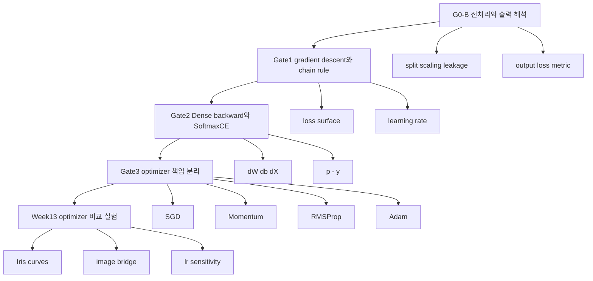

# Week13 Optimizer Visual Lecture Notebook 설계 문서

## 설계 결론

업로드된 초안의 핵심 방향은 이미 분명하다. 이번 산출물의 중심은 “옵티마이저 네 종을 구현하는 답안 노트북”이 아니라, **Week12의 Layer/Network/backward 구조를 Week13의 Optimizer 책임 분리로 확장하고, loss curve와 accuracy를 통해 학습 동역학을 해석하게 만드는 시각화 중심 강의형 실험 노트북**이다. 초안은 학습 루프를 `X_batch → net.forward → loss_fn.forward → loss_fn.backward → net.backward → optimizer.step(net)`으로 정리하고, 관찰 포인트를 optimizer 구현, Iris와 이미지 데이터 비교, learning-rate sensitivity, 그래프 기반 분석으로 잡고 있으며, 특히 “optimizer는 X/y를 보지 않고 layer가 만든 param과 grad만 본다”는 책임 경계를 핵심 기준으로 제시한다. 이 설계 문서는 그 방향을 그대로 계승하되, 논문·수학·소프트웨어 구조·교수 설계·시각화·실행 코드까지 한 줄로 이어지도록 확장한다. fileciteturn0file1

이 노트북 형식이 적합한 이유도 분명하다. 공식 Jupyter nbformat 문서는 노트북을 `metadata`, `nbformat`, `nbformat_minor`, `cells`를 가진 JSON 문서로 정의하며, 핵심 셀 타입으로 Markdown과 Code를 둔다. JupyterLab 사용자 문서는 노트북이 실행 가능한 코드와 서사 텍스트, 수식, 이미지, 상호작용 시각화를 함께 담는 문서라고 설명한다. 즉, 이번 과제처럼 **수식 설명 → toy example → 실험 코드 → 그래프 → 해석 → 체크포인트**를 같은 매체 안에서 묶어야 하는 경우, IPYNB는 단순한 코드 저장소가 아니라 설계된 학습 인터페이스가 된다. citeturn4view0turn21view0

버전 관리와 설계 문서화까지 고려하면, 최종 산출물은 **`ML_W13_PREP_VISUAL_LECTURE.ipynb`** 하나로 끝내기보다, 선택적으로 **Jupytext 기반의 `.md` 또는 `.py:percent` 페어 파일**을 함께 가지는 구성이 가장 실용적이다. Jupytext 문서는 텍스트 노트북과 페어 노트북이 버전 관리와 diff에 유리하다고 설명하고, MyST 문서는 Jupyter 프런트엔드 안에서 Markdown-first 실행 문서를 다루는 흐름을 지원한다. 이번 요청이 최종 결과를 `.md` 형식의 설계 문서로 도출하라고 명시하고 있으므로, **설계의 canonical source는 Markdown 문서**, 실행 산출물은 IPYNB로 두는 방식이 가장 잘 맞는다. citeturn26view0turn26view1

또한 노트북은 강력하지만 상태 관리가 어려운 매체이기도 하다. 재현 가능성 가이드와 최근 노트북 사용 연구들은 서사와 코드의 결합, 의존성 명시, 상태 관리, 명확한 추상화가 중요하다고 지적한다. ReSplit 연구는 셀을 더 작고 단일 목적 단위로 나누었을 때 사람이 더 선호하는 경우가 적지 않음을 보였고, Jupyter 버그 연구들은 상태·설정·API 오용이 흔한 문제 영역임을 보여준다. 따라서 이번 노트북은 **작고 자가완결적인 셀**, **고정 seed**, **Restart & Run All 기준 통과**, **각 셀의 단일 책임**을 설계 원칙으로 삼아야 한다. citeturn6academia0turn3academia3turn20academia2turn28academia0turn28academia3

## 논문과 이론 기반

이 노트북의 이론 축은 단순히 “SGD, Momentum, RMSProp, Adam을 외운다”가 아니다. AdaGrad는 과거 gradient의 기하를 반영해 좌표별로 적응적으로 step을 조정하는 방법으로 제안되었고, 드물지만 예측력 있는 feature를 다루는 데 강점을 강조했다. Adam은 여기에 1차 및 2차 moment의 지수이동평균과 편향 보정을 결합해, 대규모·잡음 환경의 first-order stochastic optimization을 위한 실용적 방법으로 제시되었다. 따라서 Week13 노트북은 네 가지 optimizer를 “암기 대상”이 아니라 **같은 gradient를 다르게 재사용하는 업데이트 규칙 계열**로 보여줘야 한다. citeturn34view0turn0academia0

수식적으로는 다음 축을 한 번에 묶어야 한다.
\[
\theta_{t+1}=\theta_t-\eta g_t
\]
는 SGD의 최소 골격이고, Momentum은 이전 이동 방향을 누적해 협곡형 손실면에서 진동을 줄이려 한다. RMSProp 계열은 squared gradient의 이동평균으로 좌표별 step scale을 조절하고, Adam은 여기에 1차 moment와 편향 보정을 더한다. 그러나 후속 연구는 adaptive method가 항상 더 좋은 해를 주는 것은 아니라고 지적했다. Wilson 등은 어떤 문제에서는 adaptive methods가 training 성능은 더 좋더라도 generalization은 SGD보다 나쁠 수 있음을 보였고, Loshchilov와 Hutter는 Adam류에서는 L2 regularization과 weight decay가 동치가 아니므로 decoupled weight decay가 중요하다고 정리했다. 따라서 노트북은 **“Adam이 빠를 수 있다”와 “Adam이 언제나 최선은 아니다”를 동시에 가르쳐야 한다.** citeturn22academia0turn22academia1turn23academia2turn23academia0

이 점은 과제 해석에도 직접 연결된다. 업로드된 초안이 강조하듯, Week13의 본질은 optimizer class를 분리해 `step(net)`에 업데이트 책임을 모으는 것이다. 즉 gradient를 만드는 주체는 loss와 backward graph이고, optimizer는 그 결과로 생성된 `param`과 `grad`에만 작동한다. 이 책임 분리는 소프트웨어적으로 깔끔할 뿐 아니라, optimizer별 학습 동역학을 같은 네트워크와 같은 gradient 흐름 위에서 공정하게 비교하게 해 준다. fileciteturn0file1

전처리와 평가지표도 같은 축 위에 있어야 한다. `train_test_split`은 출력적으로 훈련/테스트 부분집합을 나누는 함수이고, `StandardScaler`는 **훈련 샘플의 평균과 표준편차**를 저장해 이후 데이터에 적용하는 변환기다. scikit-learn의 common pitfalls 문서는 데이터를 먼저 train/test로 나눈 뒤, `fit`은 train에만 하고 test에는 `transform`만 해야 하며, 그렇지 않으면 leakage로 인해 과대평가가 생긴다고 명시한다. 업로드된 초안이 G0-B에서 split/scaling/leakage를 다시 전면에 놓은 이유가 바로 여기에 있다. citeturn14view0turn14view1turn36view0

평가 해석도 loss와 metric을 분리해 보여줘야 한다. `f1_score`는 precision과 recall의 **조화평균**이고, confusion matrix의 \(C_{i,j}\)는 **실제 클래스 \(i\)** 를 **예측 클래스 \(j\)** 로 분류한 개수를 뜻한다. 따라서 최종 노트북은 optimizer 비교를 단순 accuracy 막대그래프 하나로 끝내지 말고, **loss curve**, **final accuracy/F1**, **confusion matrix**, 필요시 **class-wise error pattern**까지 나가야 한다. 그래야 “빠르게 내려갔는가”와 “어디서 틀렸는가”를 분리해서 읽을 수 있다. citeturn19view0turn19view1

## 노트북 프레임워크와 개발 원칙

소프트웨어 구조 관점에서 이 노트북은 “강의 자료”이면서 동시에 “실험용 사양서”여야 한다. nbformat 문서는 Markdown, Code, Raw cell과 attachment, rich output을 지원하는 구조를 정의하고, JupyterLab 문서는 노트북 안에서 코드, 텍스트, 이미지, 상호작용 출력이 함께 동작함을 전제로 한다. 다시 말해, 이번 노트북은 슬라이드처럼 읽히고, 실습 노트처럼 즉시 수정 가능하며, 연구 노트처럼 실험 기록을 남겨야 한다. 따라서 섹션 구조는 **개념, 수식, 코드, 그림, 해석, 체크포인트**의 반복 패턴으로 통일하는 편이 가장 안정적이다. citeturn4view0turn21view0turn6academia0

시각화 스택은 목적별로 분리하는 것이 좋다. Matplotlib 공식 문서는 복잡한 그림에서 explicit object-oriented style, 즉 `fig, ax = plt.subplots()` 이후 `ax` 메서드를 쓰는 방식을 보여준다. Seaborn 문서는 seaborn이 matplotlib 위에서 통계 그래픽을 제공하고, distribution, categorical, relationship, pairwise view를 dataset-oriented API로 빠르게 구성한다고 설명한다. ipywidgets 문서는 `interact`가 함수 인자에 대해 자동으로 UI control을 만들어 코드와 데이터를 대화형으로 탐색하게 한다고 밝힌다. NetworkX 문서는 그래프를 matplotlib로 그릴 수 있고, `spring_layout`, `multipartite_layout`, `circular_layout` 같은 배치 알고리즘을 제공한다. 이 조합이면 **optimizer 경로는 Matplotlib**, **분포와 범주형 비교는 Seaborn**, **learning rate 슬라이더와 샘플 크기 드롭다운은 ipywidgets**, **Gate/Checkpoint 의존성 지도는 NetworkX 또는 Mermaid**로 분담할 수 있다. citeturn17view0turn15view0turn16view0turn17view1

JupyterLab 문서는 matplotlib, plotly, ipywidgets, bokeh, altair, 그리고 R 쪽 ggplot2 같은 도구를 함께 언급한다. 다만 이번 과제의 실제 실행 환경은 Python 중심이고, 업로드된 Week13 과제도 `Network`, `Dense`, `ReLU`, `SoftmaxCE`, `Optimizer`를 Python으로 가져오는 구조다. 따라서 **필수 구현은 Python-only**, **선택 확장은 R/ggplot2 또는 Plotly**로 두는 편이 맞다. 다시 말해, “R까지 가능”은 설계 문서의 확장 옵션이지, 기본 실행 경로가 되어서는 안 된다. citeturn21view0turn0file1

개발 규율도 명시적으로 넣어야 한다. 재현 가능성 가이드와 notebook quality 연구는 narrative와 code가 섞인 환경에서 의존성, state, 명확한 구조가 특히 중요하다고 지적한다. 따라서 이 노트북은 최소한 다음 네 가지 엔지니어링 규칙을 가져야 한다. 첫째, 모든 랜덤 실험은 seed를 고정한다. 둘째, 각 시각화 셀은 독립적으로 다시 실행 가능해야 한다. 셋째, 외부 다운로드에 의존하는 셀은 fallback을 가진다. 넷째, 모든 실험 결과판은 `history` 사전이나 DataFrame으로 저장해 재시각화가 가능해야 한다. 이 규칙이 있어야 노트북이 “한 번 돌아간 데모”가 아니라 “반복 가능한 강의형 실험 문서”가 된다. citeturn6academia0turn28academia0turn20academia2turn28academia3

## 데이터셋 운영안

이번 설계의 데이터 전략은 일반론보다 **업로드된 인벤토리 JSON**을 우선한다. 업로드된 인벤토리는 `sklearn_iris`, `toy_logic_gates_xor`, `keras_fashion_mnist`를 **primary**, `seaborn_titanic`과 여러 preprocessing toy 세트를 **secondary**로 두고, `keras_mnist_or_openml_mnist`는 캐시가 없거나 다운로드가 필요한 항목으로, `daisy_image_missing_local_file`은 참조 파일 누락 상태로 분리한다. 즉, 이 노트북은 처음부터 외부 다운로드에 기대지 말고 **Iris + XOR + 로컬 Fashion-MNIST 캐시 + Titanic(local cache)** 중심으로 짜는 것이 맞다. fileciteturn0file0

아래 분류가 이번 설계에 가장 적합하다.

| 운영 분류 | 데이터셋 | 설계에서의 역할 |
|---|---|---|
| 바로 이식 가능 | `sklearn_iris`, `seaborn_titanic`, `keras_fashion_mnist`, `toy_logic_gates_xor`, `toy_missing_values_week14`, `toy_scaling_week14`, `toy_categorical_encoding_week14`, `toy_datetime_features_week14` | 즉시 실행되는 메인/서브 실험 |
| 로컬에서 생성 가능 | quadratic loss surface, synthetic gradients, mock image tensors, small regression/classification toys | optimizer 경로·shape·axis·loss geometry 데모 |
| 외부 다운로드 필요 | `keras_mnist_or_openml_mnist`, `boston_housing_cmu_legacy`, `uci_appliances_energy_prediction` | 기본 경로에서는 비활성, 옵션 셀로만 유지 |
| 참조 파일 누락 | `daisy_image_missing_local_file` | 이미지 tensor 데모는 Fashion-MNIST 또는 `sklearn_digits`로 대체 |

이 분류와 우선순위는 업로드된 인벤토리의 availability 태그와 추천 목록을 따른 것이며, Iris와 Fashion-MNIST의 데이터 특성 자체는 scikit-learn 및 TensorFlow 문서와 원 논문과도 정합적이다. Iris는 150개 샘플, 4개 수치 feature, 3개 클래스의 작은 분류 데이터이고, Fashion-MNIST는 10개 클래스의 28×28 grayscale 이미지 70,000장으로 구성되며 60,000/10,000 train/test split을 갖는다. fileciteturn0file0 citeturn14view2turn12academia2turn14view3

이 구조가 좋은 이유는 역할이 명확하기 때문이다. **XOR는 chain rule과 backprop 직관**, **Iris는 optimizer 비교와 learning-rate sensitivity**, **Fashion-MNIST는 flatten, 이미지 텐서, MLP 한계와 CNN 대비 브리지**, **Titanic과 전처리 toy 세트는 leakage·결측치·categorical encoding**을 맡는다. 이렇게 분리하면 한 데이터셋에 너무 많은 의미를 억지로 실지 않게 된다. fileciteturn0file0turn0file1

외부 다운로드가 실패하거나 로컬 Fashion-MNIST 캐시가 예상과 다를 때의 fallback도 미리 설계하는 것이 좋다. scikit-learn toy dataset 문서는 `load_digits`가 외부 다운로드 없이 제공되는 8×8 이미지 분류 데이터셋이라고 설명한다. 따라서 이미지 분류 섹션의 비상 대체재는 원본 MNIST보다 `sklearn_digits`가 낫다. 이 선택은 배포 안정성과 수업 실행 성공률을 크게 높인다. citeturn27view0

한편 Boston housing 계열은 기본 노트북의 메인 예제로 두지 않는 편이 맞다. 업로드된 인벤토리 자체가 이를 legacy이자 윤리적 주의가 필요한 항목으로 표시하고 있고, Week13의 핵심은 optimizer와 학습 동역학이지 회귀 데이터셋 자체의 사회적 논점을 다루는 것이 아니기 때문이다. 그러므로 Boston은 “추가 참고” 또는 “왜 메인에서 제외했는가”를 설명하는 짧은 note로만 남기는 것이 설계상 더 일관적이다. fileciteturn0file0

## 체크포인트와 교수 설계

교수 설계 측면에서 가장 잘 맞는 구조는 **모델링 → 가이드 실험 → 독립 변형 → 반성적 서술**의 흐름이다. 인지적 도제식 모델은 modeling, coaching, scaffolding, reflection, fading 같은 요소를 강조하고, worked-example 계열은 초보자의 문제 해결 검색 부담을 낮추기 위해 잘 풀린 예시와 구조적 비교를 먼저 제공하는 것이 효과적이라고 본다. 이번 노트북은 이를 코드 학습 맥락으로 옮겨, **먼저 정답에 가까운 micro-example을 보여주고**, 그 뒤에 **학습자가 lr, batch size, optimizer, flatten 여부를 바꾸며 직접 차이를 관찰**하게 만드는 편이 가장 적합하다. citeturn30search2turn30search1

초안이 제시한 G0-B → Gate1 → Gate2 → Gate3 → Week13 흐름은 그대로 유지하되, 각 구간을 “시험 대비”가 아니라 “오개념 방지용 해부 지점”으로 바꾸는 것이 중요하다. 특히 사용자의 약점으로 지목된 shape/axis와 책임 분리는 매 모듈에서 반복 체크되어야 한다. 다시 말해, 각 셀의 질문은 “이 수식이 맞는가”보다 “**이 시점에 어떤 shape가 오가고, 누가 무엇을 소유하고, 무엇을 업데이트하는가**”에 초점을 맞춰야 한다. fileciteturn0file1



이 흐름을 실제 실행 체크포인트로 옮기면 아래와 같다.

| 모듈 | 핵심 질문 | 대표 시각화 | 흔한 실패 | 통과 기준 |
|---|---|---|---|---|
| V00 전체 지도 | 왜 지금 이 노트북이 필요한가 | 의존성 그래프 | 과제를 개별 문제로만 봄 | G0-B와 Week13의 연결을 말로 설명 |
| V01 전처리·출력 | split/scaling/loss/metric이 왜 먼저인가 | leakage 비교 히스토그램, sigmoid/softmax/CE, F1 곡선 | fit을 split 전에 함, loss와 metric 혼동 | train-only fit과 metric 해석 구분 |
| V02 미분·최적화 | gradient는 왜 반대 방향으로 가는가 | 1D/2D loss surface와 trajectory | lr 크기와 발산/진동 감 없음 | lr 변화에 따른 경로 차이 설명 |
| V03 backward 구조 | dW, db, dX는 무엇인가 | Dense/gradient heatmap, ReLU mask, `p-y` | axis 오류, dX/dW 혼동 | 각 gradient의 목적을 구분 |
| V04 optimizer 구조 | 같은 gradient로 왜 경로가 달라지는가 | contour 위 optimizer path | optimizer를 black box로만 이해 | state와 update intuition 설명 |
| V05 과제 브리지 | 어떤 그래프를 보고 어떤 답안을 쓰는가 | loss curve, final acc/F1, confusion matrix | 빠른 수렴=항상 좋은 모델로 오해 | 관찰-원인-제한-결론 서술 가능 |

이 구조는 Jupyter 문서가 말하는 narrative notebook의 장점과 recent notebook research가 요구하는 state/abstraction 관리 요구를 동시에 만족한다. 또한 초안이 요구하는 “각 체크포인트의 연계성, 세부 노드, 대응 시각 방법, 예제, 코드”를 한 모듈-한 질문-한 그림-한 체크포인트 방식으로 구현하게 해 준다. citeturn21view0turn28academia0turn6academia0

## 최종 .md 설계문서 초안

아래 블록은 **그대로 Markdown 설계 문서**의 시작부로 사용할 수 있는 템플릿이다. 이 문서는 Jupytext로 `.md`와 `.ipynb`를 페어링하거나, 별도 설계 문서로 유지하는 용도에 맞다. nbformat과 Jupytext/MyST 흐름을 고려하면 이런 **Markdown-first 사양서 + 실행 IPYNB** 구조가 가장 관리하기 쉽다. citeturn4view0turn26view0turn26view1

```markdown
# ML_W13_PREP_VISUAL_LECTURE

## 목적
이 노트북은 Week13 과제를 직접 푸는 답안 노트북이 아니라,
Week12의 Layer/Network/backward 구조가 Week13의 Optimizer 책임 분리로
어떻게 확장되는지 시각적으로 학습하기 위한 lecture companion notebook이다.

## 핵심 학습 루프
X_batch
→ net.forward
→ loss_fn.forward
→ loss_fn.backward
→ net.backward
→ optimizer.step(net)

## 설계 원칙
- 모든 섹션은 개념 → 수식 → toy data → 시각화 → 해석 → 체크포인트 순서를 따른다.
- 모든 실험은 seed를 고정한다.
- 외부 다운로드가 필요한 데이터는 기본 경로에서 제외하고 fallback을 둔다.
- optimizer는 param과 grad만 본다.
- train/test split은 모든 preprocessing보다 먼저 수행한다.

## 데이터 정책
- Primary: sklearn_iris, toy_logic_gates_xor, keras_fashion_mnist
- Secondary: seaborn_titanic, toy_missing_values_week14, toy_scaling_week14
- Deferred: keras_mnist_or_openml_mnist, boston_housing_cmu_legacy, uci_appliances_energy_prediction
- Missing reference: daisy_image_missing_local_file

## 모듈 인덱스
- V00: 전체 의존성 지도
- V01: preprocessing / output / loss / metric
- V02: gradient descent / chain rule
- V03: Dense.backward / ReLU / SoftmaxCE
- V04: SGD / Momentum / RMSProp / Adam
- V05: Iris / Fashion-MNIST bridge / learning-rate sensitivity

## Definition of Done
- V01에서 leakage를 시각적으로 설명할 수 있다.
- V02에서 learning rate가 경로를 어떻게 바꾸는지 설명할 수 있다.
- V03에서 dW, db, dX, p-y의 의미를 구분할 수 있다.
- V04에서 optimizer state 차이를 설명할 수 있다.
- V05에서 그래프를 근거로 optimizer 선택 이유를 서술할 수 있다.
```

아래 첫 코드 블록은 **인벤토리 우선 실행 셀**이다. 업로드된 JSON이 있으면 그것을 읽고, 없으면 기본 registry를 사용한다. 또한 `train_test_split`과 `StandardScaler`를 train-only fit 규칙에 맞춰 쓰도록 뼈대를 잡는다. scikit-learn 문서와 inventory 방침을 설계에 직접 반영한 셀이다. fileciteturn0file0 citeturn14view0turn14view1turn36view0

```python
import json
import gzip
import struct
from pathlib import Path

import numpy as np
import pandas as pd
import matplotlib.pyplot as plt
import seaborn as sns

from sklearn.datasets import load_iris, load_digits
from sklearn.model_selection import train_test_split
from sklearn.preprocessing import StandardScaler
from sklearn.metrics import accuracy_score, f1_score, confusion_matrix

np.random.seed(42)
sns.set_theme(style="whitegrid")
plt.rcParams["figure.figsize"] = (8, 5)

INVENTORY_CANDIDATES = [
    Path("dataset_inventory_for_ML_W13_PREP.json"),
    Path("/mnt/data/dataset_inventory_for_ML_W13_PREP.json"),
]

DEFAULT_REGISTRY = {
    "primary": ["sklearn_iris", "toy_logic_gates_xor", "keras_fashion_mnist"],
    "secondary": ["seaborn_titanic", "toy_missing_values_week14", "toy_scaling_week14"],
    "deferred": ["keras_mnist_or_openml_mnist", "boston_housing_cmu_legacy", "uci_appliances_energy_prediction"],
    "missing": ["daisy_image_missing_local_file"],
}

def load_inventory():
    for path in INVENTORY_CANDIDATES:
        if path.exists():
            with open(path, "r", encoding="utf-8") as f:
                raw = json.load(f)
            return raw
    return None

inventory = load_inventory()

if inventory is not None:
    print("Inventory loaded.")
    print("Primary:", [x["dataset_id"] for x in inventory["recommended_for_ML_W13_PREP_VISUAL_LECTURE"]["primary"]])
    print("Secondary:", [x["dataset_id"] for x in inventory["recommended_for_ML_W13_PREP_VISUAL_LECTURE"]["secondary"]])
    print("Avoid/Defer:", [x["dataset_id"] for x in inventory["recommended_for_ML_W13_PREP_VISUAL_LECTURE"]["avoid_or_defer"]])
else:
    print("Inventory file not found. Using DEFAULT_REGISTRY.")
    print(DEFAULT_REGISTRY)
```

아래 셀은 **Fashion-MNIST 로컬 캐시 우선, 실패 시 `sklearn_digits` fallback**을 구현한 것이다. TensorFlow 튜토리얼은 Fashion-MNIST가 28×28 grayscale 이미지 10개 클래스로 구성된 직접 로드 가능한 입문용 데이터라고 설명하고, scikit-learn 문서는 digits가 다운로드 없는 toy image dataset이라고 설명한다. 인벤토리가 “로컬 IDX gzip cache 존재”를 가정하고 있으므로, 코드도 같은 가정을 우선 반영한다. fileciteturn0file0 citeturn14view3turn27view0

```python
def read_idx_gzip(path: Path) -> np.ndarray:
    with gzip.open(path, "rb") as f:
        zero, dtype_code, ndim = struct.unpack(">HBB", f.read(4))
        shape = tuple(struct.unpack(">I", f.read(4))[0] for _ in range(ndim))
        data = np.frombuffer(f.read(), dtype=np.uint8)
    return data.reshape(shape)

def find_fashion_mnist_cache():
    roots = [
        Path.home() / ".keras" / "datasets",
        Path.home() / ".keras" / "datasets" / "fashion-mnist",
        Path("/mnt/data"),
        Path.cwd(),
    ]
    required = {
        "train_images": "train-images-idx3-ubyte.gz",
        "train_labels": "train-labels-idx1-ubyte.gz",
        "test_images": "t10k-images-idx3-ubyte.gz",
        "test_labels": "t10k-labels-idx1-ubyte.gz",
    }
    for root in roots:
        files = {k: root / v for k, v in required.items()}
        if all(p.exists() for p in files.values()):
            return files
        nested = {k: root / "fashion-mnist" / v for k, v in required.items()}
        if all(p.exists() for p in nested.values()):
            return nested
    return None

def load_image_dataset(prefer="fashion_mnist", flatten=True, max_train=None, max_test=None):
    if prefer == "fashion_mnist":
        cache = find_fashion_mnist_cache()
        if cache is not None:
            X_train = read_idx_gzip(cache["train_images"]).astype(np.float32) / 255.0
            y_train = read_idx_gzip(cache["train_labels"]).astype(np.int64)
            X_test = read_idx_gzip(cache["test_images"]).astype(np.float32) / 255.0
            y_test = read_idx_gzip(cache["test_labels"]).astype(np.int64)

            if max_train is not None:
                X_train, y_train = X_train[:max_train], y_train[:max_train]
            if max_test is not None:
                X_test, y_test = X_test[:max_test], y_test[:max_test]

            class_names = [
                "T-shirt/top", "Trouser", "Pullover", "Dress", "Coat",
                "Sandal", "Shirt", "Sneaker", "Bag", "Ankle boot"
            ]

            if flatten:
                X_train = X_train.reshape(len(X_train), -1)
                X_test = X_test.reshape(len(X_test), -1)

            return {
                "name": "fashion_mnist_local_cache",
                "X_train": X_train, "y_train": y_train,
                "X_test": X_test, "y_test": y_test,
                "class_names": class_names
            }

    digits = load_digits()
    X = digits.images.astype(np.float32) / 16.0
    y = digits.target.astype(np.int64)
    X_train, X_test, y_train, y_test = train_test_split(
        X, y, test_size=0.2, random_state=42, stratify=y
    )
    if flatten:
        X_train = X_train.reshape(len(X_train), -1)
        X_test = X_test.reshape(len(X_test), -1)

    return {
        "name": "sklearn_digits_fallback",
        "X_train": X_train, "y_train": y_train,
        "X_test": X_test, "y_test": y_test,
        "class_names": [str(i) for i in range(10)]
    }

img_ds = load_image_dataset(prefer="fashion_mnist", flatten=True, max_train=12000, max_test=2000)
print(img_ds["name"], img_ds["X_train"].shape, img_ds["X_test"].shape)
```

아래 셀은 **Gate3의 핵심 시각화**, 즉 동일한 2D quadratic loss에서 optimizer별 경로를 비교하는 셀이다. Adam의 moment estimation, adaptive method의 동작 차이, 학습률 민감도는 이렇게 단순한 손실면에서 가장 먼저 보이는 경우가 많다. 이 셀은 optimizer를 “수식에서 그림으로” 옮기는 핵심 데모가 된다. citeturn0academia0turn22academia0turn23academia2

```python
def quad_loss(w):
    return 0.1 * w[0]**2 + 2.0 * w[1]**2

def quad_grad(w):
    return np.array([0.2 * w[0], 4.0 * w[1]], dtype=np.float64)

def simulate_optimizer(name, start=(4.0, 4.0), lr=0.1, steps=40,
                       mu=0.9, beta=0.9, beta1=0.9, beta2=0.999, eps=1e-8):
    w = np.array(start, dtype=np.float64)
    path = [w.copy()]
    v = np.zeros_like(w)
    m = np.zeros_like(w)
    s = np.zeros_like(w)

    for t in range(1, steps + 1):
        g = quad_grad(w)

        if name == "sgd":
            w = w - lr * g

        elif name == "momentum":
            v = mu * v - lr * g
            w = w + v

        elif name == "rmsprop":
            s = beta * s + (1 - beta) * (g ** 2)
            w = w - lr * g / (np.sqrt(s) + eps)

        elif name == "adam":
            m = beta1 * m + (1 - beta1) * g
            s = beta2 * s + (1 - beta2) * (g ** 2)
            m_hat = m / (1 - beta1 ** t)
            s_hat = s / (1 - beta2 ** t)
            w = w - lr * m_hat / (np.sqrt(s_hat) + eps)

        else:
            raise ValueError(f"Unknown optimizer: {name}")

        path.append(w.copy())

    return np.array(path)

paths = {
    "SGD": simulate_optimizer("sgd", lr=0.15),
    "Momentum": simulate_optimizer("momentum", lr=0.08, mu=0.9),
    "RMSProp": simulate_optimizer("rmsprop", lr=0.15, beta=0.9),
    "Adam": simulate_optimizer("adam", lr=0.2, beta1=0.9, beta2=0.999),
}

x = np.linspace(-5, 5, 300)
y = np.linspace(-5, 5, 300)
Xg, Yg = np.meshgrid(x, y)
Z = 0.1 * Xg**2 + 2.0 * Yg**2

fig, ax = plt.subplots(figsize=(8, 6))
ax.contour(Xg, Yg, Z, levels=25)
for name, path in paths.items():
    ax.plot(path[:, 0], path[:, 1], marker="o", markersize=2, label=name)
ax.set_title("Optimizer trajectories on an anisotropic quadratic loss")
ax.set_xlabel("w1")
ax.set_ylabel("w2")
ax.legend()
plt.tight_layout()
plt.show()
```

아래 셀은 **Gate2의 shape/axis/gradient 역할 분리**를 위해 꼭 넣어야 하는 백워드 시각화 셀이다. Dense layer의 `Z = X @ W.T + b`, backward의 `dW`, `db`, `dX`, 그리고 Softmax-CE에서 자주 등장하는 `p-y`를 숫자 배열로 직접 보여준다. 초안이 특히 경고한 shape/axis 오개념을 바로 겨냥하는 블록이다. fileciteturn0file1

```python
def softmax(logits):
    shifted = logits - logits.max(axis=1, keepdims=True)
    exp = np.exp(shifted)
    return exp / exp.sum(axis=1, keepdims=True)

B, n_in, n_out = 4, 3, 2
rng = np.random.default_rng(42)

X = rng.normal(size=(B, n_in))
W = rng.normal(size=(n_out, n_in))
b = rng.normal(size=(n_out,))
Z = X @ W.T + b

dZ = rng.normal(size=(B, n_out))
dW = dZ.T @ X
db = dZ.sum(axis=0)
dX = dZ @ W

fig, axes = plt.subplots(2, 3, figsize=(12, 7))
sns.heatmap(X, annot=True, fmt=".2f", cmap="coolwarm", ax=axes[0, 0]); axes[0, 0].set_title("X (B, n_in)")
sns.heatmap(W, annot=True, fmt=".2f", cmap="coolwarm", ax=axes[0, 1]); axes[0, 1].set_title("W (n_out, n_in)")
sns.heatmap(Z, annot=True, fmt=".2f", cmap="coolwarm", ax=axes[0, 2]); axes[0, 2].set_title("Z = X @ W.T + b")
sns.heatmap(dZ, annot=True, fmt=".2f", cmap="coolwarm", ax=axes[1, 0]); axes[1, 0].set_title("incoming grad dZ")
sns.heatmap(dW, annot=True, fmt=".2f", cmap="coolwarm", ax=axes[1, 1]); axes[1, 1].set_title("dW = dZ.T @ X")
sns.heatmap(dX, annot=True, fmt=".2f", cmap="coolwarm", ax=axes[1, 2]); axes[1, 2].set_title("dX = dZ @ W")
plt.tight_layout()
plt.show()

logits = np.array([[2.0, 1.0, 0.1],
                   [0.2, 1.5, 2.0]])
y_onehot = np.array([[1, 0, 0],
                     [0, 0, 1]])
probs = softmax(logits)
delta = probs - y_onehot

fig, axes = plt.subplots(1, 3, figsize=(12, 3.5))
sns.heatmap(logits, annot=True, fmt=".2f", cmap="vlag", ax=axes[0]); axes[0].set_title("logits")
sns.heatmap(probs, annot=True, fmt=".2f", cmap="Blues", ax=axes[1]); axes[1].set_title("softmax(logits)")
sns.heatmap(delta, annot=True, fmt=".2f", cmap="vlag", center=0, ax=axes[2]); axes[2].set_title("p - y")
plt.tight_layout()
plt.show()
```

마지막으로 아래 셀은 **Week13 과제에 연결되는 course-adapter 실험 셀**이다. 업로드된 초안의 핵심 루프를 살리면서, optimizer만 바꿔 공정 비교가 되도록 history를 수집한다. 코스의 `neural_network_v2` 인터페이스가 약간 다를 수 있으므로 한두 줄은 로컬 환경에 맞춰 조정해야 하지만, 설계의 골격 자체는 그대로 적용된다. Iris는 작고 빠른 기준선, 이미지 데이터는 flatten bridge로 두는 설계를 전제한다. fileciteturn0file1turn0file0 citeturn14view2turn14view3

```python
# 이 셀은 course-specific API를 가정한다.
# local environment에 맞게 import 경로와 네트워크 생성부만 조정하면 된다.

import numpy as np
import matplotlib.pyplot as plt

from sklearn.datasets import load_iris
from sklearn.model_selection import train_test_split
from sklearn.preprocessing import StandardScaler
from sklearn.metrics import accuracy_score, f1_score, confusion_matrix

# 예시:
# from neural_network_v2 import Network, Dense, ReLU, SoftmaxCE
# from my_week13_solution import MySGD, MyMomentum, MyRMSProp, MyAdam

def one_hot(y, n_classes):
    out = np.zeros((len(y), n_classes), dtype=np.float64)
    out[np.arange(len(y)), y] = 1.0
    return out

def load_iris_prepared(test_size=0.2, random_state=42):
    ds = load_iris()
    X = ds.data.astype(np.float64)
    y = ds.target.astype(np.int64)

    X_train, X_test, y_train, y_test = train_test_split(
        X, y, test_size=test_size, random_state=random_state, stratify=y
    )

    scaler = StandardScaler()
    X_train = scaler.fit_transform(X_train)
    X_test = scaler.transform(X_test)

    return X_train, X_test, y_train, y_test, ds.target_names

def iter_minibatches(X, y, batch_size=16, shuffle=True, seed=42):
    rng = np.random.default_rng(seed)
    idx = np.arange(len(X))
    if shuffle:
        rng.shuffle(idx)
    for start in range(0, len(X), batch_size):
        batch_idx = idx[start:start+batch_size]
        yield X[batch_idx], y[batch_idx]

def evaluate_classifier(net, X, y):
    logits = net.forward(X)
    pred = logits.argmax(axis=1)
    return {
        "acc": accuracy_score(y, pred),
        "macro_f1": f1_score(y, pred, average="macro"),
        "cm": confusion_matrix(y, pred),
    }

def train_course_model(
    net_factory,
    loss_factory,
    opt_factory,
    epochs=80,
    batch_size=16,
    seed=42,
):
    np.random.seed(seed)
    X_train, X_test, y_train, y_test, class_names = load_iris_prepared()

    net = net_factory()
    loss_fn = loss_factory()
    optimizer = opt_factory()

    history = {
        "train_loss": [],
        "test_acc": [],
        "test_macro_f1": [],
    }

    for epoch in range(epochs):
        epoch_losses = []
        for Xb, yb in iter_minibatches(X_train, y_train, batch_size=batch_size, shuffle=True, seed=seed + epoch):
            logits = net.forward(Xb)

            # local API에 맞게 아래 두 줄은 조정 가능
            loss = loss_fn.forward(logits, yb)
            dlogits = loss_fn.backward()

            net.backward(dlogits)
            optimizer.step(net)

            epoch_losses.append(float(loss))

        metrics = evaluate_classifier(net, X_test, y_test)
        history["train_loss"].append(np.mean(epoch_losses))
        history["test_acc"].append(metrics["acc"])
        history["test_macro_f1"].append(metrics["macro_f1"])

    return history, metrics["cm"], class_names

def plot_history_dict(histories, title="Optimizer comparison on Iris"):
    fig, axes = plt.subplots(1, 2, figsize=(12, 4))
    for name, hist in histories.items():
        axes[0].plot(hist["train_loss"], label=name)
        axes[1].plot(hist["test_acc"], label=name)
    axes[0].set_title("Train loss")
    axes[1].set_title("Test accuracy")
    axes[0].set_xlabel("Epoch"); axes[1].set_xlabel("Epoch")
    axes[0].legend(); axes[1].legend()
    fig.suptitle(title)
    plt.tight_layout()
    plt.show()

# 사용 예시
# histories = {}
# for name, OptCls, kw in [
#     ("SGD", MySGD, {"lr": 0.05}),
#     ("Momentum", MyMomentum, {"lr": 0.03, "mu": 0.9}),
#     ("RMSProp", MyRMSProp, {"lr": 0.01, "beta": 0.9}),
#     ("Adam", MyAdam, {"lr": 0.01, "beta1": 0.9, "beta2": 0.999}),
# ]:
#     hist, cm, class_names = train_course_model(
#         net_factory=lambda: Network([Dense(4, 16), ReLU(), Dense(16, 3)]),
#         loss_factory=lambda: SoftmaxCE(),
#         opt_factory=lambda OptCls=OptCls, kw=kw: OptCls(**kw),
#         epochs=100,
#         batch_size=16,
#         seed=42,
#     )
#     histories[name] = hist
# plot_history_dict(histories)
```

## 전문 설계 문서 인덱스

이번 노트북 설계를 지탱하는 전문 문서 묶음은 다섯 갈래로 보는 것이 가장 효율적이다. **노트북 사양과 저작**, **시각화 API**, **데이터·전처리·평가 문서**, **optimizer 원 논문**, **노트북 소프트웨어공학/재현가능성 연구**다. 이 다섯 묶음을 분리해 참고하면, 설계 문서와 실행 노트북이 서로 충돌하지 않는다. citeturn4view0turn21view0turn26view0turn26view1turn6academia0

**노트북 사양과 저작 인덱스**는 다음으로 충분하다. nbformat 문서는 `.ipynb`의 셀/메타데이터 구조를 정의하고, JupyterLab 문서는 노트북 UI와 시각화 지원 범위를 설명한다. Jupytext와 MyST는 `.md` 기반의 설계 문서와 실행 노트북을 연결하는 가장 실용적인 방법이다. 이번 요청처럼 “최종 도출은 `.md`, 실제 실행은 `.ipynb`”인 경우 이 인덱스가 핵심이다. citeturn4view0turn21view0turn26view0turn26view1

**시각화 인덱스**는 Matplotlib, seaborn, ipywidgets, NetworkX로 정리하면 된다. Matplotlib는 contour, line, heatmap의 정밀 제어를, seaborn은 distribution/categorical/pairwise 통계 그래프를, ipywidgets는 slider/dropdown 기반 상호작용을, NetworkX는 gate/checkpoint 그래프 시각화를 맡는다. 이 이상으로 Plotly나 R/ggplot2를 추가하는 것은 가능하지만, 기본 강의 노트북의 필수 의존성으로는 과하다. citeturn17view0turn15view0turn16view0turn17view1turn21view0

**데이터·전처리·평가 인덱스**는 scikit-learn과 TensorFlow의 공식 문서가 표준이다. `train_test_split`, `StandardScaler`, common pitfalls, Iris dataset, confusion matrix, F1 score, Fashion-MNIST 튜토리얼이면 이 노트북에 필요한 거의 모든 데이터 처리 규칙과 metric 정의가 충족된다. 특히 leakage와 train-only fit 규칙은 반드시 이 문서군을 기준선으로 삼는 것이 좋다. citeturn14view0turn14view1turn36view0turn14view2turn19view0turn19view1turn14view3

**optimizer 논문 인덱스**는 AdaGrad, Adam, adaptive-vs-SGD generalization, Adam convergence, AdamW 정도로 최소 세트를 구성하면 충분하다. AdaGrad는 per-coordinate adaptation의 출발점, Adam은 bias-corrected first/second moments의 대표 공식, Wilson 등은 adaptive method의 generalization 경고, Reddi 등은 Adam convergence caveat, Loshchilov & Hutter는 AdamW와 decoupled weight decay의 설계 이유를 제공한다. 이 다섯 문서만 있어도 학생이 “왜 optimizer 그래프 해석이 필요한가”를 논문 수준에서 설명할 수 있다. citeturn34view0turn0academia0turn22academia0turn23academia2turn22academia1

**노트북 소프트웨어공학 인덱스**는 Rule 등의 reproducibility 가이드, ReSplit, Wang·Li·Zeller의 notebook quality 분석, Huang 등의 최신 관찰 연구가 중심이 된다. 이들은 모두 공통적으로 노트북이 단순한 스크립트가 아니며, state·dependency·cell granularity·abstraction 관리가 품질의 핵심이라고 말한다. 따라서 이번 설계 문서는 교육 문서이면서 동시에 작은 개발 명세서처럼 쓰는 것이 맞다. 그 자체가 요구사항과 품질 기준을 담아야 하기 때문이다. citeturn6academia0turn3academia3turn28academia3turn28academia0

이 인덱스를 종합하면, 최종 결론은 간단하다. **이번 노트북은 “optimizer homework preparation notebook”이 아니라, “책임 분리·학습 동역학·전처리 규율·시각적 해석”을 하나의 계산 가능한 서사 안에서 묶는 개발형 교육 문서**로 설계되어야 한다. 업로드된 초안이 제시한 방향과 업로드된 인벤토리의 데이터 우선순위는 그대로 유지하되, 실제 구현은 Jupyter 문서 규격, scikit-learn/TensorFlow 공식 데이터·평가 문서, optimizer 원 논문, notebook engineering 연구를 기준으로 정교화하는 것이 가장 타당하다. fileciteturn0file1turn0file0 citeturn4view0turn21view0turn14view1turn36view0turn0academia0turn22academia1
