# Problem 2 IPYNB Transcript Before Part D
- Source notebook: `ML/final_exam/problem2 (1).ipynb`
- Included range: cells `0` through `49`
- Stopped before: cell `50` (`Part D`)
- Method: notebook cell order preserved; markdown/code/text outputs transcribed; image outputs extracted and linked.

---

## Cell 0 - markdown

# 기말고사 문제 2 — Beijing PM2.5 회귀 분석

> **기계학습 라이브러리 활용** · 기말 Take-home Exam
> 배점: **25점** (Part B 6 + Part C 14 + Part D 5)  ·  데이터 전처리(Part A)는 제공 코드

---

## 📌 시험 안내 (필독)

### 데이터
- **출처**: UCI ML Repository — Beijing PM2.5 Data Set
- **URL**: `https://raw.githubusercontent.com/jbrownlee/Datasets/master/pollution.csv`
- **샘플**: 43,824개 (시간별, 5년치)
- **타겟**: `pm2.5` 컬럼 (회귀)
- **특성**: 결측치 있음, 범주형(`cbwd` 풍향) 포함

---

---

## Cell 1 - markdown

## ⚠️ 학번 입력 (필수)

다음 셀의 `STUDENT_ID` 변수에 본인 학번을 입력하세요.
**입력하지 않으면 0점 처리됩니다.**

---

## Cell 2 - code

Execution count: `89`

````python
STUDENT_ID = "3085"   # ← 본인 학번 마지막 4자리로 변경
SEED = int(STUDENT_ID)

assert STUDENT_ID != "0000", "학번을 입력하세요!"
print(f'학번(끝4자리): {STUDENT_ID}, SEED: {SEED}')
````

### Outputs

#### Output 0 - stream

Stream: `stdout`

````text
학번(끝4자리): 3085, SEED: 3085
````

---

## Cell 3 - markdown

## 환경 준비

필요한 라이브러리를 import하고 seed를 고정.

**요구사항**:
- numpy, pandas, matplotlib
- tensorflow, keras
- sklearn (train_test_split, StandardScaler)
- numpy와 tensorflow 모두 SEED로 고정

---

## Cell 4 - code

Execution count: `90`

````python
import os
os.environ['TF_CPP_MIN_LOG_LEVEL'] = '3'

import numpy as np
import pandas as pd
import matplotlib.pyplot as plt
import seaborn as sns
import keras
from keras import Sequential
from keras.layers import Dense, Dropout, BatchNormalization, Activation
from keras.regularizers import l2
from keras.callbacks import EarlyStopping

from sklearn.model_selection import train_test_split
from sklearn.preprocessing import StandardScaler, MinMaxScaler, LabelEncoder
from sklearn.metrics import confusion_matrix, classification_report

# 재현성: 학번 기반 SEED로 고정 (numpy + 현재 keras 백엔드 동시 고정)
np.random.seed(SEED)
keras.utils.set_random_seed(SEED)

print('Keras  :', keras.__version__, '| backend:', keras.backend.backend())
print('pandas :', pd.__version__)
````

### Outputs

#### Output 0 - stream

Stream: `stdout`

````text
Keras  : 3.14.1 | backend: tensorflow
pandas : 3.0.2
````

---

## Cell 5 - markdown

---
데이터 전처리 (제공 코드 · 채점 제외)

## A1. 데이터 로드 및 결측치 처리 

1. URL에서 데이터를 로드
2. 전체 결측치 개수를 출력
3. 어느 컬럼에 결측치가 있는지 출력

**출력**:
- 원본 데이터 shape
- 처리 전 결측치 개수
- 처리 후 결측치 개수

---

## Cell 6 - code

Execution count: `91`

````python
# 데이터 로드
url = 'https://raw.githubusercontent.com/jbrownlee/Datasets/master/pollution.csv'
df = pd.read_csv(url)

print('=== 원본 데이터 ===')
print(f'Shape: {df.shape}')
print(f'결측치 총 개수: {df.isnull().sum().sum()}')
print(f'결측치 컬럼별:\n{df.isnull().sum()[df.isnull().sum() > 0]}')

print(df.head(10))

print(df.tail(10))
print(df.info())
print(df.describe())

# 컬럼 목록
print(f'Columns: {df.columns}') 
#Index(['No', 'year', 'month', 'day', 'hour', 'pm2.5', 'DEWP', 'TEMP', 'PRES','cbwd', 'Iws', 'Is', 'Ir'],
print(df.columns.tolist())
#['No', 'year', 'month', 'day', 'hour', 'pm2.5', 'DEWP', 'TEMP', 'PRES', 'cbwd', 'Iws', 'Is', 'Ir']
print(df.dtypes)
display(df.head())

print(' === 1단계 : 컬럼 역할 1차 정리 ===')
# 데이터프레임을 바탕으로, 데이터샘플의 컬럼과 의미를 이해함이 목적.
# 트랜스포즈(전치)하지 않고, 모든 텍스트 전부 들어가게 출력
from IPython.display import display, HTML

col_info = pd.DataFrame({
    'column': ['No', 'year', 'month', 'day', 'hour', 'pm2.5', 'DEWP', 'TEMP', 'PRES', 'cbwd', 'Iws', 'Is', 'Ir'],
    '1_초기분류': [
        'id',
        'time',
        'time',
        'time',
        'time',
        'target',
        'numeric_feature',
        'numeric_feature',
        'numeric_feature',
        'categorical_feature',
        'numeric_feature',
        'numeric_feature',
        'numeric_feature'
    ],
    '2_라벨': [
        '행 번호. 관측 순서 또는 ID, = ~feature',
        '관측 연도',
        '관측 월',
        '관측 일',
        '관측 시각',
        'PM2.5 초미세먼지 농도. µg/m³단위',
        'Dew Point, ℃, 이슬점 //습도 상태를 나타내는 기상 feature',
        'Temperature, ℃, 기온 //계절, 난방, 대기 안정성과 연결되는 feature',
        'Pressure, hPa, 기압고기압/저기 // 대기 정체와 관련된 feature',
        'Combined Wind Direction, 풍향, NW, NE, SE, 등 범주형, // 풍향+본데이터에선 오염물질질 유입/확산 방향 feature',
        'Cumulated Wind Speed, 누적 풍속. m/s // 풍향에 따른 확산 정도 feature, 누적 풍속',
        'Cumulated hours of Snow, IS, 시간, 누적 눈 시간 // 강수·계절(겨울) feature',
        'Cumulated hours of rain, IR, 누적 비 시간. // 누적강수량, 본 데이터에선 대기오염 개선 효과 feature'
    ],
    '3_도메인심화' : [
        'N/A',
        'N/A',
        'N/A',
        'N/A',
        'N/A',
        'Particulate Matter 2.5 / (m2.5 = 100)=공기 1m³ 안에 PM2.5 질량 100µg. 대기오염의 결과값.',
        'DEWP가 그 기온(TEMP = 기온)에 비해 가까우면 공기가 습한 편으로 해석. ',
        '계절성과 생활·산업 활동의 proxy 역할 / 겨울에는 난방, 대기 정체 OR 여름에는 대기혼합 등',
        '“공기가 잘 섞이는 상태인가, 정체되는 상태인가”, 고기압성? 저기압? =강한 바람·강수 상황? ',
        'NW는 북서풍, NE는 북동풍, SE는 남동풍. cv는 보통 calm/variable',
        '“공기가 얼마나 많이 이동했는가”=환기·확산 능력',
        'wet deposition, 즉 세정 효과 + 계절요인',
        '상동'
    ]
})

# 각 셀의 줄 바꿈이 발생하도록 style 확장 (css =pre-line 적용)
styles = [
    dict(selector="td", props=[("white-space", "pre-line"), ("max-width", "320px")]),
    dict(selector="th", props=[("white-space", "pre-line")])
]
display(HTML(col_info.style.set_table_styles(styles).set_properties(**{'height': 'auto'}).to_html()))
````

### Outputs

#### Output 0 - stream

Stream: `stdout`

````text
=== 원본 데이터 ===
Shape: (43824, 13)
결측치 총 개수: 2067
결측치 컬럼별:
pm2.5    2067
dtype: int64
   No  year  month  day  hour  pm2.5  DEWP  TEMP    PRES cbwd    Iws  Is  Ir
0   1  2010      1    1     0    NaN   -21 -11.0  1021.0   NW   1.79   0   0
1   2  2010      1    1     1    NaN   -21 -12.0  1020.0   NW   4.92   0   0
2   3  2010      1    1     2    NaN   -21 -11.0  1019.0   NW   6.71   0   0
3   4  2010      1    1     3    NaN   -21 -14.0  1019.0   NW   9.84   0   0
4   5  2010      1    1     4    NaN   -20 -12.0  1018.0   NW  12.97   0   0
5   6  2010      1    1     5    NaN   -19 -10.0  1017.0   NW  16.10   0   0
6   7  2010      1    1     6    NaN   -19  -9.0  1017.0   NW  19.23   0   0
7   8  2010      1    1     7    NaN   -19  -9.0  1017.0   NW  21.02   0   0
8   9  2010      1    1     8    NaN   -19  -9.0  1017.0   NW  24.15   0   0
9  10  2010      1    1     9    NaN   -20  -8.0  1017.0   NW  27.28   0   0
          No  year  month  day  hour  pm2.5  DEWP  TEMP    PRES cbwd     Iws  \
43814  43815  2014     12   31    14    9.0   -27   1.0  1032.0   NW  196.21   
43815  43816  2014     12   31    15   11.0   -26   1.0  1032.0   NW  205.15   
43816  43817  2014     12   31    16    8.0   -23   0.0  1032.0   NW  214.09   
43817  43818  2014     12   31    17    9.0   -22  -1.0  1033.0   NW  221.24   
43818  43819  2014     12   31    18   10.0   -22  -2.0  1033.0   NW  226.16   
43819  43820  2014     12   31    19    8.0   -23  -2.0  1034.0   NW  231.97   
43820  43821  2014     12   31    20   10.0   -22  -3.0  1034.0   NW  237.78   
43821  43822  2014     12   31    21   10.0   -22  -3.0  1034.0   NW  242.70   
43822  43823  2014     12   31    22    8.0   -22  -4.0  1034.0   NW  246.72   
43823  43824  2014     12   31    23   12.0   -21  -3.0  1034.0   NW  249.85   

       Is  Ir  
43814   0   0  
43815   0   0  
43816   0   0  
43817   0   0  
43818   0   0  
43819   0   0  
43820   0   0  
43821   0   0  
43822   0   0  
43823   0   0  
<class 'pandas.DataFrame'>
RangeIndex: 43824 entries, 0 to 43823
Data columns (total 13 columns):
 #   Column  Non-Null Count  Dtype  
---  ------  --------------  -----  
 0   No      43824 non-null  int64  
 1   year    43824 non-null  int64  
 2   month   43824 non-null  int64  
 3   day     43824 non-null  int64  
 4   hour    43824 non-null  int64  
 5   pm2.5   41757 non-null  float64
 6   DEWP    43824 non-null  int64  
 7   TEMP    43824 non-null  float64
 8   PRES    43824 non-null  float64
 9   cbwd    43824 non-null  str    
 10  Iws     43824 non-null  float64
 11  Is      43824 non-null  int64  
 12  Ir      43824 non-null  int64  
dtypes: float64(4), int64(8), str(1)
memory usage: 4.3 MB
None
                 No          year         month           day          hour  \
count  43824.000000  43824.000000  43824.000000  43824.000000  43824.000000   
mean   21912.500000   2012.000000      6.523549     15.727820     11.500000   
std    12651.043435      1.413842      3.448572      8.799425      6.922266   
min        1.000000   2010.000000      1.000000      1.000000      0.000000   
25%    10956.750000   2011.000000      4.000000      8.000000      5.750000   
50%    21912.500000   2012.000000      7.000000     16.000000     11.500000   
75%    32868.250000   2013.000000     10.000000     23.000000     17.250000   
max    43824.000000   2014.000000     12.000000     31.000000     23.000000   

              pm2.5          DEWP          TEMP          PRES           Iws  \
count  41757.000000  43824.000000  43824.000000  43824.000000  43824.000000   
mean      98.613215      1.817246     12.448521   1016.447654     23.889140   
std       92.050387     14.433440     12.198613     10.268698     50.010635   
min        0.000000    -40.000000    -19.000000    991.000000      0.450000   
25%       29.000000    -10.000000      2.000000   1008.000000      1.790000   
50%       72.000000      2.000000     14.000000   1016.000000      5.370000   
75%      137.000000     15.000000     23.000000   1025.000000     21.910000   
max      994.000000     28.000000     42.000000   1046.000000    585.600000   

                 Is            Ir  
count  43824.000000  43824.000000  
mean       0.052734      0.194916  
std        0.760375      1.415867  
min        0.000000      0.000000  
25%        0.000000      0.000000  
50%        0.000000      0.000000  
75%        0.000000      0.000000  
max       27.000000     36.000000  
Columns: Index(['No', 'year', 'month', 'day', 'hour', 'pm2.5', 'DEWP', 'TEMP', 'PRES',
       'cbwd', 'Iws', 'Is', 'Ir'],
      dtype='str')
['No', 'year', 'month', 'day', 'hour', 'pm2.5', 'DEWP', 'TEMP', 'PRES', 'cbwd', 'Iws', 'Is', 'Ir']
No         int64
year       int64
month      int64
day        int64
hour       int64
pm2.5    float64
DEWP       int64
TEMP     float64
PRES     float64
cbwd         str
Iws      float64
Is         int64
Ir         int64
dtype: object
````
#### Output 1 - display_data

`text/plain`

````text
   No  year  month  day  hour  pm2.5  DEWP  TEMP    PRES cbwd    Iws  Is  Ir
0   1  2010      1    1     0    NaN   -21 -11.0  1021.0   NW   1.79   0   0
1   2  2010      1    1     1    NaN   -21 -12.0  1020.0   NW   4.92   0   0
2   3  2010      1    1     2    NaN   -21 -11.0  1019.0   NW   6.71   0   0
3   4  2010      1    1     3    NaN   -21 -14.0  1019.0   NW   9.84   0   0
4   5  2010      1    1     4    NaN   -20 -12.0  1018.0   NW  12.97   0   0
````
`text/html`

<details><summary>HTML output</summary>

````html
<div>
<style scoped>
    .dataframe tbody tr th:only-of-type {
        vertical-align: middle;
    }

    .dataframe tbody tr th {
        vertical-align: top;
    }

    .dataframe thead th {
        text-align: right;
    }
</style>
<table border="1" class="dataframe">
  <thead>
    <tr style="text-align: right;">
      <th></th>
      <th>No</th>
      <th>year</th>
      <th>month</th>
      <th>day</th>
      <th>hour</th>
      <th>pm2.5</th>
      <th>DEWP</th>
      <th>TEMP</th>
      <th>PRES</th>
      <th>cbwd</th>
      <th>Iws</th>
      <th>Is</th>
      <th>Ir</th>
    </tr>
  </thead>
  <tbody>
    <tr>
      <th>0</th>
      <td>1</td>
      <td>2010</td>
      <td>1</td>
      <td>1</td>
      <td>0</td>
      <td>NaN</td>
      <td>-21</td>
      <td>-11.0</td>
      <td>1021.0</td>
      <td>NW</td>
      <td>1.79</td>
      <td>0</td>
      <td>0</td>
    </tr>
    <tr>
      <th>1</th>
      <td>2</td>
      <td>2010</td>
      <td>1</td>
      <td>1</td>
      <td>1</td>
      <td>NaN</td>
      <td>-21</td>
      <td>-12.0</td>
      <td>1020.0</td>
      <td>NW</td>
      <td>4.92</td>
      <td>0</td>
      <td>0</td>
    </tr>
    <tr>
      <th>2</th>
      <td>3</td>
      <td>2010</td>
      <td>1</td>
      <td>1</td>
      <td>2</td>
      <td>NaN</td>
      <td>-21</td>
      <td>-11.0</td>
      <td>1019.0</td>
      <td>NW</td>
      <td>6.71</td>
      <td>0</td>
      <td>0</td>
    </tr>
    <tr>
      <th>3</th>
      <td>4</td>
      <td>2010</td>
      <td>1</td>
      <td>1</td>
      <td>3</td>
      <td>NaN</td>
      <td>-21</td>
      <td>-14.0</td>
      <td>1019.0</td>
      <td>NW</td>
      <td>9.84</td>
      <td>0</td>
      <td>0</td>
    </tr>
    <tr>
      <th>4</th>
      <td>5</td>
      <td>2010</td>
      <td>1</td>
      <td>1</td>
      <td>4</td>
      <td>NaN</td>
      <td>-20</td>
      <td>-12.0</td>
      <td>1018.0</td>
      <td>NW</td>
      <td>12.97</td>
      <td>0</td>
      <td>0</td>
    </tr>
  </tbody>
</table>
</div>
````
</details>
#### Output 2 - stream

Stream: `stdout`

````text
 === 1단계 : 컬럼 역할 1차 정리 ===
````
#### Output 3 - display_data

`text/plain`

````text
<IPython.core.display.HTML object>
````
`text/html`

<details><summary>HTML output</summary>

````html
<style type="text/css">
#T_51938 td {
  white-space: pre-line;
  max-width: 320px;
}
#T_51938 th {
  white-space: pre-line;
}
#T_51938_row0_col0, #T_51938_row0_col1, #T_51938_row0_col2, #T_51938_row0_col3, #T_51938_row1_col0, #T_51938_row1_col1, #T_51938_row1_col2, #T_51938_row1_col3, #T_51938_row2_col0, #T_51938_row2_col1, #T_51938_row2_col2, #T_51938_row2_col3, #T_51938_row3_col0, #T_51938_row3_col1, #T_51938_row3_col2, #T_51938_row3_col3, #T_51938_row4_col0, #T_51938_row4_col1, #T_51938_row4_col2, #T_51938_row4_col3, #T_51938_row5_col0, #T_51938_row5_col1, #T_51938_row5_col2, #T_51938_row5_col3, #T_51938_row6_col0, #T_51938_row6_col1, #T_51938_row6_col2, #T_51938_row6_col3, #T_51938_row7_col0, #T_51938_row7_col1, #T_51938_row7_col2, #T_51938_row7_col3, #T_51938_row8_col0, #T_51938_row8_col1, #T_51938_row8_col2, #T_51938_row8_col3, #T_51938_row9_col0, #T_51938_row9_col1, #T_51938_row9_col2, #T_51938_row9_col3, #T_51938_row10_col0, #T_51938_row10_col1, #T_51938_row10_col2, #T_51938_row10_col3, #T_51938_row11_col0, #T_51938_row11_col1, #T_51938_row11_col2, #T_51938_row11_col3, #T_51938_row12_col0, #T_51938_row12_col1, #T_51938_row12_col2, #T_51938_row12_col3 {
  height: auto;
}
</style>
<table id="T_51938">
  <thead>
    <tr>
      <th class="blank level0" >&nbsp;</th>
      <th id="T_51938_level0_col0" class="col_heading level0 col0" >column</th>
      <th id="T_51938_level0_col1" class="col_heading level0 col1" >1_초기분류</th>
      <th id="T_51938_level0_col2" class="col_heading level0 col2" >2_라벨</th>
      <th id="T_51938_level0_col3" class="col_heading level0 col3" >3_도메인심화</th>
    </tr>
  </thead>
  <tbody>
    <tr>
      <th id="T_51938_level0_row0" class="row_heading level0 row0" >0</th>
      <td id="T_51938_row0_col0" class="data row0 col0" >No</td>
      <td id="T_51938_row0_col1" class="data row0 col1" >id</td>
      <td id="T_51938_row0_col2" class="data row0 col2" >행 번호. 관측 순서 또는 ID, = ~feature</td>
      <td id="T_51938_row0_col3" class="data row0 col3" >N/A</td>
    </tr>
    <tr>
      <th id="T_51938_level0_row1" class="row_heading level0 row1" >1</th>
      <td id="T_51938_row1_col0" class="data row1 col0" >year</td>
      <td id="T_51938_row1_col1" class="data row1 col1" >time</td>
      <td id="T_51938_row1_col2" class="data row1 col2" >관측 연도</td>
      <td id="T_51938_row1_col3" class="data row1 col3" >N/A</td>
    </tr>
    <tr>
      <th id="T_51938_level0_row2" class="row_heading level0 row2" >2</th>
      <td id="T_51938_row2_col0" class="data row2 col0" >month</td>
      <td id="T_51938_row2_col1" class="data row2 col1" >time</td>
      <td id="T_51938_row2_col2" class="data row2 col2" >관측 월</td>
      <td id="T_51938_row2_col3" class="data row2 col3" >N/A</td>
    </tr>
    <tr>
      <th id="T_51938_level0_row3" class="row_heading level0 row3" >3</th>
      <td id="T_51938_row3_col0" class="data row3 col0" >day</td>
      <td id="T_51938_row3_col1" class="data row3 col1" >time</td>
      <td id="T_51938_row3_col2" class="data row3 col2" >관측 일</td>
      <td id="T_51938_row3_col3" class="data row3 col3" >N/A</td>
    </tr>
    <tr>
      <th id="T_51938_level0_row4" class="row_heading level0 row4" >4</th>
      <td id="T_51938_row4_col0" class="data row4 col0" >hour</td>
      <td id="T_51938_row4_col1" class="data row4 col1" >time</td>
      <td id="T_51938_row4_col2" class="data row4 col2" >관측 시각</td>
      <td id="T_51938_row4_col3" class="data row4 col3" >N/A</td>
    </tr>
    <tr>
      <th id="T_51938_level0_row5" class="row_heading level0 row5" >5</th>
      <td id="T_51938_row5_col0" class="data row5 col0" >pm2.5</td>
      <td id="T_51938_row5_col1" class="data row5 col1" >target</td>
      <td id="T_51938_row5_col2" class="data row5 col2" >PM2.5 초미세먼지 농도. µg/m³단위</td>
      <td id="T_51938_row5_col3" class="data row5 col3" >Particulate Matter 2.5 / (m2.5 = 100)=공기 1m³ 안에 PM2.5 질량 100µg. 대기오염의 결과값.</td>
    </tr>
    <tr>
      <th id="T_51938_level0_row6" class="row_heading level0 row6" >6</th>
      <td id="T_51938_row6_col0" class="data row6 col0" >DEWP</td>
      <td id="T_51938_row6_col1" class="data row6 col1" >numeric_feature</td>
      <td id="T_51938_row6_col2" class="data row6 col2" >Dew Point, ℃, 이슬점 //습도 상태를 나타내는 기상 feature</td>
      <td id="T_51938_row6_col3" class="data row6 col3" >DEWP가 그 기온(TEMP = 기온)에 비해 가까우면 공기가 습한 편으로 해석. </td>
    </tr>
    <tr>
      <th id="T_51938_level0_row7" class="row_heading level0 row7" >7</th>
      <td id="T_51938_row7_col0" class="data row7 col0" >TEMP</td>
      <td id="T_51938_row7_col1" class="data row7 col1" >numeric_feature</td>
      <td id="T_51938_row7_col2" class="data row7 col2" >Temperature, ℃, 기온 //계절, 난방, 대기 안정성과 연결되는 feature</td>
      <td id="T_51938_row7_col3" class="data row7 col3" >계절성과 생활·산업 활동의 proxy 역할 / 겨울에는 난방, 대기 정체 OR 여름에는 대기혼합 등</td>
    </tr>
    <tr>
      <th id="T_51938_level0_row8" class="row_heading level0 row8" >8</th>
      <td id="T_51938_row8_col0" class="data row8 col0" >PRES</td>
      <td id="T_51938_row8_col1" class="data row8 col1" >numeric_feature</td>
      <td id="T_51938_row8_col2" class="data row8 col2" >Pressure, hPa, 기압고기압/저기 // 대기 정체와 관련된 feature</td>
      <td id="T_51938_row8_col3" class="data row8 col3" >“공기가 잘 섞이는 상태인가, 정체되는 상태인가”, 고기압성? 저기압? =강한 바람·강수 상황? </td>
    </tr>
    <tr>
      <th id="T_51938_level0_row9" class="row_heading level0 row9" >9</th>
      <td id="T_51938_row9_col0" class="data row9 col0" >cbwd</td>
      <td id="T_51938_row9_col1" class="data row9 col1" >categorical_feature</td>
      <td id="T_51938_row9_col2" class="data row9 col2" >Combined Wind Direction, 풍향, NW, NE, SE, 등 범주형, // 풍향+본데이터에선 오염물질질 유입/확산 방향 feature</td>
      <td id="T_51938_row9_col3" class="data row9 col3" >NW는 북서풍, NE는 북동풍, SE는 남동풍. cv는 보통 calm/variable</td>
    </tr>
    <tr>
      <th id="T_51938_level0_row10" class="row_heading level0 row10" >10</th>
      <td id="T_51938_row10_col0" class="data row10 col0" >Iws</td>
      <td id="T_51938_row10_col1" class="data row10 col1" >numeric_feature</td>
      <td id="T_51938_row10_col2" class="data row10 col2" >Cumulated Wind Speed, 누적 풍속. m/s // 풍향에 따른 확산 정도 feature, 누적 풍속</td>
      <td id="T_51938_row10_col3" class="data row10 col3" >“공기가 얼마나 많이 이동했는가”=환기·확산 능력</td>
    </tr>
    <tr>
      <th id="T_51938_level0_row11" class="row_heading level0 row11" >11</th>
      <td id="T_51938_row11_col0" class="data row11 col0" >Is</td>
      <td id="T_51938_row11_col1" class="data row11 col1" >numeric_feature</td>
      <td id="T_51938_row11_col2" class="data row11 col2" >Cumulated hours of Snow, IS, 시간, 누적 눈 시간 // 강수·계절(겨울) feature</td>
      <td id="T_51938_row11_col3" class="data row11 col3" >wet deposition, 즉 세정 효과 + 계절요인</td>
    </tr>
    <tr>
      <th id="T_51938_level0_row12" class="row_heading level0 row12" >12</th>
      <td id="T_51938_row12_col0" class="data row12 col0" >Ir</td>
      <td id="T_51938_row12_col1" class="data row12 col1" >numeric_feature</td>
      <td id="T_51938_row12_col2" class="data row12 col2" >Cumulated hours of rain, IR, 누적 비 시간. // 누적강수량, 본 데이터에선 대기오염 개선 효과 feature</td>
      <td id="T_51938_row12_col3" class="data row12 col3" >상동</td>
    </tr>
  </tbody>
</table>
````
</details>

---

## Cell 7 - markdown

**결측치 처리 **

---

## Cell 8 - code

Execution count: `92`

````python
# 결측치 처리: pm2.5의 결측치는 시간 연속성을 활용한 forward fill로 채움
# (시간 연속 데이터이므로 직전 시간 값으로 채우는 것이 합리적)
# 대안: dropna() — 2067개(약 4.7%)이므로 제거도 가능

df_clean = df.copy()
df_clean['pm2.5'] = df_clean['pm2.5'].ffill().bfill()   # 시간 연속성 활용 (pandas 3.x 호환)

print(f'결측치 처리 후: {df_clean.isnull().sum().sum()}')
print(f'Shape: {df_clean.shape}')
````

### Outputs

#### Output 0 - stream

Stream: `stdout`

````text
결측치 처리 후: 0
Shape: (43824, 13)
````

---

## Cell 9 - markdown

## A2. 범주형 변수 인코딩

`cbwd` (풍향) 컬럼을 인코딩

---

## Cell 10 - code

Execution count: `93`

````python
print('cbwd 고유값:', df_clean['cbwd'].unique())
print('cbwd 분포:')
print(df_clean['cbwd'].value_counts())

# One-Hot 인코딩
df_clean = pd.get_dummies(df_clean, columns=['cbwd'], dtype=int)
print('\nOne-Hot 인코딩 후 컬럼:')
print([c for c in df_clean.columns if 'cbwd' in c])
````

### Outputs

#### Output 0 - stream

Stream: `stdout`

````text
cbwd 고유값: <StringArray>
['NW', 'cv', 'NE', 'SE']
Length: 4, dtype: str
cbwd 분포:
cbwd
SE    15290
NW    14150
cv     9387
NE     4997
Name: count, dtype: int64

One-Hot 인코딩 후 컬럼:
['cbwd_NE', 'cbwd_NW', 'cbwd_SE', 'cbwd_cv']
````

---

## Cell 11 - markdown

## A3. 시간 변수 처리

데이터에 이미 `year/month/day/hour` 컬럼이 있음. 요일, 주말 여부, 계절 등을 Feature로 생성

---

## Cell 12 - code

Execution count: `94`

````python
# datetime 컬럼 생성
df_clean['datetime'] = pd.to_datetime(df_clean[['year', 'month', 'day', 'hour']])
df_clean['dayofweek']  = df_clean['datetime'].dt.dayofweek
df_clean['is_weekend'] = (df_clean['dayofweek'] >= 5).astype(int)

# 불필요한 컬럼 제거
df_final = df_clean.drop(columns=['No', 'datetime'])

display('최종 컬럼:', df_final.columns.tolist())
print('Shape:', df_final.shape)
````

### Outputs

#### Output 0 - display_data

`text/plain`

````text
'최종 컬럼:'
````
#### Output 1 - display_data

`text/plain`

````text
['year',
 'month',
 'day',
 'hour',
 'pm2.5',
 'DEWP',
 'TEMP',
 'PRES',
 'Iws',
 'Is',
 'Ir',
 'cbwd_NE',
 'cbwd_NW',
 'cbwd_SE',
 'cbwd_cv',
 'dayofweek',
 'is_weekend']
````
#### Output 2 - stream

Stream: `stdout`

````text
Shape: (43824, 17)
````

---

## Cell 13 - markdown

## A4. Train/Val/Test 3분할 + 정규화

- 60% / 20% / 20% 비율로 3분할
- **반드시 `random_state=SEED`** 사용 (본인 학번 기반)
- StandardScaler로 정규화 (train에 fit, val/test는 transform만)

**출력**:
- X_train, X_val, X_test의 shape

---

## Cell 14 - code

Execution count: `95`

````python
# X, y 분리
y = df_final['pm2.5'].values.astype(np.float32)
X = df_final.drop(columns=['pm2.5']).values.astype(np.float32)

print(f'X: {X.shape}, y: {y.shape}')
print(f'타겟 분포: min={y.min():.1f}, max={y.max():.1f}, mean={y.mean():.1f}')

# 3분할 (60/20/20)
X_temp, X_test, y_temp, y_test = train_test_split(X, y, test_size=0.2, random_state=SEED)
X_train, X_val, y_train, y_val = train_test_split(X_temp, y_temp, test_size=0.25, random_state=SEED)
# 0.25 of 0.8 = 0.2 → 최종 60/20/20

print(f'\nTrain: {X_train.shape} ({len(X_train)/len(X):.0%})')
print(f'Val  : {X_val.shape} ({len(X_val)/len(X):.0%})')
print(f'Test : {X_test.shape} ({len(X_test)/len(X):.0%})')

# 정규화 (train에 fit, val/test는 transform만)
scaler = StandardScaler()
X_train = scaler.fit_transform(X_train)
X_val   = scaler.transform(X_val)
X_test  = scaler.transform(X_test)

print('\n정규화 완료')
````

### Outputs

#### Output 0 - stream

Stream: `stdout`

````text
X: (43824, 16), y: (43824,)
타겟 분포: min=0.0, max=994.0, mean=97.8

Train: (26294, 16) (60%)
Val  : (8765, 16) (20%)
Test : (8765, 16) (20%)

정규화 완료
````

---

## Cell 15 - markdown

---
'''
# (추가입니다_ B0 EDA 심화)

    ## 0-1. 현재까지 상황정리 : 
        target: pm2.5 = 연속형 target

        numeric feature: year, month, day, hour, DEWP, TEMP, PRES, Iws, Is, Ir, dayofweek

        binary / dummy feature: cbwd_NE, cbwd_NW, cbwd_SE, cbwd_cv, is_weekend

    /단, month, hour, dayofweek는 숫자로 되어 있지만 coninuos 가 아닌보다는 categorical에 가까운 변수임에 유의.

**1. fix_train**:
- train 데이터 기준 fix. test 데이터까지 보고 가설을 세우면 간접적인 leakage. #시간 순서 split

**2. Target 중심 가설 설계**: 기본 target은 pm2.5 
- Q1. 수치형 기상 변수는 PM2.5와 선형 상관이 있는가?
    - numeric_features = ['DEWP', 'TEMP', 'PRES', 'Iws', 'Is', 'Ir']
    - H0: feature와 pm2.5 사이의 Pearson 상관계수는 0이다. 즉, 선형 상관관계가 없다.
    - H1: feature와 pm2.5 사이의 Pearson 상관계수는 0이 아니다.
    즉, 선형 상관관계가 있다.
    - p-value < 0.05: 귀무가설 기각. 해당 feature와 pm2.5 사이에 통계적으로 유의한 상관관계가 있다고 판단.
    - p-value >= 0.05: 귀무가설 기각 실패. 상관관계가 있다고 보기 어렵다.
    - corr > 0:
    feature가 커질수록 pm2.5도 증가하는 경향.
    - corr < 0:
    feature가 커질수록 pm2.5는 감소하는 경향.
    - abs(corr)가 클수록 관계 강도가 큼.

- Q2. 월별 PM2.5 평균은 같은가? -> month는 범주형에 가까우므로, 따라서 Pearson + groupby/boxplot/ANOVA
    - time_features = ['year', 'month', 'day', 'hour', 'dayofweek', 'is_weekend']
    - H0: 모든 월의 평균 pm2.5는 같다.
    - H1: 적어도 하나의 월은 평균 pm2.5가 다르다.
    - p-value < 0.05이면 월별 PM2.5 평균이 모두 같다는 귀무가설을 기각한다.
    - 즉, PM2.5에는 계절성 또는 월별 패턴이 있다고 볼 수 있다.

- Q3. 풍향 dummy(one-hot)와 PM2.5의 상관성.
    - dummy_features = ['cbwd_NE', 'cbwd_NW', 'cbwd_SE', 'cbwd_cv']
    - 각각은 0/1 binary feature임으로 따라서 각 dummy에 대해 다음 H0와 H1을 검정할 수 있다.
    - H0: 해당 풍향 여부에 따라 pm2.5 평균은 다르지 않다.
    - H1: 해당 풍향 여부에 따라 pm2.5 평균은 다르다.
  

**3. feature끼리의 상관성 파악**: feature 간 중복성 확인목적

- numeric_features_for_corr = ['year', 'month', 'day', 'hour', 'DEWP', 'TEMP', 'PRES', 'Iws', 'Is', 'Ir', 'dayofweek']
    - H0: 두 numeric feature 사이의 Pearson 상관계수는 0이다.
    - H1: 두 numeric feature 사이의 Pearson 상관계수는 0이 아니다.
    - EX) H0: DEWP와 TEMP 사이의 선형 상관은 없다. H1: DEWP와 TEMP 사이의 선형 상관이 있다.

---

## Cell 16 - code

Execution count: `96`

````python
print(' === 2단계 : Train 데이터 기준 Target 중심 EDA 가설 설정 ===')

target = 'pm2.5'

numeric_features = ['DEWP', 'TEMP', 'PRES', 'Iws', 'Is', 'Ir']
time_features = ['year', 'month', 'day', 'hour', 'dayofweek', 'is_weekend']
wind_dummy_features = ['cbwd_NE', 'cbwd_NW', 'cbwd_SE', 'cbwd_cv']

print('target:', target)
print('numeric_features:', numeric_features)
print('time_features:', time_features)
print('wind_dummy_features:', wind_dummy_features)
````

### Outputs

#### Output 0 - stream

Stream: `stdout`

````text
 === 2단계 : Train 데이터 기준 Target 중심 EDA 가설 설정 ===
target: pm2.5
numeric_features: ['DEWP', 'TEMP', 'PRES', 'Iws', 'Is', 'Ir']
time_features: ['year', 'month', 'day', 'hour', 'dayofweek', 'is_weekend']
wind_dummy_features: ['cbwd_NE', 'cbwd_NW', 'cbwd_SE', 'cbwd_cv']
````

---

## Cell 17 - code

Execution count: `97`

````python
from scipy.stats import pearsonr, spearmanr
from scipy.stats import ttest_ind, f_oneway, chi2_contingency
from scipy.stats import kruskal, mannwhitneyu


target = 'pm2.5'
numeric_weather_features = ['DEWP', 'TEMP', 'PRES', 'Iws', 'Is', 'Ir']
time_numeric_features = ['year', 'month', 'day', 'hour', 'dayofweek']
binary_features = ['cbwd_NE', 'cbwd_NW', 'cbwd_SE', 'cbwd_cv', 'is_weekend']
all_numeric_for_corr = [
    'year', 'month', 'day', 'hour',
    'DEWP', 'TEMP', 'PRES', 'Iws', 'Is', 'Ir',
    'dayofweek'
]

wind_dummy_features = ['cbwd_NE', 'cbwd_NW', 'cbwd_SE', 'cbwd_cv']

print('target:', target)
print('numeric_weather_features:', numeric_weather_features)
print('time_numeric_features:', time_numeric_features)
print('binary_features:', binary_features)
print('all_numeric_for_corr:', all_numeric_for_corr)

print('\n결측치 총 개수:', df_clean.isnull().sum().sum())
print('shape:', df_clean.shape)
display(df_clean.head())
display(df_clean.tail())
# 'cbwd_NE', 'cbwd_NW', 'cbwd_SE', 'cbwd_cv'의 값 비율 확인
for col in wind_dummy_features:
    ratio = df_clean[col].mean()
    display(f"{col} 날씨비율 : {ratio:.4f} ({ratio*100:.2f}%)")
````

### Outputs

#### Output 0 - stream

Stream: `stdout`

````text
target: pm2.5
numeric_weather_features: ['DEWP', 'TEMP', 'PRES', 'Iws', 'Is', 'Ir']
time_numeric_features: ['year', 'month', 'day', 'hour', 'dayofweek']
binary_features: ['cbwd_NE', 'cbwd_NW', 'cbwd_SE', 'cbwd_cv', 'is_weekend']
all_numeric_for_corr: ['year', 'month', 'day', 'hour', 'DEWP', 'TEMP', 'PRES', 'Iws', 'Is', 'Ir', 'dayofweek']

결측치 총 개수: 0
shape: (43824, 19)
````
#### Output 1 - display_data

`text/plain`

````text
   No  year  month  day  hour  pm2.5  DEWP  TEMP    PRES    Iws  Is  Ir  \
0   1  2010      1    1     0  129.0   -21 -11.0  1021.0   1.79   0   0   
1   2  2010      1    1     1  129.0   -21 -12.0  1020.0   4.92   0   0   
2   3  2010      1    1     2  129.0   -21 -11.0  1019.0   6.71   0   0   
3   4  2010      1    1     3  129.0   -21 -14.0  1019.0   9.84   0   0   
4   5  2010      1    1     4  129.0   -20 -12.0  1018.0  12.97   0   0   

   cbwd_NE  cbwd_NW  cbwd_SE  cbwd_cv            datetime  dayofweek  \
0        0        1        0        0 2010-01-01 00:00:00          4   
1        0        1        0        0 2010-01-01 01:00:00          4   
2        0        1        0        0 2010-01-01 02:00:00          4   
3        0        1        0        0 2010-01-01 03:00:00          4   
4        0        1        0        0 2010-01-01 04:00:00          4   

   is_weekend  
0           0  
1           0  
2           0  
3           0  
4           0  
````
`text/html`

<details><summary>HTML output</summary>

````html
<div>
<style scoped>
    .dataframe tbody tr th:only-of-type {
        vertical-align: middle;
    }

    .dataframe tbody tr th {
        vertical-align: top;
    }

    .dataframe thead th {
        text-align: right;
    }
</style>
<table border="1" class="dataframe">
  <thead>
    <tr style="text-align: right;">
      <th></th>
      <th>No</th>
      <th>year</th>
      <th>month</th>
      <th>day</th>
      <th>hour</th>
      <th>pm2.5</th>
      <th>DEWP</th>
      <th>TEMP</th>
      <th>PRES</th>
      <th>Iws</th>
      <th>Is</th>
      <th>Ir</th>
      <th>cbwd_NE</th>
      <th>cbwd_NW</th>
      <th>cbwd_SE</th>
      <th>cbwd_cv</th>
      <th>datetime</th>
      <th>dayofweek</th>
      <th>is_weekend</th>
    </tr>
  </thead>
  <tbody>
    <tr>
      <th>0</th>
      <td>1</td>
      <td>2010</td>
      <td>1</td>
      <td>1</td>
      <td>0</td>
      <td>129.0</td>
      <td>-21</td>
      <td>-11.0</td>
      <td>1021.0</td>
      <td>1.79</td>
      <td>0</td>
      <td>0</td>
      <td>0</td>
      <td>1</td>
      <td>0</td>
      <td>0</td>
      <td>2010-01-01 00:00:00</td>
      <td>4</td>
      <td>0</td>
    </tr>
    <tr>
      <th>1</th>
      <td>2</td>
      <td>2010</td>
      <td>1</td>
      <td>1</td>
      <td>1</td>
      <td>129.0</td>
      <td>-21</td>
      <td>-12.0</td>
      <td>1020.0</td>
      <td>4.92</td>
      <td>0</td>
      <td>0</td>
      <td>0</td>
      <td>1</td>
      <td>0</td>
      <td>0</td>
      <td>2010-01-01 01:00:00</td>
      <td>4</td>
      <td>0</td>
    </tr>
    <tr>
      <th>2</th>
      <td>3</td>
      <td>2010</td>
      <td>1</td>
      <td>1</td>
      <td>2</td>
      <td>129.0</td>
      <td>-21</td>
      <td>-11.0</td>
      <td>1019.0</td>
      <td>6.71</td>
      <td>0</td>
      <td>0</td>
      <td>0</td>
      <td>1</td>
      <td>0</td>
      <td>0</td>
      <td>2010-01-01 02:00:00</td>
      <td>4</td>
      <td>0</td>
    </tr>
    <tr>
      <th>3</th>
      <td>4</td>
      <td>2010</td>
      <td>1</td>
      <td>1</td>
      <td>3</td>
      <td>129.0</td>
      <td>-21</td>
      <td>-14.0</td>
      <td>1019.0</td>
      <td>9.84</td>
      <td>0</td>
      <td>0</td>
      <td>0</td>
      <td>1</td>
      <td>0</td>
      <td>0</td>
      <td>2010-01-01 03:00:00</td>
      <td>4</td>
      <td>0</td>
    </tr>
    <tr>
      <th>4</th>
      <td>5</td>
      <td>2010</td>
      <td>1</td>
      <td>1</td>
      <td>4</td>
      <td>129.0</td>
      <td>-20</td>
      <td>-12.0</td>
      <td>1018.0</td>
      <td>12.97</td>
      <td>0</td>
      <td>0</td>
      <td>0</td>
      <td>1</td>
      <td>0</td>
      <td>0</td>
      <td>2010-01-01 04:00:00</td>
      <td>4</td>
      <td>0</td>
    </tr>
  </tbody>
</table>
</div>
````
</details>
#### Output 2 - display_data

`text/plain`

````text
          No  year  month  day  hour  pm2.5  DEWP  TEMP    PRES     Iws  Is  \
43819  43820  2014     12   31    19    8.0   -23  -2.0  1034.0  231.97   0   
43820  43821  2014     12   31    20   10.0   -22  -3.0  1034.0  237.78   0   
43821  43822  2014     12   31    21   10.0   -22  -3.0  1034.0  242.70   0   
43822  43823  2014     12   31    22    8.0   -22  -4.0  1034.0  246.72   0   
43823  43824  2014     12   31    23   12.0   -21  -3.0  1034.0  249.85   0   

       Ir  cbwd_NE  cbwd_NW  cbwd_SE  cbwd_cv            datetime  dayofweek  \
43819   0        0        1        0        0 2014-12-31 19:00:00          2   
43820   0        0        1        0        0 2014-12-31 20:00:00          2   
43821   0        0        1        0        0 2014-12-31 21:00:00          2   
43822   0        0        1        0        0 2014-12-31 22:00:00          2   
43823   0        0        1        0        0 2014-12-31 23:00:00          2   

       is_weekend  
43819           0  
43820           0  
43821           0  
43822           0  
43823           0  
````
`text/html`

<details><summary>HTML output</summary>

````html
<div>
<style scoped>
    .dataframe tbody tr th:only-of-type {
        vertical-align: middle;
    }

    .dataframe tbody tr th {
        vertical-align: top;
    }

    .dataframe thead th {
        text-align: right;
    }
</style>
<table border="1" class="dataframe">
  <thead>
    <tr style="text-align: right;">
      <th></th>
      <th>No</th>
      <th>year</th>
      <th>month</th>
      <th>day</th>
      <th>hour</th>
      <th>pm2.5</th>
      <th>DEWP</th>
      <th>TEMP</th>
      <th>PRES</th>
      <th>Iws</th>
      <th>Is</th>
      <th>Ir</th>
      <th>cbwd_NE</th>
      <th>cbwd_NW</th>
      <th>cbwd_SE</th>
      <th>cbwd_cv</th>
      <th>datetime</th>
      <th>dayofweek</th>
      <th>is_weekend</th>
    </tr>
  </thead>
  <tbody>
    <tr>
      <th>43819</th>
      <td>43820</td>
      <td>2014</td>
      <td>12</td>
      <td>31</td>
      <td>19</td>
      <td>8.0</td>
      <td>-23</td>
      <td>-2.0</td>
      <td>1034.0</td>
      <td>231.97</td>
      <td>0</td>
      <td>0</td>
      <td>0</td>
      <td>1</td>
      <td>0</td>
      <td>0</td>
      <td>2014-12-31 19:00:00</td>
      <td>2</td>
      <td>0</td>
    </tr>
    <tr>
      <th>43820</th>
      <td>43821</td>
      <td>2014</td>
      <td>12</td>
      <td>31</td>
      <td>20</td>
      <td>10.0</td>
      <td>-22</td>
      <td>-3.0</td>
      <td>1034.0</td>
      <td>237.78</td>
      <td>0</td>
      <td>0</td>
      <td>0</td>
      <td>1</td>
      <td>0</td>
      <td>0</td>
      <td>2014-12-31 20:00:00</td>
      <td>2</td>
      <td>0</td>
    </tr>
    <tr>
      <th>43821</th>
      <td>43822</td>
      <td>2014</td>
      <td>12</td>
      <td>31</td>
      <td>21</td>
      <td>10.0</td>
      <td>-22</td>
      <td>-3.0</td>
      <td>1034.0</td>
      <td>242.70</td>
      <td>0</td>
      <td>0</td>
      <td>0</td>
      <td>1</td>
      <td>0</td>
      <td>0</td>
      <td>2014-12-31 21:00:00</td>
      <td>2</td>
      <td>0</td>
    </tr>
    <tr>
      <th>43822</th>
      <td>43823</td>
      <td>2014</td>
      <td>12</td>
      <td>31</td>
      <td>22</td>
      <td>8.0</td>
      <td>-22</td>
      <td>-4.0</td>
      <td>1034.0</td>
      <td>246.72</td>
      <td>0</td>
      <td>0</td>
      <td>0</td>
      <td>1</td>
      <td>0</td>
      <td>0</td>
      <td>2014-12-31 22:00:00</td>
      <td>2</td>
      <td>0</td>
    </tr>
    <tr>
      <th>43823</th>
      <td>43824</td>
      <td>2014</td>
      <td>12</td>
      <td>31</td>
      <td>23</td>
      <td>12.0</td>
      <td>-21</td>
      <td>-3.0</td>
      <td>1034.0</td>
      <td>249.85</td>
      <td>0</td>
      <td>0</td>
      <td>0</td>
      <td>1</td>
      <td>0</td>
      <td>0</td>
      <td>2014-12-31 23:00:00</td>
      <td>2</td>
      <td>0</td>
    </tr>
  </tbody>
</table>
</div>
````
</details>
#### Output 3 - display_data

`text/plain`

````text
'cbwd_NE 날씨비율 : 0.1140 (11.40%)'
````
#### Output 4 - display_data

`text/plain`

````text
'cbwd_NW 날씨비율 : 0.3229 (32.29%)'
````
#### Output 5 - display_data

`text/plain`

````text
'cbwd_SE 날씨비율 : 0.3489 (34.89%)'
````
#### Output 6 - display_data

`text/plain`

````text
'cbwd_cv 날씨비율 : 0.2142 (21.42%)'
````

---

## Cell 18 - code

Execution count: `None`

````python
print(' === B0-1. Train/Test 시간순 Split ===')
df_eda = df_clean.copy()
#시간 순서 정렬 : 과거데이터(2010-2013)을 바탕으로 미래데이터(test. 2014를 예측한다)
df_eda = df_eda.sort_values(['year', 'month', 'day', 'hour']).reset_index(drop=True)

train_df = df_eda[df_eda['year'] <= 2013].copy()
test_df = df_eda[df_eda['year'] == 2014].copy()

# train_size = int(len(df_eda) * 0.8) ,split 8:2시 35063  2013     12   31    23 에서 분기되는 것을 확인- 즉 기존 train+val : test 를 비율로 나눈것과 연도별 2010~2013:2014 마진은 동일함. // 단 확실하게 하기 위해 세부 연도별 분할

print(f'df_eda shape: {df_eda.shape}')
print(f'train_df shape: {train_df.shape}')
print(f'test_df shape: {test_df.shape}')

print('\nTrain 기간:')
print(train_df[['year', 'month', 'day', 'hour']].head(1))
print(train_df[['year', 'month', 'day', 'hour']].tail(1))

print('\nTest 기간:')
print(test_df[['year', 'month', 'day', 'hour']].head(1))
print(test_df[['year', 'month', 'day', 'hour']].tail(1))

print(' === “과거 4년으로 학습해서 다음 1년을 예측한다” ===')
````

### Outputs

#### Output 0 - stream

Stream: `stdout`

````text
 === B0-1. Train/Test 시간순 Split ===
df_eda shape: (43824, 19)
train_df shape: (35064, 19)
test_df shape: (8760, 19)

Train 기간:
   year  month  day  hour
0  2010      1    1     0
       year  month  day  hour
35063  2013     12   31    23

Test 기간:
       year  month  day  hour
35064  2014      1    1     0
       year  month  day  hour
43823  2014     12   31    23
 === “과거 4년으로 학습해서 다음 1년을 예측한다” ===
````

---

## Cell 19 - code

Execution count: `99`

````python
print('== 2-1 단계 : Target(pm2.5) 분포 확인 ===')
print('= RQ0. pm2.5는 정규분포에 가까운가, 아니면 고농도 outlier가 많은 분포인가? =')

target_desc = train_df[target].describe(
    percentiles=[0.01, 0.05, 0.25, 0.5, 0.75, 0.95, 0.99]
)

display(target_desc)

print(f"skewness: {train_df[target].skew():.4f}")
print(f"kurtosis: {train_df[target].kurtosis():.4f}")

plt.figure(figsize=(8, 4))
plt.hist(train_df[target], bins=60)
plt.title('Distribution of PM2.5 - Train')
plt.xlabel('pm2.5')
plt.ylabel('count')
plt.show()

plt.figure(figsize=(8, 4))
plt.boxplot(train_df[target], vert=False)
plt.title('Boxplot of PM2.5 - Train')
plt.xlabel('pm2.5')
plt.show()

print('해석:')
print('pm2.5는 평균이 중앙값보다 크고, skewness가 1.83으로 양의 왜도가 크다.')
print('또한 75% 값은 137이지만 95%는 279, 99%는 417, 최대값은 994로 오른쪽 꼬리가 길다.')
print('따라서 pm2.5는 정규분포라기보다 고농도 outlier가 많은 -즉, 특정 시간대나 계절·기상 조건에서 고농도 episode가 발생하는 데이터이다.')
print('모델링에서는 MSE만 보면 고농도 오차에 크게 끌릴 수 있으므로 MAE, RMSE, log1p 변환, 고농도 여부 분류 등을 함께 고려할 필요가 있다.')
print('=== 이때, outlier는 단순 오류라기보다 실제 대기오염 고농도 사건일 수 있다. 따라서 무조건 제거하면 안 된다. 이 데이터에서는 고농도 구간 자체가 중요한 예측 대상으로 판단될 수 있다.')
````

### Outputs

#### Output 0 - stream

Stream: `stdout`

````text
== 2-1 단계 : Target(pm2.5) 분포 확인 ===
= RQ0. pm2.5는 정규분포에 가까운가, 아니면 고농도 outlier가 많은 분포인가? =
````
#### Output 1 - display_data

`text/plain`

````text
count    35064.000000
mean        97.782883
std         90.748846
min          0.000000
1%           6.000000
5%          10.000000
25%         29.000000
50%         72.000000
75%        137.000000
95%        279.000000
99%        417.000000
max        994.000000
Name: pm2.5, dtype: float64
````
#### Output 2 - stream

Stream: `stdout`

````text
skewness: 1.8345
kurtosis: 5.3810
````
#### Output 3 - display_data

`text/plain`

````text
<Figure size 800x400 with 1 Axes>
````
`image/png`


#### Output 4 - display_data

`text/plain`

````text
<Figure size 800x400 with 1 Axes>
````
`image/png`


#### Output 5 - stream

Stream: `stdout`

````text
해석:
pm2.5는 평균이 중앙값보다 크고, skewness가 1.83으로 양의 왜도가 크다.
또한 75% 값은 137이지만 95%는 279, 99%는 417, 최대값은 994로 오른쪽 꼬리가 길다.
따라서 pm2.5는 정규분포라기보다 고농도 outlier가 많은 -즉, 특정 시간대나 계절·기상 조건에서 고농도 episode가 발생하는 데이터이다.
모델링에서는 MSE만 보면 고농도 오차에 크게 끌릴 수 있으므로 MAE, RMSE, log1p 변환, 고농도 여부 분류 등을 함께 고려할 필요가 있다.
=== 이때, outlier는 단순 오류라기보다 실제 대기오염 고농도 사건일 수 있다. 따라서 무조건 제거하면 안 된다. 이 데이터에서는 고농도 구간 자체가 중요한 예측 대상으로 판단될 수 있다.
````

---

## Cell 20 - code

Execution count: `106`

````python
print('=== 연속형 기상 feature ↔ 연속형 target ===')
corr_rows = []

for col in numeric_weather_features:
    pearson_corr, pearson_p = pearsonr(train_df[col], train_df[target])
    spearman_corr, spearman_p = spearmanr(train_df[col], train_df[target])

    corr_rows.append({
        'feature': col,
        'variable_type': 'continuous-continuous',
        'test': 'Pearson / Spearman',
        'pearson_direction': 'positive' if pearson_corr > 0 else 'negative',
        'pearson_decision_0.05': 'reject H0' if pearson_p < 0.05 else 'fail to reject H0',
        'pearson_corr': pearson_corr,
        'pearson_p_value': pearson_p,
        'spearman_corr': spearman_corr,
        'spearman_p_value': spearman_p,
        'abs_pearson': abs(pearson_corr),
        'abs_spearman': abs(spearman_corr),
        'pearson_direction': 'positive' if pearson_corr > 0 else 'negative',
        'pearson_decision_0.05': 'reject H0' if pearson_p < 0.05 else 'fail to reject H0',
        'H0': f'{col}과 target 사이의 관계는 없다.',
        'H1': f'{col}과 target 사이의 관계는 있다.'
    })

corr_result = pd.DataFrame(corr_rows)
corr_result = corr_result.sort_values('abs_spearman', ascending=False)

display(corr_result)

print(' === 시각화 1: 상관계수 bar plot. ===')
plot_df = corr_result.sort_values('spearman_corr')

plt.figure(figsize=(8, 4))
plt.barh(plot_df['feature'], plot_df['spearman_corr'])
plt.axvline(0)
plt.title('Spearman Correlation with PM2.5')
plt.xlabel('Spearman correlation')
plt.ylabel('feature')
plt.show()

print(' === 2: 연속형 feature별 scatter plot ===')
for col in numeric_weather_features:
    plt.figure(figsize=(6, 4))
    plt.scatter(train_df[col], train_df[target], alpha=0.15, s=8)
    plt.title(f'{col} vs PM2.5')
    plt.xlabel(col)
    plt.ylabel('pm2.5')
    plt.show()


print('해석:')
print('Iws는 pm2.5와 가장 강한 음의 상관을 보인다. 누적 풍속이 커질수록 PM2.5가 낮아지는 경향이 있다.')
print('DEWP는 pm2.5와 비교적 뚜렷한 양의 상관을 보인다. 이슬점이 높을수록 PM2.5가 높아지는 경향이 있다.')
print('PRES는 약한 음의 상관을 보인다.')
print('TEMP는 Pearson과 Spearman의 방향이 달라 단순 선형 관계로 해석하기 어렵다.')
print('Is와 Ir는 통계적으로 유의하거나 일부 유의하더라도 상관 강도가 매우 약하므로 주요 feature로 보기는 어렵다.')
print('대규모 데이터에서는 p-value보다 correlation의 절대값과 시각적 패턴을 함께 해석해야 한다.')
````

### Outputs

#### Output 0 - stream

Stream: `stdout`

````text
=== 연속형 기상 feature ↔ 연속형 target ===
````
#### Output 1 - display_data

`text/plain`

````text
  feature          variable_type                test pearson_direction  \
3     Iws  continuous-continuous  Pearson / Spearman          negative   
0    DEWP  continuous-continuous  Pearson / Spearman          positive   
2    PRES  continuous-continuous  Pearson / Spearman          negative   
1    TEMP  continuous-continuous  Pearson / Spearman          negative   
4      Is  continuous-continuous  Pearson / Spearman          positive   
5      Ir  continuous-continuous  Pearson / Spearman          negative   

  pearson_decision_0.05  pearson_corr  pearson_p_value  spearman_corr  \
3             reject H0     -0.249642     0.000000e+00      -0.358043   
0             reject H0      0.201941    2.142763e-319       0.331976   
2             reject H0     -0.092107     6.270519e-67      -0.189042   
1             reject H0     -0.044800     4.743388e-17       0.064146   
4             reject H0      0.023158     1.444966e-05       0.046936   
5             reject H0     -0.048251     1.563929e-19       0.006044   

   spearman_p_value  abs_pearson  abs_spearman                        H0  \
3      0.000000e+00     0.249642      0.358043   Iws과 target 사이의 관계는 없다.   
0      0.000000e+00     0.201941      0.331976  DEWP과 target 사이의 관계는 없다.   
2     1.933085e-279     0.092107      0.189042  PRES과 target 사이의 관계는 없다.   
1      2.675477e-33     0.044800      0.064146  TEMP과 target 사이의 관계는 없다.   
4      1.449028e-18     0.023158      0.046936    Is과 target 사이의 관계는 없다.   
5      2.577713e-01     0.048251      0.006044    Ir과 target 사이의 관계는 없다.   

                         H1  
3   Iws과 target 사이의 관계는 있다.  
0  DEWP과 target 사이의 관계는 있다.  
2  PRES과 target 사이의 관계는 있다.  
1  TEMP과 target 사이의 관계는 있다.  
4    Is과 target 사이의 관계는 있다.  
5    Ir과 target 사이의 관계는 있다.  
````
`text/html`

<details><summary>HTML output</summary>

````html
<div>
<style scoped>
    .dataframe tbody tr th:only-of-type {
        vertical-align: middle;
    }

    .dataframe tbody tr th {
        vertical-align: top;
    }

    .dataframe thead th {
        text-align: right;
    }
</style>
<table border="1" class="dataframe">
  <thead>
    <tr style="text-align: right;">
      <th></th>
      <th>feature</th>
      <th>variable_type</th>
      <th>test</th>
      <th>pearson_direction</th>
      <th>pearson_decision_0.05</th>
      <th>pearson_corr</th>
      <th>pearson_p_value</th>
      <th>spearman_corr</th>
      <th>spearman_p_value</th>
      <th>abs_pearson</th>
      <th>abs_spearman</th>
      <th>H0</th>
      <th>H1</th>
    </tr>
  </thead>
  <tbody>
    <tr>
      <th>3</th>
      <td>Iws</td>
      <td>continuous-continuous</td>
      <td>Pearson / Spearman</td>
      <td>negative</td>
      <td>reject H0</td>
      <td>-0.249642</td>
      <td>0.000000e+00</td>
      <td>-0.358043</td>
      <td>0.000000e+00</td>
      <td>0.249642</td>
      <td>0.358043</td>
      <td>Iws과 target 사이의 관계는 없다.</td>
      <td>Iws과 target 사이의 관계는 있다.</td>
    </tr>
    <tr>
      <th>0</th>
      <td>DEWP</td>
      <td>continuous-continuous</td>
      <td>Pearson / Spearman</td>
      <td>positive</td>
      <td>reject H0</td>
      <td>0.201941</td>
      <td>2.142763e-319</td>
      <td>0.331976</td>
      <td>0.000000e+00</td>
      <td>0.201941</td>
      <td>0.331976</td>
      <td>DEWP과 target 사이의 관계는 없다.</td>
      <td>DEWP과 target 사이의 관계는 있다.</td>
    </tr>
    <tr>
      <th>2</th>
      <td>PRES</td>
      <td>continuous-continuous</td>
      <td>Pearson / Spearman</td>
      <td>negative</td>
      <td>reject H0</td>
      <td>-0.092107</td>
      <td>6.270519e-67</td>
      <td>-0.189042</td>
      <td>1.933085e-279</td>
      <td>0.092107</td>
      <td>0.189042</td>
      <td>PRES과 target 사이의 관계는 없다.</td>
      <td>PRES과 target 사이의 관계는 있다.</td>
    </tr>
    <tr>
      <th>1</th>
      <td>TEMP</td>
      <td>continuous-continuous</td>
      <td>Pearson / Spearman</td>
      <td>negative</td>
      <td>reject H0</td>
      <td>-0.044800</td>
      <td>4.743388e-17</td>
      <td>0.064146</td>
      <td>2.675477e-33</td>
      <td>0.044800</td>
      <td>0.064146</td>
      <td>TEMP과 target 사이의 관계는 없다.</td>
      <td>TEMP과 target 사이의 관계는 있다.</td>
    </tr>
    <tr>
      <th>4</th>
      <td>Is</td>
      <td>continuous-continuous</td>
      <td>Pearson / Spearman</td>
      <td>positive</td>
      <td>reject H0</td>
      <td>0.023158</td>
      <td>1.444966e-05</td>
      <td>0.046936</td>
      <td>1.449028e-18</td>
      <td>0.023158</td>
      <td>0.046936</td>
      <td>Is과 target 사이의 관계는 없다.</td>
      <td>Is과 target 사이의 관계는 있다.</td>
    </tr>
    <tr>
      <th>5</th>
      <td>Ir</td>
      <td>continuous-continuous</td>
      <td>Pearson / Spearman</td>
      <td>negative</td>
      <td>reject H0</td>
      <td>-0.048251</td>
      <td>1.563929e-19</td>
      <td>0.006044</td>
      <td>2.577713e-01</td>
      <td>0.048251</td>
      <td>0.006044</td>
      <td>Ir과 target 사이의 관계는 없다.</td>
      <td>Ir과 target 사이의 관계는 있다.</td>
    </tr>
  </tbody>
</table>
</div>
````
</details>
#### Output 2 - stream

Stream: `stdout`

````text
 === 시각화 1: 상관계수 bar plot. ===
````
#### Output 3 - display_data

`text/plain`

````text
<Figure size 800x400 with 1 Axes>
````
`image/png`


#### Output 4 - stream

Stream: `stdout`

````text
 === 2: 연속형 feature별 scatter plot ===
````
#### Output 5 - display_data

`text/plain`

````text
<Figure size 600x400 with 1 Axes>
````
`image/png`


#### Output 6 - display_data

`text/plain`

````text
<Figure size 600x400 with 1 Axes>
````
`image/png`

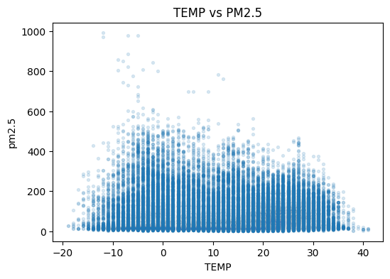
#### Output 7 - display_data

`text/plain`

````text
<Figure size 600x400 with 1 Axes>
````
`image/png`

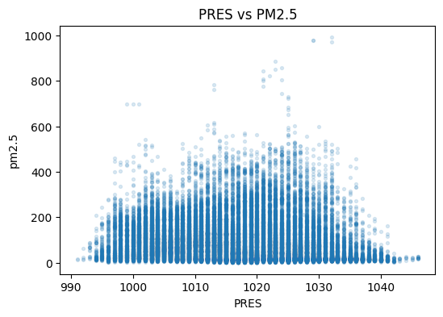
#### Output 8 - display_data

`text/plain`

````text
<Figure size 600x400 with 1 Axes>
````
`image/png`

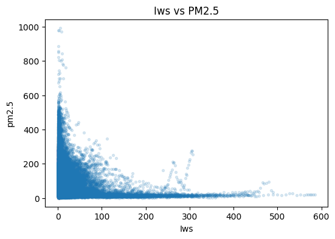
#### Output 9 - display_data

`text/plain`

````text
<Figure size 600x400 with 1 Axes>
````
`image/png`


#### Output 10 - display_data

`text/plain`

````text
<Figure size 600x400 with 1 Axes>
````
`image/png`

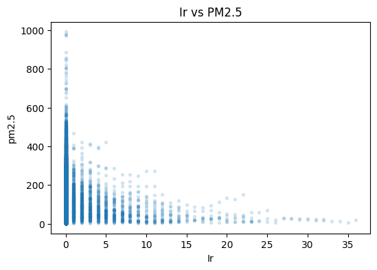
#### Output 11 - stream

Stream: `stdout`

````text
해석:
Iws는 pm2.5와 가장 강한 음의 상관을 보인다. 누적 풍속이 커질수록 PM2.5가 낮아지는 경향이 있다.
DEWP는 pm2.5와 비교적 뚜렷한 양의 상관을 보인다. 이슬점이 높을수록 PM2.5가 높아지는 경향이 있다.
PRES는 약한 음의 상관을 보인다.
TEMP는 Pearson과 Spearman의 방향이 달라 단순 선형 관계로 해석하기 어렵다.
Is와 Ir는 통계적으로 유의하거나 일부 유의하더라도 상관 강도가 매우 약하므로 주요 feature로 보기는 어렵다.
대규모 데이터에서는 p-value보다 correlation의 절대값과 시각적 패턴을 함께 해석해야 한다.
````

---

## Cell 21 - markdown

| feature | Pearson | Spearman | 해석                                                |
| ------- | ------: | -------: | ------------------------------------------------- |
| `Iws`   |  -0.250 |   -0.358 | 가장 강한 음의 관계. 누적 풍속이 클수록 PM2.5가 낮아지는 경향            |
| `DEWP`  |   0.202 |    0.332 | 이슬점이 높을수록 PM2.5가 높아지는 경향                          |
| `PRES`  |  -0.092 |   -0.189 | 약한 음의 관계                                          |
| `TEMP`  |  -0.045 |    0.064 | 매우 약함. Pearson/Spearman 부호가 달라 단순 선형관계로 보기 어렵다    |
| `Is`    |   0.023 |    0.047 | 통계적으로는 유의하나 실질적 관계는 매우 약함                         |
| `Ir`    |  -0.048 |    0.006 | Spearman p-value가 0.2577로 유의하지 않음. 실질적으로 거의 관계 없음 |

---

## Cell 22 - code

Execution count: `123`

````python
print(' === scatter plot 개선 - 원본 target vs log1p target ===')
print('원본 pm2.5 scatter는 고농도 outlier 때문에 낮은 구간의 구조가 잘 보이지 않을 수 있다.')

# log1p target 생성
# log1p(x) = log(1+x)
# pm2.5에 0이 있으므로 log(x)보다 log1p(x)가 안전하다.
train_df['pm2.5_log1p'] = np.log1p(train_df[target])

# 시각화용 샘플
train_sample = train_df.sample(
    n=min(5000, len(train_df)),
    random_state=3085
)

for col in numeric_weather_features:
    plt.figure(figsize=(12, 4))
    
    plt.subplot(1, 2, 1)
    plt.scatter(train_sample[col], train_sample[target], alpha=0.15, s=8)
    plt.title(f'{col} vs PM2.5')
    plt.xlabel(col)
    plt.ylabel('pm2.5')
    
    plt.subplot(1, 2, 2)
    plt.scatter(train_sample[col], train_sample['pm2.5_log1p'], alpha=0.15, s=8)
    plt.title(f'{col} vs log1p(PM2.5)')
    plt.xlabel(col)
    plt.ylabel('log1p(pm2.5)')
    
    plt.tight_layout()
    plt.show()
````

### Outputs

#### Output 0 - stream

Stream: `stdout`

````text
 === scatter plot 개선 - 원본 target vs log1p target ===
원본 pm2.5 scatter는 고농도 outlier 때문에 낮은 구간의 구조가 잘 보이지 않을 수 있다.
````
#### Output 1 - display_data

`text/plain`

````text
<Figure size 1200x400 with 2 Axes>
````
`image/png`

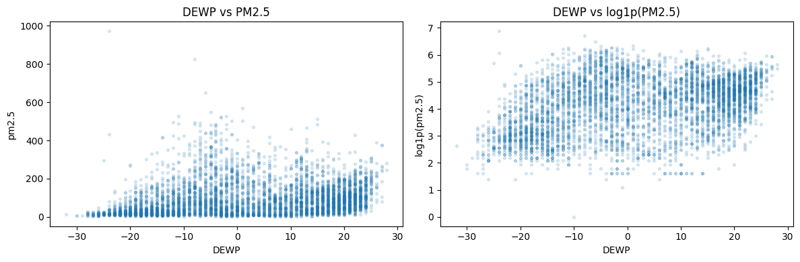
#### Output 2 - display_data

`text/plain`

````text
<Figure size 1200x400 with 2 Axes>
````
`image/png`


#### Output 3 - display_data

`text/plain`

````text
<Figure size 1200x400 with 2 Axes>
````
`image/png`


#### Output 4 - display_data

`text/plain`

````text
<Figure size 1200x400 with 2 Axes>
````
`image/png`


#### Output 5 - display_data

`text/plain`

````text
<Figure size 1200x400 with 2 Axes>
````
`image/png`

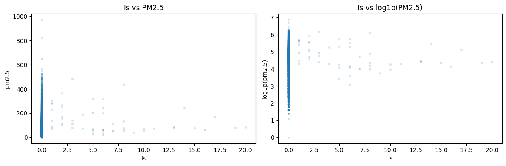
#### Output 6 - display_data

`text/plain`

````text
<Figure size 1200x400 with 2 Axes>
````
`image/png`


---

## Cell 23 - code

Execution count: `129`

````python
print(' === month별 주요 feature 상관계수 ===')

month_corr_rows = []

for month_value, group in train_df.groupby('month'):
    for col in ['Iws', 'DEWP', 'PRES', 'TEMP']:
        if group[col].nunique() > 1 and group[target].nunique() > 1:
            pearson_corr, pearson_p = pearsonr(group[col], group[target])
            spearman_corr, spearman_p = spearmanr(group[col], group[target])
            
            month_corr_rows.append({
                'month': month_value,
                'feature': col,
                'pearson_corr': pearson_corr,
                'pearson_p_value': pearson_p,
                'spearman_corr': spearman_corr,
                'spearman_p_value': spearman_p
            })

month_corr_result = pd.DataFrame(month_corr_rows)

display(month_corr_result.sort_values(['feature', 'month']))

print(' === B4-9-3단계 : month별 Spearman correlation 변화 ===')

for col in ['Iws', 'DEWP', 'PRES', 'TEMP']:
    temp_plot = month_corr_result[month_corr_result['feature'] == col]
    
    plt.figure(figsize=(8, 4))
    plt.plot(temp_plot['month'], temp_plot['spearman_corr'], marker='o')
    plt.axhline(0)
    plt.title(f'Monthly Spearman correlation: {col} vs pm2.5')
    plt.xlabel('month')
    plt.ylabel('Spearman correlation')
    plt.xticks(range(1, 13))
    plt.show()
````

### Outputs

#### Output 0 - stream

Stream: `stdout`

````text
 === month별 주요 feature 상관계수 ===
````
#### Output 1 - display_data

`text/plain`

````text
    month feature  pearson_corr  pearson_p_value  spearman_corr  \
1       1    DEWP      0.655966     0.000000e+00       0.730731   
5       2    DEWP      0.622824    3.356228e-291       0.727386   
9       3    DEWP      0.682816     0.000000e+00       0.778685   
13      4    DEWP      0.591549    1.776868e-271       0.645639   
17      5    DEWP      0.575635    2.952901e-262       0.652309   
21      6    DEWP      0.524983    9.003273e-204       0.545665   
25      7    DEWP      0.599467    6.637310e-290       0.640294   
29      8    DEWP      0.412377    1.499189e-122       0.468686   
33      9    DEWP      0.526335    5.323977e-205       0.650071   
37     10    DEWP      0.589943    1.404251e-278       0.622828   
41     11    DEWP      0.466171    2.368741e-155       0.563833   
45     12    DEWP      0.698190     0.000000e+00       0.721195   
0       1     Iws     -0.303491     1.902943e-64      -0.571587   
4       2     Iws     -0.262557     5.385522e-44      -0.437323   
8       3     Iws     -0.325823     1.491661e-74      -0.434085   
12      4     Iws     -0.266443     5.305787e-48      -0.281023   
16      5     Iws     -0.230051     4.847474e-37      -0.261836   
20      6     Iws     -0.032819     7.824396e-02      -0.041579   
24      7     Iws      0.021838     2.336685e-01      -0.030784   
28      8     Iws     -0.088496     1.330553e-06      -0.134485   
32      9     Iws     -0.119653     1.182139e-10      -0.213316   
36     10     Iws     -0.286221     3.224704e-57      -0.410410   
40     11     Iws     -0.330894     1.517585e-74      -0.576355   
44     12     Iws     -0.330468     9.147425e-77      -0.551940   
2       1    PRES     -0.359359     2.055598e-91      -0.443915   
6       2    PRES     -0.462143    1.363791e-143      -0.579718   
10      3    PRES     -0.523856    1.905183e-209      -0.501778   
14      4    PRES     -0.210928     2.530444e-30      -0.229529   
18      5    PRES      0.030444     9.681202e-02       0.052991   
22      6    PRES     -0.059190     1.483565e-03      -0.033786   
26      7    PRES      0.206925     3.845733e-30       0.253175   
30      8    PRES     -0.086881     2.068910e-06      -0.092479   
34      9    PRES     -0.321208     4.081724e-70      -0.379980   
38     10    PRES     -0.255294     1.706365e-45      -0.174410   
42     11    PRES     -0.261056     4.387960e-46      -0.246425   
46     12    PRES     -0.250782     6.533120e-44      -0.281074   
3       1    TEMP      0.035660     5.175525e-02       0.040759   
7       2    TEMP      0.128931     1.590977e-11       0.133777   
11      3    TEMP      0.061545     7.816634e-04       0.026403   
15      4    TEMP      0.055016     3.142649e-03       0.080680   
19      5    TEMP     -0.041985     2.199714e-02      -0.046329   
23      6    TEMP     -0.002587     8.896157e-01       0.012292   
27      7    TEMP     -0.029316     1.098395e-01      -0.008684   
31      8    TEMP      0.026063     1.551855e-01       0.021602   
35      9    TEMP      0.139651     5.146778e-14       0.185146   
39     10    TEMP      0.038022     3.807269e-02      -0.027065   
43     11    TEMP     -0.127534     6.451222e-12      -0.096676   
47     12    TEMP      0.044216     1.585391e-02       0.115269   

    spearman_p_value  
1       0.000000e+00  
5       0.000000e+00  
9       0.000000e+00  
13      0.000000e+00  
17      0.000000e+00  
21     3.435663e-223  
25      0.000000e+00  
29     2.061305e-162  
33      0.000000e+00  
37      0.000000e+00  
41     2.092976e-241  
45      0.000000e+00  
0      8.768334e-258  
4      4.276466e-127  
8      4.952302e-137  
12      2.037017e-53  
16      7.582088e-48  
20      2.565742e-02  
24      9.314826e-02  
28      1.745850e-13  
32      5.437184e-31  
36     2.729106e-121  
40     1.233498e-254  
44     6.180842e-237  
2      6.034986e-144  
6      2.483138e-243  
10     1.397011e-189  
14      9.666230e-36  
18      3.832595e-03  
22      6.985112e-02  
26      9.538661e-45  
30      4.333356e-07  
34      1.382537e-99  
38      9.328295e-22  
42      4.236283e-41  
46      3.689021e-55  
3       2.618140e-02  
7       2.654221e-12  
11      1.498658e-01  
15      1.458148e-05  
19      1.148185e-02  
23      5.096531e-01  
27      6.358292e-01  
31      2.387663e-01  
35      1.265727e-23  
39      1.399183e-01  
43      2.013286e-07  
47      2.851697e-10  
````
`text/html`

<details><summary>HTML output</summary>

````html
<div>
<style scoped>
    .dataframe tbody tr th:only-of-type {
        vertical-align: middle;
    }

    .dataframe tbody tr th {
        vertical-align: top;
    }

    .dataframe thead th {
        text-align: right;
    }
</style>
<table border="1" class="dataframe">
  <thead>
    <tr style="text-align: right;">
      <th></th>
      <th>month</th>
      <th>feature</th>
      <th>pearson_corr</th>
      <th>pearson_p_value</th>
      <th>spearman_corr</th>
      <th>spearman_p_value</th>
    </tr>
  </thead>
  <tbody>
    <tr>
      <th>1</th>
      <td>1</td>
      <td>DEWP</td>
      <td>0.655966</td>
      <td>0.000000e+00</td>
      <td>0.730731</td>
      <td>0.000000e+00</td>
    </tr>
    <tr>
      <th>5</th>
      <td>2</td>
      <td>DEWP</td>
      <td>0.622824</td>
      <td>3.356228e-291</td>
      <td>0.727386</td>
      <td>0.000000e+00</td>
    </tr>
    <tr>
      <th>9</th>
      <td>3</td>
      <td>DEWP</td>
      <td>0.682816</td>
      <td>0.000000e+00</td>
      <td>0.778685</td>
      <td>0.000000e+00</td>
    </tr>
    <tr>
      <th>13</th>
      <td>4</td>
      <td>DEWP</td>
      <td>0.591549</td>
      <td>1.776868e-271</td>
      <td>0.645639</td>
      <td>0.000000e+00</td>
    </tr>
    <tr>
      <th>17</th>
      <td>5</td>
      <td>DEWP</td>
      <td>0.575635</td>
      <td>2.952901e-262</td>
      <td>0.652309</td>
      <td>0.000000e+00</td>
    </tr>
    <tr>
      <th>21</th>
      <td>6</td>
      <td>DEWP</td>
      <td>0.524983</td>
      <td>9.003273e-204</td>
      <td>0.545665</td>
      <td>3.435663e-223</td>
    </tr>
    <tr>
      <th>25</th>
      <td>7</td>
      <td>DEWP</td>
      <td>0.599467</td>
      <td>6.637310e-290</td>
      <td>0.640294</td>
      <td>0.000000e+00</td>
    </tr>
    <tr>
      <th>29</th>
      <td>8</td>
      <td>DEWP</td>
      <td>0.412377</td>
      <td>1.499189e-122</td>
      <td>0.468686</td>
      <td>2.061305e-162</td>
    </tr>
    <tr>
      <th>33</th>
      <td>9</td>
      <td>DEWP</td>
      <td>0.526335</td>
      <td>5.323977e-205</td>
      <td>0.650071</td>
      <td>0.000000e+00</td>
    </tr>
    <tr>
      <th>37</th>
      <td>10</td>
      <td>DEWP</td>
      <td>0.589943</td>
      <td>1.404251e-278</td>
      <td>0.622828</td>
      <td>0.000000e+00</td>
    </tr>
    <tr>
      <th>41</th>
      <td>11</td>
      <td>DEWP</td>
      <td>0.466171</td>
      <td>2.368741e-155</td>
      <td>0.563833</td>
      <td>2.092976e-241</td>
    </tr>
    <tr>
      <th>45</th>
      <td>12</td>
      <td>DEWP</td>
      <td>0.698190</td>
      <td>0.000000e+00</td>
      <td>0.721195</td>
      <td>0.000000e+00</td>
    </tr>
    <tr>
      <th>0</th>
      <td>1</td>
      <td>Iws</td>
      <td>-0.303491</td>
      <td>1.902943e-64</td>
      <td>-0.571587</td>
      <td>8.768334e-258</td>
    </tr>
    <tr>
      <th>4</th>
      <td>2</td>
      <td>Iws</td>
      <td>-0.262557</td>
      <td>5.385522e-44</td>
      <td>-0.437323</td>
      <td>4.276466e-127</td>
    </tr>
    <tr>
      <th>8</th>
      <td>3</td>
      <td>Iws</td>
      <td>-0.325823</td>
      <td>1.491661e-74</td>
      <td>-0.434085</td>
      <td>4.952302e-137</td>
    </tr>
    <tr>
      <th>12</th>
      <td>4</td>
      <td>Iws</td>
      <td>-0.266443</td>
      <td>5.305787e-48</td>
      <td>-0.281023</td>
      <td>2.037017e-53</td>
    </tr>
    <tr>
      <th>16</th>
      <td>5</td>
      <td>Iws</td>
      <td>-0.230051</td>
      <td>4.847474e-37</td>
      <td>-0.261836</td>
      <td>7.582088e-48</td>
    </tr>
    <tr>
      <th>20</th>
      <td>6</td>
      <td>Iws</td>
      <td>-0.032819</td>
      <td>7.824396e-02</td>
      <td>-0.041579</td>
      <td>2.565742e-02</td>
    </tr>
    <tr>
      <th>24</th>
      <td>7</td>
      <td>Iws</td>
      <td>0.021838</td>
      <td>2.336685e-01</td>
      <td>-0.030784</td>
      <td>9.314826e-02</td>
    </tr>
    <tr>
      <th>28</th>
      <td>8</td>
      <td>Iws</td>
      <td>-0.088496</td>
      <td>1.330553e-06</td>
      <td>-0.134485</td>
      <td>1.745850e-13</td>
    </tr>
    <tr>
      <th>32</th>
      <td>9</td>
      <td>Iws</td>
      <td>-0.119653</td>
      <td>1.182139e-10</td>
      <td>-0.213316</td>
      <td>5.437184e-31</td>
    </tr>
    <tr>
      <th>36</th>
      <td>10</td>
      <td>Iws</td>
      <td>-0.286221</td>
      <td>3.224704e-57</td>
      <td>-0.410410</td>
      <td>2.729106e-121</td>
    </tr>
    <tr>
      <th>40</th>
      <td>11</td>
      <td>Iws</td>
      <td>-0.330894</td>
      <td>1.517585e-74</td>
      <td>-0.576355</td>
      <td>1.233498e-254</td>
    </tr>
    <tr>
      <th>44</th>
      <td>12</td>
      <td>Iws</td>
      <td>-0.330468</td>
      <td>9.147425e-77</td>
      <td>-0.551940</td>
      <td>6.180842e-237</td>
    </tr>
    <tr>
      <th>2</th>
      <td>1</td>
      <td>PRES</td>
      <td>-0.359359</td>
      <td>2.055598e-91</td>
      <td>-0.443915</td>
      <td>6.034986e-144</td>
    </tr>
    <tr>
      <th>6</th>
      <td>2</td>
      <td>PRES</td>
      <td>-0.462143</td>
      <td>1.363791e-143</td>
      <td>-0.579718</td>
      <td>2.483138e-243</td>
    </tr>
    <tr>
      <th>10</th>
      <td>3</td>
      <td>PRES</td>
      <td>-0.523856</td>
      <td>1.905183e-209</td>
      <td>-0.501778</td>
      <td>1.397011e-189</td>
    </tr>
    <tr>
      <th>14</th>
      <td>4</td>
      <td>PRES</td>
      <td>-0.210928</td>
      <td>2.530444e-30</td>
      <td>-0.229529</td>
      <td>9.666230e-36</td>
    </tr>
    <tr>
      <th>18</th>
      <td>5</td>
      <td>PRES</td>
      <td>0.030444</td>
      <td>9.681202e-02</td>
      <td>0.052991</td>
      <td>3.832595e-03</td>
    </tr>
    <tr>
      <th>22</th>
      <td>6</td>
      <td>PRES</td>
      <td>-0.059190</td>
      <td>1.483565e-03</td>
      <td>-0.033786</td>
      <td>6.985112e-02</td>
    </tr>
    <tr>
      <th>26</th>
      <td>7</td>
      <td>PRES</td>
      <td>0.206925</td>
      <td>3.845733e-30</td>
      <td>0.253175</td>
      <td>9.538661e-45</td>
    </tr>
    <tr>
      <th>30</th>
      <td>8</td>
      <td>PRES</td>
      <td>-0.086881</td>
      <td>2.068910e-06</td>
      <td>-0.092479</td>
      <td>4.333356e-07</td>
    </tr>
    <tr>
      <th>34</th>
      <td>9</td>
      <td>PRES</td>
      <td>-0.321208</td>
      <td>4.081724e-70</td>
      <td>-0.379980</td>
      <td>1.382537e-99</td>
    </tr>
    <tr>
      <th>38</th>
      <td>10</td>
      <td>PRES</td>
      <td>-0.255294</td>
      <td>1.706365e-45</td>
      <td>-0.174410</td>
      <td>9.328295e-22</td>
    </tr>
    <tr>
      <th>42</th>
      <td>11</td>
      <td>PRES</td>
      <td>-0.261056</td>
      <td>4.387960e-46</td>
      <td>-0.246425</td>
      <td>4.236283e-41</td>
    </tr>
    <tr>
      <th>46</th>
      <td>12</td>
      <td>PRES</td>
      <td>-0.250782</td>
      <td>6.533120e-44</td>
      <td>-0.281074</td>
      <td>3.689021e-55</td>
    </tr>
    <tr>
      <th>3</th>
      <td>1</td>
      <td>TEMP</td>
      <td>0.035660</td>
      <td>5.175525e-02</td>
      <td>0.040759</td>
      <td>2.618140e-02</td>
    </tr>
    <tr>
      <th>7</th>
      <td>2</td>
      <td>TEMP</td>
      <td>0.128931</td>
      <td>1.590977e-11</td>
      <td>0.133777</td>
      <td>2.654221e-12</td>
    </tr>
    <tr>
      <th>11</th>
      <td>3</td>
      <td>TEMP</td>
      <td>0.061545</td>
      <td>7.816634e-04</td>
      <td>0.026403</td>
      <td>1.498658e-01</td>
    </tr>
    <tr>
      <th>15</th>
      <td>4</td>
      <td>TEMP</td>
      <td>0.055016</td>
      <td>3.142649e-03</td>
      <td>0.080680</td>
      <td>1.458148e-05</td>
    </tr>
    <tr>
      <th>19</th>
      <td>5</td>
      <td>TEMP</td>
      <td>-0.041985</td>
      <td>2.199714e-02</td>
      <td>-0.046329</td>
      <td>1.148185e-02</td>
    </tr>
    <tr>
      <th>23</th>
      <td>6</td>
      <td>TEMP</td>
      <td>-0.002587</td>
      <td>8.896157e-01</td>
      <td>0.012292</td>
      <td>5.096531e-01</td>
    </tr>
    <tr>
      <th>27</th>
      <td>7</td>
      <td>TEMP</td>
      <td>-0.029316</td>
      <td>1.098395e-01</td>
      <td>-0.008684</td>
      <td>6.358292e-01</td>
    </tr>
    <tr>
      <th>31</th>
      <td>8</td>
      <td>TEMP</td>
      <td>0.026063</td>
      <td>1.551855e-01</td>
      <td>0.021602</td>
      <td>2.387663e-01</td>
    </tr>
    <tr>
      <th>35</th>
      <td>9</td>
      <td>TEMP</td>
      <td>0.139651</td>
      <td>5.146778e-14</td>
      <td>0.185146</td>
      <td>1.265727e-23</td>
    </tr>
    <tr>
      <th>39</th>
      <td>10</td>
      <td>TEMP</td>
      <td>0.038022</td>
      <td>3.807269e-02</td>
      <td>-0.027065</td>
      <td>1.399183e-01</td>
    </tr>
    <tr>
      <th>43</th>
      <td>11</td>
      <td>TEMP</td>
      <td>-0.127534</td>
      <td>6.451222e-12</td>
      <td>-0.096676</td>
      <td>2.013286e-07</td>
    </tr>
    <tr>
      <th>47</th>
      <td>12</td>
      <td>TEMP</td>
      <td>0.044216</td>
      <td>1.585391e-02</td>
      <td>0.115269</td>
      <td>2.851697e-10</td>
    </tr>
  </tbody>
</table>
</div>
````
</details>
#### Output 2 - stream

Stream: `stdout`

````text
 === B4-9-3단계 : month별 Spearman correlation 변화 ===
````
#### Output 3 - display_data

`text/plain`

````text
<Figure size 800x400 with 1 Axes>
````
`image/png`

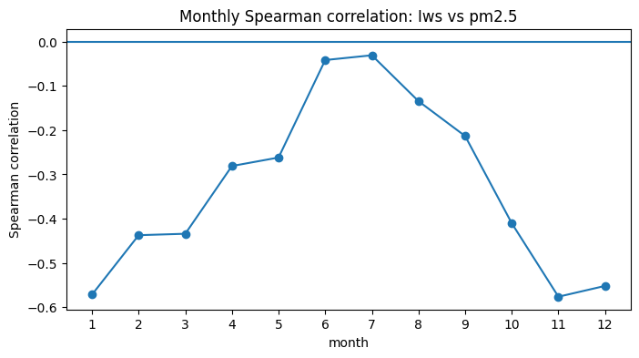
#### Output 4 - display_data

`text/plain`

````text
<Figure size 800x400 with 1 Axes>
````
`image/png`

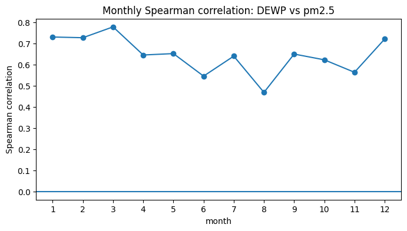
#### Output 5 - display_data

`text/plain`

````text
<Figure size 800x400 with 1 Axes>
````
`image/png`

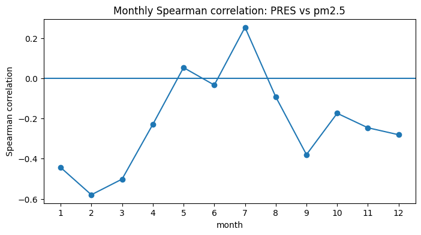
#### Output 6 - display_data

`text/plain`

````text
<Figure size 800x400 with 1 Axes>
````
`image/png`


---

## Cell 24 - code

Execution count: `131`

````python
print(' === 핵심 feature Iws, DEWP 집중 분석 ===')

main_numeric_candidates = ['Iws', 'DEWP']

for col in main_numeric_candidates:
    print(f'\n=== {col} 집중 분석 ===')
    
    print(train_df[[col, target, 'pm2.5_log1p']].describe())
    
    plt.figure(figsize=(12, 4))
    
    plt.subplot(1, 2, 1)
    plt.hexbin(train_df[col], train_df[target], gridsize=40, mincnt=1)
    plt.colorbar(label='count')
    plt.title(f'{col} vs PM2.5')
    plt.xlabel(col)
    plt.ylabel('pm2.5')
    
    plt.subplot(1, 2, 2)
    plt.hexbin(train_df[col], train_df['pm2.5_log1p'], gridsize=40, mincnt=1)
    plt.colorbar(label='count')
    plt.title(f'{col} vs log1p(PM2.5)')
    plt.xlabel(col)
    plt.ylabel('log1p(pm2.5)')
    
    plt.tight_layout()
    plt.show()

print(' ===  Iws와 DEWP의 2D 공간에서 pm2.5 보기 ===')

plt.figure(figsize=(7, 5))

scatter = plt.scatter(
    train_sample['Iws'],
    train_sample['DEWP'],
    c=train_sample[target],
    alpha=0.5,
    s=10
)

plt.colorbar(scatter, label='pm2.5')
plt.title('Iws vs DEWP colored by PM2.5')
plt.xlabel('Iws')
plt.ylabel('DEWP')
plt.show()


print('최종 결론:')
print('연속형 기상 feature 중 Iws와 DEWP가 pm2.5와 가장 뚜렷한 관계를 보인다.')
print('Iws는 음의 관계가 가장 강하며, 풍속이 커질수록 오염물질이 확산되어 PM2.5가 낮아지는 패턴으로 해석할 수 있다.')
print('DEWP는 양의 관계가 비교적 강하며, 습하거나 정체된 기상 조건에서 PM2.5가 높아지는 패턴으로 해석할 수 있다.')
````

### Outputs

#### Output 0 - stream

Stream: `stdout`

````text
 === 핵심 feature Iws, DEWP 집중 분석 ===

=== Iws 집중 분석 ===
                Iws         pm2.5   pm2.5_log1p
count  35064.000000  35064.000000  35064.000000
mean      24.956033     97.782883      4.156130
std       51.300274     90.748846      1.005972
min        0.450000      0.000000      0.000000
25%        1.790000     29.000000      3.401197
50%        5.810000     72.000000      4.290459
75%       23.250000    137.000000      4.927254
max      585.600000    994.000000      6.902743
````
#### Output 1 - display_data

`text/plain`

````text
<Figure size 1200x400 with 4 Axes>
````
`image/png`

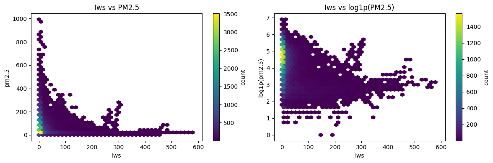
#### Output 2 - stream

Stream: `stdout`

````text

=== DEWP 집중 분석 ===
               DEWP         pm2.5   pm2.5_log1p
count  35064.000000  35064.000000  35064.000000
mean       1.758556     97.782883      4.156130
std       14.499931     90.748846      1.005972
min      -33.000000      0.000000      0.000000
25%      -11.000000     29.000000      3.401197
50%        2.000000     72.000000      4.290459
75%       15.000000    137.000000      4.927254
max       28.000000    994.000000      6.902743
````
#### Output 3 - display_data

`text/plain`

````text
<Figure size 1200x400 with 4 Axes>
````
`image/png`

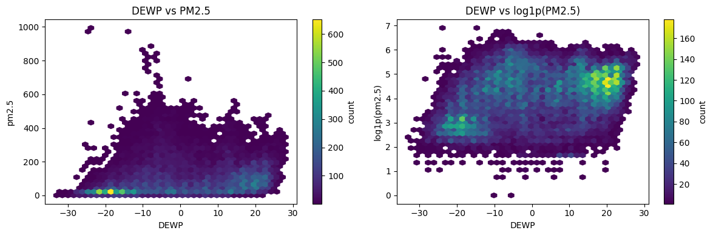
#### Output 4 - stream

Stream: `stdout`

````text
 ===  Iws와 DEWP의 2D 공간에서 pm2.5 보기 ===
````
#### Output 5 - display_data

`text/plain`

````text
<Figure size 700x500 with 2 Axes>
````
`image/png`


#### Output 6 - stream

Stream: `stdout`

````text
최종 결론:
연속형 기상 feature 중 Iws와 DEWP가 pm2.5와 가장 뚜렷한 관계를 보인다.
Iws는 음의 관계가 가장 강하며, 풍속이 커질수록 오염물질이 확산되어 PM2.5가 낮아지는 패턴으로 해석할 수 있다.
DEWP는 양의 관계가 비교적 강하며, 습하거나 정체된 기상 조건에서 PM2.5가 높아지는 패턴으로 해석할 수 있다.
````

---

## Cell 25 - markdown

## **PM2.5 데이터 분포 및 주요 변수 요약**

- **PM2.5 분포 특성**
  - 이 데이터의 **PM2.5 값은 정규분포가 아니며**, episode(사건)가 포함된 **오른쪽으로 치우친 분포**를 가진다.

- **분석**
  - 따라서, **고농도 값을 단순 outlier로 간주해 제거하기보다는**  
    **모델이 중요한 이상치를 염두에 두고** 평가하는 것이 중요하다.

- **주요 기상 feature**
  - **연속형 기상 변수(feature) 중**
    - `Iws`와 `DEWP`가 **PM2.5와 가장 밀접한 관계**를 보이는 1차 후보로 선정됨
    - `Iws`는 **음의 관계** (풍속↑ → PM2.5↓, 즉 풍속이 클수록 오염물질이 잘 흩어짐)
    - `DEWP`는 **양의 관계** (이슬점/습도↑ → PM2.5↑, 즉 습하거나 정체된 조건에서 고농도 발생)

- **월별, 계절 특이성**
  - **DEWP는 월별로 나눠도 PM2.5와 안정적으로 양의 상관**을 유지. 특히 DEWP는 단순히 “여름이라 높다/겨울이라 낮다” 수준이 아니라, 같은 월 안에서도 이슬점이 높을수록 PM2.5가 높아지는 경향이 나타남. 이는 이슬점이 높은 습한 대기 조건에서 PM2.5 농도가 높아지는 경향이 있음을 시사함. 핵심 feature 후보로 설정 가능.
  - **Iws는 계절에 따라 효과 강도가 달라지는 특성**을 보임. 이때 Iws는 전체적으로 PM2.5와 음의 관계를 보이며, 특히 겨울·가을에 그 관계가 강함. ->
즉 Iws의 효과는 누적 풍속이 PM2.5 확산 또는 저감과 관련될 가능성이 큼. 계절에 따라 달라지는 피처일 가능성이 있음.

- **후속 모델 설계 방향**
  - 이후 모델링에서는
    - **기상 feature뿐만 아니라**
    - **month / hour / cbwd(풍향 등) 구조까지** 포함하여
    - **시간적 패턴과 기상 조건이 함께 작동하는 PM2.5 예측 문제**로 설계하는 것이 바람직할 것으로 생각된다.

---

## Cell 26 - markdown

---
# Part B. Baseline 회귀 모델 + 과적합 유발 + 정규화를 통한 과적합 해결 시도 (6점)

## B1. Baseline 모델 구축 및 학습 (3점)

**요구사항**:
- DNN (Dense layer 4개 이상) Baseline 모델 구축
- 과적합을 유도하기 위해 train 데이터의 일부(최대 2000개)만 사용
- `keras.utils.set_random_seed(SEED)` 호출 후 모델 생성
- Adam optimizer, MSE loss, MAE metric
- validation_data로 X_val/y_val 사용
- epochs=50, batch_size=32

**필수 출력**:
- 최종 Train Loss, Val Loss
- Gap (Val - Train) 값

---

## Cell 27 - markdown

기본 feature:
DEWP, TEMP, PRES, Iws, Is, Ir

시간 feature:
month, hour, dayofweek, is_weekend

풍향 feature:
cbwd_NE, cbwd_NW, cbwd_SE
또는 tree 모델이면 cbwd dummy 전체 사용 가능

핵심 interaction 후보:
Iws × DEWP
Iws × month
DEWP × month
Iws × cbwd

## B1. EDA 기반 모델링 설계

B0 EDA 결과, target `pm2.5`는 평균이 중앙값보다 크고 오른쪽 꼬리가 긴 heavy-tail 분포로 확인되었다. 따라서 고농도 값을 단순 outlier로 제거하기보다, 모델이 고농도 episode를 얼마나 잘 예측하는지 평가해야 한다.

연속형 기상 feature 중에서는 `Iws`와 `DEWP`가 가장 중요한 1차 후보로 나타났다. `DEWP`는 전체 분석과 월별 분석 모두에서 PM2.5와 안정적인 양의 관계를 보였으므로, 비교적 선형적인 설명력을 가진 feature로 해석할 수 있다. 반면 `Iws`는 전체적으로 PM2.5와 음의 관계를 보였지만, 월별로 관계 강도가 달라졌으므로 비선형성 또는 시간 조건과의 상호작용 가능성이 있다.

따라서 본 모델링에서는 단순 선형 모델보다 hidden layer와 ReLU activation을 가진 DNN을 baseline으로 사용한다. DNN은 `DEWP`의 선형적 효과뿐 아니라 `Iws × month`, `Iws × cbwd`, `DEWP × TEMP`, `hour × weather` 같은 feature interaction을 내부 표현으로 학습할 수 있다.

모델링 기준은 다음과 같다.

| 항목 | 설계 |
|---|---|
| 문제 유형 | 회귀(regression) |
| 입력 X | 시간 변수, 기상 변수, 풍향 dummy, 주말 여부 |
| 출력 y | `pm2.5` |
| 출력층 | `Dense(1)` |
| 출력 activation | 없음(linear output) |
| loss | MSE |
| 보조 metric | MAE |
| optimizer | Adam |
| baseline 목적 | 정규화 전 기본 DNN의 train/val loss curve 확인 |
| 이후 비교 | Dropout, L2, EarlyStopping, BatchNorm 개별 적용 |

---

## Cell 28 - code

Execution count: `141`

````python
print(' === B1-1. 공통 유틸 함수 정의 ===')

from sklearn.metrics import mean_absolute_error, mean_squared_error, r2_score

# 재고정
np.random.seed(SEED)
keras.utils.set_random_seed(SEED)

input_dim = X_train.shape[1]

print(f'input_dim: {input_dim}')
print(f'X_train shape: {X_train.shape}')
print(f'X_val shape: {X_val.shape}')
print(f'X_test shape: {X_test.shape}')
print(f'y_train shape: {y_train.shape}')
print(f'y_val shape: {y_val.shape}')
print(f'y_test shape: {y_test.shape}')

def show_last_result(model_name, history):
    """
    history 객체에서 마지막 epoch의 train loss, val loss, gap을 출력한다.
    Part C 요구사항의 Train Loss, Val Loss, Gap 출력에 맞춘 함수.
    """
    train_loss = history.history['loss'][-1]
    val_loss = history.history['val_loss'][-1]
    gap = val_loss - train_loss
    
    print(f'[{model_name}]')
    print(f'Train Loss: {train_loss:.4f}')
    print(f'Val Loss  : {val_loss:.4f}')
    print(f'Gap       : {gap:.4f}')
    
    return {
        'model': model_name,
        'train_loss': train_loss,
        'val_loss': val_loss,
        'gap': gap,
        'epochs': len(history.history['loss'])
    }


def plot_loss_curve(history, title):
    """
    Train Loss와 Val Loss를 한 그래프에 시각화한다.
    Part B 요구사항: 제목, x축, y축, 범례 포함.
    """
    plt.figure(figsize=(8, 5))
    plt.plot(history.history['loss'], label='Train Loss')
    plt.plot(history.history['val_loss'], label='Val Loss')
    plt.title(title)
    plt.xlabel('Epoch')
    plt.ylabel('Loss (MSE)')
    plt.legend()
    plt.show()


def regression_eval(model, X_data, y_data, dataset_name='data'):
    """
    회귀 모델 평가용 함수.
    Keras evaluate의 loss/MAE 외에 RMSE, R²를 함께 계산한다.
    """
    y_pred = model.predict(X_data, verbose=0).reshape(-1)
    
    mae = mean_absolute_error(y_data, y_pred)
    mse = mean_squared_error(y_data, y_pred)
    rmse = np.sqrt(mse)
    r2 = r2_score(y_data, y_pred)
    
    print(f'=== {dataset_name} regression metrics ===')
    print(f'MAE : {mae:.4f}')
    print(f'MSE : {mse:.4f}')
    print(f'RMSE: {rmse:.4f}')
    print(f'R²  : {r2:.4f}')
    
    return {
        'dataset': dataset_name,
        'mae': mae,
        'mse': mse,
        'rmse': rmse,
        'r2': r2
    }
````

### Outputs

#### Output 0 - stream

Stream: `stdout`

````text
 === B1-1. 공통 유틸 함수 정의 ===
input_dim: 16
X_train shape: (26294, 16)
X_val shape: (8765, 16)
X_test shape: (8765, 16)
y_train shape: (26294,)
y_val shape: (8765,)
y_test shape: (8765,)
````

---

## Cell 29 - code

Execution count: `None`

````python
print(' === B2. Baseline DNN 모델 학습 ===')
def build_baseline_model():
    model = Sequential()
    
    # Dense + ReLU
    # DEWP의 선형/준선형 효과와 Iws의 비선형 패턴을 hidden layer에서 함께 학습하게 한다.
    model.add(Dense(64, activation='relu', input_shape=(input_dim,)))
    model.add(Dense(32, activation='relu'))
    model.add(Dense(16, activation='relu'))
    
    # 회귀 출력층: pm2.5는 연속값이므로 activation을 두지 않는다.
    model.add(Dense(1))
    
    model.compile(
        optimizer='adam',
        loss='mse',
        metrics=['mae']
    )
    
    return model


baseline_model = build_baseline_model()

baseline_model.summary()

baseline_history = baseline_model.fit(
    X_train, y_train,
    validation_data=(X_val, y_val),
    epochs=50,
    batch_size=64,
    verbose=1
)

baseline_result = show_last_result('Baseline', baseline_history) 

plot_loss_curve(baseline_history, 'Baseline DNN Loss Curve')
````

### Outputs

#### Output 0 - stream

Stream: `stdout`

````text
 === B2. Baseline DNN 모델 학습 ===
````
#### Output 1 - stream

Stream: `stderr`

````text
/home/sieg/projects-wsl/hongikUniv.-26_1/.venv/lib/python3.12/site-packages/keras/src/layers/core/dense.py:107: UserWarning: Do not pass an `input_shape`/`input_dim` argument to a layer. When using Sequential models, prefer using an `Input(shape)` object as the first layer in the model instead.
  super().__init__(activity_regularizer=activity_regularizer, **kwargs)
````
#### Output 2 - display_data

`text/plain`

````text
Model: "sequential"
````
`text/html`

<details><summary>HTML output</summary>

````html
<pre style="white-space:pre;overflow-x:auto;line-height:normal;font-family:Menlo,'DejaVu Sans Mono',consolas,'Courier New',monospace"><span style="font-weight: bold">Model: "sequential"</span>
</pre>
````
</details>
#### Output 3 - display_data

`text/plain`

````text
┏━━━━━━━━━━━━━━━━━━━━━━━━━━━━━━━━━┳━━━━━━━━━━━━━━━━━━━━━━━━┳━━━━━━━━━━━━━━━┓
┃ Layer (type)                    ┃ Output Shape           ┃       Param # ┃
┡━━━━━━━━━━━━━━━━━━━━━━━━━━━━━━━━━╇━━━━━━━━━━━━━━━━━━━━━━━━╇━━━━━━━━━━━━━━━┩
│ dense (Dense)                   │ (None, 64)             │         1,088 │
├─────────────────────────────────┼────────────────────────┼───────────────┤
│ dense_1 (Dense)                 │ (None, 32)             │         2,080 │
├─────────────────────────────────┼────────────────────────┼───────────────┤
│ dense_2 (Dense)                 │ (None, 16)             │           528 │
├─────────────────────────────────┼────────────────────────┼───────────────┤
│ dense_3 (Dense)                 │ (None, 1)              │            17 │
└─────────────────────────────────┴────────────────────────┴───────────────┘
````
`text/html`

<details><summary>HTML output</summary>

````html
<pre style="white-space:pre;overflow-x:auto;line-height:normal;font-family:Menlo,'DejaVu Sans Mono',consolas,'Courier New',monospace">┏━━━━━━━━━━━━━━━━━━━━━━━━━━━━━━━━━┳━━━━━━━━━━━━━━━━━━━━━━━━┳━━━━━━━━━━━━━━━┓
┃<span style="font-weight: bold"> Layer (type)                    </span>┃<span style="font-weight: bold"> Output Shape           </span>┃<span style="font-weight: bold">       Param # </span>┃
┡━━━━━━━━━━━━━━━━━━━━━━━━━━━━━━━━━╇━━━━━━━━━━━━━━━━━━━━━━━━╇━━━━━━━━━━━━━━━┩
│ dense (<span style="color: #0087ff; text-decoration-color: #0087ff">Dense</span>)                   │ (<span style="color: #00d7ff; text-decoration-color: #00d7ff">None</span>, <span style="color: #00af00; text-decoration-color: #00af00">64</span>)             │         <span style="color: #00af00; text-decoration-color: #00af00">1,088</span> │
├─────────────────────────────────┼────────────────────────┼───────────────┤
│ dense_1 (<span style="color: #0087ff; text-decoration-color: #0087ff">Dense</span>)                 │ (<span style="color: #00d7ff; text-decoration-color: #00d7ff">None</span>, <span style="color: #00af00; text-decoration-color: #00af00">32</span>)             │         <span style="color: #00af00; text-decoration-color: #00af00">2,080</span> │
├─────────────────────────────────┼────────────────────────┼───────────────┤
│ dense_2 (<span style="color: #0087ff; text-decoration-color: #0087ff">Dense</span>)                 │ (<span style="color: #00d7ff; text-decoration-color: #00d7ff">None</span>, <span style="color: #00af00; text-decoration-color: #00af00">16</span>)             │           <span style="color: #00af00; text-decoration-color: #00af00">528</span> │
├─────────────────────────────────┼────────────────────────┼───────────────┤
│ dense_3 (<span style="color: #0087ff; text-decoration-color: #0087ff">Dense</span>)                 │ (<span style="color: #00d7ff; text-decoration-color: #00d7ff">None</span>, <span style="color: #00af00; text-decoration-color: #00af00">1</span>)              │            <span style="color: #00af00; text-decoration-color: #00af00">17</span> │
└─────────────────────────────────┴────────────────────────┴───────────────┘
</pre>
````
</details>
#### Output 4 - display_data

`text/plain`

````text
 Total params: 3,713 (14.50 KB)
````
`text/html`

<details><summary>HTML output</summary>

````html
<pre style="white-space:pre;overflow-x:auto;line-height:normal;font-family:Menlo,'DejaVu Sans Mono',consolas,'Courier New',monospace"><span style="font-weight: bold"> Total params: </span><span style="color: #00af00; text-decoration-color: #00af00">3,713</span> (14.50 KB)
</pre>
````
</details>
#### Output 5 - display_data

`text/plain`

````text
 Trainable params: 3,713 (14.50 KB)
````
`text/html`

<details><summary>HTML output</summary>

````html
<pre style="white-space:pre;overflow-x:auto;line-height:normal;font-family:Menlo,'DejaVu Sans Mono',consolas,'Courier New',monospace"><span style="font-weight: bold"> Trainable params: </span><span style="color: #00af00; text-decoration-color: #00af00">3,713</span> (14.50 KB)
</pre>
````
</details>
#### Output 6 - display_data

`text/plain`

````text
 Non-trainable params: 0 (0.00 B)
````
`text/html`

<details><summary>HTML output</summary>

````html
<pre style="white-space:pre;overflow-x:auto;line-height:normal;font-family:Menlo,'DejaVu Sans Mono',consolas,'Courier New',monospace"><span style="font-weight: bold"> Non-trainable params: </span><span style="color: #00af00; text-decoration-color: #00af00">0</span> (0.00 B)
</pre>
````
</details>
#### Output 7 - stream

Stream: `stdout`

````text
Epoch 1/50
411/411 ━━━━━━━━━━━━━━━━━━━━ 3s 3ms/step - loss: 9711.8213 - mae: 68.3774 - val_loss: 6588.3574 - val_mae: 57.9881
Epoch 2/50
411/411 ━━━━━━━━━━━━━━━━━━━━ 1s 2ms/step - loss: 5991.9414 - mae: 55.3109 - val_loss: 5992.9395 - val_mae: 54.5544
Epoch 3/50
411/411 ━━━━━━━━━━━━━━━━━━━━ 1s 2ms/step - loss: 5581.8770 - mae: 52.5583 - val_loss: 5642.4233 - val_mae: 52.3911
Epoch 4/50
411/411 ━━━━━━━━━━━━━━━━━━━━ 1s 2ms/step - loss: 5252.1367 - mae: 50.6366 - val_loss: 5302.9160 - val_mae: 50.7508
Epoch 5/50
411/411 ━━━━━━━━━━━━━━━━━━━━ 1s 2ms/step - loss: 4999.8374 - mae: 49.3056 - val_loss: 5085.3281 - val_mae: 49.7290
Epoch 6/50
411/411 ━━━━━━━━━━━━━━━━━━━━ 1s 2ms/step - loss: 4800.7559 - mae: 48.1184 - val_loss: 4895.6050 - val_mae: 48.6925
Epoch 7/50
411/411 ━━━━━━━━━━━━━━━━━━━━ 1s 2ms/step - loss: 4608.5952 - mae: 46.8644 - val_loss: 4706.2061 - val_mae: 47.6364
Epoch 8/50
411/411 ━━━━━━━━━━━━━━━━━━━━ 1s 2ms/step - loss: 4428.6885 - mae: 45.6747 - val_loss: 4547.3174 - val_mae: 46.7102
Epoch 9/50
411/411 ━━━━━━━━━━━━━━━━━━━━ 1s 2ms/step - loss: 4277.3389 - mae: 44.6638 - val_loss: 4419.6504 - val_mae: 45.9378
Epoch 10/50
411/411 ━━━━━━━━━━━━━━━━━━━━ 1s 2ms/step - loss: 4154.6084 - mae: 43.8596 - val_loss: 4312.0840 - val_mae: 45.1571
Epoch 11/50
411/411 ━━━━━━━━━━━━━━━━━━━━ 1s 2ms/step - loss: 4053.5269 - mae: 43.1938 - val_loss: 4230.4873 - val_mae: 44.5796
Epoch 12/50
411/411 ━━━━━━━━━━━━━━━━━━━━ 1s 2ms/step - loss: 3966.2751 - mae: 42.6138 - val_loss: 4157.6611 - val_mae: 44.0144
Epoch 13/50
411/411 ━━━━━━━━━━━━━━━━━━━━ 1s 2ms/step - loss: 3888.1790 - mae: 42.1115 - val_loss: 4096.5366 - val_mae: 43.5440
Epoch 14/50
411/411 ━━━━━━━━━━━━━━━━━━━━ 1s 2ms/step - loss: 3819.8135 - mae: 41.6770 - val_loss: 4044.4692 - val_mae: 43.1896
Epoch 15/50
411/411 ━━━━━━━━━━━━━━━━━━━━ 1s 2ms/step - loss: 3760.0818 - mae: 41.2948 - val_loss: 3995.4004 - val_mae: 42.8252
Epoch 16/50
411/411 ━━━━━━━━━━━━━━━━━━━━ 1s 2ms/step - loss: 3705.0405 - mae: 40.9499 - val_loss: 3952.4641 - val_mae: 42.5116
Epoch 17/50
411/411 ━━━━━━━━━━━━━━━━━━━━ 1s 2ms/step - loss: 3655.9534 - mae: 40.6455 - val_loss: 3912.4792 - val_mae: 42.1855
Epoch 18/50
411/411 ━━━━━━━━━━━━━━━━━━━━ 1s 2ms/step - loss: 3611.2075 - mae: 40.3703 - val_loss: 3877.4895 - val_mae: 41.9131
Epoch 19/50
411/411 ━━━━━━━━━━━━━━━━━━━━ 1s 2ms/step - loss: 3570.9529 - mae: 40.1276 - val_loss: 3846.3010 - val_mae: 41.6351
Epoch 20/50
411/411 ━━━━━━━━━━━━━━━━━━━━ 1s 2ms/step - loss: 3534.6733 - mae: 39.9039 - val_loss: 3818.4817 - val_mae: 41.4197
Epoch 21/50
411/411 ━━━━━━━━━━━━━━━━━━━━ 1s 2ms/step - loss: 3499.3601 - mae: 39.6864 - val_loss: 3793.9788 - val_mae: 41.1928
Epoch 22/50
411/411 ━━━━━━━━━━━━━━━━━━━━ 1s 2ms/step - loss: 3467.8342 - mae: 39.4880 - val_loss: 3770.8889 - val_mae: 41.0110
Epoch 23/50
411/411 ━━━━━━━━━━━━━━━━━━━━ 1s 2ms/step - loss: 3437.4417 - mae: 39.2997 - val_loss: 3750.5439 - val_mae: 40.8671
Epoch 24/50
411/411 ━━━━━━━━━━━━━━━━━━━━ 1s 2ms/step - loss: 3407.1287 - mae: 39.1052 - val_loss: 3729.8279 - val_mae: 40.6835
Epoch 25/50
411/411 ━━━━━━━━━━━━━━━━━━━━ 1s 3ms/step - loss: 3378.5769 - mae: 38.9269 - val_loss: 3711.1938 - val_mae: 40.5485
Epoch 26/50
411/411 ━━━━━━━━━━━━━━━━━━━━ 1s 3ms/step - loss: 3350.8433 - mae: 38.7531 - val_loss: 3688.1868 - val_mae: 40.4093
Epoch 27/50
411/411 ━━━━━━━━━━━━━━━━━━━━ 1s 2ms/step - loss: 3325.7842 - mae: 38.5974 - val_loss: 3669.6406 - val_mae: 40.2755
Epoch 28/50
411/411 ━━━━━━━━━━━━━━━━━━━━ 3s 7ms/step - loss: 3302.9575 - mae: 38.4630 - val_loss: 3652.1936 - val_mae: 40.1602
Epoch 29/50
411/411 ━━━━━━━━━━━━━━━━━━━━ 1s 2ms/step - loss: 3280.8333 - mae: 38.3353 - val_loss: 3638.6582 - val_mae: 40.0743
Epoch 30/50
411/411 ━━━━━━━━━━━━━━━━━━━━ 1s 2ms/step - loss: 3260.6294 - mae: 38.2227 - val_loss: 3624.5437 - val_mae: 39.9907
Epoch 31/50
411/411 ━━━━━━━━━━━━━━━━━━━━ 1s 2ms/step - loss: 3240.8442 - mae: 38.1089 - val_loss: 3611.2981 - val_mae: 39.9210
Epoch 32/50
411/411 ━━━━━━━━━━━━━━━━━━━━ 1s 2ms/step - loss: 3222.7209 - mae: 38.0090 - val_loss: 3598.0701 - val_mae: 39.8281
Epoch 33/50
411/411 ━━━━━━━━━━━━━━━━━━━━ 1s 2ms/step - loss: 3204.1016 - mae: 37.9078 - val_loss: 3587.8538 - val_mae: 39.7412
Epoch 34/50
411/411 ━━━━━━━━━━━━━━━━━━━━ 1s 2ms/step - loss: 3186.4321 - mae: 37.8142 - val_loss: 3578.1250 - val_mae: 39.6450
Epoch 35/50
411/411 ━━━━━━━━━━━━━━━━━━━━ 1s 2ms/step - loss: 3169.5820 - mae: 37.7286 - val_loss: 3567.6350 - val_mae: 39.5631
Epoch 36/50
411/411 ━━━━━━━━━━━━━━━━━━━━ 1s 2ms/step - loss: 3154.5776 - mae: 37.6461 - val_loss: 3552.6768 - val_mae: 39.4847
Epoch 37/50
411/411 ━━━━━━━━━━━━━━━━━━━━ 1s 2ms/step - loss: 3139.9011 - mae: 37.5665 - val_loss: 3546.0015 - val_mae: 39.4265
Epoch 38/50
411/411 ━━━━━━━━━━━━━━━━━━━━ 1s 2ms/step - loss: 3125.2280 - mae: 37.4854 - val_loss: 3535.5032 - val_mae: 39.3424
Epoch 39/50
411/411 ━━━━━━━━━━━━━━━━━━━━ 1s 2ms/step - loss: 3110.5315 - mae: 37.4090 - val_loss: 3526.4104 - val_mae: 39.2619
Epoch 40/50
411/411 ━━━━━━━━━━━━━━━━━━━━ 1s 2ms/step - loss: 3096.6252 - mae: 37.3410 - val_loss: 3518.5532 - val_mae: 39.2177
Epoch 41/50
411/411 ━━━━━━━━━━━━━━━━━━━━ 1s 2ms/step - loss: 3083.1648 - mae: 37.2715 - val_loss: 3507.3875 - val_mae: 39.1504
Epoch 42/50
411/411 ━━━━━━━━━━━━━━━━━━━━ 1s 2ms/step - loss: 3069.3379 - mae: 37.2038 - val_loss: 3497.1733 - val_mae: 39.0728
Epoch 43/50
411/411 ━━━━━━━━━━━━━━━━━━━━ 1s 2ms/step - loss: 3056.4470 - mae: 37.1343 - val_loss: 3493.9851 - val_mae: 39.0575
Epoch 44/50
411/411 ━━━━━━━━━━━━━━━━━━━━ 1s 2ms/step - loss: 3043.7651 - mae: 37.0670 - val_loss: 3484.2566 - val_mae: 38.9947
Epoch 45/50
411/411 ━━━━━━━━━━━━━━━━━━━━ 1s 2ms/step - loss: 3031.6863 - mae: 36.9939 - val_loss: 3469.5632 - val_mae: 38.9230
Epoch 46/50
411/411 ━━━━━━━━━━━━━━━━━━━━ 1s 2ms/step - loss: 3020.2471 - mae: 36.9271 - val_loss: 3464.4082 - val_mae: 38.8685
Epoch 47/50
411/411 ━━━━━━━━━━━━━━━━━━━━ 1s 2ms/step - loss: 3009.5603 - mae: 36.8684 - val_loss: 3456.1401 - val_mae: 38.8171
Epoch 48/50
411/411 ━━━━━━━━━━━━━━━━━━━━ 1s 2ms/step - loss: 2998.2329 - mae: 36.8054 - val_loss: 3449.0161 - val_mae: 38.7680
Epoch 49/50
411/411 ━━━━━━━━━━━━━━━━━━━━ 1s 2ms/step - loss: 2987.1682 - mae: 36.7472 - val_loss: 3443.4329 - val_mae: 38.7120
Epoch 50/50
411/411 ━━━━━━━━━━━━━━━━━━━━ 1s 2ms/step - loss: 2976.8030 - mae: 36.6870 - val_loss: 3435.7214 - val_mae: 38.6748
[Baseline]
Train Loss: 2976.8030
Val Loss  : 3435.7214
Gap       : 458.9185
````
#### Output 8 - display_data

`text/plain`

````text
<Figure size 800x500 with 1 Axes>
````
`image/png`

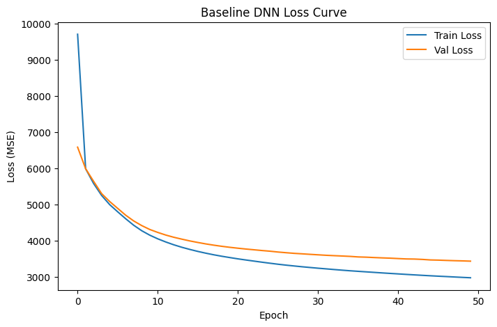

---

## Cell 30 - markdown

## B2. Loss Curve 시각화 + 과적합 분석 (3점)

**요구사항**:
- Train Loss와 Val Loss를 한 그래프에 시각화
- 그래프 제목, x/y 축 라벨, 범례 모두 포함

**분석 (마크다운으로 작성)**:
- Loss curve를 보고 과적합이 발생했는지 판단하라
- 어떤 신호로 과적합을 판단했는지 설명

(직접 작성)

---

## Cell 31 - markdown

**모델링**:
- Baseline DNN은 Dense(64) → Dense(32) → Dense(16) → Dense(1) 구조로 구성했다. 
- 입력 feature는 16개이고, target은 연속형 pm2.5이므로 출력층은 activation이 없는 Dense(1)로 두었다.
- Hidden layer에는 ReLU를 사용해 DEWP의 비교적 안정적인 관계와 Iws의 비선형 패턴을 함께 학습하도록 설계했다.

**분석**:
- Loss curve
    - train loss와 validation loss가 모두 epoch가 증가함에 따라 감소한다. 
    - Best epoch는 50이며, 50 epoch 범위 안에서는 마지막 epoch가 가장 낮은 validation loss를 보였다. 즉, Validation loss가 상승하지 않았으므로 강한 과적합은 관찰되지 않는다.

    - 단, train loss가 validation loss보다 지속적으로 낮고, 마지막 기준 train loss는 약 2976.8, validation loss는 약 3435.7로 gap이 약 458.9이다. 
    -> 따라서 모델이 train set에 더 잘 맞는 약한 generalization gap은 존재한다.

- Validation
    - 성능은 MAE 약 38.67, RMSE 약 58.62, R² 약 0.599로 나타났다.
    - Actual vs Predicted와 residual plot을 보면 모델은 전체 경향은 학습했지만, 예측값이 중앙 범위로 압축되는 경향이 있다.
        + 특히, 농도 구간별 오차 분석에서 저농도 구간은 과대예측하고, 고농도 extreme 구간은 과소예측하는 패턴이 나타났다.

**결론 및 향후 모델링 방향성**: 
- Baseline DNN은 강한 과적합 모델은 아니지만, 저/고농도 PM2.5 episode를 충분히 잡지 못하는 한계가 있다.
- -> Part C에서는 Dropout, L2 Regularization, EarlyStopping, Batch Normalization을 각각 개별 적용해 validation loss, train-validation gap, 그리고 고농도 구간 오차가 개선되는지 비교한다.

---

## Cell 32 - code

Execution count: `164`

````python
print(' === B2-1. Baseline Loss Curve + Best Epoch ===')

baseline_epoch_df = pd.DataFrame({
    'epoch': np.arange(1, len(baseline_history.history['loss']) + 1),
    'train_loss': baseline_history.history['loss'],
    'val_loss': baseline_history.history['val_loss'],
    'train_mae': baseline_history.history['mae'],
    'val_mae': baseline_history.history['val_mae']
})

baseline_epoch_df['loss_gap'] = baseline_epoch_df['val_loss'] - baseline_epoch_df['train_loss']

best_idx = baseline_epoch_df['val_loss'].idxmin()
best_row = baseline_epoch_df.loc[best_idx]
best_epoch = int(best_row['epoch'])

print(f"Best epoch    : {best_epoch}")
print(f"Train Loss    : {best_row['train_loss']:.4f}")
print(f"Val Loss      : {best_row['val_loss']:.4f}")
print(f"Gap           : {best_row['loss_gap']:.4f}")
print(f"Train MAE     : {best_row['train_mae']:.4f}")
print(f"Val MAE       : {best_row['val_mae']:.4f}")
print(f"Val RMSE      : {np.sqrt(best_row['val_loss']):.4f}")

plt.figure(figsize=(8, 5))
plt.plot(baseline_epoch_df['epoch'], baseline_epoch_df['train_loss'], label='Train Loss')
plt.plot(baseline_epoch_df['epoch'], baseline_epoch_df['val_loss'], label='Val Loss')
plt.axvline(best_epoch, linestyle='--', label=f'Best epoch = {best_epoch}')
plt.title('Baseline DNN Loss Curve')
plt.xlabel('Epoch')
plt.ylabel('Loss (MSE)')
plt.legend()
plt.show()
print('Loss curve를 보면 train loss와 validation loss가 모두 epoch가 증가함에 따라 감소한다. Best epoch는 50일때, Validation loss가 상승하지 않았으므로 강한 과적합은 관찰되지 않는다.')
print('따라서 모델이 train set에 더 잘 맞는 약한 generalization gap은 존재한다')

plt.figure(figsize=(8, 4))
plt.plot(baseline_epoch_df['epoch'], baseline_epoch_df['loss_gap'], label='Val Loss - Train Loss')
plt.axhline(0, linestyle='--')
plt.axvline(best_epoch, linestyle='--', label=f'Best epoch = {best_epoch}')
plt.title('Baseline Generalization Gap')
plt.xlabel('Epoch')
plt.ylabel('Loss Gap')
plt.legend()
plt.show()

print('다만 train loss가 validation loss보다 지속적으로 낮고, 마지막 기준 train loss는 약 2976.8, validation loss는 약 3435.7로 gap이 약 458.9이다.')
print('따라서 모델이 train set에 더 잘 맞는 약한 generalization gap은 존재한다')
print('== 단, validation loss가 증가하거나 train-validation gap이 급격히 벌어지는 패턴은 아니므로, 현재 baseline은 과적합보다는 정상 학습 중인 모델로 판단한다.==')
````

### Outputs

#### Output 0 - stream

Stream: `stdout`

````text
 === B2-1. Baseline Loss Curve + Best Epoch ===
Best epoch    : 50
Train Loss    : 2976.8030
Val Loss      : 3435.7214
Gap           : 458.9185
Train MAE     : 36.6870
Val MAE       : 38.6748
Val RMSE      : 58.6150
````
#### Output 1 - display_data

`text/plain`

````text
<Figure size 800x500 with 1 Axes>
````
`image/png`

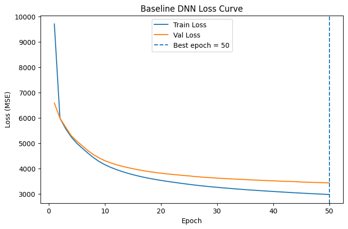
#### Output 2 - stream

Stream: `stdout`

````text
Loss curve를 보면 train loss와 validation loss가 모두 epoch가 증가함에 따라 감소한다. Best epoch는 50일때, Validation loss가 상승하지 않았으므로 강한 과적합은 관찰되지 않는다.
따라서 모델이 train set에 더 잘 맞는 약한 generalization gap은 존재한다
````
#### Output 3 - display_data

`text/plain`

````text
<Figure size 800x400 with 1 Axes>
````
`image/png`

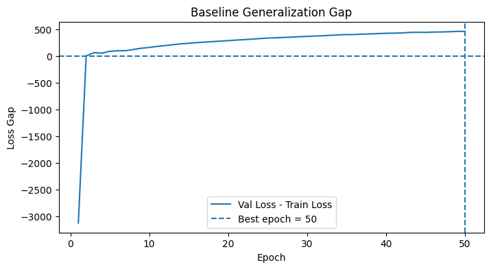
#### Output 4 - stream

Stream: `stdout`

````text
다만 train loss가 validation loss보다 지속적으로 낮고, 마지막 기준 train loss는 약 2976.8, validation loss는 약 3435.7로 gap이 약 458.9이다.
따라서 모델이 train set에 더 잘 맞는 약한 generalization gap은 존재한다
== 단, validation loss가 증가하거나 train-validation gap이 급격히 벌어지는 패턴은 아니므로, 현재 baseline은 과적합보다는 정상 학습 중인 모델로 판단한다.==
````

---

## Cell 33 - code

Execution count: `166`

````python
print(' === B2-2. Baseline Validation Prediction Check ===')

y_val_pred = baseline_model.predict(X_val, verbose=0).reshape(-1)

val_residual = y_val - y_val_pred
val_abs_error = np.abs(val_residual)

baseline_val_eval = pd.DataFrame({
    'y_true': y_val,
    'y_pred': y_val_pred,
    'residual': val_residual,
    'abs_error': val_abs_error
})

val_mae = mean_absolute_error(y_val, y_val_pred)
val_mse = mean_squared_error(y_val, y_val_pred)
val_rmse = np.sqrt(val_mse)
val_r2 = r2_score(y_val, y_val_pred)

print(f"MAE : {val_mae:.4f}")
print(f"MSE : {val_mse:.4f}")
print(f"RMSE: {val_rmse:.4f}")
print(f"R²  : {val_r2:.4f}")

display(baseline_val_eval.describe())

print('Validation 성능은 MAE 약 38.67, RMSE 약 58.62, R² 약 0.599로 나타났다.')

min_value = min(y_val.min(), y_val_pred.min())
max_value = max(y_val.max(), y_val_pred.max())

plt.figure(figsize=(6, 6))
plt.hexbin(y_val, y_val_pred, gridsize=50, mincnt=1)
plt.colorbar(label='count')
plt.plot([min_value, max_value], [min_value, max_value], linestyle='--')
plt.title('Actual vs Predicted PM2.5')
plt.xlabel('Actual PM2.5')
plt.ylabel('Predicted PM2.5')
plt.show()

print('Actual vs Predicted와 residual plot을 보면 모델은 전체 경향은 학습했지만, 예측값이 중앙 범위로 압축되는 경향이 있다')
plt.figure(figsize=(8, 4))
plt.scatter(y_val_pred, val_residual, alpha=0.25, s=8)
plt.axhline(0, linestyle='--')
plt.title('Residual Plot')
plt.xlabel('Predicted PM2.5')
plt.ylabel('Residual = Actual - Predicted')
plt.show()

print('== 이는 baseline DNN이 PM2.5 변동의 일부를 설명하고 있으나, 고농도 episode까지 충분히 정밀하게 맞히지는 못한다는 의미다. ==')
````

### Outputs

#### Output 0 - stream

Stream: `stdout`

````text
 === B2-2. Baseline Validation Prediction Check ===
MAE : 38.6748
MSE : 3435.7212
RMSE: 58.6150
R²  : 0.5992
````
#### Output 1 - display_data

`text/plain`

````text
            y_true       y_pred     residual    abs_error
count  8765.000000  8765.000000  8765.000000  8765.000000
mean     98.154823    93.874084     4.280728    38.674835
std      92.585632    71.427780    58.461838    44.047699
min       1.000000     0.935864  -293.919495     0.001511
25%      28.000000    41.369297   -23.420288    10.429062
50%      71.000000    76.765587    -1.965904    24.627083
75%     136.000000   123.553452    26.382679    51.340790
max     980.000000   490.334961   914.672363   914.672363
````
`text/html`

<details><summary>HTML output</summary>

````html
<div>
<style scoped>
    .dataframe tbody tr th:only-of-type {
        vertical-align: middle;
    }

    .dataframe tbody tr th {
        vertical-align: top;
    }

    .dataframe thead th {
        text-align: right;
    }
</style>
<table border="1" class="dataframe">
  <thead>
    <tr style="text-align: right;">
      <th></th>
      <th>y_true</th>
      <th>y_pred</th>
      <th>residual</th>
      <th>abs_error</th>
    </tr>
  </thead>
  <tbody>
    <tr>
      <th>count</th>
      <td>8765.000000</td>
      <td>8765.000000</td>
      <td>8765.000000</td>
      <td>8765.000000</td>
    </tr>
    <tr>
      <th>mean</th>
      <td>98.154823</td>
      <td>93.874084</td>
      <td>4.280728</td>
      <td>38.674835</td>
    </tr>
    <tr>
      <th>std</th>
      <td>92.585632</td>
      <td>71.427780</td>
      <td>58.461838</td>
      <td>44.047699</td>
    </tr>
    <tr>
      <th>min</th>
      <td>1.000000</td>
      <td>0.935864</td>
      <td>-293.919495</td>
      <td>0.001511</td>
    </tr>
    <tr>
      <th>25%</th>
      <td>28.000000</td>
      <td>41.369297</td>
      <td>-23.420288</td>
      <td>10.429062</td>
    </tr>
    <tr>
      <th>50%</th>
      <td>71.000000</td>
      <td>76.765587</td>
      <td>-1.965904</td>
      <td>24.627083</td>
    </tr>
    <tr>
      <th>75%</th>
      <td>136.000000</td>
      <td>123.553452</td>
      <td>26.382679</td>
      <td>51.340790</td>
    </tr>
    <tr>
      <th>max</th>
      <td>980.000000</td>
      <td>490.334961</td>
      <td>914.672363</td>
      <td>914.672363</td>
    </tr>
  </tbody>
</table>
</div>
````
</details>
#### Output 2 - stream

Stream: `stdout`

````text
Validation 성능은 MAE 약 38.67, RMSE 약 58.62, R² 약 0.599로 나타났다.
````
#### Output 3 - display_data

`text/plain`

````text
<Figure size 600x600 with 2 Axes>
````
`image/png`

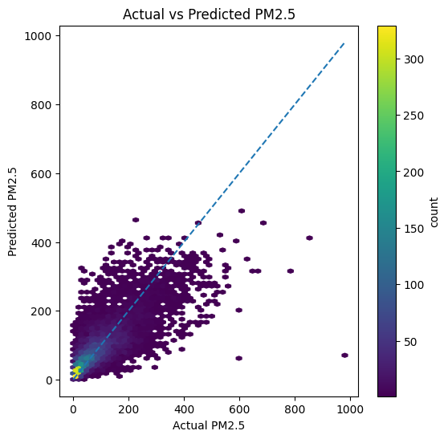
#### Output 4 - stream

Stream: `stdout`

````text
Actual vs Predicted와 residual plot을 보면 모델은 전체 경향은 학습했지만, 예측값이 중앙 범위로 압축되는 경향이 있다
````
#### Output 5 - display_data

`text/plain`

````text
<Figure size 800x400 with 1 Axes>
````
`image/png`

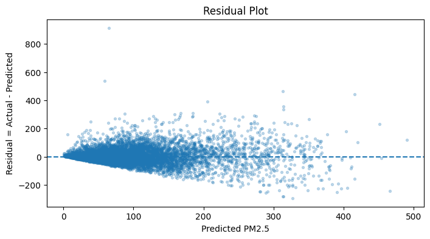
#### Output 6 - stream

Stream: `stdout`

````text
== 이는 baseline DNN이 PM2.5 변동의 일부를 설명하고 있으나, 고농도 episode까지 충분히 정밀하게 맞히지는 못한다는 의미다. ==
````

---

## Cell 34 - code

Execution count: `172`

````python
print(' === B2-3. PM2.5 농도구간별오차. (categorical로 치환)===')

q50 = np.quantile(y_val, 0.50)
q75 = np.quantile(y_val, 0.75)
q95 = np.quantile(y_val, 0.95)

def pm25_bin(x):
    if x < q50:
        return 'low_<50%'
    elif x < q75:
        return 'mid_50-75%'
    elif x < q95:
        return 'high_75-95%'
    else:
        return 'extreme_>=95%'

bin_order = ['low_<50%', 'mid_50-75%', 'high_75-95%', 'extreme_>=95%']

baseline_val_eval['pm25_bin'] = baseline_val_eval['y_true'].apply(pm25_bin)
baseline_val_eval['pm25_bin'] = pd.Categorical(
    baseline_val_eval['pm25_bin'],
    categories=bin_order,
    ordered=True
)

bin_error = baseline_val_eval.groupby('pm25_bin', observed=False).agg(
    count=('y_true', 'count'),
    y_true_mean=('y_true', 'mean'),
    y_pred_mean=('y_pred', 'mean'),
    mae=('abs_error', 'mean'),
    residual_mean=('residual', 'mean')
)

bin_error['bias'] = np.where(
    bin_error['residual_mean'] > 0,
    'underprediction',
    'overprediction'
)

display(bin_error)
print('== 농도 구간별 오차 분석에서 저농도 구간은 과대예측하고, 고농도 extreme 구간은 과소예측하는 패턴이 나타났다. ==')


plt.figure(figsize=(8, 4))
plt.bar(bin_error.index, bin_error['mae'])
plt.title('Validation MAE by PM2.5 Bin')
plt.xlabel('PM2.5 bin')
plt.ylabel('MAE')
plt.xticks(rotation=25)
plt.show()

print('===  따라서 Baseline DNN은 강한 과적합 모델은 아니지만, 저농도, 특히 고농도 PM2.5 episode를 충분히 잡지 못하는 한계가 있다. ===')

plt.figure(figsize=(8, 4))
plt.bar(bin_error.index, bin_error['residual_mean'])
plt.axhline(0, linestyle='--')
plt.title('Mean Residual by PM2.5 Bin')
plt.xlabel('PM2.5 bin')
plt.ylabel('Mean residual')
plt.xticks(rotation=25)
plt.show()

print(' ==> 이에 대하여 Part C에서는 Dropout, L2 Regularization, EarlyStopping, Batch Normalization을 각각 개별 적용하여,')
print('validation loss, train-validation gap, 그리고 고농도 구간 오차가 개선되는지를 중점적으로 비교함이 적절할 것으로 판단된다. ==')
````

### Outputs

#### Output 0 - stream

Stream: `stdout`

````text
 === B2-3. PM2.5 농도구간별오차. (categorical로 치환)===
````
#### Output 1 - display_data

`text/plain`

````text
               count  y_true_mean  y_pred_mean         mae  residual_mean  \
pm25_bin                                                                    
low_<50%        4345    32.170311    51.515148   24.843506     -19.344833   
mid_50-75%      2215    99.531830    99.225487   32.270836       0.306343   
high_75-95%     1765   190.954681   151.979202   59.554153      38.975487   
extreme_>=95%    440   370.565918   252.148636  123.743004     118.417282   

                          bias  
pm25_bin                        
low_<50%        overprediction  
mid_50-75%     underprediction  
high_75-95%    underprediction  
extreme_>=95%  underprediction  
````
`text/html`

<details><summary>HTML output</summary>

````html
<div>
<style scoped>
    .dataframe tbody tr th:only-of-type {
        vertical-align: middle;
    }

    .dataframe tbody tr th {
        vertical-align: top;
    }

    .dataframe thead th {
        text-align: right;
    }
</style>
<table border="1" class="dataframe">
  <thead>
    <tr style="text-align: right;">
      <th></th>
      <th>count</th>
      <th>y_true_mean</th>
      <th>y_pred_mean</th>
      <th>mae</th>
      <th>residual_mean</th>
      <th>bias</th>
    </tr>
    <tr>
      <th>pm25_bin</th>
      <th></th>
      <th></th>
      <th></th>
      <th></th>
      <th></th>
      <th></th>
    </tr>
  </thead>
  <tbody>
    <tr>
      <th>low_&lt;50%</th>
      <td>4345</td>
      <td>32.170311</td>
      <td>51.515148</td>
      <td>24.843506</td>
      <td>-19.344833</td>
      <td>overprediction</td>
    </tr>
    <tr>
      <th>mid_50-75%</th>
      <td>2215</td>
      <td>99.531830</td>
      <td>99.225487</td>
      <td>32.270836</td>
      <td>0.306343</td>
      <td>underprediction</td>
    </tr>
    <tr>
      <th>high_75-95%</th>
      <td>1765</td>
      <td>190.954681</td>
      <td>151.979202</td>
      <td>59.554153</td>
      <td>38.975487</td>
      <td>underprediction</td>
    </tr>
    <tr>
      <th>extreme_&gt;=95%</th>
      <td>440</td>
      <td>370.565918</td>
      <td>252.148636</td>
      <td>123.743004</td>
      <td>118.417282</td>
      <td>underprediction</td>
    </tr>
  </tbody>
</table>
</div>
````
</details>
#### Output 2 - stream

Stream: `stdout`

````text
== 농도 구간별 오차 분석에서 저농도 구간은 과대예측하고, 고농도 extreme 구간은 과소예측하는 패턴이 나타났다. ==
````
#### Output 3 - display_data

`text/plain`

````text
<Figure size 800x400 with 1 Axes>
````
`image/png`

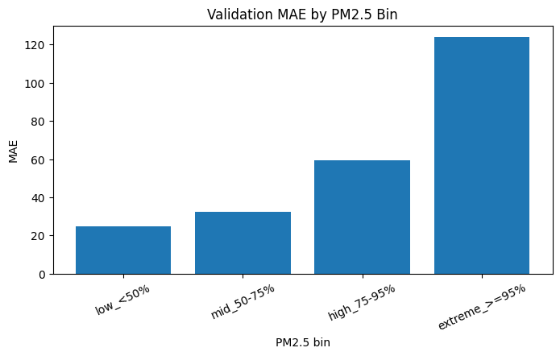
#### Output 4 - stream

Stream: `stdout`

````text
===  따라서 Baseline DNN은 강한 과적합 모델은 아니지만, 저농도, 특히 고농도 PM2.5 episode를 충분히 잡지 못하는 한계가 있다. ===
````
#### Output 5 - display_data

`text/plain`

````text
<Figure size 800x400 with 1 Axes>
````
`image/png`

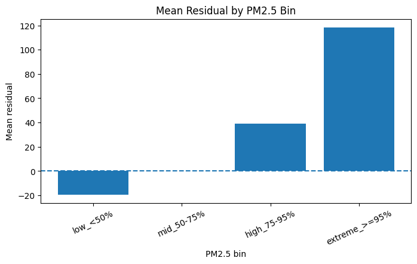
#### Output 6 - stream

Stream: `stdout`

````text
 ==> 이에 대하여 Part C에서는 Dropout, L2 Regularization, EarlyStopping, Batch Normalization을 각각 개별 적용하여,
validation loss, train-validation gap, 그리고 고농도 구간 오차가 개선되는지를 중점적으로 비교함이 적절할 것으로 판단된다. ==
````

---

## Cell 35 - markdown

---
# Part C. 정규화 4총사 각각 적용 (14점)

Part B와 같은 조건(같은 데이터, 같은 학습 설정)에서
*각 정규화 기법을 개별적으로* 적용해 효과를 비교하세요.

---

## Cell 36 - markdown

**B 요약 및 C 모델링 방향성**:
- Baseline 모델은 과적합이 심한 모델이 아니며, 정상적으로 학습 중이지만 저/고농도 값에 대해 성능이 다소 부족한 문제가 발생하였다.

- 따라서 C파트의 목적은 단순히 train loss를 낮추는 것이 아니라 validation 일반화와 고농도 구간 예측 취약점이 개선되는지 확인하는 것이다.

---

## Cell 37 - code

Execution count: `173`

````python
print(' === C0. 정규화 GLOBAL 설정 ===')

regularization_results = []
regularization_histories = {}

def get_last_result(model_name, history):
    train_loss = history.history['loss'][-1]
    val_loss = history.history['val_loss'][-1]
    gap = val_loss - train_loss
    
    train_mae = history.history['mae'][-1]
    val_mae = history.history['val_mae'][-1]
    
    print(f'[{model_name}]')
    print(f'Train Loss: {train_loss:.4f}')
    print(f'Val Loss  : {val_loss:.4f}')
    print(f'Gap       : {gap:.4f}')
    print(f'Train MAE : {train_mae:.4f}')
    print(f'Val MAE   : {val_mae:.4f}')
    
    return {
        'model': model_name,
        'train_loss': train_loss,
        'val_loss': val_loss,
        'gap': gap,
        'train_mae': train_mae,
        'val_mae': val_mae,
        'epochs': len(history.history['loss'])
    }

# Baseline도 같은 기준으로 저장
baseline_c_result = get_last_result('Baseline', baseline_history)
regularization_results.append(baseline_c_result)
regularization_histories['Baseline'] = baseline_history
````

### Outputs

#### Output 0 - stream

Stream: `stdout`

````text
 === C0. 정규화 GLOBAL 설정 ===
[Baseline]
Train Loss: 2976.8030
Val Loss  : 3435.7214
Gap       : 458.9185
Train MAE : 36.6870
Val MAE   : 38.6748
````

---

## Cell 38 - markdown

## C1. Dropout 적용 (3점)

**요구사항**: Baseline 구조에 Dropout(0.3)을 추가
**필수 출력**: Train Loss, Val Loss, Gap

---

## Cell 39 - code

Execution count: `174`

````python
print(' === C1. Dropout(0.3) 적용 ===')

np.random.seed(SEED)
keras.utils.set_random_seed(SEED)

def build_dropout_model():
    model = Sequential()
    model.add(Dense(64, activation='relu', input_shape=(input_dim,)))
    model.add(Dropout(0.3))
    model.add(Dense(32, activation='relu'))
    model.add(Dropout(0.3))
    model.add(Dense(16, activation='relu'))
    model.add(Dropout(0.3))
    model.add(Dense(1))
    
    model.compile(
        optimizer='adam',
        loss='mse',
        metrics=['mae']
    )
    
    return model

dropout_model = build_dropout_model()

dropout_history = dropout_model.fit(
    X_train, y_train,
    validation_data=(X_val, y_val),
    epochs=50,
    batch_size=64,
    verbose=1
)

dropout_result = get_last_result('Dropout', dropout_history)

regularization_results.append(dropout_result)
regularization_histories['Dropout'] = dropout_history
````

### Outputs

#### Output 0 - stream

Stream: `stdout`

````text
 === C1. Dropout(0.3) 적용 ===
Epoch 1/50
````
#### Output 1 - stream

Stream: `stderr`

````text
/home/sieg/projects-wsl/hongikUniv.-26_1/.venv/lib/python3.12/site-packages/keras/src/layers/core/dense.py:107: UserWarning: Do not pass an `input_shape`/`input_dim` argument to a layer. When using Sequential models, prefer using an `Input(shape)` object as the first layer in the model instead.
  super().__init__(activity_regularizer=activity_regularizer, **kwargs)
````
#### Output 2 - stream

Stream: `stdout`

````text
411/411 ━━━━━━━━━━━━━━━━━━━━ 5s 3ms/step - loss: 9861.0264 - mae: 68.3546 - val_loss: 6782.9443 - val_mae: 56.8678
Epoch 2/50
411/411 ━━━━━━━━━━━━━━━━━━━━ 1s 3ms/step - loss: 7078.2373 - mae: 58.6014 - val_loss: 6236.7700 - val_mae: 54.4413
Epoch 3/50
411/411 ━━━━━━━━━━━━━━━━━━━━ 3s 7ms/step - loss: 6742.8457 - mae: 56.7234 - val_loss: 5980.2783 - val_mae: 53.1799
Epoch 4/50
411/411 ━━━━━━━━━━━━━━━━━━━━ 1s 2ms/step - loss: 6598.4551 - mae: 55.8798 - val_loss: 5912.7422 - val_mae: 52.0621
Epoch 5/50
411/411 ━━━━━━━━━━━━━━━━━━━━ 1s 2ms/step - loss: 6440.2080 - mae: 54.7286 - val_loss: 5775.5371 - val_mae: 51.6464
Epoch 6/50
411/411 ━━━━━━━━━━━━━━━━━━━━ 1s 2ms/step - loss: 6333.9316 - mae: 54.5540 - val_loss: 5666.4326 - val_mae: 51.2303
Epoch 7/50
411/411 ━━━━━━━━━━━━━━━━━━━━ 1s 3ms/step - loss: 6333.1841 - mae: 54.3905 - val_loss: 5626.2261 - val_mae: 50.5634
Epoch 8/50
411/411 ━━━━━━━━━━━━━━━━━━━━ 1s 2ms/step - loss: 6135.4199 - mae: 53.3197 - val_loss: 5499.8286 - val_mae: 50.0469
Epoch 9/50
411/411 ━━━━━━━━━━━━━━━━━━━━ 1s 3ms/step - loss: 6052.9658 - mae: 52.9954 - val_loss: 5430.0190 - val_mae: 49.1600
Epoch 10/50
411/411 ━━━━━━━━━━━━━━━━━━━━ 1s 2ms/step - loss: 5999.8223 - mae: 52.3640 - val_loss: 5290.2026 - val_mae: 48.6739
Epoch 11/50
411/411 ━━━━━━━━━━━━━━━━━━━━ 1s 2ms/step - loss: 5883.3965 - mae: 51.8485 - val_loss: 5153.1792 - val_mae: 48.1250
Epoch 12/50
411/411 ━━━━━━━━━━━━━━━━━━━━ 1s 2ms/step - loss: 5839.1597 - mae: 51.5227 - val_loss: 5041.3735 - val_mae: 47.3230
Epoch 13/50
411/411 ━━━━━━━━━━━━━━━━━━━━ 1s 2ms/step - loss: 5648.5249 - mae: 50.5132 - val_loss: 4955.2383 - val_mae: 46.8719
Epoch 14/50
411/411 ━━━━━━━━━━━━━━━━━━━━ 1s 2ms/step - loss: 5594.4927 - mae: 50.2674 - val_loss: 4847.4131 - val_mae: 46.2633
Epoch 15/50
411/411 ━━━━━━━━━━━━━━━━━━━━ 1s 2ms/step - loss: 5603.9722 - mae: 49.9685 - val_loss: 4732.4775 - val_mae: 46.0418
Epoch 16/50
411/411 ━━━━━━━━━━━━━━━━━━━━ 1s 2ms/step - loss: 5476.2861 - mae: 49.4492 - val_loss: 4748.0332 - val_mae: 45.4336
Epoch 17/50
411/411 ━━━━━━━━━━━━━━━━━━━━ 1s 2ms/step - loss: 5433.6934 - mae: 49.2906 - val_loss: 4614.2515 - val_mae: 45.3525
Epoch 18/50
411/411 ━━━━━━━━━━━━━━━━━━━━ 1s 2ms/step - loss: 5314.7241 - mae: 48.9846 - val_loss: 4559.0664 - val_mae: 44.9335
Epoch 19/50
411/411 ━━━━━━━━━━━━━━━━━━━━ 1s 2ms/step - loss: 5394.4243 - mae: 48.7707 - val_loss: 4520.3311 - val_mae: 44.6852
Epoch 20/50
411/411 ━━━━━━━━━━━━━━━━━━━━ 1s 2ms/step - loss: 5281.0068 - mae: 48.5388 - val_loss: 4474.8340 - val_mae: 44.7172
Epoch 21/50
411/411 ━━━━━━━━━━━━━━━━━━━━ 1s 2ms/step - loss: 5215.4307 - mae: 48.2029 - val_loss: 4455.0420 - val_mae: 44.4914
Epoch 22/50
411/411 ━━━━━━━━━━━━━━━━━━━━ 1s 2ms/step - loss: 5150.2817 - mae: 48.0255 - val_loss: 4415.0659 - val_mae: 44.4364
Epoch 23/50
411/411 ━━━━━━━━━━━━━━━━━━━━ 1s 2ms/step - loss: 5230.5459 - mae: 48.4239 - val_loss: 4516.9058 - val_mae: 44.2580
Epoch 24/50
411/411 ━━━━━━━━━━━━━━━━━━━━ 1s 2ms/step - loss: 5092.8999 - mae: 47.9157 - val_loss: 4455.2495 - val_mae: 44.3523
Epoch 25/50
411/411 ━━━━━━━━━━━━━━━━━━━━ 1s 2ms/step - loss: 5118.1729 - mae: 48.0352 - val_loss: 4391.8281 - val_mae: 44.2282
Epoch 26/50
411/411 ━━━━━━━━━━━━━━━━━━━━ 1s 2ms/step - loss: 5081.4697 - mae: 47.7446 - val_loss: 4380.3936 - val_mae: 44.0562
Epoch 27/50
411/411 ━━━━━━━━━━━━━━━━━━━━ 1s 2ms/step - loss: 5107.3608 - mae: 47.8859 - val_loss: 4368.8330 - val_mae: 44.3131
Epoch 28/50
411/411 ━━━━━━━━━━━━━━━━━━━━ 1s 2ms/step - loss: 5093.5205 - mae: 47.6831 - val_loss: 4405.1362 - val_mae: 44.0097
Epoch 29/50
411/411 ━━━━━━━━━━━━━━━━━━━━ 1s 3ms/step - loss: 5148.1313 - mae: 47.9899 - val_loss: 4334.5161 - val_mae: 43.9272
Epoch 30/50
411/411 ━━━━━━━━━━━━━━━━━━━━ 1s 3ms/step - loss: 5132.9038 - mae: 47.9379 - val_loss: 4372.3936 - val_mae: 43.9937
Epoch 31/50
411/411 ━━━━━━━━━━━━━━━━━━━━ 1s 3ms/step - loss: 5099.3618 - mae: 47.7009 - val_loss: 4380.9966 - val_mae: 44.0575
Epoch 32/50
411/411 ━━━━━━━━━━━━━━━━━━━━ 1s 3ms/step - loss: 5077.0884 - mae: 47.4850 - val_loss: 4373.0415 - val_mae: 43.7836
Epoch 33/50
411/411 ━━━━━━━━━━━━━━━━━━━━ 1s 3ms/step - loss: 5094.0063 - mae: 47.4834 - val_loss: 4359.7163 - val_mae: 43.9698
Epoch 34/50
411/411 ━━━━━━━━━━━━━━━━━━━━ 3s 7ms/step - loss: 4992.4062 - mae: 47.1611 - val_loss: 4339.9214 - val_mae: 43.8923
Epoch 35/50
411/411 ━━━━━━━━━━━━━━━━━━━━ 1s 2ms/step - loss: 5010.3667 - mae: 47.2571 - val_loss: 4280.7207 - val_mae: 43.8453
Epoch 36/50
411/411 ━━━━━━━━━━━━━━━━━━━━ 1s 2ms/step - loss: 4996.9644 - mae: 47.3383 - val_loss: 4289.6689 - val_mae: 43.6608
Epoch 37/50
411/411 ━━━━━━━━━━━━━━━━━━━━ 1s 2ms/step - loss: 5026.1626 - mae: 47.2507 - val_loss: 4357.4268 - val_mae: 43.6397
Epoch 38/50
411/411 ━━━━━━━━━━━━━━━━━━━━ 1s 2ms/step - loss: 5028.6948 - mae: 47.5024 - val_loss: 4269.7832 - val_mae: 43.9628
Epoch 39/50
411/411 ━━━━━━━━━━━━━━━━━━━━ 1s 2ms/step - loss: 5053.8984 - mae: 47.4851 - val_loss: 4296.0513 - val_mae: 43.6198
Epoch 40/50
411/411 ━━━━━━━━━━━━━━━━━━━━ 1s 2ms/step - loss: 4995.4160 - mae: 47.1897 - val_loss: 4278.3003 - val_mae: 43.8270
Epoch 41/50
411/411 ━━━━━━━━━━━━━━━━━━━━ 1s 2ms/step - loss: 4954.0098 - mae: 47.0908 - val_loss: 4248.9170 - val_mae: 43.5030
Epoch 42/50
411/411 ━━━━━━━━━━━━━━━━━━━━ 1s 2ms/step - loss: 4992.1265 - mae: 47.0979 - val_loss: 4287.1318 - val_mae: 43.6031
Epoch 43/50
411/411 ━━━━━━━━━━━━━━━━━━━━ 1s 2ms/step - loss: 4950.8589 - mae: 46.9913 - val_loss: 4247.3569 - val_mae: 43.3197
Epoch 44/50
411/411 ━━━━━━━━━━━━━━━━━━━━ 1s 2ms/step - loss: 4931.3564 - mae: 46.8531 - val_loss: 4264.3667 - val_mae: 43.1775
Epoch 45/50
411/411 ━━━━━━━━━━━━━━━━━━━━ 1s 2ms/step - loss: 4884.6436 - mae: 46.7508 - val_loss: 4209.7876 - val_mae: 43.3723
Epoch 46/50
411/411 ━━━━━━━━━━━━━━━━━━━━ 1s 2ms/step - loss: 4951.7334 - mae: 47.0867 - val_loss: 4220.7729 - val_mae: 43.3835
Epoch 47/50
411/411 ━━━━━━━━━━━━━━━━━━━━ 1s 3ms/step - loss: 4979.6084 - mae: 47.0593 - val_loss: 4229.9756 - val_mae: 43.3920
Epoch 48/50
411/411 ━━━━━━━━━━━━━━━━━━━━ 1s 3ms/step - loss: 4960.5752 - mae: 47.1568 - val_loss: 4193.5454 - val_mae: 43.3459
Epoch 49/50
411/411 ━━━━━━━━━━━━━━━━━━━━ 1s 2ms/step - loss: 4954.1348 - mae: 46.8590 - val_loss: 4239.1460 - val_mae: 43.2394
Epoch 50/50
411/411 ━━━━━━━━━━━━━━━━━━━━ 1s 3ms/step - loss: 4899.9727 - mae: 46.8460 - val_loss: 4221.3521 - val_mae: 43.2610
[Dropout]
Train Loss: 4899.9727
Val Loss  : 4221.3521
Gap       : -678.6206
Train MAE : 46.8460
Val MAE   : 43.2610
````

---

## Cell 40 - markdown

## C2. L2 Regularization 적용 (3점)

**요구사항**: 모든 Dense 층에 `kernel_regularizer=l2(0.01)`
**필수 출력**: Train Loss, Val Loss, Gap

---

## Cell 41 - code

Execution count: `175`

````python
print(' === C2. L2 Regularization 적용 ===')

np.random.seed(SEED)
keras.utils.set_random_seed(SEED)

def build_l2_model():
    model = Sequential()
    
    model.add(Dense(64, activation='relu', kernel_regularizer=l2(0.01), input_shape=(input_dim,)))
    model.add(Dense(32, activation='relu', kernel_regularizer=l2(0.01)))
    model.add(Dense(16, activation='relu', kernel_regularizer=l2(0.01)))
    model.add(Dense(1, kernel_regularizer=l2(0.01)))
    
    model.compile(
        optimizer='adam',
        loss='mse',
        metrics=['mae']
    )
    
    return model

l2_model = build_l2_model()

l2_history = l2_model.fit(
    X_train, y_train,
    validation_data=(X_val, y_val),
    epochs=50,
    batch_size=64,
    verbose=1
)

l2_result = get_last_result('L2', l2_history)

regularization_results.append(l2_result)
regularization_histories['L2'] = l2_history
````

### Outputs

#### Output 0 - stream

Stream: `stdout`

````text
 === C2. L2 Regularization 적용 ===
Epoch 1/50
411/411 ━━━━━━━━━━━━━━━━━━━━ 2s 3ms/step - loss: 9711.8916 - mae: 68.3688 - val_loss: 6589.1533 - val_mae: 57.9772
Epoch 2/50
411/411 ━━━━━━━━━━━━━━━━━━━━ 1s 2ms/step - loss: 5990.4014 - mae: 55.2879 - val_loss: 5988.4546 - val_mae: 54.4924
Epoch 3/50
411/411 ━━━━━━━━━━━━━━━━━━━━ 1s 2ms/step - loss: 5559.6240 - mae: 52.4235 - val_loss: 5599.5991 - val_mae: 52.1543
Epoch 4/50
411/411 ━━━━━━━━━━━━━━━━━━━━ 1s 2ms/step - loss: 5223.7559 - mae: 50.5185 - val_loss: 5291.6201 - val_mae: 50.7118
Epoch 5/50
411/411 ━━━━━━━━━━━━━━━━━━━━ 1s 2ms/step - loss: 4996.4048 - mae: 49.2905 - val_loss: 5094.1792 - val_mae: 49.7600
Epoch 6/50
411/411 ━━━━━━━━━━━━━━━━━━━━ 1s 2ms/step - loss: 4814.1313 - mae: 48.1675 - val_loss: 4921.9497 - val_mae: 48.7878
Epoch 7/50
411/411 ━━━━━━━━━━━━━━━━━━━━ 1s 2ms/step - loss: 4639.9131 - mae: 47.0185 - val_loss: 4755.9058 - val_mae: 47.8241
Epoch 8/50
411/411 ━━━━━━━━━━━━━━━━━━━━ 1s 2ms/step - loss: 4475.5762 - mae: 45.9381 - val_loss: 4601.5771 - val_mae: 46.9278
Epoch 9/50
411/411 ━━━━━━━━━━━━━━━━━━━━ 1s 2ms/step - loss: 4324.8037 - mae: 44.9561 - val_loss: 4467.4302 - val_mae: 46.1221
Epoch 10/50
411/411 ━━━━━━━━━━━━━━━━━━━━ 1s 2ms/step - loss: 4195.6211 - mae: 44.1238 - val_loss: 4359.4106 - val_mae: 45.4407
Epoch 11/50
411/411 ━━━━━━━━━━━━━━━━━━━━ 1s 2ms/step - loss: 4089.9773 - mae: 43.4227 - val_loss: 4268.9360 - val_mae: 44.8137
Epoch 12/50
411/411 ━━━━━━━━━━━━━━━━━━━━ 1s 2ms/step - loss: 4001.4495 - mae: 42.8413 - val_loss: 4194.2231 - val_mae: 44.2913
Epoch 13/50
411/411 ━━━━━━━━━━━━━━━━━━━━ 1s 2ms/step - loss: 3925.7563 - mae: 42.3447 - val_loss: 4129.4697 - val_mae: 43.8238
Epoch 14/50
411/411 ━━━━━━━━━━━━━━━━━━━━ 1s 2ms/step - loss: 3858.7737 - mae: 41.9124 - val_loss: 4073.0862 - val_mae: 43.3749
Epoch 15/50
411/411 ━━━━━━━━━━━━━━━━━━━━ 1s 2ms/step - loss: 3798.6804 - mae: 41.5283 - val_loss: 4018.7615 - val_mae: 42.9609
Epoch 16/50
411/411 ━━━━━━━━━━━━━━━━━━━━ 1s 2ms/step - loss: 3743.7085 - mae: 41.1803 - val_loss: 3973.3203 - val_mae: 42.6111
Epoch 17/50
411/411 ━━━━━━━━━━━━━━━━━━━━ 1s 2ms/step - loss: 3694.3635 - mae: 40.8671 - val_loss: 3931.4634 - val_mae: 42.3071
Epoch 18/50
411/411 ━━━━━━━━━━━━━━━━━━━━ 1s 2ms/step - loss: 3648.3042 - mae: 40.5835 - val_loss: 3890.9285 - val_mae: 42.0323
Epoch 19/50
411/411 ━━━━━━━━━━━━━━━━━━━━ 1s 2ms/step - loss: 3605.4062 - mae: 40.3248 - val_loss: 3855.1741 - val_mae: 41.7557
Epoch 20/50
411/411 ━━━━━━━━━━━━━━━━━━━━ 1s 2ms/step - loss: 3566.0635 - mae: 40.0854 - val_loss: 3822.4648 - val_mae: 41.5104
Epoch 21/50
411/411 ━━━━━━━━━━━━━━━━━━━━ 1s 2ms/step - loss: 3528.8042 - mae: 39.8578 - val_loss: 3790.9751 - val_mae: 41.2724
Epoch 22/50
411/411 ━━━━━━━━━━━━━━━━━━━━ 1s 2ms/step - loss: 3494.7561 - mae: 39.6444 - val_loss: 3760.5068 - val_mae: 41.0477
Epoch 23/50
411/411 ━━━━━━━━━━━━━━━━━━━━ 1s 2ms/step - loss: 3462.3025 - mae: 39.4425 - val_loss: 3735.9521 - val_mae: 40.9038
Epoch 24/50
411/411 ━━━━━━━━━━━━━━━━━━━━ 1s 2ms/step - loss: 3430.9871 - mae: 39.2495 - val_loss: 3713.2354 - val_mae: 40.7234
Epoch 25/50
411/411 ━━━━━━━━━━━━━━━━━━━━ 1s 2ms/step - loss: 3402.4055 - mae: 39.0656 - val_loss: 3695.2900 - val_mae: 40.5710
Epoch 26/50
411/411 ━━━━━━━━━━━━━━━━━━━━ 3s 7ms/step - loss: 3375.2651 - mae: 38.8951 - val_loss: 3675.0562 - val_mae: 40.4175
Epoch 27/50
411/411 ━━━━━━━━━━━━━━━━━━━━ 1s 2ms/step - loss: 3349.5012 - mae: 38.7318 - val_loss: 3654.8772 - val_mae: 40.2551
Epoch 28/50
411/411 ━━━━━━━━━━━━━━━━━━━━ 1s 2ms/step - loss: 3324.7864 - mae: 38.5779 - val_loss: 3636.9236 - val_mae: 40.1404
Epoch 29/50
411/411 ━━━━━━━━━━━━━━━━━━━━ 1s 2ms/step - loss: 3302.0857 - mae: 38.4318 - val_loss: 3618.5005 - val_mae: 40.0143
Epoch 30/50
411/411 ━━━━━━━━━━━━━━━━━━━━ 1s 2ms/step - loss: 3281.3533 - mae: 38.2962 - val_loss: 3603.2129 - val_mae: 39.8974
Epoch 31/50
411/411 ━━━━━━━━━━━━━━━━━━━━ 1s 2ms/step - loss: 3261.1360 - mae: 38.1780 - val_loss: 3589.2490 - val_mae: 39.8093
Epoch 32/50
411/411 ━━━━━━━━━━━━━━━━━━━━ 1s 2ms/step - loss: 3243.3032 - mae: 38.0681 - val_loss: 3577.3816 - val_mae: 39.7496
Epoch 33/50
411/411 ━━━━━━━━━━━━━━━━━━━━ 1s 2ms/step - loss: 3226.7593 - mae: 37.9670 - val_loss: 3565.4265 - val_mae: 39.6680
Epoch 34/50
411/411 ━━━━━━━━━━━━━━━━━━━━ 1s 2ms/step - loss: 3211.1411 - mae: 37.8663 - val_loss: 3555.3125 - val_mae: 39.5796
Epoch 35/50
411/411 ━━━━━━━━━━━━━━━━━━━━ 1s 2ms/step - loss: 3194.7705 - mae: 37.7660 - val_loss: 3542.3796 - val_mae: 39.5071
Epoch 36/50
411/411 ━━━━━━━━━━━━━━━━━━━━ 1s 2ms/step - loss: 3180.5886 - mae: 37.6792 - val_loss: 3532.1790 - val_mae: 39.4425
Epoch 37/50
411/411 ━━━━━━━━━━━━━━━━━━━━ 1s 2ms/step - loss: 3166.5835 - mae: 37.5973 - val_loss: 3523.1648 - val_mae: 39.4052
Epoch 38/50
411/411 ━━━━━━━━━━━━━━━━━━━━ 1s 2ms/step - loss: 3152.9666 - mae: 37.5120 - val_loss: 3512.8550 - val_mae: 39.3179
Epoch 39/50
411/411 ━━━━━━━━━━━━━━━━━━━━ 1s 2ms/step - loss: 3141.1306 - mae: 37.4375 - val_loss: 3504.8464 - val_mae: 39.2732
Epoch 40/50
411/411 ━━━━━━━━━━━━━━━━━━━━ 1s 2ms/step - loss: 3127.9729 - mae: 37.3593 - val_loss: 3498.4890 - val_mae: 39.2086
Epoch 41/50
411/411 ━━━━━━━━━━━━━━━━━━━━ 1s 2ms/step - loss: 3115.2207 - mae: 37.2840 - val_loss: 3488.6702 - val_mae: 39.1335
Epoch 42/50
411/411 ━━━━━━━━━━━━━━━━━━━━ 1s 2ms/step - loss: 3102.7283 - mae: 37.2125 - val_loss: 3481.2651 - val_mae: 39.0827
Epoch 43/50
411/411 ━━━━━━━━━━━━━━━━━━━━ 1s 2ms/step - loss: 3092.3259 - mae: 37.1502 - val_loss: 3471.6731 - val_mae: 39.0112
Epoch 44/50
411/411 ━━━━━━━━━━━━━━━━━━━━ 1s 2ms/step - loss: 3081.3672 - mae: 37.0883 - val_loss: 3461.3896 - val_mae: 38.9729
Epoch 45/50
411/411 ━━━━━━━━━━━━━━━━━━━━ 1s 2ms/step - loss: 3069.2075 - mae: 37.0200 - val_loss: 3456.8179 - val_mae: 38.9020
Epoch 46/50
411/411 ━━━━━━━━━━━━━━━━━━━━ 1s 2ms/step - loss: 3057.6521 - mae: 36.9519 - val_loss: 3450.8198 - val_mae: 38.8476
Epoch 47/50
411/411 ━━━━━━━━━━━━━━━━━━━━ 1s 2ms/step - loss: 3046.8660 - mae: 36.8969 - val_loss: 3445.3459 - val_mae: 38.7925
Epoch 48/50
411/411 ━━━━━━━━━━━━━━━━━━━━ 1s 2ms/step - loss: 3036.5027 - mae: 36.8429 - val_loss: 3438.6982 - val_mae: 38.7426
Epoch 49/50
411/411 ━━━━━━━━━━━━━━━━━━━━ 1s 2ms/step - loss: 3025.2939 - mae: 36.7889 - val_loss: 3429.9094 - val_mae: 38.7286
Epoch 50/50
411/411 ━━━━━━━━━━━━━━━━━━━━ 1s 2ms/step - loss: 3015.3250 - mae: 36.7361 - val_loss: 3425.2527 - val_mae: 38.6878
[L2]
Train Loss: 3015.3250
Val Loss  : 3425.2527
Gap       : 409.9277
Train MAE : 36.7361
Val MAE   : 38.6878
````

---

## Cell 42 - markdown

## C3. Early Stopping 적용 (3점)

**요구사항**:
- `EarlyStopping(monitor='val_loss', patience=10, restore_best_weights=True)`
- epochs는 50보다 크게 잡아도 됨 (Early Stop이 멈춤)

**필수 출력**:
- Train Loss, Val Loss, Gap
(* 강의의 train_and_eval과 동일하게, history.history['val_loss'][-1](마지막 epoch의 val_loss)을 출력하시오.)
- 실제 학습된 epoch 수

---

## Cell 43 - code

Execution count: `176`

````python
print(' === C3. Early Stopping 적용 ===')

np.random.seed(SEED)
keras.utils.set_random_seed(SEED)

def build_earlystop_model():
    model = Sequential()
    
    model.add(Dense(64, activation='relu', input_shape=(input_dim,)))
    model.add(Dense(32, activation='relu'))
    model.add(Dense(16, activation='relu'))
    model.add(Dense(1))
    
    model.compile(
        optimizer='adam',
        loss='mse',
        metrics=['mae']
    )
    
    return model

earlystop_model = build_earlystop_model()

early_stop = EarlyStopping(
    monitor='val_loss',
    patience=10,
    restore_best_weights=True
)

earlystop_history = earlystop_model.fit(
    X_train, y_train,
    validation_data=(X_val, y_val),
    epochs=150,
    batch_size=64,
    callbacks=[early_stop],
    verbose=1
)

earlystop_result = get_last_result('EarlyStopping', earlystop_history)

print(f"실제 학습된 epoch 수: {len(earlystop_history.history['loss'])}")

regularization_results.append(earlystop_result)
regularization_histories['EarlyStopping'] = earlystop_history
````

### Outputs

#### Output 0 - stream

Stream: `stdout`

````text
 === C3. Early Stopping 적용 ===
Epoch 1/150
411/411 ━━━━━━━━━━━━━━━━━━━━ 2s 3ms/step - loss: 9711.8213 - mae: 68.3774 - val_loss: 6588.3574 - val_mae: 57.9881
Epoch 2/150
411/411 ━━━━━━━━━━━━━━━━━━━━ 1s 2ms/step - loss: 5991.9414 - mae: 55.3109 - val_loss: 5992.9395 - val_mae: 54.5544
Epoch 3/150
411/411 ━━━━━━━━━━━━━━━━━━━━ 1s 2ms/step - loss: 5581.8770 - mae: 52.5583 - val_loss: 5642.4233 - val_mae: 52.3911
Epoch 4/150
411/411 ━━━━━━━━━━━━━━━━━━━━ 1s 2ms/step - loss: 5252.1367 - mae: 50.6366 - val_loss: 5302.9160 - val_mae: 50.7508
Epoch 5/150
411/411 ━━━━━━━━━━━━━━━━━━━━ 1s 2ms/step - loss: 4999.8374 - mae: 49.3056 - val_loss: 5085.3281 - val_mae: 49.7290
Epoch 6/150
411/411 ━━━━━━━━━━━━━━━━━━━━ 1s 2ms/step - loss: 4800.7559 - mae: 48.1184 - val_loss: 4895.6050 - val_mae: 48.6925
Epoch 7/150
411/411 ━━━━━━━━━━━━━━━━━━━━ 3s 7ms/step - loss: 4608.5952 - mae: 46.8644 - val_loss: 4706.2061 - val_mae: 47.6364
Epoch 8/150
411/411 ━━━━━━━━━━━━━━━━━━━━ 1s 2ms/step - loss: 4428.6885 - mae: 45.6747 - val_loss: 4547.3174 - val_mae: 46.7102
Epoch 9/150
411/411 ━━━━━━━━━━━━━━━━━━━━ 1s 2ms/step - loss: 4277.3389 - mae: 44.6638 - val_loss: 4419.6504 - val_mae: 45.9378
Epoch 10/150
411/411 ━━━━━━━━━━━━━━━━━━━━ 1s 2ms/step - loss: 4154.6084 - mae: 43.8596 - val_loss: 4312.0840 - val_mae: 45.1571
Epoch 11/150
411/411 ━━━━━━━━━━━━━━━━━━━━ 1s 2ms/step - loss: 4053.5269 - mae: 43.1938 - val_loss: 4230.4873 - val_mae: 44.5796
Epoch 12/150
411/411 ━━━━━━━━━━━━━━━━━━━━ 1s 2ms/step - loss: 3966.2751 - mae: 42.6138 - val_loss: 4157.6611 - val_mae: 44.0144
Epoch 13/150
411/411 ━━━━━━━━━━━━━━━━━━━━ 1s 2ms/step - loss: 3888.1790 - mae: 42.1115 - val_loss: 4096.5366 - val_mae: 43.5440
Epoch 14/150
411/411 ━━━━━━━━━━━━━━━━━━━━ 1s 2ms/step - loss: 3819.8135 - mae: 41.6770 - val_loss: 4044.4692 - val_mae: 43.1896
Epoch 15/150
411/411 ━━━━━━━━━━━━━━━━━━━━ 1s 2ms/step - loss: 3760.0818 - mae: 41.2948 - val_loss: 3995.4004 - val_mae: 42.8252
Epoch 16/150
411/411 ━━━━━━━━━━━━━━━━━━━━ 1s 2ms/step - loss: 3705.0405 - mae: 40.9499 - val_loss: 3952.4641 - val_mae: 42.5116
Epoch 17/150
411/411 ━━━━━━━━━━━━━━━━━━━━ 1s 2ms/step - loss: 3655.9534 - mae: 40.6455 - val_loss: 3912.4792 - val_mae: 42.1855
Epoch 18/150
411/411 ━━━━━━━━━━━━━━━━━━━━ 1s 2ms/step - loss: 3611.2075 - mae: 40.3703 - val_loss: 3877.4895 - val_mae: 41.9131
Epoch 19/150
411/411 ━━━━━━━━━━━━━━━━━━━━ 1s 2ms/step - loss: 3570.9529 - mae: 40.1276 - val_loss: 3846.3010 - val_mae: 41.6351
Epoch 20/150
411/411 ━━━━━━━━━━━━━━━━━━━━ 1s 2ms/step - loss: 3534.6733 - mae: 39.9039 - val_loss: 3818.4817 - val_mae: 41.4197
Epoch 21/150
411/411 ━━━━━━━━━━━━━━━━━━━━ 1s 2ms/step - loss: 3499.3601 - mae: 39.6864 - val_loss: 3793.9788 - val_mae: 41.1928
Epoch 22/150
411/411 ━━━━━━━━━━━━━━━━━━━━ 1s 2ms/step - loss: 3467.8342 - mae: 39.4880 - val_loss: 3770.8889 - val_mae: 41.0110
Epoch 23/150
411/411 ━━━━━━━━━━━━━━━━━━━━ 1s 2ms/step - loss: 3437.4417 - mae: 39.2997 - val_loss: 3750.5439 - val_mae: 40.8671
Epoch 24/150
411/411 ━━━━━━━━━━━━━━━━━━━━ 1s 2ms/step - loss: 3407.1287 - mae: 39.1052 - val_loss: 3729.8279 - val_mae: 40.6835
Epoch 25/150
411/411 ━━━━━━━━━━━━━━━━━━━━ 1s 2ms/step - loss: 3378.5769 - mae: 38.9269 - val_loss: 3711.1938 - val_mae: 40.5485
Epoch 26/150
411/411 ━━━━━━━━━━━━━━━━━━━━ 1s 2ms/step - loss: 3350.8433 - mae: 38.7531 - val_loss: 3688.1868 - val_mae: 40.4093
Epoch 27/150
411/411 ━━━━━━━━━━━━━━━━━━━━ 1s 2ms/step - loss: 3325.7842 - mae: 38.5974 - val_loss: 3669.6406 - val_mae: 40.2755
Epoch 28/150
411/411 ━━━━━━━━━━━━━━━━━━━━ 1s 2ms/step - loss: 3302.9575 - mae: 38.4630 - val_loss: 3652.1936 - val_mae: 40.1602
Epoch 29/150
411/411 ━━━━━━━━━━━━━━━━━━━━ 1s 2ms/step - loss: 3280.8333 - mae: 38.3353 - val_loss: 3638.6582 - val_mae: 40.0743
Epoch 30/150
411/411 ━━━━━━━━━━━━━━━━━━━━ 1s 2ms/step - loss: 3260.6294 - mae: 38.2227 - val_loss: 3624.5437 - val_mae: 39.9907
Epoch 31/150
411/411 ━━━━━━━━━━━━━━━━━━━━ 1s 2ms/step - loss: 3240.8442 - mae: 38.1089 - val_loss: 3611.2981 - val_mae: 39.9210
Epoch 32/150
411/411 ━━━━━━━━━━━━━━━━━━━━ 1s 2ms/step - loss: 3222.7209 - mae: 38.0090 - val_loss: 3598.0701 - val_mae: 39.8281
Epoch 33/150
411/411 ━━━━━━━━━━━━━━━━━━━━ 1s 2ms/step - loss: 3204.1016 - mae: 37.9078 - val_loss: 3587.8538 - val_mae: 39.7412
Epoch 34/150
411/411 ━━━━━━━━━━━━━━━━━━━━ 1s 2ms/step - loss: 3186.4321 - mae: 37.8142 - val_loss: 3578.1250 - val_mae: 39.6450
Epoch 35/150
411/411 ━━━━━━━━━━━━━━━━━━━━ 1s 2ms/step - loss: 3169.5820 - mae: 37.7286 - val_loss: 3567.6350 - val_mae: 39.5631
Epoch 36/150
411/411 ━━━━━━━━━━━━━━━━━━━━ 1s 2ms/step - loss: 3154.5776 - mae: 37.6461 - val_loss: 3552.6768 - val_mae: 39.4847
Epoch 37/150
411/411 ━━━━━━━━━━━━━━━━━━━━ 1s 2ms/step - loss: 3139.9011 - mae: 37.5665 - val_loss: 3546.0015 - val_mae: 39.4265
Epoch 38/150
411/411 ━━━━━━━━━━━━━━━━━━━━ 1s 2ms/step - loss: 3125.2280 - mae: 37.4854 - val_loss: 3535.5032 - val_mae: 39.3424
Epoch 39/150
411/411 ━━━━━━━━━━━━━━━━━━━━ 1s 2ms/step - loss: 3110.5315 - mae: 37.4090 - val_loss: 3526.4104 - val_mae: 39.2619
Epoch 40/150
411/411 ━━━━━━━━━━━━━━━━━━━━ 1s 2ms/step - loss: 3096.6252 - mae: 37.3410 - val_loss: 3518.5532 - val_mae: 39.2177
Epoch 41/150
411/411 ━━━━━━━━━━━━━━━━━━━━ 1s 2ms/step - loss: 3083.1648 - mae: 37.2715 - val_loss: 3507.3875 - val_mae: 39.1504
Epoch 42/150
411/411 ━━━━━━━━━━━━━━━━━━━━ 3s 6ms/step - loss: 3069.3379 - mae: 37.2038 - val_loss: 3497.1733 - val_mae: 39.0728
Epoch 43/150
411/411 ━━━━━━━━━━━━━━━━━━━━ 1s 2ms/step - loss: 3056.4470 - mae: 37.1343 - val_loss: 3493.9851 - val_mae: 39.0575
Epoch 44/150
411/411 ━━━━━━━━━━━━━━━━━━━━ 1s 2ms/step - loss: 3043.7651 - mae: 37.0670 - val_loss: 3484.2566 - val_mae: 38.9947
Epoch 45/150
411/411 ━━━━━━━━━━━━━━━━━━━━ 1s 2ms/step - loss: 3031.6863 - mae: 36.9939 - val_loss: 3469.5632 - val_mae: 38.9230
Epoch 46/150
411/411 ━━━━━━━━━━━━━━━━━━━━ 1s 2ms/step - loss: 3020.2471 - mae: 36.9271 - val_loss: 3464.4082 - val_mae: 38.8685
Epoch 47/150
411/411 ━━━━━━━━━━━━━━━━━━━━ 1s 2ms/step - loss: 3009.5603 - mae: 36.8684 - val_loss: 3456.1401 - val_mae: 38.8171
Epoch 48/150
411/411 ━━━━━━━━━━━━━━━━━━━━ 1s 2ms/step - loss: 2998.2329 - mae: 36.8054 - val_loss: 3449.0161 - val_mae: 38.7680
Epoch 49/150
411/411 ━━━━━━━━━━━━━━━━━━━━ 1s 2ms/step - loss: 2987.1682 - mae: 36.7472 - val_loss: 3443.4329 - val_mae: 38.7120
Epoch 50/150
411/411 ━━━━━━━━━━━━━━━━━━━━ 1s 2ms/step - loss: 2976.8030 - mae: 36.6870 - val_loss: 3435.7214 - val_mae: 38.6748
Epoch 51/150
411/411 ━━━━━━━━━━━━━━━━━━━━ 1s 2ms/step - loss: 2966.0430 - mae: 36.6247 - val_loss: 3430.4934 - val_mae: 38.6329
Epoch 52/150
411/411 ━━━━━━━━━━━━━━━━━━━━ 1s 2ms/step - loss: 2955.3416 - mae: 36.5719 - val_loss: 3423.8337 - val_mae: 38.5960
Epoch 53/150
411/411 ━━━━━━━━━━━━━━━━━━━━ 1s 2ms/step - loss: 2944.3274 - mae: 36.5119 - val_loss: 3419.5664 - val_mae: 38.5759
Epoch 54/150
411/411 ━━━━━━━━━━━━━━━━━━━━ 1s 2ms/step - loss: 2934.1353 - mae: 36.4475 - val_loss: 3414.9451 - val_mae: 38.5329
Epoch 55/150
411/411 ━━━━━━━━━━━━━━━━━━━━ 1s 2ms/step - loss: 2922.8518 - mae: 36.3874 - val_loss: 3410.5049 - val_mae: 38.5107
Epoch 56/150
411/411 ━━━━━━━━━━━━━━━━━━━━ 1s 2ms/step - loss: 2913.7222 - mae: 36.3332 - val_loss: 3404.7332 - val_mae: 38.4582
Epoch 57/150
411/411 ━━━━━━━━━━━━━━━━━━━━ 1s 2ms/step - loss: 2904.1667 - mae: 36.2768 - val_loss: 3400.3042 - val_mae: 38.4312
Epoch 58/150
411/411 ━━━━━━━━━━━━━━━━━━━━ 1s 2ms/step - loss: 2894.2290 - mae: 36.2190 - val_loss: 3391.7854 - val_mae: 38.3827
Epoch 59/150
411/411 ━━━━━━━━━━━━━━━━━━━━ 1s 2ms/step - loss: 2885.9104 - mae: 36.1706 - val_loss: 3387.4385 - val_mae: 38.3553
Epoch 60/150
411/411 ━━━━━━━━━━━━━━━━━━━━ 1s 2ms/step - loss: 2877.1780 - mae: 36.1155 - val_loss: 3378.1848 - val_mae: 38.2991
Epoch 61/150
411/411 ━━━━━━━━━━━━━━━━━━━━ 1s 2ms/step - loss: 2869.0723 - mae: 36.0664 - val_loss: 3371.1499 - val_mae: 38.2770
Epoch 62/150
411/411 ━━━━━━━━━━━━━━━━━━━━ 1s 2ms/step - loss: 2859.5444 - mae: 36.0113 - val_loss: 3370.1111 - val_mae: 38.2730
Epoch 63/150
411/411 ━━━━━━━━━━━━━━━━━━━━ 1s 2ms/step - loss: 2851.4390 - mae: 35.9624 - val_loss: 3366.6274 - val_mae: 38.2271
Epoch 64/150
411/411 ━━━━━━━━━━━━━━━━━━━━ 1s 2ms/step - loss: 2842.2561 - mae: 35.9079 - val_loss: 3356.7322 - val_mae: 38.1883
Epoch 65/150
411/411 ━━━━━━━━━━━━━━━━━━━━ 1s 2ms/step - loss: 2834.5405 - mae: 35.8599 - val_loss: 3350.6328 - val_mae: 38.1405
Epoch 66/150
411/411 ━━━━━━━━━━━━━━━━━━━━ 1s 2ms/step - loss: 2826.6941 - mae: 35.8121 - val_loss: 3345.4512 - val_mae: 38.1509
Epoch 67/150
411/411 ━━━━━━━━━━━━━━━━━━━━ 1s 2ms/step - loss: 2817.8584 - mae: 35.7593 - val_loss: 3337.0933 - val_mae: 38.1043
Epoch 68/150
411/411 ━━━━━━━━━━━━━━━━━━━━ 1s 2ms/step - loss: 2809.5647 - mae: 35.7123 - val_loss: 3333.6946 - val_mae: 38.0797
Epoch 69/150
411/411 ━━━━━━━━━━━━━━━━━━━━ 1s 2ms/step - loss: 2802.4600 - mae: 35.6715 - val_loss: 3325.1045 - val_mae: 38.0360
Epoch 70/150
411/411 ━━━━━━━━━━━━━━━━━━━━ 1s 2ms/step - loss: 2793.9182 - mae: 35.6225 - val_loss: 3318.2451 - val_mae: 37.9844
Epoch 71/150
411/411 ━━━━━━━━━━━━━━━━━━━━ 1s 2ms/step - loss: 2784.7800 - mae: 35.5727 - val_loss: 3314.1936 - val_mae: 37.9724
Epoch 72/150
411/411 ━━━━━━━━━━━━━━━━━━━━ 1s 2ms/step - loss: 2777.5889 - mae: 35.5306 - val_loss: 3303.5586 - val_mae: 37.9192
Epoch 73/150
411/411 ━━━━━━━━━━━━━━━━━━━━ 1s 2ms/step - loss: 2768.6350 - mae: 35.4779 - val_loss: 3295.6221 - val_mae: 37.8986
Epoch 74/150
411/411 ━━━━━━━━━━━━━━━━━━━━ 1s 2ms/step - loss: 2759.5518 - mae: 35.4155 - val_loss: 3291.8481 - val_mae: 37.8657
Epoch 75/150
411/411 ━━━━━━━━━━━━━━━━━━━━ 1s 2ms/step - loss: 2751.6257 - mae: 35.3675 - val_loss: 3286.4241 - val_mae: 37.8204
Epoch 76/150
411/411 ━━━━━━━━━━━━━━━━━━━━ 1s 2ms/step - loss: 2743.4880 - mae: 35.3194 - val_loss: 3282.5107 - val_mae: 37.7927
Epoch 77/150
411/411 ━━━━━━━━━━━━━━━━━━━━ 1s 2ms/step - loss: 2735.6353 - mae: 35.2716 - val_loss: 3276.9001 - val_mae: 37.7646
Epoch 78/150
411/411 ━━━━━━━━━━━━━━━━━━━━ 3s 7ms/step - loss: 2728.9636 - mae: 35.2336 - val_loss: 3274.0940 - val_mae: 37.7284
Epoch 79/150
411/411 ━━━━━━━━━━━━━━━━━━━━ 1s 2ms/step - loss: 2722.3018 - mae: 35.1892 - val_loss: 3266.7812 - val_mae: 37.7136
Epoch 80/150
411/411 ━━━━━━━━━━━━━━━━━━━━ 1s 2ms/step - loss: 2715.3784 - mae: 35.1491 - val_loss: 3257.2954 - val_mae: 37.6593
Epoch 81/150
411/411 ━━━━━━━━━━━━━━━━━━━━ 1s 2ms/step - loss: 2707.2327 - mae: 35.1068 - val_loss: 3251.1155 - val_mae: 37.6474
Epoch 82/150
411/411 ━━━━━━━━━━━━━━━━━━━━ 1s 2ms/step - loss: 2700.5786 - mae: 35.0685 - val_loss: 3254.5540 - val_mae: 37.6682
Epoch 83/150
411/411 ━━━━━━━━━━━━━━━━━━━━ 1s 2ms/step - loss: 2693.7834 - mae: 35.0388 - val_loss: 3246.4751 - val_mae: 37.6494
Epoch 84/150
411/411 ━━━━━━━━━━━━━━━━━━━━ 1s 2ms/step - loss: 2685.3440 - mae: 34.9844 - val_loss: 3239.6248 - val_mae: 37.5974
Epoch 85/150
411/411 ━━━━━━━━━━━━━━━━━━━━ 1s 2ms/step - loss: 2679.7742 - mae: 34.9554 - val_loss: 3231.0989 - val_mae: 37.5468
Epoch 86/150
411/411 ━━━━━━━━━━━━━━━━━━━━ 1s 2ms/step - loss: 2672.2925 - mae: 34.9173 - val_loss: 3224.8850 - val_mae: 37.5341
Epoch 87/150
411/411 ━━━━━━━━━━━━━━━━━━━━ 1s 2ms/step - loss: 2665.9451 - mae: 34.8868 - val_loss: 3220.9131 - val_mae: 37.5042
Epoch 88/150
411/411 ━━━━━━━━━━━━━━━━━━━━ 1s 2ms/step - loss: 2658.7727 - mae: 34.8495 - val_loss: 3213.9250 - val_mae: 37.4592
Epoch 89/150
411/411 ━━━━━━━━━━━━━━━━━━━━ 1s 2ms/step - loss: 2652.1714 - mae: 34.8084 - val_loss: 3206.4954 - val_mae: 37.4238
Epoch 90/150
411/411 ━━━━━━━━━━━━━━━━━━━━ 1s 2ms/step - loss: 2644.5186 - mae: 34.7645 - val_loss: 3195.0913 - val_mae: 37.3860
Epoch 91/150
411/411 ━━━━━━━━━━━━━━━━━━━━ 1s 2ms/step - loss: 2637.2891 - mae: 34.7241 - val_loss: 3190.7063 - val_mae: 37.3830
Epoch 92/150
411/411 ━━━━━━━━━━━━━━━━━━━━ 1s 2ms/step - loss: 2630.3430 - mae: 34.6854 - val_loss: 3181.3853 - val_mae: 37.3293
Epoch 93/150
411/411 ━━━━━━━━━━━━━━━━━━━━ 1s 2ms/step - loss: 2623.4360 - mae: 34.6503 - val_loss: 3171.6365 - val_mae: 37.3062
Epoch 94/150
411/411 ━━━━━━━━━━━━━━━━━━━━ 1s 2ms/step - loss: 2616.3586 - mae: 34.6159 - val_loss: 3163.4045 - val_mae: 37.2397
Epoch 95/150
411/411 ━━━━━━━━━━━━━━━━━━━━ 1s 2ms/step - loss: 2607.9719 - mae: 34.5623 - val_loss: 3160.5327 - val_mae: 37.2378
Epoch 96/150
411/411 ━━━━━━━━━━━━━━━━━━━━ 1s 2ms/step - loss: 2601.5752 - mae: 34.5239 - val_loss: 3151.5720 - val_mae: 37.1930
Epoch 97/150
411/411 ━━━━━━━━━━━━━━━━━━━━ 1s 2ms/step - loss: 2594.3545 - mae: 34.4723 - val_loss: 3146.1155 - val_mae: 37.1654
Epoch 98/150
411/411 ━━━━━━━━━━━━━━━━━━━━ 1s 2ms/step - loss: 2587.6260 - mae: 34.4346 - val_loss: 3134.3179 - val_mae: 37.1104
Epoch 99/150
411/411 ━━━━━━━━━━━━━━━━━━━━ 1s 2ms/step - loss: 2581.2441 - mae: 34.3997 - val_loss: 3127.3359 - val_mae: 37.0952
Epoch 100/150
411/411 ━━━━━━━━━━━━━━━━━━━━ 1s 2ms/step - loss: 2575.3806 - mae: 34.3656 - val_loss: 3123.5205 - val_mae: 37.0765
Epoch 101/150
411/411 ━━━━━━━━━━━━━━━━━━━━ 1s 2ms/step - loss: 2568.4944 - mae: 34.3325 - val_loss: 3110.1328 - val_mae: 37.0166
Epoch 102/150
411/411 ━━━━━━━━━━━━━━━━━━━━ 1s 2ms/step - loss: 2563.0374 - mae: 34.3038 - val_loss: 3103.6147 - val_mae: 36.9921
Epoch 103/150
411/411 ━━━━━━━━━━━━━━━━━━━━ 1s 2ms/step - loss: 2554.8250 - mae: 34.2597 - val_loss: 3100.6196 - val_mae: 36.9700
Epoch 104/150
411/411 ━━━━━━━━━━━━━━━━━━━━ 1s 2ms/step - loss: 2548.0134 - mae: 34.2230 - val_loss: 3095.1724 - val_mae: 36.9589
Epoch 105/150
411/411 ━━━━━━━━━━━━━━━━━━━━ 1s 2ms/step - loss: 2542.3843 - mae: 34.1930 - val_loss: 3088.2319 - val_mae: 36.9131
Epoch 106/150
411/411 ━━━━━━━━━━━━━━━━━━━━ 1s 2ms/step - loss: 2534.3433 - mae: 34.1452 - val_loss: 3081.8218 - val_mae: 36.8598
Epoch 107/150
411/411 ━━━━━━━━━━━━━━━━━━━━ 1s 2ms/step - loss: 2527.3394 - mae: 34.1055 - val_loss: 3080.5598 - val_mae: 36.8611
Epoch 108/150
411/411 ━━━━━━━━━━━━━━━━━━━━ 1s 2ms/step - loss: 2520.6147 - mae: 34.0680 - val_loss: 3074.1326 - val_mae: 36.8046
Epoch 109/150
411/411 ━━━━━━━━━━━━━━━━━━━━ 1s 2ms/step - loss: 2513.2410 - mae: 34.0209 - val_loss: 3063.4597 - val_mae: 36.7662
Epoch 110/150
411/411 ━━━━━━━━━━━━━━━━━━━━ 1s 2ms/step - loss: 2507.5325 - mae: 33.9893 - val_loss: 3064.2463 - val_mae: 36.7608
Epoch 111/150
411/411 ━━━━━━━━━━━━━━━━━━━━ 1s 2ms/step - loss: 2501.0178 - mae: 33.9550 - val_loss: 3057.1682 - val_mae: 36.7507
Epoch 112/150
411/411 ━━━━━━━━━━━━━━━━━━━━ 1s 2ms/step - loss: 2495.1904 - mae: 33.9265 - val_loss: 3053.8928 - val_mae: 36.7036
Epoch 113/150
411/411 ━━━━━━━━━━━━━━━━━━━━ 1s 2ms/step - loss: 2489.4075 - mae: 33.8915 - val_loss: 3047.0681 - val_mae: 36.6794
Epoch 114/150
411/411 ━━━━━━━━━━━━━━━━━━━━ 3s 7ms/step - loss: 2484.9563 - mae: 33.8684 - val_loss: 3048.7632 - val_mae: 36.6548
Epoch 115/150
411/411 ━━━━━━━━━━━━━━━━━━━━ 1s 2ms/step - loss: 2479.4641 - mae: 33.8382 - val_loss: 3042.4224 - val_mae: 36.6502
Epoch 116/150
411/411 ━━━━━━━━━━━━━━━━━━━━ 1s 2ms/step - loss: 2473.5576 - mae: 33.8064 - val_loss: 3038.0906 - val_mae: 36.6254
Epoch 117/150
411/411 ━━━━━━━━━━━━━━━━━━━━ 1s 2ms/step - loss: 2469.7200 - mae: 33.7948 - val_loss: 3030.0042 - val_mae: 36.6310
Epoch 118/150
411/411 ━━━━━━━━━━━━━━━━━━━━ 1s 2ms/step - loss: 2463.2119 - mae: 33.7551 - val_loss: 3026.7769 - val_mae: 36.6091
Epoch 119/150
411/411 ━━━━━━━━━━━━━━━━━━━━ 1s 2ms/step - loss: 2458.4741 - mae: 33.7357 - val_loss: 3024.1001 - val_mae: 36.5684
Epoch 120/150
411/411 ━━━━━━━━━━━━━━━━━━━━ 1s 2ms/step - loss: 2452.3884 - mae: 33.6884 - val_loss: 3020.8088 - val_mae: 36.5574
Epoch 121/150
411/411 ━━━━━━━━━━━━━━━━━━━━ 1s 2ms/step - loss: 2447.5630 - mae: 33.6793 - val_loss: 3012.4241 - val_mae: 36.5179
Epoch 122/150
411/411 ━━━━━━━━━━━━━━━━━━━━ 1s 2ms/step - loss: 2441.5835 - mae: 33.6263 - val_loss: 3010.1213 - val_mae: 36.4812
Epoch 123/150
411/411 ━━━━━━━━━━━━━━━━━━━━ 1s 2ms/step - loss: 2437.6177 - mae: 33.6072 - val_loss: 3006.4661 - val_mae: 36.4553
Epoch 124/150
411/411 ━━━━━━━━━━━━━━━━━━━━ 1s 2ms/step - loss: 2431.3296 - mae: 33.5763 - val_loss: 2996.0525 - val_mae: 36.4351
Epoch 125/150
411/411 ━━━━━━━━━━━━━━━━━━━━ 1s 2ms/step - loss: 2426.1985 - mae: 33.5435 - val_loss: 2996.2266 - val_mae: 36.4122
Epoch 126/150
411/411 ━━━━━━━━━━━━━━━━━━━━ 1s 2ms/step - loss: 2422.1445 - mae: 33.5304 - val_loss: 2992.2681 - val_mae: 36.3980
Epoch 127/150
411/411 ━━━━━━━━━━━━━━━━━━━━ 1s 2ms/step - loss: 2418.5510 - mae: 33.5086 - val_loss: 2989.7419 - val_mae: 36.4036
Epoch 128/150
411/411 ━━━━━━━━━━━━━━━━━━━━ 1s 2ms/step - loss: 2413.1270 - mae: 33.4778 - val_loss: 2982.1709 - val_mae: 36.3641
Epoch 129/150
411/411 ━━━━━━━━━━━━━━━━━━━━ 1s 2ms/step - loss: 2409.5032 - mae: 33.4551 - val_loss: 2979.5508 - val_mae: 36.3312
Epoch 130/150
411/411 ━━━━━━━━━━━━━━━━━━━━ 1s 2ms/step - loss: 2403.4326 - mae: 33.4224 - val_loss: 2972.3115 - val_mae: 36.2932
Epoch 131/150
411/411 ━━━━━━━━━━━━━━━━━━━━ 1s 2ms/step - loss: 2398.2637 - mae: 33.3924 - val_loss: 2971.3831 - val_mae: 36.2812
Epoch 132/150
411/411 ━━━━━━━━━━━━━━━━━━━━ 1s 2ms/step - loss: 2393.9521 - mae: 33.3600 - val_loss: 2966.4485 - val_mae: 36.2648
Epoch 133/150
411/411 ━━━━━━━━━━━━━━━━━━━━ 1s 2ms/step - loss: 2390.6069 - mae: 33.3432 - val_loss: 2963.2825 - val_mae: 36.2312
Epoch 134/150
411/411 ━━━━━━━━━━━━━━━━━━━━ 1s 2ms/step - loss: 2385.1431 - mae: 33.2980 - val_loss: 2954.4348 - val_mae: 36.1927
Epoch 135/150
411/411 ━━━━━━━━━━━━━━━━━━━━ 1s 2ms/step - loss: 2379.8826 - mae: 33.2716 - val_loss: 2949.9382 - val_mae: 36.1669
Epoch 136/150
411/411 ━━━━━━━━━━━━━━━━━━━━ 1s 2ms/step - loss: 2375.7173 - mae: 33.2528 - val_loss: 2946.2385 - val_mae: 36.1530
Epoch 137/150
411/411 ━━━━━━━━━━━━━━━━━━━━ 1s 2ms/step - loss: 2370.0608 - mae: 33.2140 - val_loss: 2942.7351 - val_mae: 36.1467
Epoch 138/150
411/411 ━━━━━━━━━━━━━━━━━━━━ 1s 2ms/step - loss: 2365.1606 - mae: 33.1825 - val_loss: 2937.5615 - val_mae: 36.0998
Epoch 139/150
411/411 ━━━━━━━━━━━━━━━━━━━━ 1s 2ms/step - loss: 2362.3682 - mae: 33.1631 - val_loss: 2936.4419 - val_mae: 36.0886
Epoch 140/150
411/411 ━━━━━━━━━━━━━━━━━━━━ 1s 2ms/step - loss: 2357.2881 - mae: 33.1306 - val_loss: 2930.7942 - val_mae: 36.0617
Epoch 141/150
411/411 ━━━━━━━━━━━━━━━━━━━━ 1s 2ms/step - loss: 2353.0137 - mae: 33.1049 - val_loss: 2927.3801 - val_mae: 36.0142
Epoch 142/150
411/411 ━━━━━━━━━━━━━━━━━━━━ 1s 2ms/step - loss: 2350.9155 - mae: 33.0864 - val_loss: 2927.8804 - val_mae: 36.0371
Epoch 143/150
411/411 ━━━━━━━━━━━━━━━━━━━━ 1s 2ms/step - loss: 2345.5859 - mae: 33.0677 - val_loss: 2918.2573 - val_mae: 35.9611
Epoch 144/150
411/411 ━━━━━━━━━━━━━━━━━━━━ 1s 2ms/step - loss: 2341.9719 - mae: 33.0365 - val_loss: 2916.1575 - val_mae: 35.9706
Epoch 145/150
411/411 ━━━━━━━━━━━━━━━━━━━━ 1s 2ms/step - loss: 2336.6477 - mae: 33.0133 - val_loss: 2906.7205 - val_mae: 35.9303
Epoch 146/150
411/411 ━━━━━━━━━━━━━━━━━━━━ 1s 2ms/step - loss: 2332.5964 - mae: 32.9848 - val_loss: 2908.1292 - val_mae: 35.9107
Epoch 147/150
411/411 ━━━━━━━━━━━━━━━━━━━━ 3s 7ms/step - loss: 2328.1531 - mae: 32.9651 - val_loss: 2903.6733 - val_mae: 35.9038
Epoch 148/150
411/411 ━━━━━━━━━━━━━━━━━━━━ 1s 2ms/step - loss: 2323.9875 - mae: 32.9311 - val_loss: 2900.9756 - val_mae: 35.8715
Epoch 149/150
411/411 ━━━━━━━━━━━━━━━━━━━━ 1s 2ms/step - loss: 2320.0032 - mae: 32.9055 - val_loss: 2897.2007 - val_mae: 35.8703
Epoch 150/150
411/411 ━━━━━━━━━━━━━━━━━━━━ 1s 2ms/step - loss: 2314.3572 - mae: 32.8624 - val_loss: 2893.9463 - val_mae: 35.8254
[EarlyStopping]
Train Loss: 2314.3572
Val Loss  : 2893.9463
Gap       : 579.5891
Train MAE : 32.8624
Val MAE   : 35.8254
실제 학습된 epoch 수: 150
````

---

## Cell 44 - markdown

## C4. Batch Normalization 적용 (3점)

**요구사항**:
- `Dense → BatchNorm → Activation` 순서로 구성
- 활성화 함수는 Dense의 인자가 아닌 별도 `Activation('relu')`로

**필수 출력**: Train Loss, Val Loss, Gap

---

## Cell 45 - code

Execution count: `177`

````python
print(' === C4. Batch Normalization 적용 ===')

np.random.seed(SEED)
keras.utils.set_random_seed(SEED)

def build_batchnorm_model():
    model = Sequential()
    
    model.add(Dense(64, input_shape=(input_dim,)))
    model.add(BatchNormalization())
    model.add(Activation('relu'))
    
    model.add(Dense(32))
    model.add(BatchNormalization())
    model.add(Activation('relu'))
    
    model.add(Dense(16))
    model.add(BatchNormalization())
    model.add(Activation('relu'))
    
    model.add(Dense(1))
    
    model.compile(
        optimizer='adam',
        loss='mse',
        metrics=['mae']
    )
    
    return model

batchnorm_model = build_batchnorm_model()

batchnorm_history = batchnorm_model.fit(
    X_train, y_train,
    validation_data=(X_val, y_val),
    epochs=50,
    batch_size=64,
    verbose=1
)

batchnorm_result = get_last_result('BatchNorm', batchnorm_history)

regularization_results.append(batchnorm_result)
regularization_histories['BatchNorm'] = batchnorm_history
````

### Outputs

#### Output 0 - stream

Stream: `stdout`

````text
 === C4. Batch Normalization 적용 ===
Epoch 1/50
411/411 ━━━━━━━━━━━━━━━━━━━━ 3s 4ms/step - loss: 17001.8730 - mae: 95.0967 - val_loss: 16354.8438 - val_mae: 92.2559
Epoch 2/50
411/411 ━━━━━━━━━━━━━━━━━━━━ 1s 3ms/step - loss: 14627.0791 - mae: 86.6083 - val_loss: 13066.1611 - val_mae: 80.2132
Epoch 3/50
411/411 ━━━━━━━━━━━━━━━━━━━━ 1s 3ms/step - loss: 10994.5732 - mae: 72.4483 - val_loss: 8989.5312 - val_mae: 63.9915
Epoch 4/50
411/411 ━━━━━━━━━━━━━━━━━━━━ 1s 3ms/step - loss: 7303.2729 - mae: 57.0382 - val_loss: 5769.8647 - val_mae: 50.1183
Epoch 5/50
411/411 ━━━━━━━━━━━━━━━━━━━━ 1s 3ms/step - loss: 5156.2163 - mae: 47.7614 - val_loss: 4578.4048 - val_mae: 45.1330
Epoch 6/50
411/411 ━━━━━━━━━━━━━━━━━━━━ 1s 3ms/step - loss: 4357.0908 - mae: 44.0065 - val_loss: 4147.3916 - val_mae: 43.3013
Epoch 7/50
411/411 ━━━━━━━━━━━━━━━━━━━━ 1s 2ms/step - loss: 4043.4163 - mae: 42.5462 - val_loss: 3939.1265 - val_mae: 42.2065
Epoch 8/50
411/411 ━━━━━━━━━━━━━━━━━━━━ 1s 2ms/step - loss: 3900.6936 - mae: 42.2465 - val_loss: 3861.8308 - val_mae: 41.9807
Epoch 9/50
411/411 ━━━━━━━━━━━━━━━━━━━━ 1s 3ms/step - loss: 3810.0144 - mae: 41.9347 - val_loss: 3802.0549 - val_mae: 41.9685
Epoch 10/50
411/411 ━━━━━━━━━━━━━━━━━━━━ 1s 3ms/step - loss: 3736.0022 - mae: 41.5923 - val_loss: 3749.2742 - val_mae: 41.5676
Epoch 11/50
411/411 ━━━━━━━━━━━━━━━━━━━━ 1s 3ms/step - loss: 3675.3208 - mae: 41.2837 - val_loss: 3730.4417 - val_mae: 41.7199
Epoch 12/50
411/411 ━━━━━━━━━━━━━━━━━━━━ 1s 3ms/step - loss: 3618.8220 - mae: 40.9885 - val_loss: 3690.5469 - val_mae: 41.4913
Epoch 13/50
411/411 ━━━━━━━━━━━━━━━━━━━━ 1s 3ms/step - loss: 3568.4531 - mae: 40.7335 - val_loss: 3638.6096 - val_mae: 40.9827
Epoch 14/50
411/411 ━━━━━━━━━━━━━━━━━━━━ 1s 3ms/step - loss: 3522.2219 - mae: 40.4954 - val_loss: 3620.6958 - val_mae: 40.9626
Epoch 15/50
411/411 ━━━━━━━━━━━━━━━━━━━━ 1s 3ms/step - loss: 3478.5923 - mae: 40.2594 - val_loss: 3620.6599 - val_mae: 41.2845
Epoch 16/50
411/411 ━━━━━━━━━━━━━━━━━━━━ 1s 3ms/step - loss: 3440.1370 - mae: 40.0472 - val_loss: 3564.7891 - val_mae: 40.6026
Epoch 17/50
411/411 ━━━━━━━━━━━━━━━━━━━━ 1s 2ms/step - loss: 3402.0171 - mae: 39.8490 - val_loss: 3547.3110 - val_mae: 40.4521
Epoch 18/50
411/411 ━━━━━━━━━━━━━━━━━━━━ 1s 2ms/step - loss: 3367.8403 - mae: 39.6693 - val_loss: 3523.7690 - val_mae: 40.3046
Epoch 19/50
411/411 ━━━━━━━━━━━━━━━━━━━━ 1s 2ms/step - loss: 3334.3289 - mae: 39.4914 - val_loss: 3509.9180 - val_mae: 40.1370
Epoch 20/50
411/411 ━━━━━━━━━━━━━━━━━━━━ 1s 3ms/step - loss: 3301.6431 - mae: 39.3144 - val_loss: 3483.4817 - val_mae: 40.0383
Epoch 21/50
411/411 ━━━━━━━━━━━━━━━━━━━━ 1s 2ms/step - loss: 3270.9714 - mae: 39.1595 - val_loss: 3463.6851 - val_mae: 39.9901
Epoch 22/50
411/411 ━━━━━━━━━━━━━━━━━━━━ 1s 2ms/step - loss: 3242.0669 - mae: 39.0105 - val_loss: 3447.8440 - val_mae: 39.9695
Epoch 23/50
411/411 ━━━━━━━━━━━━━━━━━━━━ 3s 7ms/step - loss: 3216.0522 - mae: 38.8839 - val_loss: 3423.7859 - val_mae: 39.7189
Epoch 24/50
411/411 ━━━━━━━━━━━━━━━━━━━━ 1s 2ms/step - loss: 3189.7971 - mae: 38.7626 - val_loss: 3403.5259 - val_mae: 39.5184
Epoch 25/50
411/411 ━━━━━━━━━━━━━━━━━━━━ 1s 2ms/step - loss: 3164.8093 - mae: 38.6408 - val_loss: 3395.0505 - val_mae: 39.4400
Epoch 26/50
411/411 ━━━━━━━━━━━━━━━━━━━━ 1s 2ms/step - loss: 3142.4841 - mae: 38.5445 - val_loss: 3381.8433 - val_mae: 39.2630
Epoch 27/50
411/411 ━━━━━━━━━━━━━━━━━━━━ 1s 2ms/step - loss: 3118.5791 - mae: 38.4179 - val_loss: 3383.4502 - val_mae: 39.2450
Epoch 28/50
411/411 ━━━━━━━━━━━━━━━━━━━━ 1s 2ms/step - loss: 3095.8384 - mae: 38.2928 - val_loss: 3358.3811 - val_mae: 39.0984
Epoch 29/50
411/411 ━━━━━━━━━━━━━━━━━━━━ 1s 3ms/step - loss: 3074.7964 - mae: 38.1814 - val_loss: 3340.4600 - val_mae: 39.1686
Epoch 30/50
411/411 ━━━━━━━━━━━━━━━━━━━━ 1s 2ms/step - loss: 3054.2502 - mae: 38.0803 - val_loss: 3328.0310 - val_mae: 39.1686
Epoch 31/50
411/411 ━━━━━━━━━━━━━━━━━━━━ 1s 3ms/step - loss: 3037.4919 - mae: 37.9967 - val_loss: 3325.2100 - val_mae: 39.0575
Epoch 32/50
411/411 ━━━━━━━━━━━━━━━━━━━━ 1s 3ms/step - loss: 3016.9727 - mae: 37.8932 - val_loss: 3321.6841 - val_mae: 38.9407
Epoch 33/50
411/411 ━━━━━━━━━━━━━━━━━━━━ 1s 2ms/step - loss: 3000.4272 - mae: 37.7973 - val_loss: 3318.2729 - val_mae: 38.9968
Epoch 34/50
411/411 ━━━━━━━━━━━━━━━━━━━━ 1s 2ms/step - loss: 2983.0115 - mae: 37.7083 - val_loss: 3286.9907 - val_mae: 38.9002
Epoch 35/50
411/411 ━━━━━━━━━━━━━━━━━━━━ 1s 2ms/step - loss: 2968.1863 - mae: 37.6088 - val_loss: 3286.5125 - val_mae: 38.8079
Epoch 36/50
411/411 ━━━━━━━━━━━━━━━━━━━━ 1s 2ms/step - loss: 2955.2212 - mae: 37.5583 - val_loss: 3265.0898 - val_mae: 38.6376
Epoch 37/50
411/411 ━━━━━━━━━━━━━━━━━━━━ 1s 2ms/step - loss: 2939.0635 - mae: 37.4793 - val_loss: 3276.4309 - val_mae: 38.9758
Epoch 38/50
411/411 ━━━━━━━━━━━━━━━━━━━━ 1s 2ms/step - loss: 2926.2883 - mae: 37.4190 - val_loss: 3258.7195 - val_mae: 38.6911
Epoch 39/50
411/411 ━━━━━━━━━━━━━━━━━━━━ 1s 2ms/step - loss: 2910.7510 - mae: 37.3441 - val_loss: 3247.7256 - val_mae: 38.7550
Epoch 40/50
411/411 ━━━━━━━━━━━━━━━━━━━━ 1s 2ms/step - loss: 2899.0732 - mae: 37.2827 - val_loss: 3241.4695 - val_mae: 38.6614
Epoch 41/50
411/411 ━━━━━━━━━━━━━━━━━━━━ 1s 2ms/step - loss: 2886.3538 - mae: 37.2115 - val_loss: 3245.6738 - val_mae: 38.7252
Epoch 42/50
411/411 ━━━━━━━━━━━━━━━━━━━━ 1s 2ms/step - loss: 2873.1604 - mae: 37.1297 - val_loss: 3240.4580 - val_mae: 38.6681
Epoch 43/50
411/411 ━━━━━━━━━━━━━━━━━━━━ 1s 2ms/step - loss: 2863.7458 - mae: 37.0832 - val_loss: 3241.6523 - val_mae: 38.7274
Epoch 44/50
411/411 ━━━━━━━━━━━━━━━━━━━━ 1s 2ms/step - loss: 2849.7407 - mae: 37.0047 - val_loss: 3236.1521 - val_mae: 38.4293
Epoch 45/50
411/411 ━━━━━━━━━━━━━━━━━━━━ 1s 2ms/step - loss: 2838.4802 - mae: 36.9420 - val_loss: 3228.5007 - val_mae: 38.3367
Epoch 46/50
411/411 ━━━━━━━━━━━━━━━━━━━━ 1s 2ms/step - loss: 2824.6404 - mae: 36.8577 - val_loss: 3213.1960 - val_mae: 38.3999
Epoch 47/50
411/411 ━━━━━━━━━━━━━━━━━━━━ 1s 2ms/step - loss: 2812.9753 - mae: 36.7956 - val_loss: 3221.9543 - val_mae: 38.3639
Epoch 48/50
411/411 ━━━━━━━━━━━━━━━━━━━━ 1s 2ms/step - loss: 2801.3066 - mae: 36.7246 - val_loss: 3203.9729 - val_mae: 38.1848
Epoch 49/50
411/411 ━━━━━━━━━━━━━━━━━━━━ 1s 2ms/step - loss: 2791.0327 - mae: 36.6798 - val_loss: 3177.9729 - val_mae: 38.0934
Epoch 50/50
411/411 ━━━━━━━━━━━━━━━━━━━━ 1s 2ms/step - loss: 2782.7534 - mae: 36.6393 - val_loss: 3205.3909 - val_mae: 38.0449
[BatchNorm]
Train Loss: 2782.7534
Val Loss  : 3205.3909
Gap       : 422.6375
Train MAE : 36.6393
Val MAE   : 38.0449
````

---

## Cell 46 - markdown

## C5. 4가지 비교 시각화 (2점)

Baseline + 4총사 (5개 모델)의 loss curve를 비교 그래프로 시각화.

---

## Cell 47 - code

Execution count: `179`

````python
print(' === C5-1. 정규화 5개 모델 결과표 정리 ===')

# 여러 번 실행했을 경우 같은 model이 중복 저장될 수 있으므로 마지막 결과만 사용
regularization_result_df = pd.DataFrame(regularization_results).drop_duplicates(
    subset='model',
    keep='last'
).copy()

model_order = ['Baseline', 'Dropout', 'L2', 'EarlyStopping', 'BatchNorm']
model_order = [m for m in model_order if m in regularization_result_df['model'].values]

regularization_result_df['model'] = pd.Categorical(
    regularization_result_df['model'],
    categories=model_order,
    ordered=True
)

regularization_result_df = regularization_result_df.sort_values('model').reset_index(drop=True)

# 추가 해석 metric
regularization_result_df['val_rmse'] = np.sqrt(regularization_result_df['val_loss'])
regularization_result_df['gap_abs'] = regularization_result_df['gap'].abs()

baseline_val_loss = regularization_result_df.loc[
    regularization_result_df['model'] == 'Baseline',
    'val_loss'
].iloc[0]

baseline_val_mae = regularization_result_df.loc[
    regularization_result_df['model'] == 'Baseline',
    'val_mae'
].iloc[0]

regularization_result_df['val_loss_delta_vs_baseline'] = (
    regularization_result_df['val_loss'] - baseline_val_loss
)

regularization_result_df['val_loss_improve_pct'] = (
    (baseline_val_loss - regularization_result_df['val_loss']) / baseline_val_loss * 100
)

regularization_result_df['val_mae_delta_vs_baseline'] = (
    regularization_result_df['val_mae'] - baseline_val_mae
)

# 모델별 해석 라벨
diagnosis_map = {
    'Baseline': 'reference',
    'Dropout': 'strong regularization / possible underfit',
    'L2': 'mild regularization',
    'EarlyStopping': 'long training + best epoch search',
    'BatchNorm': 'hidden activation stabilization'
}

regularization_result_df['diagnosis_label'] = regularization_result_df['model'].astype(str).map(diagnosis_map)

display(
    regularization_result_df[
        [
            'model',
            'epochs',
            'train_loss',
            'val_loss',
            'gap',
            'val_mae',
            'val_rmse',
            'val_loss_delta_vs_baseline',
            'val_loss_improve_pct',
            'diagnosis_label'
        ]
    ].sort_values('val_loss')
)

print('해석 기준:')
print('1. val_loss가 낮을수록 validation 기준 회귀 오차가 작음')
print('2. gap = val_loss - train_loss이며, 양수면 validation 손실이 train 손실보다 큰 것으로 판단.')
print('3. Dropout의 gap이 음수 => Train 단계에서 dropout noise가 적용되어 train loss가 더 크게 나올 수 있기 때문임을 유의.')
print('4. 최종 선택은 val_loss를 1순위로 두되, val_mae와 gap을 보조 기준으로 둔다.')
````

### Outputs

#### Output 0 - stream

Stream: `stdout`

````text
 === C5-1. 정규화 5개 모델 결과표 정리 ===
````
#### Output 1 - display_data

`text/plain`

````text
           model  epochs   train_loss     val_loss         gap    val_mae  \
3  EarlyStopping     150  2314.357178  2893.946289  579.589111  35.825375   
4      BatchNorm      50  2782.753418  3205.390869  422.637451  38.044930   
2             L2      50  3015.324951  3425.252686  409.927734  38.687843   
0       Baseline      50  2976.802979  3435.721436  458.918457  38.674847   
1        Dropout      50  4899.972656  4221.352051 -678.620605  43.261017   

    val_rmse  val_loss_delta_vs_baseline  val_loss_improve_pct  \
3  53.795411                 -541.775146             15.768890   
4  56.616171                 -230.330566              6.703994   
2  58.525658                  -10.468750              0.304703   
0  58.615027                    0.000000              0.000000   
1  64.971933                  785.630615            -22.866540   

                             diagnosis_label  
3          long training + best epoch search  
4            hidden activation stabilization  
2                        mild regularization  
0                                  reference  
1  strong regularization / possible underfit  
````
`text/html`

<details><summary>HTML output</summary>

````html
<div>
<style scoped>
    .dataframe tbody tr th:only-of-type {
        vertical-align: middle;
    }

    .dataframe tbody tr th {
        vertical-align: top;
    }

    .dataframe thead th {
        text-align: right;
    }
</style>
<table border="1" class="dataframe">
  <thead>
    <tr style="text-align: right;">
      <th></th>
      <th>model</th>
      <th>epochs</th>
      <th>train_loss</th>
      <th>val_loss</th>
      <th>gap</th>
      <th>val_mae</th>
      <th>val_rmse</th>
      <th>val_loss_delta_vs_baseline</th>
      <th>val_loss_improve_pct</th>
      <th>diagnosis_label</th>
    </tr>
  </thead>
  <tbody>
    <tr>
      <th>3</th>
      <td>EarlyStopping</td>
      <td>150</td>
      <td>2314.357178</td>
      <td>2893.946289</td>
      <td>579.589111</td>
      <td>35.825375</td>
      <td>53.795411</td>
      <td>-541.775146</td>
      <td>15.768890</td>
      <td>long training + best epoch search</td>
    </tr>
    <tr>
      <th>4</th>
      <td>BatchNorm</td>
      <td>50</td>
      <td>2782.753418</td>
      <td>3205.390869</td>
      <td>422.637451</td>
      <td>38.044930</td>
      <td>56.616171</td>
      <td>-230.330566</td>
      <td>6.703994</td>
      <td>hidden activation stabilization</td>
    </tr>
    <tr>
      <th>2</th>
      <td>L2</td>
      <td>50</td>
      <td>3015.324951</td>
      <td>3425.252686</td>
      <td>409.927734</td>
      <td>38.687843</td>
      <td>58.525658</td>
      <td>-10.468750</td>
      <td>0.304703</td>
      <td>mild regularization</td>
    </tr>
    <tr>
      <th>0</th>
      <td>Baseline</td>
      <td>50</td>
      <td>2976.802979</td>
      <td>3435.721436</td>
      <td>458.918457</td>
      <td>38.674847</td>
      <td>58.615027</td>
      <td>0.000000</td>
      <td>0.000000</td>
      <td>reference</td>
    </tr>
    <tr>
      <th>1</th>
      <td>Dropout</td>
      <td>50</td>
      <td>4899.972656</td>
      <td>4221.352051</td>
      <td>-678.620605</td>
      <td>43.261017</td>
      <td>64.971933</td>
      <td>785.630615</td>
      <td>-22.866540</td>
      <td>strong regularization / possible underfit</td>
    </tr>
  </tbody>
</table>
</div>
````
</details>
#### Output 2 - stream

Stream: `stdout`

````text
해석 기준:
1. val_loss가 낮을수록 validation 기준 회귀 오차가 작음
2. gap = val_loss - train_loss이며, 양수면 validation 손실이 train 손실보다 큰 것으로 판단.
3. Dropout의 gap이 음수 => Train 단계에서 dropout noise가 적용되어 train loss가 더 크게 나올 수 있기 때문임을 유의.
4. 최종 선택은 val_loss를 1순위로 두되, val_mae와 gap을 보조 기준으로 둔다.
````

---

## Cell 48 - code

Execution count: `225`

````python
print(' === C5-2. 정규화 모델 비교용 결과표 재정리 ===')

# 여러 번 실행했을 경우 같은 model이 중복 저장될 수 있으므로 마지막 결과만 사용
regularization_result_df = pd.DataFrame(regularization_results).drop_duplicates(
    subset='model',
    keep='last'
).copy()

model_order = ['Baseline', 'Dropout', 'L2', 'EarlyStopping', 'BatchNorm']
model_order = [m for m in model_order if m in regularization_result_df['model'].values]

regularization_result_df['model'] = regularization_result_df['model'].astype(str)
regularization_result_df = regularization_result_df.set_index('model').loc[model_order].reset_index()

# 추가 지표
regularization_result_df['val_rmse'] = np.sqrt(regularization_result_df['val_loss'])
regularization_result_df['gap_abs'] = regularization_result_df['gap'].abs()

baseline_val_loss = regularization_result_df.loc[
    regularization_result_df['model'] == 'Baseline',
    'val_loss'
].iloc[0]

baseline_val_mae = regularization_result_df.loc[
    regularization_result_df['model'] == 'Baseline',
    'val_mae'
].iloc[0]

baseline_gap = regularization_result_df.loc[
    regularization_result_df['model'] == 'Baseline',
    'gap'
].iloc[0]

regularization_result_df['val_loss_delta_vs_baseline'] = (
    regularization_result_df['val_loss'] - baseline_val_loss
)

regularization_result_df['val_loss_improve_pct'] = (
    (baseline_val_loss - regularization_result_df['val_loss']) / baseline_val_loss * 100
)

regularization_result_df['val_mae_delta_vs_baseline'] = (
    regularization_result_df['val_mae'] - baseline_val_mae
)

# 모델 약칭
model_abbr = {
    'Baseline': 'BL',
    'Dropout': 'DO',
    'L2': 'L2',
    'EarlyStopping': 'ES',
    'BatchNorm': 'BN'
}

regularization_result_df['abbr'] = regularization_result_df['model'].map(model_abbr)

# 모델 성격 라벨
diagnosis_map = {
    'Baseline': 'reference',
    'Dropout': 'strong regularization / possible underfit',
    'L2': 'mild regularization',
    'EarlyStopping': 'long training + best epoch search',
    'BatchNorm': 'hidden activation stabilization'
}

regularization_result_df['diagnosis_label'] = regularization_result_df['model'].map(diagnosis_map)

# 선택 기준: val_loss 1순위, val_mae 2순위, gap_abs 3순위
selection_df = regularization_result_df.sort_values(
    ['val_loss', 'val_mae', 'gap_abs'],
    ascending=[True, True, True]
).reset_index(drop=True)

best_model_name = selection_df.loc[0, 'model']
best_model_val_loss = selection_df.loc[0, 'val_loss']
best_model_val_mae = selection_df.loc[0, 'val_mae']
best_model_gap = selection_df.loc[0, 'gap']
best_model_improve_pct = selection_df.loc[0, 'val_loss_improve_pct']

display(
    selection_df[
        [
            'abbr',
            'model',
            'epochs',
            'train_loss',
            'val_loss',
            'gap',
            'val_mae',
            'val_rmse',
            'val_loss_improve_pct',
            'diagnosis_label'
        ]
    ]
)

print('해석:')
print('C5에서는 val_loss를 1순위 기준으로 모델을 정렬한다.')
print('val_mae는 실제 PM2.5 단위에서 평균적으로 얼마나 틀리는지를 보여주는 보조 기준이다.')
print('gap은 train loss와 validation loss의 차이이므로, 과적합 또는 학습 noise 여부를 판단하는 보조 신호다.')
print(f'현재 validation 기준 1위 모델은 {best_model_name}이다.')

#print(' === C5-3. Validation Loss Curve 비교 ===')

plt.figure(figsize=(10, 6))

for model_name in model_order:
    history = regularization_histories[model_name]
    val_loss = history.history['val_loss']
    epochs = np.arange(1, len(val_loss) + 1)
    abbr = model_abbr[model_name]
    
    plt.plot(
        epochs,
        val_loss,
        label=f'{abbr}: {model_name} ({len(epochs)} ep)'
    )

plt.axhline(
    baseline_val_loss,
    linestyle='--',
    label=f'BL final reference = {baseline_val_loss:.0f}'
)

plt.title('C5-1. Validation Loss Curves')
plt.xlabel('Epoch')
plt.ylabel('Validation Loss (MSE)')
plt.legend()
plt.show()

print('===시각화 1. 해석:===')
print('==Validation loss curve는 각 정규화 전략이 epoch가 진행되면서 일반화 오차를 어떻게 낮추는지 보여준다.==')
print('------------------')
print('=Baseline은 50 epoch까지 계속 개선되었으나, EarlyStopping 모델은 150 epoch까지 학습하면서 더 낮은 validation loss에 도달했다.')
print('이는 B2에서 관찰한 “best epoch가 50으로 끝났다”는 신호와 연결된다. 즉, Baseline은 강한 과적합은 아니었고 더 학습할 여지가 있었다.=')
print('BatchNorm은 초반에는 불안정하게 출발하지만 후반 validation loss가 Baseline보다 낮아져 hidden activation 안정화 효과가 있었던 후보로 해석된다.')
print('------------------')
print(f'==결론: validation curve 기준으로는 {best_model_name}이 가장 낮은 일반화 오차를 보인 최종 후보이다.==')

#print(' === C5-4. Final Metric Dashboard ===')

plot_df = regularization_result_df.copy()

fig, axes = plt.subplots(1, 3, figsize=(15, 4))

# 1. Val Loss
ordered_loss = plot_df.sort_values('val_loss')
axes[0].bar(ordered_loss['abbr'], ordered_loss['val_loss'])
axes[0].axhline(baseline_val_loss, linestyle='--')
axes[0].set_title('Final Val Loss')
axes[0].set_xlabel('Model')
axes[0].set_ylabel('MSE')

for i, v in enumerate(ordered_loss['val_loss']):
    axes[0].text(i, v, f'{v:.0f}', ha='center', va='bottom', fontsize=8)

# 2. Val MAE
ordered_mae = plot_df.sort_values('val_mae')
axes[1].bar(ordered_mae['abbr'], ordered_mae['val_mae'])
axes[1].axhline(baseline_val_mae, linestyle='--')
axes[1].set_title('Final Val MAE')
axes[1].set_xlabel('Model')
axes[1].set_ylabel('MAE')

for i, v in enumerate(ordered_mae['val_mae']):
    axes[1].text(i, v, f'{v:.1f}', ha='center', va='bottom', fontsize=8)

# 3. Gap
ordered_gap = plot_df.sort_values('gap_abs')
axes[2].bar(ordered_gap['abbr'], ordered_gap['gap'])
axes[2].axhline(0, linestyle='--')
axes[2].axhline(baseline_gap, linestyle=':')
axes[2].set_title('Train-Val Gap')
axes[2].set_xlabel('Model')
axes[2].set_ylabel('Val Loss - Train Loss')

for i, v in enumerate(ordered_gap['gap']):
    va = 'bottom' if v >= 0 else 'top'
    axes[2].text(i, v, f'{v:.0f}', ha='center', va=va, fontsize=8)

plt.tight_layout()
plt.show()

print('===시각화 2. 해석:===')
print('Final metric dashboard는 validation loss, validation MAE, train-validation gap을 분리해서 보여준다.')
print('Val Loss는 MSE 기준이므로 큰 오차, 특히 고농도 PM2.5 예측 실패에 더 민감하다.')
print('Val MAE는 실제 PM2.5 단위에서 평균적으로 얼마나 틀리는지를 보여주므로 해석이 직관적이다.')
print('Gap은 train과 validation 사이의 차이를 보여주며, 너무 크면 train에 더 잘 맞는 모델일 수 있다.')
print('------------------')
print(f'===> EarlyStopping은 Val Loss {best_model_val_loss:.2f}, Val MAE {best_model_val_mae:.2f}로 두 기준 모두 1위다.')
print(f'Baseline 대비 validation loss는 {best_model_improve_pct:.2f}% 개선되었다.===')
print('------------------')
print('BatchNorm은 Val Loss와 Val MAE가 모두 Baseline보다 개선되어 2순위 후보로 볼 수 있다.')
print(' Dropout은 Val Loss와 Val MAE가 모두 악화되었으므로, 현재 모델에서는 과적합 완화가 아니라 underfitting에 가까운 결과로 해석된다.')
print(' L2는 gap은 가장 안정적이지만 Val Loss 개선폭이 0.30%로 매우 작아 최종 후보로 보기는 어렵다.')
print('= 다만 EarlyStopping의 gap은 579.59로 Baseline보다 크기 때문에, D파트에서 test set과 residual 분석으로 실제 일반화 성능을 반드시 확인해야 한다. =')

#print(' === C5-5. Model Selection Map ===')

plt.figure(figsize=(8, 6))

for _, row in regularization_result_df.iterrows():
    plt.scatter(row['val_loss'], row['gap'], s=160)
    plt.text(
        row['val_loss'],
        row['gap'],
        row['abbr'],
        ha='center',
        va='center',
        fontsize=9,
        color='white',
        fontweight='bold'
    )

plt.axvline(baseline_val_loss, linestyle='--', label='Baseline Val Loss')
plt.axhline(baseline_gap, linestyle=':', label='Baseline Gap')
plt.axhline(0, linestyle='--', label='Zero Gap')

best_row = selection_df.iloc[0]

plt.scatter(
    best_row['val_loss'],
    best_row['gap'],
    s=360,
    facecolors='none',
    edgecolors='black',
    linewidth=2.2,
    label='Selected'
)

plt.title('C5-3. 최종 모델 포지셔닝 맵')
plt.xlabel('Validation Loss (lower is better)')
plt.ylabel('Gap = Val Loss - Train Loss')
plt.legend()
plt.show()

print('===시각화 결론 해석:===')
print('[validation loss와 train-validation gap을 동시에 보는 시각화 맵]')
print('왼쪽에 있을수록 validation loss가 낮아 성능이 좋고, y=0에 가까울수록 train과 validation 손실 차이가 작다.')
print('Baseline 기준선보다 왼쪽에 있는 모델은 validation loss 기준으로 Baseline보다 개선된 모델이다.')
print('EarlyStopping은 가장 왼쪽에 위치하므로 validation loss 기준 최종 후보로 선택된다')
print('=그러나 EarlyStopping은 gap이 Baseline보다 크므로, “성능은 가장 좋지만 gap 보완이 필요한 모델”로 해석해야 한다.=')
print('------------------')
print('BatchNorm은 EarlyStopping보다 validation loss는 높지만 gap이 더 작고 Baseline보다 개선되어 안정적인 2순위 후보로 볼 수 있다.')
print('L2는 gap은 가장 안정적이지만 validation loss 개선이 거의 없으므로 보수적이지만 성능 개선은 약하다.')
print('Dropout은 오른쪽에 위치하고 gap도 음수로 크게 나타나므로 현재 설정에서는 최종 후보에서 제외한다.')

print('\n최종 판정:')
print(f'- Validation 기준 1순위 후보: {best_model_name}')
print(f'- Val Loss: {best_model_val_loss:.4f}')
print(f'- Val MAE : {best_model_val_mae:.4f}')
print(f'- Gap     : {best_model_gap:.4f}')
print(f'- Baseline 대비 Val Loss 개선율: {best_model_improve_pct:.2f}%')
print('----따라서 Part D에서는 *EarlyStopping* 모델을 최종 모델로 선택하고, test set에서 최종 일반화 성능을 평가한다.----')
````

### Outputs

#### Output 0 - stream

Stream: `stdout`

````text
 === C5-2. 정규화 모델 비교용 결과표 재정리 ===
````
#### Output 1 - display_data

`text/plain`

````text
  abbr          model  epochs   train_loss     val_loss         gap  \
0   ES  EarlyStopping     150  2314.357178  2893.946289  579.589111   
1   BN      BatchNorm      50  2782.753418  3205.390869  422.637451   
2   L2             L2      50  3015.324951  3425.252686  409.927734   
3   BL       Baseline      50  2976.802979  3435.721436  458.918457   
4   DO        Dropout      50  4899.972656  4221.352051 -678.620605   

     val_mae   val_rmse  val_loss_improve_pct  \
0  35.825375  53.795411             15.768890   
1  38.044930  56.616171              6.703994   
2  38.687843  58.525658              0.304703   
3  38.674847  58.615027              0.000000   
4  43.261017  64.971933            -22.866540   

                             diagnosis_label  
0          long training + best epoch search  
1            hidden activation stabilization  
2                        mild regularization  
3                                  reference  
4  strong regularization / possible underfit  
````
`text/html`

<details><summary>HTML output</summary>

````html
<div>
<style scoped>
    .dataframe tbody tr th:only-of-type {
        vertical-align: middle;
    }

    .dataframe tbody tr th {
        vertical-align: top;
    }

    .dataframe thead th {
        text-align: right;
    }
</style>
<table border="1" class="dataframe">
  <thead>
    <tr style="text-align: right;">
      <th></th>
      <th>abbr</th>
      <th>model</th>
      <th>epochs</th>
      <th>train_loss</th>
      <th>val_loss</th>
      <th>gap</th>
      <th>val_mae</th>
      <th>val_rmse</th>
      <th>val_loss_improve_pct</th>
      <th>diagnosis_label</th>
    </tr>
  </thead>
  <tbody>
    <tr>
      <th>0</th>
      <td>ES</td>
      <td>EarlyStopping</td>
      <td>150</td>
      <td>2314.357178</td>
      <td>2893.946289</td>
      <td>579.589111</td>
      <td>35.825375</td>
      <td>53.795411</td>
      <td>15.768890</td>
      <td>long training + best epoch search</td>
    </tr>
    <tr>
      <th>1</th>
      <td>BN</td>
      <td>BatchNorm</td>
      <td>50</td>
      <td>2782.753418</td>
      <td>3205.390869</td>
      <td>422.637451</td>
      <td>38.044930</td>
      <td>56.616171</td>
      <td>6.703994</td>
      <td>hidden activation stabilization</td>
    </tr>
    <tr>
      <th>2</th>
      <td>L2</td>
      <td>L2</td>
      <td>50</td>
      <td>3015.324951</td>
      <td>3425.252686</td>
      <td>409.927734</td>
      <td>38.687843</td>
      <td>58.525658</td>
      <td>0.304703</td>
      <td>mild regularization</td>
    </tr>
    <tr>
      <th>3</th>
      <td>BL</td>
      <td>Baseline</td>
      <td>50</td>
      <td>2976.802979</td>
      <td>3435.721436</td>
      <td>458.918457</td>
      <td>38.674847</td>
      <td>58.615027</td>
      <td>0.000000</td>
      <td>reference</td>
    </tr>
    <tr>
      <th>4</th>
      <td>DO</td>
      <td>Dropout</td>
      <td>50</td>
      <td>4899.972656</td>
      <td>4221.352051</td>
      <td>-678.620605</td>
      <td>43.261017</td>
      <td>64.971933</td>
      <td>-22.866540</td>
      <td>strong regularization / possible underfit</td>
    </tr>
  </tbody>
</table>
</div>
````
</details>
#### Output 2 - stream

Stream: `stdout`

````text
해석:
C5에서는 val_loss를 1순위 기준으로 모델을 정렬한다.
val_mae는 실제 PM2.5 단위에서 평균적으로 얼마나 틀리는지를 보여주는 보조 기준이다.
gap은 train loss와 validation loss의 차이이므로, 과적합 또는 학습 noise 여부를 판단하는 보조 신호다.
현재 validation 기준 1위 모델은 EarlyStopping이다.
````
#### Output 3 - display_data

`text/plain`

````text
<Figure size 1200x720 with 1 Axes>
````
`image/png`

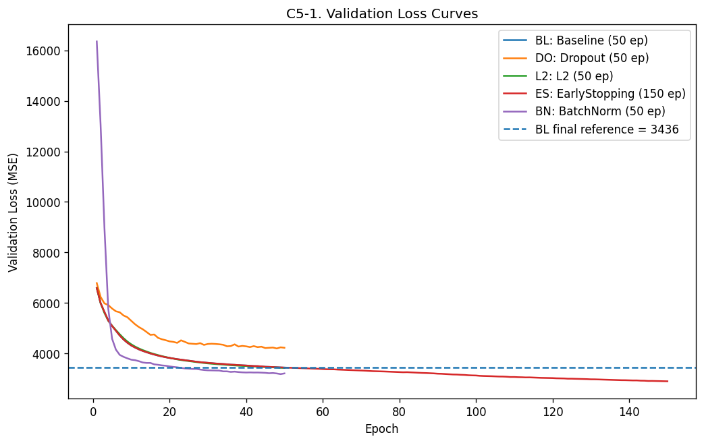
#### Output 4 - stream

Stream: `stdout`

````text
===시각화 1. 해석:===
==Validation loss curve는 각 정규화 전략이 epoch가 진행되면서 일반화 오차를 어떻게 낮추는지 보여준다.==
------------------
=Baseline은 50 epoch까지 계속 개선되었으나, EarlyStopping 모델은 150 epoch까지 학습하면서 더 낮은 validation loss에 도달했다.
이는 B2에서 관찰한 “best epoch가 50으로 끝났다”는 신호와 연결된다. 즉, Baseline은 강한 과적합은 아니었고 더 학습할 여지가 있었다.=
BatchNorm은 초반에는 불안정하게 출발하지만 후반 validation loss가 Baseline보다 낮아져 hidden activation 안정화 효과가 있었던 후보로 해석된다.
------------------
==결론: validation curve 기준으로는 EarlyStopping이 가장 낮은 일반화 오차를 보인 최종 후보이다.==
````
#### Output 5 - display_data

`text/plain`

````text
<Figure size 1800x480 with 3 Axes>
````
`image/png`

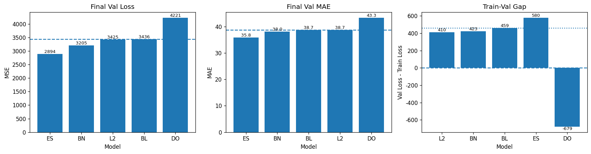
#### Output 6 - stream

Stream: `stdout`

````text
===시각화 2. 해석:===
Final metric dashboard는 validation loss, validation MAE, train-validation gap을 분리해서 보여준다.
Val Loss는 MSE 기준이므로 큰 오차, 특히 고농도 PM2.5 예측 실패에 더 민감하다.
Val MAE는 실제 PM2.5 단위에서 평균적으로 얼마나 틀리는지를 보여주므로 해석이 직관적이다.
Gap은 train과 validation 사이의 차이를 보여주며, 너무 크면 train에 더 잘 맞는 모델일 수 있다.
------------------
===> EarlyStopping은 Val Loss 2893.95, Val MAE 35.83로 두 기준 모두 1위다.
Baseline 대비 validation loss는 15.77% 개선되었다.===
------------------
BatchNorm은 Val Loss와 Val MAE가 모두 Baseline보다 개선되어 2순위 후보로 볼 수 있다.
 Dropout은 Val Loss와 Val MAE가 모두 악화되었으므로, 현재 모델에서는 과적합 완화가 아니라 underfitting에 가까운 결과로 해석된다.
 L2는 gap은 가장 안정적이지만 Val Loss 개선폭이 0.30%로 매우 작아 최종 후보로 보기는 어렵다.
= 다만 EarlyStopping의 gap은 579.59로 Baseline보다 크기 때문에, D파트에서 test set과 residual 분석으로 실제 일반화 성능을 반드시 확인해야 한다. =
````
#### Output 7 - display_data

`text/plain`

````text
<Figure size 960x720 with 1 Axes>
````
`image/png`

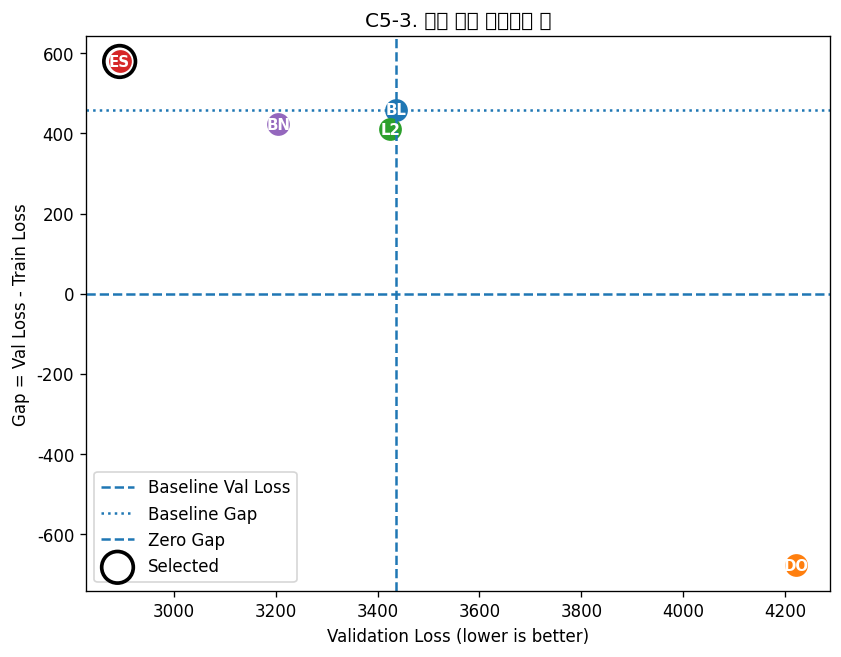
#### Output 8 - stream

Stream: `stdout`

````text
===시각화 결론 해석:===
[validation loss와 train-validation gap을 동시에 보는 시각화 맵]
왼쪽에 있을수록 validation loss가 낮아 성능이 좋고, y=0에 가까울수록 train과 validation 손실 차이가 작다.
Baseline 기준선보다 왼쪽에 있는 모델은 validation loss 기준으로 Baseline보다 개선된 모델이다.
EarlyStopping은 가장 왼쪽에 위치하므로 validation loss 기준 최종 후보로 선택된다
=그러나 EarlyStopping은 gap이 Baseline보다 크므로, “성능은 가장 좋지만 gap 보완이 필요한 모델”로 해석해야 한다.=
------------------
BatchNorm은 EarlyStopping보다 validation loss는 높지만 gap이 더 작고 Baseline보다 개선되어 안정적인 2순위 후보로 볼 수 있다.
L2는 gap은 가장 안정적이지만 validation loss 개선이 거의 없으므로 보수적이지만 성능 개선은 약하다.
Dropout은 오른쪽에 위치하고 gap도 음수로 크게 나타나므로 현재 설정에서는 최종 후보에서 제외한다.

최종 판정:
- Validation 기준 1순위 후보: EarlyStopping
- Val Loss: 2893.9463
- Val MAE : 35.8254
- Gap     : 579.5891
- Baseline 대비 Val Loss 개선율: 15.77%
----따라서 Part D에서는 *EarlyStopping* 모델을 최종 모델로 선택하고, test set에서 최종 일반화 성능을 평가한다.----
````

---

## Cell 49 - markdown

**결론**
    - C5의 결론은 “EarlyStopping이 validation 기준 최종 후보”라는 것이다.
    - 하지만 EarlyStopping은 gap이 가장 작지는 않으므로, D에서는 test 성능과 residual을 통해 실제 일반화 여부를 확인해야 한다.
    - 즉 D의 목적은 C에서 고른 모델이 validation뿐만 아니라 unseen test에서도 안정적인지 검증하는 것이다.
    - 이후, 초기 EDA에서 지적한 검정이

---
