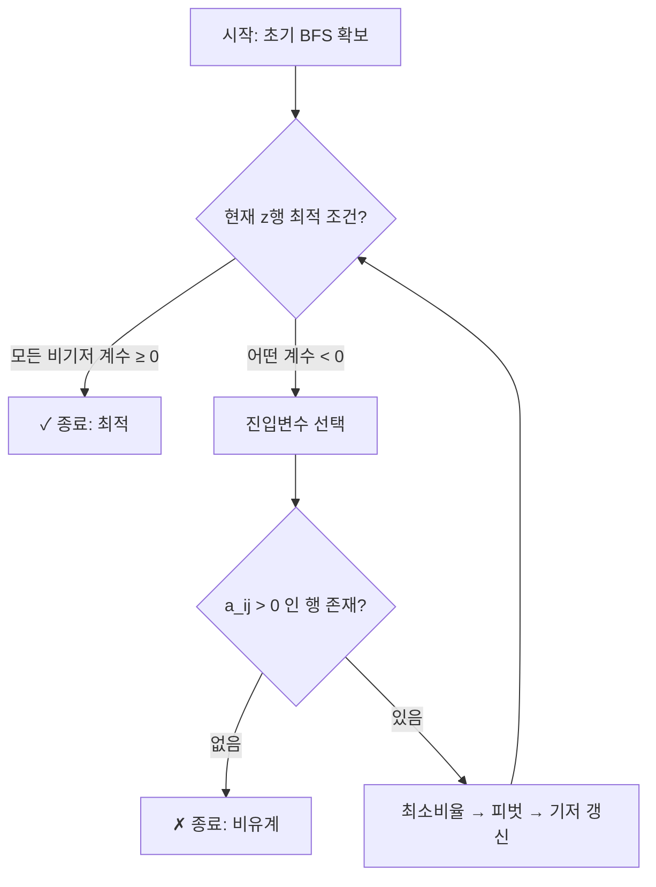

# 의사결정 6강 · 심플렉스 심화 (2026-04-13)

> `[경영과학 / Operations Research]` Hyesung Seok, Hongik University  
> 본 문서는 슬라이드 1~19 로데이터를 기반으로 **개념 그래프 구조**로 재배열한 1:1 심화 튜터 노트다.  
> **완성 해설 모드** — 타블로 전체 수치 포함.

---

## 강의 핵심 한 줄

> "오늘의 본질은 심플렉스가 하나의 **데이터 구조(타블로)** 에서 돌아가는 알고리즘임을 이해하고,  
> 그 알고리즘이 **세 가지 종료 상태(최적·비유계·복수 최적)** 와 **BFS가 안 보일 때의 2단계 해법** 까지 어떻게 대응하는지 꿰뚫는 것이다."

---

## 그래프 DB 현재 위치

```
[강의 흐름 노드]
1강: OR/MS 기초 → 2강: LP 일반형·그래프 해법 → 3강: Wyndor·Solver
→ 4강: 자원배분 응용 → 5강(04/06): 심플렉스 표준형·정규형·BFS·타블로·반복
→ 【6강(04/13): 타블로 심화·특수 경우·2단계법·식단 min·Phase I/II 완전 전개】
→ 7강: 쌍대문제·쌍대성·상보여유·민감도 심화 → 8주차: 중간고사

[오늘 핵심 노드]
- 타블로 엔진 (피벗·비율·기저 갱신)
- 최적 / 비유계(unbounded) / 복수 최적 — 3종료 판별
- slack / surplus / 인위(artificial) — 변수 목적과 도입 순서
- Phase I (w행·실행가능성 판별)
- Phase II (z행·원 목적 최적화)
- min LP의 심플렉스 규약 (진입·최적 부호)
- 예1·예2·예3·예4·식단 — 구체 수치 연결
```

---

## 목차

1. [5강과의 연결 — 오늘을 시작하기 전에](#1-5강과의-연결--오늘을-시작하기-전에)
2. [타블로를 "데이터 구조"로 보는 눈](#2-타블로를-데이터-구조로-보는-눈)
3. [3종료 판별 — 최적·비유계·복수 최적](#3-3종료-판별--최적비유계복수-최적)
4. [예1 — max 타블로 완전 전개 (슬라이드 1)](#4-예1--max-타블로-완전-전개-슬라이드-1)
5. [예2 — 복수 최적해 (슬라이드 2)](#5-예2--복수-최적해-슬라이드-2)
6. [예3 — 비유계 + 심플렉스 플로우차트 (슬라이드 3~4)](#6-예3--비유계--심플렉스-플로우차트-슬라이드-34)
7. [변수 변환 완전 정리 — slack·surplus·인위](#7-변수-변환-완전-정리--slacksurplus인위)
8. [2단계법 심층 이해 — Phase I·II](#8-2단계법-심층-이해--phase-iii)
9. [예4 — Phase I·II 완전 전개 (슬라이드 7~13)](#9-예4--phase-iii-완전-전개-슬라이드-713)
10. [식단문제 min — Phase I·II 완전 전개 (슬라이드 14~19)](#10-식단문제-min--phase-iii-완전-전개-슬라이드-1419)
11. [min LP 심플렉스 규약 — 부호 완전 정리](#11-min-lp-심플렉스-규약--부호-완전-정리)
12. [오늘의 핵심 정리 + 확인 질문](#12-오늘의-핵심-정리--확인-질문)
13. [부록: 슬라이드 1~19 타블로 전사](#13-부록-슬라이드-119-타블로-전사)

---

## 1. 5강과의 연결 — 오늘을 시작하기 전에

### 1.1 지금 우리는 그래프의 어디를 보고 있는가

| 5강(04/06)에서 쌓은 것 | 6강(04/13)에서 확장하는 것 |
|------------------------|---------------------------|
| LP 표준형·정규형 만들기 | 정규형을 **타블로 데이터 구조**로 정착 |
| BFS(기저가능해) 개념 | BFS를 **실제로 추적**하는 피벗 |
| 심플렉스 반복 1~3회 | **3종 종료 상태** 판별 완전 이해 |
| 여유변수(slack) 도입 | **surplus·인위**까지 확장 |
| 기본 심플렉스 절차 | **2단계법**: BFS가 없을 때 |

**연결 한 줄:** 5강에서 "심플렉스가 왜 작동하는가"를 배웠다면, 오늘은 "심플렉스가 어떤 상황에서도 대응하도록 완성하는 법"을 배운다.

### 1.2 핵심 선행 지식 체크

아래 3개를 즉시 말할 수 없으면 먼저 복습하라.

1. **정규형(canonical form):** 목적행 포함 모든 행에서 기저변수가 해당 행에서만 +1, 나머지에서 0인 구조.
2. **피벗(pivot):** 진입변수(entering)·탈락변수(leaving) 결정 → 가우스-조던 소거 → 기저 갱신.
3. **최소비율 검사:** 진입열 \(j\)에 대해 \(a_{ij}>0\)인 행만 후보로 \(\theta = \mathrm{RHS}_i / a_{ij}\) 계산 → 최소 \(\theta\)가 탈락행.

---

## 2. 타블로를 "데이터 구조"로 보는 눈

### 2.1 한 줄 정의

> **타블로(Tableau):** LP의 등식 제약 시스템을 **행렬 형태**로 표현한 것. 각 피벗은 가우스-조던 소거 한 단계에 해당하며, 항상 **정규형** 불변식을 유지한다.

### 2.2 타블로의 열 구조

| 열 그룹 | 의미 | 피벗에서 역할 |
|---------|------|--------------|
| **결정변수 열** \(x_1,\ldots,x_n\) | 해당 변수의 제약·목적 계수 | 진입열 후보 |
| **여유·잉여·인위 열** | 보조변수의 계수 | 탈락 후 흔적 남김 (추후 쌍대 읽기에 활용) |
| **RHS 열** | 현재 기저변수 값 | 최소비율 분모 |
| **목적행** \(z\) | 현재 목적함수 값 + 비기저 계수 | 진입·최적 판별 |

### 2.3 한 번의 피벗이 데이터에 하는 일

```
[피벗 흐름]
1. z행 스캔 → 진입 후보(음수 계수, max 기준) 선택 → 진입열 j 확정
2. 진입열에서 a_ij > 0인 행만 후보 → θ_i = RHS_i / a_ij 계산
3. min{θ_i} → 탈락행 r 확정, 피벗 원소 p = a_rj
4. 행 연산:
   - 탈락행 r ÷ p  (r행을 p로 나눔)
   - 모든 i ≠ r: 행 i ← 행 i − a_ij × (새 행 r)
5. 기저 열 갱신: 행 r의 기저변수 → x_j 로 교체
6. [불변식] 기저 열은 여전히 단위벡터 → 정규형 유지
```

**직관:** 피벗은 "이 방향으로 얼마나 가면 다음 꼭짓점에 닿는가"를 계산하고 이동하는 것이다.

### 2.4 타블로·그래프·Solver의 삼각 대응

| 관점 | 의미 |
|------|------|
| **그래프 해법** (2강) | 가능영역 꼭짓점을 눈으로 탐색 |
| **타블로** (6강) | 꼭짓점 = BFS를 행렬 형태로 표현·이동 |
| **Solver** (3강) | 내부적으로 타블로와 동일한 심플렉스 실행 |

---

## 3. 3종료 판별 — 최적·비유계·복수 최적

### 3.1 왜 "3종료"인가

심플렉스는 언제 멈추는가? 다음 세 상황 중 하나다.

| 종료 상태 | z행(비기저 계수) 조건(max 기준) | 추가 조건 | 의미 |
|----------|-------------------------------|----------|------|
| **최적** | 모든 비기저 계수 **≥ 0** | — | 더 이상 z를 키울 방법 없음 |
| **비유계(unbounded)** | 어떤 계수 **< 0** (개선 가능) | 그 열의 **모든 a_ij ≤ 0** | θ 계산 불가 → z→∞ |
| **복수 최적** | 최적 상태 + 어떤 비기저 계수 **= 0** | — | 다른 BFS도 같은 z 달성 |

### 3.2 각 종료 상태의 직관

**최적(Optimal):**
> "모든 방향으로 한 걸음 옮기면 z가 줄어든다(또는 유지된다). 지금이 가장 높은 꼭짓점이다."

**비유계(Unbounded):**
> "올라갈 방향은 있는데 그쪽으로 아무리 가도 제약에 안 막힌다. 가능영역이 그 방향으로 열려 있다."

**복수 최적(Multiple Optima):**
> "최적인데 한 방향으로 움직여도 z가 안 바뀐다. 능선이 등고선과 평행한 경우다."

### 3.3 판별 순서 (매 반복마다)

```
Step 1: z행 스캔
   → 모든 비기저 계수 ≥ 0?
      YES → 최적. 종료.
      NO  → 진입 후보 j 존재.
         Step 2: 비율 검사
            → a_ij > 0인 행이 하나라도 있나?
               YES → 피벗. 반복.
               NO  → 비유계. 종료.
(최적 단계에서 계수 = 0 비기저 존재 → 복수 최적 표시)
```

### 3.4 자주 하는 실수

1. **비유계와 infeasible 혼동:** 비유계는 "가능해는 있는데 목적이 무한히 커짐". infeasible은 "가능해 자체가 없음". 두 개는 다르다.
2. **복수 최적 미인지:** "비기저 계수가 0인데 최적 조건 만족 → 그냥 최적"으로만 읽고 복수 최적 가능성을 표시 안 함. 시험에서 "최적해가 유일한가?" 물으면 이 체크가 필요하다.
3. **min 문제에서 부호 혼동:** 아래 §11에서 상세히 다룬다.

---

## 4. 예1 — max 타블로 완전 전개 (슬라이드 1)

### 4.1 문제와 표준형

\[
\max z = 3x_1 + 2x_2
\]
\[
2x_1 + x_2 \le 100,\quad x_1 + x_2 \le 80,\quad x_1 \le 40,\quad x_1, x_2 \ge 0
\]

**왜 이 문제로 시작하는가:** 3개 제약, 2개 결정변수로 타블로 전개가 직관적으로 보이면서도 반복이 3번 발생해 피벗 절차를 충분히 연습할 수 있다.

**여유변수 도입 → 정규형:**

\[
z - 3x_1 - 2x_2 = 0
\]
\[
2x_1 + x_2 + x_3 = 100
\]
\[
x_1 + x_2 + x_4 = 80
\]
\[
x_1 + x_5 = 40
\]

**초기 기저:** \(\{x_3, x_4, x_5\}\), 각각 \(100, 80, 40\). BFS 확보.

### 4.2 타블로 3회 반복 완전 전개

#### 반복 0 (초기)

| 기저 | \(z\) | \(x_1\) | \(x_2\) | \(x_3\) | \(x_4\) | \(x_5\) | RHS | 비율(진입 \(x_1\)) |
|:---:|:---:|:---:|:---:|:---:|:---:|:---:|:---:|:---:|
| \(z\) | 1 | **−3** | −2 | 0 | 0 | 0 | 0 | |
| \(x_3\) | 0 | 2 | 1 | 1 | 0 | 0 | 100 | 100/2=50 |
| \(x_4\) | 0 | 1 | 1 | 0 | 1 | 0 | 80 | 80/1=80 |
| \(x_5\) | 0 | **1** | 0 | 0 | 0 | 1 | 40 | **40/1=40 ← min** |

**진입:** \(x_1\) (z행 −3, 가장 음수). **탈락:** \(x_5\) (비율 최소 40). **피벗 원소:** 1.

#### 반복 1

\(x_5\)행 ÷ 1 → 그대로. 나머지 행에서 \(x_1\) 열 소거.

| 기저 | \(z\) | \(x_1\) | \(x_2\) | \(x_3\) | \(x_4\) | \(x_5\) | RHS | 비율(진입 \(x_2\)) |
|:---:|:---:|:---:|:---:|:---:|:---:|:---:|:---:|:---:|
| \(z\) | 1 | 0 | **−2** | 0 | 0 | 3 | 120 | |
| \(x_3\) | 0 | 0 | **1** | 1 | 0 | −2 | 20 | **20/1=20 ← min** |
| \(x_4\) | 0 | 0 | 1 | 0 | 1 | −1 | 40 | 40/1=40 |
| \(x_1\) | 0 | 1 | 0 | 0 | 0 | 1 | 40 | (x_2열 계수 0, 제외) |

**진입:** \(x_2\) (z행 −2). **탈락:** \(x_3\) (비율 20). **피벗 원소:** 1.

> **왜 \(x_1\)행은 비율 계산에서 제외하는가?**  
> \(x_1\)행의 \(x_2\) 계수가 0이므로 \(\theta = 20/0\) → **정의 불가**. 0 또는 음수인 계수는 반드시 제외해야 한다.

#### 반복 2

\(x_3\)행 ÷ 1 → 그대로. 나머지 행에서 \(x_2\) 열 소거.

| 기저 | \(z\) | \(x_1\) | \(x_2\) | \(x_3\) | \(x_4\) | \(x_5\) | RHS | 비율(진입 \(x_5\)) |
|:---:|:---:|:---:|:---:|:---:|:---:|:---:|:---:|:---:|
| \(z\) | 1 | 0 | 0 | 2 | 0 | **−1** | 160 | |
| \(x_2\) | 0 | 0 | 1 | 1 | 0 | −2 | 20 | (x_5열 계수 음수, 제외) |
| \(x_4\) | 0 | 0 | 0 | −1 | 1 | **1** | 20 | **20/1=20 ← min** |
| \(x_1\) | 0 | 1 | 0 | −1 | 0 | 1 | 40 | 40/1=40 |

**진입:** \(x_5\) (z행 −1). **탈락:** \(x_4\) (비율 20). **피벗 원소:** 1.

#### 최종 타블로 (최적)

| 기저 | \(z\) | \(x_1\) | \(x_2\) | \(x_3\) | \(x_4\) | \(x_5\) | RHS |
|:---:|:---:|:---:|:---:|:---:|:---:|:---:|:---:|
| \(z\) | 1 | 0 | 0 | **1** | **1** | 0 | **180** |
| \(x_2\) | 0 | 0 | 1 | −1 | 2 | 0 | 60 |
| \(x_5\) | 0 | 0 | 0 | −1 | 1 | 1 | 20 |
| \(x_1\) | 0 | 1 | 0 | 0 | −1 | 0 | 20 |

**최적 확인:** 모든 비기저 계수 \((x_3: 1,\; x_4: 1)\ge 0\). ✓

**최적해:** \(x_1^*=20,\; x_2^*=60,\; x_5^*=20\) (슬랙), \(x_3^*=x_4^*=0\), \(z^*=180\).

**검증:**
- 제약 1: \(2(20)+60=100 \le 100\) ✓ (binding)
- 제약 2: \(20+60=80 \le 80\) ✓ (binding)
- 제약 3: \(20 \le 40\) ✓ (여유 20 = \(x_5^*\))

### 4.3 이 예제에서 배워야 할 3가지

1. **비율 제외 조건:** 계수 0 또는 음수 → 비율 계산 안 함.
2. **목적행 계수의 의미:** 반복 k에서 \(z\)행 비기저 계수 = "그 변수를 1 늘리면 z가 변하는 양 (음수면 이득)".
3. **최종 타블로의 z행 계수:** 최적 타블로 비기저(\(x_3, x_4\))의 계수 1, 1 → **7강의 한계비용·잠재가격과 동일 위치**.

---

## 5. 예2 — 복수 최적해 (슬라이드 2)

### 5.1 문제

\[
\max z = 60x_1 + 35x_2 + 20x_3
\]
\[
8x_1+6x_2+x_3 \le 48,\quad 4x_1+3x_2+\tfrac{3}{2}x_3 \le 20,\quad 2x_1+\tfrac{3}{2}x_2+\tfrac{1}{2}x_3 \le 8,\quad x_2 \le 5
\]

슬랙 \(x_4, x_5, x_6, x_7\) 도입.

### 5.2 핵심: 비기저 계수 = 0의 의미

**한 줄 정의:**
> 최적 타블로에서 어떤 **비기저** 변수 \(x_k\)의 z행 계수가 **정확히 0** → **복수 최적해**.

**직관:** 목적함수의 등위선이 가능영역의 한 **모서리(edge)** 와 겹쳐, 그 모서리 위의 모든 점이 동일한 최적값을 가진다.

| 상황 | z행 비기저 계수 | 의미 |
|------|----------------|------|
| 유일 최적 | 모두 **> 0** | 하나의 BFS만 최적 |
| **복수 최적** | 모두 ≥ 0, 단 어떤 것은 **= 0** | 인접 꼭짓점도 최적 |
| 비유계 | 어떤 것이 **< 0** + 비율 실패 | 무한 개선 가능 |

### 5.3 반복 요약

**반복 1:** \(x_1\) 진입(z행 −60), \(x_6\) 탈락, 피벗 2. → z=120  
**반복 2:** \(x_3\) 진입(z행 −5), \(x_5\) 탈락, 피벗 1/2. → z=280

**최적 BFS 1:** \(x_1=2,\; x_2=0,\; x_3=8\), 나머지 슬랙 조정, \(z=280\).

**복수 최적 확인:** 최적 타블로에서 **\(x_2\)의 z행 계수 = 0** (비기저).

**추가 피벗(대안 BFS 도출):**

\(x_2\) 진입. 비율 = \(\min(8/3/(3/4),\; 5/1, \ldots) = 8/3\) → \(x_1\) 탈락.

**대안 BFS:** \(x_1=0,\; x_2=8/3,\; x_3=8,\; z=280\) ← **동일 z**.

**구조:** 두 BFS의 **볼록 결합(convex combination)** 도 최적.
\[
x(\lambda) = \lambda \cdot (2,0,8,\ldots) + (1-\lambda) \cdot (0, 8/3, 8, \ldots),\quad \lambda \in [0,1]
\]

### 5.4 시험 포인트

> "복수 최적해가 존재하면 이를 나타내는 방법을 서술하라" → **비기저 감소비용 0인 변수 존재**를 언급하고, 해당 변수를 진입시켜 대안 BFS를 하나 구하면 된다.

---

## 6. 예3 — 비유계 + 심플렉스 플로우차트 (슬라이드 3~4)

### 6.1 비유계 판정 — 한 줄 정의

> **비유계(Unbounded):** 개선 가능한 진입열 \(j\)가 존재하는데, 그 열의 **모든 제약행 계수가 ≤ 0** 이어서 최소비율 계산이 불가한 상태.

### 6.2 수학적 구조

기저변수 \(i\)의 값 변화:

\[
x_{\text{기저},i} = \mathrm{RHS}_i - a_{ij} \cdot \theta
\]

\(a_{ij} \le 0\) 이면 \(\theta \uparrow\) 해도 \(x_{\text{기저},i}\) 가 음수로 떨어지지 않는다.  
→ \(\theta \to \infty\) 허용 → \(z \to +\infty\) (max).

**직관:** 가능영역이 목적함수를 증가시키는 방향으로 **열려 있다**. 제약이 그쪽을 막지 못한다.

### 6.3 비유계 슬라이드 수치 확인

최종 관찰 타블로에서 \(x_3\) 열:
- z행: 계수 \(-9 < 0\) → 진입 후보.
- 모든 제약행 \(x_3\) 열 계수: \(-6,\; -1 \le 0\) → **비율 계산 불가**.

**광선(ray) 표현:**

\[
x(\lambda) = (5,0,0,20,0,0) + \lambda(1,0,1,6,0,0),\quad \lambda \ge 0
\]
\[
z(\lambda) = 100 + 9\lambda \to \infty
\]

→ 방향 \((1,0,1,6,0,0)\)은 실행가능 방향이며 목적을 선형 증가시킨다.

### 6.4 심플렉스 플로우차트



**플로우차트 읽는 법:** 매 반복마다 "최적?" 체크 → "비율 실패?" 체크 → 아니면 피벗 반복. 이 사이클이 심플렉스의 전부다.

---

## 7. 변수 변환 완전 정리 — slack·surplus·인위

### 7.1 왜 3종류가 필요한가

심플렉스는 **정규형 = 각 행에 단위벡터(기저) 하나**를 필요로 한다. 부등호 방향과 등식 유형에 따라 이 단위벡터를 "어디서 가져오는가"가 달라진다.

### 7.2 세 변수 목적·구조 완전표

| 구분 | 부등호 | 도입 | 기호 | 의미 | 초기 기저? | 주의 |
|------|--------|------|------|------|-----------|------|
| **여유(slack)** | \(\le b\) | **더하기** | \(s \ge 0\) | "남은 양" | ✓ 기저 후보 (+1 바로 사용) | 없음 |
| **잉여(surplus)** | \(\ge b\) | **빼기** | \(e \ge 0\) | "초과량" | ✗ (계수 −1로 음수) | 인위 추가 필요 |
| **인위(artificial)** | \(\ge\) 행, \(=\) 행 | **더하기** | \(r \ge 0\) | "가짜 기저" | ✓ 기저 후보 (억지) | 원문제와 **동치 조건**: \(r=0\) |

### 7.3 도입 순서 결정 로직

```
각 제약식에 대해:

1. ≤ b 제약
   → slack + 1 개 추가. 그 행의 기저 = slack. 끝.

2. ≥ b 제약
   → surplus − 1 개 추가.
   → 초기 BFS에서 surplus = (0 − b) < 0 → 비음 위반.
   → 인위 + 1 개 추가 → 그 행의 기저 = 인위.

3. = b 제약 (등식)
   → 도입할 slack/surplus 없음.
   → 인위 + 1 개 추가 → 그 행의 기저 = 인위.
```

### 7.4 인위변수와 원문제의 동치 조건

> **핵심:** 인위가 들어간 보조문제(Phase I 풀이)는 **인위가 모두 0**일 때만 원문제와 동치다.

따라서:
- Phase I 목표: \(\min w = \sum r_k\) → \(w^*=0\) 이면 모든 \(r_k=0\) → **원 문제의 실행가능해 존재**.
- \(w^* > 0\) 이면 인위를 0으로 못 만듦 → **원 문제는 infeasible**.

### 7.5 자주 하는 실수

1. **≥ 제약에 slack 더하기:** surplus는 **빼야** 한다(초과분을 제거해 등식 만들기). 더하면 부등호 방향이 반대가 된다.
2. **인위를 목적에 빠뜨리기:** Big-M이든 Phase I이든 인위에 페널티/목적이 들어가야 심플렉스가 인위를 0으로 몰아낸다.
3. **잉여변수와 인위변수 혼동:** surplus는 **원문제에 실제 존재**하는 변수(제약의 초과분). 인위는 **알고리즘 도구**로 최적해에서 반드시 0이어야 한다.

---

## 8. 2단계법 심층 이해 — Phase I·II

### 8.1 왜 "2단계"인가

| 질문 | 답 |
|------|-----|
| 원 목적 \(z\)로 바로 쓰면 안 되나? | 인위에 Big-M 페널티를 붙이는 Big-M method도 가능하나, 수치·해석이 복잡해지기 쉽다. 2단계는 **실행가능성(feasibility)**과 **최적화(optimality)**를 **문제 수준에서 분리**해 깔끔하다. |
| 1단계(Phase I)가 하는 일 | **보조 LP:** \(\min w = \sum r_k\) 로 인위를 0으로 만들어 **원 문제의 BFS 하나**를 확보. |
| 2단계(Phase II)가 하는 일 | 그 BFS에서 출발해 **원 목적 \(z\)** 로 심플렉스 → 최적화. |

### 8.2 Phase I vs Phase II — 완전 비교표

| 항목 | **Phase I (1국면)** | **Phase II (2국면)** |
|------|---------------------|----------------------|
| 풀고 싶은 질문 | "원문제에 실행가능해가 있나?" | "그 BFS에서 z 최적은?" |
| 목적함수 | \(\min w = \sum r_k\) | 원래 \(\max z\) 또는 \(\min z\) |
| 타블로 목적행 | \(w\) 행 | \(z\) 행 |
| 최적 종료 의미 | \(w^*=0\) → 실행가능 / \(w^*>0\) → infeasible | 비기저 부호 조건으로 z 최적 |
| 진입 규칙 (최소화) | \(w\)행 **양의** 비기저 계수 → 진입 | max면 **음의** 계수, min이면 §11 |
| 끝난 뒤 | 인위 열·w행 **삭제** | — |
| 공통 알고리즘 | **최소비율 → 피벗 → 정규형 유지** | 동일 |

**한 문장:** 같은 엔진(심플렉스), 다른 연료(목적행) — Phase I은 **가능성**, Phase II는 **이득**.

### 8.3 w행 기저 소거 — 왜 해야 하는가

초기 \(w\) 행: \(w - r_1 - r_2 - \cdots = 0\).

기저변수가 \(r_1, r_2\) 인데 이들이 \(w\)행에 계수 −1로 남아 있음 → **정규형 아님** (목적행에서 기저 계수가 0이어야 하는데 0이 아님).

**소거:** \(w\text{행} \leftarrow w\text{행} + (r_1\text{ 행}) + (r_2\text{ 행}) + \ldots\)

→ 기저변수 \(r_k\) 계수가 목적행에서 0이 됨 → **정규형 완성** → 심플렉스 적용 가능.

### 8.4 z행 기저 소거 — Phase II에서도 동일 이유

Phase I이 끝나면 인위·w행을 삭제하고, **원 목적 \(z\)**를 붙인다.

이때 \(z - \sum c_j x_j = 0\) 를 쓰는데, 현재 기저변수 \(x_k\)들이 \(z\)행에 원가 \(c_k\)로 남아 있음 → **정규형 아님**.

**소거:** \(z\text{행} \leftarrow z\text{행} + c_k \times (x_k\text{ 행})\) (기저변수 각각에 대해)

→ 기저 계수 0 → 정규형 → 심플렉스 재시작.

---

## 9. 예4 — Phase I·II 완전 전개 (슬라이드 7~13)

### 9.1 원문제

\[
\max z = 2x_1 + 3x_2
\]
\[
\tfrac{1}{2}x_1 + \tfrac{1}{4}x_2 \le 4 \quad \cdots (1)
\]
\[
x_1 + 3x_2 \ge 20 \quad \cdots (2)
\]
\[
x_1 + x_2 = 10 \quad \cdots (3)
\]

### 9.2 변수 도입 분석

| 제약 | 형태 | 도입 | 기저? |
|------|------|------|-------|
| (1) ≤ | slack \(x_3\) | \(+x_3\) | \(x_3\) 기저 ✓ |
| (2) ≥ | surplus \(x_4\) + 인위 \(x_5\) | \(-x_4 + x_5\) | \(x_5\) 기저 ✓ |
| (3) = | 인위 \(x_6\) | \(+x_6\) | \(x_6\) 기저 ✓ |

**표준형:**

\[
\tfrac{1}{2}x_1 + \tfrac{1}{4}x_2 + x_3 = 4
\]
\[
x_1 + 3x_2 - x_4 + x_5 = 20
\]
\[
x_1 + x_2 + x_6 = 10
\]

**Phase I 목적:** \(\min w = x_5 + x_6\)

### 9.3 Phase I 전개

**w행 초기:** \(w - x_5 - x_6 = 0\). 기저 \(x_5, x_6\) → **정규형 아님**.

**w행 소거:** \(w\text{행} \leftarrow w\text{행} + (x_5\text{ 행}) + (x_6\text{ 행})\)

| 기저 | \(w\) | \(x_1\) | \(x_2\) | \(x_3\) | \(x_4\) | \(x_5\) | \(x_6\) | RHS |
|:---:|:---:|:---:|:---:|:---:|:---:|:---:|:---:|:---:|
| \(w\) | 1 | 2 | **4** | 0 | −1 | 0 | 0 | 30 |
| \(x_3\) | 0 | 1/2 | 1/4 | 1 | 0 | 0 | 0 | 4 |
| \(x_5\) | 0 | 1 | **3** | 0 | −1 | 1 | 0 | 20 |
| \(x_6\) | 0 | 1 | 1 | 0 | 0 | 0 | 1 | 10 |

**Phase I(min) 진입 규칙:** w행에서 **양의** 비기저 계수 → \(x_2\) 진입 (계수 4).

**비율:** \(\min(4/(1/4),\; 20/3,\; 10/1) = \min(16,\; 6.67,\; 10) = 6.67\) → **\(x_5\) 탈락**, 피벗 3.

**반복 1 후 (슬라이드 10):**

| 기저 | \(w\) | \(x_1\) | \(x_2\) | \(x_3\) | \(x_4\) | \(x_5\) | \(x_6\) | RHS | 비율(\(x_4\)) |
|:---:|:---:|:---:|:---:|:---:|:---:|:---:|:---:|:---:|:---:|
| \(w\) | 1 | 2/3 | 0 | 0 | 1/3 | −4/3 | 0 | 110/3 | |
| \(x_3\) | 0 | 5/12 | 0 | 1 | 1/12 | −1/12 | 0 | 31/12 | |
| \(x_2\) | 0 | 1/3 | 1 | 0 | **−1/3** | 1/3 | 0 | 20/3 | (음수, 제외) |
| \(x_6\) | 0 | 2/3 | 0 | 0 | **1/3** | −1/3 | 1 | 10/3 | (10/3)/(1/3)=10 |

> 이 반복에서 w행 RHS = 110/3 > 0, 아직 Phase I 미완.  
> \(x_1\) 도 양의 계수 → 진입 후보. (슬라이드는 \(x_4\) 계열 등 한 스텝 더 진행)

**Phase I 최종 (슬라이드 11):** \(w^*=0\), \(x_5=x_6=0\) (비기저) → **실행가능해 확보**.

**Phase I 최종 제약 등식 (인위 열 제거 후):**

\[
x_3 - \tfrac{1}{8}x_4 = \tfrac{1}{4}
\]
\[
x_2 - \tfrac{1}{2}x_4 = 5
\]
\[
x_1 + \tfrac{1}{2}x_4 = 5
\]

기저: \(\{x_3, x_2, x_1\}\), RHS: \((1/4, 5, 5)\).

### 9.4 Phase II 전개 (슬라이드 12~13)

**z행 초기:** \(z - 2x_1 - 3x_2 = 0\). 기저 \(x_1, x_2\) 가 z행에 계수 −2, −3 → **정규형 아님**.

**z행 소거:**

\[
z\text{행} \leftarrow z\text{행} + 2 \times (x_1\text{ 행}) + 3 \times (x_2\text{ 행})
\]

결과 z행: \([1,\; 0,\; 0,\; 0,\; -1/2,\; \ldots \;|\; 25]\).

**Phase II 타블로 (슬라이드 13):**

| 기저 | \(z\) | \(x_1\) | \(x_2\) | \(x_3\) | \(x_4\) | RHS | 비율 |
|:---:|:---:|:---:|:---:|:---:|:---:|:---:|:---:|
| \(z\) | 1 | 0 | 0 | 0 | **−1/2** | 25 | |
| \(x_3\) | 0 | 0 | 0 | 1 | −1/8 | 1/4 | (음수, 제외) |
| \(x_2\) | 0 | 0 | 1 | 0 | −1/2 | 5 | (음수, 제외) |
| \(x_1\) | 0 | 1 | 0 | 0 | **1/2** | 5 | **5/(1/2)=10 ← min** |

**진입:** \(x_4\) (z행 −1/2). **탈락:** \(x_1\) (비율 10). **피벗 원소:** 1/2.

**최적 타블로:**

| 기저 | \(z\) | \(x_1\) | \(x_2\) | \(x_3\) | \(x_4\) | RHS |
|:---:|:---:|:---:|:---:|:---:|:---:|:---:|
| \(z\) | 1 | 1 | 0 | 0 | 0 | **30** |
| \(x_3\) | 0 | 1/4 | 0 | 1 | 0 | 3/2 |
| \(x_2\) | 0 | 1 | 1 | 0 | 0 | 10 |
| \(x_4\) | 0 | 2 | 0 | 0 | 1 | 10 |

**최적해:** \(x_1^*=0,\; x_2^*=10,\; x_3^*=3/2,\; x_4^*=10,\; z^*=30\).

**검증:**
- (1): \(\frac{1}{2}(0)+\frac{1}{4}(10)=2.5 \le 4\) ✓ (여유 \(x_3=1.5\))
- (2): \(0+3(10)=30 \ge 20\) ✓ (초과 \(x_4=10\))
- (3): \(0+10=10=10\) ✓ (등식)

---

## 10. 식단문제 min — Phase I·II 완전 전개 (슬라이드 14~19)

### 10.1 원문제 (P0)

\[
\min z = 35x_1 + 30x_2 + 60x_3 + 50x_4 + 27x_5 + 22x_6
\]
\[
x_1 + 2x_3 + 2x_4 + x_5 + 2x_6 \ge 50 \quad (비타민\ A)
\]
\[
x_2 + 3x_3 + x_4 + 3x_5 + 2x_6 \ge 60 \quad (비타민\ C)
\]

### 10.2 표준형 전개: (P0)→(P1)→(P2)→(P3)

**(P1) 잉여변수 도입:**

\[
x_1 + 2x_3 + 2x_4 + x_5 + 2x_6 - x_7 = 50
\]
\[
x_2 + 3x_3 + x_4 + 3x_5 + 2x_6 - x_8 = 60
\]

초기해: 모두 0 → \(x_7=-50,\; x_8=-60\). **비음 위반** → BFS 불가.

**(P2) 인위변수 도입:**

\[
x_1 + 2x_3 + 2x_4 + x_5 + 2x_6 - x_7 + x_9 = 50
\]
\[
x_2 + 3x_3 + x_4 + 3x_5 + 2x_6 - x_8 + x_{10} = 60
\]

초기 기저: \(\{x_9, x_{10}\}\), BFS: \(x_9=50,\; x_{10}=60\).

**(P3) Phase I 목적:**

\[
\min w = x_9 + x_{10}
\]

### 10.3 Phase I 타블로 (슬라이드 15~16)

**w행 초기:** \(w - x_9 - x_{10} = 0\). 기저 \(x_9, x_{10}\) → 정규형 아님.

**w행 소거:** \(w\text{행} \leftarrow w\text{행} + (x_9\text{ 행}) + (x_{10}\text{ 행})\)

| 기저 | \(w\) | \(x_1\) | \(x_2\) | \(x_3\) | \(x_4\) | \(x_5\) | \(x_6\) | \(x_7\) | \(x_8\) | \(x_9\) | \(x_{10}\) | RHS | 비율 |
|:---:|:---:|:---:|:---:|:---:|:---:|:---:|:---:|:---:|:---:|:---:|:---:|:---:|:---:|
| \(w\) | 1 | 1 | 1 | **5** | 3 | 4 | 4 | −1 | −1 | 0 | 0 | 110 | |
| \(x_9\) | 0 | 1 | 0 | 2 | 2 | 1 | 2 | −1 | 0 | 1 | 0 | 50 | 50/2=25 |
| \(x_{10}\) | 0 | 0 | 1 | **3** | 1 | 3 | 2 | 0 | −1 | 0 | 1 | 60 | **60/3=20 ← min** |

**반복 1:** \(x_3\) 진입 (w행 계수 5, 가장 큼). \(x_{10}\) 탈락 (비율 20). 피벗 원소 **3**.

**반복 1 후 (슬라이드 16):**

| 기저 | \(w\) | \(x_1\) | \(x_2\) | \(x_3\) | \(x_4\) | \(x_5\) | \(x_6\) | \(x_7\) | \(x_8\) | RHS | 비율 |
|:---:|:---:|:---:|:---:|:---:|:---:|:---:|:---:|:---:|:---:|:---:|:---:|
| \(w\) | 1 | 1 | −2/3 | 0 | **4/3** | −1 | 2/3 | −1 | 2/3 | 10 | |
| \(x_9\) | 0 | 1 | −2/3 | 0 | **4/3** | −1 | 2/3 | −1 | 2/3 | 10 | **(10/(4/3))=7.5 ← min** |
| \(x_3\) | 0 | 0 | 1/3 | 1 | 1/3 | 1 | 2/3 | 0 | −1/3 | 20 | 20/(1/3)=60 |

**반복 2:** \(x_4\) 진입 (w행 계수 4/3 > 0). \(x_9\) 탈락 (비율 7.5). 피벗 원소 **4/3**.

이후 반복으로 **\(w^*=0\)**, \(x_9=x_{10}=0\) → **Phase I 완료**.

### 10.4 Phase I 최종 → (P4) Phase II (슬라이드 17~18)

**Phase I 최종 기저:** \(\{x_4, x_3\}\).

Phase I 최종 제약 (인위 열 제거 후):

\[
\tfrac{3}{4}x_1 - \tfrac{1}{2}x_2 + x_4 - \tfrac{3}{4}x_5 + \tfrac{1}{2}x_6 - \tfrac{3}{4}x_7 + \tfrac{1}{2}x_8 = \tfrac{30}{4}
\]
\[
-\tfrac{1}{4}x_1 + \tfrac{1}{2}x_2 + x_3 + \tfrac{5}{4}x_5 + \tfrac{1}{2}x_6 + \tfrac{1}{4}x_7 - \tfrac{1}{2}x_8 = \tfrac{70}{4}
\]

**(P4) Phase II 목적:**

\[
\min z = 35x_1 + 30x_2 + 60x_3 + 50x_4 + 27x_5 + 22x_6
\]

**z행 초기:** 기저 \(x_4, x_3\) 계수가 z행에 남음 → 정규형 아님.

**z행 소거:**

\[
z\text{행} \leftarrow z\text{행} + 50 \times (x_4\text{ 행}) + 60 \times (x_3\text{ 행})
\]

소거 후 z행 (요지):

\[
[1,\; -50/4,\; -25,\; 0,\; 0,\; 42/4,\; 33,\; -90/4,\; -5\; |\; 570/4]
\]

**Phase II(min) 규칙:** z행에서 **양의** 비기저 계수 → 진입 (§11 상세).

**반복 1:** \(x_6\) 진입 (계수 33, 가장 큼). 비율: \((30/4)/(1/2)=15\) vs \((70/4)/(1/2)=35\) → **\(x_4\) 탈락**, 피벗 1/2.

**반복 2:** \(x_5\) 진입 (계수 60). **\(x_3\) 탈락**, 피벗 2.

### 10.5 최종 타블로 및 최적해 (슬라이드 19)

| 기저 | \(z\) | \(x_1\) | \(x_2\) | \(x_3\) | \(x_4\) | \(x_5\) | \(x_6\) | \(x_7\) | \(x_8\) | RHS |
|:---:|:---:|:---:|:---:|:---:|:---:|:---:|:---:|:---:|:---:|:---:|
| \(z\) | 1 | −32 | −22 | −30 | −36 | 0 | 0 | −3 | −8 | **630** |
| \(x_6\) | 0 | … | … | … | … | 0 | 1 | … | … | **90/4 = 22.5** |
| \(x_5\) | 0 | … | … | … | … | 1 | 0 | … | … | **5** |

**최적성 확인 (min 규칙):** 모든 비기저 계수 ≤ 0 (−32, −22, −30, −36, −3, −8). ✓

**최적해:** \(x_5^*=5,\; x_6^*=22.5\), 나머지 결정변수·잉여 0. \(z^*=630\).

> **주의:** 슬라이드 하단 문장이 \(x_5, x_6\) 값을 바꿔 적는 경우가 있다. **타블로의 기저 열-행-RHS를 항상 최우선으로 읽어야 한다.**

---

## 11. min LP 심플렉스 규약 — 부호 완전 정리

### 11.1 왜 부호가 헷갈리는가

심플렉스 교재는 대부분 **max 기준**으로 서술한다. min 문제가 나오면 두 가지 접근이 가능하고, 각각 **부호 규약이 다르다**.

### 11.2 두 접근법 비교

| 방법 | 변환 | 목적행 | 진입 규칙 | 최적 조건 |
|------|------|--------|----------|----------|
| **방법 1: max로 변환** | \(\min z = \max(-z)\) | \(-z\) 행 | 음수 계수 진입 | 모든 비기저 **≥ 0** |
| **방법 2: min 직접** (슬라이드·교재) | 변환 없음 | \(z\) 행 | **양수** 계수 진입 | 모든 비기저 **≤ 0** |

**본 강의(슬라이드·[`0406_5강.md`](0406_5강.md) §8.9)는 방법 2 직접 방식을 사용한다.**

### 11.3 직접 방식(min) 규칙 요약

| 단계 | 규칙 |
|------|------|
| 진입변수 선택 | z행에서 **가장 양수인** 비기저 계수 → 그 변수 진입 |
| 최소비율 | **동일**: \(a_{ij} > 0\) 행만, \(\theta = \mathrm{RHS}/a_{ij}\) 최소 |
| 최적 조건 | **모든 비기저 계수 ≤ 0** |
| 비유계 | 음의 계수가 있고 진입열 모두 ≤ 0이면 **\(z \to -\infty\)** (min 비유계) |

### 11.4 직관

> "min z를 줄이려면, 어떤 방향으로 가야 z가 감소하는가? → z행 계수가 양수인 변수를 올리면, z가 증가하는 방향이 아니라... 잠깐, min이니까 z행 부호 자체가 max와 반대다."

**핵심 암기:** min 직접 방식 = max 방식에서 **부호를 뒤집은 것**. 음의 계수가 있으면 max에서 개선 가능하듯, 양의 계수가 있으면 min에서 개선 가능하다.

---

## 12. 오늘의 핵심 정리 + 확인 질문

### 12.1 오늘 배운 핵심 6개

| # | 핵심 | 한 줄 요약 |
|---|------|-----------|
| 1 | **타블로 = 데이터 구조** | LP 등식 시스템의 행렬 표현; 피벗은 가우스-조던 소거 한 단계 |
| 2 | **3종료 판별** | z행 모두 ≥0 → 최적 / 개선 가능 + 비율 실패 → 비유계 / 최적 + 0계수 → 복수 최적 |
| 3 | **slack·surplus·인위** | ≤→더하기 / ≥→빼기(+인위) / =→인위; 인위=0 이어야 원문제와 동치 |
| 4 | **Phase I** | \(\min w = \sum r_k\); w행 기저 소거 필수; \(w^*=0\) ↔ 실행가능 |
| 5 | **Phase II** | z행 기저 소거 필수; 원 목적으로 심플렉스; min·max 규약 구분 |
| 6 | **min 직접 규약** | 양의 계수 진입 / 모든 비기저 ≤0 → 최적 |

### 12.2 헷갈릴 수 있는 포인트 4개

1. **w행 소거 vs z행 소거:** 둘 다 "정규형 아님을 정규형으로 만드는 것"인데, 이유는 같고 **행(w냐 z냐)만 다르다**.

2. **비율에서 0 계수 제외:** 0이나 음수 계수인 행을 비율 후보에 포함하면 θ = ∞ 또는 음수가 나와 탈락행을 잘못 잡는다.

3. **min 직접 방식의 진입 방향:** "양수 계수 진입"이 직관적으로 이상해 보이지만, 타블로 목적행 표현식 \(z - \sum c_j x_j = \mathrm{RHS}\)에서 비기저 \(x_j\)의 계수를 확인하면 min 방향임을 알 수 있다.

4. **식단 최적해 변수명:** 슬라이드 하단과 타블로 기저 행의 변수가 바뀌어 있는 경우 → **타블로 기저-RHS 최우선**.

### 12.3 다음에 연결해서 보면 좋은 노드

1. **7강 — 쌍대·민감도:** 최적 타블로의 z행 계수 = 쌍대 최적해·한계비용·잠재가격과 직결.
2. **Big-M method:** Phase I 대신 한 타블로로 처리하는 대안. 7강 §3에서 상세 비교.

### 12.4 확인 질문 (스스로 말해보기)

1. 최소비율 검사에서 진입열 계수가 음수인 행을 **왜** 제외하는가?

2. w행을 소거해야 하는 이유를 "정규형"이라는 단어를 사용해 한 문장으로 설명하라.

3. Phase I이 끝났을 때 \(w^*=3\)이라면 어떤 결론을 내려야 하는가?

4. min z를 max(−z)로 바꾸지 않고 직접 풀 때, 최적 조건은 무엇인가?

5. 예4 Phase II에서 z행 기저 소거 시 왜 \(x_4\) 행에는 50을, \(x_3\) 행에는 60을 곱하는가?

---

## 13. 부록: 슬라이드 1~19 타블로 전사

### A. 타블로 공통 모델

| 열 그룹 | 의미 |
|---------|------|
| 결정·슬랙 변수 열 | 계수 |
| RHS | 현재 기저변수 값 |
| 비율 | \(\theta_i = \mathrm{RHS}_i / a_{ij}\) (\(a_{ij}>0\) 만) |

**최적·비유계·복수 최적 판별 (max 기준):**

| 상태 | z행 비기저 계수 | 추가 |
|------|----------------|------|
| 최적 | 모두 ≥ 0 | — |
| 개선 가능 | 어떤 열 < 0 | 진입 후보 존재 |
| 비유계 | < 0 열 존재 | 그 열 모든 \(a_{ij} \le 0\) |
| 복수 최적 | 최적 + 어떤 비기저 = 0 | 대안 BFS 존재 |

### B. 예1 최종 타블로 (→ §4 완전 전개 참조)

**답:** \(x_1^*=20, x_2^*=60, z^*=180\).

### C. 예2 최적 BFS (복수 최적)

**BFS 1:** \((x_1,x_2,x_3)=(2,0,8)\), \(z=280\).  
**BFS 2(대안):** \((x_1,x_2,x_3)=(0,8/3,8)\), \(z=280\).

### D. 예3 비유계 광선

\[
x(\lambda) = (5,0,0,20,0,0) + \lambda(1,0,1,6,0,0),\quad z(\lambda)=100+9\lambda\to\infty
\]

### E. 변수 전처리 규칙

| 제약 | 도입 | 기저 |
|------|------|------|
| \(\le b\) | slack +1 | slack |
| \(\ge b\) | surplus −1 + 인위 +1 | 인위 |
| \(= b\) | 인위 +1 | 인위 |

### F~P. 슬라이드 7~19 전사

**예4 원문제 → 표준형:**

\[
\tfrac{1}{2}x_1+\tfrac{1}{4}x_2+x_3=4,\quad x_1+3x_2-x_4+x_5=20,\quad x_1+x_2+x_6=10
\]

**예4 Phase I 초기 (w행 소거 후):**

| 기저 | \(w\) | \(x_1\) | \(x_2\) | \(x_3\) | \(x_4\) | \(x_5\) | \(x_6\) | RHS |
|:---:|:---:|:---:|:---:|:---:|:---:|:---:|:---:|:---:|
| \(w\) | 1 | 2 | 4 | 0 | −1 | 0 | 0 | 30 |
| \(x_3\) | 0 | 1/2 | 1/4 | 1 | 0 | 0 | 0 | 4 |
| \(x_5\) | 0 | 1 | 3 | 0 | −1 | 1 | 0 | 20 |
| \(x_6\) | 0 | 1 | 1 | 0 | 0 | 0 | 1 | 10 |

**예4 Phase II 타블로 (z행 소거 후, 슬라이드 13):**

| 기저 | \(z\) | \(x_1\) | \(x_2\) | \(x_3\) | \(x_4\) | RHS |
|:---:|:---:|:---:|:---:|:---:|:---:|:---:|
| \(z\) | 1 | 0 | 0 | 0 | −1/2 | 25 |
| \(x_3\) | 0 | 0 | 0 | 1 | −1/8 | 1/4 |
| \(x_2\) | 0 | 0 | 1 | 0 | −1/2 | 5 |
| \(x_1\) | 0 | 1 | 0 | 0 | **1/2** | 5 |

→ \(x_4\) 진입, \(x_1\) 탈락, **최적해:** \(x_2^*=10,\; z^*=30\).

**식단 Phase I (P3) 초기 (w행 소거 후, 슬라이드 15):**

| 기저 | \(w\) | \(x_1\) | \(x_2\) | \(x_3\) | \(x_4\) | \(x_5\) | \(x_6\) | \(x_7\) | \(x_8\) | \(x_9\) | \(x_{10}\) | RHS |
|:---:|:---:|:---:|:---:|:---:|:---:|:---:|:---:|:---:|:---:|:---:|:---:|:---:|
| \(w\) | 1 | 1 | 1 | 5 | 3 | 4 | 4 | −1 | −1 | 0 | 0 | 110 |
| \(x_9\) | 0 | 1 | 0 | 2 | 2 | 1 | 2 | −1 | 0 | 1 | 0 | 50 |
| \(x_{10}\) | 0 | 0 | 1 | **3** | 1 | 3 | 2 | 0 | −1 | 0 | 1 | 60 |

**식단 Phase II 최종 타블로 (슬라이드 19):**

| 기저 | \(z\) | RHS |
|:---:|:---:|:---:|
| \(z\) | 1 | **630** |
| \(x_6\) | 0 | **90/4 = 22.5** |
| \(x_5\) | 0 | **5** |

최적: 모든 비기저 계수 ≤ 0 (min 직접 규약).  
**최적해:** \(x_5^*=5,\; x_6^*=22.5,\; z^*=630\).

---

*다음 시간(7강): 최적 타블로의 z행 계수 = 쌍대 최적해·잠재가격·한계비용으로 연결되는 **쌍대성 이론·민감도분석**.*
