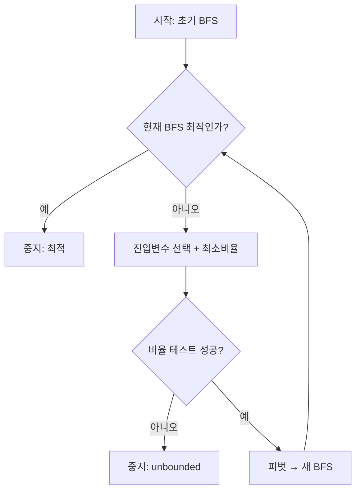

# 의사결정 6강 · 본 (2026-04-13)

**세션 목표:** CH.4 **4.5 심플렉스법 보완** 슬라이드 **1~19** 를 **타블로 관점**으로 잡는다. **1~6:** 기본 타블로·복수 최적·비유계·플로우. **7~14:** **2단계법**(예4·Phase I/II)·식단 (P0)~(P1). **15~19:** 식단 **(P2)(P3)** Phase I 전개·**(P4)** Phase II·**최적 \(z^*=630\)**.

**브랜치:** `DS_decisionMaking`  
**선행 통합 노트:** [`20260406.md`](20260406.md) (CH.4 심플렉스 본문·§8 전개·2단계·식단 전체)  
**2단계(2국면) 개념 브리핑:** **[§9](#briefing-two-phase)** (Phase I·II 공통/차이·표준형·slack/surplus/인위·웹 참고)  
**슬라이드 1~19 전사·수식·데이터 관계:** **[부록](#appendix-simplex45)**  
**슬라이드 캡처 (1~6):** [`assets/simplex45_slide_ex1.png`](assets/simplex45_slide_ex1.png) · [`assets/simplex45_slide_ex2_multiple_opt.png`](assets/simplex45_slide_ex2_multiple_opt.png) · [`assets/simplex45_slide_unbounded_flow.png`](assets/simplex45_slide_unbounded_flow.png)  
**슬라이드 캡처 (7~14):** [`assets/simplex45_slide_p07-08_twophase_problem.png`](assets/simplex45_slide_p07-08_twophase_problem.png) · [`assets/simplex45_slide_p09-10_phase1_tableau.png`](assets/simplex45_slide_p09-10_phase1_tableau.png) · [`assets/simplex45_slide_p11-12_phase1_end_phase2_start.png`](assets/simplex45_slide_p11-12_phase1_end_phase2_start.png) · [`assets/simplex45_slide_p13-14_phase2_opt_diet.png`](assets/simplex45_slide_p13-14_phase2_opt_diet.png)  
**슬라이드 캡처 (15~19·식단):** [`assets/simplex45_slide_p15-16_diet_phase1.png`](assets/simplex45_slide_p15-16_diet_phase1.png) · [`assets/simplex45_slide_p17-18_diet_phase2.png`](assets/simplex45_slide_p17-18_diet_phase2.png) · [`assets/simplex45_slide_p19_diet_optimal.png`](assets/simplex45_slide_p19_diet_optimal.png)

---

## 목차

1. [5강·04/06 노트와의 위치](#1-5강0406-노트와의-위치)
2. [4.5 보완 — 슬라이드 1~19가 다루는 것](#2-45-보완--슬라이드-119가-다루는-것)
3. [예1 — 타블로로 끝까지 (max)](#3-예1--타블로로-끝까지-max)
4. [예2 — 복수 최적해](#4-예2--복수-최적해)
5. [예3·플로우 — 비유계와 절차 요약](#5-예3플로우--비유계와-절차-요약)
6. [슬라이드 7~19 — 2단계법·식단](#6-슬라이드-719--2단계법식단)
7. [04/06 노트와 실습](#7-0406-노트와-실습)
8. [오늘 체크리스트](#8-오늘-체크리스트)
9. [인텔리전스 브리핑 — 2단계 해법(2국면법)](#briefing-two-phase)
10. [부록 · 슬라이드 1~19 전사·타블로 데이터 관계](#appendix-simplex45)

---

## 1. 5강·04/06 노트와의 위치

| 자료 | 역할 |
|------|------|
| `20260330.md` | CH.3 **모형화** (LP 정식화·응용) |
| `20260406.md` | CH.4 **심플렉스** 전체: 표준형·정규형·반복(§7)·**§8 보완**(타블로·특수·2단계·식단·실습 #2·#3) |
| **`0413_6강.md` (본 파일)** | **수업일 04/13** 기준 **4.5 보완 슬라이드 1~19** 요약 + **부록에 통합 전사** |

04/06 파일에 이미 §8 전개가 있으므로, **슬라이드 순서**는 예1→예2→예3·플로우 → **예4·Phase I/II** → **식단 (P0)~(P4)** 이고, 숫자는 **`20260406.md` §8.3~§8.9** 및 **아래 부록** 표와 대조하면 된다.

---

## 2. 4.5 보완 — 슬라이드 1~19가 다루는 것

| 슬라이드 묶음 | 핵심 | `20260406.md` |
|---------------|------|----------------|
| 1 (예1) | slack·정규형·타블로 **4회 반복** → \(z^*=180\) | §8.1·§8.3 |
| 2 (예2) | 최적 타블로에서 **비기저 목적계수 0** → **복수 최적**·대안 BFS | §8.4 |
| 3~4 (예3+플로우) | **비유계**: 개선 가능한 진입열인데 제약열 **전부 \(\le 0\)** · 플로우차트 | §8.2·§8.5 |
| 7~8 (예4) | slack·surplus·**인위**·\(\min(x_5+x_6)\) Phase I 예고 | §8.6·§8.7 |
| 9~12 | Phase I 타블로·**\(w\)행 기저 소거**·\(w^*=0\) → Phase II·**\(z\)행 기저 소거** | §8.7 |
| 13 | Phase II 한 스텝·**\(x_4\) 진입**·최적 \(z^*=30\) | §8.7 |
| 14 | 식단 **(P0)(P1)** · 잉여 | §8.9 |
| 15~16 | 식단 **(P2)(P3)** · 인위 \(x_9,x_{10}\) · Phase I 타블로·피벗 | §8.9 |
| 17~18 | Phase I 종료·**(P4)** · Phase II \(\min z\) · \(z\)행 소거·진입 \(x_6,x_5\) | §8.9 |
| 19 | **최적** \(z^*=630\) · \(\min\) 최적성(비기저 계수 \(\le 0\)) | §8.9 |

**타블로 공통 규약(최대화, 슬라이드와 동일):**  
목적행을 \(z - \sum c_j x_j = \text{RHS}\) 꼴로 두면, **비기저 계수가 모두 \(\ge 0\)** 일 때 최적.

---

## 3. 예1 — 타블로로 끝까지 (max)

\[
\max z = 3x_1 + 2x_2 \quad \text{s.t. } 2x_1+x_2\le 100,\; x_1+x_2\le 80,\; x_1\le 40,\; x\ge 0
\]

**답(슬라이드·노트 일치):** \(x_1^*=20,\; x_2^*=60,\; z^*=180\) (슬랙 \(x_5^*=20\) 등).

**반복 요약:** \(x_1\) 진입 → \(x_5\) 탈락(비율 40) → \(x_2\) 진입 → \(x_3\) 탈락(20) → \(x_5\) 진입 → \(x_4\) 탈락(20).  
**포인트:** 진입열 계수가 **0 또는 음**인 행은 최소비율 후보에서 제외하는 이유를 **한 문장**으로 말할 수 있어야 한다.

---

## 4. 예2 — 복수 최적해

**조건:** 최적 타블로에서 **어떤 비기저 변수**에 대해 **\(z\)행 계수가 0**.

**슬라이드 수치:** \(z^*=280\). BFS 예: \((x_1,x_2,x_3)=(2,0,8)\) 및 대안 \((0,\,8/3,\,8)\) 등 **동일 목적값**.

**시험 한 줄:** “비기저의 감소비용(목적행 계수)이 0이면, 그 방향으로는 1차적으로 \(z\)가 안 바뀌므로 **다른 꼭짓점 최적**이 있을 수 있다.”

---

## 5. 예3·플로우 — 비유계와 절차 요약

**비유계 판정:** 개선 후보 열 \(j\)가 있는데(\(z\)행 \(<0\)), **모든 제약행**에서 \(a_{ij}\le 0\) → 최소비율 실패 → **\(z\to+\infty\)** (max).

**슬라이드 광선:** \(x(\lambda)=(5,0,0,20,0,0)+\lambda(1,0,1,6,0,0)\), \(z(\lambda)=100+9\lambda\).

**플로우:** 최적? → 아니면 진입+비율 → 비율 실패면 **unbounded** → 아니면 피벗 후 다시 최적? — **mermaid 도식은 [부록 D.3](#d3-flowchart)**.

---

## 6. 슬라이드 7~19 — 2단계법·식단

**한 줄:** \(\le\)→slack, \(\ge\)→surplus, 단위기저 안 나오면 **인위** → **Phase I** \(\min\sum\) 인위로 **\(w^*=0\)** 확인 → 인위·\(w\) 제거 → **Phase II** 원 목적로 심플렉스.

| 암기 포인트 | 내용 |
|-------------|------|
| 동치 | 원문제 = 인위가 **전부 0**일 때 |
| Phase I 정리 | **\(w^*=0\)** ⟺ 원문제 **실행가능** |
| \(w\)행 | 처음에 **정규형 아님** → 인위가 서 있는 **제약 행을 더해** 기저 소거 |
| Phase II \(z\)행 | **정규형 아님** → **기저변수 비용×해당 행**을 \(z\)행에 더해 소거 |
| 예4 답 | \(x_1^*=0,\;x_2^*=10,\;z^*=30\) (슬라이드 13) |
| 식단 \(\min\) Phase II | 진입: \(z\)행 **양의** 비기저 계수 / 최적: 비기저 계수 **전부 \(\le 0\)** (슬라이드·§8.9 규약) |
| 식단 최종(19쪽) | \(z^*=630\); 기저–RHS 기준 \(x_6^*=90/4,\;x_5^*=5\) (하단 캡션과 변수명 뒤바뀌면 **타블로 우선**) |

**전사·표:** [부록 §G~§P](#appendix-simplex45).  
**개념·논리(공통/차이·표준형·목적함수):** **[§9 인텔리전스 브리핑](#briefing-two-phase)**.

---

## 7. 04/06 노트와 실습

- **상세 타블로·식단 Phase II 끝까지:** `20260406.md` **§8.7~§8.9**  
- **실습 #2**(타블로)·**#3**(2단계): `20260406.md` **§9**

---

## 8. 오늘 체크리스트

- [ ] 예1 타블로를 **한 번** 손으로 따라 썼다.
- [ ] **최소비율**·**비유계**·**복수 최적** 종료 조건을 구분해 말할 수 있다.
- [ ] **slack / surplus / 인위** 를 제약 **부등호 방향**과 연결해 말할 수 있다.
- [ ] Phase I에서 **\(w\)행 기저 소거**를 왜 하는지 말할 수 있다.
- [ ] **\(w^*=0\)** 과 원문제 실행가능성을 연결할 수 있다.
- [ ] Phase II에서 **\(z\)행 기저 소거** 후 **max** 진입 규칙으로 한 걸음(슬라이드 13)을 따라갈 수 있다.
- [ ] **[부록](#appendix-simplex45)** 슬라이드 1~19(식단 Phase I·II 끝)를 훑었다.
- [ ] **[§9 브리핑](#briefing-two-phase)** 으로 Phase I·II **공통/차이**·slack/surplus/인위 **목적**을 말로 설명할 수 있다.

---

## 9. 인텔리전스 브리핑 — 2단계 해법(2국면법)

**이 절의 목표 (3줄):** (1) 심플렉스는 **초기 기저가능해(BFS)** 가 있어야 같은 절차로 굴러간다. (2) \(\ge\)·\(=\) 때문에 **단위기저가 안 보이면** 인위변수로 **가짜 BFS**를 만든 뒤, **1국면**에서 그 가짜를 0으로 몰아 **진짜 실행가능성**만 판별·획득한다. (3) **2국면**에서야 비로소 **원래 목적 \(z\)** 로 최적화하며, 타블로·피벗 규칙은 같고 **목적행만 바뀐다**.

**1차 출처:** 강의 슬라이드·`20260406.md` §8.6~8.9. **웹 보강(용어·절차 대조):** [IFORS — Two Phase Method](https://ifors.ms.unimelb.edu.au/tutorial/simplex/two_phase.html) · [Waterloo CO350 — Two-Phase (PDF)](https://www.math.uwaterloo.ca/~hwolkowi/henry/teaching/f05/350.f05/L18.pdf) · [JHU — Two Phase handout (PDF)](https://www.ams.jhu.edu/~castello/625.414/Handouts/TwoPhase.pdf)

---

### 9.1 왜 “2단계”인가 — 한 줄 논리

| 질문 | 답(설명력) |
|------|------------|
| 왜 원문제 목적 \(z\)로 바로 안 쓰나? | 인위를 \(z\)에 **벌점(Big M)** 으로 넣는 것도 가능하나, **수치·해석이 지저분**해지기 쉽다. **2단계**는 “실행가능성”과 “최적화”를 **문제 수준에서 분리**한다. |
| 1국면이 하는 일 | **보조 LP:** 인위합 \(w=\sum a_k\) 를 최소화해 **인위를 기저에서 쫓아내고 0으로** 만든다. |
| 2국면이 하는 일 | 인위·\(w\)를 걷어낸 **등식만** 남기고, **원 목적**으로 다시 심플렉스 → **같은 다각면 위**에서 이제는 \(z\) 만 본다. |

교재·튜토리얼에서도 Phase I는 **feasibility**, Phase II는 **optimization with original objective** 로 요약한다([IFORS tutorial](https://ifors.ms.unimelb.edu.au/tutorial/simplex/two_phase.html), [Waterloo 노트](https://www.math.uwaterloo.ca/~hwolkowi/henry/teaching/f05/350.f05/L18.pdf)).

---

### 9.2 표준형 · 정규형 · 기저 — 공통 틀과 “왜”

| 개념 | 정의(슬라이드·CH.4) | 2단계에서의 역할 |
|------|---------------------|------------------|
| **표준형** | 제약 전부 **등식**, 변수 **비음** | slack·surplus·인위를 써서 **행렬 \(Ax=b,\,x\ge0\)** 로 맞춘다. **어느 국면이든 전제**다. |
| **정규형(타블로)** | 목적도 등식, **행마다 기저 1개**(계수 +1·타행 0), 우변 \(\ge0\) | 심플렉스 **한 스텝**이 “피벗 후에도 정규형 유지”라서, **목적행(\(w\) 또는 \(z\))에서 기저변수 계수를 0으로 만드는** 전처리가 반복된다. |
| **기저·BFS** | 기저 변수 = 각 행의 “담당” 변수, 비기저=0 | **1국면** 시작: 인위가 기저 → **진짜 해가 아님**. **1국면 끝:** \(w^*=0\) 이면 인위 비기저·0 → **원 문제의 BFS** 확보. **2국면:** 그 BFS에서 \(z\) 개선. |

**연결:** “정규형 아님!” 주석 = **같은 알고리즘**을 쓰기 전에 **목적행만** 제약행의 선형결합으로 **정리**하는 단계다. 1국면은 **\(w\)행**, 2국면은 **\(z\)행**에 각각 적용된다.

---

### 9.3 변수 변환 — slack · surplus · 인위 (함수별 목적)

| 도입 | 붙는 제약 모양 | 목적(함수) | 기억할 말 |
|------|----------------|------------|-----------|
| **Slack** | \(\le b\) | 부족분을 **더해 등식** | 행 끝에 **+1** 기저 후보 → \(\le\) 만 있으면 **인위 없이** BFS 잡기 쉬움. |
| **Surplus** | \(\ge b\) | 초과분을 **빼서 등식** | **-1** 이라 그 행만으로는 **단위기저 부족** → 보통 **인위 +1** 로 행을 “들쭉날쭉” 맞춤. |
| **인위** | \(\ge\) 행, \(=\) 행 등 | **가짜 기저**를 세워 BFS 출발 | **원문제와 동치 아님**. 1국면에서 **합 0**이 되도록 제거해야 진짜 해. |

**논리적 순서:** 부등호 방향에 따라 slack/surplus를 먼저 쓰고, **여전히 기저가 안 보이면** 인위를 **최소 개수**로 추가한다(행마다 하나가 전형적).

---

### 9.4 Phase I vs Phase II — 공통점과 차이 (핵심 표)

| 항목 | **Phase I (1국면)** | **Phase II (2국면)** |
|------|---------------------|----------------------|
| **풀고 싶은 질문** | 원문제에 **실행가능해가 있나?** 있으면 **BFS 하나**를 내놔라. | 그 BFS에서 출발해 **\(z\) 최적**은 무엇인가. |
| **목적함수** | \(\displaystyle \min w = \sum \text{인위}\) (또는 동등한 보조목적) | **원래** \(\max z\) 또는 \(\min z\) |
| **타블로 목적행** | \(w\) 행 (표기는 교재와 \(w-\sum\cdots=0\) 등 통일) | \(z\) 행 |
| **최적 종료 의미** | \(w^*=0\) ⟺ 실행가능 / \(w^*>0\) ⟺ **비실행가능** | 비기저 감소비용 부호 조건(\(\max\) vs \(\min\) 규약)으로 **\(z\) 최적** |
| **진입 규칙** | **최소화** \(w\) → 슬라이드처럼 \(w\)행 **양의** 비기저를 진입시켜 \(w\) 감소 | **\(\max\)** 는 음의 계수 진입 등 **익숙한 규칙**; **\(\min\)** 은 슬라이드·§8.9처럼 **양의 계수 진입**, 최적은 비기저 **\(\le0\)** |
| **끝난 뒤 할 일** | 인위 열·\(w\)행 **삭제**, 남은 등식 = **원 제약의 BFS 표현** | 그 등식에 **원 목적** 넣고 \(z\)행 **기저 소거** 후 계속 |
| **공통 알고리즘** | **최소비율 → 피벗 → 정규형 유지** | 동일 |

**한 문장 요약:** **같은 엔진(심플렉스), 다른 연료(목적행)** — 1국면은 **가능성**, 2국면은 **이득**.

---

### 9.5 질문 5열 표 (시험·설명용)

| 질문 | 질문의 저의(왜 묻나) | 확인 지표·방법 | 해석 시 주의 | 다음 행동 |
|------|----------------------|----------------|--------------|-----------|
| 1국면 끝 \(w^*\) 는? | 실행가능성 판정 | \(w^*=0\) vs \(>0\) | \(w^*>0\) 이면 **원 제약 모순** | 중단 또는 모델 수정 |
| 왜 \(w\)행을 먼저 손보나? | 정규형 | 기저 인위가 \(w\)행에 남아 있음 | 부호 규약 통일 | \(w \leftarrow w + \sum\) 인위행 |
| 2국면 첫 \(z\)행은? | 기저 비용 0 | \(z\)행에 기저변수 계수 남음 | \(\min/\max\) 혼동 | 기저행×원가 가산 |
| 인위가 기저에 남으면? | 동치성 | Phase I 계속 | 탈출 못 하면 **퇴화** 가능 | 피벗으로 인위 탈락 유도 |
| Big M 과의 관계? | 대안 해법 | 단일 목적에 벌점 | \(M\) 크기 민감 | 2단계가 **수치적으로 깔끔**한 경우 많음 |

---

### 9.6 시험답안형·한 줄 정리

- **2국면법:** \(\ge/\!=\) 때문에 **BFS가 안 보일 때**, (1) **\(\min\sum\) 인위**로 실행가능·BFS를 얻고 (2) **원 목적**으로 최적화한다.  
- **Phase I vs II:** **같은** 표준형·피벗·비율 / **다른** 목적함수·목적행·종료 해석·진입·최적 부호(\(\min\) 시).  
- **slack·surplus·인위:** \(\le\) 는 **여유**, \(\ge\) 는 **잉여(+인위)**, \(=\) 는 **인위**로 **기저 슬롯**을 만든다.

---

### 9.7 웹 그라운딩 메모 (과목 외 참고)

위 링크는 **교재·슬라이드를 대체하지 않고**, “Phase I = feasibility, Phase II = original objective” 같은 **영어권 표준 요약**과 **타블로 전개 예**를 빠르게 대조할 때 쓴다. 본 강의 **부호·표기**는 **홍익대 슬라이드·`20260406.md`** 를 최우선으로 맞출 것.

---

## 부록 · 4.5 심플렉스 보완 슬라이드 1~19 전사·데이터 관계

**연계:** `20260406.md` **§8.2~§8.9** · 수치는 교재·원표와 최종 대조.

---

### A. 타블로를 “데이터”로 보는 공통 모델 (슬라이드 1~6 기준)

#### A.1 행·열 의미

| 열 그룹 | 의미 |
|--------|------|
| 첫 열(선택) | \(z\) 행 식별용 계수 **1** / 제약행은 **0** — 슬라이드에 따라 생략·통합 가능 |
| 결정·슬랙 변수 열 | \(x_1,\ldots,x_n\) 각 열에 **해당 변수의 계수** |
| **RHS** | 등식 우변 상수 |
| **비율** | 진입열 \(j\) 고정 시, 제약행 \(i\) 에 대해 \(\theta_i = \mathrm{RHS}_i / a_{ij}\) (단 \(a_{ij}>0\) 만) |

**기저(basis):** 각 제약행마다 “그 행에서 계수가 1이고 다른 기저 행에서는 0”인 변수가 **기저변수**. 타블로 왼쪽 **기저** 열은 **행 인덱스 → 변수 이름** 매핑이다.

#### A.2 한 번의 반복(피벗)의 데이터 흐름

1. **진입열 \(j\)**: 최대화·\(z - \sum c_j x_j = \text{RHS}_z\) 표기에서, \(z\)행의 **비기저** 계수가 **음수**인 열 중 하나(보통 가장 음수).
2. **비율**: 모든 제약행 \(i\)에 대해 \(a_{ij}>0\) 인 경우만 \(\mathrm{RHS}_i/a_{ij}\) 계산 → **최소**인 행 \(r\) = **탈락행**.
3. **피벗 원소** \(p = a_{rj}\).
4. **행 연산** (가우스–조던):
   - 탈락행 \(r\) ← (행 \(r\)) \(/\, p\)
   - 모든 다른 행 \(i\neq r\): (행 \(i\)) ← (행 \(i\)) \(-\, a_{ij}\times\)(새 행 \(r\))
5. **기저 갱신**: 행 \(r\)의 기저변수가 진입변수 \(x_j\)로 교체.

**불변식:** 각 제약행은 여전히 LP의 **등식 한 줄**을 나타내며, 기저는 **단위벡터** 형태를 유지한다(정규형).

#### A.3 최적·비유계·복수 최적 (슬라이드 규칙 기준, max)

| 상태 | \(z\)행(비기저 계수) | 제약 쪽 진입열 |
|------|---------------------|----------------|
| **최적** | 모두 \(\ge 0\) | — |
| **개선 가능** | 어떤 열 \(j\)가 \(<0\) | 그 열이 진입 후보 |
| **비유계** | 어떤 \(j\)가 \(<0\) (개선 가능) | **모든** 제약행에서 \(a_{ij}\le 0\) → 비율 없음 |
| **복수 최적** | **최적**인데 어떤 비기저 \(k\)의 계수가 **0** | \(x_k\) 를 한 번 더 진입시켜도 \(z\) 불변 → 다른 BFS |

---

### B. 슬라이드 1 — 예제 1: 타블로로 최적해 (max)

#### B.1 전사(문제)

\[
\max z = 3x_1 + 2x_2
\]

\[
\begin{aligned}
2x_1 + x_2 &\le 100 \\
x_1 + x_2 &\le 80 \\
x_1 &\le 40 \\
x_1,x_2 &\ge 0
\end{aligned}
\]

**정규형(여유 \(x_3,x_4,x_5\)):**

\[
\begin{aligned}
z - 3x_1 - 2x_2 &= 0 \\
2x_1 + x_2 + x_3 &= 100 \\
x_1 + x_2 + x_4 &= 80 \\
x_1 + x_5 &= 40
\end{aligned}
\]

#### B.2 타블로 시퀀스와 데이터 관계

**초기 기저:** \((x_3,x_4,x_5)\) — 각 행에 slack이 1로 떠 있음.

| 단계 | 진입 | 탈락(최소비율) | 피벗 \(p\) | \(z\)행 RHS | 해석 |
|:---:|:---:|:---:|:---:|:---:|:---|
| 1 | \(x_1\) (\(z\)행 \(-3\)) | \(x_5\): \(\min(50,80,40)=40\) | \(x_5\)행·\(x_1\)열 **1** | 120 | \(x_1\)이 40까지 올라가면 \(x_5=0\) |
| 2 | \(x_2\) (\(-2\)) | \(x_3\): \(20/1=20\) | \(x_3\)행·\(x_2\)열 **1** | 160 | \(x_4\)행은 \(x_2\) 계수 1이나 RHS 40으로 병목 아님 |
| 3 | \(x_5\) (\(-1\)) | \(x_4\): \(20/1=20\) | \(x_4\)행·\(x_5\)열 **1** | **180** | \(x_2\)행은 \(x_5\) 계수 \(-2\) → 비율 제외 |

**최종 타블로(최적):** \(z\)행 비기저 \((x_3,x_4,x_5)\) 계수 \((1,1,0)\) 전부 \(\ge 0\).

**답:** \(x_1^*=20,\; x_2^*=60,\; x_3^*=0,\; x_4^*=0,\; x_5^*=20,\; z^*=180\).

**검증(원문제):** \(2(20)+60=100\), \(20+60=80\), \(x_1=20\le 40\) → 제약 포화·일관.

---

### C. 슬라이드 2 — 예제 2: 복수 최적해 (max)

#### C.1 전사(문제)

\[
\max z = 60x_1 + 35x_2 + 20x_3
\]

\[
\begin{aligned}
8x_1+6x_2+x_3 &\le 48 \\
4x_1+3x_2+\tfrac{3}{2}x_3 &\le 20 \\
2x_1+\tfrac{3}{2}x_2+\tfrac{1}{2}x_3 &\le 8 \\
x_2 &\le 5 \\
x_1,x_2,x_3 &\ge 0
\end{aligned}
\]

**슬랙 \(x_4,\ldots,x_7\)** 로 등식화(슬라이드와 동일).

#### C.2 반복과 “0 계수”의 의미

| 반복 | 진입 | 탈락 | 피벗 요지 | 비고 |
|:---:|:---:|:---:|:---:|:---|
| 1 | \(x_1\) (\(-60\)) | \(x_6\) | \(x_6\)행 \(x_1\) 계수 **2** | 비율 \(\min(6,5,4,-)=4\) |
| 2 | \(x_3\) (\(-5\)) | \(x_5\) | \(x_5\)행 \(x_3\) 계수 **1/2** | 비율 \(4/(1/2)=8\) 등 |
| 3 | (최적성 만족하나) | — | \(z\)행 **\(x_2\) 계수 = 0** | 비기저 \(x_2\) |

**최적 BFS 1:** \((x_1,x_2,x_3,x_4,x_5,x_6,x_7)=(2,0,8,24,0,0,5)\), \(z=280\).

**데이터 관계:** 최적 타블로에서 **비기저 \(x_2\)의 감소비용(= \(z\)행 계수)이 0**이면, \(x_2\)를 양으로 올려도 **\(z\)의 1차 변화는 0**. 가능영역이 **퇴화하지 않으면** 같은 \(z\)를 주는 **인접 꼭짓점**으로 피벗 가능.

**추가 피벗:** \(x_2\) 진입, \(x_1\) 탈락(비율 \(2/(3/4)=8/3\) vs \(5/1=5\) → 최소 \(8/3\)).

**대안 BFS:** \((0,\,8/3,\,8,\,56/3,\,0,\,0,\,7/3)\), **동일** \(z=280\).

**구조:** 두 BFS의 **볼록 결합**도 최적(선분 위 최적).

---

### D. 슬라이드 3~4 — 예제 3: 비유계 + 플로우차트

#### D.1 비유계 타블로 전개 요지

초기 이후 두 번 피벗을 거친 **최종 관찰 타블로**에서:

- \(z\)행: \([1,\,0,\,2,\,\mathbf{-9},\,0,\,12,\,4\,|\,100]\) 꼴 → **\(x_3\) 진입 후보**(계수 \(-9<0\)).
- 제약행들의 **\(x_3\) 열**이 **모두 \(\le 0\)** (예: \(-6,\,-1\)).

**데이터 관계:** 진입변수 \(x_3=\theta\)를 키우면, 기저변수는

\[
x_{\text{기저},i} = \mathrm{RHS}_i - a_{i3}\theta
\]

여기서 \(a_{i3}\le 0\) 이면 \(\theta\uparrow\) 해도 **다른 기저가 음수로 안 떨어짐** → \(\theta\to\infty\) 허용 → **\(z \to +\infty\)** (max).

#### D.2 슬라이드의 광선(ray) 표현

\[
x(\lambda) = (5,0,0,20,0,0) + \lambda(1,0,1,6,0,0),\quad \lambda\ge 0
\]

\[
z(\lambda) = 100 + 9\lambda
\]

**의미:** **실행가능 방향** \((1,0,1,6,0,0)\) 이 목적을 **선형적으로 증가**시키고, \(\lambda\) 는 제약에 막히지 않음 → **unbounded LP**.

#### D.3 플로우차트(슬라이드 4)와 의사코드 대응

**구현 시 `비율 테스트 성공`:** 진입열 \(j\)에 대해 **적어도 하나**의 제약행 \(i\)가 \(a_{ij}>0\) 인가?  
아니면 **전부 \(a_{ij}\le 0\)** → `unbounded`.

---

### E. 구현 체크리스트 (타블로 엔진, max 기준)

- [ ] \(z\)행을 **항상 같은 부호 규약**으로 두었는가? (예: \(z - \sum c_j x_j = \text{RHS}\))
- [ ] 비율은 **\(a_{ij}>\varepsilon\)** 인 행만 쓰는가? (부동소수 시 0 판정)
- [ ] 피벗 후 **기저 열**이 단위벡터로 유지되는가?
- [ ] 최적: **모든 감소비용 \(\ge 0\)** (max, 위 규약) / **\(\min\)** 이면 Phase II는 **비기저 \(\le 0\)** (부록 §P·§8.9)
- [ ] 비유계: **개선 가능한 열**이 있는데 **양의 계수가 한 줄도 없음**
- [ ] 복수 최적: 최적 상태에서 **감소비용 0인 비기저** 존재

---

### F. 전처리 규칙 — slack / surplus / 인위 (슬라이드 7~14)

| 제약 형태 | 도입 변수 | 기저 확보 메모 |
|-----------|-----------|----------------|
| \(\sum a_j x_j \le b\) | **slack** \(s\ge 0\) (더하기) | 행에 단위 \(+1\) |
| \(\sum a_j x_j \ge b\) | **surplus** \(e\ge 0\) (빼기) | 단위기저가 바로 안 보일 수 있음 → **인위** 검토 |
| \(\sum a_j x_j = b\) | (등식) | 보통 **인위**로 행마다 \(+1\) 기저 |

**동치 조건:** 인위 \(a\)가 들어간 보조문제는 원문제와 같으려면 최종적으로 **\(a=0\)** (슬라이드: 앞문제와 동등 \(\Leftrightarrow\) \(x_5=x_6=0\)).

**Phase I:** \(\displaystyle \min w = \sum_k a_k\) (인위들의 합).  
**정리(슬라이드):** 원 LP가 **실행가능할 필요충분조건**은 **\(w^*=0\)**.

**참고:** Phase I·\(\min z\) 일 때 **진입·최적 부호**는 `20260406.md` **§8.9** 표와 통일.

---

### G. 슬라이드 7~8 — 예4 원문제 → 표준형 → 인위

#### G.1 원문제

\[
\max z = 2x_1 + 3x_2
\]

\[
\begin{aligned}
\tfrac{1}{2}x_1 + \tfrac{1}{4}x_2 &\le 4 \\
x_1 + 3x_2 &\ge 20 \\
x_1 + x_2 &= 10 \\
x_1,x_2 &\ge 0
\end{aligned}
\]

#### G.2 slack·surplus (\(x_3,x_4\))

\[
\begin{aligned}
\tfrac{1}{2}x_1 + \tfrac{1}{4}x_2 + x_3 &= 4 \\
x_1 + 3x_2 - x_4 &= 20 \\
x_1 + x_2 &= 10 \\
x_1,x_2,x_3,x_4 &\ge 0
\end{aligned}
\]

#### G.3 인위 \(x_5,x_6\)

\[
\begin{aligned}
\tfrac{1}{2}x_1 + \tfrac{1}{4}x_2 + x_3 &= 4 \\
x_1 + 3x_2 - x_4 + x_5 &= 20 \\
x_1 + x_2 + x_6 &= 10 \\
x_1,\ldots,x_6 &\ge 0
\end{aligned}
\]

**불릿 요지:** 인위는 기저를 억지로 잡기 위한 것; 보조문제는 **인위 0**일 때만 원문제와 동치 → **\(\min (x_5+x_6)\)** 가 Phase I.

---

### H. 슬라이드 9~10 — Phase I: \(\min w = x_5+x_6\)

**타블로용 목적행:** \(w - x_5 - x_6 = 0\). 기저 \(x_3,x_5,x_6\) 인데 \(w\)행에 \(x_5,x_6\) 계수 \(-1\) → **정규형 아님**.

**소거:** \(w\text{행} \leftarrow w\text{행} + (x_5\text{ 행}) + (x_6\text{ 행})\) → \(w\)행 \([1,\,2,\,4,\,0,\,-1,\,0,\,0\,|\,30]\) 꼴(요지).

**첫 피벗:** \(w\)행에서 **양의 계수** 비기저 진입(최소화 규칙) — \(x_2\) (4). 비율 \(\min(16,\,20/3,\,10)=20/3\) → **\(x_5\) 탈락**, 피벗 **3**.

| 기저 | \(w\) | \(x_1\) | \(x_2\) | \(x_3\) | \(x_4\) | \(x_5\) | \(x_6\) | RHS | 비율 |
|:---:|:---:|:---:|:---:|:---:|:---:|:---:|:---:|:---:|:---:|
| \(w\) | 1 | 2 | 4 | 0 | -1 | 0 | 0 | 30 | |
| \(x_3\) | 0 | 1/2 | 1/4 | 1 | 0 | 0 | 0 | 4 | \(4/(1/4)=16\) |
| \(x_5\) | 0 | 1 | **3**\* | 0 | -1 | 1 | 0 | 20 | \(20/3\) |
| \(x_6\) | 0 | 1 | 1 | 0 | 0 | 0 | 1 | 10 | \(10/1=10\) |

---

### I. 슬라이드 11~12 — Phase I 종료 → Phase II 식

**최종 Phase I (최적!):** \(w\)행 RHS **0**, \(w\)행 비기저 계수 조건 만족, \(x_5,x_6\) 비기저.

\[
\max z - 2x_1 - 3x_2 = 0
\]

\[
\begin{aligned}
x_3 - \tfrac{1}{8}x_4 &= \tfrac{1}{4} \\
x_2 - \tfrac{1}{2}x_4 &= 5 \\
x_1 + \tfrac{1}{2}x_4 &= 5 \\
x_1,x_2,x_3,x_4 &\ge 0
\end{aligned}
\]

**\(z\)행 기저 소거:** \(\text{새 }z\text{행} \leftarrow z\text{행} + 2\times(x_1\text{ 행}) + 3\times(x_2\text{ 행})\).

---

### J. 슬라이드 13 — Phase II 타블로·최적

| 기저 | \(z\) | \(x_1\) | \(x_2\) | \(x_3\) | \(x_4\) | RHS | 비율 |
|:---:|:---:|:---:|:---:|:---:|:---:|:---:|:---:|
| \(z\) | 1 | 0 | 0 | 0 | **-1/2** | 25 | |
| \(x_3\) | 0 | 0 | 0 | 1 | -1/8 | 1/4 | |
| \(x_2\) | 0 | 0 | 1 | 0 | -1/2 | 5 | |
| \(x_1\) | 0 | 1 | 0 | 0 | **1/2**\* | 5 | \(5/(1/2)=10\) |

**진입:** \(x_4\). **탈락:** \(x_1\), 피벗 **1/2**.

**답:** \(x_1^*=0,\; x_2^*=10,\; x_3^*=3/2,\; x_4^*=10,\; z^*=30\).

---

### K. 슬라이드 14 — 식단 (P0)→(P1)

\[
\min z = 35x_1 + 30x_2 + 60x_3 + 50x_4 + 27x_5 + 22x_6
\]

\[
\begin{aligned}
x_1 + 2x_3 + 2x_4 + x_5 + 2x_6 &\ge 50 \\
x_2 + 3x_3 + x_4 + 3x_5 + 2x_6 &\ge 60 \\
x_1,\ldots,x_6 &\ge 0
\end{aligned}
\]

**(P1)** 잉여 \(x_7,x_8\):

\[
\begin{aligned}
x_1 + 2x_3 + 2x_4 + x_5 + 2x_6 - x_7 &= 50 \\
x_2 + 3x_3 + x_4 + 3x_5 + 2x_6 - x_8 &= 60 \\
x_1,\ldots,x_8 &\ge 0
\end{aligned}
\]

**이어서:** 인위·Phase I·Phase II 전개는 **[§N~§P](#n-diet-p15)** · 교재 정합은 `20260406.md` **§8.9**.

---

### N. 슬라이드 15~16 — 식단 (P2)(P3) · Phase I 타블로

#### N.1 (P2) 인위 \(x_9,x_{10}\) 포함

\[
\begin{aligned}
x_1 + 2x_3 + 2x_4 + x_5 + 2x_6 - x_7 + x_9 &= 50 \\
x_2 + 3x_3 + x_4 + 3x_5 + 2x_6 - x_8 + x_{10} &= 60 \\
x_1,\ldots,x_{10} &\ge 0
\end{aligned}
\]

\(x_7,x_8\): 잉여 · \(x_9,x_{10}\): 인위.

#### N.2 (P3) Phase I

\[
\min w = x_9 + x_{10}
\]

제약은 (P2)와 동일.

#### N.3 타블로 — \(w\)행 기저 소거 전

목적행 \(w - x_9 - x_{10} = 0\). 기저 \(x_9,x_{10}\) 이므로 \(w\)행에 \(x_9,x_{10}\) 계수 **-1** → **정규형 아님**.

| 기저 | \(w\) | \(x_1\) | \(x_2\) | \(x_3\) | \(x_4\) | \(x_5\) | \(x_6\) | \(x_7\) | \(x_8\) | \(x_9\) | \(x_{10}\) | RHS |
|:---:|:---:|:---:|:---:|:---:|:---:|:---:|:---:|:---:|:---:|:---:|:---:|:---:|
| \(w\) | 1 | 0 | 0 | 0 | 0 | 0 | 0 | 0 | 0 | -1 | -1 | 0 |
| \(x_9\) | 0 | 1 | 0 | 2 | 2 | 1 | 2 | -1 | 0 | 1 | 0 | 50 |
| \(x_{10}\) | 0 | 0 | 1 | 3 | 1 | 3 | 2 | 0 | -1 | 0 | 1 | 60 |

#### N.4 소거 후·첫 피벗

\(w\text{행} \leftarrow w\text{행} + (x_9\text{ 행}) + (x_{10}\text{ 행})\).

| 기저 | \(w\) | \(x_1\) | \(x_2\) | \(x_3\) | \(x_4\) | \(x_5\) | \(x_6\) | \(x_7\) | \(x_8\) | \(x_9\) | \(x_{10}\) | RHS | 비율 |
|:---:|:---:|:---:|:---:|:---:|:---:|:---:|:---:|:---:|:---:|:---:|:---:|:---:|:---:|
| \(w\) | 1 | 1 | 1 | 5 | 3 | 4 | 4 | -1 | -1 | 0 | 0 | 110 | |
| \(x_9\) | 0 | 1 | 0 | 2 | 2 | 1 | 2 | -1 | 0 | 1 | 0 | 50 | \(50/2=25\) |
| \(x_{10}\) | 0 | 0 | 1 | **3**\* | 1 | 3 | 2 | 0 | -1 | 0 | 1 | 60 | \(60/3=20\) |

**Phase I (min):** \(w\)행에서 **양의** 비기저 계수 → **\(x_3\) 진입**. 비율 \(\min(25,20)=20\) → **\(x_{10}\) 탈락**, 피벗 **3**.

#### N.5 둘째 타블로(슬라이드 16)

| 기저 | \(w\) | \(x_1\) | \(x_2\) | \(x_3\) | \(x_4\) | \(x_5\) | \(x_6\) | \(x_7\) | \(x_8\) | \(x_9\) | \(x_{10}\) | RHS | 비율 |
|:---:|:---:|:---:|:---:|:---:|:---:|:---:|:---:|:---:|:---:|:---:|:---:|:---:|:---:|
| \(w\) | 1 | 1 | -2/3 | 0 | 4/3 | -1 | 2/3 | -1 | 2/3 | 0 | -5/3 | 10 | |
| \(x_9\) | 0 | 1 | -2/3 | 0 | **4/3**\* | -1 | 2/3 | -1 | 2/3 | 1 | -2/3 | 10 | \(10/(4/3)=15/2\) |
| \(x_3\) | 0 | 0 | 1/3 | 1 | 1/3 | 1 | 2/3 | 0 | -1/3 | 0 | 1/3 | 20 | \(20/(1/3)=60\) |

**진입:** \(x_4\) (\(w\)행 계수 \(4/3>0\)). **탈락:** \(x_9\) (비율 최소), 피벗 **\(4/3\)**. 이후 반복으로 \(w^*=0\)·인위 비기저까지 진행(슬라이드·§8.9 원표).

---

### O. 슬라이드 17~18 — Phase I 종료·(P4)·Phase II \(\min z\)

#### O.1 Phase I 최종 타블로(요지)

기저 \(x_4,x_3\) (슬라이드). \(w\)행: \([1,\,0,\ldots,0,\,-1,\,-1\,|\,0]\) 꼴 → **\(w^*=0\)**, \(x_9,x_{10}\) 비기저 → 원 **식단 문제 실행가능**.

| \(w\)행 | \(x_1\) | \(x_2\) | \(x_3\) | \(x_4\) | \(x_5\) | \(x_6\) | \(x_7\) | \(x_8\) | \(x_9\) | \(x_{10}\) | RHS |
|:---:|:---:|:---:|:---:|:---:|:---:|:---:|:---:|:---:|:---:|:---:|:---:|
| 1 | 0 | 0 | 0 | 0 | 0 | 0 | 0 | 0 | -1 | -1 | 0 |

제약(기저 행, 인위 열 제거 후):

\[
\begin{aligned}
\tfrac{3}{4}x_1 - \tfrac{1}{2}x_2 + x_4 - \tfrac{3}{4}x_5 + \tfrac{1}{2}x_6 - \tfrac{3}{4}x_7 + \tfrac{1}{2}x_8 &= \tfrac{30}{4} \\
-\tfrac{1}{4}x_1 + \tfrac{1}{2}x_2 + x_3 + \tfrac{5}{4}x_5 + \tfrac{1}{2}x_6 + \tfrac{1}{4}x_7 - \tfrac{1}{2}x_8 &= \tfrac{70}{4}
\end{aligned}
\]

#### O.2 (P4) Phase II

\[
\min z = 35x_1 + 30x_2 + 60x_3 + 50x_4 + 27x_5 + 22x_6
\]

위 제약 + \(x_1,\ldots,x_8\ge 0\) (잉여·결정만).

**타블로:** \(z - 35x_1 - \cdots - 22x_6 = 0\). 기저 \(x_4,x_3\) 인데 \(z\)행에 \(x_3,x_4\) 계수가 남음 → **정규형 아님**.

**소거(슬라이드):** \(\;z\text{행} \leftarrow z\text{행} + 50\times(x_4\text{ 행}) + 60\times(x_3\text{ 행})\;\)  
(기저 \(x_4,x_3\) 의 **원래 목적 계수**가 각각 50, 60이므로.)

**소거 후 \(z\)행(요지):** \([1,\,-50/4,\,-25,\,0,\,0,\,42/4,\,33,\,-90/4,\,-5\,|\,570/4]\).

#### O.3 Phase II 진입·피벗(18쪽)

**규칙 (\(\min\)):** \(z\)행에서 **양의** 비기저 계수 → 진입.

1. **\(x_6\) 진입** (계수 33). 비율: \((30/4)/(1/2)=15\) vs \((70/4)/(1/2)=35\) → **\(x_4\) 탈락**, 피벗 **\(1/2\)** (\(x_4\) 행).
2. 다음 타블로에서 **\(x_5\) 진입** (계수 60). 비율로 **\(x_3\) 탈락**, 피벗 **2** (\(x_3\) 행).

---

### P. 슬라이드 19 — 최종 타블로·최적 (\(\min z\))

#### P.1 최종 \(z\)행(슬라이드)

| 기저 | \(z\) | \(x_1\) | \(x_2\) | \(x_3\) | \(x_4\) | \(x_5\) | \(x_6\) | \(x_7\) | \(x_8\) | RHS |
|:---:|:---:|:---:|:---:|:---:|:---:|:---:|:---:|:---:|:---:|:---:|
| \(z\) | 1 | -32 | -22 | -30 | -36 | 0 | 0 | -3 | -8 | **630** |
| \(x_6\) | 0 | … | … | … | … | 0 | 1 | … | … | **90/4** |
| \(x_5\) | 0 | … | … | … | … | **1** | 0 | … | … | **5** |

(중간 계수는 원 슬라이드·`20260406.md` §8.9 표와 맞출 것.)

#### P.2 최적성 (\(\min\), 슬라이드·§8.9 규약)

\(z - \sum_j c_j x_j = \text{RHS}\) 꼴에서 **비기저 변수 열의 계수가 모두 \(\le 0\)** 이면 더 이상 \(z\) 를 **줄일** 수 없음 → **최적**.

#### P.3 최적해 읽기

- **기저 행의 RHS** = 해당 기저변수 값. 슬라이드 기준 **\(x_6\) 행 우변 \(90/4\)** · **\(x_5\) 행 우변 \(5\)** →  
  \(x_6^* = 90/4 = 22.5,\; x_5^* = 5\), 나머지 **결정·잉여** 변수 0 (BFS). **\(z^* = 630\)**.
- 슬라이드 하단 문장이 \(x_5,x_6\) 값을 **바꿔 적은** 경우가 있음 → **항상 타블로 «기저» 열–행–RHS** 로 확인.

---

### L. 2단계·식단 — 데이터 관계 요약(코드 관점)

1. Phase I 목적행은 **기저 인위 열을 0으로 만든 뒤** 심플렉스 시작.  
2. Phase I 종료: \(w^*=0\) 이고 인위 비기저 → 인위·\(w\) **삭제**.  
3. Phase II 첫 \(z\)행은 **기저변수 열 계수 0**이 되도록 **원가(목적계수)×해당 제약행**을 가산.  
4. **\(\min z\) Phase II:** 진입 = \(z\)행 **양**비기저 / 최적 = 비기저 **전부 \(\le 0\)** (`20260406.md` §8.9와 동일 규약).

---

### M. 슬라이드 캡처 목록 (`assets/`)

| 파일 | 내용 |
|------|------|
| `simplex45_slide_ex1.png` | 예1 타블로 |
| `simplex45_slide_ex2_multiple_opt.png` | 예2 복수 최적 |
| `simplex45_slide_unbounded_flow.png` | 예3 비유계 + 플로우 |
| `simplex45_slide_p07-08_twophase_problem.png` | 예4·인위 |
| `simplex45_slide_p09-10_phase1_tableau.png` | 예4 Phase I 시작 |
| `simplex45_slide_p11-12_phase1_end_phase2_start.png` | 예4 Phase I 끝·Phase II |
| `simplex45_slide_p13-14_phase2_opt_diet.png` | 예4 Phase II·식단 (P0)(P1) |
| `simplex45_slide_p15-16_diet_phase1.png` | 식단 (P2)(P3)·Phase I |
| `simplex45_slide_p17-18_diet_phase2.png` | 식단 Phase I 끝·(P4)·Phase II |
| `simplex45_slide_p19_diet_optimal.png` | 식단 최종 최적 |

---

*1차 출처: 2026-04-13 수업 슬라이드 「4.5 심플렉스법 보완」·`20260406.md`.*
